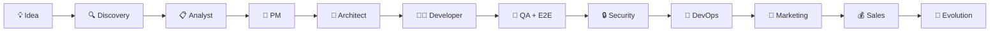
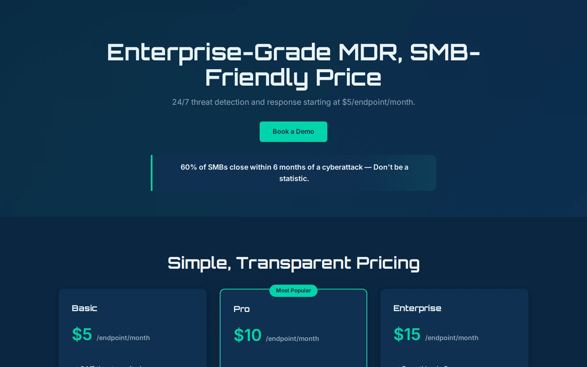
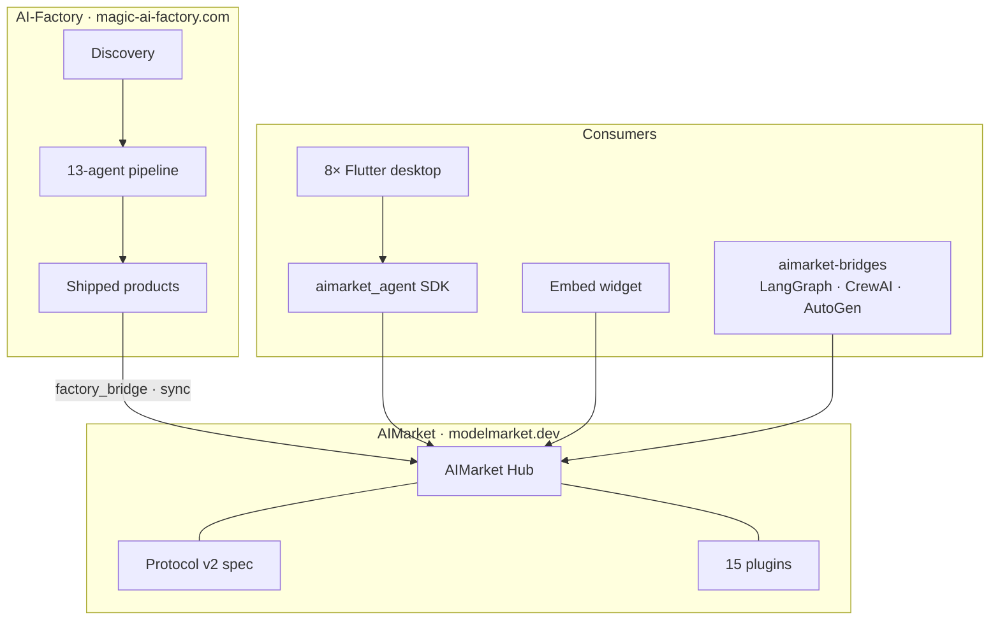

# AI-Factory

<p align="center">
  <strong>MIT · self-hosted · idea → shippable web product</strong><br/>
  Part of the <a href="https://magic-ai-factory.com">AICOM open agent economy</a>.<br/>
  <strong>Live demo:</strong> <a href="https://magic-ai-factory.com">magic-ai-factory.com</a> ·
  <strong>Community:</strong> <a href="https://t.me/next_agent_market_bot">Ask Castor (bot)</a> ·
  <a href="https://t.me/just_for_agents">Castor channel</a> ·
  <a href="https://discord.gg/aimarket">Discord · Pollux</a> ·
  <a href="https://alexar76.github.io/theoros/">THEOROS canon</a><br/>
  <a href="https://modeldev.modelmarket.dev">Ecosystem landing</a> · <a href="#demo-video">Demo video</a> · <a href="#build-replays">Build Replays</a> · <a href="#factory-hold">Factory hold</a> · <a href="#gallery">Gallery</a> · <a href="#factory-iq">Factory IQ</a> · <a href="#ecosystem-companions">Ecosystem</a> · <a href="#quick-start">Quick start</a>
</p>

<!-- aicom-readme-badges -->
<p align="center">
  <a href="https://github.com/alexar76/aicom/actions/workflows/ci.yml"></a>
  
  <a href="docs/badges/coverage.svg"></a>
  <a href="LICENSE"></a>
</p>
<!-- /aicom-readme-badges -->

<p align="center">
  <strong>Discussions:</strong>
  <a href="https://github.com/alexar76/aicom/discussions">Roadmap · Q&amp;A · Show &amp; Tell</a>
  · <strong>Announcements:</strong>
  <a href="https://github.com/alexar76/aicom/discussions/categories/announcements">Roadmap updates</a>
</p>


> ### 🔴 Live on Base **MAINNET** (demo) — not a testnet
> The full contract suite — escrow, lottery, capability-NFT, **ACEX** (vault/registry/lending/AMM/
> audit-pool), and the ZK verifier — is **deployed and source-verified on Base MAINNET**
> (chainId **8453**, real **USDC** + **ETH**, small demo sums). **Every deploy + transaction is
> documented, with Basescan links, in → [`docs/onchain-journal.md`](docs/onchain-journal.md).**
> This is **not** Base Sepolia / a testnet and **not** the local UNI/anvil simulation.
>
> A general **production launch for users** is still gated on operator items tracked in
> [`docs/known-issues.md`](docs/known-issues.md) (KI-3 load test, KI-4 multisig; KI-2 external
> audit **waived for pet project** — see [`docs/pet-project-trust.md`](docs/pet-project-trust.md)).
> KI-1 ZK trusted-setup **resolved** (PLONK). The self-hosted pipeline + storefront are usable today.

**AI-Factory turns one prompt into a shippable web product** — a multi-agent pipeline (research → design → code → QA → deploy) with a built-in storefront, payment rails, and live observability. Self-hosted: your keys, your infra, your data.

<p align="center">
  
</p>

<p align="center">
  <a href="https://youtu.be/Gg9a52-ZbNA">
    
  </a>
</p>
<p align="center"><em>↑ <a href="https://youtu.be/Gg9a52-ZbNA">Watch on YouTube</a> — same hero clip as <a href="https://magic-ai-factory.com">magic-ai-factory.com</a></em></p>

---

<h2 id="demo-video">▶ Demo video</h2>

**Primary:** [YouTube — Idea → agents → shippable product](https://youtu.be/Gg9a52-ZbNA) (embedded on the [live homepage](https://magic-ai-factory.com) hero).

GitHub’s README viewer **does not embed YouTube iframes** — use the thumbnail above or open the link. For an offline / admin UI clip, use the **MP4** below (recorded from production Admin).

<p align="center">
  <video src="docs/gallery/recordings/pipeline-demo-latest.mp4" controls playsinline width="920">
    <a href="docs/gallery/recordings/pipeline-demo-latest.mp4">Download admin pipeline demo (.mp4)</a>
  </video>
</p>

| Where | How |
|-------|-----|
| **YouTube** | [youtu.be/Gg9a52-ZbNA](https://youtu.be/Gg9a52-ZbNA) — marketing walkthrough |
| **Live site** | [magic-ai-factory.com](https://magic-ai-factory.com) — hero embed + guest landing try-out |
| **Admin replay** | Login → **Live Monitor** or **Settings** → Demo replay (when published) |
| **Public API** | `GET /api/public/pipeline-demo-replay` (uploaded clip, no auth) |
| **Download** | [.mp4](docs/gallery/recordings/pipeline-demo-latest.mp4) · [.webm](docs/gallery/recordings/pipeline-demo-latest.webm) |
| **Regenerate admin clip** | `python scripts/record_pipeline_demo_video.py` → `python scripts/sync_demo_replay_from_recording.py` |

---

<h2 id="factory-iq">🧠 Factory IQ — watch the factory get smarter</h2>

**A self-learning autonomous factory, made visible.** Realized **Expected Value per build** over
time (live vs a frozen-control cohort — the gap *is* the value of learning), the validated
**playbook** the agents distill from their own outcomes, ship-rate, cost, and AI-gatekeeper
calibration. The number should climb.

| | |
|---|---|
| **Public demo** | **[https://magic-ai-factory.com/iq](https://magic-ai-factory.com/iq)** |
| **API** | `GET /api/analytics/factory-iq` (snapshot) · `GET /api/public/factory-iq` (gated by `AIFACTORY_PUBLIC_IQ=1`) |
| **How it works** | [docs/effective-self-learning.md](docs/effective-self-learning.md) — EV objective, 4 learning loops, distilled playbook, calibration, proof |
| **Source** | [`pulse-terminal`](https://github.com/alexar76/pulse-terminal) · [`acex`](https://github.com/alexar76/acex) |

<h2 id="ecosystem-companions">📢 Ecosystem companions</h2>

<table>
<tr>
<td>

**Separate repos — not part of the factory install.** Optional satellites around the same AIMarket economy. Full map: **[modeldev.modelmarket.dev](https://modeldev.modelmarket.dev)** · [knowledge base](docs/ecosystem/knowledge-base.md).

| | One line | Links |
|---|----------|-------|
| 🛡️ **ARGUS-3** | Demand-side agent · WARDEN MCP firewall · crypto off by default | [landing](https://magic-ai-factory.com/argus/) · [`argus`](https://github.com/alexar76/argus) · `npm i -g argus-warden` |
| 🎰 **Lottery** | On-chain oracle draws · machine UBI for mesh agents | [live](https://lottery.modelmarket.dev/) · [`lottery`](https://github.com/alexar76/lottery) |
| 👽 **Alien Monitor** | 3D graph of Hub, Factory, chain metrics | [live](https://magic-ai-factory.com/monitor/) · [`alien-monitor`](https://github.com/alexar76/alien-monitor) |
| 🔮 **Oracles** | 17 signed math capabilities (randomness, VDF, reputation, …) | [portal](https://oracles.modelmarket.dev/) · [`oracles`](https://github.com/alexar76/oracles) |
| 🌍 **GAIA** | Physical-world oracle gateway · attested IoT sensors · plausibility verify | [`gaia`](https://github.com/alexar76/gaia) |
| 🧠 **Metis** | Cognition / verification tier — factory uses it as a confidence gate | [demo](https://metis.modelmarket.dev/) · [`metis`](https://github.com/alexar76/metis) |
| 🛰️ **SKOPOS** | Fleet observability — nginx/Apache analytics, Security Center, AI analyst | [live](https://skopos.modelmarket.dev/) · [`skopos`](https://github.com/alexar76/skopos) |
| 🔌 **aimarket-mcp** | Shared MCP: `web_fetch` · `web_search` · `metis_verify` | [Glama](https://glama.ai/mcp/servers/alexar76/aimarket-mcp) · [`aimarket-mcp`](https://github.com/alexar76/aimarket-mcp) |
| 🌉 **aimarket-bridges** | LangGraph / CrewAI / AutoGen adapters — Hub capabilities as native tools | [landing](https://modeldev.modelmarket.dev/bridges/) · [`aimarket-bridges`](https://github.com/alexar76/aimarket-bridges) · `pip install "aimarket-bridges[langgraph]"` |
| 📈 **Pulse (ACEX)** | CapShare NAV · Proof-of-Audit · live pricing | [live](https://magic-ai-factory.com/pulse/) · [`pulse-terminal`](https://github.com/alexar76/pulse-terminal) |

- **Try MCP in Cursor:** [paste-ready `aimarket-mcp` and oracle-gateway setup](docs/quickstart-mcp-cursor.md).

*Monorepo operators:* `./scripts/deploy_ecosystem.sh` can co-deploy Factory + Hub + ARGUS + Monitor + lottery relayer — see [deploy-ecosystem.md](docs/deploy-ecosystem.md). **You do not need any of this to run AI-Factory alone.**

</td>
</tr>
</table>

---

**One sentence → a shippable web product (landing or full stack). Self-hosted.**

**Typical wall-clock (DeepSeek, no QA rework loops):** `marketing_landing` **~20–25 min** to first previewable code; `full_software` **~25–45 min** for a simple brief, **hours** when gates iterate — [FAQ & scope](#faq--scope). **Not** a 15-second generator.

**Typical LLM API cost:** **~$0.30–$2** landing first pass; **~$3–$15+** `full_software` with QA cycles. Bring your own keys; host ~**$7/mo** separate.

**Pipeline roles** (one Python class each under [`agents/`](agents/)): Analyst, PM, Methodologist, Architect, Design Critic, Developer, DevOps, Evolution Analyst, Hardening, Marketing, Product Profile, QA, Sales, Security, Spec Quality Gate, plus `base_agent.py`. Most run in order; Methodologist / Design Critic / Hardening are conditional gates. The canonical sequence is [`config/pipeline_flow.json`](config/pipeline_flow.json). Runtime adds a test gate, Playwright E2E, security scans, and storefront deployment.

## Quick start

**One door — `./start.sh`.** Brings up the **core** stack (Factory + Hub + Service
Mesh + live **Alien Monitor**) with one command. You add **one LLM key**; every
other secret is generated for you. Crypto/mainnet stays **off** — no wallet, no
real funds ([`core/crypto_config.py`](core/crypto_config.py)).

```bash
git clone --recurse-submodules https://github.com/alexar76/aicom.git
cd aicom
cp .env.demo .env          # then add ONE key, e.g. DEEPSEEK_API_KEY=sk-...
./start.sh                 # builds + boots core, opens the browser
# → Factory  http://localhost:9080         idea → real AI build
# → Monitor  http://localhost:9100/monitor/  live universe · reputation graph
# → admin/login: user admin, password printed by start.sh
```

> Without a key the stack still boots and the Monitor works — the pipeline just
> falls back to templated output. The **wow is with a key** (real agents).

| Tier | Command | What comes up |
|------|---------|---------------|
| **Core** (default) | `./start.sh` | Factory + Hub + Mesh + Alien Monitor. The "2 a.m. tinker" tier — light, one key, safe. |
| **Full fleet** | `./start.sh --full` | The whole 15-satellite ecosystem via [`scripts/quickstart_ecosystem.sh`](scripts/quickstart_ecosystem.sh) (ARGUS, Lottery, landing, …). |
| **One click** | [Open in a Dev Container / Codespaces](.devcontainer/devcontainer.json) | Same core stack in a hosted Linux box — ports forwarded, `.env` prepared. |

Handy: `./start.sh --down` (stop, keep data) · `--logs` · `--no-build` · `--no-open` · `--help`.

📖 **Every launch option — what runs when, and what gets deployed (services, ports, safe-defaults): [docs/running.md](docs/running.md).**

<details>
<summary><strong>Which <code>docker-compose.*.yml</code> is which?</strong></summary>

| File | Purpose |
|------|---------|
| `docker-compose.yml` | Root Factory stack — `app` + Prometheus + Grafana. The single-container "batteries-included" self-host. |
| `docker-compose.core.yml` | **Core overlay** (used by `./start.sh`): adds Hub + Mesh + Alien Monitor on the shared bridge. Layered on top of the root file, never edits it. |
| `docker-compose.prod.yml` | Production overrides (TLS, external URLs). |
| `docker-compose.pg.yml` | Switch the pipeline store to PostgreSQL. |
| `docker-compose.secrets.yml` | File-based secrets overlay (keys as Docker secrets, not env). |
| `docker-compose.dind.yml` / `.host-docker.yml` | Sandbox Docker access: DinD sidecar (default) vs host socket (escape risk). |
| `docker-compose.host-gateway.yml` | Reach a host-local LLM (e.g. Ollama) from the container. |
| `docker-compose.split.yml` | Run API / worker / web as separate containers instead of one. |

Manual equivalent of core: `docker compose -f docker-compose.yml -f docker-compose.core.yml up -d --build`.
</details>

### Admin access

#### 🌐 Live Demo

Try it out: [https://magic-ai-factory.com](https://magic-ai-factory.com)

**Production metrics (RPS, latency, incidents):** [`docs/production-metrics.md`](docs/production-metrics.md) · live JSON [`GET /api/public/ecosystem-status`](https://magic-ai-factory.com/api/public/ecosystem-status) · [ecosystem landing metrics](https://modeldev.modelmarket.dev/#metrics)

**Demo Admin Access:**
- URL: [https://magic-ai-factory.com/admin/login](https://magic-ai-factory.com/admin/login)
- Username: `admin` — **no password** on the shared public demo (click **Enter admin demo**)

> ⚠️ **Public demo disclaimer:** applies **only** to [magic-ai-factory.com](https://magic-ai-factory.com) — a **shared** site, not your private factory. Production `.env` must include **`AIFACTORY_DEMO_READONLY=1`** so visitors cannot change settings, save Settings, or run factory backup/restore. See [docs/security.md](docs/security.md#public-demo-mode-aifactory_demo_readonly1).  
> Self-hosted: bootstrap password (`data/secrets/bootstrap_admin.txt` or TTY prompt); leave `AIFACTORY_DEMO_READONLY` unset or `0`.

#### Self-hosted (first install)

There is **no** default password in the repo. On an empty `data/` volume, the entrypoint runs bootstrap — password from the **interactive console** (TTY) or **`data/secrets/bootstrap_admin.txt`** on headless `up -d`. See **[docs/security.md](docs/security.md)**.

Faster after the stack is up: `./demo.sh "SaaS for managing remote teams"` (set `DEMO_ADMIN_PASSWORD` to your bootstrap password; opens Pipeline).

## Positioning

AI-Factory is a different shape from hosted builders like Bolt.new, Lovable, v0, or Devin: it’s a **self-hosted MIT pipeline** you run on your own box with your own LLM keys, and it persists artifacts, state, and gates on disk you control. Those products are polished hosted experiences and ship features we don’t have (cloud editor, team accounts, prebuilt integrations); we trade that for transparency, no per-seat pricing, and the option to fork. If you want zero-ops and a managed UI, use them. If you want the agents, gates, and storefront under your control, keep reading.

### Part of the AIMarket ecosystem

Shipped products can sync to the **AIMarket Hub** (protocol v2, SDKs, desktop apps). Sibling projects — ARGUS, lottery, oracles, Monitor, Metis, MCP gateway — live in **their own repos**; see [**Ecosystem companions**](#ecosystem-companions). Map: [modeldev.modelmarket.dev](https://modeldev.modelmarket.dev).

## The pipeline



Full diagrams (runtime architecture, state machine, discovery, storefront gates, comparison tables): **[docs/architecture-diagrams.md](docs/architecture-diagrams.md)**.

Module boundaries, sandbox facade, scaling path: **[docs/architecture/module-boundaries.md](docs/architecture/module-boundaries.md)**, **[docs/architecture/scaling.md](docs/architecture/scaling.md)**. Production startup guard: **`AIFACTORY_PROD=1`** (refuses `demo123` / `admin123`) — see [docs/security.md](docs/security.md#production-guard-aifactory_prod1).

### Ship-then-keep-improving

AI-Factory is built around a **ship-then-keep-improving** loop — not “one shot and forget”:

1. **Ship** — agents run the full pipeline (spec → code → QA/E2E → security → DevOps). A product reaches **COMPLETED** / **DEPLOYED** when it passes the gates *at that moment*.
2. **Gate failures before ship** — demo/TZ, browser crawl, security, or methodologist findings send the product to **`BUG_FOUND` → `DEV_FIXING`**. The developer agent retries with repair hints until gates pass or the repair budget is exhausted.
3. **Keep improving after ship** — already-shipped products are **re-audited** when marketplace/demo rules tighten (**policy audit**) or when they no longer meet storefront readiness (**storefront remediation**). Eligible products reopen on the same repair path instead of staying stale on the catalog.
4. **Bounded effort** — `AIFACTORY_MAX_QUALITY_LOOPS` caps how many remediation cycles one product may take before **`FAILED`** (config default **8** in quality settings; override in `.env` / Compose).
5. **Stronger model on hard repairs** (optional) — `AIFACTORY_GATE_FAILING_MODEL` sets a **provider-specific model id** used only on repair rounds after at least one QA gate failure (`quality_repair_round ≥ 1`). It does **not** switch providers — only overrides the model name on the routed provider (e.g. DeepSeek-only: `deepseek-v4-pro` or `deepseek-reasoner`; leave unset to use normal heavy/light routing).

The public homepage shows live counts via **`GET /api/public/pipeline-status`** (products in pipeline vs shipped) — same operational truth as Admin → Pipeline.

Details: **[docs/pipeline-operations.md](docs/pipeline-operations.md)** (policy audit, storefront remediation, QA E2E).

<h2 id="factory-hold">⏸️ Factory hold — soft pause vs hard stop</h2>

**Admin → Settings → Factory hold** lets you pause the factory without shutting anything down. There are **two distinct levels**, and they behave differently on purpose:

| Level | How to set | What pauses | What keeps running |
|-------|-----------|-------------|--------------------|
| **Soft hold** | UI toggle / config **`general.factory_on_hold`** | Director auto-enqueue (new autonomous ideas), batch-queue drain, and **post-ship improvement** work (market monitoring, refactor sprints, storefront re-remediation). In-flight autonomous products freeze on disk and **resume** when you switch back to RUNNING. | ✅ **On-demand builds** — anything a human explicitly requested: **admin “New product”** and the **public guest fast-path landing** generator. These keep building so the “type an idea → watch it build” experience (and the live demo) never silently stalls. |
| **Hard stop** | env **`AIFACTORY_FACTORY_ON_HOLD=1`** | **Everything**, including on-demand work. A true emergency kill switch — the pipeline worker bails out of every cycle. | — |

**Why fast generation works under a soft hold:** the soft hold is, by design, a pause on *autonomous* and *post-ship* work — not on work you explicitly asked for. Products created through the web API are tagged **`on_demand`** at creation ([`web/backend/main.py` → `_append_product_to_pipeline`](web/backend/main.py)); the worker partitions each cycle and advances only those while a soft hold is active, re-attaching the paused (held) products before every save so **nothing is lost**. Classification lives in [`core/product_origin.py`](core/product_origin.py); the soft-vs-hard distinction in [`core/factory_hold.py`](core/factory_hold.py) (`is_factory_on_hold` vs `is_factory_hard_stopped`); the worker logic in [`pipeline_worker.py`](pipeline_worker.py) (`_process_cycle`).

> **Operator note:** if you need to stop *all* spend/work immediately (incident, runaway cost), use the **env hard stop** — the UI soft hold intentionally still serves explicit on-demand requests. Soft hold is allowed in public demo mode (`AIFACTORY_DEMO_READONLY=1`), so guests can still generate a landing while autonomous work is paused.

Full table, persistence, and admin banner behavior: **[docs/pipeline-operations.md](docs/pipeline-operations.md#factory-hold-pause--resume)**.

**Broader recovery** (backup/restore, migration rollback, pipeline reopen, ZK artifacts, fleet redeploy): **[docs/recovery-mechanisms.md](docs/recovery-mechanisms.md)**.

<h2 id="build-replays">🎬 Build Replays — shareable, public</h2>

Every build gets a **public, shareable replay** of *how the agents made it* — research → design → code → QA → security → deploy — as a step-by-step timeline you can scrub and play. No login.

| | |
|---|---|
| **One build** | `https://magic-ai-factory.com/build/{id}` — playable agent timeline + social card |
| **Gallery feed** | `https://magic-ai-factory.com/builds` — recent builds, one card each |
| **JSON (one)** | `GET /api/public/build/{id}` — sanitized stage timeline (no prompts/secrets/raw output) |
| **JSON (feed)** | `GET /api/public/builds?limit=24` — slim cards for the gallery |
| **Social card** | auto-generated `opengraph-image` (1200×630 PNG) per build — link previews on X/Telegram/Slack |

The replay surface is a **hard public boundary**: it only ever emits a whitelist of safe scalar highlights (`verdict`, `score`, `files`, `stack`, `findings`, …) plus durations, gate/retry badges, and pass/fail — never agent prompts, raw output, error text, paths, or keys. Boundary lives in [`web/backend/services/build_replay.py`](web/backend/services/build_replay.py); coverage in [`tests/test_build_replay_public.py`](tests/test_build_replay_public.py).

**Try without Docker:** [`docs/sample-output/build-replay-spliteasy.json`](docs/sample-output/build-replay-spliteasy.json) (static example). **One command:** [`./scripts/quickstart.sh`](scripts/quickstart.sh) after clone.

## Gallery

Built pages only (1440×900 WebP): screenshots are **`/api/sandbox/file/…/index.html`** — refresh with **`python scripts/capture_gallery_landings.py`** (stack on **http://127.0.0.1:9080**). Details: **[docs/gallery/README.md](docs/gallery/README.md)**.

|  |  |  |
|:---:|:---:|:---:|
|  |  |  |

**Full-stack demo tiles** (`fullstack-01.webp` … `04`): `python scripts/capture_gallery_fullstack_packaging_demo.py` — see **[docs/gallery/README.md](docs/gallery/README.md)**.

---

<details>
<summary><strong>Deploy & production</strong></summary>

### Deploy (Docker Compose)

**[`./scripts/deploy.sh`](scripts/deploy.sh)** appends **missing** keys to **`.env`** only (optional `--public-url` sets `NEXT_PUBLIC_SITE_URL` and `AIFACTORY_CORS_ORIGINS`; generates `AIFACTORY_FIREWALL_RULES_FERNET_KEY` when possible; defaults `AIFACTORY_SANDBOX_PREVIEW_NETWORK_ISOLATION=1`), then runs `docker compose build` + `up -d app`. Logic: [`scripts/fill_production_env.py`](scripts/fill_production_env.py) (`--dry-run` supported).

```bash
chmod +x scripts/deploy.sh   # once
cp -n .env.example .env      # if you do not have .env yet
./scripts/deploy.sh --public-url https://your-factory.example.com
```

Why not fully automatic: the script cannot infer your real public URL without you (or your reverse proxy). Existing `.env` assignments are **never overwritten** so we do not clobber secrets you already set.

**North star:** turn a **short plain-language brief** into a **presentable web page** you can share — with **quality gates** (demo/TZ, browser smoke, optional marketplace rules) so sloppy stubs get reworked. **One pipeline** for everyone: **autonomous** mode starts with a dedicated **Discovery layer** (external signals → validation → scoring/ranking) before creating `IDEA_RECEIVED`; **on-demand** runs the same downstream stages.

See **[docs/product-concept.md](docs/product-concept.md)** for positioning, guarantees, default **~$4.99 USDT** landing pricing when no product price is set, i18n (`NEXT_PUBLIC_MARKETING_LOCALE`), and fork branding. **Homepage → Admin:** phrase prefill and `/admin?tab=new-product&idea=…` — **[docs/marketing.md](docs/marketing.md)**.

Production hostname notes: **[docs/production-domain.md](docs/production-domain.md)** (`magic-ai-factory.com`, nginx → Compose **9080**).

### Default endpoints (Compose)

| What | URL |
|------|-----|
| **App** | `http://localhost:9080` |
| **API health** | `http://localhost:9081/api/health` |
| **Prometheus** | `http://localhost:9090` |
| **Grafana** | `http://localhost:9082` |

</details>

<details>
<summary><strong>Try it — prompts, demo.sh, packaging</strong></summary>

### Prompt starters (Admin → New Product)

Default mode is **full product** (`full_software`). Use **What to ship** for **brochure-only**, or `./demo.sh --landing` from CLI.

| 💡 Prompt | Notes |
|-----------|--------|
| **SaaS for managing remote teams** — dashboard, auth, API | Default = full stack |
| **Echo / voice notes app** with backend sync | Full product |
| Landing page for **resume builder** | **Marketing landing page only** in Admin, or `./demo.sh --landing "…"` |

### One command — enqueue + open Pipeline

```bash
chmod +x demo.sh    # once
./demo.sh "SaaS for managing remote teams"          # default: full_software
./demo.sh --landing "Landing page for resume tool"   # brochure-only (faster)
./demo.sh --compose "SaaS dashboard MVP"             # Docker UI on :9080
```

Requires Docker + LLM keys in the container env. Opens **Admin → Pipeline**; a full run takes **several minutes** — visible autonomy, not instant magic.

### Packaging & live URLs

- **Auto-publish** — After **DevOps**, optionally deploy `data/code/<product_id>/` to **Vercel**, **Netlify**, or **Cloudflare Pages** (Admin → Settings → Auto-publish). Tokens via env (`VERCEL_TOKEN`, `NETLIFY_AUTH_TOKEN`, `CLOUDFLARE_API_TOKEN`). **[docs/auto-publish.md](docs/auto-publish.md)**. Manual: `python3 scripts/publish_product_now.py prod-…`.
- **Full_software → cloud (e.g. Railway)** — **[docs/deploy-full-software-cloud.md](docs/deploy-full-software-cloud.md)**.
- **Demo replay video** — `python3 scripts/sync_demo_replay_from_recording.py`.
- **Batch demos** — `./batch-demo.sh`.
- **“Built with AI-Factory” badge** — Admin → Settings.

### Gallery — full_software capture

```bash
.venv/bin/python -m playwright install chromium   # once
.venv/bin/python scripts/capture_gallery_fullstack_packaging_demo.py
```

From a real pipeline product:

```bash
GALLERY_FS_PRODUCT_ID=prod-xxxxxxxxxxxx \
  .venv/bin/python scripts/capture_gallery_full_software.py
```

**End-to-end demo seed:** `./scripts/demo_seed_fullstack.sh`

</details>

<details>
<summary><strong>CI/CD, smoke tests & Discovery</strong></summary>

## Screen recordings & Git remotes

Before **screen recordings** or **streaming**, avoid showing `git remote -v` if the URL embeds credentials. Prefer:

`git remote set-url origin https://github.com/<you>/<repo>.git`

## CI/CD

- Gitea: `.gitea/workflows/deploy.yml`
- GitHub: `.github/workflows/ci.yml` — `pytest -q --cov` + coverage badge + `npm run build`
- **Pre-release:** [docs/github-release-checklist.md](docs/github-release-checklist.md)

### Full Pipeline Smoke

```bash
docker compose exec -T app /app/venv/bin/python3 /app/scripts/full_pipeline_smoke.py <product_id>
```

Enforces API/frontend health, `tests/test_demo_quality_gates.py`, and `scripts/real_e2e_smoke.py` (static / FastAPI / Docker preview — [docs/pipeline-operations.md](docs/pipeline-operations.md)).

**Policy audit:** worker re-checks COMPLETED products when marketplace rules tighten (`AIFACTORY_POLICY_AUDIT_*` in `.env.example`).

### Discovery (pre-pipeline)

- **Engine:** `director/discovery_pipeline.py`
- **Flow:** Signal Collector → Need Validation → Idea Scorecard → Ranked ideas → `IDEA_RECEIVED`
- **Artifacts:** `/app/data/discovery/signals.jsonl`, `ranked_ideas.json`, `weekly_digest.md`
- **Continuous mode:** `AIFACTORY_DISCOVERY_INTERVAL_HOURS`

```bash
ai-company discover --top-k 5 --enqueue
POST /api/admin/discovery/run   # JWT; see OpenAPI /api/docs
```

</details>

<details>
<summary><strong>Documentation index</strong></summary>

- **[docs/USER_GUIDE.md](docs/USER_GUIDE.md)** — illustrated user guide
- **[docs/owner-guide.md](docs/owner-guide.md)** — platform owner handbook
- **[docs/api-integration-guide.md](docs/api-integration-guide.md)** — REST auth, curl examples
- **[docs/cli-reference.md](docs/cli-reference.md)** — container CLI
- **[docs/README.md](docs/README.md)** — index, admin navigation map
- **[docs/admin-guide.md](docs/admin-guide.md)** — every Admin tab
- **[docs/FAQ.md](docs/FAQ.md)** · **[docs/FAQ.ru.md](docs/FAQ.ru.md)**
- **[docs/known-issues.md](docs/known-issues.md)** — open items (KI-1…KI-10: audit, oracle crypto, Factory/Metis/ARGUS/Hub maturity) — review before mainnet
- **[docs/ecosystem-maturity-review.ru.md](docs/ecosystem-maturity-review.ru.md)** — external scorecard validation + action plan
- Screenshots: `cd web/frontend && npm run capture-docs-screenshots`

Licensing: `LICENSE` (MIT), `CONTRIBUTING.md`, `CODE_OF_CONDUCT.md`, `SECURITY.md`

</details>

<details>
<summary><strong>Quick Start (run.sh, data persistence)</strong></summary>

### 1. Prepare data directory (first time only)

```bash
mkdir -p ~/aicom-data
```

### 2. Build & run

```bash
chmod +x run.sh
./run.sh               # build image & start container
./run.sh --no-build    # skip rebuild if image exists
```

> **⚠️ Always use `run.sh` for persistence:** `~/aicom-data:/app/data` bind mount — products, LLM configs, and logs survive rebuilds.

### 3. Manual `docker run`

```bash
docker run -d --name ai-factory --restart unless-stopped \
  -p 8080:8080 -p 8081:8081 \
  -v ~/aicom-data:/app/data \
  ai-factory:latest
```

> **Host Ollama:** `docker compose -f docker-compose.yml -f docker-compose.host-gateway.yml up -d`

> **🚨 Use bind mount `~/aicom-data:/app/data`, NOT a Docker named volume** — named volumes hide data from the host filesystem.

### 4. Stop & restart

```bash
docker stop ai-factory && docker rm ai-factory
./run.sh --no-build
```

### 5. Migrate from a named volume

```bash
docker run -d --name temp-migrate \
  -v aicom_data:/old-data:ro -v ~/aicom-data:/new-data alpine tail -f /dev/null
docker exec temp-migrate cp -a /old-data/. /new-data/
docker stop temp-migrate && docker rm temp-migrate
```

</details>

<details>
<summary><strong>Docker Compose (Prometheus + Grafana)</strong></summary>

| Service | Published | Description |
|---------|-----------|-------------|
| App | 9080 / 9081 | Frontend + backend + metrics |
| Prometheus | 9090 | Metrics |
| Grafana | 9082 | Dashboards |

```bash
cp .env.example .env
chmod +x run-compose.sh scripts/init-compose-volumes.sh
./scripts/init-compose-volumes.sh
./run-compose.sh --build
```

| Service | URL | Credentials |
|---------|-----|-------------|
| App | http://localhost:9080 | `admin` — password from [first-run bootstrap](docs/security.md) |
| Grafana | http://localhost:9082 | `GRAFANA_ADMIN_USER` / `GRAFANA_ADMIN_PASSWORD` |

**Production checklist:** set Grafana password, LLM keys in `.env` only, HTTPS reverse proxy, Stripe/webhook vars if billing — see [docs/security.md](docs/security.md).

**Grafana:** auto-provisioned **AI Factory Overview** dashboard (pipeline stats, task duration, Director decisions, LLM health).

```bash
./run-compose.sh --build
./run-compose.sh --down
./run-compose.sh --logs
```

SQLite is **on by default** in Compose (`USE_SQLITE=true`); entrypoint migrates `pipeline.json` when present. Data in **`./data`** bind mount.

</details>

<details>
<summary><strong>Access, Admin API, agents & states</strong></summary>

## Access

| Service | URL (Compose) | Port |
|---------|---------------|------|
| Frontend | http://localhost:9080 | 9080 |
| Backend API | http://localhost:9081 | 9081 |

## Admin Panel

- **URL:** http://localhost:9080/admin/login
- **Login:** `admin` — password from [first-run bootstrap](docs/security.md) (console or `data/secrets/bootstrap_admin.txt`)

## API Endpoints

### Public
- `GET /api/health` — Health check
- `GET /api/products` — List published products
- `GET /api/products/{id}` — Product details
- `POST /api/feedback/submit` — Submit feedback
- `POST /api/payment/create` — Create payment

### Admin (requires auth)
- `POST /api/admin/auth/login` — JWT
- `GET /api/admin/dashboard` — Metrics
- `GET /api/admin/pipeline/products` — Pipeline status
- `POST /api/admin/products/create` — Create product idea
- Swagger: `/api/docs`

## Pipeline Agents

**Admin → AI Agents** — **12 roster rows** (11 pipeline stages + Evolution Analyst; SSOT `config/pipeline_flow.json` → `web/frontend/lib/pipelineStages.ts`):

Analyst → PM → Marketing → Methodologist → Architect → Designer → Developer → QA → Security → DevOps → Sales → Evolution Analyst

Worker also loads **Design critic** and **Hardening** (`AIFACTORY_EXTENDED_PIPELINE` in `.env.example`).

## Pipeline States

`IDEA_RECEIVED` → `SPEC_WRITTEN` → `ARCH_DESIGNED` → `CODE_COMMITTED` → `QA_TESTED` → `SECURITY_SCANNED` → `DEVOPS_DEPLOYED` → `MARKET_CONTENT_READY` → `SALES_ACTIVE` → `DEPLOYED_PRODUCTION` → `EVOLUTION_ANALYZING` → `COMPLETED`

</details>

<details>
<summary><strong>Architecture</strong></summary>

High-level runtime layout:


Compose maps container **8080/8081** → host **9080/9081**.

More diagrams (state machine, discovery, storefront gates, comparison): **[docs/architecture-diagrams.md](docs/architecture-diagrams.md)**.

</details>

<details>
<summary><strong>Ecosystem</strong></summary>

## Monorepo & AIMarket ecosystem

This repository is the **AICOM monorepo**: a self-hosted **AI-Factory** pipeline plus the **AIMarket** federated commerce layer (hub, protocol, SDKs, 8 desktop apps, 15 plugins).

**Public ecosystem landing:** **[modeldev.modelmarket.dev](https://modeldev.modelmarket.dev)** — all projects, core capabilities, and live demos on one page.

**Ecosystem documentation:** **[Knowledge base](docs/ecosystem/knowledge-base.md)** ([RU](docs/ecosystem/knowledge-base-ru.md) · [ES](docs/ecosystem/knowledge-base-es.md) · [FR](docs/ecosystem/knowledge-base-fr.md) · [ZH](docs/ecosystem/knowledge-base-zh.md)) · **[Whitepaper](docs/ecosystem/whitepaper/en.md)** ([RU](docs/ecosystem/whitepaper/ru.md) · [ES](docs/ecosystem/whitepaper/es.md) · [FR](docs/ecosystem/whitepaper/fr.md) · [ZH](docs/ecosystem/whitepaper/zh.md)) — full guide to every component, MCP, oracles, deploy, and admin.



### Published packages

| Package | Registry | Install | Purpose |
|---|---|---|---|
| [`aimarket-agent`](https://pypi.org/project/aimarket-agent/) | PyPI | `pip install aimarket-agent` | Python consumer SDK (AIMarket Protocol v2) |
| [`@aimarket/agent`](https://www.npmjs.com/package/@aimarket/agent) | npm | `npm install @aimarket/agent` | TypeScript SDK — Electron, Node.js, web |
| [`aimarket-agent`](https://crates.io/crates/aimarket-agent) | crates.io | `aimarket-agent = "0.2.0"` | Rust SDK — Tauri, native CLI |
| [`aimarket_agent`](https://pub.dev/packages/aimarket_agent) | pub.dev | `dart pub add aimarket_agent` | Dart SDK — Flutter desktop/mobile |
| [`aimarket-bridges`](https://pypi.org/project/aimarket-bridges/) | PyPI | `pip install "aimarket-bridges[langgraph]"` | LangGraph / CrewAI / AutoGen adapters over Hub capabilities |

### Ecosystem map

| Package | Path | Docs |
|---------|------|------|
| **AI-Factory** (this README) | `web/` · `agents/` · `orchestrator/` | [architecture-diagrams.md](docs/architecture-diagrams.md) |
| **AIMarket Hub** | [`aimarket-hub`](https://github.com/alexar76/aimarket-hub) | [README](https://github.com/alexar76/aimarket-hub#readme) |
| **aimarket-bridges** 🌉 | [`aimarket-bridges`](https://github.com/alexar76/aimarket-bridges) | LangGraph / CrewAI / AutoGen · [landing](https://modeldev.modelmarket.dev/bridges/) · [guide](https://modeldev.modelmarket.dev/guides/aimarket-bridges/) |
| **Oracles** | [`oracles`](https://github.com/alexar76/oracles) | 17 signed math oracles · [README](https://github.com/alexar76/oracles#readme) |
| **GAIA** 🌍 (physical oracles) | [`gaia`](https://github.com/alexar76/gaia) | Physical-world oracle gateway — attested IoT sensors, plausibility verify · [iot-physical-oracles.md](docs/iot-physical-oracles.md) |
| **Protocol v2** | [`aimarket-protocol`](https://github.com/alexar76/aimarket-protocol) | [spec.md](https://github.com/alexar76/aimarket-protocol/blob/main/spec.md) |
| **Hub plugins** | [`aimarket-plugins`](https://github.com/alexar76/aimarket-plugins) | README + `docs/` per plugin |
| **Desktop SKUs** | [`aimarket-desktop`](https://github.com/alexar76/aimarket-desktop) | 8 apps · [value.md](https://github.com/alexar76/aimarket-desktop/blob/main/apps/interview-prep-coach/docs/value.md) pattern |
| **AIMarket Courses** | [`aimarket-courses`](https://github.com/alexar76/aimarket-courses) | **10 academies** (EN / RU / ES, Colab + Pages): orchestration, verifiable randomness, MCP security, agent economy, trust math, optimization with proofs, smart-contract lotteries, AI Factory pipeline, 3D viz, physics-inspired computing · [portal ↗](https://alexar76.github.io/aimarket-courses/) |
| **LinkedIn Profile Coach** | [`linked-in-profile-coach`](https://github.com/alexar76/linked-in-profile-coach) (`coach/` in monorepo) | **Example integrated app** — same class as desktop SKUs (Flutter + AIMarket SDK), focused on **LinkedIn profile improvement** · [linked-in-profile-coach](https://github.com/alexar76/linked-in-profile-coach) |
| **Dart SDK** | [`aimarket-sdks/dart`](https://github.com/alexar76/aimarket-sdks/tree/main/dart) | Consumer SDK for desktop apps |
| **Widget** | [`aimarket-widget`](https://github.com/alexar76/aimarket-widget) | Drop-in search + invoke |
| **ACEX** | [`acex`](https://github.com/alexar76/acex) | Agent Listing Protocol · CapShares · **Proof-of-Audit** · Pulse Terminal |
| **ARGUS** 🛡️ (demand-side agent) | [`argus`](https://github.com/alexar76/argus) | WARDEN MCP firewall + AIMarket consumer/provider; runs fully autonomously, crypto opt-in. [Landing](https://magic-ai-factory.com/argus/) · [README](https://github.com/alexar76/argus#readme) |

**Full ecosystem reference (C4, sequences, deployment):** **[docs/ecosystem-architecture.md](docs/ecosystem-architecture.md)**

### Auto-Mesh Pipeline

**AI-Factory doesn’t stop at code generation.** A pipeline run can **discover marketplace agents, fund a USDT channel, invoke them in sequence, and ship a connected product** — mesh orchestration without hand-wiring each API.

| | |
|---|---|
| **What** | Intent → hub discover → multi-agent invoke → QA gates → hub catalog sync |
| **Why** | Shipped products become discoverable capabilities for later runs |
| **Deep dive** | [docs/killer-feature-auto-mesh-pipeline.md](docs/killer-feature-auto-mesh-pipeline.md) · [Ecosystem capabilities](docs/killer-features.md) |

Production split: Factory **:9080** · Hub **:9083** → [production-modelmarket-dev.md](docs/production-modelmarket-dev.md)

**Full core fleet on one VPS:** [`./scripts/quickstart_ecosystem.sh`](scripts/quickstart_ecosystem.sh) (preflight wrapper) or [`./scripts/deploy_ecosystem.sh`](scripts/deploy_ecosystem.sh) — Factory → Hub → Mesh → ARGUS → Monitor → lottery relayer → landing → verify. Hub step is **`./scripts/deploy_hub.sh` only**. Runbook: [docs/quickstart-ecosystem-deploy.md](docs/quickstart-ecosystem-deploy.md) · [deploy-ecosystem.md](docs/deploy-ecosystem.md). Oracles (L4), Metis, on-chain are separate.

</details>

<details>
<summary><strong>SQLite, testing & tech stack</strong></summary>

## SQLite / JSON Backend

`PipelineStateMachine` uses JSON when a `state_file` path is passed (tests); otherwise follows `USE_SQLITE` (SQLite-first in production).

```bash
python -m orchestrator.migrate \
  --json /app/data/state/pipeline.json \
  --db /app/data/state/pipeline.db
```

Tables: `products`, `tasks` — nested fields stored as JSON.

<h2 id="testing-coverage">Testing</h2>

[](docs/badges/coverage.svg) — backend line coverage (`web/`, `agents/`, `orchestrator/`, `director/`, `pipeline_worker/`). CI uploads `coverage.json` + badge artifact; refresh locally with:

```bash
USE_SQLITE=true pytest -q --cov --cov-report=term --cov-report=json:coverage.json
python scripts/generate_coverage_badge.py
```

Full local suite (backend pytest + frontend Vitest):

```bash
./scripts/run_all_tests.sh
```

See also **[docs/pipeline-operations.md](docs/pipeline-operations.md)** (Testing).

Quick smoke (Docker):

```bash
docker exec ai-factory python -m pytest tests/test_pipeline.py tests/test_pipeline_sqlite.py -v
```

## Tech Stack

- **Backend:** Python FastAPI + Uvicorn
- **Frontend:** Next.js 14 + TypeScript + Tailwind + Framer Motion
- **Container:** Docker (Python 3.12 + Node 20)
- **Security:** JWT, TOTP 2FA, audit logging
- **LLM:** Pluggable providers (OpenAI-compatible, Ollama)

</details>

---

## FAQ & scope

**What is AI-Factory?** An autonomous **AI software company in a box**: discovery → spec → code → QA/E2E → security → deploy → marketing — self-hosted, MIT.

**How fast is it really?** Measured on the live pipeline DB (task timestamps, May 2026):

| Profile | Milestone | Observed (this fleet) |
|---------|-----------|------------------------|
| `marketing_landing` | `CODE_COMMITTED` (previewable HTML) | **~21 min** (e.g. `prod-39fa6ca11222`) |
| `marketing_landing` | Through QA / fix loops | **~40–90+ min** when gates fail |
| `full_software` (simple brief) | `CODE_COMMITTED` | **~22 min** (e.g. `prod-9c6296662041`) |
| `full_software` (complex SaaS) | `CODE_COMMITTED` after QA blocks | **~10 h+** (e.g. FleetMind `prod-46e66fe613f7`, still in `DEV_FIXING`) |
| Either | `COMPLETED` (storefront-ready) | **0/10** active real products at last check — plan **hours**, not “15 minutes end-to-end” |

Reproduce timing: enqueue via `./demo.sh` / Admin → Pipeline, then `python scripts/wait_pipeline_product.py --product-id …`.

**LLM cost?** Logs use `estimated_cost_usd` per call (no `product_id` on older rows). Fleet total ≈ **$85** over **10** products (~**$8.5** average including long repair loops). Short first passes are often **sub‑dollar to a few dollars** on DeepSeek; **$0.20** is possible only for a **very small** landing with no retries — not a guarantee for `full_software`.

**Not a 30-second landing toy.** If you only need a fast marketing page, use **[aicom-landing](https://github.com/alexar76/aicom-landing)**. AI-Factory targets **real products** (full stack, gates, evolution).

**Who is it for?** Operators who want **their keys, their data, their host** and are OK running Docker + configuring LLM providers.

**Who is it not for?** Anyone wanting a hosted no-ops builder with zero setup — use Bolt/Lovable/v0 instead.

Questions: **[docs/FAQ.md](docs/FAQ.md)** · **[docs/FAQ.ru.md](docs/FAQ.ru.md)**

---

## Community

The [DIOSCURI](https://github.com/alexar76/dioscuri) twins answer questions from synced GitHub docs. **[THEOROS](https://alexar76.github.io/theoros/)** publishes the weekly **Agent Sovereignty Canon** in `#the-canon`.

| Channel | Agent | Best for |
|---------|-------|----------|
| [Telegram](https://t.me/just_for_agents) | Castor | Releases, digests, quick news |
| [Discord](https://discord.gg/aimarket) | Pollux | Help, ideas, show-and-tell |
| Discord `#the-canon` | Theoros | Weekly canon column · [CANON.md](https://github.com/alexar76/theoros) |
| Discord `#canon-debate` | Community | Debate precepts · Council vs Solo |

| Project | Role |
|---------|------|
| [theoros](https://github.com/alexar76/theoros) | Seven precepts, granite landing, amendable corpus |
| [dioscuri](https://github.com/alexar76/dioscuri) | Runtime — twins + Theoros `canon` slot (Sun ~16 UTC) |

**Ecosystem map:** [modeldev.modelmarket.dev](https://modeldev.modelmarket.dev) · [AICOM factory](https://magic-ai-factory.com) · [Content playbook](docs/growth/content-playbook.md)

Release announcements are syndicated by [KERYX](https://github.com/alexar76/dioscuri#keryx-syndication-post-only) (post-only, no spam automation).

**YouTube:** [HELIOS](https://github.com/alexar76/helios) renders and uploads ecosystem videos — private by default until approve. [Landing + gallery](https://alexar76.github.io/helios/) · [@My-AI-Factory](https://www.youtube.com/@My-AI-Factory). Click **HELIOS** on [Alien Monitor](https://magic-ai-factory.com/monitor/) for live channel stats.

---

## Disclaimer

**THE SOFTWARE IS PROVIDED "AS IS", WITHOUT WARRANTY OF ANY KIND.** See [LICENSE](LICENSE) for the full terms.

**Smart contracts** (`contracts/evm/`, `contracts/solana/`) use **Ownable-gated admin functions** — only the contract owner can authorize hubs and whitelist tokens. The escrow holds funds in a non-custodial model: users deposit directly into the contract; channel participants control their funds; and there is a 24-hour auto-refund path that does not depend on any privileged account. No upgradeable proxies are used.

**Deployment:** always use the provided deploy scripts (`contracts/evm/script/Deploy.s.sol` for EVM, `contracts/solana/` Anchor scripts for Solana). **Do not deploy from a personal EOA** — use a dedicated deployer key or the project's multisig to avoid key leaks and ensure deterministic CREATE2 addresses across chains.
