# Руководство пользователя AI-Factory (подробное)

> **Для кого:** операторы фабрики, владельцы инстанса, поддержка — витрина, админка, пайплайн.  
> **Языки:** [English](./USER_GUIDE.md) · **Русский** · [Español](./USER_GUIDE.es.md) · [Français](./USER_GUIDE.fr.md) · [中文](./USER_GUIDE.zh.md) · **FAQ:** [FAQ.md](./FAQ.md) · [FAQ.ru.md](./FAQ.ru.md) · [FAQ.es.md](./FAQ.es.md) · [FAQ.fr.md](./FAQ.fr.md) · [FAQ.zh.md](./FAQ.zh.md)

> **Скриншоты** лежат в [`docs/assets/screenshots/`](./assets/screenshots/). Если файлов `.png` нет в клоне — поднимите стек и выполните:
>
> ```bash
> cd web/frontend
> DOCS_SCREENSHOT_BASE_URL=http://127.0.0.1:9080 ADMIN_PASSWORD='ваш-пароль' npm run capture-docs-screenshots
> ```

---

## Содержание

1. [Что это за продукт](#1-что-это-за-продукт)
2. [Шпаргалка: куда смотреть в разных ситуациях](#2-шпаргалка-куда-смотреть-в-разных-ситуациях)
3. [Первые 15 минут](#3-первые-15-минут)
4. [Публичная витрина (без входа)](#4-публичная-витрина-без-входа)
5. [Сайт документации `/docs`](#5-сайт-документации-docs)
6. [Вход в админку и безопасность](#6-вход-в-админку-и-безопасность)
7. [Навигация по админке](#7-навигация-по-админке)
8. [Dashboard — снимок здоровья](#8-dashboard--снимок-здоровья)
9. [Live Monitor — живые метрики](#9-live-monitor--живые-метрики)
10. [New product — мастер и шаблоны](#10-new-product--мастер-и-шаблоны)
11. [Pipeline Monitor — главный экран правды](#11-pipeline-monitor--главный-экран-правды)
12. [Workshop — сравнение и канвас](#12-workshop--сравнение-и-канвас)
13. [Discovery — идеи до пайплайна](#13-discovery--идеи-до-пайплайна)
14. [LLM Providers и LLM Logs](#14-llm-providers-и-llm-logs)
15. [Settings — фабрика целиком](#15-settings--фабрика-целиком)
16. [Сценарии пошагово](#16-сценарии-пошагово)
17. [Ошибки в UI — что нажимать](#17-ошибки-в-ui--что-нажимать)
18. [Индекс скриншотов](#18-индекс-скриншотов)
19. [Связанные документы](#19-связанные-документы)

---

## 1. Что это за продукт

**AI-Factory** принимает **краткую идею на человеческом языке** и прогоняет её через **фиксированный пайплайн агентов** (аналитик → PM → архитектор → разработчик → QA → безопасность → DevOps → маркетинг → продажи → эволюция).

| Поверхность | URL | Роль |
|-------------|-----|------|
| Витрина | `/` | Покупатели, демо, маркетинг |
| Карточка продукта | `/product/{id}` | Статус одного `prod-…` |
| Админка | `/admin` | Оператор фабрики |
| Документация в приложении | `/docs` | Тот же контент, что в репозитории |

**Пять терминов, без которых нельзя:**

| Термин | Значение |
|--------|----------|
| **Product** | Одна строка пайплайна, id вида `prod-xxxxxxxx` |
| **State** | Стадия пайплайна (`IDEA_RECEIVED`, `COMPLETED`, `FAILED` …) — **не** то же, что «виден на витрине» |
| **Delivery profile** | `full_software` (полный продукт), `marketing_landing` (только лендинг), `infer` (автовыбор) |
| **Sandbox** | Превью сгенерированного кода: `/api/sandbox/…` |
| **Storefront visible** | Прошёл витринные gate'ы — отдельно от `COMPLETED` |

---

## 2. Шпаргалка: куда смотреть в разных ситуациях

| Ситуация | Куда идти первым делом | Что смотреть | Скриншот |
|----------|----------------------|--------------|----------|
| «Ничего не грузится в браузере» | Проверить URL, `docker compose ps`, `/api/health` | Контейнер `app` healthy | — |
| «Не могу войти в админку» | `/admin/login`, [security.md](./security.md) | `bootstrap_admin.txt`, пароль не `admin123` | 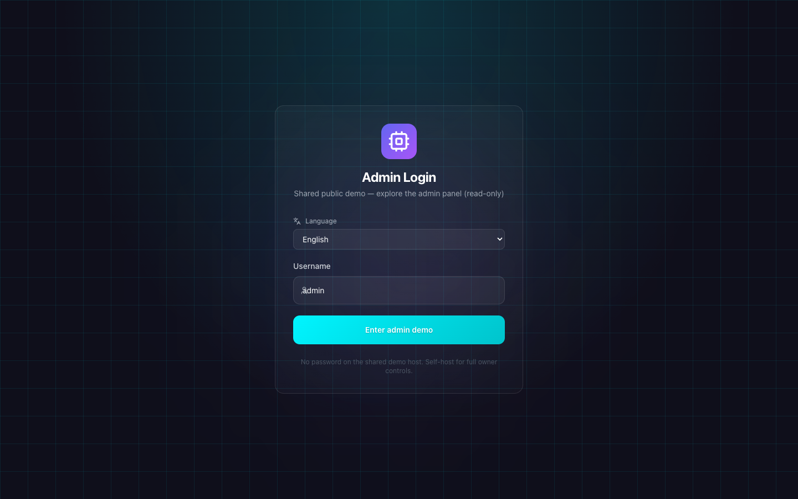 |
| «Создал продукт — где он?» | **Pipeline** | Поиск по `prod-…`, сортировка *shipped first* | 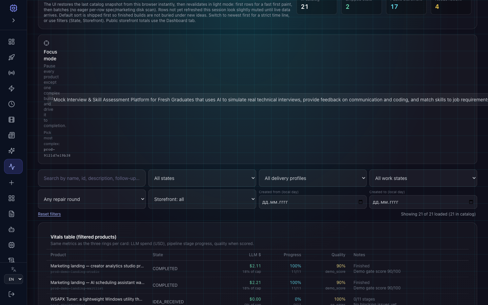 |
| «Pipeline долго пишет Connecting / try N of 8» | **Pipeline** (подождать до 5 мин на попытку) | Полоса *Connection phase* — это **повторные запросы HTTP**, не % каталога; после ответа — *N / total* |  |
| «Продукт завис на стадии» | **Pipeline** → клик по плитке агента | Статус задачи `running` / `failed`, `last_error` |  |
| «Агент упал с ошибкой LLM» | **LLM Providers** → **LLM Logs** | Ключи, лимиты, таймаут модели | 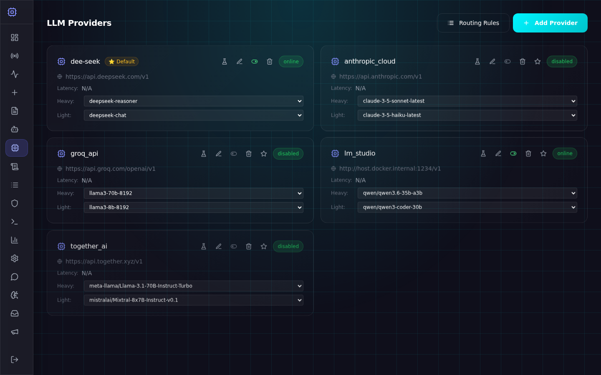 |
| «COMPLETED, но нет на витрине» | **Pipeline** → карточка → storefront gates | `storefront_gate_reasons`, качество, код на диске |  |
| «Нужно срочно лендинг» | **New product** → *Marketing landing page only* | `marketing_landing`, быстрее full stack | 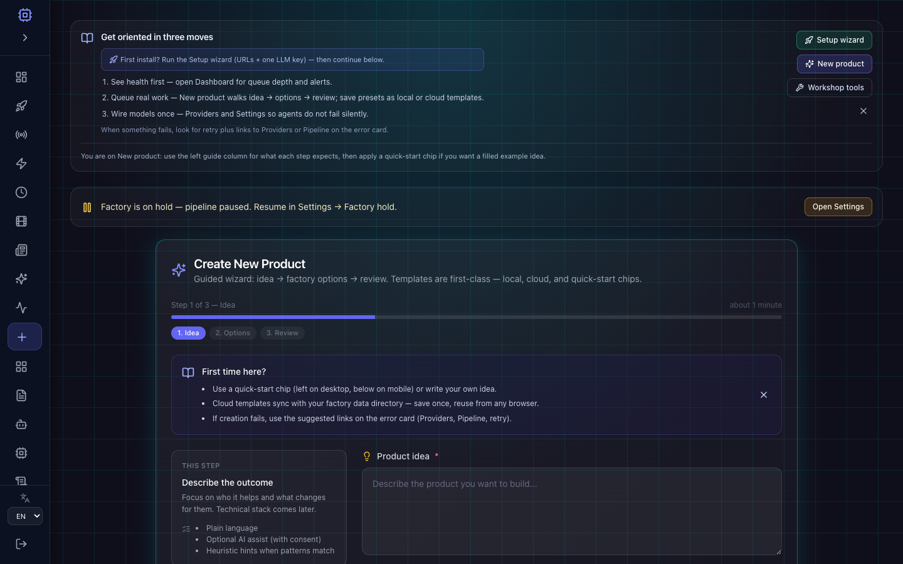 |
| «Сравнить две спецификации» | **Workshop** → Material diff | Два `prod-…` | 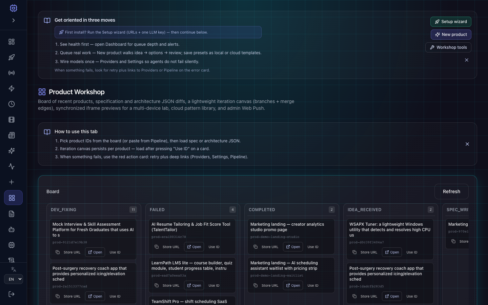 |
| «Откуда брать идеи автоматически» | **Discovery** | Очередь ранжированных идей, auto-enqueue в Settings | 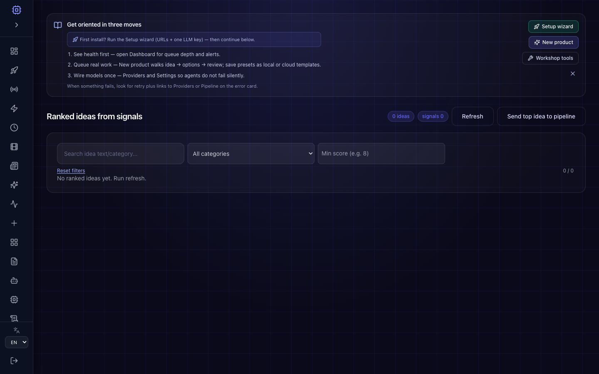 |
| «Первый запуск / URL / ключи» | **Setup wizard** | Пошаговая настройка инстанса | 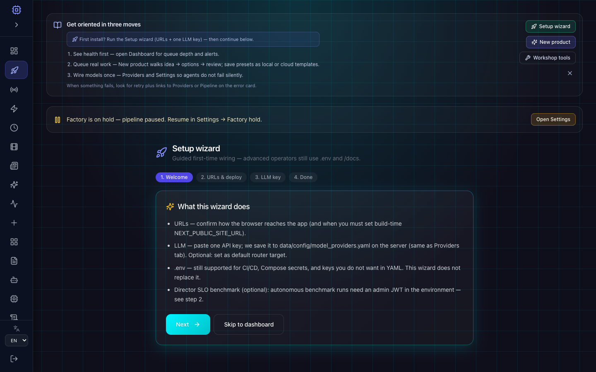 |
| «Общее здоровье за 10 секунд» | **Dashboard** | KPI, pending/running tasks | 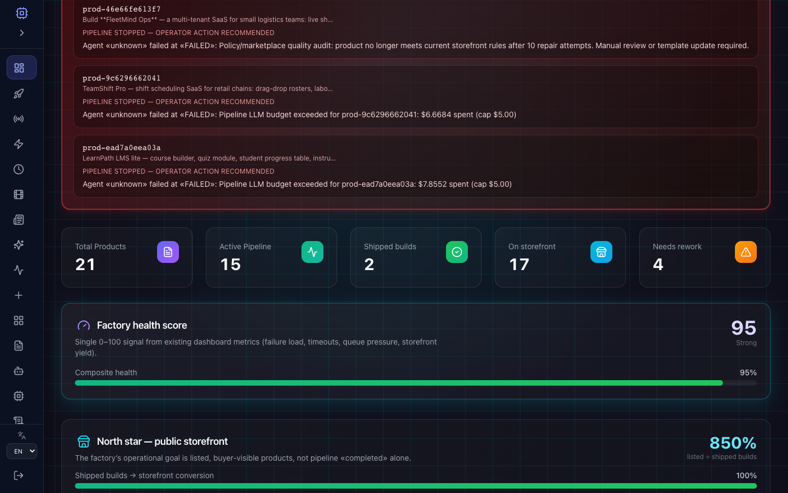 |
| «Живые цифры и эскалации» | **Live Monitor** | SSE, Director, demo replay | 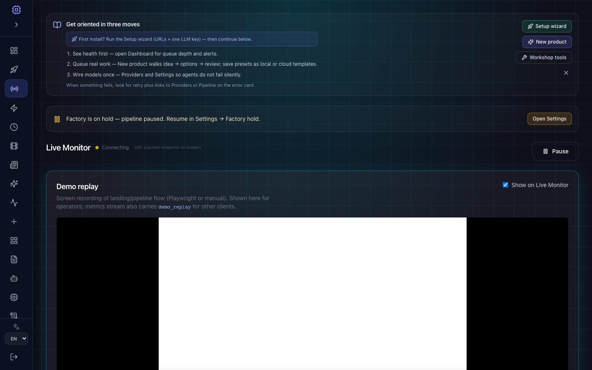 |
| «Покупатель спрашивает про продукт» | Публичный **Support** / Lumen (не пайплайн) | Отдельно от AI Agents | — |
| «Сессия выкинула» | Снова **/admin/login** | 401 → JWT истёк |  |
| «Нет прав на Settings» | [admin-panel-rbac.md](./admin-panel-rbac.md) | Роль `viewer` / `operator` | — |

---

## 3. Первые 15 минут

1. Откройте витрину `/` — поймите, что видит гость.
2. Откройте `/docs` — встроенная документация с теми же картинками.
3. Войдите в **`/admin/login`** (логин `admin`, пароль с первого запуска — см. [security.md](./security.md)).
4. Прочитайте синюю карточку **Get oriented in three moves**, затем закройте (**Dismiss**).
5. **New product** → шаблон Quick-start или свой текст → **Idea → Options → Review** → **Start building**.
6. **Pipeline** → найдите `prod-…` → раскройте карточку → следите за полосой стадий.

---

## 4. Публичная витрина (без входа)

**Кейс A — гость хочет попробовать генерацию лендинга**

1. Главная `/` — форма с идеей (если включена на вашем скине).
2. После отправки — id продукта и ссылка на `/product/{id}`.
3. Оператор в админке видит тот же id в **Pipeline**.

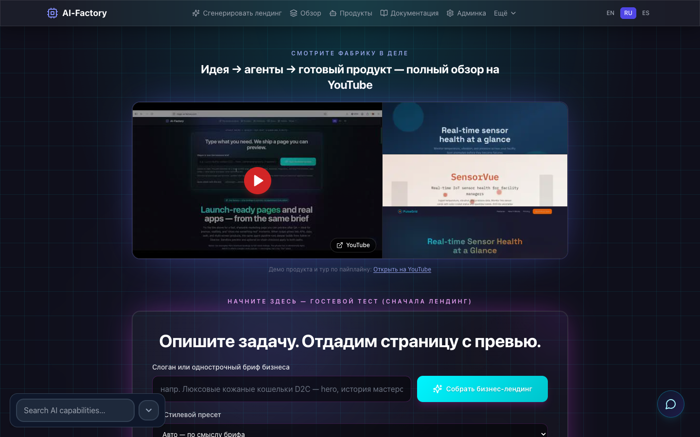

**Кейс B — покупатель смотрит каталог**

- Сетка продуктов на `/` или в категории `/explore/...`.
- На витрине только продукты, прошедшие **marketplace gates** (см. FAQ).
- Две секции на главной: **Marketing landing pages** (`marketing_landing`) и **Full products** (остальные профили).
- **Кеш каталога:** сначала отрисовка из `localStorage` (`aicom_storefront_catalog_v1_all` или `_<категория>`), затем фоновое обновление с API (*Showing cached catalog — updating…*). Это **не** кеш Pipeline Monitor (`aicom_pipeline_catalog_v2_*`).

---

## 5. Сайт документации `/docs`

Маршрут **`/docs`** в Next.js — хаб для стейкхолдеров без доступа к git: быстрый старт, скриншоты админки, ссылки.

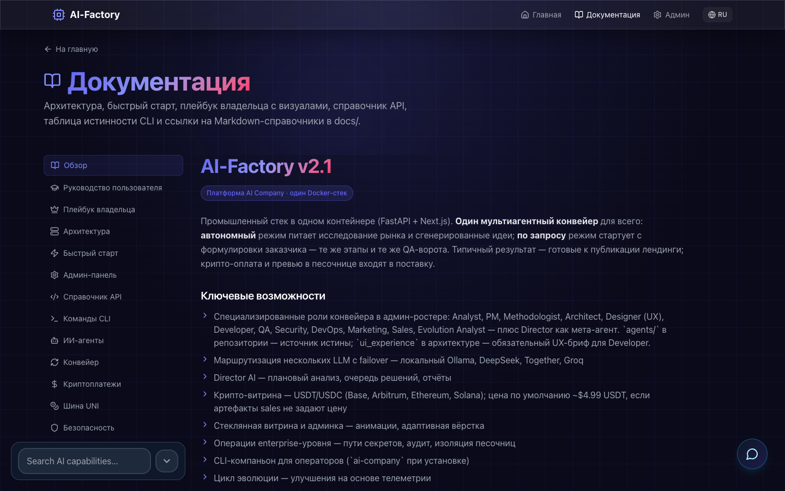

---

## 6. Вход в админку и безопасность

1. URL: **`/admin/login`**, пользователь **`admin`**.
2. **Пароля `admin123` по умолчанию нет.** Первый запуск:
   - интерактивно: `docker compose run -it app` — запрос пароля в консоли;
   - headless: файл **`data/secrets/bootstrap_admin.txt`** (прочитать один раз и удалить/сменить).
3. Production: только **HTTPS**, сменить пароль в первый день.
4. JWT в `localStorage` — не оставляйте сессию на чужом ПК.


---

## 7. Навигация по админке

Левое меню — одна SPA `/admin`, вкладки через `?tab=…`.

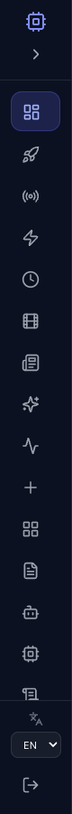

| Вкладка (EN) | Зачем оператору |
|--------------|-----------------|
| **Dashboard** | Снимок KPI при открытии |
| **Setup wizard** | Первичная настройка URL и LLM |
| **Live Monitor** | Поток метрик, Director, demo video |
| **Pipeline** | Все `prod-…`, стадии, витрина, ошибки |
| **New product** | Постановка новой работы в очередь |
| **Workshop** | Diff spec/arch, канвас, паттерны |
| **LLM Providers** | Ключи и маршрутизация моделей |
| **LLM Logs** | Разбор сбоев вызовов LLM |
| **Discovery** | Внешние сигналы → идеи |
| **Settings** | Автопилот, CORS, demo replay, Railway … |
| **Corporate Chat / Brainstorming** | Обсуждения, не пайплайн | 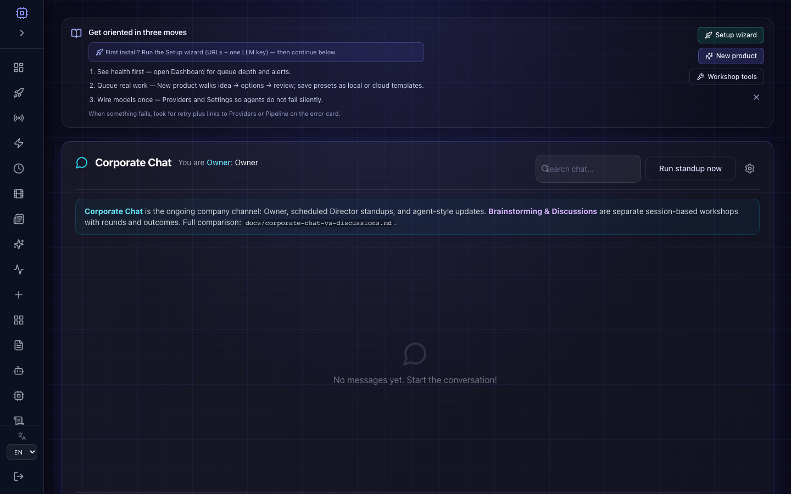 · 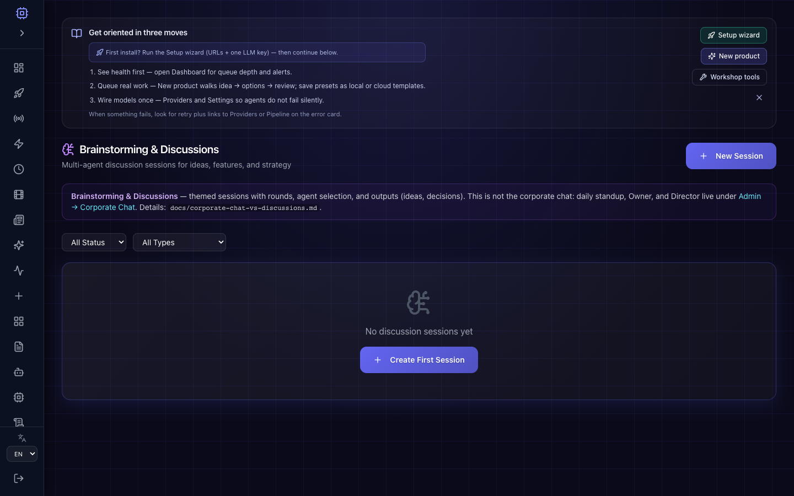 |

Полный справочник по каждой вкладке: [admin-guide.md](./admin-guide.md).

---

## 8. Dashboard — снимок здоровья

**Когда смотреть:** утром, после деплоя, когда «что-то странное», но ещё не знаете какой продукт.

| Блок | На что смотреть |
|------|-----------------|
| Total / Active / Completed / Failed | Масштаб очереди |
| Pending / Running tasks | Затор на воркере |
| CPU / Memory / Disk | Ресурсы хоста |
| Revenue | Если включена коммерция |

**Важно:** **Completed** на Dashboard ≠ число карточек на публичной витрине.


---

## 9. Live Monitor — живые метрики

**Когда смотреть:** во время демо, при автономном Director, когда нужен поток событий без обновления страницы.


- Индикатор **Connected** (SSE).
- **Demo replay** — встроенное видео прохождения пайплайна (настраивается в Settings).
- Эскалации и лента агентов.

Подробности: [pipeline-operations.md](./pipeline-operations.md) (раздел Live Monitor demo replay).

### Setup wizard (первый визит)


Вкладка **Setup wizard** — публичный URL, ключ LLM, проверки перед автономным режимом. См. также синюю карточку onboarding на Dashboard.

---

## 10. New product — мастер и шаблоны

**Путь:** `/admin?tab=new-product`


### Кейс: SaaS с дашбордом (full_software)

| Шаг | Действие |
|-----|----------|
| Idea | «SaaS for remote team standups with auth and API» |
| Options | **Full product**, язык копирайта **Auto** или **Russian** |
| Review | **Start building** → запомнить `prod-…` |

### Кейс: только лендинг (быстро)

| Шаг | Действие |
|-----|----------|
| Options | **Marketing landing page only** |
| Review | Ожидать меньше стадий и быстрее `COMPLETED` |

### Кейс: сохранить пресет для команды

- **Save current to cloud** — шаблон на сервере (виден с другого браузера после входа).
- Локальные шаблоны — только в этом браузере.

### Кейс: AI prefill

- Включить **чекбокс согласия** — без него LLM не вызывается.
- При ошибке — красная панель **Actionable failure** с **Retry** и ссылками на Providers.

---

## 11. Pipeline Monitor — главный экран правды

**Путь:** `/admin?tab=pipeline`


### Загрузка каталога (частый вопрос)

1. **Первый заход / другая сортировка / очистка localStorage** — может быть фаза *Fetching first catalog page…* и *Server request N / M*.
2. Это **повторные HTTP-запросы** (до 8), если API занят или прокси оборвал соединение — **не** «браузер не видит сервер».
3. Таймаут **одной попытки** — до **5 минут**; между попытками — backoff.
4. После первых строк: в шапке **Updating from server… X / total** и зелёная полоса — **реальный % загруженных строк**.
5. **Кеш:** после успешной загрузки снимок каталога пишется в **localStorage** (`aicom_pipeline_catalog_v2_*`) — повторный визит рисует карточки сразу, фоном обновляет с API.

### Элементы карточки продукта

| Элемент | Зачем |
|---------|--------|
| Полоса стадий (Anl, Pm, Dev, Qa …) | Статус задачи по агенту; **клик** — модалка задачи |
| **Spec** | Спецификация PM |
| **Dev handoff** | Передача разработчику |
| Бейджи state / category | Фильтры и поиск |
| Storefront / follow-up | Ручные метки и gate'ы витрины |

### Фильтры

- **Sort: shipped first** — сначала `COMPLETED` / `DEPLOYED`, удобно для витрины.
- **Search** — id, имя, описание, follow-up.
- **State / Storefront / даты** — сузить список.

### Кейс: продукт в `FAILED`

1. Открыть карточку → красные стадии.
2. **Show Tasks** или клик по плитке → `error` в задаче.
3. **LLM Logs** если ошибка модели.
4. При необходимости **human rework** (см. admin-guide).

---

## 12. Workshop — сравнение и канвас


| Инструмент | Кейс использования |
|------------|-------------------|
| Board | Быстро найти недавние `prod-…` по state |
| Material diff | Сравнить spec или architecture двух прогонов |
| Iteration canvas | Сохранить граф итераций (Iteration Hub API) |
| Pattern library | Переиспользуемые JSON-шаблоны |

---

## 13. Discovery — идеи до пайплайна


**Когда смотреть:** автономный режим, поиск ниш, пополнение очереди идей.

- Ранжированные идеи, дайджест, здоровье источников.
- Auto-enqueue — только если явно включено в **Settings** / env (`AIFACTORY_DISCOVERY_AUTO_ENQUEUE`).

---

## 14. LLM Providers и LLM Logs


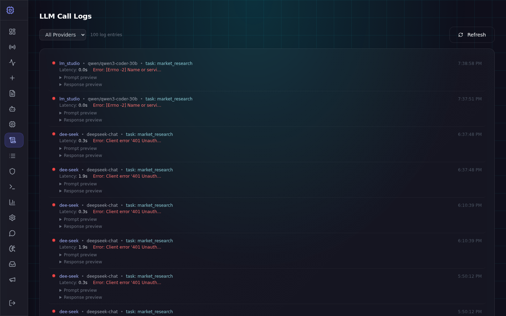

| Симптом | Действие |
|---------|----------|
| Все агенты падают с auth | Проверить ключ в Providers |
| Только один агент | Routing rules, model id |
| Timeout / rate limit | Logs + увеличить timeout в yaml провайдера |
| После смены ключа | Сохранить, **Retry** задачи или дождаться rework |

---

## 15. Settings — фабрика целиком

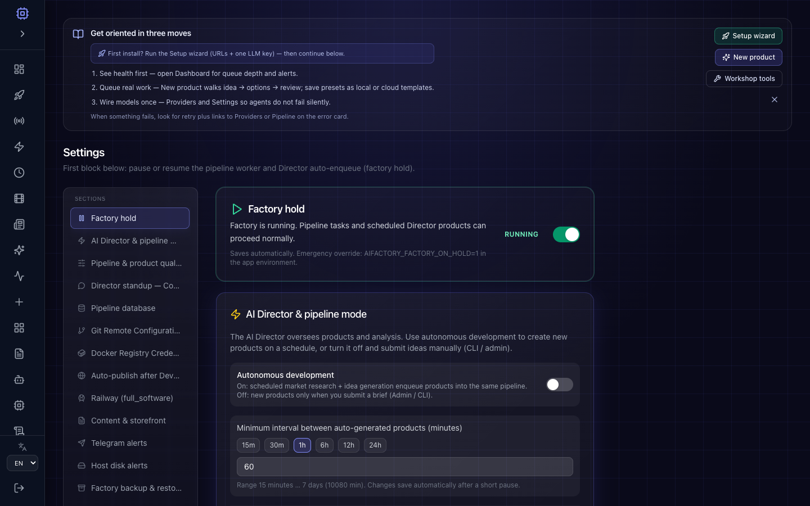

Типичные блоки (зависят от версии):

- **Autonomous pipeline** / Director
- **Demo replay** для Live Monitor
- **Auto-publish** (Vercel / Netlify / Cloudflare)
- **Railway** для `full_software`
- CORS, тема, уведомления

Полный список env: [configuration.md](./configuration.md).

---

## 16. Сценарии пошагово

### Сценарий 1: «Запустил первый продукт с нуля»

1. Providers — хотя бы один ключ (DeepSeek и т.д.).
2. New product → идея → full_software → Start.
3. Pipeline → найти id → ждать зелёных стадий.
4. При `COMPLETED` — проверить sandbox URL на карточке / витрине.
5. Если не на витрине — см. `storefront_gate_reasons` на карточке.

### Сценарий 2: «Каталог Pipeline пустой 2 минуты»

1. Проверить `/api/health` на :9081.
2. Не обновлять страницу десятки раз — дождаться попытки или **Retry catalog**.
3. Открыть DevTools → Network → `pipeline/products?light=1` — код 200 и размер ответа.
4. Если 502 от nginx — увеличить `proxy_read_timeout` у reverse proxy.

### Сценарий 3: «Нужно снять с витрины без удаления»

1. Pipeline → продукт → storefront controls / follow-up **not pursuing** (см. admin-guide).
2. Проверить публичную витрину в инкогнито.

### Сценарий 4: «Демо инвестору за 5 минут»

1. Заранее: продукт в `COMPLETED`, sandbox открывается.
2. Live Monitor → включить **demo replay** (видео).
3. Dashboard → цифры.
4. Pipeline → одна «красивая» карточка с зелёной полосой.

### Сценарий 5: «Правила витрины ужесточили — старые продукты пропали»

1. Это **policy audit** — воркер может перевести в repair.
2. Pipeline — продукты в `BUG_FOUND` / rework.
3. [pipeline-operations.md](./pipeline-operations.md) — `AIFACTORY_POLICY_AUDIT_*`.

---

## 17. Ошибки в UI — что нажимать

| Сообщение / симптом | Кнопки в UI | Куда ещё |
|---------------------|-------------|----------|
| Could not reach the server | Retry, Settings | `docker compose ps`, прокси |
| 401 / Sign in again | Вход | Сессия истекла |
| 403 | — | RBAC, [admin-panel-rbac.md](./admin-panel-rbac.md) |
| LLM / provider | Open LLM Providers, LLM Logs | Ключи |
| Catalog partial load | Retry catalog | Сеть, см. FAQ «try 4 of 8» |
| AI prefill consent | Чекбокс согласия | New product |

---

## 18. Индекс скриншотов

| Файл | Содержимое |
|------|------------|
| `public-home.png` | Витрина `/` |
| `public-docs.png` | `/docs` |
| `admin-login.png` | Вход |
| `admin-dashboard.png` | Dashboard |
| `admin-sidebar.png` | Боковое меню целиком |
| `admin-setup.png` | Setup wizard |
| `admin-live-monitor.png` | Live Monitor |
| `admin-pipeline.png` | Pipeline Monitor |
| `admin-new-product.png` | Мастер New product |
| `admin-workshop.png` | Workshop |
| `admin-providers.png` | LLM Providers |
| `admin-llm-logs.png` | LLM Logs |
| `admin-discovery.png` | Discovery |
| `admin-settings.png` | Settings |
| `admin-corporate-chat.png` | Corporate Chat |
| `admin-brainstorming.png` | Brainstorming |

Обновить: `cd web/frontend && npm run capture-docs-screenshots` — подробности в [assets/screenshots/README.md](./assets/screenshots/README.md).

---

## 19. Связанные документы

| Документ | Когда читать |
|----------|----------------|
| [FAQ.ru.md](./FAQ.ru.md) | Ответы на частые вопросы |
| [USER_GUIDE.es.md](./USER_GUIDE.es.md) / [FAQ.es.md](./FAQ.es.md) | Руководство и FAQ на испанском |
| [owner-guide.md](./owner-guide.md) | Владелец продакшн-инстанса |
| [admin-guide.md](./admin-guide.md) | Каждая вкладка, API |
| [security.md](./security.md) | Пароли, CSRF, sandbox |
| [pipeline-operations.md](./pipeline-operations.md) | Воркер, discovery, E2E |
| [configuration.md](./configuration.md) | Переменные окружения |

---

*Версия: AI-Factory v2.1 — Pipeline catalog cache, light mode, увеличенный HTTP timeout. Обновляйте скриншоты после крупных изменений UI.*
