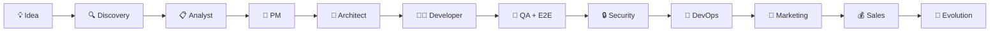
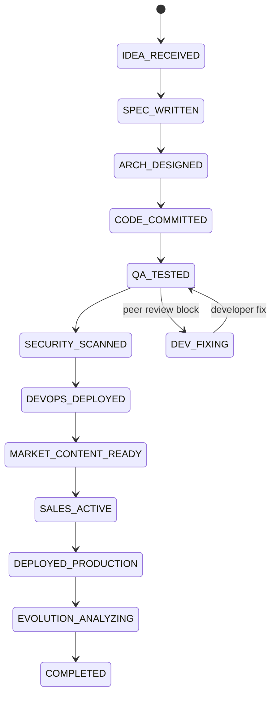
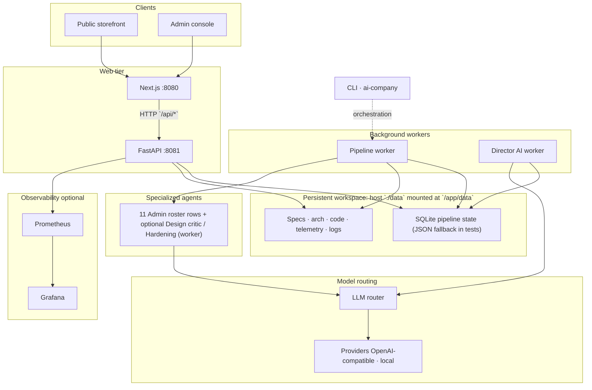
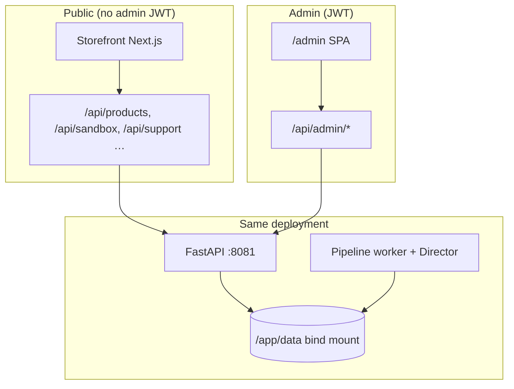
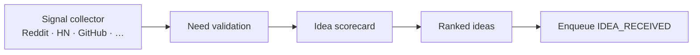
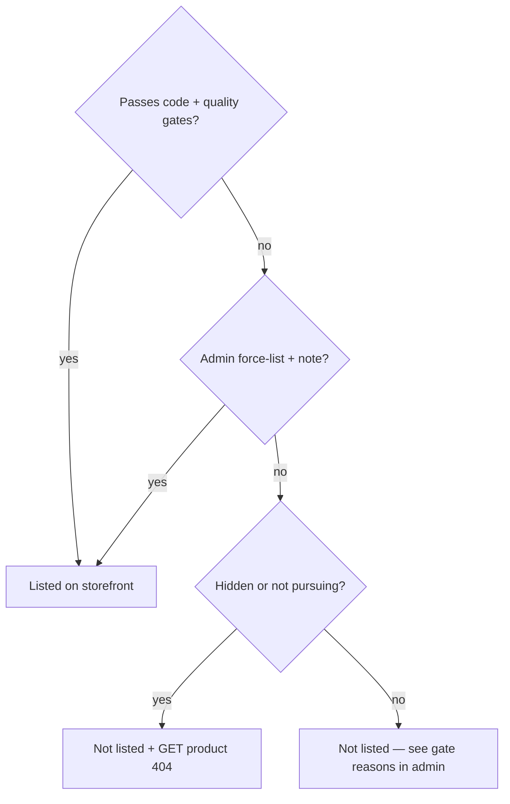
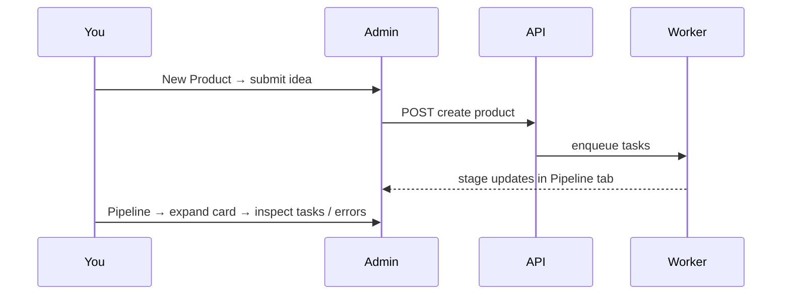

# Architecture & pipeline diagrams

Visual reference moved out of the root [README.md](../README.md) during the conversion-focused layout. **Mermaid** blocks render on GitHub, Gitea, and most Markdown viewers.

For a wide competitive feature matrix see **[competitive-analysis.md](./competitive-analysis.md)**. For operator playbooks with more sequence diagrams see **[owner-guide.md](./owner-guide.md)**.

---

## North star (positioning)

Turn a **short plain-language brief** into a **presentable web page** you can share — with **quality gates** (demo/TZ, browser smoke, optional marketplace rules) so sloppy stubs get reworked.

**One pipeline** for everyone:

| Mode | What feeds the pipeline |
|------|-------------------------|
| **Autonomous** | **Discovery** (external signals → validation → scoring) → top idea as `IDEA_RECEIVED` |
| **On-demand** | Customer phrase / Admin → New Product — same downstream stages |

Details: [product-concept.md](./product-concept.md) · [marketing.md](./marketing.md)

---

## Pipeline at a glance (13 worker agents)

The **pipeline worker** also runs **Design critic** and **Hardening** when `AIFACTORY_EXTENDED_PIPELINE` is enabled — optional hops, not separate rows on Admin → AI Agents (11 roster slots). See [agents.md](./agents.md).

---

## Extended pipeline (gates on the worker graph)

```mermaid
flowchart LR
  Idea[Idea or discovery] --> A[Analyst]
  A --> PM[PM / Spec]
  PM --> AR[Architect + UX brief]
  AR --> DC[Design critic gate]
  DC --> DEV[Developer]
  DEV --> HARD[Hardening]
  HARD --> QA[QA]
  QA --> SEC[Security]
  SEC --> DO[DevOps]
  DO --> MKT[Marketing]
  MKT --> SAL[Sales]
  SAL --> DONE[COMPLETED / Deployed]
```

---

## Product state machine

Text chain (compact):  
`IDEA_RECEIVED` → `SPEC_WRITTEN` → `ARCH_DESIGNED` → `CODE_COMMITTED` → `QA_TESTED` → `SECURITY_SCANNED` → `DEVOPS_DEPLOYED` → `MARKET_CONTENT_READY` → `SALES_ACTIVE` → `DEPLOYED_PRODUCTION` → `EVOLUTION_ANALYZING` → `COMPLETED`

---

## Runtime architecture (full)

High-level layout — **full** diagram (README had a shortened copy inside `
`).

Compose maps container **8080/8081** → host **9080/9081**. Deep dive: [architecture-orchestrator.md](./architecture-orchestrator.md).

---

## Public site vs Admin (same deployment)

---

## Discovery (pre-pipeline)

Engine: `director/discovery_pipeline.py` · Ops: [pipeline-operations.md](./pipeline-operations.md)

---

## Storefront listing decision

---

## Operator: enqueue one product

---

## Compared to hosted AI app builders

Hosted builders (Bolt.new, Lovable, v0, Devin) and AI-Factory solve different problems. Hosted products give a polished editor, team accounts, integrations, and pay-per-seat pricing; AI-Factory gives a **self-hosted MIT pipeline** with your own LLM keys, on-disk artifacts/state, Playwright E2E + security gates, an optional human gate, and a public storefront — at the cost of running Docker and bringing your own keys. Don’t treat this as a head-to-head ranking — pick by which trade-off matches your context, and verify vendor pricing/features yourself.

---

## Observability (Grafana overview)

When Compose includes Prometheus + Grafana (`./run-compose.sh`), the **AI Factory Overview** dashboard includes:

| Row | Panels |
|-----|--------|
| **Pipeline overview** | Active products · Total created (24h) · Pending tasks · Failed tasks (24h) |
| **Products by state** | Pie chart of pipeline states |
| **Tasks & performance** | Tasks by status · Task duration P99 · Avg duration by agent |
| **Director AI** | Decisions (24h) · Analysis duration |
| **LLM health** | Requests by provider · Error rate · Provider UP/DOWN · Latency P95 |

Default URLs (host): App **9080** · API **9081** · Prometheus **9090** · Grafana **9082**.

---

## Related docs

| Topic | File |
|-------|------|
| Orchestrator / worker split | [architecture-orchestrator.md](./architecture-orchestrator.md) |
| Agent roster | [agents.md](./agents.md) |
| Factory feature map | [factory-capabilities.md](./factory-capabilities.md) |
| Investor narrative + diagrams | [investor-deck.md](./investor-deck.md) |
