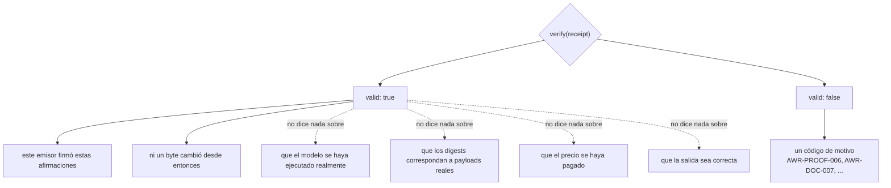
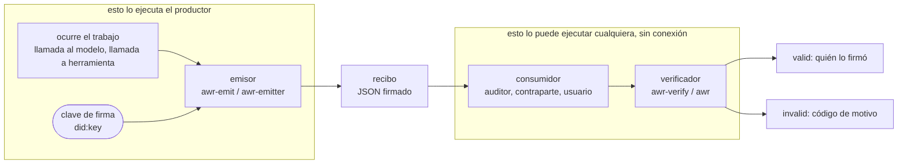
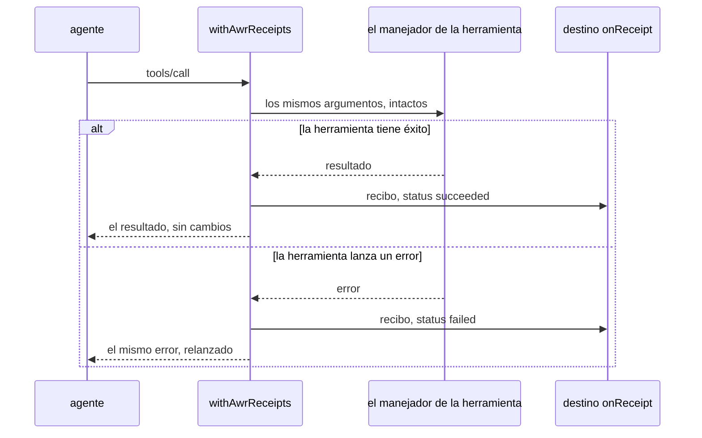
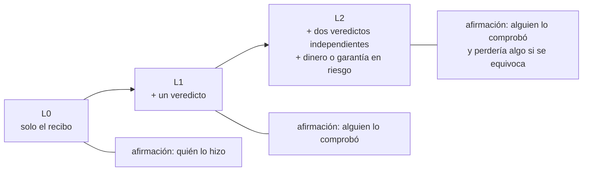
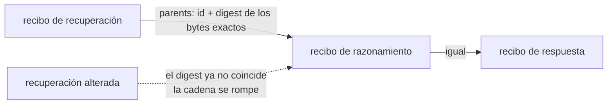

# AWR — recibos de trabajo para la salida de IA

> English: [awr-receipts.md](./awr-receipts.md) · Русский: [awr-receipts.ru.md](./awr-receipts.ru.md) · **Español** · Français: [awr-receipts.fr.md](./awr-receipts.fr.md) · 中文: [awr-receipts.zh.md](./awr-receipts.zh.md)
>
> Definición normativa: [`awr/SPEC.md`](../awr/SPEC.md). Esta página es la guía práctica.

---

## Qué es

Un **recibo de trabajo AWR** es un documento firmado que registra lo que hizo una pieza de
software: qué modelo se ejecutó, un resumen criptográfico (digest) de la entrada, un digest de la
salida, cuándo terminó y, de forma opcional, el precio y los enlaces a los recibos del trabajo
sobre el que se construyó.

No es un nuevo formato de archivo inventado aquí. Un recibo es un **W3C Verifiable Credential
2.0** (credencial verificable) que lleva un `DataIntegrityProof` con la criptosuite
`eddsa-jcs-2022` sobre JSON canónico según [RFC 8785](https://www.rfc-editor.org/rfc/rfc8785),
emitido bajo un `did:key`. Cada una de esas piezas es un estándar ajeno, y eso es precisamente el
punto: una biblioteca VC estándar sin modificar verifica la firma sin usar nada de nuestro código.

## Qué prueba un recibo válido — y qué no

Esta sección es la más importante de la página, y la más fácil de exagerar.

**Prueba:** este emisor firmó estas afirmaciones, y los bytes están intactos. Eso es
**atribución** (attribution).

**No prueba** que el modelo se haya ejecutado, ni que los digests correspondan a cargas útiles
(payloads) reales, ni que el precio se haya pagado, ni que la salida sea correcta. Un recibo es
una declaración firmada por su emisor, y una firma hace que una declaración sea *atribuible*, no
*verdadera*. Quien afirme que un recibo válido significa que el trabajo se hizo correctamente se
equivoca, y la especificación lo dice así en §13.7.



Las flechas discontinuas son las que la gente interpreta mal. Todo lo que queda a su derecha
necesita que alguien más lo atestigüe — que es para lo que sirven los perfiles de más abajo.

Se trata de un límite deliberado, no de una funcionalidad ausente. La verificación es barata, sin
conexión y universal precisamente porque comprueba una firma y no el mundo.

## Dos lados, dos paquetes

| | qué hace | quién lo ejecuta | paquete |
|---|---|---|---|
| **emisor** | **escribe** un recibo: toma lo que el sistema acaba de hacer y firma un documento que lo declara | el productor — quien ejecutó el trabajo | [`@alexar76/awr-emit`](https://www.npmjs.com/package/@alexar76/awr-emit) (npm), [`awr-emitter`](https://pypi.org/project/awr-emitter/) (PyPI) |
| **verificador** | **lee** un recibo: comprueba la firma y las reglas, e informa por qué no | el consumidor — cualquiera que reciba el documento | [`@alexar76/awr-verify`](https://www.npmjs.com/package/@alexar76/awr-verify) (npm), [`awr`](https://pypi.org/project/awr/) (PyPI) |

Son paquetes separados a propósito. Un componente que emite recibos y a la vez los juzga no es
evidencia de nada.



La flecha de `R` a `C` es lo único que cruza entre las dos cajas: un archivo. Sin handshake, sin
servicio compartido, sin ninguna llamada de vuelta al productor.

Los cuatro tienen **cero dependencias en tiempo de ejecución** en el caso de JavaScript, y solo
`cryptography` en el caso de Python. `npm install @alexar76/awr-emit @alexar76/awr-verify` añade
exactamente dos paquetes.

## Emitir

```js
import { emitReceipt, generateKey, jcsPayload } from '@alexar76/awr-emit';

const key = generateKey();              // guárdala; su .did es tu identidad de emisor

const receipt = emitReceipt({
  key,
  modelId: 'claude-opus-5@anthropic',
  inputPayload: jcsPayload({ prompt: 'summarise this', n: 3 }),
  outputPayload: '...the answer...',
  latencyMs: 2340,
});
```

```python
from awr_emitter import emit_receipt, generate_key, jcs_payload

key = generate_key()

receipt = emit_receipt(
    key=key,
    model_id="claude-opus-5@anthropic",
    input_payload=jcs_payload({"prompt": "summarise this", "n": 3}),
    output_payload=b"...the answer...",
    latency_ms=2340,
)
```

Los dos emisores producen **documentos idénticos byte a byte** para las mismas entradas y la misma
clave. Eso no es una afirmación, es un test: ejecuta Node desde pytest y compara los bytes.

## Verificar

```js
const awr = require('@alexar76/awr-verify');
const result = await awr.verify(receipt);   // asíncrono: la comprobación Ed25519 usa WebCrypto
result.valid                                 // true | false
result.reasons                               // [{ code: 'AWR-PROOF-006', … }, …]
```

```bash
npx awr-verify verify receipt.json     # salida 0 válido, 1 inválido, 2 error de uso o E/S
python -m awr verify receipt.json      # el mismo contrato, los mismos códigos
```

O bien se puede pegar el JSON en <https://verify.modelmarket.dev> — del lado del cliente, sin
backend, sin enviar nada a ninguna parte.

La verificación **no realiza ninguna petición de red**. Ni a un registro, ni a una cadena, ni
siquiera al URI del espacio de nombres de AWR en `@context`, cuya obtención la especificación
prohíbe (§13.5).

## Llamadas a herramientas MCP

Para un servidor MCP, un único wrapper da un recibo a cada llamada de herramienta — incluidas las
llamadas que fallan, porque un fallo no verificable es aquello sobre lo que suele girar una
disputa.

```js
import { withAwrReceipts } from '@alexar76/awr-emit/mcp';

const handler = withAwrReceipts(myToolHandler, {
  key,
  modelId: 'my-server@v1',
  onReceipt: (doc, err) => save(doc),   // obligatorio: un recibo que nadie guarda no es evidencia
});
```



El wrapper es transparente en ambas direcciones: la herramienta ve los argumentos que habría
visto, y quien la llama ve el resultado o el error original. El recibo es un efecto secundario, y
el error lanzado nunca se hace pasar por la salida de la herramienta.

También existe un callback de LangChain / LangGraph en
`awr_emitter.adapters.langgraph_callback`. Está tipado por pato (duck-typed) contra el framework en
lugar de importarlo, así que el paquete no depende de ningún framework.

## Perfiles

Un recibo por sí solo es el nivel **L0**: atribución y nada más. Los niveles superiores exigen
otros documentos junto a él, y un verificador informa fallos de perfil solo para el perfil que se
le haya pedido.

- **L0** — un recibo firmado.
- **L1** — más un `VerificationVerdict` de alguien que comprobó el trabajo.
- **L2** — más veredictos de dos emisores distintos, ninguno el del propio recibo, y un vínculo de
  responsabilidad: o bien liquidación sobre el recibo, o bien garantía en cada veredicto
  contabilizado.



L2 es donde un recibo empieza a decir algo sobre la corrección, y lo dice porque partes
independientes ponen algo en riesgo — no porque la firma se haya vuelto más fuerte.

Los recibos también se encadenan. Un enlace `parents` se compromete con los **bytes exactos** del
recibo padre, de modo que un paso no puede sustituirse más tarde por otro distinto que resulte
compartir el mismo identificador:



## Por qué creer que el formato es implementable

Tres implementaciones independientes pasan el conjunto de conformidad en los **354** vectores: la
referencia en Python, una implementación en Rust escrita únicamente a partir del texto de la
especificación por alguien que nunca vio el código de referencia, y el verificador en JavaScript
del navegador. La de Rust se ganó su lugar de inmediato: la primera ejecución entre lenguajes
discrepó de la referencia sobre si `latencyMs: 2340` y `2340.0` son el mismo documento, que es
exactamente la clase de divergencia que ninguna implementación por sí sola puede encontrar.

Por separado, una pila `@digitalbazaar/vc` 7.3.0 sin modificar verifica estos documentos sin más
que un resolutor de `did:key`. Eso es código de terceros comprobando nuestras firmas. No
implementa ninguna semántica de AWR — ni perfiles, ni códigos de motivo, ni cadenas — así que no
es una implementación de AWR, y dos de sus comportamientos difieren de los nuestros de forma
deliberada: trata `validFrom`/`validUntil` como validez y rechaza un documento vencido, mientras
que AWR convierte la antigüedad en una advertencia; y rechaza de plano los documentos AWR/1, lo
cual es correcto.

## Lo que no está hecho

Todos los recibos emitidos hasta ahora están firmados por una clave que controlan los autores de
este estándar. Nadie de fuera ha emitido ninguno. Hasta que eso cambie, AWR es un formato bien
especificado con tres implementaciones y ningún adoptante — y ninguna cantidad de ingeniería
adicional cambia eso, porque la pieza que falta no es técnica.

## Enlaces

- Especificación, registro de códigos de motivo, conjunto de conformidad: [`awr/SPEC.md`](../awr/SPEC.md)
- Verificador en el navegador: <https://verify.modelmarket.dev>
- Emisores y adaptadores: [`awr/emitters/`](../awr/emitters/)
