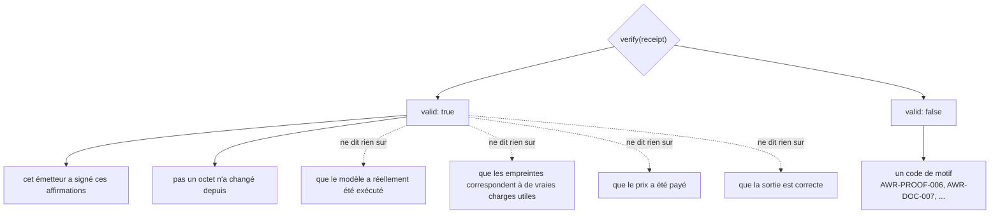
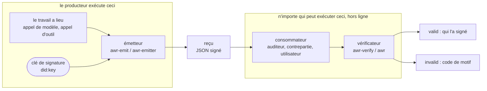
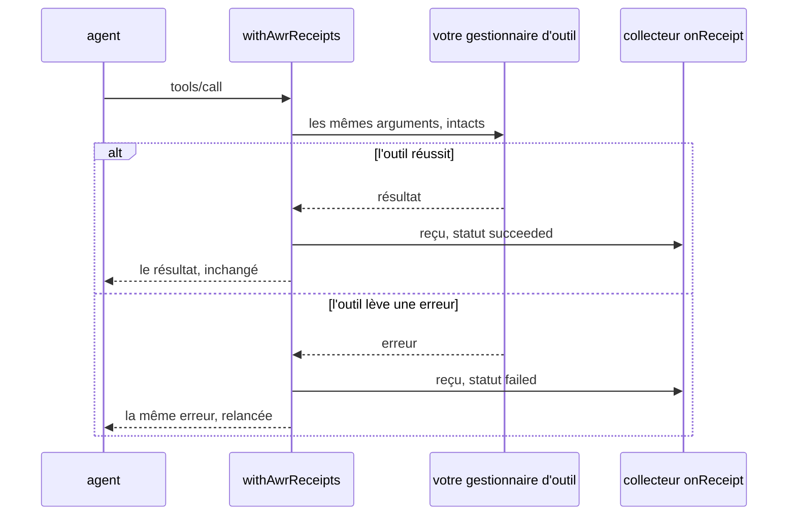
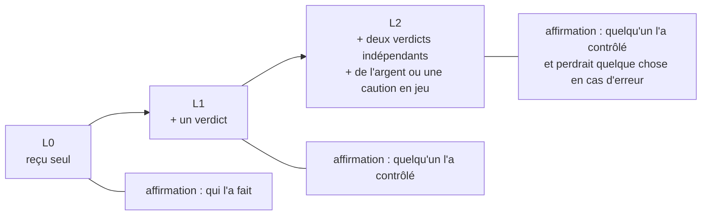
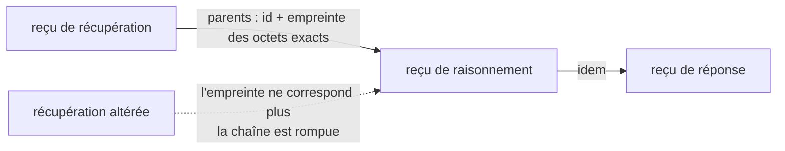

# AWR — reçus de travail pour les productions d'IA

> **English:** [awr-receipts.md](./awr-receipts.md) · **Русский:** [awr-receipts.ru.md](./awr-receipts.ru.md) · **Español:** [awr-receipts.es.md](./awr-receipts.es.md) · **Français** · **中文:** [awr-receipts.zh.md](./awr-receipts.zh.md)
>
> Définition normative : [`awr/SPEC.md`](../awr/SPEC.md). Cette page est le guide pratique.

---

## Ce que c'est

Un **reçu de travail AWR** est un document signé qui consigne ce qu'un logiciel a fait : quel modèle
a été exécuté, une empreinte (digest) de l'entrée, une empreinte de la sortie, le moment où il a
terminé, et facultativement le prix ainsi que des liens vers les reçus des travaux sur lesquels il
s'est appuyé.

Ce n'est pas un nouveau format de fichier inventé ici. Un reçu est un
**W3C Verifiable Credential 2.0** (attestation vérifiable) portant un `DataIntegrityProof` avec la
cryptosuite `eddsa-jcs-2022` appliquée à du JSON canonique selon
[RFC 8785](https://www.rfc-editor.org/rfc/rfc8785), émis sous un `did:key`. Chacune de ces briques
est le standard de quelqu'un d'autre, et c'est précisément le but : une bibliothèque VC ordinaire,
non modifiée, vérifie la signature sans aucune ligne de notre code.

## Ce qu'un reçu valide prouve — et ce qu'il ne prouve pas

Cette section est la plus importante de la page, et la plus facile à surinterpréter.

**Ce qu'il prouve :** cet émetteur a signé ces affirmations, et les octets sont intacts. C'est de
l'**attribution**.

**Ce qu'il ne prouve pas :** que le modèle a été exécuté, que les empreintes correspondent à de
vraies charges utiles, que le prix a été payé, ni que la sortie est correcte. Un reçu est une
déclaration signée par son émetteur, et une signature rend une déclaration *attribuable*, pas
*vraie*. Quiconque vous dit qu'un reçu valide signifie que le travail a été fait correctement se
trompe, et la spécification le dit en §13.7.



Les flèches en pointillés sont celles que l'on interprète mal. Tout ce qui se trouve à leur droite
exige que quelqu'un d'autre l'atteste — c'est exactement à cela que servent les profils ci-dessous.

Il s'agit d'une limite délibérée, non d'une fonctionnalité manquante. La vérification est peu
coûteuse, hors ligne et universelle précisément parce qu'elle contrôle une signature et non le
monde réel.

## Deux côtés, deux paquets

| | ce qu'il fait | qui l'exécute | paquet |
|---|---|---|---|
| **émetteur** | **écrit** un reçu : prend ce que votre système vient de faire et signe un document qui le déclare | le producteur — celui qui a exécuté le travail | [`@alexar76/awr-emit`](https://www.npmjs.com/package/@alexar76/awr-emit) (npm), [`awr-emitter`](https://pypi.org/project/awr-emitter/) (PyPI) |
| **vérificateur** | **lit** un reçu : contrôle la signature et les règles, et indique pourquoi ce n'est pas le cas | le consommateur — quiconque reçoit le document | [`@alexar76/awr-verify`](https://www.npmjs.com/package/@alexar76/awr-verify) (npm), [`awr`](https://pypi.org/project/awr/) (PyPI) |

Ce sont volontairement deux paquets distincts. Un composant qui émet les reçus et les juge à la fois
n'est la preuve de rien.



La flèche de `R` vers `C` est la seule chose qui franchisse la frontière entre les deux blocs : un
fichier. Pas de poignée de main, pas de service partagé, aucun rappel vers le producteur.

Les quatre n'ont **aucune dépendance d'exécution** côté JavaScript, et seulement `cryptography`
côté Python. `npm install @alexar76/awr-emit @alexar76/awr-verify` ajoute exactement deux paquets.

## Émettre

```js
import { emitReceipt, generateKey, jcsPayload } from '@alexar76/awr-emit';

const key = generateKey();              // conservez-la ; son .did est votre identité d'émetteur

const receipt = emitReceipt({
  key,
  modelId: 'claude-opus-5@anthropic',
  inputPayload: jcsPayload({ prompt: 'summarise this', n: 3 }),
  outputPayload: '...the answer...',
  latencyMs: 2340,
});
```

```python
from awr_emitter import emit_receipt, generate_key, jcs_payload

key = generate_key()

receipt = emit_receipt(
    key=key,
    model_id="claude-opus-5@anthropic",
    input_payload=jcs_payload({"prompt": "summarise this", "n": 3}),
    output_payload=b"...the answer...",
    latency_ms=2340,
)
```

Les deux émetteurs produisent des **documents identiques octet par octet** pour les mêmes entrées et
la même clé. Ce n'est pas une affirmation, c'est un test : il lance Node depuis pytest et compare
les octets.

## Vérifier

```js
const awr = require('@alexar76/awr-verify');
const result = await awr.verify(receipt);   // asynchrone : la vérification Ed25519 passe par WebCrypto
result.valid                                 // true | false
result.reasons                               // [{ code: 'AWR-PROOF-006', … }, …]
```

```bash
npx awr-verify verify receipt.json     # code de sortie 0 valide, 1 invalide, 2 usage ou E/S
python -m awr verify receipt.json      # le même contrat, les mêmes codes
```

Ou collez le JSON dans <https://verify.modelmarket.dev> — côté client, sans backend, rien n'est
envoyé où que ce soit.

La vérification n'effectue **aucune requête réseau**. Ni vers un registre, ni vers une chaîne, ni
même vers l'URI d'espace de noms AWR présente dans `@context`, dont la spécification interdit la
récupération (§13.5).

## Appels d'outils MCP

Pour un serveur MCP, un seul wrapper donne un reçu à chaque appel d'outil — y compris aux appels qui
échouent, car un litige porte le plus souvent sur un échec invérifiable.

```js
import { withAwrReceipts } from '@alexar76/awr-emit/mcp';

const handler = withAwrReceipts(myToolHandler, {
  key,
  modelId: 'my-server@v1',
  onReceipt: (doc, err) => save(doc),   // obligatoire : un reçu que personne ne conserve n'est pas une preuve
});
```



Le wrapper est transparent dans les deux sens : l'outil voit les arguments qu'il aurait vus, et
l'appelant voit le résultat ou l'erreur d'origine. Le reçu est un effet de bord, et l'erreur levée
n'est jamais présentée comme la sortie de l'outil.

Il existe aussi un callback LangChain / LangGraph dans
`awr_emitter.adapters.langgraph_callback`. Il est duck-typé par rapport au framework au lieu de
l'importer, de sorte que le paquet ne dépend d'aucun framework.

## Profils

Un reçu seul correspond au niveau **L0** : de l'attribution et rien d'autre. Les niveaux supérieurs
exigent d'autres documents à ses côtés, et un vérificateur ne signale les échecs de profil que pour
un profil que vous avez demandé.

- **L0** — un reçu signé.
- **L1** — plus un `VerificationVerdict` émis par quelqu'un qui a contrôlé le travail.
- **L2** — plus des verdicts de deux émetteurs distincts, dont aucun n'est celui du reçu lui-même,
  et un lien de responsabilité : soit un règlement sur le reçu, soit une caution sur chaque verdict
  comptabilisé.



C'est à L2 qu'un reçu commence à dire quelque chose sur la justesse du résultat, et il le dit parce
que des parties indépendantes mettent quelque chose en jeu — non parce que la signature serait
devenue plus solide.

Les reçus se chaînent également. Un lien `parents` s'engage sur les **octets exacts** du reçu
parent, de sorte qu'une étape ne peut pas être remplacée plus tard par une autre qui se trouverait
partager le même identifiant :



## Pourquoi vous pouvez croire que le format est implémentable

Trois implémentations indépendantes passent la suite de conformité sur les **354** vecteurs : la
référence Python, une implémentation Rust écrite à partir du seul texte de la spécification par
quelqu'un qui n'avait jamais vu le code de référence, et le vérificateur JavaScript du navigateur.
La version Rust a immédiatement justifié son existence : la première exécution multi-langage était
en désaccord avec la référence sur la question de savoir si `latencyMs: 2340` et `2340.0` sont le
même document — exactement le type de divergence qu'aucune implémentation seule ne peut trouver.

Par ailleurs, une pile `@digitalbazaar/vc` 7.3.0 non modifiée vérifie ces documents avec, pour seul
apport, un résolveur `did:key`. C'est du code tiers qui contrôle nos signatures. Elle n'implémente
aucune sémantique AWR — pas de profils, pas de codes de motif, pas de chaînes — ce n'est donc pas
une implémentation AWR, et deux de ses comportements diffèrent des nôtres de façon délibérée : elle
traite `validFrom`/`validUntil` comme une validité et rejette un document périmé, là où AWR ne fait
de l'ancienneté qu'un avertissement ; et elle rejette purement et simplement les documents AWR/1,
ce qui est correct.

## Ce qui n'est pas fait

Tous les reçus émis jusqu'à présent sont signés par une clé que contrôlent les auteurs de ce
standard. Personne à l'extérieur n'en a émis un seul. Tant que cela n'aura pas changé, AWR est un
format bien spécifié, doté de trois implémentations et d'aucun adoptant — et aucun travail
d'ingénierie supplémentaire n'y changera rien, car la pièce manquante n'est pas technique.

## Liens

- Spécification, registre des codes de motif, suite de conformité : [`awr/SPEC.md`](../awr/SPEC.md)
- Vérificateur pour navigateur : <https://verify.modelmarket.dev>
- Émetteurs et adaptateurs : [`awr/emitters/`](../awr/emitters/)
