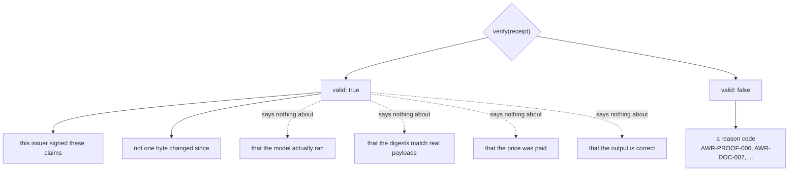
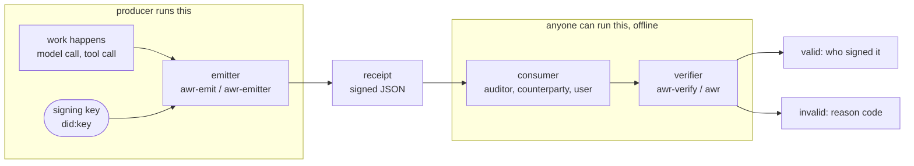
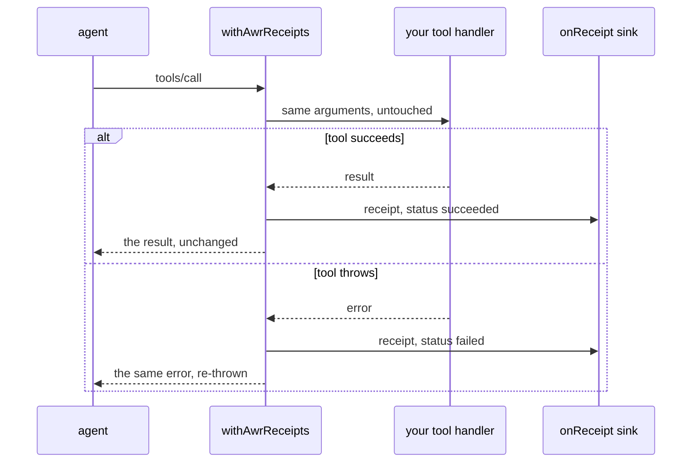
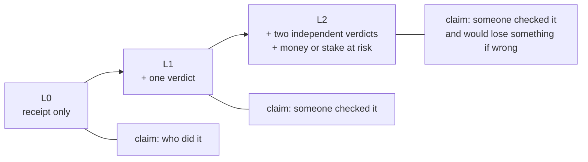
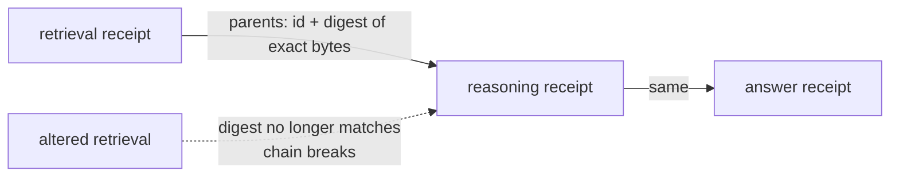

# AWR — work receipts for AI output

> **Русский:** [awr-receipts.ru.md](./awr-receipts.ru.md) · **Español:** [awr-receipts.es.md](./awr-receipts.es.md) · **Français:** [awr-receipts.fr.md](./awr-receipts.fr.md) · **中文:** [awr-receipts.zh.md](./awr-receipts.zh.md)
>
> Normative definition: [`awr/SPEC.md`](../awr/SPEC.md). This page is the practical guide.

---

## What it is

An **AWR work receipt** is a signed document that records what a piece of software did: which
model ran, a digest of the input, a digest of the output, when it finished, optionally the price
and links to the receipts of the work it built on.

It is not a new file format invented here. A receipt is a **W3C Verifiable Credential 2.0**
carrying a `DataIntegrityProof` with the `eddsa-jcs-2022` cryptosuite over
[RFC 8785](https://www.rfc-editor.org/rfc/rfc8785) canonical JSON, issued under a `did:key`. Every
one of those pieces is somebody else's standard, which is the point: an unmodified off-the-shelf
VC library verifies the signature with none of our code.

## What a valid receipt proves — and what it does not

This section is the most important one on the page, and the easiest to overstate.

**It proves:** this issuer signed these claims, and the bytes are intact. That is **attribution**.

**It does not prove** that the model ran, that the digests correspond to real payloads, that the
price was paid, or that the output is correct. A receipt is a signed statement by its issuer, and a
signature makes a statement *attributable*, not *true*. Anyone who tells you a valid receipt means
the work was done correctly is wrong, and the specification says so in §13.7.



The dashed arrows are the ones people get wrong. Everything on the right of them needs somebody
else to attest to it — which is what the profiles below are for.

This is a deliberate limit rather than a missing feature. Verification is cheap, offline and
universal precisely because it checks a signature and not the world.

## Two sides, two packages

| | what it does | who runs it | package |
|---|---|---|---|
| **emitter** | **writes** a receipt: takes what your system just did and signs a document saying so | the producer — whoever ran the work | [`@alexar76/awr-emit`](https://www.npmjs.com/package/@alexar76/awr-emit) (npm), [`awr-emitter`](https://pypi.org/project/awr-emitter/) (PyPI) |
| **verifier** | **reads** a receipt: checks the signature and the rules, and reports why not | the consumer — anyone who receives the document | [`@alexar76/awr-verify`](https://www.npmjs.com/package/@alexar76/awr-verify) (npm), [`awr`](https://pypi.org/project/awr/) (PyPI) |

They are separate packages on purpose. A component that both issues receipts and judges them is
not evidence of anything.



The arrow from `R` to `C` is the only thing that crosses between the two boxes: a file. No
handshake, no shared service, no call back to the producer.

All four have **zero runtime dependencies** in the JavaScript case and only `cryptography` in the
Python case. `npm install @alexar76/awr-emit @alexar76/awr-verify` adds exactly two packages.

## Emit

```js
import { emitReceipt, generateKey, jcsPayload } from '@alexar76/awr-emit';

const key = generateKey();              // keep this; its .did is your issuer identity

const receipt = emitReceipt({
  key,
  modelId: 'claude-opus-5@anthropic',
  inputPayload: jcsPayload({ prompt: 'summarise this', n: 3 }),
  outputPayload: '...the answer...',
  latencyMs: 2340,
});
```

```python
from awr_emitter import emit_receipt, generate_key, jcs_payload

key = generate_key()

receipt = emit_receipt(
    key=key,
    model_id="claude-opus-5@anthropic",
    input_payload=jcs_payload({"prompt": "summarise this", "n": 3}),
    output_payload=b"...the answer...",
    latency_ms=2340,
)
```

The two emitters produce **byte-identical documents** for the same inputs and key. That is not a
claim, it is a test: it runs Node from pytest and compares the bytes.

## Verify

```js
const awr = require('@alexar76/awr-verify');
const result = await awr.verify(receipt);   // async: the Ed25519 check uses WebCrypto
result.valid                                 // true | false
result.reasons                               // [{ code: 'AWR-PROOF-006', … }, …]
```

```bash
npx awr-verify verify receipt.json     # exit 0 valid, 1 invalid, 2 usage/IO
python -m awr verify receipt.json      # the same contract, the same codes
```

Or paste the JSON into <https://verify.modelmarket.dev> — client-side, no backend, nothing sent
anywhere.

Verification makes **no network request**. Not to a registry, not to a chain, not even to the AWR
namespace URI in `@context`, which the specification forbids fetching (§13.5).

## MCP tool calls

For an MCP server, one wrapper gives every tool call a receipt — including the calls that fail,
because an unverifiable failure is what a dispute usually turns on.

```js
import { withAwrReceipts } from '@alexar76/awr-emit/mcp';

const handler = withAwrReceipts(myToolHandler, {
  key,
  modelId: 'my-server@v1',
  onReceipt: (doc, err) => save(doc),   // required: a receipt nobody keeps is not evidence
});
```



The wrapper is transparent in both directions: the tool sees the arguments it would have seen, and
the caller sees the result or the original error. The receipt is a side effect, and the thrown error
is never passed off as the tool's output.

There is also a LangChain / LangGraph callback at `awr_emitter.adapters.langgraph_callback`. It is
duck-typed against the framework rather than importing it, so the package depends on no framework.

## Profiles

A receipt alone is level **L0**: attribution and nothing else. Higher levels require other
documents alongside it, and a verifier reports profile failures only for a profile you asked for.

- **L0** — a signed receipt.
- **L1** — plus a `VerificationVerdict` from someone who checked the work.
- **L2** — plus verdicts from two distinct issuers, neither the receipt's own, and an
  accountability binding: either settlement on the receipt or stake on every counted verdict.



L2 is where a receipt starts to say something about correctness, and it says it because independent
parties put something at risk — not because the signature got stronger.

Receipts also chain. A `parents` link commits to the parent receipt's **exact bytes**, so a step
cannot later be swapped for a different one that happens to share an identifier:



## Why you should believe the format is implementable

Three independent implementations pass the conformance suite on all **354** vectors: the Python
reference, a Rust implementation written from the specification text alone by someone who never saw
the reference code, and the browser JavaScript verifier. The Rust one earned its keep immediately —
the first cross-language run disagreed with the reference over whether `latencyMs: 2340` and
`2340.0` are the same document, which is exactly the class of split that no single implementation
can find.

Separately, an unmodified `@digitalbazaar/vc` 7.3.0 stack verifies these documents given nothing
but a `did:key` resolver. That is third-party code checking our signatures. It implements no AWR
semantics — no profiles, no reason codes, no chains — so it is not an AWR implementation, and two
of its behaviours differ from ours deliberately: it treats `validFrom`/`validUntil` as validity and
rejects a stale document, where AWR makes age a warning; and it rejects AWR/1 documents outright,
which is correct.

## What is not done

Every receipt issued so far is signed by a key the authors of this standard control. Nobody outside
has issued one. Until that changes, AWR is a well-specified format with three implementations and no
adopters — and no amount of further engineering changes that, because the missing piece is not
technical.

## Links

- Specification, reason-code registry, conformance suite: [`awr/SPEC.md`](../awr/SPEC.md)
- Browser verifier: <https://verify.modelmarket.dev>
- Emitters and adapters: [`awr/emitters/`](../awr/emitters/)
