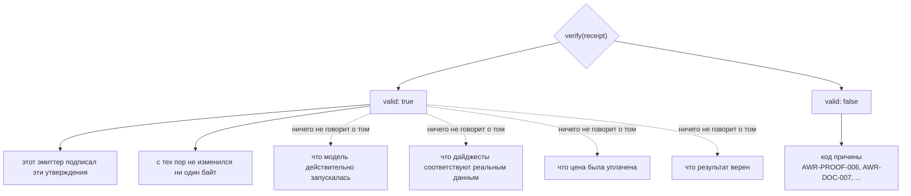
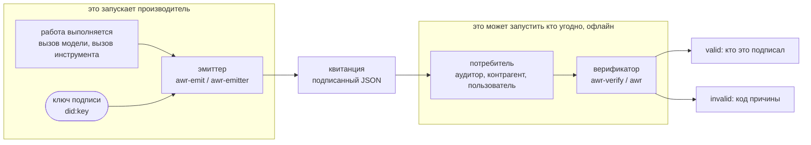
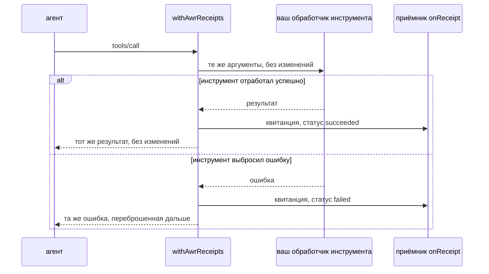
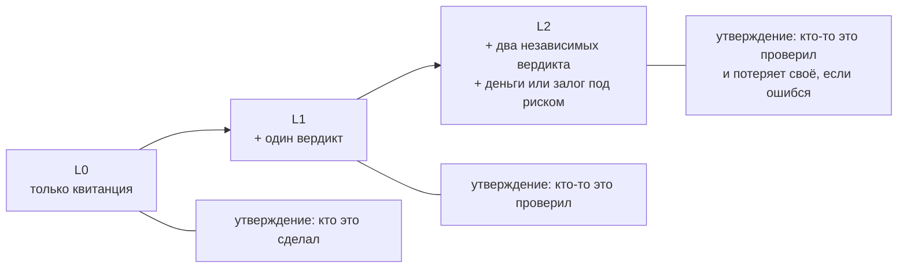
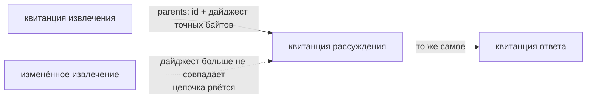

# AWR — квитанции о работе для результатов ИИ

> English: [awr-receipts.md](./awr-receipts.md) · **Русский** · Español: [awr-receipts.es.md](./awr-receipts.es.md) · Français: [awr-receipts.fr.md](./awr-receipts.fr.md) · 中文: [awr-receipts.zh.md](./awr-receipts.zh.md)
>
> Нормативное определение: [`awr/SPEC.md`](../awr/SPEC.md). Эта страница — практическое руководство.

---

## Что это

**Квитанция о работе AWR** — подписанный документ, который фиксирует, что именно сделала программа:
какая модель отработала, дайджест входных данных, дайджест результата, время завершения, при
необходимости цену и ссылки на квитанции той работы, на которую она опирается.

Никакого нового формата файлов здесь не изобретено. Квитанция — это **W3C Verifiable Credential
2.0** (верифицируемое удостоверение), которое несёт `DataIntegrityProof` с криптонабором
`eddsa-jcs-2022` над каноническим JSON по [RFC 8785](https://www.rfc-editor.org/rfc/rfc8785) и
выпущено под `did:key`. Каждая из этих частей — чужой стандарт, и в этом весь смысл: готовая,
ничем не изменённая библиотека для Verifiable Credential проверяет подпись, не задействуя ни
строчки нашего кода.

## Что доказывает действительная квитанция — и чего не доказывает

Это самый важный раздел на странице и тот, значение которого проще всего преувеличить.

**Она доказывает:** этот эмиттер (выпускающая сторона) подписал именно эти утверждения, и байты
целы. Это **атрибуция**.

**Она не доказывает** ни того, что модель действительно запускалась, ни того, что дайджесты
соответствуют реальным данным, ни того, что цена была уплачена, ни того, что результат верен.
Квитанция — это подписанное заявление её эмиттера, а подпись делает заявление *атрибутируемым*, но
не *истинным*. Всякий, кто говорит вам, что действительная квитанция означает правильно выполненную
работу, ошибается, и в спецификации это сказано прямо — §13.7.



Пунктирные стрелки — как раз то место, где обычно ошибаются. Всё, что справа от них, требует, чтобы
это засвидетельствовал кто-то ещё, — для этого и нужны профили, описанные ниже.

Это осознанно поставленный предел, а не недостающая возможность. Проверка дешёвая, офлайновая и
универсальная именно потому, что проверяет подпись, а не мир.

## Две стороны, два пакета

| | что делает | кто это запускает | пакет |
|---|---|---|---|
| **эмиттер** | **пишет** квитанцию: берёт то, что ваша система только что сделала, и подписывает документ об этом | производитель — тот, кто выполнил работу | [`@alexar76/awr-emit`](https://www.npmjs.com/package/@alexar76/awr-emit) (npm), [`awr-emitter`](https://pypi.org/project/awr-emitter/) (PyPI) |
| **верификатор** | **читает** квитанцию: проверяет подпись и правила, а если что-то не сходится — сообщает почему | потребитель — любой, кто получил документ | [`@alexar76/awr-verify`](https://www.npmjs.com/package/@alexar76/awr-verify) (npm), [`awr`](https://pypi.org/project/awr/) (PyPI) |

Это разные пакеты намеренно. Компонент, который и выпускает квитанции, и сам же их оценивает, не
служит доказательством чего бы то ни было.



Стрелка от `R` к `C` — единственное, что пересекает границу между двумя блоками: файл. Никакого
рукопожатия, никакого общего сервиса, никакого обращения назад к производителю.

У всех четырёх — **нулевые рантайм-зависимости** в случае JavaScript и только `cryptography` в
случае Python. `npm install @alexar76/awr-emit @alexar76/awr-verify` добавляет ровно два пакета.

## Выпуск

```js
import { emitReceipt, generateKey, jcsPayload } from '@alexar76/awr-emit';

const key = generateKey();              // сохраните его; его .did — это идентификатор вашего эмиттера

const receipt = emitReceipt({
  key,
  modelId: 'claude-opus-5@anthropic',
  inputPayload: jcsPayload({ prompt: 'summarise this', n: 3 }),
  outputPayload: '...the answer...',
  latencyMs: 2340,
});
```

```python
from awr_emitter import emit_receipt, generate_key, jcs_payload

key = generate_key()

receipt = emit_receipt(
    key=key,
    model_id="claude-opus-5@anthropic",
    input_payload=jcs_payload({"prompt": "summarise this", "n": 3}),
    output_payload=b"...the answer...",
    latency_ms=2340,
)
```

Оба эмиттера дают **побайтово идентичные документы** при одинаковых входных данных и одном ключе.
Это не декларация, а тест: он запускает Node из pytest и сравнивает байты.

## Проверка

```js
const awr = require('@alexar76/awr-verify');
const result = await awr.verify(receipt);   // асинхронно: проверка Ed25519 идёт через WebCrypto
result.valid                                 // true | false
result.reasons                               // [{ code: 'AWR-PROOF-006', … }, …]
```

```bash
npx awr-verify verify receipt.json     # код выхода 0 — валидно, 1 — невалидно, 2 — ошибка использования или ввода-вывода
python -m awr verify receipt.json      # тот же контракт, те же коды
```

Либо вставьте JSON на <https://verify.modelmarket.dev> — всё считается на стороне клиента, без
бэкенда, ничего никуда не отправляется.

Проверка не делает **ни одного сетевого запроса**. Ни к реестру, ни к блокчейну, ни даже к URI
пространства имён AWR в `@context` — спецификация запрещает его загружать (§13.5).

## Вызовы инструментов MCP

Для MCP-сервера одна обёртка даёт квитанцию каждому вызову инструмента — в том числе вызовам,
которые завершились ошибкой, ведь спор обычно и разворачивается вокруг сбоя, который невозможно
проверить.

```js
import { withAwrReceipts } from '@alexar76/awr-emit/mcp';

const handler = withAwrReceipts(myToolHandler, {
  key,
  modelId: 'my-server@v1',
  onReceipt: (doc, err) => save(doc),   // обязательно: квитанция, которую никто не хранит, не является доказательством
});
```



Обёртка прозрачна в обе стороны: инструмент получает те же аргументы, что и без неё, а вызывающая
сторона видит результат либо исходную ошибку. Квитанция — побочный эффект, и выброшенная ошибка
никогда не выдаётся за результат инструмента.

Есть также колбэк для LangChain / LangGraph — `awr_emitter.adapters.langgraph_callback`. Он
сопрягается с фреймворком по duck-typing, а не импортирует его, поэтому пакет не зависит ни от
одного фреймворка.

## Профили

Сама по себе квитанция — это уровень **L0**: атрибуция и ничего больше. Более высокие уровни
требуют других документов рядом с ней, а верификатор сообщает о несоответствии профилю только для
того профиля, который вы запросили.

- **L0** — подписанная квитанция.
- **L1** — плюс `VerificationVerdict` от того, кто проверил работу.
- **L2** — плюс вердикты от двух разных эмиттеров, ни один из которых не эмиттер самой квитанции, и
  привязка к ответственности: либо расчёт по квитанции, либо залог по каждому учтённому вердикту.



На уровне L2 квитанция начинает говорить кое-что и о правильности, но говорит она это потому, что
независимые стороны чем-то рискуют, — а не потому, что подпись стала крепче.

Квитанции ещё и сцепляются в цепочки. Ссылка `parents` фиксирует **точные байты** родительской
квитанции, поэтому подменить шаг другим, у которого просто совпал идентификатор, задним числом не
получится:



## Почему стоит поверить, что формат реализуем

Три независимые реализации проходят набор соответствия на всех **354** векторах: эталонная на
Python; реализация на Rust, написанная по одному только тексту спецификации человеком, который
никогда не видел эталонного кода; и браузерный верификатор на JavaScript. Rust-реализация оправдала
себя сразу же — первый межъязыковой прогон разошёлся с эталоном в том, считать ли `latencyMs: 2340`
и `2340.0` одним и тем же документом, а это ровно тот класс расхождений, который одна реализация в
одиночку обнаружить не может.

Отдельно: ничем не изменённый стек `@digitalbazaar/vc` 7.3.0 проверяет эти документы, получив
только резолвер `did:key`. Это сторонний код, проверяющий наши подписи. Семантики AWR он не
реализует — ни профилей, ни кодов причин, ни цепочек, — а значит, реализацией AWR он не является, и
два его поведения намеренно расходятся с нашими: он трактует `validFrom`/`validUntil` как срок
действия и отклоняет устаревший документ, тогда как в AWR возраст — лишь предупреждение; и он сразу
отклоняет документы AWR/1, что верно.

## Что не сделано

Все выпущенные до сих пор квитанции подписаны ключом, которым владеют авторы этого стандарта.
Никто вне проекта не выпустил ни одной. Пока это не изменится, AWR остаётся хорошо описанным
форматом с тремя реализациями и без тех, кто его применяет, — и никакая дальнейшая инженерная
работа этого не изменит, потому что недостающая часть лежит не в технике.

## Ссылки

- Спецификация, реестр кодов причин, набор соответствия: [`awr/SPEC.md`](../awr/SPEC.md)
- Браузерный верификатор: <https://verify.modelmarket.dev>
- Эмиттеры и адаптеры: [`awr/emitters/`](../awr/emitters/)
