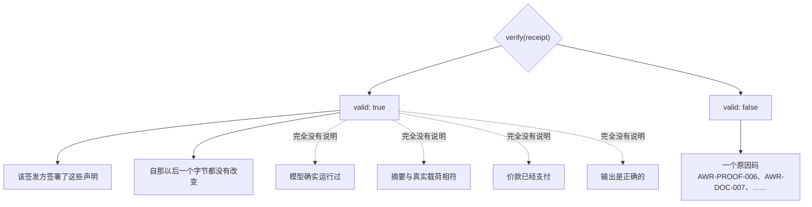
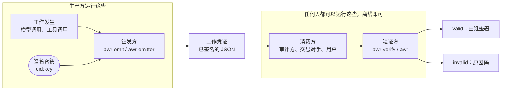
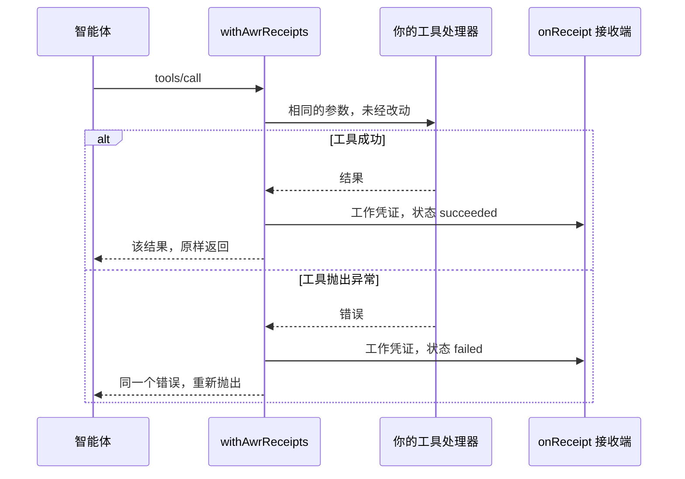
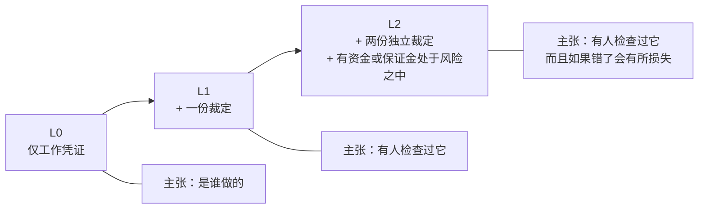
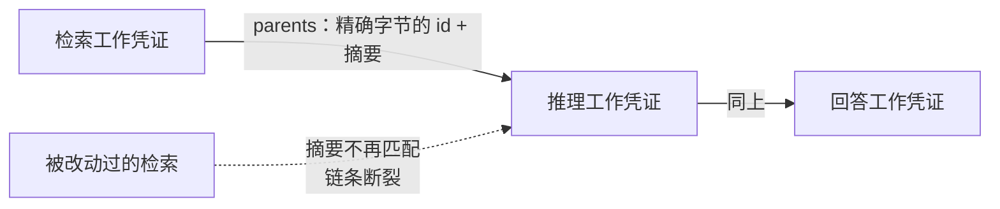

# AWR —— AI 输出的工作凭证

> English: [awr-receipts.md](./awr-receipts.md) · Русский: [awr-receipts.ru.md](./awr-receipts.ru.md) · Español: [awr-receipts.es.md](./awr-receipts.es.md) · Français: [awr-receipts.fr.md](./awr-receipts.fr.md) · **中文**
>
> 规范性定义见 [`awr/SPEC.md`](../awr/SPEC.md)。本页是实践指南。

---

## 它是什么

**AWR 工作凭证**是一份经过签名的文档，它记录一段软件做了什么：运行了哪个模型、输入的摘要、输出的
摘要、何时完成，以及可选的价格和指向它所依赖的那些工作凭证的链接。

它不是这里新发明的文件格式。一份工作凭证就是一份 **W3C Verifiable Credential 2.0**（可验证凭据），
其中携带一个 `DataIntegrityProof`，使用 `eddsa-jcs-2022` 密码套件，作用于
[RFC 8785](https://www.rfc-editor.org/rfc/rfc8785) 规范化 JSON 之上，并以 `did:key` 签发。上述每一
个部件都是别人的标准，而这正是重点所在：一个未经修改的现成 VC 库无需我们的任何代码即可验证签名。

## 一份有效的工作凭证证明了什么 —— 以及它没有证明什么

本节是整页中最重要的一节，也是最容易被夸大的一节。

**它证明的是：**该签发方签署了这些声明，并且字节完好无损。这就是**归属**（attribution）。

**它并不证明**模型确实运行过、摘要确实对应真实的载荷、价款已经支付，或者输出是正确的。一份工作凭证
是其签发方作出的一项经过签名的陈述，而签名让一项陈述**可归属**（attributable），而不是让它**为真**。
任何告诉你"有效的工作凭证意味着工作做对了"的人都是错的，规范在 §13.7 中就是这么写的。



那些虚线箭头正是人们会搞错的地方。它们右边的一切都需要别人来为之作证 —— 这就是下文那些一致性档次的用途。

这是一条刻意划定的界限，而不是一项缺失的功能。验证之所以廉价、离线且普适，恰恰是因为它检查的是一个
签名，而不是这个世界。

## 两侧，两个包

| | 作用 | 由谁运行 | 包 |
|---|---|---|---|
| **签发方（emitter）** | **写入**一份工作凭证：取你的系统刚刚做过的事，签署一份如此陈述的文档 | 生产方 —— 执行了这项工作的一方 | [`@alexar76/awr-emit`](https://www.npmjs.com/package/@alexar76/awr-emit)（npm）、[`awr-emitter`](https://pypi.org/project/awr-emitter/)（PyPI） |
| **验证方（verifier）** | **读取**一份工作凭证：检查签名与规则，并报告为什么不通过 | 消费方 —— 任何收到该文档的人 | [`@alexar76/awr-verify`](https://www.npmjs.com/package/@alexar76/awr-verify)（npm）、[`awr`](https://pypi.org/project/awr/)（PyPI） |

它们是刻意分开的两个包。一个既签发工作凭证又对其作出评判的组件，不能证明任何事情。



从 `R` 到 `C` 的那支箭头是两个方框之间唯一的往来：一个文件。没有握手，没有共享服务，也不用回头调用
生产方。

这四个包在 JavaScript 一侧都有**零运行时依赖**，在 Python 一侧只依赖 `cryptography`。
`npm install @alexar76/awr-emit @alexar76/awr-verify` 恰好只增加两个包。

## 签发

```js
import { emitReceipt, generateKey, jcsPayload } from '@alexar76/awr-emit';

const key = generateKey();              // 保存好它；它的 .did 就是你的签发方身份

const receipt = emitReceipt({
  key,
  modelId: 'claude-opus-5@anthropic',
  inputPayload: jcsPayload({ prompt: 'summarise this', n: 3 }),
  outputPayload: '...the answer...',
  latencyMs: 2340,
});
```

```python
from awr_emitter import emit_receipt, generate_key, jcs_payload

key = generate_key()

receipt = emit_receipt(
    key=key,
    model_id="claude-opus-5@anthropic",
    input_payload=jcs_payload({"prompt": "summarise this", "n": 3}),
    output_payload=b"...the answer...",
    latency_ms=2340,
)
```

对于相同的输入和相同的密钥，两个签发方实现产出**逐字节相同的文档**。这不是一句宣称，而是一项测试：
它从 pytest 里运行 Node 并比较字节。

## 验证

```js
const awr = require('@alexar76/awr-verify');
const result = await awr.verify(receipt);   // 异步：Ed25519 校验使用 WebCrypto
result.valid                                 // true | false
result.reasons                               // [{ code: 'AWR-PROOF-006', … }, …]
```

```bash
npx awr-verify verify receipt.json     # 退出码 0 有效，1 无效，2 用法/IO 错误
python -m awr verify receipt.json      # 相同的约定，相同的原因码
```

或者把 JSON 粘贴到 <https://verify.modelmarket.dev> —— 全部在客户端完成，没有后端，什么都不会被
发送到任何地方。

验证**不发起任何网络请求**。不访问注册表，不访问链，甚至不访问 `@context` 里的 AWR 命名空间 URI ——
规范禁止去抓取它（§13.5）。

## MCP 工具调用

对于一个 MCP 服务器，一个包装器就能让每一次工具调用都带上一份工作凭证 —— 包括那些失败的调用，因为
一次无法验证的失败往往正是争议的焦点所在。

```js
import { withAwrReceipts } from '@alexar76/awr-emit/mcp';

const handler = withAwrReceipts(myToolHandler, {
  key,
  modelId: 'my-server@v1',
  onReceipt: (doc, err) => save(doc),   // 必填：没人保存的工作凭证不构成证据
});
```



这个包装器在两个方向上都是透明的：工具看到的参数与它本来会看到的一样，调用方看到的是结果或原始错误。
工作凭证只是一个副作用，而被抛出的错误绝不会被冒充为工具的输出。

此外还有一个 LangChain / LangGraph 回调，位于 `awr_emitter.adapters.langgraph_callback`。它是按
鸭子类型对接框架的，而不是导入框架，因此这个包不依赖任何框架。

## 一致性档次（profile）

单独一份工作凭证处于 **L0** 级别：只有归属，别无其他。更高的级别要求在它旁边还有其他文档，而验证方
只会针对你所要求的那个一致性档次报告一致性档次层面的失败。

- **L0** —— 一份已签名的工作凭证。
- **L1** —— 外加一份来自检查过这项工作的人的 `VerificationVerdict`。
- **L2** —— 外加来自两个不同签发方的裁定（两者都不是该工作凭证自己的签发方），以及一项问责绑定：要么
  该工作凭证上有结算，要么每一份被计入的裁定上都有保证金。



到了 L2，一份工作凭证才开始就正确性说出点什么，而它之所以能这么说，是因为有独立各方把某种东西置于
风险之中 —— 而不是因为签名变强了。

工作凭证还可以成链。一条 `parents` 链接承诺的是父工作凭证的**精确字节**，因此某个步骤事后无法被换成
另一个恰好共用同一标识符的步骤：



## 为什么你可以相信这个格式是可实现的

三个独立实现在全部 **354** 个测试向量上通过了一致性测试集：Python 参考实现、一个仅凭规范文本由从未
看过参考代码的人写成的 Rust 实现，以及浏览器端的 JavaScript 验证方。那个 Rust 实现立刻就证明了自己
的价值 —— 首次跨语言运行时，它与参考实现在 `latencyMs: 2340` 和 `2340.0` 是否属于同一份文档这件事
上出现了分歧，而这恰恰是任何单一实现都无法发现的那类分裂。

另外，一个未经修改的 `@digitalbazaar/vc` 7.3.0 技术栈，只需一个 `did:key` 解析器就能验证这些文档。
那是第三方代码在校验我们的签名。它没有实现任何 AWR 语义 —— 没有一致性档次，没有原因码，没有链 —— 所以
它不是一个 AWR 实现，而且它有两处行为与我们刻意不同：它把 `validFrom`/`validUntil` 当作有效期并拒绝
过期的文档，而 AWR 只把陈旧程度当作一条警告；以及它直接拒绝 AWR/1 文档，这是正确的。

## 尚未完成的部分

迄今为止签发的每一份工作凭证，都由本标准作者所控制的密钥签署。本项目之外还没有任何人签发过工作凭证。
在这一点改变之前，AWR 只是一个规范完备、拥有三个实现、却没有采用者的格式 —— 而且再多的工程工作也
改变不了这一点，因为缺失的那一块并非技术问题。

## 链接

- 规范、原因码注册表、一致性测试集：[`awr/SPEC.md`](../awr/SPEC.md)
- 浏览器验证方：<https://verify.modelmarket.dev>
- 签发方与适配器：[`awr/emitters/`](../awr/emitters/)
