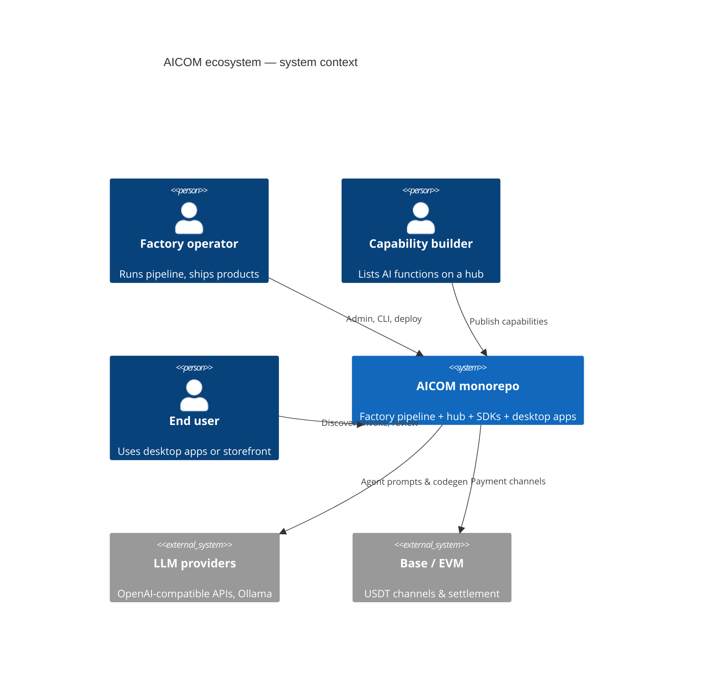
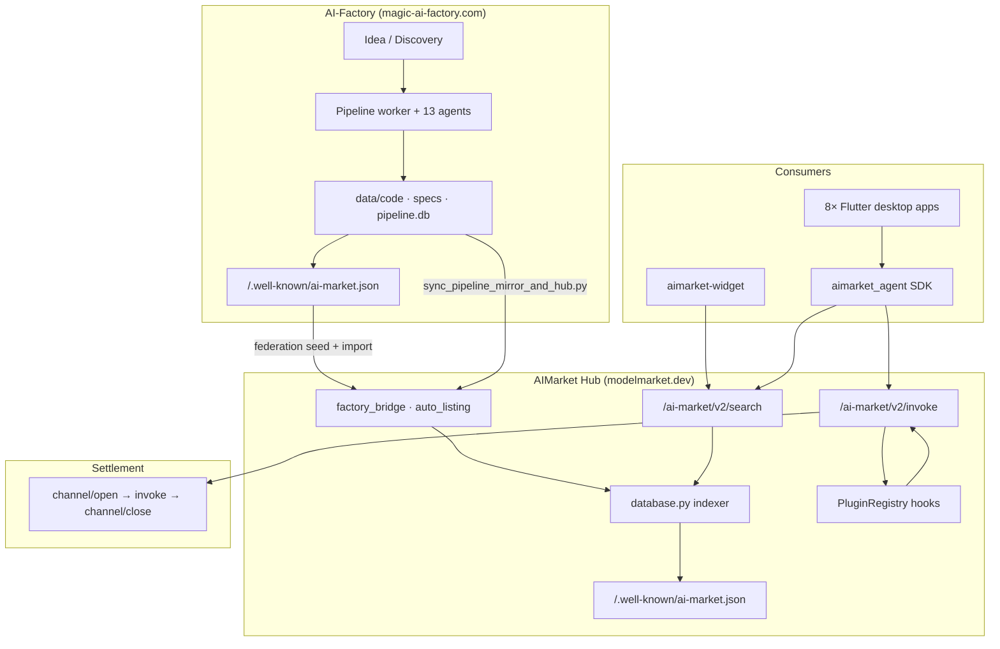
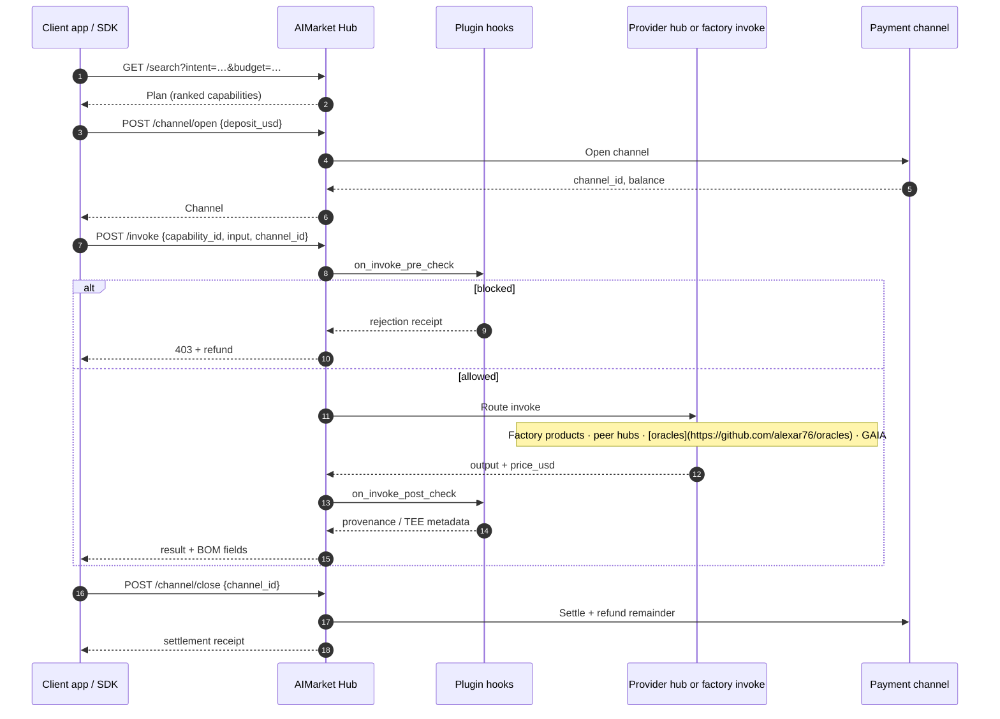
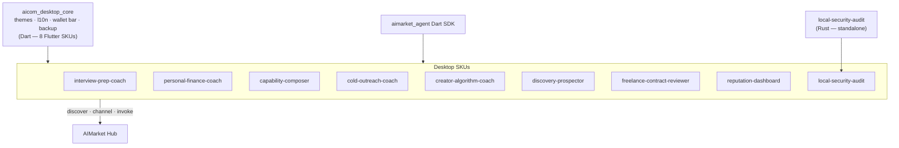
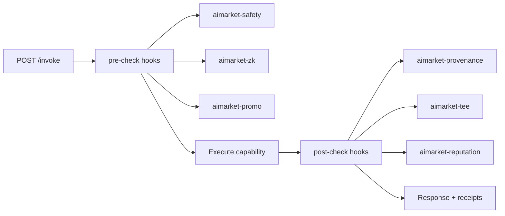

# AICOM Monorepo — Ecosystem Architecture

> **Core capabilities:** [killer-features.md](killer-features.md) — Auto-Mesh Pipeline · Zero-Trust Discovery · TEE Escrow · 1-Click Embed

Industry-style reference for how **AI-Factory**, **AIMarket Protocol v2**, **AIMarket Hub**, **desktop SKUs**, and **on-chain settlement** fit together in this repository.

Normative protocol: [`aimarket-protocol/spec.md`](https://github.com/alexar76/aimarket-protocol/blob/main/spec.md) · **Full ecosystem diagram:** [`aimarket-protocol/ecosystem.md`](https://github.com/alexar76/aimarket-protocol/blob/main/ecosystem.md) · Hub implementation: [`aimarket-hub/README.md`](https://github.com/alexar76/aimarket-hub/blob/main/README.md)

---

## 1. System context (C4 — Level 1)

---

## 2. Monorepo map

| Path | Role | Split-repo target |
|------|------|-------------------|
| [`web/`](../web/) | AI-Factory UI (Next.js) + API (FastAPI) | `aicom` core |
| [`agents/`](../agents/) · [`orchestrator/`](../orchestrator/) · [`pipeline_worker.py`](../pipeline_worker.py) | Multi-agent product pipeline | `aicom` |
| [`aimarket-hub/`](https://github.com/alexar76/aimarket-hub/tree/main/) | Federation hub (search, invoke, plugins) | `aimarket-hub` |
| [`aimarket-protocol/`](https://github.com/alexar76/aimarket-protocol/tree/main/) | Protocol v2 spec + schemas | `aimarket-protocol` |
| [`plugins/`](https://github.com/alexar76/aimarket-plugins/tree/main/plugins/) | 14 pip-installable hub plugins | one repo per plugin |
| [`aimarket-sdks/`](https://github.com/alexar76/aimarket-sdks/tree/main/) | Dart / TS / Rust client SDKs | per language |
| [`aimarket-widget/`](https://github.com/alexar76/aimarket-widget/tree/main/) | Embeddable search + invoke widget | `aimarket-widget` |
| [`desktop-integrations/`](https://github.com/alexar76/aimarket-desktop/tree/main/) | 8 Flutter desktop SKUs (sharing `aicom_desktop_core`) + 1 standalone Rust SKU (`local-security-audit`) | one repo per app |
| `gaia/` | Physical-world oracle gateway (IoT sensors → verified capabilities) | `gaia` |
| [`contracts/`](../contracts/) | EVM + Solana payment contracts | `aicom-contracts` |

---

## 3. End-to-end data flow

**Ship on factory → list on hub → consume from desktop/widget.**

Ops script: [`scripts/sync_pipeline_mirror_and_hub.py`](../scripts/sync_pipeline_mirror_and_hub.py) · Loader: [`aimarket_hub/factory_bridge.py`](https://github.com/alexar76/aimarket-hub/blob/main/aimarket_hub/factory_bridge.py)

---

## 4. Production deployment topology

Typical split-host layout (see [`production-modelmarket-dev.md`](./production-modelmarket-dev.md)):

| Surface | Default host port | Purpose |
|---------|-------------------|---------|
| Factory frontend | 9080 | Admin + storefront |
| Factory API | 9081 | REST, metrics |
| AIMarket Hub | 9083 (container listens on 9083) | Federation API + widget |

---

## 5. AIMarket invoke lifecycle (protocol v2)

Five phases implemented by [`aimarket_agent`](https://github.com/alexar76/aimarket-sdks/tree/main/dart/) and hub [`api.py`](https://github.com/alexar76/aimarket-hub/blob/main/aimarket_hub/api.py):

---

## 6. Desktop product layer

Eight Flutter SKUs share [`aicom_desktop_core`](https://github.com/alexar76/aimarket-desktop/tree/main/packages/aicom_desktop_core/) (Dart). One additional SKU — [`local-security-audit`](https://github.com/alexar76/aimarket-desktop/tree/main/local-security-audit/) — is written in Rust and uses its own native core; it does not depend on `aicom_desktop_core`.

Each app: `README.md` + `docs/{value,user-guide,sdk-integration,user-cases}.md`

---

## 7. Plugin composition model

Hub loads plugins via setuptools entry point `aimarket.plugins` ([`plugin.py`](https://github.com/alexar76/aimarket-hub/blob/main/aimarket_hub/plugin.py)):

Catalog: [`aimarket-hub/README.md`](https://github.com/alexar76/aimarket-hub/blob/main/README.md#plugin-ecosystem)

---

## 8. Documentation index

| Topic | Document |
|-------|----------|
| **Oracles** (17 signed math providers) | [oracles/docs/en.md](https://github.com/alexar76/oracles/blob/main/docs/en.md) · [ru](https://github.com/alexar76/oracles/blob/main/docs/ru.md) · [es](https://github.com/alexar76/oracles/blob/main/docs/es.md) · wiki [[Oracles]] |
| **GAIA** (physical oracles — IoT sensors) | [iot-physical-oracles.md](./iot-physical-oracles.md) |
| Factory pipeline diagrams | [architecture-diagrams.md](./architecture-diagrams.md) |
| Module boundaries | [architecture/module-boundaries.md](./architecture/module-boundaries.md) |
| Protocol v2 (normative) | [aimarket-protocol/spec.md](https://github.com/alexar76/aimarket-protocol/blob/main/spec.md) |
| Factory protocol gateway | [ai-market-protocol-v1.md](./ai-market-protocol-v1.md) |
| Hub production | [production-modelmarket-dev.md](./production-modelmarket-dev.md) |
| Federation report | [FEDERATION_HUB_REPORT.md](./FEDERATION_HUB_REPORT.md) |
| Product value (plain language) | `docs/value.md` in each package |

---

*Regenerate value blurbs: `python3 scripts/bootstrap_product_value.py`*
