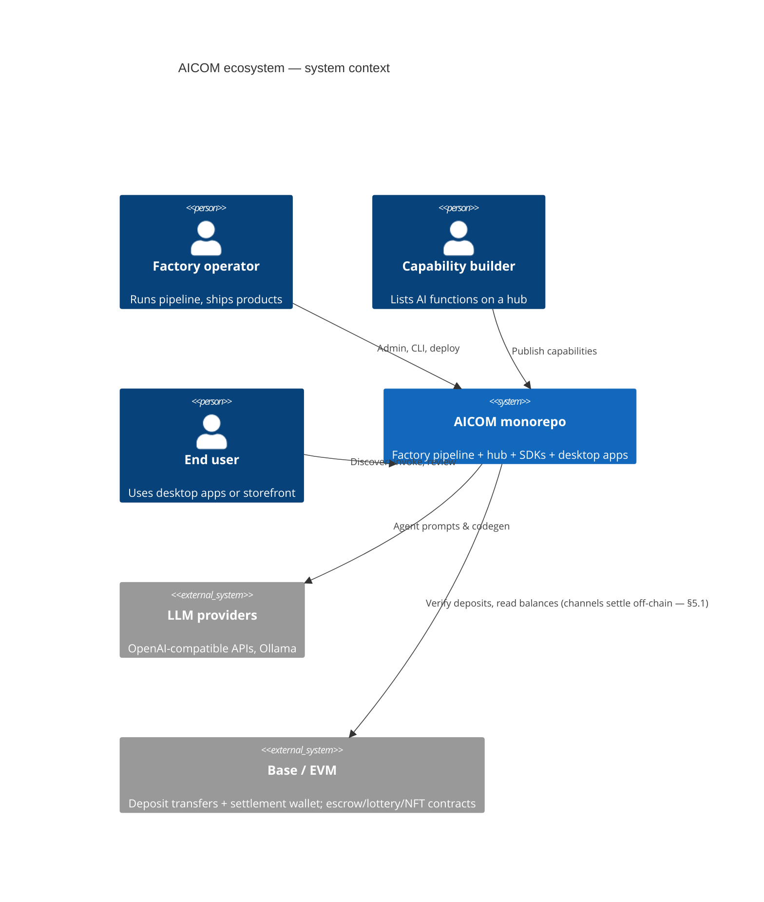
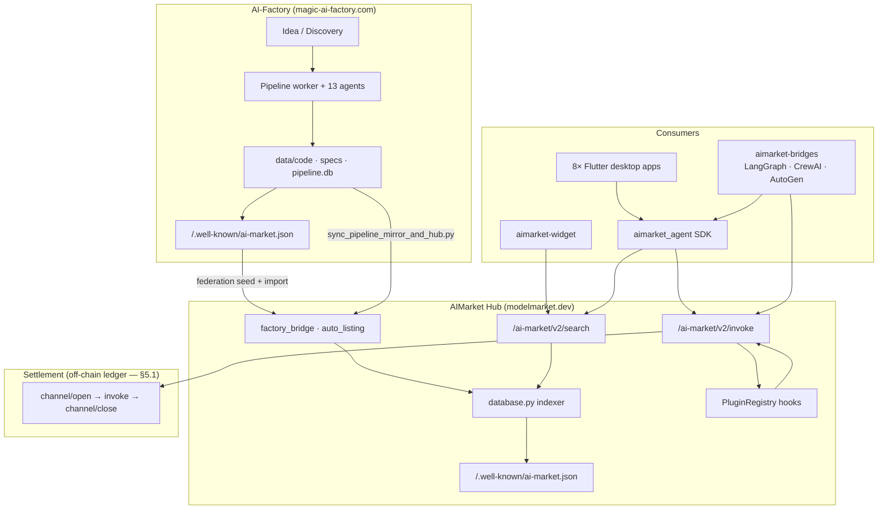
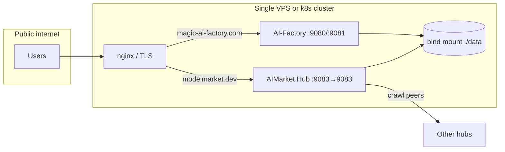
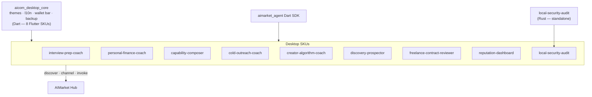
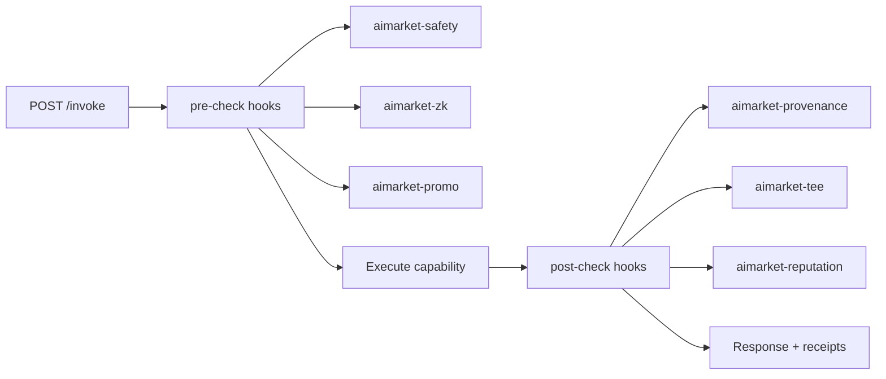

# AICOM Monorepo — Ecosystem Architecture

> **Core capabilities:** [killer-features.md](killer-features.md) — Auto-Mesh Pipeline · Zero-Trust Discovery · TEE Escrow · 1-Click Embed

Industry-style reference for how **AI-Factory**, **AIMarket Protocol v2**, **AIMarket Hub**, **desktop SKUs**, and **payment settlement** fit together in this repository.
What is actually on-chain versus off-chain is stated in [§5.1](#51-settlement-model--what-is-and-is-not-on-chain-today) — read it before quoting this document on payments.

Normative protocol: [`aimarket-protocol/spec.md`](https://github.com/alexar76/aimarket-protocol/blob/main/spec.md) · **Full ecosystem diagram:** [`aimarket-protocol/ecosystem.md`](https://github.com/alexar76/aimarket-protocol/blob/main/ecosystem.md) · Hub implementation: [`aimarket-hub/README.md`](https://github.com/alexar76/aimarket-hub/blob/main/README.md)

---

## 1. System context (C4 — Level 1)



---

## 2. Monorepo map

| Path | Role | Split-repo target |
|------|------|-------------------|
| [`web/`](../web/) | AI-Factory UI (Next.js) + API (FastAPI) | `aicom` core |
| [`agents/`](../agents/) · [`orchestrator/`](../orchestrator/) · [`pipeline_worker.py`](../pipeline_worker.py) | Multi-agent product pipeline | `aicom` |
| [`aimarket-hub/`](https://github.com/alexar76/aimarket-hub/tree/main/) | Federation hub (search, invoke, plugins) | `aimarket-hub` |
| [`aimarket-protocol/`](https://github.com/alexar76/aimarket-protocol/tree/main/) | Protocol v2 spec + schemas | `aimarket-protocol` |
| [`plugins/`](https://github.com/alexar76/aimarket-plugins/tree/main/plugins/) | 16 pip-installable hub plugins | one repo per plugin |
| [`aimarket-sdks/`](https://github.com/alexar76/aimarket-sdks/tree/main/) | Dart / TS / Rust client SDKs | per language |
| [`aimarket-bridges/`](https://github.com/alexar76/aimarket-bridges) | LangGraph / CrewAI / AutoGen adapters over Hub capabilities | `aimarket-bridges` |
| [`aimarket-widget/`](https://github.com/alexar76/aimarket-widget/tree/main/) | Embeddable search + invoke widget | `aimarket-widget` |
| [`desktop-integrations/`](https://github.com/alexar76/aimarket-desktop/tree/main/) | 8 Flutter desktop SKUs (sharing `aicom_desktop_core`) + 1 standalone Rust SKU (`local-security-audit`) + 1 VS Code extension (`ai-stack-migration-assistant`, TypeScript) | one repo per app |
| `gaia/` | Physical-world oracle gateway (IoT sensors → verified capabilities) | `gaia` |
| [`contracts/`](../contracts/) | EVM + Solana payment contracts | `aicom-contracts` |

---

## 3. End-to-end data flow

**Ship on factory → list on hub → consume from desktop/widget.**



Ops script: [`scripts/sync_pipeline_mirror_and_hub.py`](../scripts/sync_pipeline_mirror_and_hub.py) · Loader: [`aimarket_hub/factory_bridge.py`](https://github.com/alexar76/aimarket-hub/blob/main/aimarket_hub/factory_bridge.py)

---

## 4. Production deployment topology

Typical split-host layout (see [`production-modelmarket-dev.md`](./production-modelmarket-dev.md)):



| Surface | Default host port | Container port | Purpose |
|---------|-------------------|----------------|---------|
| Factory frontend | 9080 (`AICOM_PORT_FRONTEND`) | 8080 | Admin + storefront |
| Factory API | 9081 (`AICOM_PORT_API`) | 8081 | REST, metrics |
| AIMarket Hub | 9083 (`AIMARKET_HUB_HOST_PORT`) | 9083 | Federation API + widget |

---

## 5. AIMarket invoke lifecycle (protocol v2)

Five phases implemented by [`aimarket_agent`](https://github.com/alexar76/aimarket-sdks/tree/main/dart/) and hub [`api.py`](https://github.com/alexar76/aimarket-hub/blob/main/aimarket_hub/api.py):

```mermaid
sequenceDiagram
  autonumber
  participant App as Client app / SDK
  participant Hub as AIMarket Hub
  participant Plugins as Plugin hooks
  participant Provider as Provider hub or factory invoke
  participant Chain as Base / EVM chain
  participant Ledger as Hub channel ledger (SQLite)

  App->>Hub: GET /search?intent=…&budget=…
  Hub-->>App: Plan (ranked capabilities)

  App->>Chain: Transfer deposit to platform settlement wallet
  App->>Hub: POST /channel/open {deposit_usd, tx_hash, payer proof}
  Hub->>Chain: Verify tx (recipient · amount · token · confirmations · sender)
  Chain-->>Hub: Confirmed payer + amount
  Hub->>Ledger: Credit channel, bind to on-chain payer
  Hub-->>App: channel_id + channel_secret

  App->>Hub: POST /invoke {capability_id, input, channel_id}
  Hub->>Plugins: on_invoke_pre_check
  alt blocked
    Plugins-->>Hub: rejection receipt
    Hub-->>App: 403 (no debit recorded — nothing to refund)
  else allowed
    Hub->>Provider: Route invoke
    Note over Provider: Factory products · peer hubs · [oracles](https://github.com/alexar76/oracles) · GAIA
    Provider-->>Hub: output + price_usd
    Hub->>Ledger: Debit price_usd (off-chain, no tx)
    Hub->>Plugins: on_invoke_post_check
    Plugins-->>Hub: provenance / TEE metadata
    Hub-->>App: result + BOM fields
  end

  App->>Hub: POST /channel/close {channel_id}
  Hub->>Ledger: Mark settled; record remainder as a payout OBLIGATION
  Hub-->>App: receipt (used_usd · refund_owed_usd · refund_executed_usd = 0)
  Note over Hub,Chain: The refund payout itself is an out-of-band operator<br/>transfer, attested back with a tx hash. No chain call here.
```

### 5.1 Settlement model — what is and is not on-chain today

This is the single most-misdescribed part of the system, so it is stated plainly.

**On-chain today**

- The **deposit**. The consumer transfers USDC/USDT to the **platform settlement
  wallet** ([`on_chain.platform_recipient`](../web/backend/services/ai_market_protocol/on_chain.py)),
  and the hub verifies that transaction — recipient, amount, token, confirmations
  **and sender** — before crediting anything.
- **Payer binding.** The channel is credited only to the wallet that actually paid,
  and — by default in every mode — only against an EIP-191 signature proving control
  of that wallet (`AIMARKET_CHANNEL_ALLOW_UNPROVEN_PAYER=1` opts out; non-EVM payers
  have no proof scheme and are refused rather than credited unproven). Quoting a
  stranger's tx hash does not buy you their deposit.
- The **contracts themselves** exist, are source-verified on Base mainnet, and have
  been driven `openChannel → debitChannel → settleChannel` end-to-end **by hand**,
  with real USDC — see [`onchain-journal.md`](./onchain-journal.md).

**Not on-chain today**

- **The channel.** `/channel/open`, `/invoke` debits and `/channel/close` all run
  against the hub's SQLite ledger. Nothing in the repository calls
  `AIMarketEscrow.debitChannel` from the runtime path.
- **Custody.** Because the deposit is paid to the platform's own wallet rather than
  into the escrow contract, channel balances are **custodial**. The "non-custodial"
  property described in the whitepaper is a property of the *contract*, not of the
  hub rail that is running.
- **The refund.** Closing a channel records the unspent remainder as a durable
  **payout obligation** (`channel_payout_obligations`, hub migration 017); it does
  not send value. The settlement receipt reports `refund_owed_usd` separately from
  `refund_executed_usd`, which is always `0.0`. An operator pays out-of-band and
  attests it with `mark_obligation_paid(channel_id, payout_tx_hash)`. The
  factory-side implementation
  ([`web/backend/services/ai_market_protocol/channels.py`](../web/backend/services/ai_market_protocol/channels.py))
  additionally *verifies* a claimed refund transfer before marking it `paid`, and
  exposes `list_outstanding_refunds()` / `mark_refund_settled()`.

**Why the two rails must not be mixed.** If an operator opened a contract channel
for the same funds, the contract's `usedAmount` would remain 0 however much the
ledger consumed — so `refundChannel` / `expireChannel` would hand a fully-consumed
deposit back in full. Tracked as **KI-11** in [`known-issues.md`](./known-issues.md).

---

## 6. Desktop product layer

Eight Flutter SKUs share [`aicom_desktop_core`](https://github.com/alexar76/aimarket-desktop/tree/main/packages/aicom_desktop_core/) (Dart). One additional SKU — [`local-security-audit`](https://github.com/alexar76/aimarket-desktop/tree/main/local-security-audit/) — is written in Rust and uses its own native core; it does not depend on `aicom_desktop_core`.



Each app: `README.md` + `docs/{value,user-guide,sdk-integration,user-cases}.md`

---

## 7. Plugin composition model

Hub loads plugins via setuptools entry point `aimarket.plugins` ([`plugin.py`](https://github.com/alexar76/aimarket-hub/blob/main/aimarket_hub/plugin.py)):



Catalog: [`aimarket-hub/README.md`](https://github.com/alexar76/aimarket-hub/blob/main/README.md#plugin-ecosystem)

---

## 8. Documentation index

| Topic | Document |
|-------|----------|
| **Oracles** (17 signed math providers) | [oracles/docs/en.md](https://github.com/alexar76/oracles/blob/main/docs/en.md) · [ru](https://github.com/alexar76/oracles/blob/main/docs/ru.md) · [es](https://github.com/alexar76/oracles/blob/main/docs/es.md) · wiki [[Oracles]] |
| **GAIA** (physical oracles — IoT sensors) | [iot-physical-oracles.md](./iot-physical-oracles.md) |
| Factory pipeline diagrams | [architecture-diagrams.md](./architecture-diagrams.md) |
| Module boundaries | [architecture/module-boundaries.md](./architecture/module-boundaries.md) |
| Protocol v2 (normative) | [aimarket-protocol/spec.md](https://github.com/alexar76/aimarket-protocol/blob/main/spec.md) |
| Factory protocol gateway | [ai-market-protocol-v1.md](./ai-market-protocol-v1.md) |
| Hub production | [production-modelmarket-dev.md](./production-modelmarket-dev.md) |
| Federation report | [FEDERATION_HUB_REPORT.md](./FEDERATION_HUB_REPORT.md) |
| Open gaps (incl. KI-11 off-chain settlement) | [known-issues.md](./known-issues.md) |
| On-chain proof journal | [onchain-journal.md](./onchain-journal.md) |
| Product value (plain language) | `docs/value.md` in each package |

---

*Regenerate value blurbs: `python3 scripts/bootstrap_product_value.py`*
