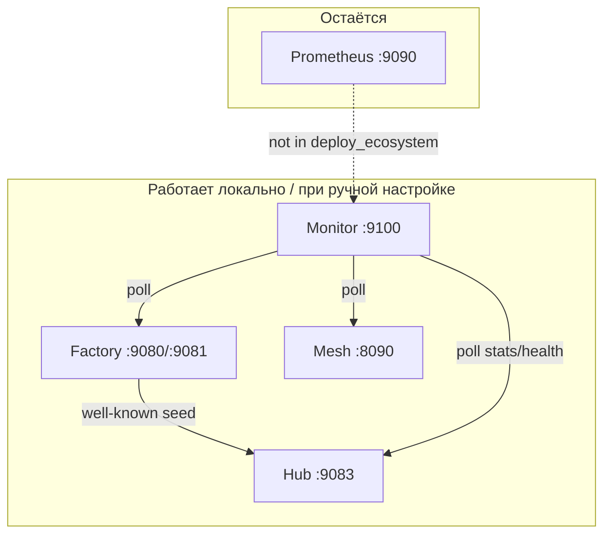

# Аудит экосистемы AICOM — связность и безопасность

**Дата:** 2026-06-25  
**Объём:** monorepo `aicom` — Factory, Hub, Mesh, Monitor, ARGUS, платежи, федерация.  
**Метод:** ревью кода + сверка с `docs/ecosystem-threat-assessment.md`, `docs/security.md`, deploy-скриптами, публичными endpoint'ами.

> Контракты **pre-mainnet**. Оценки — риски развёртывания и дизайна, не CVSS на проде.

---

## Резюме

| Категория | Critical | High | Medium | Low |
|-----------|:--------:|:----:|:------:|:---:|
| Безопасность | 1 | 5 | 9 | 6 |
| Связность | 0 | 3 | 10 | 4 |

| **Главные выводы (обновлено 2026-06-22):**

1. ~~**Alien Monitor** read/WS~~ — закрыто: tiered auth + `ALIEN_PUBLIC_READ` для демо UI.
2. ~~**Factory → Hub** sync~~ — `deploy_hub.sh` mount `/factory_data` + post-deploy import.
3. ~~**ARGUS → Mesh**~~ — default `http://127.0.0.1:8090` + path `/v1/agents`.
4. ~~**Hub invoke** crypto bypass~~ — канал обязателен при `AIFACTORY_CRYPTO_ENABLED=1`.
5. ~~**Factory channels** без secret~~ — `channel_secret` при open, `X-Payment-Channel-Secret` при debit.

**Остаётся открытым:** S-H4 stake verify, S-H5 demo admin, C-M3 Prometheus, P2 docs/hardening.

**Что уже хорошо:** replay protection в escrow, SSRF-hardened crawler, federated slash + PoM, hub debit secret, prod guards на mesh tokens, CSRF на factory admin, safety gate на invoke.

---

## 1. Безопасность

### Critical

#### S-C1 — Alien Monitor: публичное чтение состояния экосистемы

| | |
|---|---|
| **Файлы** | `alien-monitor/backend/main.py`, `monitor_auth.py` |
| **Статус** | **Исправлено** (2026-06-22) |

`require_monitor_read_auth` / `require_monitor_state_auth` на read API; `set_mode` по WS требует token.

- `GET /api/state` — token в production (даже при `ALIEN_PUBLIC_READ=1`)
- `GET /api/summary`, `GET /api/topology` — token в production, кроме `ALIEN_PUBLIC_READ=1` (публичный `/monitor/`)
- `WebSocket /ws` — стрим открыт для демо; `set_mode` требует `token` в сообщении

Deploy: `ALIEN_PUBLIC_READ=1`, `ALIEN_ENV=production` в `docker-compose.prod.yml`.

---

### High

#### S-H1 — Mesh: публичные read endpoint'ы по умолчанию

| | |
|---|---|
| **Файлы** | `ai-service-mesh/docker-compose.prod.yml`, `scripts/deploy_mesh.sh` |
| **Статус** | **Исправлено** — `MESH_PUBLIC_READ=0` в prod compose + deploy fill |

---

#### S-H2 — Hub: обход оплаты вне production mode

| | |
|---|---|
| **Файлы** | `aimarket-hub/aimarket_hub/api.py` |
| **Статус** | **Исправлено** — канал обязателен при `AIFACTORY_CRYPTO_ENABLED=1` |

---

---

#### S-H3 — Factory: debit канала без secret

| | |
|---|---|
| **Файлы** | `web/backend/services/ai_market_protocol/channels.py` |
| **Статус** | **Исправлено** — `channel_secret` при open, `secret_hash` в store, debit с `X-Payment-Channel-Secret` |

---

#### S-H4 — Supply stake без on-chain верификации

| | |
|---|---|
| **Файлы** | `aimarket-hub/aimarket_hub/supply_security.py`, `POST /supply/stake` |
| **Статус** | Подтверждено |

`stake()` записывает `tx_hash` в БД без проверки транзакции. Вместе с слабым publish gate — Sybil на listing supply.

**Fix:** verify_tx перед stake; `ACEX_MIN_LISTING_REVENUE_USD` > 0 на mainnet.

---

#### S-H5 — Public demo: passwordless admin

| | |
|---|---|
| **Файлы** | `docs/security.md`, `public_demo_guard.py`, `admin/auth.py` |
| **Статус** | By design на demo; High при misconfig |

`AIFACTORY_DEMO_READONLY=1` — вход `admin` без пароля. Блокирует backup/settings/users, **не** все admin actions (sandbox, pipeline, new product).

`AIFACTORY_PROD=1` несовместим с demo — guard есть.

---

### Medium (выборка)

| ID | Проблема | Файлы | Статус |
|----|----------|-------|--------|
| S-M1 | Federated invoke: httpx с redirect, без `_url_is_safe` | `outbound_http.py` | **Исправлено** |
| S-M2 | `invoke_url` проверяется при publish, не при каждом invoke (DNS rebinding) | `publish.py`, `api.py` | открыто |
| S-M3 | Anonymous channel close без wallet match | `channels.py` (hub + factory) | открыто |
| S-M4 | Hub `/invoke` unauthenticated; sandbox 3 trials/visitor; crypto off по умолчанию | `sandbox_trials.py`, `config.py` | by design |
| S-M5 | `POST /api/telemetry/*` без rate limit | `telemetry_events.py` | открыто |
| S-M6 | Mesh UI writes по Origin only (`MESH_ALLOW_UI_WRITES`) | `api.py` ~291 | открыто |
| S-M7 | Hub→Factory invoke без mutual TLS / hub identity | `api.py`, `ai_market_protocol_v1.py` | открыто |
| S-M8 | `/api/public/ecosystem-status` — операционная сводка публично | `public_ecosystem_status.py` | by design |
| S-M9 | ACEX revenue proofs shipped, on-chain settlement wiring неполный | `revenue_proofs.py`, threat assessment F4 | открыто |

### Low

- CORS/CSRF factory — в целом ок; telemetry/feedback без Origin check
- `.env.example` — плейсхолдеры; слабо документированы `ALIEN_API_TOKEN`, `AIMARKET_PUBLISH_TOKEN`
- `safety_gate.py` — regex/heuristic, не замена WAF
- Docs drift: OIDC nonce — в prod fail-closed (`oidc_auth.py`), в `security.md` написано fail-open

---

### Refuted / mitigated (не тратить effort)

| Область | Вердикт |
|---------|---------|
| Escrow debit replay | Nonce + `usedReceipts` + deadline (`AIMarketEscrow.sol`) |
| Crawler SSRF | `_url_is_safe`, no redirects, DNS resolve (`crawler.py`) |
| Federated slash smear | `require_pom`, signed attestations (`slash_sync.py`) |
| Hub channel debit | `channel_secret` HMAC (`channels.py`) |
| Mesh prod weak tokens | `RuntimeError` без `MESH_ALLOW_INSECURE_TOKENS` |
| Payment verify stub | Disabled in production (`payment.py`) |
| Hub admin routes | Fail-closed без `AIMARKET_ADMIN_TOKEN` |

Подробнее: [`ecosystem-threat-assessment.md`](./ecosystem-threat-assessment.md).

---

## 2. Связность и интеграция

### High

#### C-H1 — Factory → Hub catalog sync разорван

| | |
|---|---|
| **Статус** | **Исправлено** |

`deploy_hub.sh`: mount `$ROOT/data` → `/factory_data:ro`, `AIFACTORY_DATA_ROOT=/factory_data`, mirror + `docker exec import_factory_products` после health.

---

#### C-H2 — ARGUS → Mesh: неверный публичный URL

| | |
|---|---|
| **Статус** | **Исправлено** (co-located deploy) |

Default `ARGUS_MESH_URL=http://127.0.0.1:8090`, path `/v1/agents` (`argus/src/config.ts`, `mesh.ts`).  
Nginx proxy на mesh **не** добавлен — ARGUS и mesh на одном хосте, localhost достаточен.

---

#### C-H3 — Документация: порт Hub 9080 vs 9083

| | |
|---|---|
| **Статус** | **Исправлено** в `docs/ecosystem-architecture.md` |

---

### Medium (выборка)

| ID | Проблема |
|----|----------|
| C-M1 | `factory_bridge.export_hub_catalog_for_storefront` не подключён к HTTP |
| C-M2 | ARGUS не POST'ит в Monitor `/api/argus/run` — mock feed по умолчанию |
| C-M3 | Prometheus не в `deploy_ecosystem.sh` — LIVE monitor без prom metrics |
| C-M4 | Mesh default `MESH_HUB_URL=9080` (factory), hub на 9083 |
| C-M5 | `deploy_mesh.sh` пишет `ALIEN_MODE=real` в `.env` — конфликт с monitor universe |
| C-M6 | v1 well-known на factory vs v2 на hub — разные manifest shapes |
| C-M7 | Demo readonly только на factory, не на hub |
| C-M8 | `public_ecosystem_status` не включает mesh; `ALIEN_MONITOR_PUBLIC_URL` не в deploy |
| C-M9 | Plugin docs curl hub на `:9080` |

---

## 3. Карта доверия



---

## 4. План remediation (приоритет)

### P0 — выполнено (2026-06-22)

1. ~~Monitor read/WS~~ — tiered auth + `ALIEN_PUBLIC_READ=1` для `/monitor/`.
2. ~~`MESH_PUBLIC_READ=0`~~ — prod compose + deploy fill.
3. ~~Factory→hub sync~~ — `deploy_hub.sh`.
4. ~~ARGUS mesh URL~~ — localhost `:8090` + `/v1/agents`.

### P1 — выполнено

5. ~~Factory channel secret~~.
6. ~~Hub payment channel when crypto on~~.
7. On-chain verify для `/supply/stake` — **открыто**.
8. ~~Hub outbound `_url_is_safe` + no redirects~~ — `outbound_http.py`.

### P2 — hardening и docs (открыто)

9. Rate limit telemetry; slim public metrics endpoint.
10. ~~Исправить порты hub в docs~~.
11. Prometheus в ecosystem deploy или graceful degrade в Monitor LIVE.
12. ACEX revenue root wiring (threat assessment P0).

---

## 5. Production operations (autonomous / high load)

Требования для долгой работы без ручного вмешательства:

| Область | Механизм |
|---------|----------|
| **Deploy** | `deploy_ecosystem.sh` — полный цикл; hub sync встроен в `deploy_hub.sh` |
| **Restart** | Docker `unless-stopped` на hub/mesh/factory/monitor |
| **Health** | `verify_ecosystem_full.sh` после deploy; `GET /api/public/ecosystem-status` |
| **Secrets** | `ALIEN_API_TOKEN`, `MESH_API_TOKEN`, `AIMARKET_ADMIN_TOKEN` — из `data/secrets/` или `.env` fill |
| **Rate limits** | Mesh/hub/monitor — встроенные лимитеры; mesh read закрыт в prod |
| **Catalog drift** | Каждый hub redeploy → mirror + import; pipeline worker обновляет SQLite → mirror при следующем deploy |
| **Метрики** | `scripts/collect_production_metrics.py` → `docs/production-metrics.md` |

Рекомендуется cron на хосте (пример):

```bash
# Ежедневно: метрики + smoke (без полного redeploy)
0 6 * * * cd /path/aicom && python3 scripts/collect_production_metrics.py
15 6 * * * cd /path/aicom && ./scripts/smoke_stack_test.sh
```

Полный redeploy — только при релизе образов, не для sync каталога (sync уже в `deploy_hub.sh`).

---

## 6. Проверки для регресса

```bash
# Smoke (локальный stack)
./scripts/smoke_stack_test.sh

# Ecosystem verify
./scripts/verify_ecosystem_full.sh

# Security subset
./scripts/run_security_benchmark.sh

# Public metrics (после deploy endpoint)
curl -s https://magic-ai-factory.com/api/public/ecosystem-status | jq .slo

# Hub stats (правильный порт)
curl -s https://modelmarket.dev/ai-market/v2/stats/live | jq .summary
```

---

## 7. Связанные документы

| Документ | Содержание |
|----------|------------|
| [`ecosystem-threat-assessment.md`](./ecosystem-threat-assessment.md) | On-chain, federation, ACEX |
| [`security.md`](./security.md) | Factory CSRF, demo, prod guard |
| [`production-metrics.md`](./production-metrics.md) | Публичные SLO |
| [`deploy-ecosystem.md`](./deploy-ecosystem.md) | Порядок deploy |
| [`deploy-ecosystem-runbook.md`](./deploy-ecosystem-runbook.md) | **Runbook для деплоя** (секреты, чеклист, breaking changes) |
| [`ecosystem-architecture.md`](./ecosystem-architecture.md) | C4 |

---

*P0/P1 закрыты в коде; для prod — redeploy по [`deploy-ecosystem-runbook.md`](./deploy-ecosystem-runbook.md).*
