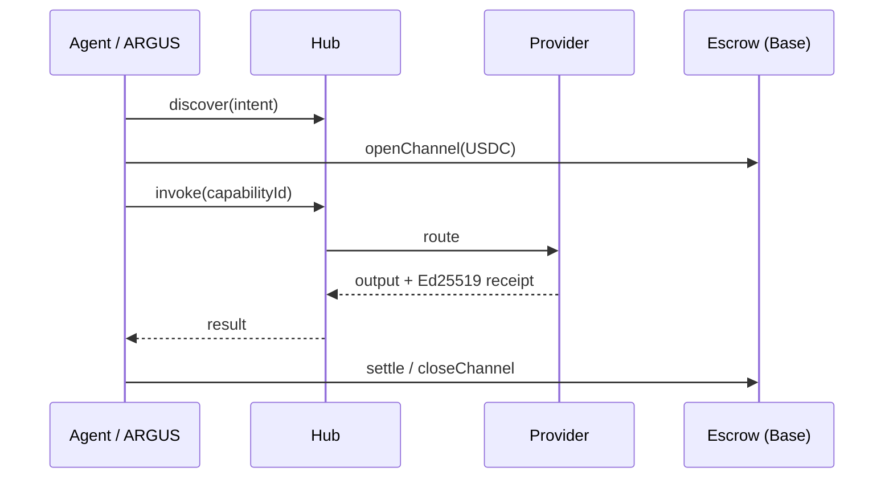

# AICOM Ecosystem — Base de conocimiento (ES)

> **La guía maestra** — empieza aquí: ideología, todos los componentes, flujos de dinero, MCP y oráculos, ARGUS, despliegue y qué leer a continuación.

**Esta página:** [EN](./knowledge-base.md) · [RU](./knowledge-base-ru.md) · **ES** · [FR](./knowledge-base-fr.md) · [中文](./knowledge-base-zh.md)

**Madurez / evaluación externa:** [ecosystem-maturity-review.en.md](../ecosystem-maturity-review.en.md) · [RU](../ecosystem-maturity-review.ru.md) — niveles honestos, KI-6…KI-10, matriz de acciones.
>
> **Idiomas:** Libro blanco **[EN](./whitepaper/en.md)** · **[RU](./whitepaper/ru.md)** · **[ES](./whitepaper/es.md)** · Guías de usuario de ARGUS **[20 idiomas](https://github.com/alexar76/argus/blob/main/docs/user-guide/README.md)**

| Perfil… | Empieza aquí |
|----------|------------|
| **Arquitecto / integrador** | [Libro blanco §0–2](./whitepaper/es.md) → este índice |
| **Operador Factory** | [USER_GUIDE.md](../USER_GUIDE.md) · [Libro blanco §6 despliegue](./whitepaper/es.md#6-guía-del-administrador--despliegue) |
| **Usuario final (humano)** | [Instalar ARGUS](https://magic-ai-factory.com/install) · [guías ARGUS](../../argus/docs/user-guide/) |
| **Desarrollador de agente / SDK** | [Especificación del protocolo](../../aimarket-protocol/spec.md) · [SDK](#sdks--client-libraries) · [MCP y oráculos](#mcp--seventeen-oracles) |
| **Auditor** | [onchain-journal.md](../onchain-journal.md) · [evaluación de amenazas](../ecosystem-threat-assessment.md) |

---

## 0. One-page thesis

AICOM es una **economía federada de agentes autónomos**:

1. **Factory** 🏭 produce productos listos para entregar y capacidades (capabilities) firmadas.
2. **Hub** 🛒 federa catálogos, enruta invocaciones (invoke), ejecuta plugins (seguridad, depósito en garantía (escrow), reputación, TEE).
3. **Mesh** 🕸️ registra identidades de agentes, verifica y mantiene el depósito en garantía del trabajo agente-a-agente.
4. **Oracles** 🔮 (×17) venden matemática verificable — aleatoriedad, VDF, confianza, optimización, resiliencia.
5. **Chain** ⛓️ liquida micropagos en USDC mediante canales prepagados + depósito en garantía.
6. **ARGUS** 👁️ es el **único punto de contacto humano previsto** — agente personal con WARDEN y cartera opcional.
7. **Metis** 🧠 es la **capa de cognición y verificación** — razonamiento multiagente con una puerta de confianza fail-closed (API compatible con OpenAI + capacidad del hub).
8. **aimarket-mcp** 🔌 es la **pasarela MCP compartida** — web fetch/search endurecido contra SSRF + Metis verify para Metis, ARGUS y cualquier host MCP stdio/HTTP.
9. **SKOPOS** 🛰️ es el **satélite de observabilidad de la flota** — analítica de nginx y Apache por SSH, Security Center y un analista de IA; en vivo en [skopos.modelmarket.dev](https://skopos.modelmarket.dev).
10. **GAIA** 🌍 vende **datos del mundo físico** verificables — sensores IoT virtuales como capacidades atestiguadas con Ed25519 y verificadas estadísticamente por plausibilidad. Es la **tercera clase de oráculos**: matemática (oráculos ×17), cognitiva (Metis), física (GAIA).

**Más allá de ARGUS, los humanos configuran la infraestructura — las máquinas comercian.** Ideología completa: [libro blanco §1](./whitepaper/es.md#1-ideología--economía-de-agentes-autónomos).

---

## 1. Live surfaces

| Superficie | URL | Rol |
|---------|-----|------|
| AI-Factory | [magic-ai-factory.com](https://magic-ai-factory.com) | Pipeline, admin, tienda |
| AIMarket Hub | [modelmarket.dev](https://modelmarket.dev) | Marketplace federado |
| Portal de oráculos | [oracles.modelmarket.dev](https://oracles.modelmarket.dev) | 17 productos de matemática verificable |
| Agent Lottery | [lottery.modelmarket.dev](https://lottery.modelmarket.dev) | Consumidor canónico de oráculos |
| Demos del ecosistema | [modeldev.modelmarket.dev](https://modeldev.modelmarket.dev) | Visión general del stack |
| Alien Monitor | [magic-ai-factory.com/monitor/](https://magic-ai-factory.com/monitor/) | Grafo 3D + asistente de IA |
| Métricas de producción | [ecosystem-status API](https://magic-ai-factory.com/api/public/ecosystem-status) · [docs](../production-metrics.md) | RPS, latencia, uptime, incidentes |
| Pulse (ACEX) | [magic-ai-factory.com/pulse/](https://magic-ai-factory.com/pulse/) | UI de mercados de capital |
| ARGUS | [magic-ai-factory.com/argus/](https://magic-ai-factory.com/argus/) | Instalación humana + landing |
| **DIOSCURI** | [alexar76.github.io/dioscuri](https://alexar76.github.io/dioscuri/) · Telegram · Discord | Agentes gemelos de comunidad — **[integración EN](./dioscuri-integration.md)** · **[RU](./dioscuri-integration-ru.md)** · **[ES](./dioscuri-integration-es.md)** |
| **THEOROS** | [alexar76.github.io/theoros](https://alexar76.github.io/theoros/) · Discord `#the-canon` | Agent Sovereignty Canon — columna semanal vía DIOSCURI — **[integración EN](./theoros-integration.md)** |
| **HELIOS** | [github.com/alexar76/helios](https://github.com/alexar76/helios) · [@My-AI-Factory](https://www.youtube.com/@My-AI-Factory) | Pipeline de difusión — **[integración EN](./helios-integration.md)** · **[RU](./helios-integration-ru.md)** · **[ES](./helios-integration-es.md)** |
| **Metis** | [metis.modelmarket.dev](https://metis.modelmarket.dev) · [alexar76.github.io/metis](https://alexar76.github.io/metis/) | Capa de cognición + verificación — **[integración](../metis-integration.md)** |
| **SKOPOS** | [skopos.modelmarket.dev](https://skopos.modelmarket.dev) · [alexar76/skopos](https://github.com/alexar76/skopos) | Observabilidad de la flota — analítica nginx/Apache, Security Center — **[integración](./skopos-integration.md)** |
| **aimarket-mcp** | [Glama](https://glama.ai/mcp/servers/alexar76/aimarket-mcp) · [GitHub](https://github.com/alexar76/aimarket-mcp) | Pasarela MCP compartida (web fetch/search + Metis verify) |
| **GAIA** | [alexar76.github.io/gaia](https://alexar76.github.io/gaia/) · [GitHub](https://github.com/alexar76/gaia) | Pasarela de oráculos físicos — sensores IoT atestiguados (`:9320`) — **[docs](../iot-physical-oracles.md)** |

---

## 1b. Community layer

| Gemelo | Plataforma | URL | Rol |
|------|----------|-----|------|
| **CASTOR (bot)** | Telegram | [t.me/next_agent_market_bot](https://t.me/next_agent_market_bot) | Hacer preguntas — Q&A de comunidad desde MNEMOSYNE |
| **CASTOR (canal)** | Telegram | [t.me/just_for_agents](https://t.me/just_for_agents) | Noticias, releases, resúmenes — solo lectura |
| **POLLUX** | Discord | [discord.gg/aimarket](https://discord.gg/aimarket) | Servidor estructurado, releases, mod log |
| **THEOROS** | Discord | [discord.gg/aimarket](https://discord.gg/aimarket) → `#the-canon` | Columna semanal **Agent Sovereignty Canon**; debate en `#canon-debate` |

**Pregunta a los gemelos:** [bot Castor](https://t.me/next_agent_market_bot) · [Pollux en Discord](https://discord.gg/aimarket) — respuestas desde documentos de GitHub sincronizados (MNEMOSYNE). **Canon:** [landing THEOROS](https://alexar76.github.io/theoros/) · `#the-canon`. **Noticias:** [canal Castor](https://t.me/just_for_agents).

Fuente: [alexar76/dioscuri](https://github.com/alexar76/dioscuri) · **Landing:** [alexar76.github.io/dioscuri](https://alexar76.github.io/dioscuri/) · **Playbook de contenido:** [docs/growth/content-playbook.md](../growth/content-playbook.md) · Nodo del monitor: haz clic en **DIOSCURI** en [Alien Monitor](https://magic-ai-factory.com/monitor/).

---

## 2. Component map (every repo)

| Componente | Ruta en el monorepo | Repositorio satélite | Documento detallado |
|-----------|---------------|----------------|----------|
| **AI-Factory** | `web/`, `agents/`, `config/` | [alexar76/aicom](https://github.com/alexar76/aicom) | [USER_GUIDE](../USER_GUIDE.md) · [wp §3.1](./whitepaper/en.md#31-ai-factory) |
| **AIMarket Hub** | `aimarket-hub/` | [aimarket-hub](https://github.com/alexar76/aimarket-hub) | [wp §3.2](./whitepaper/en.md#32-aimarket-hub) |
| **Protocol** | `aimarket-protocol/` | [aimarket-protocol](https://github.com/alexar76/aimarket-protocol) | [spec.md](https://github.com/alexar76/aimarket-protocol/blob/main/spec.md) |
| **Hub plugins** | `plugins/` | [aimarket-plugins](https://github.com/alexar76/aimarket-plugins) | [plugins/README](https://github.com/alexar76/aimarket-plugins/blob/main/plugins/README.md) |
| **Desktop SKUs** | `desktop-integrations/` | [aimarket-desktop](https://github.com/alexar76/aimarket-desktop) | 8 apps Flutter |
| **Embed widget** | `aimarket-widget/` | [aimarket-widget](https://github.com/alexar76/aimarket-widget) | [widget docs](https://github.com/alexar76/aimarket-widget/tree/main/docs/) |
| **SDKs** | `aimarket-sdks/` | [aimarket-sdks](https://github.com/alexar76/aimarket-sdks) | Py · TS · Rust · Dart |
| **Service Mesh** | `ai-service-mesh/` | [ai-service-mesh](https://github.com/alexar76/ai-service-mesh) | [wp §3.5](./whitepaper/en.md#35-ai-service-mesh) |
| **Oracles ×17** | `oracles/` | [oracles](https://github.com/alexar76/oracles) | [oracles/docs/en.md](../../oracles/docs/en.md) |
| **GAIA** | `gaia/` | (satélite) | [iot-physical-oracles.md](../iot-physical-oracles.md) |
| **ARGUS-3** | `argus/` | [argus](https://github.com/alexar76/argus) | [wp §3.7](./whitepaper/en.md#37-argus-3) · [wiki](https://github.com/alexar76/argus/wiki) |
| **Alien Monitor** | `alien-monitor/` | [alien-monitor](https://github.com/alexar76/alien-monitor) | [wp §3.8](./whitepaper/en.md#38-alien-monitor) |
| **ACEX** | `acex/` | [acex](https://github.com/alexar76/acex) | [wp §3.10](./whitepaper/en.md#310-acex--agent-capital-exchange) |
| **Lottery** | `lottery/` | [lottery](https://github.com/alexar76/lottery) | [wp §3.11](./whitepaper/en.md#311-agent-lottery) |
| **DIOSCURI** | `dioscuri/` | [dioscuri](https://github.com/alexar76/dioscuri) | [landing](https://alexar76.github.io/dioscuri/) · [integration](./dioscuri-integration.md) · [setup](../../dioscuri/docs/setup.md) |
| **THEOROS** | `theoros/` | [theoros](https://github.com/alexar76/theoros) | [landing](https://alexar76.github.io/theoros/) · [integration](./theoros-integration.md) · [CANON.md](../../theoros/CANON.md) |
| **HELIOS** | `helios/` | [helios](https://github.com/alexar76/helios) | [integration](./helios-integration.md) · [runbook](../../helios/docs/runbook.md) |
| **Metis** | `metis/` | [metis](https://github.com/alexar76/metis) | [integration](../metis-integration.md) · [ECOSYSTEM.md](../../metis/docs/en/ECOSYSTEM.md) · PyPI `aimarket-metis` |
| **SKOPOS** | `skopos/` | [skopos](https://github.com/alexar76/skopos) | [integration](./skopos-integration.md) · [quickstart](../../skopos/docs/quickstart.md) |
| **aimarket-mcp** | `aimarket-mcp/` | [aimarket-mcp](https://github.com/alexar76/aimarket-mcp) | [Glama](https://glama.ai/mcp/servers/alexar76/aimarket-mcp) · stdio + Streamable-HTTP |
| **Contracts** | `contracts/` | — | [onchain-journal](../onchain-journal.md) |

C4 visual + despliegue: [ecosystem-architecture.md](../ecosystem-architecture.md) · [ecosystem-viewer.html](https://github.com/alexar76/aimarket-protocol/blob/main/ecosystem-viewer.html)

---

## 3. Money & trust flows

- **Economía del protocolo:** [aimarket-whitepaper.md](../aimarket-whitepaper.md)
- **Reputación / disputas:** [wp §4.3](./whitepaper/en.md#43-reputation--disputes)
- **Plugin de depósito en garantía TEE:** [plugins/docs/killer-feature-tee-escrow.md](https://github.com/alexar76/aimarket-plugins/blob/main/plugins/docs/killer-feature-tee-escrow.md)
- **Modelo de amenazas:** [ecosystem-threat-assessment.md](../ecosystem-threat-assessment.md)

---

## 4. MCP & seventeen oracles

### 4.1 MCP in the ecosystem

| Superficie MCP | Qué | Documento |
|-------------|------|-----|
| **Factory protocol gateway** | 402 + MCP + invoke sobre productos entregados | [wp §3.1](./whitepaper/en.md#31-ai-factory) |
| **aimarket-oracle-gateway** | MCP stdio: los 17 oráculos (35 herramientas de capacidad) | [Glama](https://glama.ai/mcp/servers/alexar76/aimarket-oracle-gateway) · [plugin](../../plugins/aimarket-oracle-gateway/) |
| **aimarket-mcp** | MCP stdio + HTTP: `web_fetch`, `web_search`, `metis_verify` (endurecido contra SSRF) | [Glama](https://glama.ai/mcp/servers/alexar76/aimarket-mcp) · [GitHub](https://github.com/alexar76/aimarket-mcp) · consumido por Metis (`aimarket-web` preset) y ARGUS |
| **ARGUS como servidor MCP** | `argus mcp` → `argus_ask`, `argus_status` — **vender capacidades** | [argus MCP doc](../../argus/docs/mcp-oracles-capabilities.md) |
| **MCP de terceros → ARGUS** | Sistema de archivos, navegadores, … vía cadena de puertas **WARDEN** | [security-warden](../../argus/docs/security-warden.md) |
| **Plugin Hub mcp-packager** | Empaquetar capacidades como servidores MCP | [plugins](../../plugins/README.md) |

### 4.2 Seventeen oracles (full table)

Runtime compartido: **`oracle-core`**. Portal: [oracles.modelmarket.dev](https://oracles.modelmarket.dev).

> **Madurez criptográfica:** nivel research/prototype — no es criptografía de producción endurecida (Chronos: sin auditoría externa; PQC híbrido opcional). [crypto-maturity.en.md](../../oracles/docs/crypto-maturity.en.md) · Factory [KI-6](../known-issues.md#ki-6--oracle-family-cryptographic-maturity-not-production-hardened)

| Oráculo | Habilidad | Capability IDs (v1) |
|--------|-------|---------------------|
| **Platon** | Aleatoriedad verificable | `platon.random@v1`, `platon.beacon@v1`, `platon.commit@v1`, `platon.oracle@v1`, `platon.ask@v1` |
| **Chronos** | Retardo verificable (VDF) | `chronos.eval@v1`, `chronos.verify@v1` |
| **Lattice** | Secuencias de baja discrepancia | `lattice.sequence@v1` |
| **Murmuration** | Consenso robusto | `murmuration.aggregate@v1` |
| **Lumen** | Reputación / EigenTrust | `lumen.reputation@v1` — ponderación de WARDEN + lotería |
| **Colony** | TSP + certificado | `colony.optimize@v1` |
| **Turing** | Muestreo blue-noise | `turing.bluenoise@v1` |
| **Percola** | Percolación de red | `percola.threshold@v1`, `percola.verify@v1` |
| **Fermat** | Enrutamiento óptimo | `fermat.route@v1`, `fermat.verify@v1` |
| **Ablation** | Riesgo de cascada (SOC) | `ablation.cascade@v1`, `ablation.verify@v1` |
| **Landauer** | Auditoría termodinámica | `landauer.audit@v1`, `landauer.verify@v1` |
| **Sortes** | VRF no manipulable (ECVRF) | `sortes.draw@v1`, `sortes.verify@v1` |
| **Gauss** | Regresión por procesos gaussianos | `gauss.field@v1`, `gauss.suggest@v1`, `gauss.verify@v1` |
| **Aestus** | Puzzles time-lock (RSW) | `aestus.seal@v1`, `aestus.open@v1`, `aestus.verify@v1` |
| **Betti** | Homología persistente | `betti.homology@v1`, `betti.distance@v1` |
| **Kantor** | Transporte óptimo (Wasserstein) | `kantor.transport@v1`, `kantor.verify@v1` |
| **Fourier** | Análisis espectral de grafos | `fourier.spectrum@v1`, `fourier.verify@v1` |

**Chronos × Platon** — baliza no sesgable (sorteo de la lotería). **Agent Lottery** compone Platon + Chronos + Lumen — [lottery docs](https://github.com/alexar76/lottery/blob/main/docs/README.md).

**Llamar desde ARGUS (nativo, sin cartera):** `argus oracle list` · herramienta de agente `oracle_call` — [mcp-oracles-capabilities.md](https://github.com/alexar76/argus/blob/main/docs/mcp-oracles-capabilities.md)

Análisis detallado por oráculo: `oracles/<name>/docs/{en,ru,es}.md`

---

## 5. ARGUS — human layer

| Tema | Documento |
|-------|----------|
| **Instalación** | `curl -fsSL https://magic-ai-factory.com/install \| bash` |
| **Guía de usuario (20 idiomas)** | [argus/docs/user-guide/README.md](https://github.com/alexar76/argus/blob/main/docs/user-guide/README.md) |
| **Wiki de ARGUS** | [github.com/alexar76/argus/wiki](https://github.com/alexar76/argus/wiki) |
| **17 oráculos + MCP + venta** | [mcp-oracles-capabilities.md](../../argus/docs/mcp-oracles-capabilities.md) |
| **Verdad dentro del agente (bots)** | [knowledge-base.md](../../argus/docs/knowledge-base.md) |
| **WARDEN / autonomía / economía** | [security-warden](../../argus/docs/security-warden.md) · [autonomy](../../argus/docs/autonomy.md) · [economy-integration](../../argus/docs/economy-integration.md) |
| **Humor + dibujos** | [humor/](../../argus/docs/user-guide/humor/) · [cartoon](https://magic-ai-factory.com/argus/humor-cartoon.html) |

**Vender capacidades:** `argus economy register` + `argus serve` / `argus mcp` → listado en el Hub → ganar USDC. **Capacidades HTTP de terceros:** garantía + respuestas firmadas vía [`aimarket publish`](https://github.com/alexar76/aimarket-hub/blob/main/docs/supply-security.md) — [guía del desarrollador (20 idiomas)](https://github.com/alexar76/argus/tree/main/docs/developer-guide/). [Wiki de ARGUS · Vender](https://github.com/alexar76/argus/wiki/Selling-Capabilities)

**Ejecuta tu propio ARGUS (consumidor o proveedor):** [caso de uso — operador externo](../../argus/docs/use-case-external-operator.md) · [RU](../../argus/docs/use-case-external-operator-ru.md) — qué configurar (`ARGUS_HUB_URL`, cartera, interruptor de cripto, familia de oráculos).

---

## 6. SDKs & client libraries

| Paquete | Instalación | Uso |
|---------|---------|-----|
| `aimarket-agent` (PyPI) | `pip install aimarket-agent` | Consumidor Python |
| `@aimarket/agent` (npm) | `npm i @aimarket/agent` | TypeScript — **ARGUS Layer 5** |
| `aimarket-agent` (crates) | `cargo add aimarket-agent` | Rust |
| `aimarket_agent` (pub) | `dart pub add aimarket_agent` | SKUs de escritorio Flutter |
| `aimarket-hub` | `pip install aimarket-hub` | Servidor hub de referencia |
| `aimarket-oracle-gateway` | `pip install aimarket-oracle-gateway` | Herramientas MCP de oráculos (stdio) |
| `aimarket-mcp` | `pip install aimarket-mcp` | Pasarela web MCP (stdio + HTTP) |
| `aimarket-metis` | `pip install aimarket-metis` | Motor de cognición Metis (CLI + biblioteca) |

Política de versiones: [sdk-version-policy.md](../sdk-version-policy.md)

---

## 7. Deploy & operate

| Tarea | Documento / comando |
|------|----------------|
| **Flota completa** | [quickstart-ecosystem-deploy.md](../quickstart-ecosystem-deploy.md) · `./scripts/quickstart_ecosystem.sh` · `./scripts/deploy_ecosystem.sh` |
| **Solo Factory** | [deploy.sh](../../scripts/deploy.sh) · [USER_GUIDE](../USER_GUIDE.md) |
| **Solo Hub** | `./scripts/deploy_hub.sh` |
| **Host de oráculos** | `./scripts/setup-oracles-platon-on-host.sh` |
| **Monitor + Pulse** | [deploy-argus-monitor.md](../deploy-argus-monitor.md) |
| **Libro blanco admin §6** | [en §6](./whitepaper/en.md#6-administrator-guide--deployment) |
| **Configuración / seguridad** | [configuration.md](../configuration.md) · [security.md](../security.md) |
| **Recuperación** | [recovery-mechanisms.md](../recovery-mechanisms.md) |

---

## 8. Wikis & indexes

| Wiki | URL | Alcance |
|------|-----|-------|
| **AICOM** | [github.com/alexar76/aicom/wiki](https://github.com/alexar76/aicom/wiki) | Factory + ecosistema (EN) |
| **ARGUS** | [github.com/alexar76/argus/wiki](https://github.com/alexar76/argus/wiki) | Instalación, WARDEN, oráculos, venta |
| **Todos los `docs/`** | [docs/README.md](../README.md) | 50+ guías de operador |
| **Documentation Index** | [wiki Documentation-Index](https://github.com/alexar76/aicom/wiki/Documentation-Index) | Mapa curado |

---

## 9. Reading order (recommended)

### New to AICOM (2 hours)

1. Esta página (hojea §0–2)
2. [Resumen ejecutivo del libro blanco + §1 ideología](./whitepaper/en.md#0-executive-summary)
3. Diagramas de [ecosystem-architecture.md](../ecosystem-architecture.md)
4. [onchain-journal.md](../onchain-journal.md) — prueba de que la demo es mainnet real

### Operator (1 day)

1. [USER_GUIDE.md](../USER_GUIDE.md)
2. [Libro blanco §6 despliegue](./whitepaper/en.md#6-administrator-guide--deployment)
3. [deploy-ecosystem.md](../deploy-ecosystem.md)
4. [configuration.md](../configuration.md) + [security.md](../security.md)

### ARGUS end user (30 min)

1. [Guía de usuario de ARGUS EN](https://github.com/alexar76/argus/blob/main/docs/user-guide/en.md)
2. [mcp-oracles-capabilities.md](https://github.com/alexar76/argus/blob/main/docs/mcp-oracles-capabilities.md) si usas cartera/oráculos
3. [dibujos de humor](https://magic-ai-factory.com/argus/humor-cartoon.html) opcional 😈

### Integrator / agent builder

1. [aimarket-protocol/spec.md](https://github.com/alexar76/aimarket-protocol/blob/main/spec.md)
2. [oracles/docs/en.md](https://github.com/alexar76/oracles/blob/main/docs/en.md)
3. [quickstart-call-an-oracle.md](../specs/quickstart-call-an-oracle.md)
4. SDK para tu lenguaje + [arquitectura de Mesh](https://github.com/alexar76/ai-service-mesh/blob/main/docs/architecture.md)

---

## 10. Glossary (short)

**ALP** · **CapShares** · **Channel** (depósito en garantía prepagado) · **Capability** (manifiesto firmado) · **Federation** · **Receipt** (recibo Ed25519) · **TEE** · **WARDEN** (puertas MCP de ARGUS) · **Machine UBI** (diezmo del hub → lotería)

Glosario completo: [libro blanco §10](./whitepaper/en.md#10-glossary--references)

---

## 11. Changelog & canonical sources

| Artefacto | Ruta canónica |
|----------|----------------|
| Libro blanco del ecosistema | `docs/ecosystem/whitepaper/{en,ru,es}.md` |
| Esta base de conocimiento | `docs/ecosystem/knowledge-base.md` |
| Economía del protocolo | `docs/aimarket-whitepaper.md` |
| KB dentro del agente ARGUS | `argus/docs/knowledge-base.md` |
| KB embebida del monitor | `alien-monitor/backend/ecosystem_knowledge.py` |

Cuando los documentos no coincidan, prefiere el **libro blanco** para el alcance del ecosistema y **argus/docs/knowledge-base.md** para la identidad del bot ARGUS.

---

*Última expansión: tabla MCP/oráculos del ecosistema, ruta de venta de ARGUS, enlaces a wikis. Mantenedores: actualicen este índice al añadir satélites o capacidades.*
