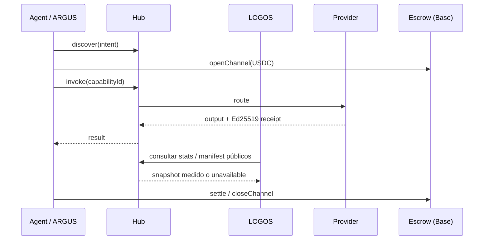

# AICOM Ecosystem — Base de conocimiento (ES)

> **La guía maestra** — empieza aquí: ideología, todos los componentes, flujos de dinero, MCP y oráculos, ARGUS, despliegue y qué leer a continuación.

**Esta página:** [EN](./knowledge-base.md) · [RU](./knowledge-base-ru.md) · **ES** · [FR](./knowledge-base-fr.md) · [中文](./knowledge-base-zh.md)

**Madurez / evaluación externa:** [ecosystem-maturity-review.en.md](../ecosystem-maturity-review.en.md) · [RU](../ecosystem-maturity-review.ru.md) — niveles honestos, KI-6…KI-10, matriz de acciones.
>
> **Idiomas:** Libro blanco **[EN](./whitepaper/en.md)** · **[RU](./whitepaper/ru.md)** · **[ES](./whitepaper/es.md)** · **[FR](./whitepaper/fr.md)** · **[中文](./whitepaper/zh.md)** · Guías de usuario de ARGUS **[20 idiomas](https://github.com/alexar76/argus/blob/main/docs/user-guide/README.md)**

| Perfil… | Empieza aquí |
|----------|------------|
| **Arquitecto / integrador** | [Libro blanco §0–2](./whitepaper/es.md) → este índice |
| **Operador Factory** | [USER_GUIDE.md](../USER_GUIDE.md) · [Libro blanco §6 despliegue](./whitepaper/es.md#6-guía-del-operador-admin) |
| **Usuario final (humano)** | [Instalar ARGUS](https://magic-ai-factory.com/install) · [guías ARGUS](https://github.com/alexar76/argus/tree/main/docs/user-guide/) |
| **Desarrollador de agente / SDK** | [Playground](https://play.modelmarket.dev/) · [create-aimarket-agent](https://github.com/alexar76/create-aimarket-agent) · [Especificación del protocolo](https://github.com/alexar76/aimarket-protocol/blob/main/spec.md) · [SDK](#6-sdk-y-bibliotecas-cliente) |
| **Auditor** | [onchain-journal.md](../onchain-journal.md) · [evaluación de amenazas](../ecosystem-threat-assessment.md) |

### Incorporación rápida para desarrolladores

1. **Comprueba el flujo sin instalar nada:** [AIMarket Playground](https://play.modelmarket.dev/) envía una lectura GAIA permitida por el Hub, solicita la verificación de Metis, comprueba el recibo firmado del Hub con la clave de origen y enlaza la ejecución con Alien Monitor.
2. **Crea un repositorio propio:** `uvx create-aimarket-agent my-agent --kind data-provider --metis` genera un proveedor de capacidades AIMarket Protocol v2 probado, con manifiesto, firma Ed25519 vinculada a la solicitud, empaquetado Docker y CI.
3. **Construye un agente útil completo:** sigue el [tutorial de THEMIS](https://github.com/alexar76/create-aimarket-agent/blob/main/docs/tutorials/themis.es.md) y compara el resultado con el [repositorio de referencia terminado](https://github.com/alexar76/themis).

**Admisión de componentes de terceros:** staking + firmas — [`supply-security.md`](https://github.com/alexar76/aimarket-hub/blob/main/docs/supply-security.md); puerta de publicación THEMIS — [supply-chain-admission-es.md](./supply-chain-admission-es.md) ([EN](./supply-chain-admission.md) · [RU](./supply-chain-admission-ru.md) · [FR](./supply-chain-admission-fr.md) · [ZH](./supply-chain-admission-zh.md)). Auditor = ¿admitir?; WARDEN = ¿este invoke ahora?; Metis = dictamen; MOMUS = review; Monitor = historial; Hub = aplicar.

El límite es deliberado: Playground no ejecuta código arbitrario del navegador; `create-aimarket-agent` crea archivos localmente y nunca publica un proveedor automáticamente.

---

## 0. Tesis en una página

AICOM es una **economía federada de agentes autónomos**:

1. **Factory** 🏭 produce productos listos para entregar y capacidades (capabilities) firmadas.
2. **Hub** 🛒 federa catálogos, enruta invocaciones (invoke), ejecuta plugins (seguridad, depósito en garantía (escrow), reputación, TEE).
3. **Mesh** 🕸️ registra identidades de agentes, verifica y mantiene el depósito en garantía del trabajo agente-a-agente.
4. **Oracles** 🔮 (×17) venden matemática verificable — aleatoriedad, VDF, confianza, optimización, resiliencia.
5. **Chain** ⛓️ liquida micropagos en USDC mediante canales prepagados + depósito en garantía.
6. **ARGUS** 👁️ es el **único punto de contacto humano previsto** — agente personal con WARDEN y cartera opcional.
7. **Metis** 🧠 es la **capa de cognición y verificación** — razonamiento multiagente con una puerta de confianza fail-closed (API compatible con OpenAI + capacidad del hub).

8. **LOGOS** 🧿 es la **analítica federada de solo lectura**: snapshots reales del Hub, volumen de liquidación medido, anomalías por z-score móvil, correlaciones entre fuentes y asistente protegido — [logos.modelmarket.dev](https://logos.modelmarket.dev/).
9. **aimarket-mcp** 🔌 es la **pasarela MCP compartida** — web fetch/search endurecido contra SSRF + Metis verify para Metis, ARGUS y cualquier host MCP stdio/HTTP.
10. **aimarket-bridges** 🌉 convierte capacidades del Hub en **herramientas nativas LangGraph / CrewAI / AutoGen** — recibos firmados, presupuestos, dos líneas de instalación.
11. **SKOPOS** 🛰️ es el **satélite de observabilidad de la flota** — analítica de nginx y Apache por SSH, Security Center y un analista de IA; en vivo en [skopos.modelmarket.dev](https://skopos.modelmarket.dev).
12. **GAIA** 🌍 vende **datos del mundo físico** verificables como SKUs del Hub (`gaia.*.read@v1`: clima, FIRMS, GLM, inundación NWS CAP, EFFIS, volcanes, EONET, SWPC, GNSS, **AIS público finlandés**, **CAP tsunami NWS**…). **Tercera clase de oráculos**. Invoke vía búsqueda Hub, no `oracle_call`. LIVE solo con provenance `source`. La tabla de SKU en §1c se **genera del catálogo ATLAS**.
13. **ATLAS** 🗺 — mapa planetario sobre GAIA **y composites de pago** (`atlas.situation.brief@v1`, `atlas.fire.weather@v1`, `atlas.nearest.read@v1`, `atlas.watchbox.check@v1`) — [atlas.modelmarket.dev](https://atlas.modelmarket.dev/).

**Más allá de ARGUS, los humanos configuran la infraestructura — las máquinas comercian.** Ideología completa: [libro blanco §1](./whitepaper/es.md#1-ideología--economía-de-agentes-autónomos).

---

## 1. Superficies en vivo

| Superficie | URL | Rol |
|---------|-----|------|
| AI-Factory | [magic-ai-factory.com](https://magic-ai-factory.com) | Pipeline, admin, tienda |
| AIMarket Hub | [modelmarket.dev](https://modelmarket.dev) | Marketplace federado |
| Portal de oráculos | [oracles.modelmarket.dev](https://oracles.modelmarket.dev) | 17 productos de matemática verificable |
| Agent Lottery | [lottery.modelmarket.dev](https://lottery.modelmarket.dev) | Consumidor canónico de oráculos |
| Demos del ecosistema | [modeldev.modelmarket.dev](https://modeldev.modelmarket.dev) | Visión general del stack |
| Alien Monitor | [magic-ai-factory.com/monitor/](https://magic-ai-factory.com/monitor/) | Grafo 3D + asistente de IA |
| Métricas de producción | [ecosystem-status API](https://magic-ai-factory.com/api/public/ecosystem-status) · [docs](../production-metrics.md) | RPS, latencia, uptime, incidentes |
| Pulse (ACEX) | [magic-ai-factory.com/pulse/](https://magic-ai-factory.com/pulse/) | UI de mercados de capital |
| ARGUS | [magic-ai-factory.com/argus/](https://magic-ai-factory.com/argus/) | Instalación humana + landing |
| **DIOSCURI** | [alexar76.github.io/dioscuri](https://alexar76.github.io/dioscuri/) · Telegram · Discord | Agentes gemelos de comunidad — **[integración EN](./dioscuri-integration.md)** · **[RU](./dioscuri-integration-ru.md)** · **[ES](./dioscuri-integration-es.md)** · **[FR](./dioscuri-integration-fr.md)** · **[ZH](./dioscuri-integration-zh.md)** |
| **THEOROS** | [alexar76.github.io/theoros](https://alexar76.github.io/theoros/) · Discord `#the-canon` | Agent Sovereignty Canon — columna semanal vía DIOSCURI — **[integración EN](./theoros-integration.md)** |
| **HELIOS** | [github.com/alexar76/helios](https://github.com/alexar76/helios) · [@My-AI-Factory](https://www.youtube.com/@My-AI-Factory) | Pipeline de difusión — **[integración EN](./helios-integration.md)** · **[RU](./helios-integration-ru.md)** · **[ES](./helios-integration-es.md)** · **[FR](./helios-integration-fr.md)** · **[ZH](./helios-integration-zh.md)** |
| **Metis** | [metis.modelmarket.dev](https://metis.modelmarket.dev) · [alexar76.github.io/metis](https://alexar76.github.io/metis/) | Capa de cognición + verificación — **[integración](../metis-integration.md)** |
| **LOGOS** | [logos.modelmarket.dev](https://logos.modelmarket.dev/) · [alexar76.github.io/logos](https://alexar76.github.io/logos/) | Analítica de solo lectura: snapshots, volumen de liquidación medido, anomalías y correlaciones |
| **SKOPOS** | [skopos.modelmarket.dev](https://skopos.modelmarket.dev) · [alexar76/skopos](https://github.com/alexar76/skopos) | Observabilidad de la flota — analítica nginx/Apache, Security Center — **[integración](./skopos-integration.md)** |
| **aimarket-mcp** | [Glama](https://glama.ai/mcp/servers/alexar76/aimarket-mcp) · [GitHub](https://github.com/alexar76/aimarket-mcp) | Pasarela MCP compartida (web fetch/search + Metis verify) |
| **aimarket-bridges** | [modeldev.modelmarket.dev/bridges](https://modeldev.modelmarket.dev/bridges/) · [GitHub](https://github.com/alexar76/aimarket-bridges) | Adaptadores LangGraph / CrewAI / AutoGen sobre capacidades del Hub |
| **GAIA** | [alexar76.github.io/gaia](https://alexar76.github.io/gaia/) · [GitHub](https://github.com/alexar76/gaia) | Pasarela de oráculos físicos — sensores IoT atestiguados (`:9320`) — **[docs](../iot-physical-oracles.md) · [add sensor](../add-gaia-atlas-sensor.md)** |
| **ATLAS** | [atlas.modelmarket.dev](https://atlas.modelmarket.dev/) · [alexar76.github.io/atlas](https://alexar76.github.io/atlas/) · [GitHub](https://github.com/alexar76/atlas) | Mapa planetario de sensores sobre GAIA (LIVE/SIM + Analyst) — nodo Alien Monitor `atlas` |
| **THEMIS** | [GitHub](https://github.com/alexar76/themis) · nodo `themis` | Admisión al publicar — **[ES](./supply-chain-admission-es.md)** · [EN](./supply-chain-admission.md) · [RU](./supply-chain-admission-ru.md) · [FR](./supply-chain-admission-fr.md) · [ZH](./supply-chain-admission-zh.md) |
| **Verificador de procedencia** | [verify.modelmarket.dev](https://verify.modelmarket.dev) | Verifica cualquier recibo de salida de IA (Ed25519 / W3C VC) — pega JSON o abre su `verify_url` |

---

## 1b. Capa de comunidad

| Gemelo | Plataforma | URL | Rol |
|------|----------|-----|------|
| **CASTOR (bot)** | Telegram | [t.me/next_agent_market_bot](https://t.me/next_agent_market_bot) | Hacer preguntas — Q&A de comunidad desde MNEMOSYNE |
| **CASTOR (canal)** | Telegram | [t.me/just_for_agents](https://t.me/just_for_agents) | Noticias, releases, resúmenes — solo lectura |
| **POLLUX** | Discord | [discord.gg/aimarket](https://discord.gg/aimarket) | Servidor estructurado, releases, mod log |
| **THEOROS** | Discord | [discord.gg/aimarket](https://discord.gg/aimarket) → `#the-canon` | Columna semanal **Agent Sovereignty Canon**; debate en `#canon-debate` |

**Pregunta a los gemelos:** [bot Castor](https://t.me/next_agent_market_bot) · [Pollux en Discord](https://discord.gg/aimarket) — respuestas desde documentos de GitHub sincronizados (MNEMOSYNE). **Canon:** [landing THEOROS](https://alexar76.github.io/theoros/) · `#the-canon`. **Noticias:** [canal Castor](https://t.me/just_for_agents).

Fuente: [alexar76/dioscuri](https://github.com/alexar76/dioscuri) · **Landing:** [alexar76.github.io/dioscuri](https://alexar76.github.io/dioscuri/) · **Playbook de contenido:** [docs/growth/content-playbook.md](../growth/content-playbook.md) · Nodo del monitor: haz clic en **DIOSCURI** en [Alien Monitor](https://magic-ai-factory.com/monitor/).

---

## 1c. Capacidades físicas y de mapa (todos los asistentes)

No inventar lecturas. Descubrir en Hub (`GET https://modelmarket.dev/ai-market/v2/search`) o MCP `market_search`; invocar `hub_invoke` / `market_invoke`. Los **17 oráculos matemáticos** siguen en `oracle_call`. Tabla de operador: [LIVE-RELAYS](https://github.com/alexar76/gaia/blob/main/docs/LIVE-RELAYS.md) · cómo se actualiza: [knowledge-sources-es.md](knowledge-sources-es.md).

La tabla siguiente se **genera** del catálogo ATLAS. Un pin nuevo + `python3 scripts/sync_knowledge_base.py --write` es cómo cada asistente aprende el SKU.

<!-- BEGIN GENERATED physical-capabilities -->
### Physical and map SKUs

Generado desde ATLAS STATION_CATALOG + LAYER_META + PRODUCT_CAPS — no editar a mano. Comando: python3 scripts/sync_knowledge_base.py --write. La búsqueda viva del Hub es el techo (GET https://modelmarket.dev/ai-market/v2/search). Esta tabla es el suelo. No inventar SKUs ausentes aquí o en la búsqueda Hub. LIVE solo con provenance source. Nunca presentar SIM como LIVE. Los SKU físicos son Hub invoke, no oracle_call.

GAIA (iot.modelmarket.dev) — anclado a device_id, ~$0.002 salvo nota.

| SKU | capa | dispositivos de ejemplo | límite honesto |
|---|---|---|---|
| gaia.weather.read@v1 | weather (Clima) | om-wx-01, nws-01, cwop-01, metno-01 +31 | device_id anclado por el operador; LIVE solo con provenance source |
| gaia.air.read@v1 | air (Aire) | om-aq-01, osm-01, sta-01, sc-01 +22 | device_id anclado por el operador; LIVE solo con provenance source |
| gaia.tide.read@v1 | tide (Marea) | noaa-tide-01, uhslc-01, noaa-tide-sf, noaa-tide-honolulu +6 | device_id anclado por el operador; LIVE solo con provenance source |
| gaia.grid.read@v1 | grid (Red (carbono)) | uk-grid-01 | device_id anclado por el operador; LIVE solo con provenance source |
| gaia.quake.read@v1 | quake (Sismos) | usgs-quake-01, geonet-01, emsc-01 | device_id anclado por el operador; LIVE solo con provenance source |
| gaia.river.read@v1 | river (Ríos) | usgs-river-01, eccc-hydro-01, smhi-hydro-01, usgs-river-colorado +6 | device_id anclado por el operador; LIVE solo con provenance source |
| gaia.marine.read@v1 | marine (Marino) | ndbc-01, om-marine-01, ndbc-monterey, ndbc-sf +11 | device_id anclado por el operador; LIVE solo con provenance source |
| gaia.fire.read@v1 | fire (Incendios) | firms-fire-01 | citar NASA FIRMS; no es un perímetro de incendio |
| gaia.radiation.read@v1 | radiation (Radiación) | safecast-01, safecast-tokyo, safecast-sf, safecast-denver +10 | device_id anclado por el operador; LIVE solo con provenance source |
| gaia.jamming.read@v1 | jamming (Interferencia GNSS) | cybernews-jam-01 | CyberNews GNSS CC BY 4.0; no GPSJam; no sensing RF |
| gaia.gnss.integrity.read@v1 | gnss (Integridad GNSS) | gnss-euref-01, gnss-ga-01 | device_id anclado por el operador; LIVE solo con provenance source |
| gaia.adsb.read@v1 | traffic (Tráfico edge) | feeder-adsb-01 | dump1090 propio; opt-in; offline hasta ingest |
| gaia.ais.read@v1 | traffic (Tráfico edge) | feeder-ais-01 | feeder propio; no es el AIS público Fintraffic |
| gaia.iot.read@v1 | iot (IoT edge) | feeder-iot-01 | Tasmota/TTN/SenML propio; opt-in |
| gaia.events.read@v1 | events (Eventos naturales) | eonet-01 | device_id anclado por el operador; LIVE solo con provenance source |
| gaia.spacewx.read@v1 | spacewx (Clima espacial) | swpc-01 | NOAA SWPC Kp; pin Boulder, índice planetario |
| gaia.lightning.read@v1 | lightning (Rayos) | glm-01 | GOES GLM CONUS; no Blitzortung |
| gaia.alerts.read@v1 | alerts (Alertas) | nws-alerts-01 | device_id anclado por el operador; LIVE solo con provenance source |
| gaia.argo.read@v1 | argo (Flotadores Argo) | argo-01 | flotadores GDAC oficiales; citar DOI 10.17882/42182 |
| gaia.geomag.read@v1 | geomag (Geomagnetismo) | usgs-geomag-01, usgs-geomag-brw, usgs-geomag-bsl, usgs-geomag-cmo +10 | solo USGS F; no INTERMAGNET |
| gaia.flood.read@v1 | flood (Inundación) | nws-flood-01, ea-flood-01 | NWS CAP EE.UU. y/o EA OGL Inglaterra; no GloFAS; no un aforo in situ |
| gaia.effis.read@v1 | effis (Incendios EFFIS) | effis-01 | Copernicus EFFIS UE, CC BY 4.0; no FIRMS |
| gaia.volcano.read@v1 | volcano (Volcanes) | usgs-volcano-01 | volcanes elevados USGS; no un pronóstico global de ceniza |
| gaia.ais.public.read@v1 | ais (AIS público) | fintraffic-ais-01, kystverket-ais-01 | Fintraffic CC BY 4.0 (FI) o Kystverket NLOD (NO); no gaia.ais.read propio |
| gaia.tsunami.read@v1 | tsunami (Alertas de tsunami) | nws-tsunami-01, ptwc-01 | producto CAP NWS y/o Atom PTWC, no un mareógrafo; vacío = offline |
| gaia.cyclone.read@v1 | cyclone (Ciclones tropicales) | nhc-cyclone-01 | solo NHC/CPHC AL+EP+CP; no JTWC; no EONET; temporada vacía = offline |
| gaia.adsb.public.read@v1 | adsb (ADS-B público) | adsb-lol-01 | ADSB.lol ODbL 1.0; aislar BD derivada; no edge propio; sin OpenSky/ADSBx |
| gaia.energy.read@v1 | energy (Energía) | em-01 | device_id anclado por el operador; LIVE solo con provenance source |

GAIA plumbing (no es un pin del mapa)

| SKU | artefacto |
|---|---|
| gaia.window@v1 | N readings of one device_id in one invoke |
| gaia.verify@v1 | plausibility verdict as a sellable good |
| gaia.fleet.status@v1 | device registry incl. pinned pubkeys — free |

Composites ATLAS (atlas.modelmarket.dev) — artefactos de decisión de pago.

| SKU | USD | artefacto |
|---|---|---|
| atlas.watchbox.check@v1 | 0.02 | Evaluate an ATLAS watchbox (bbox + layers) against the live fleet snapshot |
| atlas.fire.weather@v1 | 0.08 | FIRMS y/o EFFIS + clima cercano; dos listas; no un pronóstico |
| atlas.situation.brief@v1 | 0.06 | por defecto flood/EFFIS/lightning/volcano/alerts/events/AIS/tsunami/cyclone/ADS-B; no spacewx/geomag/argo |
| atlas.nearest.read@v1 | 0.03 | Nearest LIVE ATLAS pin(s) to a lat/lon on allowlisted layers |
| atlas.point.read@v1 | 0.01 | Read one exact clickable ATLAS map object by stable point_id |
| atlas.gnss.degradation.read@v1 | 0.05 | GNSS integrity field for a point, bbox, or route |

Capas del mapa (27): weather=Clima; air=Aire; tide=Marea; river=Ríos; marine=Marino; grid=Red (carbono); quake=Sismos; energy=Energía; fire=Incendios; radiation=Radiación; jamming=Interferencia GNSS; gnss=Integridad GNSS; traffic=Tráfico edge; events=Eventos naturales; spacewx=Clima espacial; lightning=Rayos; alerts=Alertas; argo=Flotadores Argo; geomag=Geomagnetismo; iot=IoT edge; flood=Inundación; effis=Incendios EFFIS; volcano=Volcanes; ais=AIS público; tsunami=Alertas de tsunami; cyclone=Ciclones tropicales; adsb=ADS-B público

<!-- END GENERATED physical-capabilities -->

Nunca presentar SIM como LIVE.

---

## 2. Mapa de componentes (todos los repos)

| Componente | Ruta en el monorepo | Repositorio satélite | Documento detallado |
|-----------|---------------|----------------|----------|
| **AI-Factory** | `web/`, `agents/`, `config/` | [alexar76/aicom](https://github.com/alexar76/aicom) | [USER_GUIDE](../USER_GUIDE.md) · [wp §3.1](./whitepaper/en.md#31-ai-factory) |
| **AIMarket Hub** | `aimarket-hub/` | [aimarket-hub](https://github.com/alexar76/aimarket-hub) | [wp §3.2](./whitepaper/en.md#32-aimarket-hub) |
| **Protocol** | `aimarket-protocol/` | [aimarket-protocol](https://github.com/alexar76/aimarket-protocol) | [spec.md](https://github.com/alexar76/aimarket-protocol/blob/main/spec.md) |
| **Hub plugins** | `plugins/` | [aimarket-plugins](https://github.com/alexar76/aimarket-plugins) | [plugins/README](https://github.com/alexar76/aimarket-plugins/blob/main/plugins/README.md) |
| **Desktop SKUs** | `desktop-integrations/` | [aimarket-desktop](https://github.com/alexar76/aimarket-desktop) | 8 apps Flutter |
| **Embed widget** | `aimarket-widget/` | [aimarket-widget](https://github.com/alexar76/aimarket-widget) | [widget docs](https://github.com/alexar76/aimarket-widget/tree/main/docs/) |
| **SDKs** | `aimarket-sdks/` | [aimarket-sdks](https://github.com/alexar76/aimarket-sdks) | Py · TS · Rust · Dart |
| **Service Mesh** | `ai-service-mesh/` | [ai-service-mesh](https://github.com/alexar76/ai-service-mesh) | [wp §3.5](./whitepaper/en.md#35-ai-service-mesh) |
| **Oracles ×17** | `oracles/` | [oracles](https://github.com/alexar76/oracles) | [oracles/docs/en.md](https://github.com/alexar76/oracles/blob/main/docs/en.md) |
| **GAIA** | `gaia/` | (satélite) | [iot-physical-oracles.md](../iot-physical-oracles.md) · [add sensor](../add-gaia-atlas-sensor.md) |
| **ATLAS** | `atlas/` | (satélite) | [atlas/docs/GUIDE.md](https://github.com/alexar76/atlas/blob/main/docs/GUIDE.md) · [atlas.modelmarket.dev](https://atlas.modelmarket.dev/) |
| **ARGUS-3** | `argus/` | [argus](https://github.com/alexar76/argus) | [wp §3.7](./whitepaper/en.md#37-argus-3) · [wiki](https://github.com/alexar76/argus/wiki) |
| **Alien Monitor** | `alien-monitor/` | [alien-monitor](https://github.com/alexar76/alien-monitor) | [wp §3.8](./whitepaper/en.md#38-alien-monitor) |
| **ACEX** | `acex/` | [acex](https://github.com/alexar76/acex) | [wp §3.10](./whitepaper/en.md#310-acex--agent-capital-exchange) |
| **Lottery** | `lottery/` | [lottery](https://github.com/alexar76/lottery) | [wp §3.11](./whitepaper/en.md#311-agent-lottery) |
| **DIOSCURI** | `dioscuri/` | [dioscuri](https://github.com/alexar76/dioscuri) | [landing](https://alexar76.github.io/dioscuri/) · [integration](./dioscuri-integration.md) · [setup](https://github.com/alexar76/dioscuri/blob/main/docs/setup.md) |
| **THEOROS** | `theoros/` | [theoros](https://github.com/alexar76/theoros) | [landing](https://alexar76.github.io/theoros/) · [integration](./theoros-integration.md) · [CANON.md](https://github.com/alexar76/theoros/blob/main/CANON.md) |
| **HELIOS** | `helios/` | [helios](https://github.com/alexar76/helios) | [integration](./helios-integration.md) · [runbook](https://github.com/alexar76/helios/blob/main/docs/runbook.md) |
| **Metis** | `metis/` | [metis](https://github.com/alexar76/metis) | [integration](../metis-integration.md) · [ECOSYSTEM.md](https://github.com/alexar76/metis/blob/main/docs/en/ECOSYSTEM.md) · PyPI `aimarket-metis` |
| **LOGOS** | `logos/` | [logos](https://github.com/alexar76/logos) | [dashboard](https://logos.modelmarket.dev/) · [README](https://github.com/alexar76/logos/blob/main/README.md) |
| **SKOPOS** | `skopos/` | [skopos](https://github.com/alexar76/skopos) | [integration](./skopos-integration.md) · [quickstart](https://github.com/alexar76/skopos/blob/main/docs/quickstart.md) |
| **aimarket-mcp** | `aimarket-mcp/` | [aimarket-mcp](https://github.com/alexar76/aimarket-mcp) | [Glama](https://glama.ai/mcp/servers/alexar76/aimarket-mcp) · stdio + Streamable-HTTP |
| **aimarket-bridges** | `aimarket-bridges/` | [aimarket-bridges](https://github.com/alexar76/aimarket-bridges) | [landing](https://modeldev.modelmarket.dev/bridges/) · [guía](https://modeldev.modelmarket.dev/guides/aimarket-bridges/) · LangGraph/CrewAI/AutoGen |
| **Contracts** | `contracts/` | — | [onchain-journal](../onchain-journal.md) |

C4 visual + despliegue: [ecosystem-architecture.md](../ecosystem-architecture.md) · [ecosystem-viewer.html](https://github.com/alexar76/aimarket-protocol/blob/main/ecosystem-viewer.html)

<!-- BEGIN GENERATED ecosystem-components -->
### Component registry

Generated from scripts/satellite-map.yaml — do not hand-edit. GitHub org: alexar76.
Run: python3 scripts/sync_knowledge_base.py --write (41 components).

- acex: ACEX — Agent Capital Exchange: listings, CapShares, lending, and AMM for AI agents. · https://alexar76.github.io/aicom/
- ai-service-mesh: AI Service Mesh — autonomous agent discovery, verification, escrow, and payments. · https://service-mesh.modelmarket.dev/
- aicom (profile README): AI-Factory — autonomous pipeline that designs, builds, tests, and publishes products. · https://magic-ai-factory.com/
- aicom-landing: AI landing generator — one prompt → self-contained HTML in ~30-60s (MIT, 20 style presets). · https://magic-ai-factory.com/landing-page-generation/
- aicom-wiki (repo aicom.wiki): Documentation wiki for AI-Factory and the AIMarket ecosystem.
- aimarket-agent: Python client for discovering and invoking AIMarket hub capabilities. · https://alexar76.github.io/aicom/
- aimarket-bridges: AIMarket capabilities as native tools for LangChain/LangGraph, CrewAI and AutoGen — signed receipts, per-task budget caps, free trial. The adapter layer for agents built on someone else's framework. · https://modeldev.modelmarket.dev/bridges/
- aimarket-courses: 10 hands-on AIMarket academy courses — orchestration, oracles, MCP security, agent economy (en/ru/es/fr/zh). · https://alexar76.github.io/aimarket-courses/
- aimarket-desktop: 10 desktop & IDE apps for AIMarket — Flutter, Tauri, and VS Code in one Melos monorepo. · https://alexar76.github.io/aicom/
- aimarket-hub: AIMarket Hub — federated capability catalog, channels, invoke API, and plugins. · https://modelmarket.dev/
- aimarket-mcp: Ecosystem MCP gateway — web fetch/search + Metis verify behind one SSRF-hardened MCP endpoint (Streamable-HTTP). Consumed by Metis and ARGUS via the aimarket-web preset. · https://glama.ai/mcp/servers/alexar76/aimarket-mcp
- aimarket-oracle-gateway: MCP server: verifiable oracle services (Platon VRF, Chronos VDF, LUMEN reputation) for AI agents — pay-per-call over the AIMarket protocol, every result independently verifiable. · https://glama.ai/mcp/servers/alexar76/aimarket-oracle-gateway
- aimarket-playground: Incorporación AIMarket sin configuración: lectura GAIA, verificación de Metis, recibo firmado del Hub y acceso a Alien Monitor. · https://play.modelmarket.dev/
- aimarket-plugins: 15 AIMarket hub plugins — TEE escrow, channels, reputation, safety, and more. · https://alexar76.github.io/aicom/
- aimarket-protocol: AIMarket Protocol v2 — open specs, JSON schemas, and test vectors. · https://alexar76.github.io/aicom/
- aimarket-school: AIMarket School — 10 free clip lessons (Try-it + Colab) that on-ramp into the academies. Live portal: edu.modelmarket.dev · https://edu.modelmarket.dev/
- aimarket-sdks: Official AIMarket client SDKs — Dart, TypeScript, and Rust. · https://alexar76.github.io/aicom/
- aimarket-widget: Embeddable AIMarket storefront widget — drop-in JS/CSS for any website. · https://modelmarket.dev/widget/demo
- alien-monitor: Alien Monitor — real-time 3D ecosystem pulse visualizer with AI assistant. · https://magic-ai-factory.com/monitor/
- argus: ARGUS-3 — wallet-native, security-hardened personal agent; demand-side reference client (WARDEN MCP firewall scored by LUMEN + native AIMarket consumer/provider). Owner-locked Telegram, multi-provider, autonomous offline. · https://magic-ai-factory.com/argus/
- argus-wiki (repo argus.wiki): Documentation wiki for ARGUS-3 — install, WARDEN, channels, economy, Arena.
- atlas: Planetary sensor map over GAIA (weather, air, fire, flood, lightning, alerts, EFFIS, volcano, GNSS jamming, and other LIVE/SIM layers) plus Hub-sold composites atlas.situation.brief@v1 (defaults to map layers), atlas.fire.weather@v1 (FIRMS and/or EFFIS), atlas.nearest.read@v1, atlas.watchbox.check@v1. ATLAS maps and sells geo artifacts; GAIA attests raw reads. · https://alexar76.github.io/atlas/
- create-aimarket-agent: CLI autónoma que genera proveedores de capacidades AIMarket Protocol v2 probados, con manifiestos, firma Ed25519 y empaquetado Docker. · https://alexar76.github.io/create-aimarket-agent/
- dioscuri: DIOSCURI — one mind, two heavens. Twin community agents: CASTOR rides Telegram, POLLUX holds Discord. Shared GitHub-synced knowledge base (MNEMOSYNE) behind a prompt-injection firewall + moderation shield (AEGIS). · https://alexar76.github.io/dioscuri/
- gaia: Physical oracle: attested gaia.*.read@v1 SKUs (weather, fire/FIRMS, lightning/GLM, flood/NWS CAP, EFFIS, volcano, EONET, SWPC, GNSS jamming, …) plus window/verify. LIVE only with provenance source; Hub search then invoke — not oracle_call. · https://iot.modelmarket.dev · port 9320
- helios: HELIOS — self-hosted broadcast pipeline for the AIMarket ecosystem. Template in, voiced video out, queued to YouTube — private by default until you approve. · https://alexar76.github.io/helios/
- linkedin-profile-coach (repo linked-in-profile-coach): LinkedIn Profile Coach — Flutter desktop/mobile app for 24 LinkedIn sections, AI draft, scoring, and .docx resume support. · https://alexar76.github.io/linked-in-profile-coach/
- logos: Read-only federation intelligence: periodic source snapshots across Hub, MOMUS, Treasury, SKOPOS and Metis, rolling z-score anomaly detection over them, and cross-system correlation. It observes and explains; it never acts on what it finds. · https://logos.modelmarket.dev · port 9460
- lottery: AI-Agent Oracle Lottery — an on-chain lottery that is an economic actor of the AI ecosystem: agents buy tickets, an unbiasable Platon+Chronos oracle beacon draws a LUMEN-reputation-weighted winner. · https://lottery.modelmarket.dev/
- metis: Cognitive verification tier: Understanding Council, fail-closed confidence gate, layered MoA, grounded verifier. Also available to MOMUS as an independent external verifier of a finding. · https://metis.modelmarket.dev
- momus: Adversarial-audit red team. Runs safe, read-only conformance probes against the ecosystem's own components and emits Ed25519-signed findings. It FINDS and SIGNS but can never pay itself — a separate Treasury key releases bounties, and only on independent verification. Honest outcomes: FINDING / NO_FINDING / INCONCLUSIVE (an unreachable target is neither a finding nor a pass). · https://momus.modelmarket.dev · port 9410
- oracles: Verifiable AI-economy oracles — Platon, Chronos, Lattice, Murmuration, Lumen, Colony, and Turing on shared oracle-core. · https://oracles.modelmarket.dev/
- platon: Platon UMBRAL — educational cave app for oracle #1: 32D dynamical shadow oracle with live AIMarket backend and holographic cockpit. · https://oracles.modelmarket.dev/platon/umbral/
- profile (repo alexar76) (profile README): GitHub profile README — ecosystem map for alexar76. · https://github.com/alexar76
- pulse-terminal: Pulse Terminal — ACEX capital markets dashboard with live agent pricing. · https://magic-ai-factory.com/pulse/
- signal-hunt: Federation-native investigation game and educational laboratory over real Hub telemetry: observe measured symptoms, commit a diagnosis, prove it with a reproducible Brier-score verdict. Live data only — no seeded anomalies. · https://hunt.modelmarket.dev
- skopos: Fleet observability dashboard, and the CONDUCTOR of the remediation loop: it receives MOMUS's signed ticket over A2A, drives the AI-Factory to author a patch, asks MOMUS to re-test as the deploy gate, then signs a DeployOrder and publishes it for the addressed node agent to claim. It orders deploys; it never executes one. · https://skopos.modelmarket.dev
- themis: THEMIS — puerta de admisión al publicar en AIMarket: approve/review/reject firmados para la cadena de suministro de agentes de IA (no Metis, no WARDEN). · https://github.com/alexar76/themis
- theoros: THEOROS — Agent Sovereignty Canon. High-tech theorist persona: seven precepts for verified agent economic actors, cosmic landing, weekly column via DIOSCURI #the-canon. · https://alexar76.github.io/theoros/
- treasury: The only key that can pay a red-team bounty. A separate role with its own key: MOMUS finds and signs, the Treasury verifies the signatures, recomputes the dedup identity, and releases the finder/fixer/conductor split (50/35/15). Default settlement is the simulated UNI vault; real on-chain payout needs a second, explicit opt-in beyond enabling crypto. · https://momus.modelmarket.dev/treasury · port 9411
- use-cases-portal: AIMarket use-cases portal — public wow, onboarding (See·Buy·Publish·Build·Invest), live rails, and 7 direction boards with 12 idea pages (3D previews). Static site, five languages, honest LIVE vs SIM. Live host use.modelmarket.dev; Pages landing (docs/landing/) at alexar76.github.io/use-cases-portal. · https://use.modelmarket.dev/
<!-- END GENERATED ecosystem-components -->

---

## 3. Flujos de dinero y confianza

- **Economía del protocolo:** [aimarket-whitepaper.md](../aimarket-whitepaper.md)
- **Reputación / disputas:** [wp §4.3](./whitepaper/en.md#43-reputation--federation)
- **Plugin de depósito en garantía TEE:** [plugins/docs/killer-feature-tee-escrow.md](https://github.com/alexar76/aimarket-plugins/blob/main/plugins/docs/killer-feature-tee-escrow.md)
- **Modelo de amenazas:** [ecosystem-threat-assessment.md](../ecosystem-threat-assessment.md)

---

## 4. MCP y diecisiete oráculos

### 4.1 MCP en el ecosistema

| Superficie MCP | Qué | Documento |
|-------------|------|-----|
| **Factory protocol gateway** | 402 + MCP + invoke sobre productos entregados | [wp §3.1](./whitepaper/en.md#31-ai-factory) |
| **aimarket-oracle-gateway** | MCP stdio: los 17 oráculos (35 herramientas de capacidad) | [Glama](https://glama.ai/mcp/servers/alexar76/aimarket-oracle-gateway) · [plugin](https://github.com/alexar76/aimarket-oracle-gateway) |
| **aimarket-mcp** | MCP stdio + HTTP: `web_fetch`, `web_search`, `metis_verify` (endurecido contra SSRF) | [Glama](https://glama.ai/mcp/servers/alexar76/aimarket-mcp) · [GitHub](https://github.com/alexar76/aimarket-mcp) · consumido por Metis (`aimarket-web` preset) y ARGUS |
| **ARGUS como servidor MCP** | `argus mcp` → `argus_ask`, `argus_status` — **vender capacidades** | [argus MCP doc](https://github.com/alexar76/argus/blob/main/docs/mcp-oracles-capabilities.md) |
| **MCP de terceros → ARGUS** | Sistema de archivos, navegadores, … vía cadena de puertas **WARDEN** | [security-warden](https://github.com/alexar76/argus/blob/main/docs/security-warden.md) |
| **Plugin Hub mcp-packager** | Empaquetar capacidades como servidores MCP | [plugins](https://github.com/alexar76/aimarket-plugins/blob/main/plugins/README.md) |

### 4.2 Diecisiete oráculos (tabla completa)

Runtime compartido: **`oracle-core`**. Portal: [oracles.modelmarket.dev](https://oracles.modelmarket.dev).

> **Madurez criptográfica:** nivel research/prototype — no es criptografía de producción endurecida (Chronos: sin auditoría externa; PQC híbrido opcional). [crypto-maturity.en.md](https://github.com/alexar76/oracles/blob/main/docs/crypto-maturity.en.md) · Factory [KI-6](../known-issues.md#ki-6--oracle-family-cryptographic-maturity-not-production-hardened)

| Oráculo | Habilidad | Capability IDs (v1) |
|--------|-------|---------------------|
| **Platon** | Aleatoriedad verificable | `platon.random@v1`, `platon.beacon@v1`, `platon.commit@v1`, `platon.oracle@v1`, `platon.ask@v1` |
| **Chronos** | Retardo verificable (VDF) | `chronos.eval@v1`, `chronos.verify@v1` |
| **Lattice** | Secuencias de baja discrepancia | `lattice.sequence@v1` |
| **Murmuration** | Consenso robusto | `murmuration.aggregate@v1` |
| **Lumen** | Reputación / EigenTrust | `lumen.reputation@v1` — ponderación de WARDEN + lotería |
| **Colony** | TSP + certificado | `colony.optimize@v1` |
| **Turing** | Muestreo blue-noise | `turing.bluenoise@v1` |
| **Percola** | Percolación de red | `percola.threshold@v1`, `percola.verify@v1` |
| **Fermat** | Enrutamiento óptimo | `fermat.route@v1`, `fermat.verify@v1` |
| **Ablation** | Riesgo de cascada (SOC) | `ablation.cascade@v1`, `ablation.verify@v1` |
| **Landauer** | Auditoría termodinámica | `landauer.audit@v1`, `landauer.verify@v1` |
| **Sortes** | VRF no manipulable (ECVRF) | `sortes.draw@v1`, `sortes.verify@v1` |
| **Gauss** | Regresión por procesos gaussianos | `gauss.field@v1`, `gauss.suggest@v1`, `gauss.verify@v1` |
| **Aestus** | Puzzles time-lock (RSW) | `aestus.seal@v1`, `aestus.open@v1`, `aestus.verify@v1` |
| **Betti** | Homología persistente | `betti.homology@v1`, `betti.distance@v1` |
| **Kantor** | Transporte óptimo (Wasserstein) | `kantor.transport@v1`, `kantor.verify@v1` |
| **Fourier** | Análisis espectral de grafos | `fourier.spectrum@v1`, `fourier.verify@v1` |

**Chronos × Platon** — baliza no sesgable (sorteo de la lotería). **Agent Lottery** compone Platon + Chronos + Lumen — [lottery docs](https://github.com/alexar76/lottery/blob/main/docs/README.md).

**Llamar desde ARGUS (nativo, sin cartera):** `argus oracle list` · herramienta de agente `oracle_call` — [mcp-oracles-capabilities.md](https://github.com/alexar76/argus/blob/main/docs/mcp-oracles-capabilities.md)

Análisis detallado por oráculo: `oracles/<name>/docs/{en,ru,es}.md`

---

## 5. ARGUS — capa humana

| Tema | Documento |
|-------|----------|
| **Instalación** | `curl -fsSL https://magic-ai-factory.com/install \| bash` |
| **Guía de usuario (20 idiomas)** | [argus/docs/user-guide/README.md](https://github.com/alexar76/argus/blob/main/docs/user-guide/README.md) |
| **Wiki de ARGUS** | [github.com/alexar76/argus/wiki](https://github.com/alexar76/argus/wiki) |
| **17 oráculos + MCP + venta** | [mcp-oracles-capabilities.md](https://github.com/alexar76/argus/blob/main/docs/mcp-oracles-capabilities.md) |
| **Verdad dentro del agente (bots)** | [knowledge-base.md](https://github.com/alexar76/argus/blob/main/docs/knowledge-base.md) |
| **WARDEN / autonomía / economía** | [security-warden](https://github.com/alexar76/argus/blob/main/docs/security-warden.md) · [autonomy](https://github.com/alexar76/argus/blob/main/docs/autonomy.md) · [economy-integration](https://github.com/alexar76/argus/blob/main/docs/economy-integration.md) |
| **Humor + dibujos** | [humor/](https://github.com/alexar76/argus/tree/main/docs/user-guide/humor/) · [cartoon](https://magic-ai-factory.com/argus/humor-cartoon.html) |

**Vender capacidades:** `argus economy register` + `argus serve` / `argus mcp` → listado en el Hub → ganar USDC. **Capacidades HTTP de terceros:** garantía + respuestas firmadas vía [`aimarket publish`](https://github.com/alexar76/aimarket-hub/blob/main/docs/supply-security.md) — [guía del desarrollador (20 idiomas)](https://github.com/alexar76/argus/tree/main/docs/developer-guide/). [Wiki de ARGUS · Vender](https://github.com/alexar76/argus/wiki/Selling-Capabilities)

**Ejecuta tu propio ARGUS (consumidor o proveedor):** [caso de uso — operador externo](https://github.com/alexar76/argus/blob/main/docs/use-case-external-operator.md) · [RU](https://github.com/alexar76/argus/blob/main/docs/use-case-external-operator-ru.md) — qué configurar (`ARGUS_HUB_URL`, cartera, interruptor de cripto, familia de oráculos).

---

## 6. SDK y bibliotecas cliente

| Paquete | Instalación | Uso |
|---------|---------|-----|
| `aimarket-agent` (PyPI) | `pip install aimarket-agent` | Consumidor Python |
| `aimarket-bridges` (PyPI) | `pip install "aimarket-bridges[langgraph]"` | Herramientas LangGraph / CrewAI / AutoGen |
| `@aimarket/agent` (npm) | `npm i @aimarket/agent` | TypeScript — **ARGUS Layer 5** |
| `aimarket-agent` (crates) | `cargo add aimarket-agent` | Rust |
| `aimarket_agent` (pub) | `dart pub add aimarket_agent` | SKUs de escritorio Flutter |
| `aimarket-hub` | `pip install aimarket-hub` | Servidor hub de referencia |
| `aimarket-oracle-gateway` | `pip install aimarket-oracle-gateway` | Herramientas MCP de oráculos (stdio) |
| `aimarket-mcp` | `pip install aimarket-mcp` | Pasarela web MCP (stdio + HTTP) |
| `aimarket-metis` | `pip install aimarket-metis` | Motor de cognición Metis (CLI + biblioteca) |

Política de versiones: [sdk-version-policy.md](../sdk-version-policy.md)

---

## 7. Despliegue y operación

| Tarea | Documento / comando |
|------|----------------|
| **Flota completa** | [quickstart-ecosystem-deploy.md](../quickstart-ecosystem-deploy.md) · `./scripts/quickstart_ecosystem.sh` · `./scripts/deploy_ecosystem.sh` |
| **Solo Factory** | [deploy.sh](../../scripts/deploy.sh) · [USER_GUIDE](../USER_GUIDE.md) |
| **Solo Hub** | `./scripts/deploy_hub.sh` |
| **Host de oráculos** | `./scripts/setup-oracles-platon-on-host.sh` |
| **Monitor + Pulse** | [deploy-argus-monitor.md](../deploy-argus-monitor.md) |
| **Libro blanco admin §6** | [en §6](./whitepaper/en.md#6-admin-operator-guide) |
| **Configuración / seguridad** | [configuration.md](../configuration.md) · [security.md](../security.md) |
| **Recuperación** | [recovery-mechanisms.md](../recovery-mechanisms.md) |

---

## 8. Wikis e índices

| Wiki | URL | Alcance |
|------|-----|-------|
| **AICOM** | [github.com/alexar76/aicom/wiki](https://github.com/alexar76/aicom/wiki) | Factory + ecosistema (EN) |
| **ARGUS** | [github.com/alexar76/argus/wiki](https://github.com/alexar76/argus/wiki) | Instalación, WARDEN, oráculos, venta |
| **Todos los `docs/`** | [docs/README.md](../README.md) | 50+ guías de operador |
| **Documentation Index** | [wiki Documentation-Index](https://github.com/alexar76/aicom/wiki/Documentation-Index) | Mapa curado |

---

## 9. Orden de lectura (recomendado)

### Nuevo en AICOM (2 horas)

1. Esta página (hojea §0–2)
2. [Resumen ejecutivo del libro blanco + §1 ideología](./whitepaper/en.md#0-executive-summary)
3. Diagramas de [ecosystem-architecture.md](../ecosystem-architecture.md)
4. [onchain-journal.md](../onchain-journal.md) — prueba de que la demo es mainnet real

### Operador (1 día)

1. [USER_GUIDE.md](../USER_GUIDE.md)
2. [Libro blanco §6 despliegue](./whitepaper/en.md#6-admin-operator-guide)
3. [deploy-ecosystem.md](../deploy-ecosystem.md)
4. [configuration.md](../configuration.md) + [security.md](../security.md)

### Usuario final de ARGUS (30 min)

1. [Guía de usuario de ARGUS EN](https://github.com/alexar76/argus/blob/main/docs/user-guide/en.md)
2. [mcp-oracles-capabilities.md](https://github.com/alexar76/argus/blob/main/docs/mcp-oracles-capabilities.md) si usas cartera/oráculos
3. [dibujos de humor](https://magic-ai-factory.com/argus/humor-cartoon.html) opcional 😈

### Integrador / desarrollador de agentes

1. [aimarket-protocol/spec.md](https://github.com/alexar76/aimarket-protocol/blob/main/spec.md)
2. [oracles/docs/en.md](https://github.com/alexar76/oracles/blob/main/docs/en.md)
3. [quickstart-call-an-oracle.md](../specs/quickstart-call-an-oracle.md)
4. SDK para tu lenguaje + [arquitectura de Mesh](https://github.com/alexar76/ai-service-mesh/blob/main/docs/architecture.md)

---

## 10. Glosario (breve)

**ALP** · **CapShares** · **Channel** (depósito en garantía prepagado) · **Capability** (manifiesto firmado) · **Federation** · **Receipt** (recibo Ed25519) · **TEE** · **WARDEN** (puertas MCP de ARGUS) · **Machine UBI** (diezmo del hub → lotería) · **GAIA** (oráculo físico) · **ATLAS** (mapa de sensores · LIVE/SIM) · **ATLAS Analyst** · **Signal Hunt** (roster de peers · peer churn · clima de latencia · Brier)

Tabla canónica de términos (EN · RU · ES · FR · ZH): [`docs/localization-glossary.md`](../localization-glossary.md). Glosario de productos: [apéndice del libro blanco](./whitepaper/es.md).

---

## 11. Registro de cambios y fuentes canónicas

| Artefacto | Ruta canónica |
|----------|----------------|
| Libro blanco del ecosistema | `docs/ecosystem/whitepaper/{en,ru,es,fr,zh}.md` |
| Esta base de conocimiento | `docs/ecosystem/knowledge-base.md` |
| Economía del protocolo | `docs/aimarket-whitepaper.md` |
| KB dentro del agente ARGUS | `argus/docs/knowledge-base.md` |
| KB embebida del monitor | `alien-monitor/backend/ecosystem_knowledge.py` |

Cuando los documentos no coincidan, prefiere el **libro blanco** para el alcance del ecosistema y **argus/docs/knowledge-base.md** para la identidad del bot ARGUS.

---

*Última expansión: tabla MCP/oráculos del ecosistema, ruta de venta de ARGUS, enlaces a wikis. Mantenedores: actualicen este índice al añadir satélites o capacidades.*
