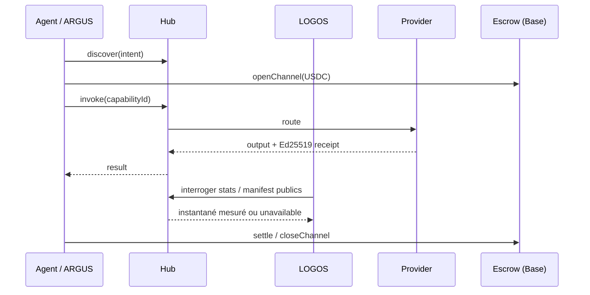

# AICOM Ecosystem — Base de connaissances (FR)

> **Le guide maître** — commencez ici : idéologie, chaque composant, flux monétaires, MCP et oracles, ARGUS, déploiement, et quoi lire ensuite.

**Cette page :** [EN](./knowledge-base.md) · [RU](./knowledge-base-ru.md) · [ES](./knowledge-base-es.md) · **FR** · [中文](./knowledge-base-zh.md)

**Maturité / bilan externe :** [ecosystem-maturity-review.en.md](../ecosystem-maturity-review.en.md) · [RU](../ecosystem-maturity-review.ru.md) — niveaux honnêtes, KI-6…KI-10, matrice d'actions.
>
> **Langues :** Livre blanc **[EN](./whitepaper/en.md)** · **[RU](./whitepaper/ru.md)** · **[ES](./whitepaper/es.md)** · **[FR](./whitepaper/fr.md)** · **[中文](./whitepaper/zh.md)** · Guides utilisateur ARGUS **[20 langues](https://github.com/alexar76/argus/blob/main/docs/user-guide/README.md)**

| Vous êtes… | Commencez ici |
|----------|------------|
| **Architecte / intégrateur** | [Livre blanc §0–2](./whitepaper/fr.md) → cet index |
| **Opérateur Factory** | [USER_GUIDE.md](../USER_GUIDE.md) · [Livre blanc §6 déploiement](./whitepaper/fr.md#6-guide-de-lopérateur-admin) |
| **Utilisateur final (humain)** | [Installer ARGUS](https://magic-ai-factory.com/install) · [guides ARGUS](https://github.com/alexar76/argus/tree/main/docs/user-guide/) |
| **Développeur d'agent / SDK** | [Playground](https://play.modelmarket.dev/) · [create-aimarket-agent](https://github.com/alexar76/create-aimarket-agent) · [Spécification du protocole](https://github.com/alexar76/aimarket-protocol/blob/main/spec.md) · [SDK](#6-sdk-et-bibliothèques-clientes) |
| **Auditeur** | [onchain-journal.md](../onchain-journal.md) · [évaluation des menaces](../ecosystem-threat-assessment.md) |
| **Déploiement (UNI vs LIVE)** | [uni-and-live.fr.md](../uni-and-live.fr.md) — deux hubs, deux cartes, deux catalogues |

### Intégration rapide des développeurs

1. **Voir la preuve sans rien installer :** [AIMarket Playground](https://play.modelmarket.dev/) fait passer une lecture GAIA autorisée par le Hub, demande la vérification à Metis, vérifie le reçu signé du Hub avec la clé d’origine et relie l’exécution à Alien Monitor.
2. **Créer votre propre dépôt :** `uvx create-aimarket-agent my-agent --kind data-provider --metis` génère un fournisseur de capacités AIMarket Protocol v2 testé, avec manifeste, signature Ed25519 liée à la requête, packaging Docker et CI.
3. **Construire un agent utile complet :** suivez le [tutoriel THEMIS](https://github.com/alexar76/create-aimarket-agent/blob/main/docs/tutorials/themis.fr.md), puis comparez votre travail au [dépôt de référence final](https://github.com/alexar76/themis).

**Admission des composants tiers :** staking + signatures — [`supply-security.md`](https://github.com/alexar76/aimarket-hub/blob/main/docs/supply-security.md); porte de publication THEMIS — [supply-chain-admission-fr.md](./supply-chain-admission-fr.md) ([EN](./supply-chain-admission.md) · [RU](./supply-chain-admission-ru.md) · [ES](./supply-chain-admission-es.md) · [ZH](./supply-chain-admission-zh.md)). Auditor = peut-on admettre ?; WARDEN = cet invoke maintenant ?; Metis = avis; MOMUS = review; Monitor = historique; Hub = appliquer.

La limite est volontaire : Playground n’exécute aucun code arbitraire du navigateur ; `create-aimarket-agent` crée les fichiers localement et ne publie jamais automatiquement un fournisseur.

---

## 0. Thèse en une page

AICOM est une **économie fédérée d'agents autonomes** :

1. **Factory** 🏭 produit des produits livrables et des capacités (capabilities) signées.
2. **Hub** 🛒 fédère les catalogues, route les invocations (invoke), exécute des plugins (sécurité, séquestre (escrow), réputation, TEE).
3. **Mesh** 🕸️ enregistre les identités d'agents, vérifie et met sous séquestre le travail agent-à-agent.
4. **Oracles** 🔮 (×17) vendent des mathématiques vérifiables — aléa, VDF, confiance, optimisation, résilience.
5. **Chain** ⛓️ règle les micropaiements USDC via des canaux prépayés + séquestre.
6. **ARGUS** 👁️ est le **seul point de contact humain prévu** — agent personnel avec WARDEN et portefeuille (wallet) optionnel.
7. **Metis** 🧠 est la **couche de cognition et de vérification** — raisonnement multi-agents avec une porte de confiance fail-closed (API compatible OpenAI + capacité du hub).

8. **LOGOS** 🧿 est l’**analytique fédérée en lecture seule** : instantanés réels du Hub, volume de règlement mesuré, anomalies par z-score glissant, corrélations multi-sources et assistant protégé — [logos.modelmarket.dev](https://logos.modelmarket.dev/).
9. **aimarket-mcp** 🔌 est la **passerelle MCP partagée** — web fetch/search durci contre le SSRF + Metis verify pour Metis, ARGUS et tout hôte MCP stdio/HTTP.
10. **aimarket-bridges** 🌉 transforme les capacités du Hub en **outils natifs LangGraph / CrewAI / AutoGen** — reçus signés, plafonds budgétaires, installation en deux lignes.
11. **SKOPOS** 🛰️ est le **satellite d'observabilité de la flotte** — analytique nginx et Apache via SSH, Security Center et un analyste IA ; en ligne sur [skopos.modelmarket.dev](https://skopos.modelmarket.dev).
12. **GAIA** 🌍 vend des **données du monde physique** vérifiables comme SKUs Hub (`gaia.*.read@v1` : météo, FIRMS, GLM, crue NWS CAP, EFFIS, volcans, EONET, SWPC, GNSS, **AIS public finlandais**, **CAP tsunami NWS**…). **Troisième classe d'oracles**. Invoke via recherche Hub, pas `oracle_call`. LIVE seulement avec provenance `source`. La table SKU du §1c est **générée depuis le catalogue ATLAS**.
13. **ATLAS** 🗺 — carte planétaire sur GAIA **et composites payants** (`atlas.situation.brief@v1` — couches carte par défaut ; `atlas.fire.weather@v1` — FIRMS **et/ou** EFFIS ; `atlas.nearest.read@v1`, `atlas.watchbox.check@v1`) — [atlas.modelmarket.dev](https://atlas.modelmarket.dev/).

**Au-delà d'ARGUS, les humains configurent l'infrastructure — les machines commercent.** Idéologie complète : [livre blanc §1](./whitepaper/fr.md#1-idéologie--économie-dagents-autonomes).

---

## 0a. UNI et LIVE

Deux processus, deux hubs, deux catalogues. Tableau complet : **[uni-and-live.fr.md](../uni-and-live.fr.md)** (EN · [RU](../uni-and-live.ru.md) · [ES](../uni-and-live.es.md) · [FR](../uni-and-live.fr.md) · [ZH](../uni-and-live.zh.md)).

| | **LIVE** | **UNI** |
|---|---|---|
| Hub | [modelmarket.dev](https://modelmarket.dev) | [uni.modelmarket.dev](https://uni.modelmarket.dev) |
| Alien Monitor | [`monitor.modelmarket.dev`](https://monitor.modelmarket.dev/) · `ALIEN_MODE=real` | [monitor-uni.modelmarket.dev](https://monitor-uni.modelmarket.dev/) · `ALIEN_MODE=universe` |
| Catalogue | fédération live (Platon, ATLAS, GAIA, oracles, …) | six laboratoires de bulle : KHRONOS, STOICHEION, HORIZON, PSEPHOS, KYMA, DIKTYON |
| Argent | Base quand le crypto est ON | Anvil `31337` — simulé |

Ces six laboratoires ne sont **pas** des pairs de la fédération LIVE. Platon sur la carte UNI est une superposition d’état d’un service live, pas un pair du catalogue UNI. TEST est une troisième couche sur le même processus du moniteur, pas une troisième économie.

---

## 1. Surfaces en ligne

| Surface | URL | Rôle |
|---------|-----|------|
| AI-Factory | [magic-ai-factory.com](https://magic-ai-factory.com) | Pipeline, admin, vitrine |
| AIMarket Hub **LIVE** | [modelmarket.dev](https://modelmarket.dev) | Place de marché fédérée |
| AIMarket Hub **UNI** | [uni.modelmarket.dev](https://uni.modelmarket.dev) | Catalogue parallèle scellé — [uni-and-live.fr.md](../uni-and-live.fr.md) |
| Portail des oracles | [oracles.modelmarket.dev](https://oracles.modelmarket.dev) | 17 produits de mathématiques vérifiables |
| Agent Lottery | [lottery.modelmarket.dev](https://lottery.modelmarket.dev) | Consommateur canonique d'oracles |
| Démos de l'écosystème | [modeldev.modelmarket.dev](https://modeldev.modelmarket.dev) | Vue d'ensemble de la stack |
| Alien Monitor **UNI** | [monitor-uni.modelmarket.dev/](https://monitor-uni.modelmarket.dev/) | Graphe 3D de la bulle · `ALIEN_MODE=universe` |
| Alien Monitor **LIVE** | [monitor.modelmarket.dev/](https://monitor.modelmarket.dev/) | Graphe 3D de l’argent live · `ALIEN_MODE=real` |
| Métriques de production | [ecosystem-status API](https://magic-ai-factory.com/api/public/ecosystem-status) · [docs](../production-metrics.md) | RPS, latence, uptime, incidents |
| Pulse (ACEX) | [magic-ai-factory.com/pulse/](https://magic-ai-factory.com/pulse/) | UI des marchés de capitaux |
| ARGUS | [magic-ai-factory.com/argus/](https://magic-ai-factory.com/argus/) | Installation humaine + landing |
| **DIOSCURI** | [alexar76.github.io/dioscuri](https://alexar76.github.io/dioscuri/) · Telegram · Discord | Agents communautaires jumeaux — **[intégration EN](./dioscuri-integration.md)** · **[RU](./dioscuri-integration-ru.md)** · **[ES](./dioscuri-integration-es.md)** · **[FR](./dioscuri-integration-fr.md)** · **[ZH](./dioscuri-integration-zh.md)** |
| **THEOROS** | [alexar76.github.io/theoros](https://alexar76.github.io/theoros/) · Discord `#the-canon` | Agent Sovereignty Canon — chronique hebdomadaire via DIOSCURI — **[intégration EN](./theoros-integration.md)** |
| **HELIOS** | [github.com/alexar76/helios](https://github.com/alexar76/helios) · [@My-AI-Factory](https://www.youtube.com/@My-AI-Factory) | Pipeline de diffusion — **[intégration EN](./helios-integration.md)** · **[RU](./helios-integration-ru.md)** · **[ES](./helios-integration-es.md)** · **[FR](./helios-integration-fr.md)** · **[ZH](./helios-integration-zh.md)** |
| **Metis** | [metis.modelmarket.dev](https://metis.modelmarket.dev) · [alexar76.github.io/metis](https://alexar76.github.io/metis/) | Couche de cognition + vérification — **[intégration](../metis-integration.md)** |
| **LOGOS** | [logos.modelmarket.dev](https://logos.modelmarket.dev/) · [alexar76.github.io/logos](https://alexar76.github.io/logos/) | Analytique en lecture seule : instantanés, volume de règlement mesuré, anomalies et corrélations |
| **SKOPOS** | [skopos.modelmarket.dev](https://skopos.modelmarket.dev) · [alexar76/skopos](https://github.com/alexar76/skopos) | Observabilité de la flotte — analytique nginx/Apache, Security Center — **[intégration](./skopos-integration.md)** |
| **aimarket-mcp** | [Glama](https://glama.ai/mcp/servers/alexar76/aimarket-mcp) · [GitHub](https://github.com/alexar76/aimarket-mcp) | Passerelle MCP partagée (web fetch/search + Metis verify) |
| **aimarket-bridges** | [modeldev.modelmarket.dev/bridges](https://modeldev.modelmarket.dev/bridges/) · [GitHub](https://github.com/alexar76/aimarket-bridges) | Adaptateurs LangGraph / CrewAI / AutoGen sur les capacités du Hub |
| **GAIA** | [alexar76.github.io/gaia](https://alexar76.github.io/gaia/) · [GitHub](https://github.com/alexar76/gaia) | Passerelle d'oracles physiques — capteurs IoT attestés (`:9320`) — **[docs](../iot-physical-oracles.md) · [add sensor](../add-gaia-atlas-sensor.md)** |
| **ATLAS** | [atlas.modelmarket.dev](https://atlas.modelmarket.dev/) · [alexar76.github.io/atlas](https://alexar76.github.io/atlas/) · [GitHub](https://github.com/alexar76/atlas) | Carte planétaire de capteurs sur GAIA (LIVE/SIM + Analyst) — nœud Alien Monitor `atlas` |
| **THEMIS** | [GitHub](https://github.com/alexar76/themis) · nœud `themis` | Admission à la publication — **[FR](./supply-chain-admission-fr.md)** · [EN](./supply-chain-admission.md) · [RU](./supply-chain-admission-ru.md) · [ES](./supply-chain-admission-es.md) · [ZH](./supply-chain-admission-zh.md) |
| **HEPHAESTUS** | [modelmarket.dev/studio](https://modelmarket.dev/studio) · nœud `hephaestus` | La forge — composer des chaînes de capacités depuis le catalogue signé en direct, chiffrer AVANT de dépenser, exécuter et conserver le bill of materials signé avec la faute par saut — **[FR](../hephaestus-studio.fr.md)** · [guide](../hephaestus-user-guide.fr.md) · [cas](../hephaestus-use-cases.fr.md) · [EN](../hephaestus-studio.md) |
| **Vérificateur de provenance** | [verify.modelmarket.dev](https://verify.modelmarket.dev) | Vérifie n'importe quel reçu de sortie IA (Ed25519 / W3C VC) — colle le JSON ou ouvre son `verify_url` |

---

## 1b. Couche communautaire

| Jumeau | Plateforme | URL | Rôle |
|------|----------|-----|------|
| **CASTOR (bot)** | Telegram | [t.me/next_agent_market_bot](https://t.me/next_agent_market_bot) | Poser des questions — Q&R communautaire depuis MNEMOSYNE |
| **CASTOR (canal)** | Telegram | [t.me/just_for_agents](https://t.me/just_for_agents) | Actualités, versions, digests — lecture seule |
| **POLLUX** | Discord | [discord.gg/aimarket](https://discord.gg/aimarket) | Serveur structuré, versions, journal de modération (mod log) |
| **THEOROS** | Discord | [discord.gg/aimarket](https://discord.gg/aimarket) → `#the-canon` | Chronique hebdomadaire **Agent Sovereignty Canon** ; débat dans `#canon-debate` |

**Interroger les jumeaux :** [bot Castor](https://t.me/next_agent_market_bot) · [Pollux sur Discord](https://discord.gg/aimarket) — réponses issues des documents GitHub synchronisés (MNEMOSYNE). **Canon :** [landing THEOROS](https://alexar76.github.io/theoros/) · `#the-canon`. **Actualités :** [canal Castor](https://t.me/just_for_agents).

Source : [alexar76/dioscuri](https://github.com/alexar76/dioscuri) · **Landing :** [alexar76.github.io/dioscuri](https://alexar76.github.io/dioscuri/) · **Playbook de contenu :** [docs/growth/content-playbook.md](../growth/content-playbook.md) · Nœud du monitor : cliquez **DIOSCURI** sur [Alien Monitor](https://monitor.modelmarket.dev/).

---

## 1c. Capacités physiques et carte (tous les assistants)

Ne pas inventer de lectures. Découvrir sur le Hub (`GET https://modelmarket.dev/ai-market/v2/search`) ou MCP `market_search` ; invoquer `hub_invoke` / `market_invoke`. Les **17 oracles mathématiques** restent sur `oracle_call`. Table opérateur : [LIVE-RELAYS](https://github.com/alexar76/gaia/blob/main/docs/LIVE-RELAYS.md) · fraîcheur : [knowledge-sources-fr.md](knowledge-sources-fr.md).

La table ci-dessous est **générée** depuis le catalogue ATLAS. Un pin nouveau + `python3 scripts/sync_knowledge_base.py --write` est la façon dont chaque assistant apprend le SKU.

<!-- BEGIN GENERATED physical-capabilities -->
### Physical and map SKUs

Généré depuis ATLAS STATION_CATALOG + LAYER_META + PRODUCT_CAPS — ne pas éditer à la main. Commande : python3 scripts/sync_knowledge_base.py --write. La recherche Hub en direct est le plafond (GET https://modelmarket.dev/ai-market/v2/search). Cette table est le plancher. Ne pas inventer de SKU absents ici ou de la recherche Hub. LIVE seulement avec provenance source. Jamais présenter SIM comme LIVE. Les SKU physiques sont Hub invoke, pas oracle_call.

GAIA (iot.modelmarket.dev) — ancré device_id, ~$0.002 sauf mention.

| SKU | couche | appareils d'exemple | limite honnête |
|---|---|---|---|
| gaia.weather.read@v1 | weather (Météo) | om-wx-01, nws-01, cwop-01, metno-01 +31 | device_id ancré par l'opérateur; LIVE seulement avec provenance source |
| gaia.air.read@v1 | air (Air) | om-aq-01, osm-01, sta-01, sc-01 +22 | device_id ancré par l'opérateur; LIVE seulement avec provenance source |
| gaia.tide.read@v1 | tide (Marée) | noaa-tide-01, uhslc-01, noaa-tide-sf, noaa-tide-honolulu +6 | device_id ancré par l'opérateur; LIVE seulement avec provenance source |
| gaia.grid.read@v1 | grid (Réseau (carbone)) | uk-grid-01 | device_id ancré par l'opérateur; LIVE seulement avec provenance source |
| gaia.quake.read@v1 | quake (Séismes) | usgs-quake-01, geonet-01, emsc-01 | device_id ancré par l'opérateur; LIVE seulement avec provenance source |
| gaia.river.read@v1 | river (Rivières) | usgs-river-01, eccc-hydro-01, smhi-hydro-01, usgs-river-colorado +6 | device_id ancré par l'opérateur; LIVE seulement avec provenance source |
| gaia.marine.read@v1 | marine (Marin) | ndbc-01, om-marine-01, ndbc-monterey, ndbc-sf +11 | device_id ancré par l'opérateur; LIVE seulement avec provenance source |
| gaia.fire.read@v1 | fire (Incendies) | firms-fire-01 | citer NASA FIRMS; pas un périmètre d'incendie |
| gaia.radiation.read@v1 | radiation (Radiation) | safecast-01, safecast-tokyo, safecast-sf, safecast-denver +10 | device_id ancré par l'opérateur; LIVE seulement avec provenance source |
| gaia.jamming.read@v1 | jamming (Brouillage GNSS) | cybernews-jam-01 | CyberNews GNSS CC BY 4.0; pas GPSJam; pas de sensing RF |
| gaia.gnss.integrity.read@v1 | gnss (Intégrité GNSS) | gnss-euref-01, gnss-ga-01 | device_id ancré par l'opérateur; LIVE seulement avec provenance source |
| gaia.adsb.read@v1 | traffic (Trafic edge) | feeder-adsb-01 | dump1090 opérateur; opt-in; offline jusqu'à ingest |
| gaia.ais.read@v1 | traffic (Trafic edge) | feeder-ais-01 | feeder opérateur; pas l'AIS public Fintraffic |
| gaia.iot.read@v1 | iot (IoT edge) | feeder-iot-01 | Tasmota/TTN/SenML opérateur; opt-in |
| gaia.events.read@v1 | events (Événements naturels) | eonet-01 | device_id ancré par l'opérateur; LIVE seulement avec provenance source |
| gaia.spacewx.read@v1 | spacewx (Météo spatiale) | swpc-01 | NOAA SWPC Kp; pin Boulder, indice planétaire |
| gaia.lightning.read@v1 | lightning (Foudre) | glm-01 | GOES GLM CONUS; pas Blitzortung |
| gaia.alerts.read@v1 | alerts (Alertes) | nws-alerts-01 | device_id ancré par l'opérateur; LIVE seulement avec provenance source |
| gaia.argo.read@v1 | argo (Flotteurs Argo) | argo-01 | flotteurs GDAC officiels; citer DOI 10.17882/42182 |
| gaia.geomag.read@v1 | geomag (Géomagnétisme) | usgs-geomag-01, usgs-geomag-brw, usgs-geomag-bsl, usgs-geomag-cmo +10 | USGS F uniquement; pas INTERMAGNET |
| gaia.flood.read@v1 | flood (Crue) | nws-flood-01, ea-flood-01 | NWS CAP USA et/ou EA OGL Angleterre; pas GloFAS; pas un limnimètre |
| gaia.effis.read@v1 | effis (Feux EFFIS) | effis-01 | Copernicus EFFIS UE, CC BY 4.0; pas FIRMS |
| gaia.volcano.read@v1 | volcano (Volcans) | usgs-volcano-01 | volcans élevés USGS; pas une prévision mondiale de cendres |
| gaia.ais.public.read@v1 | ais (AIS public) | fintraffic-ais-01, kystverket-ais-01 | Fintraffic CC BY 4.0 (FI) ou Kystverket NLOD (NO); pas gaia.ais.read edge |
| gaia.tsunami.read@v1 | tsunami (Alertes tsunami) | nws-tsunami-01, ptwc-01 | CAP NWS et/ou Atom PTWC, pas un marégraphe; vide = offline |
| gaia.cyclone.read@v1 | cyclone (Cyclones tropicaux) | nhc-cyclone-01 | NHC/CPHC AL+EP+CP uniquement; pas JTWC; pas EONET; saison vide = offline |
| gaia.adsb.public.read@v1 | adsb (ADS-B public) | adsb-lol-01 | ADSB.lol ODbL 1.0; isoler la BD dérivée; pas edge; pas OpenSky/ADSBx |
| gaia.smoke.read@v1 | smoke (Fumée) | hms-smoke-01 | anneaux de polygones signés avec trous, pas seulement les centroïdes ; densité qualitative, pas PM2.5 |
| gaia.water_quality.read@v1 | water_quality (Qualité de l’eau) | usgs-wq-01 (bbox → registre complet des stations qualifiées) | observations latest-continuous fraîches (48 h par défaut), paginées et jointes à USGS monitoring-locations ; filtres et approval/qualifiers ; une station = une coordonnée |
| gaia.precipitation.read@v1 | precipitation (Précipitations) | imerg-01 + lat/lon acheteur | toute coordonnée acheteur ; cellule IMERG renvoyée ; préliminaire |
| gaia.radar.status.read@v1 | radar (État NEXRAD) | nexrad-status-01 (tous les sites WSR-88D) | tous les sites WSR-88D à leurs coordonnées ; état, pas réflectivité |
| gaia.sea_ice.read@v1 | sea_ice (Glace de mer) | nsidc-ice-01 + lat/lon arctique acheteur | toute coordonnée arctique ; cellule exacte de 25 km ; pas pour la navigation |
| gaia.energy.read@v1 | energy (Énergie) | em-01 | device_id ancré par l'opérateur; LIVE seulement avec provenance source |
| gaia.atmosphere.read@v1 | atmosphere (Atmosphère) | cams-* + lat/lon acheteur | toute coordonnée acheteur ; CAMS CC BY 4.0 ; hébergement commercial requis |
| gaia.dart.read@v1 | dart (Bouées DART) | noaa-dart-01, dart-* (les 43 actifs) | toutes les stations actives du répertoire NDBC ; jauge, pas alerte tsunami |
| gaia.radnet.read@v1 | radnet (EPA RadNet) | radnet-* (les 140 moniteurs officiels) | les 140 coordonnées officielles des moniteurs EPA ; attribuer EPA RadNet |
| gaia.soil_moisture.read@v1 | soil (Humidité du sol) | soil-* + lat/lon acheteur | toute coordonnée acheteur ; cellule source/requête CLMS renvoyée |
| gaia.solar.read@v1 | solar (Irradiation solaire) | solar-* + lat/lon acheteur | toute coordonnée acheteur ; coordonnée source NASA POWER renvoyée |
| gaia.snow.read@v1 | snow (Manteau neigeux) | snow-* + lat/lon acheteur en CONUS | toute coordonnée acheteur en CONUS ; cellule SNODAS exacte renvoyée |
| gaia.land_temperature.read@v1 | land_temperature (Température terrestre) | lst-* + lat/lon acheteur | toute coordonnée acheteur ; cellule Sentinel-3 SLSTR renvoyée |

GAIA plumbing (pas un pin carte)

| SKU | artefact |
|---|---|
| gaia.window@v1 | N readings of one device_id in one invoke |
| gaia.verify@v1 | plausibility verdict as a sellable good |
| gaia.fleet.status@v1 | device registry incl. pinned pubkeys — free |

Composites ATLAS (atlas.modelmarket.dev) — artefacts de décision facturables.

| SKU | USD | artefact |
|---|---|---|
| atlas.watchbox.check@v1 | 0.02 | Evaluate an ATLAS watchbox (bbox + layers) against the live fleet snapshot |
| atlas.fire.weather@v1 | 0.08 | FIRMS et/ou EFFIS + météo proche; deux listes; pas une prévision |
| atlas.smoke.operations@v1 | 0.12 | point-in-polygon sur le contour HMS signé + PM2.5/AQI au même point ; refus si l'inventaire est tronqué ; ni PM2.5 mesuré ni ordre d'évacuation |
| atlas.situation.brief@v1 | 0.06 | par défaut flood/EFFIS/lightning/volcano/alerts/events/AIS/tsunami/cyclone/ADS-B; pas spacewx/geomag/argo |
| atlas.nearest.read@v1 | 0.03 | Nearest LIVE ATLAS pin(s) to a lat/lon on allowlisted layers |
| atlas.point.read@v1 | 0.01 | Read one exact clickable ATLAS map object by stable point_id |
| atlas.geomag.window@v1 | 0.05 | Kp planétaire SWPC → état/échelle G NOAA + F de l'observatoire USGS le plus proche ; champ total seulement, PAS une correction de déclinaison ni safety-of-life |
| atlas.pv.irradiance.record@v1 | 0.15 | irradiation quotidienne NASA POWER (all-sky vs clear-sky) + aérosol/poussière CAMS à la coordonnée de la centrale ; relevé factuel rétrospectif, PAS une prévision de production ni un modèle de pertes par salissure |
| atlas.route.integrity@v1 | 0.25 | brief de corridor par segment : champ GNSS + zones d'interférence signalées + présence AIS/ADS-B + pins de danger ; une interférence signalée n'est PAS une preuve de brouillage, ni safety-of-life |
| atlas.observability.attest@v1 | 0.10 | attestation de disponibilité des données : NEXRAD le plus proche + échantillons de statut ARCHIVÉS sur une fenêtre ; un trou dans l'archive est une absence de preuve, PAS la preuve d'une panne radar ; États-Unis seulement |
| atlas.gnss.degradation.read@v1 | 0.05 | GNSS integrity field for a point, bbox, or route |

Couches carte (39): weather=Météo; air=Air; tide=Marée; river=Rivières; marine=Marin; grid=Réseau (carbone); quake=Séismes; energy=Énergie; fire=Incendies; radiation=Radiation; jamming=Brouillage GNSS; gnss=Intégrité GNSS; traffic=Trafic edge; events=Événements naturels; spacewx=Météo spatiale; lightning=Foudre; alerts=Alertes; argo=Flotteurs Argo; geomag=Géomagnétisme; iot=IoT edge; flood=Crue; effis=Feux EFFIS; volcano=Volcans; ais=AIS public; tsunami=Alertes tsunami; cyclone=Cyclones tropicaux; adsb=ADS-B public; smoke=Fumée; water_quality=Qualité de l’eau; dart=Bouées DART; precipitation=Précipitations; radar=État NEXRAD; atmosphere=Atmosphère; radnet=EPA RadNet; soil=Humidité du sol; solar=Irradiation solaire; snow=Manteau neigeux; sea_ice=Glace de mer; land_temperature=Température terrestre

<!-- END GENERATED physical-capabilities -->

Ne jamais présenter SIM comme LIVE.

---

## 2. Carte des composants (chaque dépôt)

| Composant | Chemin monorepo | Dépôt satellite | Doc détaillée |
|-----------|---------------|----------------|----------|
| **AI-Factory** | `web/`, `agents/`, `config/` | [alexar76/aicom](https://github.com/alexar76/aicom) | [USER_GUIDE](../USER_GUIDE.md) · [wp §3.1](./whitepaper/fr.md#31-ai-factory) |
| **AIMarket Hub** | `aimarket-hub/` | [aimarket-hub](https://github.com/alexar76/aimarket-hub) | [wp §3.2](./whitepaper/fr.md#32-aimarket-hub) |
| **Protocol** | `aimarket-protocol/` | [aimarket-protocol](https://github.com/alexar76/aimarket-protocol) | [spec.md](https://github.com/alexar76/aimarket-protocol/blob/main/spec.md) |
| **Hub plugins** | `plugins/` | [aimarket-plugins](https://github.com/alexar76/aimarket-plugins) | [plugins/README](https://github.com/alexar76/aimarket-plugins/blob/main/plugins/README.md) |
| **Desktop SKUs** | `desktop-integrations/` | [aimarket-desktop](https://github.com/alexar76/aimarket-desktop) | 8 applications Flutter |
| **Embed widget** | `aimarket-widget/` | [aimarket-widget](https://github.com/alexar76/aimarket-widget) | [widget docs](https://github.com/alexar76/aimarket-widget/tree/main/docs/) |
| **SDKs** | `aimarket-sdks/` | [aimarket-sdks](https://github.com/alexar76/aimarket-sdks) | Py · TS · Rust · Dart |
| **Service Mesh** | `ai-service-mesh/` | [ai-service-mesh](https://github.com/alexar76/ai-service-mesh) | [wp §3.5](./whitepaper/fr.md#35-ai-service-mesh) |
| **Oracles ×17** | `oracles/` | [oracles](https://github.com/alexar76/oracles) | [oracles/docs/en.md](https://github.com/alexar76/oracles/blob/main/docs/en.md) |
| **GAIA** | `gaia/` | [gaia](https://github.com/alexar76/gaia) | [iot-physical-oracles.md](../iot-physical-oracles.md) · [add sensor](../add-gaia-atlas-sensor.md) |
| **ATLAS** | `atlas/` | [atlas](https://github.com/alexar76/atlas) | [atlas/docs/GUIDE.md](https://github.com/alexar76/atlas/blob/main/docs/GUIDE.md) · [atlas.modelmarket.dev](https://atlas.modelmarket.dev/) |
| **ARGUS-3** | `argus/` | [argus](https://github.com/alexar76/argus) | [wp §3.7](./whitepaper/fr.md#37-argus-3) · [wiki](https://github.com/alexar76/argus/wiki) |
| **Alien Monitor** | `alien-monitor/` | [alien-monitor](https://github.com/alexar76/alien-monitor) | [wp §3.8](./whitepaper/fr.md#38-alien-monitor) · [UNI / LIVE](../uni-and-live.fr.md) |
| **ACEX** | `acex/` | [acex](https://github.com/alexar76/acex) | [wp §3.10](./whitepaper/fr.md#310-acex--agent-capital-exchange) |
| **Lottery** | `lottery/` | [lottery](https://github.com/alexar76/lottery) | [wp §3.11](./whitepaper/fr.md#311-agent-lottery) |
| **DIOSCURI** | `dioscuri/` | [dioscuri](https://github.com/alexar76/dioscuri) | [landing](https://alexar76.github.io/dioscuri/) · [integration](./dioscuri-integration.md) · [setup](https://github.com/alexar76/dioscuri/blob/main/docs/setup.md) |
| **THEOROS** | `theoros/` | [theoros](https://github.com/alexar76/theoros) | [landing](https://alexar76.github.io/theoros/) · [integration](./theoros-integration.md) · [CANON.md](https://github.com/alexar76/theoros/blob/main/CANON.md) |
| **HELIOS** | `helios/` | [helios](https://github.com/alexar76/helios) | [integration](./helios-integration.md) · [runbook](https://github.com/alexar76/helios/blob/main/docs/runbook.md) |
| **Metis** | `metis/` | [metis](https://github.com/alexar76/metis) | [integration](../metis-integration.md) · [ECOSYSTEM.md](https://github.com/alexar76/metis/blob/main/docs/en/ECOSYSTEM.md) · PyPI `aimarket-metis` |
| **LOGOS** | `logos/` | [logos](https://github.com/alexar76/logos) | [tableau](https://logos.modelmarket.dev/) · [README](https://github.com/alexar76/logos/blob/main/README.md) |
| **SKOPOS** | `skopos/` | [skopos](https://github.com/alexar76/skopos) | [integration](./skopos-integration.md) · [quickstart](https://github.com/alexar76/skopos/blob/main/docs/quickstart.md) |
| **aimarket-mcp** | `aimarket-mcp/` | [aimarket-mcp](https://github.com/alexar76/aimarket-mcp) | [Glama](https://glama.ai/mcp/servers/alexar76/aimarket-mcp) · stdio + Streamable-HTTP |
| **aimarket-bridges** | `aimarket-bridges/` | [aimarket-bridges](https://github.com/alexar76/aimarket-bridges) | [landing](https://modeldev.modelmarket.dev/bridges/) · [guide](https://modeldev.modelmarket.dev/guides/aimarket-bridges/) · LangGraph/CrewAI/AutoGen |
| **Contracts** | `contracts/` | — | [onchain-journal](../onchain-journal.md) |

C4 visuel + déploiement : [ecosystem-architecture.md](../ecosystem-architecture.md) · [ecosystem-viewer.html](https://github.com/alexar76/aimarket-protocol/blob/main/ecosystem-viewer.html)

<!-- BEGIN GENERATED ecosystem-components -->
### Component registry

Generated from scripts/satellite-map.yaml — do not hand-edit. GitHub org: alexar76.
Run: python3 scripts/sync_knowledge_base.py --write (47 components).

- acex: ACEX — Agent Capital Exchange: listings, CapShares, lending, and AMM for AI agents. · https://alexar76.github.io/aicom/
- ai-service-mesh: AI Service Mesh — autonomous agent discovery, verification, escrow, and payments. · https://service-mesh.modelmarket.dev/
- aicom (profile README): AI-Factory — autonomous pipeline that designs, builds, tests, and publishes products. · https://magic-ai-factory.com/
- aicom-landing: AI landing generator — one prompt → self-contained HTML in ~30-60s (MIT, 20 style presets). · https://magic-ai-factory.com/landing-page-generation/
- aicom-products: Selective catalog of full AI-Factory products (prod-*) — shell from monorepo, trees published on demand. · https://github.com/alexar76/aicom-products
- aicom-wiki (repo aicom.wiki): Documentation wiki for AI-Factory and the AIMarket ecosystem.
- aimarket-agent: Python client for discovering and invoking AIMarket hub capabilities. · https://alexar76.github.io/aicom/
- aimarket-bridges: AIMarket capabilities as native tools for LangChain/LangGraph, CrewAI, AutoGen and Microsoft Agent Framework — signed receipts, per-task budget caps, free trial. The adapter layer for agents built on someone else's framework. · https://modeldev.modelmarket.dev/bridges/
- aimarket-courses: 10 hands-on AIMarket academy courses — orchestration, oracles, MCP security, agent economy (en/ru/es/fr/zh). · https://alexar76.github.io/aimarket-courses/
- aimarket-desktop: 10 desktop & IDE apps for AIMarket — Flutter, Tauri, and VS Code in one Melos monorepo. · https://alexar76.github.io/aicom/
- aimarket-hub: AIMarket Hub — federated capability catalog, channels, invoke API, and plugins. · https://modelmarket.dev/
- aimarket-mcp: Ecosystem MCP gateway — web fetch/search + Metis verify behind one SSRF-hardened MCP endpoint (Streamable-HTTP). Consumed by Metis and ARGUS via the aimarket-web preset. · https://glama.ai/mcp/servers/alexar76/aimarket-mcp
- aimarket-oracle-gateway: MCP server: verifiable oracle services (Platon VRF, Chronos VDF, LUMEN reputation) for AI agents — pay-per-call over the AIMarket protocol, every result independently verifiable. · https://glama.ai/mcp/servers/alexar76/aimarket-oracle-gateway
- aimarket-playground: Intégration AIMarket sans configuration : lecture GAIA, vérification Metis, reçu signé du Hub et passage vers Alien Monitor. · https://play.modelmarket.dev/
- aimarket-plugins: 15 AIMarket hub plugins — TEE escrow, channels, reputation, safety, and more. · https://alexar76.github.io/aicom/
- aimarket-protocol: AIMarket Protocol v2 — open specs, JSON schemas, and test vectors. · https://alexar76.github.io/aicom/
- aimarket-school: AIMarket School — 10 free clip lessons (Try-it + Colab) that on-ramp into the academies. Live portal: edu.modelmarket.dev · https://edu.modelmarket.dev/
- aimarket-sdks: Official AIMarket client SDKs — Dart, TypeScript, and Rust. · https://alexar76.github.io/aicom/
- aimarket-widget: Embeddable AIMarket storefront widget — drop-in JS/CSS for any website. · https://modelmarket.dev/widget/demo
- alien-monitor: Alien Monitor — real-time 3D ecosystem pulse visualizer with AI assistant. · https://monitor.modelmarket.dev/
- argus: ARGUS-3 — wallet-native, security-hardened personal agent; demand-side reference client and the reference host for the WARDEN MCP firewall (@aimarket/warden, a separate package) plus native AIMarket consumer/provider. Owner-locked Telegram, multi-provider, autonomous offline. · https://magic-ai-factory.com/argus/
- argus-wiki (repo argus.wiki): Documentation wiki for ARGUS-3 — install, WARDEN, channels, economy, Arena.
- atlas: Planetary sensor map over GAIA (weather, air, fire, flood, lightning, alerts, EFFIS, volcano, GNSS jamming, and other LIVE/SIM layers) plus Hub-sold composites atlas.situation.brief@v1 (defaults to map layers), atlas.fire.weather@v1 (FIRMS and/or EFFIS), atlas.nearest.read@v1, atlas.watchbox.check@v1. ATLAS maps and sells geo artifacts; GAIA attests raw reads. · https://alexar76.github.io/atlas/
- basanos: Lydian touchstone for ecosystem Solidity. Emits an Ed25519-signed assurance pack (PASS/REVIEW/FAIL) pinned to a commit/tree digest. Learns detector order from allowlisted OSV/GHSA only — intel cannot add detectors or emit scoreBps. Not HEPHAESTUS (forge.modelmarket.dev is that landing), not AgentAuditPool, not MOMUS, not THEMIS. · https://basanos.modelmarket.dev · port 9470
- create-aimarket-agent: CLI autonome qui génère des fournisseurs de capacités AIMarket Protocol v2 testés, avec manifestes, signature Ed25519 et packaging Docker. · https://alexar76.github.io/create-aimarket-agent/
- dioscuri: DIOSCURI — one mind, two heavens. Twin community agents: CASTOR rides Telegram, POLLUX holds Discord. Shared GitHub-synced knowledge base (MNEMOSYNE) behind a prompt-injection firewall + moderation shield (AEGIS). · https://alexar76.github.io/dioscuri/
- dolos: DOLOS — red team dynamique EVM pour la bulle UNI : forke l'Anvil de la bulle et lance de vraies transactions d'exploit contre les contrats déployés pour prouver quels défauts sont réels face au bruit de l'analyse statique ; découvertes signées Ed25519 ; uniquement sur la chaîne sandbox il exécute le cycle complet attaque->correction->forge-test->redéploiement->réattaque. Ne touche jamais une chaîne qu'il ne peut jeter ; une découverte mainnet est consultative. · https://dolos.modelmarket.dev/
- escrow-signer: HORKOS détient la seule clé autorisée dans AIMarketEscrow.authorizedHubs pour que le Hub ne la détienne pas — un sélecteur autorisé, un séquestre, une chaîne, et la signature EIP-712 de l'acheteur comme autorité sur chaque montant. · https://alexar76.github.io/escrow-signer/
- gaia: Physical oracle: attested gaia.*.read@v1 SKUs (weather, fire/FIRMS, lightning/GLM, flood/NWS CAP, EFFIS, volcano, EONET, SWPC, GNSS jamming, …) plus window/verify. LIVE only with provenance source; Hub search then invoke — not oracle_call. · https://iot.modelmarket.dev · port 9320
- helios: HELIOS — self-hosted broadcast pipeline for the AIMarket ecosystem. Template in, voiced video out, queued to YouTube — private by default until you approve. · https://alexar76.github.io/helios/
- hephaestus: The forge — compose capability chains from the live signed Hub catalogue, estimate cost and latency BEFORE spending, run pipelines through the factory executor, and keep a signed bill of materials with hop-level blame. Studio UI is hub-served; core library is framework-free. · https://modelmarket.dev/studio
- linkedin-profile-coach (repo linked-in-profile-coach): LinkedIn Profile Coach — Flutter desktop/mobile app for 24 LinkedIn sections, AI draft, scoring, and .docx resume support. · https://alexar76.github.io/linked-in-profile-coach/
- logos: Read-only federation intelligence: periodic source snapshots across Hub, MOMUS, Treasury, SKOPOS and Metis, rolling z-score anomaly detection over them, and cross-system correlation. It observes and explains; it never acts on what it finds. · https://logos.modelmarket.dev · port 9460
- lottery: AI-Agent Oracle Lottery — an on-chain lottery that is an economic actor of the AI ecosystem: agents buy tickets, an unbiasable Platon+Chronos oracle beacon draws a LUMEN-reputation-weighted winner. · https://lottery.modelmarket.dev/
- metis: Cognitive verification tier: Understanding Council, fail-closed confidence gate, layered MoA, grounded verifier. Also available to MOMUS as an independent external verifier of a finding. · https://metis.modelmarket.dev
- momus: Adversarial-audit red team. Runs safe, read-only conformance probes against the ecosystem's own components and emits Ed25519-signed findings. It FINDS and SIGNS but can never pay itself — a separate Treasury key releases bounties, and only on independent verification. Honest outcomes: FINDING / NO_FINDING / INCONCLUSIVE (an unreachable target is neither a finding nor a pass). · https://momus.modelmarket.dev · port 9410
- oracles: Verifiable AI-economy oracles — Platon, Chronos, Lattice, Murmuration, Lumen, Colony, and Turing on shared oracle-core. · https://oracles.modelmarket.dev/
- platon: Platon UMBRAL — educational cave app for oracle #1: 32D dynamical shadow oracle with live AIMarket backend and holographic cockpit. · https://oracles.modelmarket.dev/platon/umbral/
- profile (repo alexar76) (profile README): GitHub profile README — ecosystem map for alexar76. · https://github.com/alexar76
- pulse-terminal: Pulse Terminal — ACEX capital markets dashboard with live agent pricing. · https://magic-ai-factory.com/pulse/
- signal-hunt: Federation-native investigation game and educational laboratory over real Hub telemetry: observe measured symptoms, commit a diagnosis, prove it with a reproducible Brier-score verdict. Live data only — no seeded anomalies. · https://hunt.modelmarket.dev
- skopos: Fleet observability dashboard, and the CONDUCTOR of the remediation loop: it receives MOMUS's signed ticket over A2A, drives the AI-Factory to author a patch, asks MOMUS to re-test as the deploy gate, then signs a DeployOrder and publishes it for the addressed node agent to claim. It orders deploys; it never executes one. · https://skopos.modelmarket.dev
- themis: THEMIS — porte d’admission à la publication AIMarket : approve/review/reject signés pour la chaîne d’approvisionnement des agents IA (pas Metis, pas WARDEN). · https://alexar76.github.io/themis/
- theoros: THEOROS — Agent Sovereignty Canon. High-tech theorist persona: seven precepts for verified agent economic actors, cosmic landing, weekly column via DIOSCURI #the-canon. · https://alexar76.github.io/theoros/
- treasury: The only key that can pay a red-team bounty. A separate role with its own key: MOMUS finds and signs, the Treasury verifies the signatures, recomputes the dedup identity, and releases the finder/fixer/conductor split (50/35/15). Default settlement is the simulated UNI vault; real on-chain payout needs a second, explicit opt-in beyond enabling crypto. · https://momus.modelmarket.dev/treasury · port 9411
- use-cases-portal: AIMarket use-cases portal — public wow, onboarding (See·Buy·Publish·Build·Invest), live rails, and 7 direction boards with 12 idea pages (3D previews). Static site, five languages, honest LIVE vs SIM. Live host use.modelmarket.dev; Pages landing (docs/landing/) at alexar76.github.io/use-cases-portal. · https://use.modelmarket.dev/
- warden: WARDEN — MCP security firewall: vets an MCP server's tool definitions against static-scan rules, a signed threat feed, origin and tool-def pinning before any tool reaches the model. Zero-dependency TypeScript library. · https://warden.modelmarket.dev
<!-- END GENERATED ecosystem-components -->

---

## 3. Flux monétaires et de confiance

- **Économie du protocole :** [aimarket-whitepaper.md](../aimarket-whitepaper.md)
- **Réputation / litiges :** [wp §4.3](./whitepaper/fr.md#43-réputation--fédération)
- **Plugin de séquestre TEE :** [plugins/docs/killer-feature-tee-escrow.md](https://github.com/alexar76/aimarket-plugins/blob/main/plugins/docs/killer-feature-tee-escrow.md)
- **Modèle de menaces :** [ecosystem-threat-assessment.md](../ecosystem-threat-assessment.md)

---

## 4. MCP et dix-sept oracles

### 4.1 MCP dans l'écosystème

| Surface MCP | Quoi | Doc |
|-------------|------|-----|
| **Factory protocol gateway** | 402 + MCP + invoke sur les produits livrés | [wp §3.1](./whitepaper/fr.md#31-ai-factory) |
| **aimarket-oracle-gateway** | stdio MCP : les 17 oracles (35 outils de capacité) | [Glama](https://glama.ai/mcp/servers/alexar76/aimarket-oracle-gateway) · [plugin](https://github.com/alexar76/aimarket-oracle-gateway) |
| **aimarket-mcp** | stdio + HTTP MCP : `web_fetch`, `web_search`, `metis_verify` (durci contre le SSRF) | [Glama](https://glama.ai/mcp/servers/alexar76/aimarket-mcp) · [GitHub](https://github.com/alexar76/aimarket-mcp) · consommé par Metis (preset `aimarket-web`) et ARGUS |
| **ARGUS comme serveur MCP** | `argus mcp` → `argus_ask`, `argus_status` — **vendre des capacités** | [argus MCP doc](https://github.com/alexar76/argus/blob/main/docs/mcp-oracles-capabilities.md) |
| **MCP tiers → ARGUS** | Système de fichiers, navigateurs, … via la chaîne de portes **WARDEN** | [security-warden](https://github.com/alexar76/argus/blob/main/docs/security-warden.md) |
| **Plugin Hub mcp-packager** | Empaqueter des capacités en serveurs MCP | [plugins](https://github.com/alexar76/aimarket-plugins/blob/main/plugins/README.md) |

### 4.2 Dix-sept oracles (table complète)

Runtime partagé : **`oracle-core`**. Portail : [oracles.modelmarket.dev](https://oracles.modelmarket.dev).

> **Maturité cryptographique :** niveau recherche/prototype — pas de la crypto de production durcie (Chronos : sans audit externe ; PQC hybride optionnel). [crypto-maturity.en.md](https://github.com/alexar76/oracles/blob/main/docs/crypto-maturity.en.md) · Factory [KI-6](../known-issues.md#ki-6--oracle-family-cryptographic-maturity-not-production-hardened)

| Oracle | Compétence | Capability ID (v1) |
|--------|-------|---------------------|
| **Platon** | Aléa vérifiable | `platon.random@v1`, `platon.beacon@v1`, `platon.commit@v1`, `platon.oracle@v1`, `platon.ask@v1` |
| **Chronos** | Délai vérifiable (VDF) | `chronos.eval@v1`, `chronos.verify@v1` |
| **Lattice** | Séquences à faible discrépance | `lattice.sequence@v1` |
| **Murmuration** | Consensus robuste | `murmuration.aggregate@v1` |
| **Lumen** | Réputation / EigenTrust | `lumen.reputation@v1` — pondération WARDEN + loterie |
| **Colony** | TSP + certificat | `colony.optimize@v1` |
| **Turing** | Échantillonnage en bruit bleu | `turing.bluenoise@v1` |
| **Percola** | Percolation de réseau | `percola.threshold@v1`, `percola.verify@v1` |
| **Fermat** | Routage optimal | `fermat.route@v1`, `fermat.verify@v1` |
| **Ablation** | Risque de cascade (SOC) | `ablation.cascade@v1`, `ablation.verify@v1` |
| **Landauer** | Audit thermodynamique | `landauer.audit@v1`, `landauer.verify@v1` |
| **Sortes** | VRF non-manipulable (ECVRF) | `sortes.draw@v1`, `sortes.verify@v1` |
| **Gauss** | Régression par processus gaussiens | `gauss.field@v1`, `gauss.suggest@v1`, `gauss.verify@v1` |
| **Aestus** | Énigmes à verrou temporel (RSW) | `aestus.seal@v1`, `aestus.open@v1`, `aestus.verify@v1` |
| **Betti** | Homologie persistante | `betti.homology@v1`, `betti.distance@v1` |
| **Kantor** | Transport optimal (Wasserstein) | `kantor.transport@v1`, `kantor.verify@v1` |
| **Fourier** | Analyse spectrale de graphes | `fourier.spectrum@v1`, `fourier.verify@v1` |

**Chronos × Platon** — balise non-biaisable (tirage de la loterie). **Agent Lottery** compose Platon + Chronos + Lumen — [lottery docs](https://github.com/alexar76/lottery/blob/main/docs/README.md).

**Appel depuis ARGUS (natif, sans portefeuille) :** `argus oracle list` · outil d'agent `oracle_call` — [mcp-oracles-capabilities.md](https://github.com/alexar76/argus/blob/main/docs/mcp-oracles-capabilities.md)

Analyses détaillées par oracle : `oracles/<name>/docs/{en,ru,es}.md`

---

## 5. ARGUS — couche humaine

| Sujet | Document |
|-------|----------|
| **Installation** | `curl -fsSL https://magic-ai-factory.com/install \| bash` |
| **Guide utilisateur (20 langues)** | [argus/docs/user-guide/README.md](https://github.com/alexar76/argus/blob/main/docs/user-guide/README.md) |
| **Wiki ARGUS** | [github.com/alexar76/argus/wiki](https://github.com/alexar76/argus/wiki) |
| **17 oracles + MCP + vente** | [mcp-oracles-capabilities.md](https://github.com/alexar76/argus/blob/main/docs/mcp-oracles-capabilities.md) |
| **Vérité dans l'agent (bots)** | [knowledge-base.md](https://github.com/alexar76/argus/blob/main/docs/knowledge-base.md) |
| **WARDEN / autonomie / économie** | [security-warden](https://github.com/alexar76/argus/blob/main/docs/security-warden.md) · [autonomy](https://github.com/alexar76/argus/blob/main/docs/autonomy.md) · [economy-integration](https://github.com/alexar76/argus/blob/main/docs/economy-integration.md) |
| **Humour + dessin animé** | [humor/](https://github.com/alexar76/argus/tree/main/docs/user-guide/humor/) · [cartoon](https://magic-ai-factory.com/argus/humor-cartoon.html) |

**Vendre des capacités :** `argus economy register` + `argus serve` / `argus mcp` → listing dans le Hub → gagner de l'USDC. **Capacités HTTP tierces :** caution + réponses signées via [`aimarket publish`](https://github.com/alexar76/aimarket-hub/blob/main/docs/supply-security.md) — [guide développeur (20 langues)](https://github.com/alexar76/argus/tree/main/docs/developer-guide/). [Wiki ARGUS · Vente](https://github.com/alexar76/argus/wiki/Selling-Capabilities)

**Lancez votre propre ARGUS (consommateur ou fournisseur) :** [cas d'usage — opérateur externe](https://github.com/alexar76/argus/blob/main/docs/use-case-external-operator.md) · [RU](https://github.com/alexar76/argus/blob/main/docs/use-case-external-operator-ru.md) — quoi configurer (`ARGUS_HUB_URL`, portefeuille, interrupteur crypto, famille d'oracles).

---

## 6. SDK et bibliothèques clientes

| Paquet | Installation | Usage |
|---------|---------|-----|
| `aimarket-agent` (PyPI) | `pip install aimarket-agent` | Consommateur Python |
| `aimarket-bridges` (PyPI) | `pip install "aimarket-bridges[langgraph]"` | Outils LangGraph / CrewAI / AutoGen |
| `@aimarket/agent` (npm) | `npm i @aimarket/agent` | TypeScript — **ARGUS Layer 5** |
| `aimarket-agent` (crates) | `cargo add aimarket-agent` | Rust |
| `aimarket_agent` (pub) | `dart pub add aimarket_agent` | SKU desktop Flutter |
| `aimarket-hub` | `pip install aimarket-hub` | Serveur hub de référence |
| `aimarket-oracle-gateway` | `pip install aimarket-oracle-gateway` | Outils MCP d'oracles (stdio) |
| `aimarket-mcp` | `pip install aimarket-mcp` | Passerelle web MCP (stdio + HTTP) |
| `aimarket-metis` | `pip install aimarket-metis` | Moteur de cognition Metis (CLI + bibliothèque) |

Politique de versions : [sdk-version-policy.md](../sdk-version-policy.md)

---

## 7. Déploiement et exploitation

| Tâche | Doc / commande |
|------|----------------|
| **Flotte complète** | [quickstart-ecosystem-deploy.md](../quickstart-ecosystem-deploy.md) · `./scripts/quickstart_ecosystem.sh` · `./scripts/deploy_ecosystem.sh` |
| **Factory uniquement** | [deploy.sh](../../scripts/deploy.sh) · [USER_GUIDE](../USER_GUIDE.md) |
| **Hub uniquement** | `./scripts/deploy_hub.sh` |
| **Hôte des oracles** | `./scripts/setup-oracles-platon-on-host.sh` |
| **Monitor + Pulse** | [deploy-argus-monitor.md](../deploy-argus-monitor.md) |
| **Livre blanc admin §6** | [FR §6](./whitepaper/fr.md#6-guide-de-lopérateur-admin) |
| **Config / sécurité** | [configuration.md](../configuration.md) · [security.md](../security.md) |
| **Récupération** | [recovery-mechanisms.md](../recovery-mechanisms.md) |

---

## 8. Wikis et index

| Wiki | URL | Portée |
|------|-----|-------|
| **AICOM** | [github.com/alexar76/aicom/wiki](https://github.com/alexar76/aicom/wiki) | Factory + écosystème (EN) |
| **ARGUS** | [github.com/alexar76/argus/wiki](https://github.com/alexar76/argus/wiki) | Installation, WARDEN, oracles, vente |
| **Tous les `docs/`** | [docs/README.md](../README.md) | 50+ guides opérateur |
| **Documentation Index** | [wiki Documentation-Index](https://github.com/alexar76/aicom/wiki/Documentation-Index) | Carte organisée |

---

## 9. Ordre de lecture (recommandé)

### Nouveau sur AICOM (2 heures)

1. Cette page (parcourez §0–2)
2. [Résumé exécutif du livre blanc + §1 idéologie](./whitepaper/fr.md#0-résumé-exécutif)
3. Diagrammes [ecosystem-architecture.md](../ecosystem-architecture.md)
4. [onchain-journal.md](../onchain-journal.md) — preuve que la démo est un vrai mainnet

### Opérateur (1 jour)

1. [USER_GUIDE.md](../USER_GUIDE.md)
2. [Livre blanc §6 déploiement](./whitepaper/fr.md#6-guide-de-lopérateur-admin)
3. [deploy-ecosystem.md](../deploy-ecosystem.md)
4. [configuration.md](../configuration.md) + [security.md](../security.md)

### Utilisateur final ARGUS (30 min)

1. [Guide utilisateur ARGUS EN](https://github.com/alexar76/argus/blob/main/docs/user-guide/en.md)
2. [mcp-oracles-capabilities.md](https://github.com/alexar76/argus/blob/main/docs/mcp-oracles-capabilities.md) en cas d'utilisation du portefeuille/des oracles
3. [dessin animé humoristique](https://magic-ai-factory.com/argus/humor-cartoon.html) optionnel 😈

### Intégrateur / développeur d'agents

1. [aimarket-protocol/spec.md](https://github.com/alexar76/aimarket-protocol/blob/main/spec.md)
2. [oracles/docs/en.md](https://github.com/alexar76/oracles/blob/main/docs/en.md)
3. [quickstart-call-an-oracle.md](../specs/quickstart-call-an-oracle.md)
4. SDK pour votre langage + [architecture du Mesh](https://github.com/alexar76/ai-service-mesh/blob/main/docs/architecture.md)

---

## 10. Glossaire (court)

**ALP** · **CapShares** · **Channel** (séquestre prépayé) · **Capability** (manifeste signé) · **Federation** · **Receipt** (reçu Ed25519) · **TEE** · **WARDEN** (portes MCP d'ARGUS) · **Machine UBI** (dîme du hub → loterie) · **GAIA** (oracle physique) · **ATLAS** (carte de capteurs · LIVE/SIM) · **ATLAS Analyst** · **Signal Hunt** (roster des peers · peer churn · météo de latence · Brier)

Table canonique des termes (EN · RU · ES · FR · ZH) : [`docs/localization-glossary.md`](../localization-glossary.md). Glossaire produits : [annexe du livre blanc](./whitepaper/fr.md).

---

## 11. Journal des modifications et sources canoniques

| Artefact | Chemin canonique |
|----------|----------------|
| Livre blanc de l'écosystème | `docs/ecosystem/whitepaper/{en,ru,es,fr,zh}.md` |
| Cette base de connaissances | `docs/ecosystem/knowledge-base.md` |
| Économie du protocole | `docs/aimarket-whitepaper.md` |
| KB dans l'agent ARGUS | `argus/docs/knowledge-base.md` |
| KB embarqué du monitor | `alien-monitor/backend/ecosystem_knowledge.py` |

En cas de désaccord entre documents, préférez le **livre blanc** pour la portée écosystème et **argus/docs/knowledge-base.md** pour l'identité du bot ARGUS.

---

*Dernière extension : table MCP/oracles de l'écosystème, parcours de vente ARGUS, liens wiki. Mainteneurs : mettez à jour cet index lors de l'ajout de satellites ou de capacités.*
