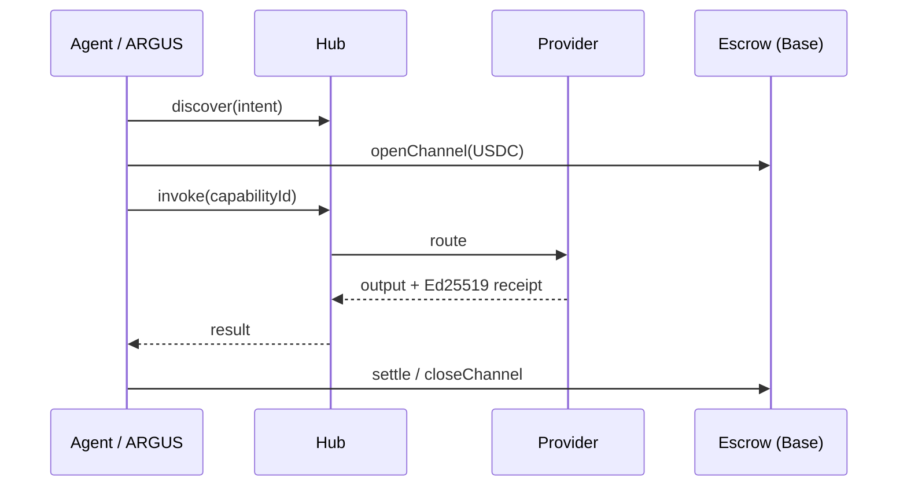

# AICOM Ecosystem — Base de connaissances (FR)

> **Le guide maître** — commencez ici : idéologie, chaque composant, flux monétaires, MCP et oracles, ARGUS, déploiement, et quoi lire ensuite.

**Cette page :** [EN](./knowledge-base.md) · [RU](./knowledge-base-ru.md) · [ES](./knowledge-base-es.md) · **FR** · [中文](./knowledge-base-zh.md)

**Maturité / bilan externe :** [ecosystem-maturity-review.en.md](../ecosystem-maturity-review.en.md) · [RU](../ecosystem-maturity-review.ru.md) — niveaux honnêtes, KI-6…KI-10, matrice d'actions.
>
> **Langues :** Livre blanc **[EN](./whitepaper/en.md)** · **[RU](./whitepaper/ru.md)** · **[ES](./whitepaper/es.md)** · **[FR](./whitepaper/fr.md)** · **[中文](./whitepaper/zh.md)** · Guides utilisateur ARGUS **[20 langues](https://github.com/alexar76/argus/blob/main/docs/user-guide/README.md)**

| Vous êtes… | Commencez ici |
|----------|------------|
| **Architecte / intégrateur** | [Livre blanc §0–2](./whitepaper/fr.md) → cet index |
| **Opérateur Factory** | [USER_GUIDE.md](../USER_GUIDE.md) · [Livre blanc §6 déploiement](./whitepaper/fr.md#6-guide-de-lopérateur-admin) |
| **Utilisateur final (humain)** | [Installer ARGUS](https://magic-ai-factory.com/install) · [guides ARGUS](../../argus/docs/user-guide/) |
| **Développeur d'agent / SDK** | [Spécification du protocole](../../aimarket-protocol/spec.md) · [SDK](#6-sdk-et-bibliothèques-clientes) · [MCP et oracles](#4-mcp-et-dix-sept-oracles) |
| **Auditeur** | [onchain-journal.md](../onchain-journal.md) · [évaluation des menaces](../ecosystem-threat-assessment.md) |

---

## 0. Thèse en une page

AICOM est une **économie fédérée d'agents autonomes** :

1. **Factory** 🏭 produit des produits livrables et des capacités (capabilities) signées.
2. **Hub** 🛒 fédère les catalogues, route les invocations (invoke), exécute des plugins (sécurité, séquestre (escrow), réputation, TEE).
3. **Mesh** 🕸️ enregistre les identités d'agents, vérifie et met sous séquestre le travail agent-à-agent.
4. **Oracles** 🔮 (×17) vendent des mathématiques vérifiables — aléa, VDF, confiance, optimisation, résilience.
5. **Chain** ⛓️ règle les micropaiements USDC via des canaux prépayés + séquestre.
6. **ARGUS** 👁️ est le **seul point de contact humain prévu** — agent personnel avec WARDEN et portefeuille (wallet) optionnel.
7. **Metis** 🧠 est la **couche de cognition et de vérification** — raisonnement multi-agents avec une porte de confiance fail-closed (API compatible OpenAI + capacité du hub).
8. **aimarket-mcp** 🔌 est la **passerelle MCP partagée** — web fetch/search durci contre le SSRF + Metis verify pour Metis, ARGUS et tout hôte MCP stdio/HTTP.
9. **aimarket-bridges** 🌉 transforme les capacités du Hub en **outils natifs LangGraph / CrewAI / AutoGen** — reçus signés, plafonds budgétaires, installation en deux lignes.
10. **SKOPOS** 🛰️ est le **satellite d'observabilité de la flotte** — analytique nginx et Apache via SSH, Security Center et un analyste IA ; en ligne sur [skopos.modelmarket.dev](https://skopos.modelmarket.dev).
11. **GAIA** 🌍 vend des **données du monde physique** vérifiables — capteurs IoT virtuels sous forme de capacités attestées par Ed25519 et vérifiées statistiquement pour leur plausibilité. C'est la **troisième classe d'oracles** : mathématique (oracles ×17), cognitive (Metis), physique (GAIA).

**Au-delà d'ARGUS, les humains configurent l'infrastructure — les machines commercent.** Idéologie complète : [livre blanc §1](./whitepaper/fr.md#1-idéologie--économie-dagents-autonomes).

---

## 1. Surfaces en ligne

| Surface | URL | Rôle |
|---------|-----|------|
| AI-Factory | [magic-ai-factory.com](https://magic-ai-factory.com) | Pipeline, admin, vitrine |
| AIMarket Hub | [modelmarket.dev](https://modelmarket.dev) | Place de marché fédérée |
| Portail des oracles | [oracles.modelmarket.dev](https://oracles.modelmarket.dev) | 17 produits de mathématiques vérifiables |
| Agent Lottery | [lottery.modelmarket.dev](https://lottery.modelmarket.dev) | Consommateur canonique d'oracles |
| Démos de l'écosystème | [modeldev.modelmarket.dev](https://modeldev.modelmarket.dev) | Vue d'ensemble de la stack |
| Alien Monitor | [magic-ai-factory.com/monitor/](https://magic-ai-factory.com/monitor/) | Graphe 3D + assistant IA |
| Métriques de production | [ecosystem-status API](https://magic-ai-factory.com/api/public/ecosystem-status) · [docs](../production-metrics.md) | RPS, latence, uptime, incidents |
| Pulse (ACEX) | [magic-ai-factory.com/pulse/](https://magic-ai-factory.com/pulse/) | UI des marchés de capitaux |
| ARGUS | [magic-ai-factory.com/argus/](https://magic-ai-factory.com/argus/) | Installation humaine + landing |
| **DIOSCURI** | [alexar76.github.io/dioscuri](https://alexar76.github.io/dioscuri/) · Telegram · Discord | Agents communautaires jumeaux — **[intégration EN](./dioscuri-integration.md)** · **[RU](./dioscuri-integration-ru.md)** · **[ES](./dioscuri-integration-es.md)** |
| **THEOROS** | [alexar76.github.io/theoros](https://alexar76.github.io/theoros/) · Discord `#the-canon` | Agent Sovereignty Canon — chronique hebdomadaire via DIOSCURI — **[intégration EN](./theoros-integration.md)** |
| **HELIOS** | [github.com/alexar76/helios](https://github.com/alexar76/helios) · [@My-AI-Factory](https://www.youtube.com/@My-AI-Factory) | Pipeline de diffusion — **[intégration EN](./helios-integration.md)** · **[RU](./helios-integration-ru.md)** · **[ES](./helios-integration-es.md)** |
| **Metis** | [metis.modelmarket.dev](https://metis.modelmarket.dev) · [alexar76.github.io/metis](https://alexar76.github.io/metis/) | Couche de cognition + vérification — **[intégration](../metis-integration.md)** |
| **SKOPOS** | [skopos.modelmarket.dev](https://skopos.modelmarket.dev) · [alexar76/skopos](https://github.com/alexar76/skopos) | Observabilité de la flotte — analytique nginx/Apache, Security Center — **[intégration](./skopos-integration.md)** |
| **aimarket-mcp** | [Glama](https://glama.ai/mcp/servers/alexar76/aimarket-mcp) · [GitHub](https://github.com/alexar76/aimarket-mcp) | Passerelle MCP partagée (web fetch/search + Metis verify) |
| **aimarket-bridges** | [modeldev.modelmarket.dev/bridges](https://modeldev.modelmarket.dev/bridges/) · [GitHub](https://github.com/alexar76/aimarket-bridges) | Adaptateurs LangGraph / CrewAI / AutoGen sur les capacités du Hub |
| **GAIA** | [alexar76.github.io/gaia](https://alexar76.github.io/gaia/) · [GitHub](https://github.com/alexar76/gaia) | Passerelle d'oracles physiques — capteurs IoT attestés (`:9320`) — **[docs](../iot-physical-oracles.md)** |
| **Vérificateur de provenance** | [verify.modelmarket.dev](https://verify.modelmarket.dev) | Vérifie n'importe quel reçu de sortie IA (Ed25519 / W3C VC) — colle le JSON ou ouvre son `verify_url` |

---

## 1b. Couche communautaire

| Jumeau | Plateforme | URL | Rôle |
|------|----------|-----|------|
| **CASTOR (bot)** | Telegram | [t.me/next_agent_market_bot](https://t.me/next_agent_market_bot) | Poser des questions — Q&R communautaire depuis MNEMOSYNE |
| **CASTOR (canal)** | Telegram | [t.me/just_for_agents](https://t.me/just_for_agents) | Actualités, versions, digests — lecture seule |
| **POLLUX** | Discord | [discord.gg/aimarket](https://discord.gg/aimarket) | Serveur structuré, versions, journal de modération (mod log) |
| **THEOROS** | Discord | [discord.gg/aimarket](https://discord.gg/aimarket) → `#the-canon` | Chronique hebdomadaire **Agent Sovereignty Canon** ; débat dans `#canon-debate` |

**Interroger les jumeaux :** [bot Castor](https://t.me/next_agent_market_bot) · [Pollux sur Discord](https://discord.gg/aimarket) — réponses issues des documents GitHub synchronisés (MNEMOSYNE). **Canon :** [landing THEOROS](https://alexar76.github.io/theoros/) · `#the-canon`. **Actualités :** [canal Castor](https://t.me/just_for_agents).

Source : [alexar76/dioscuri](https://github.com/alexar76/dioscuri) · **Landing :** [alexar76.github.io/dioscuri](https://alexar76.github.io/dioscuri/) · **Playbook de contenu :** [docs/growth/content-playbook.md](../growth/content-playbook.md) · Nœud du monitor : cliquez **DIOSCURI** sur [Alien Monitor](https://magic-ai-factory.com/monitor/).

---

## 2. Carte des composants (chaque dépôt)

| Composant | Chemin monorepo | Dépôt satellite | Doc détaillée |
|-----------|---------------|----------------|----------|
| **AI-Factory** | `web/`, `agents/`, `config/` | [alexar76/aicom](https://github.com/alexar76/aicom) | [USER_GUIDE](../USER_GUIDE.md) · [wp §3.1](./whitepaper/en.md#31-ai-factory) |
| **AIMarket Hub** | `aimarket-hub/` | [aimarket-hub](https://github.com/alexar76/aimarket-hub) | [wp §3.2](./whitepaper/en.md#32-aimarket-hub) |
| **Protocol** | `aimarket-protocol/` | [aimarket-protocol](https://github.com/alexar76/aimarket-protocol) | [spec.md](https://github.com/alexar76/aimarket-protocol/blob/main/spec.md) |
| **Hub plugins** | `plugins/` | [aimarket-plugins](https://github.com/alexar76/aimarket-plugins) | [plugins/README](https://github.com/alexar76/aimarket-plugins/blob/main/plugins/README.md) |
| **Desktop SKUs** | `desktop-integrations/` | [aimarket-desktop](https://github.com/alexar76/aimarket-desktop) | 8 applications Flutter |
| **Embed widget** | `aimarket-widget/` | [aimarket-widget](https://github.com/alexar76/aimarket-widget) | [widget docs](https://github.com/alexar76/aimarket-widget/tree/main/docs/) |
| **SDKs** | `aimarket-sdks/` | [aimarket-sdks](https://github.com/alexar76/aimarket-sdks) | Py · TS · Rust · Dart |
| **Service Mesh** | `ai-service-mesh/` | [ai-service-mesh](https://github.com/alexar76/ai-service-mesh) | [wp §3.5](./whitepaper/en.md#35-ai-service-mesh) |
| **Oracles ×17** | `oracles/` | [oracles](https://github.com/alexar76/oracles) | [oracles/docs/en.md](../../oracles/docs/en.md) |
| **GAIA** | `gaia/` | (satellite) | [iot-physical-oracles.md](../iot-physical-oracles.md) |
| **ARGUS-3** | `argus/` | [argus](https://github.com/alexar76/argus) | [wp §3.7](./whitepaper/en.md#37-argus-3) · [wiki](https://github.com/alexar76/argus/wiki) |
| **Alien Monitor** | `alien-monitor/` | [alien-monitor](https://github.com/alexar76/alien-monitor) | [wp §3.8](./whitepaper/en.md#38-alien-monitor) |
| **ACEX** | `acex/` | [acex](https://github.com/alexar76/acex) | [wp §3.10](./whitepaper/en.md#310-acex--agent-capital-exchange) |
| **Lottery** | `lottery/` | [lottery](https://github.com/alexar76/lottery) | [wp §3.11](./whitepaper/en.md#311-agent-lottery) |
| **DIOSCURI** | `dioscuri/` | [dioscuri](https://github.com/alexar76/dioscuri) | [landing](https://alexar76.github.io/dioscuri/) · [integration](./dioscuri-integration.md) · [setup](../../dioscuri/docs/setup.md) |
| **THEOROS** | `theoros/` | [theoros](https://github.com/alexar76/theoros) | [landing](https://alexar76.github.io/theoros/) · [integration](./theoros-integration.md) · [CANON.md](../../theoros/CANON.md) |
| **HELIOS** | `helios/` | [helios](https://github.com/alexar76/helios) | [integration](./helios-integration.md) · [runbook](../../helios/docs/runbook.md) |
| **Metis** | `metis/` | [metis](https://github.com/alexar76/metis) | [integration](../metis-integration.md) · [ECOSYSTEM.md](../../metis/docs/en/ECOSYSTEM.md) · PyPI `aimarket-metis` |
| **SKOPOS** | `skopos/` | [skopos](https://github.com/alexar76/skopos) | [integration](./skopos-integration.md) · [quickstart](../../skopos/docs/quickstart.md) |
| **aimarket-mcp** | `aimarket-mcp/` | [aimarket-mcp](https://github.com/alexar76/aimarket-mcp) | [Glama](https://glama.ai/mcp/servers/alexar76/aimarket-mcp) · stdio + Streamable-HTTP |
| **aimarket-bridges** | `aimarket-bridges/` | [aimarket-bridges](https://github.com/alexar76/aimarket-bridges) | [landing](https://modeldev.modelmarket.dev/bridges/) · [guide](https://modeldev.modelmarket.dev/guides/aimarket-bridges/) · LangGraph/CrewAI/AutoGen |
| **Contracts** | `contracts/` | — | [onchain-journal](../onchain-journal.md) |

C4 visuel + déploiement : [ecosystem-architecture.md](../ecosystem-architecture.md) · [ecosystem-viewer.html](https://github.com/alexar76/aimarket-protocol/blob/main/ecosystem-viewer.html)

---

## 3. Flux monétaires et de confiance

- **Économie du protocole :** [aimarket-whitepaper.md](../aimarket-whitepaper.md)
- **Réputation / litiges :** [wp §4.3](./whitepaper/en.md#43-reputation--disputes)
- **Plugin de séquestre TEE :** [plugins/docs/killer-feature-tee-escrow.md](https://github.com/alexar76/aimarket-plugins/blob/main/plugins/docs/killer-feature-tee-escrow.md)
- **Modèle de menaces :** [ecosystem-threat-assessment.md](../ecosystem-threat-assessment.md)

---

## 4. MCP et dix-sept oracles

### 4.1 MCP dans l'écosystème

| Surface MCP | Quoi | Doc |
|-------------|------|-----|
| **Factory protocol gateway** | 402 + MCP + invoke sur les produits livrés | [wp §3.1](./whitepaper/en.md#31-ai-factory) |
| **aimarket-oracle-gateway** | stdio MCP : les 17 oracles (35 outils de capacité) | [Glama](https://glama.ai/mcp/servers/alexar76/aimarket-oracle-gateway) · [plugin](../../plugins/aimarket-oracle-gateway/) |
| **aimarket-mcp** | stdio + HTTP MCP : `web_fetch`, `web_search`, `metis_verify` (durci contre le SSRF) | [Glama](https://glama.ai/mcp/servers/alexar76/aimarket-mcp) · [GitHub](https://github.com/alexar76/aimarket-mcp) · consommé par Metis (preset `aimarket-web`) et ARGUS |
| **ARGUS comme serveur MCP** | `argus mcp` → `argus_ask`, `argus_status` — **vendre des capacités** | [argus MCP doc](../../argus/docs/mcp-oracles-capabilities.md) |
| **MCP tiers → ARGUS** | Système de fichiers, navigateurs, … via la chaîne de portes **WARDEN** | [security-warden](../../argus/docs/security-warden.md) |
| **Plugin Hub mcp-packager** | Empaqueter des capacités en serveurs MCP | [plugins](../../plugins/README.md) |

### 4.2 Dix-sept oracles (table complète)

Runtime partagé : **`oracle-core`**. Portail : [oracles.modelmarket.dev](https://oracles.modelmarket.dev).

> **Maturité cryptographique :** niveau recherche/prototype — pas de la crypto de production durcie (Chronos : sans audit externe ; PQC hybride optionnel). [crypto-maturity.en.md](../../oracles/docs/crypto-maturity.en.md) · Factory [KI-6](../known-issues.md#ki-6--oracle-family-cryptographic-maturity-not-production-hardened)

| Oracle | Compétence | Capability ID (v1) |
|--------|-------|---------------------|
| **Platon** | Aléa vérifiable | `platon.random@v1`, `platon.beacon@v1`, `platon.commit@v1`, `platon.oracle@v1`, `platon.ask@v1` |
| **Chronos** | Délai vérifiable (VDF) | `chronos.eval@v1`, `chronos.verify@v1` |
| **Lattice** | Séquences à faible discrépance | `lattice.sequence@v1` |
| **Murmuration** | Consensus robuste | `murmuration.aggregate@v1` |
| **Lumen** | Réputation / EigenTrust | `lumen.reputation@v1` — pondération WARDEN + loterie |
| **Colony** | TSP + certificat | `colony.optimize@v1` |
| **Turing** | Échantillonnage en bruit bleu | `turing.bluenoise@v1` |
| **Percola** | Percolation de réseau | `percola.threshold@v1`, `percola.verify@v1` |
| **Fermat** | Routage optimal | `fermat.route@v1`, `fermat.verify@v1` |
| **Ablation** | Risque de cascade (SOC) | `ablation.cascade@v1`, `ablation.verify@v1` |
| **Landauer** | Audit thermodynamique | `landauer.audit@v1`, `landauer.verify@v1` |
| **Sortes** | VRF non-manipulable (ECVRF) | `sortes.draw@v1`, `sortes.verify@v1` |
| **Gauss** | Régression par processus gaussiens | `gauss.field@v1`, `gauss.suggest@v1`, `gauss.verify@v1` |
| **Aestus** | Énigmes à verrou temporel (RSW) | `aestus.seal@v1`, `aestus.open@v1`, `aestus.verify@v1` |
| **Betti** | Homologie persistante | `betti.homology@v1`, `betti.distance@v1` |
| **Kantor** | Transport optimal (Wasserstein) | `kantor.transport@v1`, `kantor.verify@v1` |
| **Fourier** | Analyse spectrale de graphes | `fourier.spectrum@v1`, `fourier.verify@v1` |

**Chronos × Platon** — balise non-biaisable (tirage de la loterie). **Agent Lottery** compose Platon + Chronos + Lumen — [lottery docs](https://github.com/alexar76/lottery/blob/main/docs/README.md).

**Appel depuis ARGUS (natif, sans portefeuille) :** `argus oracle list` · outil d'agent `oracle_call` — [mcp-oracles-capabilities.md](https://github.com/alexar76/argus/blob/main/docs/mcp-oracles-capabilities.md)

Analyses détaillées par oracle : `oracles/<name>/docs/{en,ru,es}.md`

---

## 5. ARGUS — couche humaine

| Sujet | Document |
|-------|----------|
| **Installation** | `curl -fsSL https://magic-ai-factory.com/install \| bash` |
| **Guide utilisateur (20 langues)** | [argus/docs/user-guide/README.md](https://github.com/alexar76/argus/blob/main/docs/user-guide/README.md) |
| **Wiki ARGUS** | [github.com/alexar76/argus/wiki](https://github.com/alexar76/argus/wiki) |
| **17 oracles + MCP + vente** | [mcp-oracles-capabilities.md](../../argus/docs/mcp-oracles-capabilities.md) |
| **Vérité dans l'agent (bots)** | [knowledge-base.md](../../argus/docs/knowledge-base.md) |
| **WARDEN / autonomie / économie** | [security-warden](../../argus/docs/security-warden.md) · [autonomy](../../argus/docs/autonomy.md) · [economy-integration](../../argus/docs/economy-integration.md) |
| **Humour + dessin animé** | [humor/](../../argus/docs/user-guide/humor/) · [cartoon](https://magic-ai-factory.com/argus/humor-cartoon.html) |

**Vendre des capacités :** `argus economy register` + `argus serve` / `argus mcp` → listing dans le Hub → gagner de l'USDC. **Capacités HTTP tierces :** caution + réponses signées via [`aimarket publish`](https://github.com/alexar76/aimarket-hub/blob/main/docs/supply-security.md) — [guide développeur (20 langues)](https://github.com/alexar76/argus/tree/main/docs/developer-guide/). [Wiki ARGUS · Vente](https://github.com/alexar76/argus/wiki/Selling-Capabilities)

**Lancez votre propre ARGUS (consommateur ou fournisseur) :** [cas d'usage — opérateur externe](../../argus/docs/use-case-external-operator.md) · [RU](../../argus/docs/use-case-external-operator-ru.md) — quoi configurer (`ARGUS_HUB_URL`, portefeuille, interrupteur crypto, famille d'oracles).

---

## 6. SDK et bibliothèques clientes

| Paquet | Installation | Usage |
|---------|---------|-----|
| `aimarket-agent` (PyPI) | `pip install aimarket-agent` | Consommateur Python |
| `aimarket-bridges` (PyPI) | `pip install "aimarket-bridges[langgraph]"` | Outils LangGraph / CrewAI / AutoGen |
| `@aimarket/agent` (npm) | `npm i @aimarket/agent` | TypeScript — **ARGUS Layer 5** |
| `aimarket-agent` (crates) | `cargo add aimarket-agent` | Rust |
| `aimarket_agent` (pub) | `dart pub add aimarket_agent` | SKU desktop Flutter |
| `aimarket-hub` | `pip install aimarket-hub` | Serveur hub de référence |
| `aimarket-oracle-gateway` | `pip install aimarket-oracle-gateway` | Outils MCP d'oracles (stdio) |
| `aimarket-mcp` | `pip install aimarket-mcp` | Passerelle web MCP (stdio + HTTP) |
| `aimarket-metis` | `pip install aimarket-metis` | Moteur de cognition Metis (CLI + bibliothèque) |

Politique de versions : [sdk-version-policy.md](../sdk-version-policy.md)

---

## 7. Déploiement et exploitation

| Tâche | Doc / commande |
|------|----------------|
| **Flotte complète** | [quickstart-ecosystem-deploy.md](../quickstart-ecosystem-deploy.md) · `./scripts/quickstart_ecosystem.sh` · `./scripts/deploy_ecosystem.sh` |
| **Factory uniquement** | [deploy.sh](../../scripts/deploy.sh) · [USER_GUIDE](../USER_GUIDE.md) |
| **Hub uniquement** | `./scripts/deploy_hub.sh` |
| **Hôte des oracles** | `./scripts/setup-oracles-platon-on-host.sh` |
| **Monitor + Pulse** | [deploy-argus-monitor.md](../deploy-argus-monitor.md) |
| **Livre blanc admin §6** | [en §6](./whitepaper/en.md#6-administrator-guide--deployment) |
| **Config / sécurité** | [configuration.md](../configuration.md) · [security.md](../security.md) |
| **Récupération** | [recovery-mechanisms.md](../recovery-mechanisms.md) |

---

## 8. Wikis et index

| Wiki | URL | Portée |
|------|-----|-------|
| **AICOM** | [github.com/alexar76/aicom/wiki](https://github.com/alexar76/aicom/wiki) | Factory + écosystème (EN) |
| **ARGUS** | [github.com/alexar76/argus/wiki](https://github.com/alexar76/argus/wiki) | Installation, WARDEN, oracles, vente |
| **Tous les `docs/`** | [docs/README.md](../README.md) | 50+ guides opérateur |
| **Documentation Index** | [wiki Documentation-Index](https://github.com/alexar76/aicom/wiki/Documentation-Index) | Carte organisée |

---

## 9. Ordre de lecture (recommandé)

### Nouveau sur AICOM (2 heures)

1. Cette page (parcourez §0–2)
2. [Résumé exécutif du livre blanc + §1 idéologie](./whitepaper/en.md#0-executive-summary)
3. Diagrammes [ecosystem-architecture.md](../ecosystem-architecture.md)
4. [onchain-journal.md](../onchain-journal.md) — preuve que la démo est un vrai mainnet

### Opérateur (1 jour)

1. [USER_GUIDE.md](../USER_GUIDE.md)
2. [Livre blanc §6 déploiement](./whitepaper/en.md#6-administrator-guide--deployment)
3. [deploy-ecosystem.md](../deploy-ecosystem.md)
4. [configuration.md](../configuration.md) + [security.md](../security.md)

### Utilisateur final ARGUS (30 min)

1. [Guide utilisateur ARGUS EN](https://github.com/alexar76/argus/blob/main/docs/user-guide/en.md)
2. [mcp-oracles-capabilities.md](https://github.com/alexar76/argus/blob/main/docs/mcp-oracles-capabilities.md) en cas d'utilisation du portefeuille/des oracles
3. [dessin animé humoristique](https://magic-ai-factory.com/argus/humor-cartoon.html) optionnel 😈

### Intégrateur / développeur d'agents

1. [aimarket-protocol/spec.md](https://github.com/alexar76/aimarket-protocol/blob/main/spec.md)
2. [oracles/docs/en.md](https://github.com/alexar76/oracles/blob/main/docs/en.md)
3. [quickstart-call-an-oracle.md](../specs/quickstart-call-an-oracle.md)
4. SDK pour votre langage + [architecture du Mesh](https://github.com/alexar76/ai-service-mesh/blob/main/docs/architecture.md)

---

## 10. Glossaire (court)

**ALP** · **CapShares** · **Channel** (séquestre prépayé) · **Capability** (manifeste signé) · **Federation** · **Receipt** (Ed25519) · **TEE** · **WARDEN** (portes MCP d'ARGUS) · **Machine UBI** (dîme du hub → loterie)

Glossaire complet : [livre blanc §10](./whitepaper/en.md#10-glossary--references)

---

## 11. Journal des modifications et sources canoniques

| Artefact | Chemin canonique |
|----------|----------------|
| Livre blanc de l'écosystème | `docs/ecosystem/whitepaper/{en,ru,es,fr,zh}.md` |
| Cette base de connaissances | `docs/ecosystem/knowledge-base.md` |
| Économie du protocole | `docs/aimarket-whitepaper.md` |
| KB dans l'agent ARGUS | `argus/docs/knowledge-base.md` |
| KB embarqué du monitor | `alien-monitor/backend/ecosystem_knowledge.py` |

En cas de désaccord entre documents, préférez le **livre blanc** pour la portée écosystème et **argus/docs/knowledge-base.md** pour l'identité du bot ARGUS.

---

*Dernière extension : table MCP/oracles de l'écosystème, parcours de vente ARGUS, liens wiki. Mainteneurs : mettez à jour cet index lors de l'ajout de satellites ou de capacités.*
