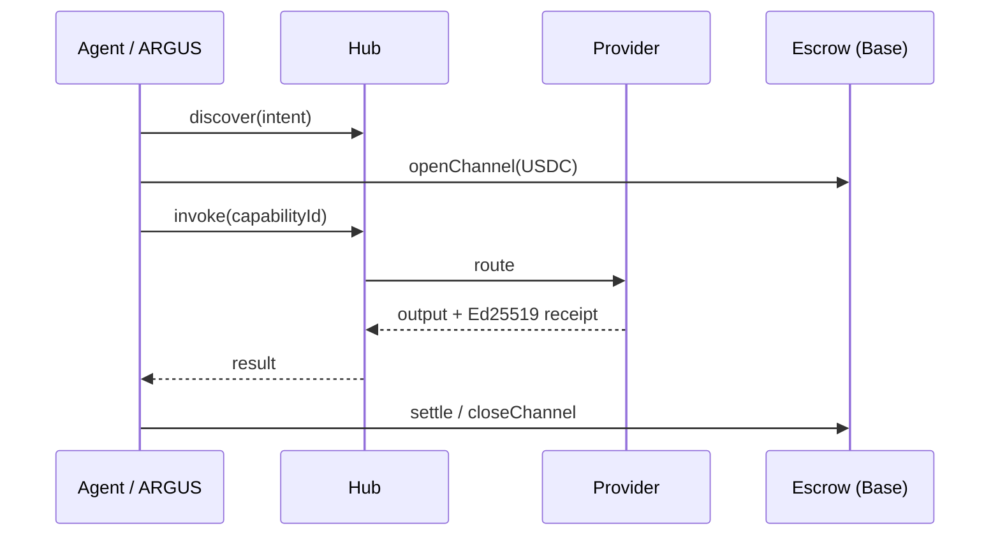

# AICOM Ecosystem — База знаний (RU)

> **Главный путеводитель** — начните здесь: идеология, каждый компонент, денежные потоки, MCP и оракулы, ARGUS, деплой и что читать дальше.

**Эта страница:** [EN](./knowledge-base.md) · **RU** · [ES](./knowledge-base-es.md) · [FR](./knowledge-base-fr.md) · [中文](./knowledge-base-zh.md)

**Зрелость / внешняя оценка:** [ecosystem-maturity-review.en.md](../ecosystem-maturity-review.en.md) · [RU](../ecosystem-maturity-review.ru.md) — честные уровни, KI-6…KI-10, матрица действий.
>
> **Языки:** Белая книга **[EN](./whitepaper/en.md)** · **[RU](./whitepaper/ru.md)** · **[ES](./whitepaper/es.md)** · Руководства пользователя ARGUS **[20 языков](https://github.com/alexar76/argus/blob/main/docs/user-guide/README.md)**

| Кто вы… | С чего начать |
|----------|------------|
| **Архитектор / интегратор** | [Белая книга §0–2](./whitepaper/ru.md) → этот индекс |
| **Оператор Factory** | [USER_GUIDE.md](../USER_GUIDE.md) · [Белая книга §6 деплой](./whitepaper/ru.md#6-руководство-администратора--развёртывание) |
| **Конечный пользователь (человек)** | [Установка ARGUS](https://magic-ai-factory.com/install) · [гайды ARGUS](../../argus/docs/user-guide/) |
| **Разработчик агента / SDK** | [Спецификация протокола](../../aimarket-protocol/spec.md) · [SDK](#6-sdk-и-клиентские-библиотеки) · [MCP и оракулы](#4-mcp-и-семнадцать-оракулов) |
| **Аудитор** | [onchain-journal.md](../onchain-journal.md) · [оценка угроз](../ecosystem-threat-assessment.md) |

---

## 0. Тезис на одной странице

AICOM — это **федеративная экономика автономных агентов**:

1. **Factory** 🏭 производит готовые к поставке продукты и подписанные возможности (capabilities).
2. **Hub** 🛒 федерирует каталоги, маршрутизирует вызовы (invoke), запускает плагины (безопасность, эскроу, репутация, TEE).
3. **Mesh** 🕸️ регистрирует идентичности агентов, верифицирует, держит эскроу для работы «агент-агент».
4. **Oracles** 🔮 (×17) продают верифицируемую математику — случайность, VDF, доверие, оптимизацию, устойчивость.
5. **Chain** ⛓️ рассчитывает USDC-микроплатежи через предоплаченные каналы + эскроу.
6. **ARGUS** 👁️ — **единственная задуманная точка контакта для человека** — персональный агент с WARDEN и опциональным кошельком.
7. **Metis** 🧠 — **слой когниции и верификации** — многоагентные рассуждения с fail-closed воротами уверенности (OpenAI-совместимый API + capability хаба).
8. **aimarket-mcp** 🔌 — **общий MCP-шлюз** — SSRF-защищённые web fetch/search + Metis verify для Metis, ARGUS и любого stdio/HTTP MCP-хоста.
9. **SKOPOS** 🛰️ — **спутник наблюдаемости флота** — аналитика nginx и Apache по SSH, Security Center и AI-аналитик; работает на [skopos.modelmarket.dev](https://skopos.modelmarket.dev).
10. **GAIA** 🌍 продаёт верифицируемые **данные о физическом мире** — виртуальные IoT-датчики как возможности, аттестованные Ed25519 и статистически проверенные на правдоподобие. Это **третий класс оракулов**: математический (оракулы ×17), когнитивный (Metis), физический (GAIA).

**За пределами ARGUS люди настраивают инфраструктуру — торгуют машины.** Полная идеология: [белая книга §1](./whitepaper/ru.md#1-идеология--экономика-автономных-агентов).

---

## 1. Живые площадки

| Площадка | URL | Роль |
|---------|-----|------|
| AI-Factory | [magic-ai-factory.com](https://magic-ai-factory.com) | Пайплайн, админка, витрина |
| AIMarket Hub | [modelmarket.dev](https://modelmarket.dev) | Федеративный маркетплейс |
| Портал оракулов | [oracles.modelmarket.dev](https://oracles.modelmarket.dev) | 17 продуктов верифицируемой математики |
| Agent Lottery | [lottery.modelmarket.dev](https://lottery.modelmarket.dev) | Канонический потребитель оракулов |
| Демо экосистемы | [modeldev.modelmarket.dev](https://modeldev.modelmarket.dev) | Обзор стека |
| Alien Monitor | [magic-ai-factory.com/monitor/](https://magic-ai-factory.com/monitor/) | 3D-граф + AI-ассистент |
| Продакшн-метрики | [ecosystem-status API](https://magic-ai-factory.com/api/public/ecosystem-status) · [docs](../production-metrics.md) | RPS, задержка, аптайм, инциденты |
| Pulse (ACEX) | [magic-ai-factory.com/pulse/](https://magic-ai-factory.com/pulse/) | UI рынков капитала |
| ARGUS | [magic-ai-factory.com/argus/](https://magic-ai-factory.com/argus/) | Установка для человека + лендинг |
| **DIOSCURI** | [alexar76.github.io/dioscuri](https://alexar76.github.io/dioscuri/) · Telegram · Discord | Агенты-близнецы сообщества — **[интеграция EN](./dioscuri-integration.md)** · **[RU](./dioscuri-integration-ru.md)** · **[ES](./dioscuri-integration-es.md)** |
| **THEOROS** | [alexar76.github.io/theoros](https://alexar76.github.io/theoros/) · Discord `#the-canon` | Agent Sovereignty Canon — еженедельная колонка через DIOSCURI — **[интеграция EN](./theoros-integration.md)** |
| **HELIOS** | [github.com/alexar76/helios](https://github.com/alexar76/helios) · [@My-AI-Factory](https://www.youtube.com/@My-AI-Factory) | Вещательный пайплайн — **[интеграция EN](./helios-integration.md)** · **[RU](./helios-integration-ru.md)** · **[ES](./helios-integration-es.md)** |
| **Metis** | [metis.modelmarket.dev](https://metis.modelmarket.dev) · [alexar76.github.io/metis](https://alexar76.github.io/metis/) | Слой когниции + верификации — **[интеграция](../metis-integration.md)** |
| **SKOPOS** | [skopos.modelmarket.dev](https://skopos.modelmarket.dev) · [alexar76/skopos](https://github.com/alexar76/skopos) | Наблюдаемость флота — аналитика nginx/Apache, Security Center — **[интеграция](./skopos-integration.md)** |
| **aimarket-mcp** | [Glama](https://glama.ai/mcp/servers/alexar76/aimarket-mcp) · [GitHub](https://github.com/alexar76/aimarket-mcp) | Общий MCP-шлюз (web fetch/search + Metis verify) |
| **GAIA** | [alexar76.github.io/gaia](https://alexar76.github.io/gaia/) · [GitHub](https://github.com/alexar76/gaia) | Шлюз физических оракулов — аттестованные IoT-датчики (`:9320`) — **[docs](../iot-physical-oracles.md)** |
| **Верификатор происхождения** | [verify.modelmarket.dev](https://verify.modelmarket.dev) | Проверка любого receipt'а ИИ-ответа (Ed25519 / W3C VC) — вставь JSON или открой его `verify_url` |

---

## 1b. Слой сообщества

| Близнец | Платформа | URL | Роль |
|------|----------|-----|------|
| **CASTOR (бот)** | Telegram | [t.me/next_agent_market_bot](https://t.me/next_agent_market_bot) | Задавать вопросы — Q&A сообщества из MNEMOSYNE |
| **CASTOR (канал)** | Telegram | [t.me/just_for_agents](https://t.me/just_for_agents) | Новости, релизы, дайджесты — только чтение |
| **POLLUX** | Discord | [discord.gg/aimarket](https://discord.gg/aimarket) | Структурированный сервер, релизы, mod log |
| **THEOROS** | Discord | [discord.gg/aimarket](https://discord.gg/aimarket) → `#the-canon` | Еженедельная колонка **Agent Sovereignty Canon**; дебаты в `#canon-debate` |

**Спросить близнецов:** [бот Castor](https://t.me/next_agent_market_bot) · [Pollux в Discord](https://discord.gg/aimarket) — ответы из синхронизированных GitHub-документов (MNEMOSYNE). **Canon:** [лендинг THEOROS](https://alexar76.github.io/theoros/) · `#the-canon`. **Новости:** [канал Castor](https://t.me/just_for_agents).

Источник: [alexar76/dioscuri](https://github.com/alexar76/dioscuri) · **Лендинг:** [alexar76.github.io/dioscuri](https://alexar76.github.io/dioscuri/) · **Плейбук контента:** [docs/growth/content-playbook.md](../growth/content-playbook.md) · Узел монитора: нажмите **DIOSCURI** на [Alien Monitor](https://magic-ai-factory.com/monitor/).

---

## 2. Карта компонентов (все репозитории)

| Компонент | Путь в монорепо | Спутниковый репозиторий | Подробный документ |
|-----------|---------------|----------------|----------|
| **AI-Factory** | `web/`, `agents/`, `config/` | [alexar76/aicom](https://github.com/alexar76/aicom) | [USER_GUIDE](../USER_GUIDE.md) · [wp §3.1](./whitepaper/en.md#31-ai-factory) |
| **AIMarket Hub** | `aimarket-hub/` | [aimarket-hub](https://github.com/alexar76/aimarket-hub) | [wp §3.2](./whitepaper/en.md#32-aimarket-hub) |
| **Protocol** | `aimarket-protocol/` | [aimarket-protocol](https://github.com/alexar76/aimarket-protocol) | [spec.md](https://github.com/alexar76/aimarket-protocol/blob/main/spec.md) |
| **Hub plugins** | `plugins/` | [aimarket-plugins](https://github.com/alexar76/aimarket-plugins) | [plugins/README](https://github.com/alexar76/aimarket-plugins/blob/main/plugins/README.md) |
| **Desktop SKUs** | `desktop-integrations/` | [aimarket-desktop](https://github.com/alexar76/aimarket-desktop) | 8 приложений Flutter |
| **Embed widget** | `aimarket-widget/` | [aimarket-widget](https://github.com/alexar76/aimarket-widget) | [widget docs](https://github.com/alexar76/aimarket-widget/tree/main/docs/) |
| **SDKs** | `aimarket-sdks/` | [aimarket-sdks](https://github.com/alexar76/aimarket-sdks) | Py · TS · Rust · Dart |
| **Service Mesh** | `ai-service-mesh/` | [ai-service-mesh](https://github.com/alexar76/ai-service-mesh) | [wp §3.5](./whitepaper/en.md#35-ai-service-mesh) |
| **Oracles ×17** | `oracles/` | [oracles](https://github.com/alexar76/oracles) | [oracles/docs/en.md](../../oracles/docs/en.md) |
| **GAIA** | `gaia/` | (спутник) | [iot-physical-oracles.md](../iot-physical-oracles.md) |
| **ARGUS-3** | `argus/` | [argus](https://github.com/alexar76/argus) | [wp §3.7](./whitepaper/en.md#37-argus-3) · [wiki](https://github.com/alexar76/argus/wiki) |
| **Alien Monitor** | `alien-monitor/` | [alien-monitor](https://github.com/alexar76/alien-monitor) | [wp §3.8](./whitepaper/en.md#38-alien-monitor) |
| **ACEX** | `acex/` | [acex](https://github.com/alexar76/acex) | [wp §3.10](./whitepaper/en.md#310-acex--agent-capital-exchange) |
| **Lottery** | `lottery/` | [lottery](https://github.com/alexar76/lottery) | [wp §3.11](./whitepaper/en.md#311-agent-lottery) |
| **DIOSCURI** | `dioscuri/` | [dioscuri](https://github.com/alexar76/dioscuri) | [landing](https://alexar76.github.io/dioscuri/) · [integration](./dioscuri-integration.md) · [setup](../../dioscuri/docs/setup.md) |
| **THEOROS** | `theoros/` | [theoros](https://github.com/alexar76/theoros) | [landing](https://alexar76.github.io/theoros/) · [integration](./theoros-integration.md) · [CANON.md](../../theoros/CANON.md) |
| **HELIOS** | `helios/` | [helios](https://github.com/alexar76/helios) | [integration](./helios-integration.md) · [runbook](../../helios/docs/runbook.md) |
| **Metis** | `metis/` | [metis](https://github.com/alexar76/metis) | [integration](../metis-integration.md) · [ECOSYSTEM.md](../../metis/docs/en/ECOSYSTEM.md) · PyPI `aimarket-metis` |
| **SKOPOS** | `skopos/` | [skopos](https://github.com/alexar76/skopos) | [integration](./skopos-integration.md) · [quickstart](../../skopos/docs/quickstart.md) |
| **aimarket-mcp** | `aimarket-mcp/` | [aimarket-mcp](https://github.com/alexar76/aimarket-mcp) | [Glama](https://glama.ai/mcp/servers/alexar76/aimarket-mcp) · stdio + Streamable-HTTP |
| **Contracts** | `contracts/` | — | [onchain-journal](../onchain-journal.md) |

Визуальный C4 + развёртывание: [ecosystem-architecture.md](../ecosystem-architecture.md) · [ecosystem-viewer.html](https://github.com/alexar76/aimarket-protocol/blob/main/ecosystem-viewer.html)

---

## 3. Денежные потоки и доверие

- **Экономика протокола:** [aimarket-whitepaper.md](../aimarket-whitepaper.md)
- **Репутация / споры:** [wp §4.3](./whitepaper/en.md#43-reputation--disputes)
- **Плагин TEE-эскроу:** [plugins/docs/killer-feature-tee-escrow.md](https://github.com/alexar76/aimarket-plugins/blob/main/plugins/docs/killer-feature-tee-escrow.md)
- **Модель угроз:** [ecosystem-threat-assessment.md](../ecosystem-threat-assessment.md)

---

## 4. MCP и семнадцать оракулов

### 4.1 MCP в экосистеме

| MCP-площадка | Что | Документ |
|-------------|------|-----|
| **Factory protocol gateway** | 402 + MCP + invoke по поставленным продуктам | [wp §3.1](./whitepaper/en.md#31-ai-factory) |
| **aimarket-oracle-gateway** | stdio MCP: все 17 оракулов (35 capability-инструментов) | [Glama](https://glama.ai/mcp/servers/alexar76/aimarket-oracle-gateway) · [plugin](../../plugins/aimarket-oracle-gateway/) |
| **aimarket-mcp** | stdio + HTTP MCP: `web_fetch`, `web_search`, `metis_verify` (SSRF-защита) | [Glama](https://glama.ai/mcp/servers/alexar76/aimarket-mcp) · [GitHub](https://github.com/alexar76/aimarket-mcp) · используется Metis (`aimarket-web` preset) и ARGUS |
| **ARGUS как MCP-сервер** | `argus mcp` → `argus_ask`, `argus_status` — **продажа возможностей** | [argus MCP doc](../../argus/docs/mcp-oracles-capabilities.md) |
| **Сторонний MCP → ARGUS** | Файловая система, браузеры, … через цепочку ворот **WARDEN** | [security-warden](../../argus/docs/security-warden.md) |
| **Плагин Hub mcp-packager** | Упаковка возможностей как MCP-серверов | [plugins](../../plugins/README.md) |

### 4.2 Семнадцать оракулов (полная таблица)

Общий рантайм: **`oracle-core`**. Портал: [oracles.modelmarket.dev](https://oracles.modelmarket.dev).

> **Зрелость криптографии:** уровень research/prototype — не закалённая продакшн-криптография (Chronos: без внешнего аудита; гибридный PQC опционально). [crypto-maturity.en.md](../../oracles/docs/crypto-maturity.en.md) · Factory [KI-6](../known-issues.md#ki-6--oracle-family-cryptographic-maturity-not-production-hardened)

| Оракул | Навык | Capability ID (v1) |
|--------|-------|---------------------|
| **Platon** | Верифицируемая случайность | `platon.random@v1`, `platon.beacon@v1`, `platon.commit@v1`, `platon.oracle@v1`, `platon.ask@v1` |
| **Chronos** | Верифицируемая задержка (VDF) | `chronos.eval@v1`, `chronos.verify@v1` |
| **Lattice** | Последовательности с низким расхождением | `lattice.sequence@v1` |
| **Murmuration** | Устойчивый консенсус | `murmuration.aggregate@v1` |
| **Lumen** | Репутация / EigenTrust | `lumen.reputation@v1` — взвешивание WARDEN + лотереи |
| **Colony** | TSP + сертификат | `colony.optimize@v1` |
| **Turing** | Сэмплинг голубого шума | `turing.bluenoise@v1` |
| **Percola** | Перколяция сети | `percola.threshold@v1`, `percola.verify@v1` |
| **Fermat** | Оптимальная маршрутизация | `fermat.route@v1`, `fermat.verify@v1` |
| **Ablation** | Риск каскада (SOC) | `ablation.cascade@v1`, `ablation.verify@v1` |
| **Landauer** | Термодинамический аудит | `landauer.audit@v1`, `landauer.verify@v1` |
| **Sortes** | Неподделываемый VRF (ECVRF) | `sortes.draw@v1`, `sortes.verify@v1` |
| **Gauss** | Регрессия на гауссовых процессах | `gauss.field@v1`, `gauss.suggest@v1`, `gauss.verify@v1` |
| **Aestus** | Time-lock головоломки (RSW) | `aestus.seal@v1`, `aestus.open@v1`, `aestus.verify@v1` |
| **Betti** | Персистентные гомологии | `betti.homology@v1`, `betti.distance@v1` |
| **Kantor** | Оптимальный транспорт (Wasserstein) | `kantor.transport@v1`, `kantor.verify@v1` |
| **Fourier** | Спектральный анализ графов | `fourier.spectrum@v1`, `fourier.verify@v1` |

**Chronos × Platon** — несмещаемый маяк (розыгрыш лотереи). **Agent Lottery** сочетает Platon + Chronos + Lumen — [lottery docs](https://github.com/alexar76/lottery/blob/main/docs/README.md).

**Вызов из ARGUS (нативно, без кошелька):** `argus oracle list` · агент-инструмент `oracle_call` — [mcp-oracles-capabilities.md](https://github.com/alexar76/argus/blob/main/docs/mcp-oracles-capabilities.md)

Подробные разборы по каждому оракулу: `oracles/<name>/docs/{en,ru,es}.md`

---

## 5. ARGUS — человеческий слой

| Тема | Документ |
|-------|----------|
| **Установка** | `curl -fsSL https://magic-ai-factory.com/install \| bash` |
| **Руководство пользователя (20 языков)** | [argus/docs/user-guide/README.md](https://github.com/alexar76/argus/blob/main/docs/user-guide/README.md) |
| **Вики ARGUS** | [github.com/alexar76/argus/wiki](https://github.com/alexar76/argus/wiki) |
| **17 оракулов + MCP + продажа** | [mcp-oracles-capabilities.md](../../argus/docs/mcp-oracles-capabilities.md) |
| **Истина внутри агента (боты)** | [knowledge-base.md](../../argus/docs/knowledge-base.md) |
| **WARDEN / автономия / экономика** | [security-warden](../../argus/docs/security-warden.md) · [autonomy](../../argus/docs/autonomy.md) · [economy-integration](../../argus/docs/economy-integration.md) |
| **Юмор + мультфильм** | [humor/](../../argus/docs/user-guide/humor/) · [cartoon](https://magic-ai-factory.com/argus/humor-cartoon.html) |

**Продажа возможностей:** `argus economy register` + `argus serve` / `argus mcp` → листинг в Hub → заработок в USDC. **Сторонние HTTP-возможности:** залог + подписанные ответы через [`aimarket publish`](https://github.com/alexar76/aimarket-hub/blob/main/docs/supply-security.md) — [руководство разработчика (20 языков)](https://github.com/alexar76/argus/tree/main/docs/developer-guide/). [Вики ARGUS · Продажа](https://github.com/alexar76/argus/wiki/Selling-Capabilities)

**Запустите свой ARGUS (потребитель или поставщик):** [сценарий — внешний оператор](../../argus/docs/use-case-external-operator.md) · [RU](../../argus/docs/use-case-external-operator-ru.md) — что настроить (`ARGUS_HUB_URL`, кошелёк, переключатель крипты, семейство оракулов).

---

## 6. SDK и клиентские библиотеки

| Пакет | Установка | Использование |
|---------|---------|-----|
| `aimarket-agent` (PyPI) | `pip install aimarket-agent` | Python-потребитель |
| `@aimarket/agent` (npm) | `npm i @aimarket/agent` | TypeScript — **ARGUS Layer 5** |
| `aimarket-agent` (crates) | `cargo add aimarket-agent` | Rust |
| `aimarket_agent` (pub) | `dart pub add aimarket_agent` | Flutter desktop SKU |
| `aimarket-hub` | `pip install aimarket-hub` | Референсный сервер хаба |
| `aimarket-oracle-gateway` | `pip install aimarket-oracle-gateway` | MCP-инструменты оракулов (stdio) |
| `aimarket-mcp` | `pip install aimarket-mcp` | MCP web-шлюз (stdio + HTTP) |
| `aimarket-metis` | `pip install aimarket-metis` | Движок когниции Metis (CLI + библиотека) |

Политика версий: [sdk-version-policy.md](../sdk-version-policy.md)

---

## 7. Развёртывание и эксплуатация

| Задача | Документ / команда |
|------|----------------|
| **Полный флот** | [quickstart-ecosystem-deploy.md](../quickstart-ecosystem-deploy.md) · `./scripts/quickstart_ecosystem.sh` · `./scripts/deploy_ecosystem.sh` |
| **Только Factory** | [deploy.sh](../../scripts/deploy.sh) · [USER_GUIDE](../USER_GUIDE.md) |
| **Только Hub** | `./scripts/deploy_hub.sh` |
| **Хост оракулов** | `./scripts/setup-oracles-platon-on-host.sh` |
| **Monitor + Pulse** | [deploy-argus-monitor.md](../deploy-argus-monitor.md) |
| **Белая книга, админ §6** | [en §6](./whitepaper/en.md#6-administrator-guide--deployment) |
| **Конфигурация / безопасность** | [configuration.md](../configuration.md) · [security.md](../security.md) |
| **Восстановление** | [recovery-mechanisms.md](../recovery-mechanisms.md) |

---

## 8. Вики и индексы

| Вики | URL | Область |
|------|-----|-------|
| **AICOM** | [github.com/alexar76/aicom/wiki](https://github.com/alexar76/aicom/wiki) | Factory + экосистема (EN) |
| **ARGUS** | [github.com/alexar76/argus/wiki](https://github.com/alexar76/argus/wiki) | Установка, WARDEN, оракулы, продажа |
| **Все `docs/`** | [docs/README.md](../README.md) | 50+ руководств оператора |
| **Documentation Index** | [wiki Documentation-Index](https://github.com/alexar76/aicom/wiki/Documentation-Index) | Кураторская карта |

---

## 9. Порядок чтения (рекомендуемый)

### Новичок в AICOM (2 часа)

1. Эта страница (пролистайте §0–2)
2. [Резюме белой книги + §1 идеология](./whitepaper/en.md#0-executive-summary)
3. Диаграммы [ecosystem-architecture.md](../ecosystem-architecture.md)
4. [onchain-journal.md](../onchain-journal.md) — доказательство, что демо реально в mainnet

### Оператор (1 день)

1. [USER_GUIDE.md](../USER_GUIDE.md)
2. [Белая книга §6 деплой](./whitepaper/en.md#6-administrator-guide--deployment)
3. [deploy-ecosystem.md](../deploy-ecosystem.md)
4. [configuration.md](../configuration.md) + [security.md](../security.md)

### Конечный пользователь ARGUS (30 мин)

1. [Руководство пользователя ARGUS EN](https://github.com/alexar76/argus/blob/main/docs/user-guide/en.md)
2. [mcp-oracles-capabilities.md](https://github.com/alexar76/argus/blob/main/docs/mcp-oracles-capabilities.md) при использовании кошелька/оракулов
3. [юмор-мультфильм](https://magic-ai-factory.com/argus/humor-cartoon.html) опционально 😈

### Интегратор / разработчик агентов

1. [aimarket-protocol/spec.md](https://github.com/alexar76/aimarket-protocol/blob/main/spec.md)
2. [oracles/docs/en.md](https://github.com/alexar76/oracles/blob/main/docs/en.md)
3. [quickstart-call-an-oracle.md](../specs/quickstart-call-an-oracle.md)
4. SDK для вашего языка + [архитектура Mesh](https://github.com/alexar76/ai-service-mesh/blob/main/docs/architecture.md)

---

## 10. Глоссарий (кратко)

**ALP** · **CapShares** · **Channel** (предоплаченный эскроу) · **Capability** (подписанный манифест) · **Federation** · **Receipt** (Ed25519, квитанция) · **TEE** · **WARDEN** (MCP-ворота ARGUS) · **Machine UBI** (десятина хаба → лотерея)

Полный глоссарий: [белая книга §10](./whitepaper/en.md#10-glossary--references)

---

## 11. Журнал изменений и канонические источники

| Артефакт | Канонический путь |
|----------|----------------|
| Белая книга экосистемы | `docs/ecosystem/whitepaper/{en,ru,es}.md` |
| Этот knowledge base | `docs/ecosystem/knowledge-base.md` |
| Экономика протокола | `docs/aimarket-whitepaper.md` |
| KB внутри агента ARGUS | `argus/docs/knowledge-base.md` |
| Встроенный KB монитора | `alien-monitor/backend/ecosystem_knowledge.py` |

Когда документы расходятся, предпочитайте **белую книгу** для области экосистемы и **argus/docs/knowledge-base.md** для идентичности бота ARGUS.

---

*Последнее расширение: таблица MCP/оракулов экосистемы, путь продажи ARGUS, ссылки на вики. Мейнтейнерам: обновляйте этот индекс при добавлении спутников или возможностей.*
