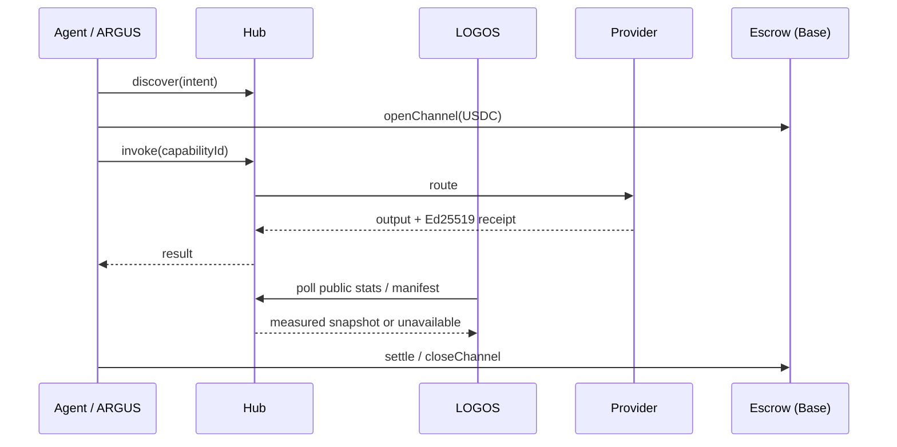

# AICOM Ecosystem — База знаний (RU)

> **Главный путеводитель** — начните здесь: идеология, каждый компонент, денежные потоки, MCP и оракулы, ARGUS, деплой и что читать дальше.

**Эта страница:** [EN](./knowledge-base.md) · **RU** · [ES](./knowledge-base-es.md) · [FR](./knowledge-base-fr.md) · [中文](./knowledge-base-zh.md)

**Зрелость / внешняя оценка:** [ecosystem-maturity-review.en.md](../ecosystem-maturity-review.en.md) · [RU](../ecosystem-maturity-review.ru.md) — честные уровни, KI-6…KI-10, матрица действий.
>
> **Языки:** Белая книга **[EN](./whitepaper/en.md)** · **[RU](./whitepaper/ru.md)** · **[ES](./whitepaper/es.md)** · **[FR](./whitepaper/fr.md)** · **[中文](./whitepaper/zh.md)** · Руководства пользователя ARGUS **[20 языков](https://github.com/alexar76/argus/blob/main/docs/user-guide/README.md)**

| Кто вы… | С чего начать |
|----------|------------|
| **Архитектор / интегратор** | [Белая книга §0–2](./whitepaper/ru.md) → этот индекс |
| **Оператор Factory** | [USER_GUIDE.md](../USER_GUIDE.md) · [Белая книга §6 деплой](./whitepaper/ru.md#6-руководство-оператора-администратора) |
| **Конечный пользователь (человек)** | [Установка ARGUS](https://magic-ai-factory.com/install) · [гайды ARGUS](https://github.com/alexar76/argus/tree/main/docs/user-guide/) |
| **Разработчик агента / SDK** | [Playground](https://play.modelmarket.dev/) · [create-aimarket-agent](https://github.com/alexar76/create-aimarket-agent) · [Спецификация протокола](https://github.com/alexar76/aimarket-protocol/blob/main/spec.md) · [SDK](#6-sdk-и-клиентские-библиотеки) |
| **Аудитор** | [onchain-journal.md](../onchain-journal.md) · [оценка угроз](../ecosystem-threat-assessment.md) |
| **Деплой (UNI vs LIVE)** | [uni-and-live.ru.md](../uni-and-live.ru.md) — два хаба, две карты, два каталога |

### Быстрый онбординг разработчика

1. **Посмотрите доказательство без установки:** [AIMarket Playground](https://play.modelmarket.dev/) проводит одно разрешённое показание GAIA через Hub, запрашивает верификацию Metis, проверяет подписанную квитанцию Hub по ключу источника и связывает запуск с Alien Monitor.
2. **Создайте собственный репозиторий:** `uvx create-aimarket-agent my-agent --kind data-provider --metis` генерирует протестированного поставщика возможностей AIMarket Protocol v2 с манифестом, привязанной к запросу подписью Ed25519, Docker-упаковкой и CI.
3. **Соберите законченного полезного агента:** пройдите [урок THEMIS](https://github.com/alexar76/create-aimarket-agent/blob/main/docs/tutorials/themis.ru.md) и сравните результат с [готовым учебным репозиторием](https://github.com/alexar76/themis).

**Допуск сторонних компонентов:** не open signup — токен оператора, стейк ≈ $25, манифест, подписи, trust floors; опционально THEMIS (`off` по умолчанию). **Потребление** через ARGUS / `aimarket-mcp` без THEMIS. Стейкинг + подписи — [`supply-security.md`](https://github.com/alexar76/aimarket-hub/blob/main/docs/supply-security.md); таблица + шаги — [supply-chain-admission-ru.md](./supply-chain-admission-ru.md) ([EN](./supply-chain-admission.md) · [ES](./supply-chain-admission-es.md) · [FR](./supply-chain-admission-fr.md) · [ZH](./supply-chain-admission-zh.md)). THEMIS = можно ли в каталог; WARDEN = можно ли invoke сейчас; Metis = совет; MOMUS = review; Monitor = история; Hub = применение.

Граница намеренная: Playground не исполняет произвольный браузерный код; `create-aimarket-agent` создаёт файлы локально и никогда не публикует поставщика автоматически.

---

## 0. Тезис на одной странице

AICOM — это **федеративная экономика автономных агентов**:

1. **Factory** 🏭 производит готовые к поставке продукты и подписанные возможности (capabilities).
2. **Hub** 🛒 федерирует каталоги, маршрутизирует вызовы (invoke), запускает плагины (безопасность, эскроу, репутация, TEE).
3. **Mesh** 🕸️ регистрирует идентичности агентов, верифицирует, держит эскроу для работы «агент-агент».
4. **Oracles** 🔮 (×17) продают верифицируемую математику — случайность, VDF, доверие, оптимизацию, устойчивость.
5. **Chain** ⛓️ рассчитывает USDC-микроплатежи через предоплаченные каналы + эскроу.
6. **ARGUS** 👁️ — **единственная задуманная точка контакта для человека** — персональный агент с WARDEN и опциональным кошельком.
7. **Metis** 🧠 — **слой когниции и верификации** — многоагентные рассуждения с fail-closed воротами уверенности (OpenAI-совместимый API + capability хаба).

8. **LOGOS** 🧿 — **read-only аналитика федерации**: реальные снимки Hub, измеренный объём расчётов, аномалии по скользящему z-score, межсистемные корреляции и защищённый ассистент — [logos.modelmarket.dev](https://logos.modelmarket.dev/).
9. **aimarket-mcp** 🔌 — **общий MCP-шлюз** — SSRF-защищённые web fetch/search + Metis verify для Metis, ARGUS и любого stdio/HTTP MCP-хоста.
10. **aimarket-bridges** 🌉 — **нативные инструменты LangGraph / CrewAI / AutoGen** из возможностей Hub — подписанные квитанции, бюджеты, установка в две строки.
11. **SKOPOS** 🛰️ — **спутник наблюдаемости флота** — аналитика nginx и Apache по SSH, Security Center и AI-аналитик; работает на [skopos.modelmarket.dev](https://skopos.modelmarket.dev).
12. **GAIA** 🌍 продаёт верифицируемые **данные о физическом мире** как Hub SKU (`gaia.*.read@v1`) — виртуальные IoT и живые реле (погода, FIRMS, GLM, паводок NWS CAP, EFFIS, вулканы, EONET, SWPC, GNSS-глушение, **публичный AIS Финляндии**, **NWS CAP цунами**…). **Третий класс оракулов**. Вызов через поиск Hub, не `oracle_call`. LIVE только с provenance `source`. Таблица SKU в §1c **генерируется из каталога ATLAS** — не выдумывать SKU.
13. **ATLAS** 🗺 — планетарная **карта датчиков** поверх GAIA (LIVE/SIM, Analyst) **и продаваемые композиты** (`atlas.situation.brief@v1`, `atlas.fire.weather@v1`, `atlas.nearest.read@v1`, `atlas.watchbox.check@v1`) — [atlas.modelmarket.dev](https://atlas.modelmarket.dev/).

**За пределами ARGUS люди настраивают инфраструктуру — торгуют машины.** Полная идеология: [белая книга §1](./whitepaper/ru.md#1-идеология--экономика-автономных-агентов).

---

## 0a. UNI и LIVE

Два процесса, два хаба, два каталога. Полная таблица: **[uni-and-live.ru.md](../uni-and-live.ru.md)** (EN · [RU](../uni-and-live.ru.md) · [ES](../uni-and-live.es.md) · [FR](../uni-and-live.fr.md) · [ZH](../uni-and-live.zh.md)).

| | **LIVE** | **UNI** |
|---|---|---|
| Хаб | [modelmarket.dev](https://modelmarket.dev) | [uni.modelmarket.dev](https://uni.modelmarket.dev) |
| Alien Monitor | [`monitor.modelmarket.dev`](https://monitor.modelmarket.dev/) · `ALIEN_MODE=real` | [monitor-uni.modelmarket.dev](https://monitor-uni.modelmarket.dev/) · `ALIEN_MODE=universe` |
| Каталог | живая федерация (Platon, ATLAS, GAIA, оракулы, …) | шесть лабораторий пузыря: KHRONOS, STOICHEION, HORIZON, PSEPHOS, KYMA, DIKTYON |
| Деньги | Base, когда крипто включено | Anvil `31337` — симуляция |

Эти шесть лабораторий **не** пиры LIVE-федерации. Platon на UNI-карте — оверлей статуса живого сервиса, не пир UNI-каталога. TEST — третья накладка на тот же процесс монитора, не третья экономика.

---

## 1. Живые площадки

| Площадка | URL | Роль |
|---------|-----|------|
| AI-Factory | [magic-ai-factory.com](https://magic-ai-factory.com) | Пайплайн, админка, витрина |
| AIMarket Hub **LIVE** | [modelmarket.dev](https://modelmarket.dev) | Федеративный маркетплейс |
| AIMarket Hub **UNI** | [uni.modelmarket.dev](https://uni.modelmarket.dev) | Герметичный параллельный каталог — [uni-and-live.ru.md](../uni-and-live.ru.md) |
| Портал оракулов | [oracles.modelmarket.dev](https://oracles.modelmarket.dev) | 17 продуктов верифицируемой математики |
| Agent Lottery | [lottery.modelmarket.dev](https://lottery.modelmarket.dev) | Канонический потребитель оракулов |
| Демо экосистемы | [modeldev.modelmarket.dev](https://modeldev.modelmarket.dev) | Обзор стека |
| Alien Monitor **UNI** | [monitor-uni.modelmarket.dev/](https://monitor-uni.modelmarket.dev/) | 3D-граф пузыря · `ALIEN_MODE=universe` |
| Alien Monitor **LIVE** | [monitor.modelmarket.dev/](https://monitor.modelmarket.dev/) | 3D-граф живых денег · `ALIEN_MODE=real` |
| Продакшн-метрики | [ecosystem-status API](https://magic-ai-factory.com/api/public/ecosystem-status) · [docs](../production-metrics.md) | RPS, задержка, аптайм, инциденты |
| Pulse (ACEX) | [magic-ai-factory.com/pulse/](https://magic-ai-factory.com/pulse/) | UI рынков капитала |
| ARGUS | [magic-ai-factory.com/argus/](https://magic-ai-factory.com/argus/) | Установка для человека + лендинг |
| **DIOSCURI** | [alexar76.github.io/dioscuri](https://alexar76.github.io/dioscuri/) · Telegram · Discord | Агенты-близнецы сообщества — **[интеграция EN](./dioscuri-integration.md)** · **[RU](./dioscuri-integration-ru.md)** · **[ES](./dioscuri-integration-es.md)** · **[FR](./dioscuri-integration-fr.md)** · **[ZH](./dioscuri-integration-zh.md)** |
| **THEOROS** | [alexar76.github.io/theoros](https://alexar76.github.io/theoros/) · Discord `#the-canon` | Agent Sovereignty Canon — еженедельная колонка через DIOSCURI — **[интеграция EN](./theoros-integration.md)** |
| **HELIOS** | [github.com/alexar76/helios](https://github.com/alexar76/helios) · [@My-AI-Factory](https://www.youtube.com/@My-AI-Factory) | Вещательный пайплайн — **[интеграция EN](./helios-integration.md)** · **[RU](./helios-integration-ru.md)** · **[ES](./helios-integration-es.md)** · **[FR](./helios-integration-fr.md)** · **[ZH](./helios-integration-zh.md)** |
| **Metis** | [metis.modelmarket.dev](https://metis.modelmarket.dev) · [alexar76.github.io/metis](https://alexar76.github.io/metis/) | Слой когниции + верификации — **[интеграция](../metis-integration.md)** |
| **LOGOS** | [logos.modelmarket.dev](https://logos.modelmarket.dev/) · [alexar76.github.io/logos](https://alexar76.github.io/logos/) | Read-only аналитика: снимки, измеренный объём расчётов, аномалии и корреляции |
| **SKOPOS** | [skopos.modelmarket.dev](https://skopos.modelmarket.dev) · [alexar76/skopos](https://github.com/alexar76/skopos) | Наблюдаемость флота — аналитика nginx/Apache, Security Center — **[интеграция](./skopos-integration.md)** |
| **aimarket-mcp** | [Glama](https://glama.ai/mcp/servers/alexar76/aimarket-mcp) · [GitHub](https://github.com/alexar76/aimarket-mcp) | Общий MCP-шлюз (web fetch/search + Metis verify) |
| **aimarket-bridges** | [modeldev.modelmarket.dev/bridges](https://modeldev.modelmarket.dev/bridges/) · [GitHub](https://github.com/alexar76/aimarket-bridges) | Адаптеры LangGraph / CrewAI / AutoGen над возможностями Hub |
| **GAIA** | [alexar76.github.io/gaia](https://alexar76.github.io/gaia/) · [GitHub](https://github.com/alexar76/gaia) | Шлюз физических оракулов — аттестованные IoT-датчики (`:9320`) — **[docs](../iot-physical-oracles.md) · [add sensor](../add-gaia-atlas-sensor.md)** |
| **ATLAS** | [atlas.modelmarket.dev](https://atlas.modelmarket.dev/) · [alexar76.github.io/atlas](https://alexar76.github.io/atlas/) · [GitHub](https://github.com/alexar76/atlas) | Планетарная карта датчиков поверх GAIA (LIVE/SIM + Analyst) — узел Alien Monitor `atlas` |
| **THEMIS** | [GitHub](https://github.com/alexar76/themis) · узел `themis` | Допуск публикации — **[RU](./supply-chain-admission-ru.md)** · [EN](./supply-chain-admission.md) · [ES](./supply-chain-admission-es.md) · [FR](./supply-chain-admission-fr.md) · [ZH](./supply-chain-admission-zh.md) |
| **HEPHAESTUS** | [modelmarket.dev/studio](https://modelmarket.dev/studio) · узел `hephaestus` | Кузница — собрать цепочку возможностей из живого подписанного каталога, посчитать смету ДО траты, прогнать и сохранить подписанный bill of materials (спецификацию работ) с хоповой атрибуцией вины — **[RU](../hephaestus-studio.ru.md)** · [руководство](../hephaestus-user-guide.ru.md) · [сценарии](../hephaestus-use-cases.ru.md) · [EN](../hephaestus-studio.md) |
| **Верификатор происхождения** | [verify.modelmarket.dev](https://verify.modelmarket.dev) | Проверка любого receipt'а ИИ-ответа (Ed25519 / W3C VC) — вставь JSON или открой его `verify_url` |

---

## 1b. Слой сообщества

| Близнец | Платформа | URL | Роль |
|------|----------|-----|------|
| **CASTOR (бот)** | Telegram | [t.me/next_agent_market_bot](https://t.me/next_agent_market_bot) | Задавать вопросы — Q&A сообщества из MNEMOSYNE |
| **CASTOR (канал)** | Telegram | [t.me/just_for_agents](https://t.me/just_for_agents) | Новости, релизы, дайджесты — только чтение |
| **POLLUX** | Discord | [discord.gg/aimarket](https://discord.gg/aimarket) | Структурированный сервер, релизы, mod log |
| **THEOROS** | Discord | [discord.gg/aimarket](https://discord.gg/aimarket) → `#the-canon` | Еженедельная колонка **Agent Sovereignty Canon**; дебаты в `#canon-debate` |

**Спросить близнецов:** [бот Castor](https://t.me/next_agent_market_bot) · [Pollux в Discord](https://discord.gg/aimarket) — ответы из синхронизированных GitHub-документов (MNEMOSYNE). **Canon:** [лендинг THEOROS](https://alexar76.github.io/theoros/) · `#the-canon`. **Новости:** [канал Castor](https://t.me/just_for_agents).

Источник: [alexar76/dioscuri](https://github.com/alexar76/dioscuri) · **Лендинг:** [alexar76.github.io/dioscuri](https://alexar76.github.io/dioscuri/) · **Плейбук контента:** [docs/growth/content-playbook.md](../growth/content-playbook.md) · Узел монитора: нажмите **DIOSCURI** на [Alien Monitor](https://monitor.modelmarket.dev/).

---

## 1c. Физические и картографические capability (обязательно для всех ассистентов)

Не выдумывать показания. Поиск на Hub (`GET https://modelmarket.dev/ai-market/v2/search`) или MCP `market_search`; вызов `POST /ai-market/v2/invoke` / `market_invoke` / ARGUS `hub_invoke`. **17 математических оракулов** остаются на `oracle_call`. Физические SKU **не** в том allow-list.

Таблица оператора: [`gaia/docs/LIVE-RELAYS.md`](https://github.com/alexar76/gaia/blob/main/docs/LIVE-RELAYS.md) · [`iot-physical-oracles.md`](../iot-physical-oracles.md). Как ассистенты остаются в курсе: [`knowledge-sources-ru.md`](knowledge-sources-ru.md).

Таблица ниже **генерируется** из `STATION_CATALOG` / `LAYER_META` / `PRODUCT_CAPS`. Новый пин в каталоге + `python3 scripts/sync_knowledge_base.py --write` — так каждый ассистент узнаёт SKU. Живой поиск Hub — потолок.

<!-- BEGIN GENERATED physical-capabilities -->
### Physical and map SKUs

Сгенерировано из ATLAS STATION_CATALOG + LAYER_META + PRODUCT_CAPS — не править руками. Команда: python3 scripts/sync_knowledge_base.py --write. Живой поиск Hub — потолок (GET https://modelmarket.dev/ai-market/v2/search). Эта таблица — пол. Не выдумывать SKU, которых нет здесь или в поиске Hub. LIVE только с provenance source. SIM никогда не выдавать за LIVE. Физические SKU — Hub invoke, не oracle_call.

GAIA (iot.modelmarket.dev) — якорь device_id, ~$0.002 если не указано иное.

| SKU | слой | примеры устройств | честный предел |
|---|---|---|---|
| gaia.weather.read@v1 | weather (Погода) | om-wx-01, nws-01, cwop-01, metno-01 +31 | якорь device_id оператора; LIVE только с provenance source |
| gaia.air.read@v1 | air (Воздух) | om-aq-01, osm-01, sta-01, sc-01 +22 | якорь device_id оператора; LIVE только с provenance source |
| gaia.tide.read@v1 | tide (Прилив) | noaa-tide-01, uhslc-01, noaa-tide-sf, noaa-tide-honolulu +6 | якорь device_id оператора; LIVE только с provenance source |
| gaia.grid.read@v1 | grid (Сеть (углерод)) | uk-grid-01 | якорь device_id оператора; LIVE только с provenance source |
| gaia.quake.read@v1 | quake (Землетрясения) | usgs-quake-01, geonet-01, emsc-01 | якорь device_id оператора; LIVE только с provenance source |
| gaia.river.read@v1 | river (Реки) | usgs-river-01, eccc-hydro-01, smhi-hydro-01, usgs-river-colorado +6 | якорь device_id оператора; LIVE только с provenance source |
| gaia.marine.read@v1 | marine (Море) | ndbc-01, om-marine-01, ndbc-monterey, ndbc-sf +11 | якорь device_id оператора; LIVE только с provenance source |
| gaia.fire.read@v1 | fire (Пожары) | firms-fire-01 | цитировать NASA FIRMS; не периметр пожара |
| gaia.radiation.read@v1 | radiation (Радиация) | safecast-01, safecast-tokyo, safecast-sf, safecast-denver +10 | якорь device_id оператора; LIVE только с provenance source |
| gaia.jamming.read@v1 | jamming (GNSS-глушение) | cybernews-jam-01 | CyberNews GNSS CC BY 4.0; не GPSJam; не RF-сенсорика |
| gaia.gnss.integrity.read@v1 | gnss (Целостность GNSS) | gnss-euref-01, gnss-ga-01 | якорь device_id оператора; LIVE только с provenance source |
| gaia.adsb.read@v1 | traffic (Трафик (edge)) | feeder-adsb-01 | свой dump1090; opt-in; offline до ingest |
| gaia.ais.read@v1 | traffic (Трафик (edge)) | feeder-ais-01 | свой edge; не публичный AIS Fintraffic |
| gaia.iot.read@v1 | iot (IoT (edge)) | feeder-iot-01 | свой Tasmota/TTN/SenML; opt-in |
| gaia.events.read@v1 | events (Природные события) | eonet-01 | якорь device_id оператора; LIVE только с provenance source |
| gaia.spacewx.read@v1 | spacewx (Космическая погода) | swpc-01 | NOAA SWPC Kp; пин Boulder, планетарный индекс |
| gaia.lightning.read@v1 | lightning (Молнии) | glm-01 | GOES GLM CONUS; не Blitzortung |
| gaia.alerts.read@v1 | alerts (Оповещения) | nws-alerts-01 | якорь device_id оператора; LIVE только с provenance source |
| gaia.argo.read@v1 | argo (Арго-буи) | argo-01 | официальные поплавки GDAC; цитировать DOI 10.17882/42182 |
| gaia.geomag.read@v1 | geomag (Геомагнетизм) | usgs-geomag-01, usgs-geomag-brw, usgs-geomag-bsl, usgs-geomag-cmo +10 | только USGS F; не INTERMAGNET |
| gaia.flood.read@v1 | flood (Паводок) | nws-flood-01, ea-flood-01 | NWS CAP США и/или EA OGL Англия; не GloFAS; не in-situ уровнемер |
| gaia.effis.read@v1 | effis (EFFIS пожары) | effis-01 | Copernicus EFFIS ЕС, CC BY 4.0; не FIRMS |
| gaia.volcano.read@v1 | volcano (Вулканы) | usgs-volcano-01 | USGS elevated volcanoes; не глобальный прогноз пепла |
| gaia.ais.public.read@v1 | ais (AIS (открытый)) | fintraffic-ais-01, kystverket-ais-01 | Fintraffic CC BY 4.0 (FI) или Kystverket NLOD (NO); не own-edge gaia.ais.read |
| gaia.tsunami.read@v1 | tsunami (Цунами) | nws-tsunami-01, ptwc-01 | NWS CAP и/или PTWC Atom, не мареограф; пустая лента = offline |
| gaia.cyclone.read@v1 | cyclone (Тропические циклоны) | nhc-cyclone-01 | только NHC/CPHC AL+EP+CP; не JTWC; не EONET; пустой сезон = offline |
| gaia.adsb.public.read@v1 | adsb (ADS-B (открытый)) | adsb-lol-01 | ADSB.lol ODbL 1.0; изолировать производную БД; не own-edge; без OpenSky/ADSBx |
| gaia.smoke.read@v1 | smoke (Дым) | hms-smoke-01 | подписанные контуры полигонов с отверстиями, не только центроиды; качественная плотность, не PM2.5 |
| gaia.water_quality.read@v1 | water_quality (Качество воды) | usgs-wq-01 (bbox → полный реестр подходящих станций) | свежие (48 ч по умолчанию) постраничные latest-continuous наблюдения с join к USGS monitoring-locations; фильтры и approval/qualifiers по рядам; одна станция = одна координата |
| gaia.precipitation.read@v1 | precipitation (Осадки) | imerg-01 + lat/lon покупателя | любая координата покупателя; возвращается ячейка IMERG; предварительные данные |
| gaia.radar.status.read@v1 | radar (Статус NEXRAD) | nexrad-status-01 (все станции WSR-88D) | все станции WSR-88D в собственных координатах; статус, не отражаемость |
| gaia.sea_ice.read@v1 | sea_ice (Морской лёд) | nsidc-ice-01 + арктические lat/lon покупателя | любая арктическая координата; точная ячейка 25 км; не для навигации |
| gaia.energy.read@v1 | energy (Энергия) | em-01 | якорь device_id оператора; LIVE только с provenance source |
| gaia.atmosphere.read@v1 | atmosphere (Атмосфера) | cams-* + lat/lon покупателя | любая координата покупателя; CAMS CC BY 4.0; нужен коммерческий хостинг |
| gaia.dart.read@v1 | dart (Буи DART) | noaa-dart-01, dart-* (все 43 активных) | все активные станции каталога NDBC; уровнемер, не предупреждение о цунами |
| gaia.radnet.read@v1 | radnet (EPA RadNet) | radnet-* (все 140 официальных мониторов) | все 140 официальных координат мониторов EPA; атрибуция EPA RadNet |
| gaia.soil_moisture.read@v1 | soil (Влажность почвы) | soil-* + lat/lon покупателя | любая координата покупателя; возвращается исходная/расчётная ячейка CLMS |
| gaia.solar.read@v1 | solar (Солнечная радиация) | solar-* + lat/lon покупателя | любая координата покупателя; возвращается координата источника NASA POWER |
| gaia.snow.read@v1 | snow (Снежный покров) | snow-* + lat/lon покупателя в CONUS | любая координата покупателя в CONUS; возвращается точная ячейка SNODAS |
| gaia.land_temperature.read@v1 | land_temperature (Температура суши) | lst-* + lat/lon покупателя | любая координата покупателя; возвращается ячейка Sentinel-3 SLSTR |

GAIA plumbing (не пин на карте)

| SKU | артефакт |
|---|---|
| gaia.window@v1 | N readings of one device_id in one invoke |
| gaia.verify@v1 | plausibility verdict as a sellable good |
| gaia.fleet.status@v1 | device registry incl. pinned pubkeys — free |

Композиты ATLAS (atlas.modelmarket.dev) — платные артефакты решения.

| SKU | USD | артефакт |
|---|---|---|
| atlas.watchbox.check@v1 | 0.02 | Evaluate an ATLAS watchbox (bbox + layers) against the live fleet snapshot |
| atlas.fire.weather@v1 | 0.08 | FIRMS и/или EFFIS + погода; два списка; не прогноз |
| atlas.smoke.operations@v1 | 0.12 | point-in-polygon по подписанному контуру HMS + PM2.5/AQI в той же точке; отказ при неполной выгрузке; не измеренный PM2.5 и не приказ об эвакуации |
| atlas.situation.brief@v1 | 0.06 | по умолчанию flood/EFFIS/lightning/volcano/alerts/events/AIS/tsunami/cyclone/ADS-B; не spacewx/geomag/argo |
| atlas.nearest.read@v1 | 0.03 | Nearest LIVE ATLAS pin(s) to a lat/lon on allowlisted layers |
| atlas.point.read@v1 | 0.01 | Read one exact clickable ATLAS map object by stable point_id |
| atlas.geomag.window@v1 | 0.05 | планетарный Kp SWPC → состояние/G-шкала NOAA + F ближайшей обсерватории USGS; только полное поле, НЕ поправка на склонение и не safety-of-life |
| atlas.pv.irradiance.record@v1 | 0.15 | суточная инсоляция NASA POWER (all-sky против clear-sky) + аэрозоль/пыль CAMS в точке площадки; протокол факта задним числом, НЕ прогноз выработки и не модель потерь на запылении |
| atlas.route.integrity@v1 | 0.25 | посегментный брифинг по коридору: поле GNSS + заявленные зоны помех + присутствие AIS/ADS-B + пины опасностей; заявленные помехи НЕ доказательство глушения, не safety-of-life |
| atlas.observability.attest@v1 | 0.10 | аттестация наличия данных: ближайшие NEXRAD + АРХИВНЫЕ выборки статуса в окне; пробел в архиве это отсутствие доказательства, а НЕ доказательство простоя радара; только США |
| atlas.gnss.degradation.read@v1 | 0.05 | GNSS integrity field for a point, bbox, or route |

Слои карты (39): weather=Погода; air=Воздух; tide=Прилив; river=Реки; marine=Море; grid=Сеть (углерод); quake=Землетрясения; energy=Энергия; fire=Пожары; radiation=Радиация; jamming=GNSS-глушение; gnss=Целостность GNSS; traffic=Трафик (edge); events=Природные события; spacewx=Космическая погода; lightning=Молнии; alerts=Оповещения; argo=Арго-буи; geomag=Геомагнетизм; iot=IoT (edge); flood=Паводок; effis=EFFIS пожары; volcano=Вулканы; ais=AIS (открытый); tsunami=Цунами; cyclone=Тропические циклоны; adsb=ADS-B (открытый); smoke=Дым; water_quality=Качество воды; dart=Буи DART; precipitation=Осадки; radar=Статус NEXRAD; atmosphere=Атмосфера; radnet=EPA RadNet; soil=Влажность почвы; solar=Солнечная радиация; snow=Снежный покров; sea_ice=Морской лёд; land_temperature=Температура суши

<!-- END GENERATED physical-capabilities -->

Analyst учит слои из каталога в момент запроса. SIM никогда не выдавать за LIVE.

---

## 2. Карта компонентов (все репозитории)

| Компонент | Путь в монорепо | Спутниковый репозиторий | Подробный документ |
|-----------|---------------|----------------|----------|
| **AI-Factory** | `web/`, `agents/`, `config/` | [alexar76/aicom](https://github.com/alexar76/aicom) | [USER_GUIDE](../USER_GUIDE.md) · [wp §3.1](./whitepaper/ru.md#31-ai-factory) |
| **AIMarket Hub** | `aimarket-hub/` | [aimarket-hub](https://github.com/alexar76/aimarket-hub) | [wp §3.2](./whitepaper/ru.md#32-aimarket-hub) |
| **Protocol** | `aimarket-protocol/` | [aimarket-protocol](https://github.com/alexar76/aimarket-protocol) | [spec.md](https://github.com/alexar76/aimarket-protocol/blob/main/spec.md) |
| **Hub plugins** | `plugins/` | [aimarket-plugins](https://github.com/alexar76/aimarket-plugins) | [plugins/README](https://github.com/alexar76/aimarket-plugins/blob/main/plugins/README.md) |
| **Desktop SKUs** | `desktop-integrations/` | [aimarket-desktop](https://github.com/alexar76/aimarket-desktop) | 8 приложений Flutter |
| **Embed widget** | `aimarket-widget/` | [aimarket-widget](https://github.com/alexar76/aimarket-widget) | [widget docs](https://github.com/alexar76/aimarket-widget/tree/main/docs/) |
| **SDKs** | `aimarket-sdks/` | [aimarket-sdks](https://github.com/alexar76/aimarket-sdks) | Py · TS · Rust · Dart |
| **Service Mesh** | `ai-service-mesh/` | [ai-service-mesh](https://github.com/alexar76/ai-service-mesh) | [wp §3.5](./whitepaper/ru.md#35-ai-service-mesh) |
| **Oracles ×17** | `oracles/` | [oracles](https://github.com/alexar76/oracles) | [oracles/docs/en.md](https://github.com/alexar76/oracles/blob/main/docs/en.md) |
| **GAIA** | `gaia/` | (спутник) | [iot-physical-oracles.md](../iot-physical-oracles.md) · [add sensor](../add-gaia-atlas-sensor.md) |
| **ATLAS** | `atlas/` | (спутник) | [atlas/docs/GUIDE.md](https://github.com/alexar76/atlas/blob/main/docs/GUIDE.md) · [atlas.modelmarket.dev](https://atlas.modelmarket.dev/) |
| **ARGUS-3** | `argus/` | [argus](https://github.com/alexar76/argus) | [wp §3.7](./whitepaper/ru.md#37-argus-3) · [wiki](https://github.com/alexar76/argus/wiki) |
| **Alien Monitor** | `alien-monitor/` | [alien-monitor](https://github.com/alexar76/alien-monitor) | [wp §3.8](./whitepaper/ru.md#38-alien-monitor) · [UNI / LIVE](../uni-and-live.ru.md) |
| **ACEX** | `acex/` | [acex](https://github.com/alexar76/acex) | [wp §3.10](./whitepaper/ru.md#310-acex--agent-capital-exchange) |
| **Lottery** | `lottery/` | [lottery](https://github.com/alexar76/lottery) | [wp §3.11](./whitepaper/ru.md#311-agent-lottery) |
| **DIOSCURI** | `dioscuri/` | [dioscuri](https://github.com/alexar76/dioscuri) | [landing](https://alexar76.github.io/dioscuri/) · [integration](./dioscuri-integration.md) · [setup](https://github.com/alexar76/dioscuri/blob/main/docs/setup.md) |
| **THEOROS** | `theoros/` | [theoros](https://github.com/alexar76/theoros) | [landing](https://alexar76.github.io/theoros/) · [integration](./theoros-integration.md) · [CANON.md](https://github.com/alexar76/theoros/blob/main/CANON.md) |
| **HELIOS** | `helios/` | [helios](https://github.com/alexar76/helios) | [integration](./helios-integration.md) · [runbook](https://github.com/alexar76/helios/blob/main/docs/runbook.md) |
| **Metis** | `metis/` | [metis](https://github.com/alexar76/metis) | [integration](../metis-integration.md) · [ECOSYSTEM.md](https://github.com/alexar76/metis/blob/main/docs/en/ECOSYSTEM.md) · PyPI `aimarket-metis` |
| **LOGOS** | `logos/` | [logos](https://github.com/alexar76/logos) | [dashboard](https://logos.modelmarket.dev/) · [README](https://github.com/alexar76/logos/blob/main/README.md) |
| **SKOPOS** | `skopos/` | [skopos](https://github.com/alexar76/skopos) | [integration](./skopos-integration.md) · [quickstart](https://github.com/alexar76/skopos/blob/main/docs/quickstart.md) |
| **aimarket-mcp** | `aimarket-mcp/` | [aimarket-mcp](https://github.com/alexar76/aimarket-mcp) | [Glama](https://glama.ai/mcp/servers/alexar76/aimarket-mcp) · stdio + Streamable-HTTP |
| **aimarket-bridges** | `aimarket-bridges/` | [aimarket-bridges](https://github.com/alexar76/aimarket-bridges) | [лендинг](https://modeldev.modelmarket.dev/bridges/) · [гайд](https://modeldev.modelmarket.dev/guides/aimarket-bridges/) · LangGraph/CrewAI/AutoGen |
| **Contracts** | `contracts/` | — | [onchain-journal](../onchain-journal.md) |

Визуальный C4 + развёртывание: [ecosystem-architecture.md](../ecosystem-architecture.md) · [ecosystem-viewer.html](https://github.com/alexar76/aimarket-protocol/blob/main/ecosystem-viewer.html)

<!-- BEGIN GENERATED ecosystem-components -->
### Component registry

Generated from scripts/satellite-map.yaml — do not hand-edit. GitHub org: alexar76.
Run: python3 scripts/sync_knowledge_base.py --write (47 components).

- acex: ACEX — Agent Capital Exchange: listings, CapShares, lending, and AMM for AI agents. · https://alexar76.github.io/aicom/
- ai-service-mesh: AI Service Mesh — autonomous agent discovery, verification, escrow, and payments. · https://service-mesh.modelmarket.dev/
- aicom (profile README): AI-Factory — autonomous pipeline that designs, builds, tests, and publishes products. · https://magic-ai-factory.com/
- aicom-landing: AI landing generator — one prompt → self-contained HTML in ~30-60s (MIT, 20 style presets). · https://magic-ai-factory.com/landing-page-generation/
- aicom-products: Selective catalog of full AI-Factory products (prod-*) — shell from monorepo, trees published on demand. · https://github.com/alexar76/aicom-products
- aicom-wiki (repo aicom.wiki): Documentation wiki for AI-Factory and the AIMarket ecosystem.
- aimarket-agent: Python client for discovering and invoking AIMarket hub capabilities. · https://alexar76.github.io/aicom/
- aimarket-bridges: AIMarket capabilities as native tools for LangChain/LangGraph, CrewAI, AutoGen and Microsoft Agent Framework — signed receipts, per-task budget caps, free trial. The adapter layer for agents built on someone else's framework. · https://modeldev.modelmarket.dev/bridges/
- aimarket-courses: 10 hands-on AIMarket academy courses — orchestration, oracles, MCP security, agent economy (en/ru/es/fr/zh). · https://alexar76.github.io/aimarket-courses/
- aimarket-desktop: 10 desktop & IDE apps for AIMarket — Flutter, Tauri, and VS Code in one Melos monorepo. · https://alexar76.github.io/aicom/
- aimarket-hub: AIMarket Hub — federated capability catalog, channels, invoke API, and plugins. · https://modelmarket.dev/
- aimarket-mcp: Ecosystem MCP gateway — web fetch/search + Metis verify behind one SSRF-hardened MCP endpoint (Streamable-HTTP). Consumed by Metis and ARGUS via the aimarket-web preset. · https://glama.ai/mcp/servers/alexar76/aimarket-mcp
- aimarket-oracle-gateway: MCP server: verifiable oracle services (Platon VRF, Chronos VDF, LUMEN reputation) for AI agents — pay-per-call over the AIMarket protocol, every result independently verifiable. · https://glama.ai/mcp/servers/alexar76/aimarket-oracle-gateway
- aimarket-playground: Онбординг AIMarket без настройки: показание GAIA, верификация Metis, подписанная квитанция Hub и переход в Alien Monitor. · https://play.modelmarket.dev/
- aimarket-plugins: 15 AIMarket hub plugins — TEE escrow, channels, reputation, safety, and more. · https://alexar76.github.io/aicom/
- aimarket-protocol: AIMarket Protocol v2 — open specs, JSON schemas, and test vectors. · https://alexar76.github.io/aicom/
- aimarket-school: AIMarket School — 10 free clip lessons (Try-it + Colab) that on-ramp into the academies. Live portal: edu.modelmarket.dev · https://edu.modelmarket.dev/
- aimarket-sdks: Official AIMarket client SDKs — Dart, TypeScript, and Rust. · https://alexar76.github.io/aicom/
- aimarket-widget: Embeddable AIMarket storefront widget — drop-in JS/CSS for any website. · https://modelmarket.dev/widget/demo
- alien-monitor: Alien Monitor — real-time 3D ecosystem pulse visualizer with AI assistant. · https://monitor.modelmarket.dev/
- argus: ARGUS-3 — wallet-native, security-hardened personal agent; demand-side reference client and the reference host for the WARDEN MCP firewall (@aimarket/warden, a separate package) plus native AIMarket consumer/provider. Owner-locked Telegram, multi-provider, autonomous offline. · https://magic-ai-factory.com/argus/
- argus-wiki (repo argus.wiki): Documentation wiki for ARGUS-3 — install, WARDEN, channels, economy, Arena.
- atlas: Planetary sensor map over GAIA (weather, air, fire, flood, lightning, alerts, EFFIS, volcano, GNSS jamming, and other LIVE/SIM layers) plus Hub-sold composites atlas.situation.brief@v1 (defaults to map layers), atlas.fire.weather@v1 (FIRMS and/or EFFIS), atlas.nearest.read@v1, atlas.watchbox.check@v1. ATLAS maps and sells geo artifacts; GAIA attests raw reads. · https://alexar76.github.io/atlas/
- basanos: Lydian touchstone for ecosystem Solidity. Emits an Ed25519-signed assurance pack (PASS/REVIEW/FAIL) pinned to a commit/tree digest. Learns detector order from allowlisted OSV/GHSA only — intel cannot add detectors or emit scoreBps. Not HEPHAESTUS (forge.modelmarket.dev is that landing), not AgentAuditPool, not MOMUS, not THEMIS. · https://basanos.modelmarket.dev · port 9470
- create-aimarket-agent: Автономный CLI, создающий протестированных поставщиков возможностей AIMarket Protocol v2 с манифестами, подписью Ed25519 и Docker-упаковкой. · https://alexar76.github.io/create-aimarket-agent/
- dioscuri: DIOSCURI — one mind, two heavens. Twin community agents: CASTOR rides Telegram, POLLUX holds Discord. Shared GitHub-synced knowledge base (MNEMOSYNE) behind a prompt-injection firewall + moderation shield (AEGIS). · https://alexar76.github.io/dioscuri/
- dolos: DOLOS — динамическая red-team по EVM для пузыря UNI: форкает Anvil пузыря и бросает реальные эксплойт-транзакции в задеплоенные контракты, доказывая, какие изъяны реальны, а какие — шум статики; подписанные Ed25519 находки; только на песочной цепочке гоняет полный цикл атака->фикс->forge-test->редеплой->повторная атака. Никогда не трогает цепь, которую нельзя выбросить; находка mainnet — рекомендательная. · https://dolos.modelmarket.dev/
- escrow-signer: HORKOS держит единственный ключ, авторизованный в AIMarketEscrow.authorizedHubs, чтобы его не держал Hub — один разрешённый селектор, один эскроу, одна сеть, а полномочие на сумму даёт EIP-712 подпись покупателя. · https://alexar76.github.io/escrow-signer/
- gaia: Physical oracle: attested gaia.*.read@v1 SKUs (weather, fire/FIRMS, lightning/GLM, flood/NWS CAP, EFFIS, volcano, EONET, SWPC, GNSS jamming, …) plus window/verify. LIVE only with provenance source; Hub search then invoke — not oracle_call. · https://iot.modelmarket.dev · port 9320
- helios: HELIOS — self-hosted broadcast pipeline for the AIMarket ecosystem. Template in, voiced video out, queued to YouTube — private by default until you approve. · https://alexar76.github.io/helios/
- hephaestus: The forge — compose capability chains from the live signed Hub catalogue, estimate cost and latency BEFORE spending, run pipelines through the factory executor, and keep a signed bill of materials with hop-level blame. Studio UI is hub-served; core library is framework-free. · https://modelmarket.dev/studio
- linkedin-profile-coach (repo linked-in-profile-coach): LinkedIn Profile Coach — Flutter desktop/mobile app for 24 LinkedIn sections, AI draft, scoring, and .docx resume support. · https://alexar76.github.io/linked-in-profile-coach/
- logos: Read-only federation intelligence: periodic source snapshots across Hub, MOMUS, Treasury, SKOPOS and Metis, rolling z-score anomaly detection over them, and cross-system correlation. It observes and explains; it never acts on what it finds. · https://logos.modelmarket.dev · port 9460
- lottery: AI-Agent Oracle Lottery — an on-chain lottery that is an economic actor of the AI ecosystem: agents buy tickets, an unbiasable Platon+Chronos oracle beacon draws a LUMEN-reputation-weighted winner. · https://lottery.modelmarket.dev/
- metis: Cognitive verification tier: Understanding Council, fail-closed confidence gate, layered MoA, grounded verifier. Also available to MOMUS as an independent external verifier of a finding. · https://metis.modelmarket.dev
- momus: Adversarial-audit red team. Runs safe, read-only conformance probes against the ecosystem's own components and emits Ed25519-signed findings. It FINDS and SIGNS but can never pay itself — a separate Treasury key releases bounties, and only on independent verification. Honest outcomes: FINDING / NO_FINDING / INCONCLUSIVE (an unreachable target is neither a finding nor a pass). · https://momus.modelmarket.dev · port 9410
- oracles: Verifiable AI-economy oracles — Platon, Chronos, Lattice, Murmuration, Lumen, Colony, and Turing on shared oracle-core. · https://oracles.modelmarket.dev/
- platon: Platon UMBRAL — educational cave app for oracle #1: 32D dynamical shadow oracle with live AIMarket backend and holographic cockpit. · https://oracles.modelmarket.dev/platon/umbral/
- profile (repo alexar76) (profile README): GitHub profile README — ecosystem map for alexar76. · https://github.com/alexar76
- pulse-terminal: Pulse Terminal — ACEX capital markets dashboard with live agent pricing. · https://magic-ai-factory.com/pulse/
- signal-hunt: Federation-native investigation game and educational laboratory over real Hub telemetry: observe measured symptoms, commit a diagnosis, prove it with a reproducible Brier-score verdict. Live data only — no seeded anomalies. · https://hunt.modelmarket.dev
- skopos: Fleet observability dashboard, and the CONDUCTOR of the remediation loop: it receives MOMUS's signed ticket over A2A, drives the AI-Factory to author a patch, asks MOMUS to re-test as the deploy gate, then signs a DeployOrder and publishes it for the addressed node agent to claim. It orders deploys; it never executes one. · https://skopos.modelmarket.dev
- themis: THEMIS — шлюз допуска публикации AIMarket: подписанные approve/review/reject по цепочке поставок AI-агентов (не Metis, не WARDEN). · https://alexar76.github.io/themis/
- theoros: THEOROS — Agent Sovereignty Canon. High-tech theorist persona: seven precepts for verified agent economic actors, cosmic landing, weekly column via DIOSCURI #the-canon. · https://alexar76.github.io/theoros/
- treasury: The only key that can pay a red-team bounty. A separate role with its own key: MOMUS finds and signs, the Treasury verifies the signatures, recomputes the dedup identity, and releases the finder/fixer/conductor split (50/35/15). Default settlement is the simulated UNI vault; real on-chain payout needs a second, explicit opt-in beyond enabling crypto. · https://momus.modelmarket.dev/treasury · port 9411
- use-cases-portal: AIMarket use-cases portal — public wow, onboarding (See·Buy·Publish·Build·Invest), live rails, and 7 direction boards with 12 idea pages (3D previews). Static site, five languages, honest LIVE vs SIM. Live host use.modelmarket.dev; Pages landing (docs/landing/) at alexar76.github.io/use-cases-portal. · https://use.modelmarket.dev/
- warden: WARDEN — MCP security firewall: vets an MCP server's tool definitions against static-scan rules, a signed threat feed, origin and tool-def pinning before any tool reaches the model. Zero-dependency TypeScript library. · https://warden.modelmarket.dev
<!-- END GENERATED ecosystem-components -->

---

## 3. Денежные потоки и доверие

- **Экономика протокола:** [aimarket-whitepaper.md](../aimarket-whitepaper.md)
- **Репутация / споры:** [wp §4.3](./whitepaper/ru.md#43-репутация-и-федерация)
- **Плагин TEE-эскроу:** [plugins/docs/killer-feature-tee-escrow.md](https://github.com/alexar76/aimarket-plugins/blob/main/plugins/docs/killer-feature-tee-escrow.md)
- **Модель угроз:** [ecosystem-threat-assessment.md](../ecosystem-threat-assessment.md)

---

## 4. MCP и семнадцать оракулов

### 4.1 MCP в экосистеме

| MCP-площадка | Что | Документ |
|-------------|------|-----|
| **Factory protocol gateway** | 402 + MCP + invoke по поставленным продуктам | [wp §3.1](./whitepaper/ru.md#31-ai-factory) |
| **aimarket-oracle-gateway** | stdio MCP: все 17 оракулов (35 capability-инструментов) | [Glama](https://glama.ai/mcp/servers/alexar76/aimarket-oracle-gateway) · [plugin](https://github.com/alexar76/aimarket-oracle-gateway) |
| **aimarket-mcp** | stdio + HTTP MCP: `web_fetch`, `web_search`, `metis_verify` (SSRF-защита) | [Glama](https://glama.ai/mcp/servers/alexar76/aimarket-mcp) · [GitHub](https://github.com/alexar76/aimarket-mcp) · используется Metis (`aimarket-web` preset) и ARGUS |
| **ARGUS как MCP-сервер** | `argus mcp` → `argus_ask`, `argus_status` — **продажа возможностей** | [argus MCP doc](https://github.com/alexar76/argus/blob/main/docs/mcp-oracles-capabilities.md) |
| **Сторонний MCP → ARGUS** | Файловая система, браузеры, … через цепочку ворот **WARDEN** | [security-warden](https://github.com/alexar76/argus/blob/main/docs/security-warden.md) |
| **Плагин Hub mcp-packager** | Упаковка возможностей как MCP-серверов | [plugins](https://github.com/alexar76/aimarket-plugins/blob/main/plugins/README.md) |

### 4.2 Семнадцать оракулов (полная таблица)

Общий рантайм: **`oracle-core`**. Портал: [oracles.modelmarket.dev](https://oracles.modelmarket.dev).

> **Зрелость криптографии:** уровень research/prototype — не закалённая продакшн-криптография (Chronos: без внешнего аудита; гибридный PQC опционально). [crypto-maturity.en.md](https://github.com/alexar76/oracles/blob/main/docs/crypto-maturity.en.md) · Factory [KI-6](../known-issues.md#ki-6--oracle-family-cryptographic-maturity-not-production-hardened)

| Оракул | Навык | Capability ID (v1) |
|--------|-------|---------------------|
| **Platon** | Верифицируемая случайность | `platon.random@v1`, `platon.beacon@v1`, `platon.commit@v1`, `platon.oracle@v1`, `platon.ask@v1` |
| **Chronos** | Верифицируемая задержка (VDF) | `chronos.eval@v1`, `chronos.verify@v1` |
| **Lattice** | Последовательности с низким расхождением | `lattice.sequence@v1` |
| **Murmuration** | Устойчивый консенсус | `murmuration.aggregate@v1` |
| **Lumen** | Репутация / EigenTrust | `lumen.reputation@v1` — взвешивание WARDEN + лотереи |
| **Colony** | TSP + сертификат | `colony.optimize@v1` |
| **Turing** | Сэмплинг голубого шума | `turing.bluenoise@v1` |
| **Percola** | Перколяция сети | `percola.threshold@v1`, `percola.verify@v1` |
| **Fermat** | Оптимальная маршрутизация | `fermat.route@v1`, `fermat.verify@v1` |
| **Ablation** | Риск каскада (SOC) | `ablation.cascade@v1`, `ablation.verify@v1` |
| **Landauer** | Термодинамический аудит | `landauer.audit@v1`, `landauer.verify@v1` |
| **Sortes** | Неподделываемый VRF (ECVRF) | `sortes.draw@v1`, `sortes.verify@v1` |
| **Gauss** | Регрессия на гауссовых процессах | `gauss.field@v1`, `gauss.suggest@v1`, `gauss.verify@v1` |
| **Aestus** | Time-lock головоломки (RSW) | `aestus.seal@v1`, `aestus.open@v1`, `aestus.verify@v1` |
| **Betti** | Персистентные гомологии | `betti.homology@v1`, `betti.distance@v1` |
| **Kantor** | Оптимальный транспорт (Wasserstein) | `kantor.transport@v1`, `kantor.verify@v1` |
| **Fourier** | Спектральный анализ графов | `fourier.spectrum@v1`, `fourier.verify@v1` |

**Chronos × Platon** — несмещаемый маяк (розыгрыш лотереи). **Agent Lottery** сочетает Platon + Chronos + Lumen — [lottery docs](https://github.com/alexar76/lottery/blob/main/docs/README.md).

**Вызов из ARGUS (нативно, без кошелька):** `argus oracle list` · агент-инструмент `oracle_call` — [mcp-oracles-capabilities.md](https://github.com/alexar76/argus/blob/main/docs/mcp-oracles-capabilities.md)

Подробные разборы по каждому оракулу: `oracles/<name>/docs/{en,ru,es}.md`

---

## 5. ARGUS — человеческий слой

| Тема | Документ |
|-------|----------|
| **Установка** | `curl -fsSL https://magic-ai-factory.com/install \| bash` |
| **Руководство пользователя (20 языков)** | [argus/docs/user-guide/README.md](https://github.com/alexar76/argus/blob/main/docs/user-guide/README.md) |
| **Вики ARGUS** | [github.com/alexar76/argus/wiki](https://github.com/alexar76/argus/wiki) |
| **17 оракулов + MCP + продажа** | [mcp-oracles-capabilities.md](https://github.com/alexar76/argus/blob/main/docs/mcp-oracles-capabilities.md) |
| **Истина внутри агента (боты)** | [knowledge-base.md](https://github.com/alexar76/argus/blob/main/docs/knowledge-base.md) |
| **WARDEN / автономия / экономика** | [security-warden](https://github.com/alexar76/argus/blob/main/docs/security-warden.md) · [autonomy](https://github.com/alexar76/argus/blob/main/docs/autonomy.md) · [economy-integration](https://github.com/alexar76/argus/blob/main/docs/economy-integration.md) |
| **Юмор + мультфильм** | [humor/](https://github.com/alexar76/argus/tree/main/docs/user-guide/humor/) · [cartoon](https://magic-ai-factory.com/argus/humor-cartoon.html) |

**Продажа возможностей:** `argus economy register` + `argus serve` / `argus mcp` → листинг в Hub → заработок в USDC. **Сторонние HTTP-возможности:** залог + подписанные ответы через [`aimarket publish`](https://github.com/alexar76/aimarket-hub/blob/main/docs/supply-security.md) — [руководство разработчика (20 языков)](https://github.com/alexar76/argus/tree/main/docs/developer-guide/). [Вики ARGUS · Продажа](https://github.com/alexar76/argus/wiki/Selling-Capabilities)

**Запустите свой ARGUS (потребитель или поставщик):** [сценарий — внешний оператор](https://github.com/alexar76/argus/blob/main/docs/use-case-external-operator.md) · [RU](https://github.com/alexar76/argus/blob/main/docs/use-case-external-operator-ru.md) — что настроить (`ARGUS_HUB_URL`, кошелёк, переключатель крипты, семейство оракулов).

---

## 6. SDK и клиентские библиотеки

| Пакет | Установка | Использование |
|---------|---------|-----|
| `aimarket-agent` (PyPI) | `pip install aimarket-agent` | Python-потребитель |
| `aimarket-bridges` (PyPI) | `pip install "aimarket-bridges[langgraph]"` | Инструменты LangGraph / CrewAI / AutoGen |
| `@aimarket/agent` (npm) | `npm i @aimarket/agent` | TypeScript — **ARGUS Layer 5** |
| `aimarket-agent` (crates) | `cargo add aimarket-agent` | Rust |
| `aimarket_agent` (pub) | `dart pub add aimarket_agent` | Flutter desktop SKU |
| `aimarket-hub` | `pip install aimarket-hub` | Референсный сервер хаба |
| `aimarket-oracle-gateway` | `pip install aimarket-oracle-gateway` | MCP-инструменты оракулов (stdio) |
| `aimarket-mcp` | `pip install aimarket-mcp` | MCP web-шлюз (stdio + HTTP) |
| `aimarket-metis` | `pip install aimarket-metis` | Движок когниции Metis (CLI + библиотека) |

Политика версий: [sdk-version-policy.md](../sdk-version-policy.md)

---

## 7. Развёртывание и эксплуатация

| Задача | Документ / команда |
|------|----------------|
| **Полный флот** | [quickstart-ecosystem-deploy.md](../quickstart-ecosystem-deploy.md) · `./scripts/quickstart_ecosystem.sh` · `./scripts/deploy_ecosystem.sh` |
| **Только Factory** | [deploy.sh](../../scripts/deploy.sh) · [USER_GUIDE](../USER_GUIDE.md) |
| **Только Hub** | `./scripts/deploy_hub.sh` |
| **Хост оракулов** | `./scripts/setup-oracles-platon-on-host.sh` |
| **Monitor + Pulse** | [deploy-argus-monitor.md](../deploy-argus-monitor.md) |
| **Белая книга, админ §6** | [RU §6](./whitepaper/ru.md#6-руководство-оператора-администратора) |
| **Конфигурация / безопасность** | [configuration.md](../configuration.md) · [security.md](../security.md) |
| **Восстановление** | [recovery-mechanisms.md](../recovery-mechanisms.md) |

---

## 8. Вики и индексы

| Вики | URL | Область |
|------|-----|-------|
| **AICOM** | [github.com/alexar76/aicom/wiki](https://github.com/alexar76/aicom/wiki) | Factory + экосистема (EN) |
| **ARGUS** | [github.com/alexar76/argus/wiki](https://github.com/alexar76/argus/wiki) | Установка, WARDEN, оракулы, продажа |
| **Все `docs/`** | [docs/README.md](../README.md) | 50+ руководств оператора |
| **Documentation Index** | [wiki Documentation-Index](https://github.com/alexar76/aicom/wiki/Documentation-Index) | Кураторская карта |

---

## 9. Порядок чтения (рекомендуемый)

### Новичок в AICOM (2 часа)

1. Эта страница (пролистайте §0–2)
2. [Резюме белой книги + §1 идеология](./whitepaper/ru.md#0-краткое-резюме)
3. Диаграммы [ecosystem-architecture.md](../ecosystem-architecture.md)
4. [onchain-journal.md](../onchain-journal.md) — доказательство, что демо реально в mainnet

### Оператор (1 день)

1. [USER_GUIDE.md](../USER_GUIDE.md)
2. [Белая книга §6 деплой](./whitepaper/ru.md#6-руководство-оператора-администратора)
3. [deploy-ecosystem.md](../deploy-ecosystem.md)
4. [configuration.md](../configuration.md) + [security.md](../security.md)

### Конечный пользователь ARGUS (30 мин)

1. [Руководство пользователя ARGUS EN](https://github.com/alexar76/argus/blob/main/docs/user-guide/en.md)
2. [mcp-oracles-capabilities.md](https://github.com/alexar76/argus/blob/main/docs/mcp-oracles-capabilities.md) при использовании кошелька/оракулов
3. [юмор-мультфильм](https://magic-ai-factory.com/argus/humor-cartoon.html) опционально 😈

### Интегратор / разработчик агентов

1. [aimarket-protocol/spec.md](https://github.com/alexar76/aimarket-protocol/blob/main/spec.md)
2. [oracles/docs/en.md](https://github.com/alexar76/oracles/blob/main/docs/en.md)
3. [quickstart-call-an-oracle.md](../specs/quickstart-call-an-oracle.md)
4. SDK для вашего языка + [архитектура Mesh](https://github.com/alexar76/ai-service-mesh/blob/main/docs/architecture.md)

---

## 10. Глоссарий (кратко)

**ALP** · **CapShares** · **Channel** (предоплаченный эскроу) · **Capability** (подписанный манифест) · **Federation** · **Receipt** (Ed25519, квитанция) · **TEE** · **WARDEN** (MCP-ворота ARGUS) · **Machine UBI** (десятина хаба → лотерея) · **GAIA** (физический оракул) · **ATLAS** (карта датчиков · LIVE/SIM) · **ATLAS Analyst** · **Signal Hunt** (реестр пиров · peer churn · погода задержек · Brier)

Каноническая таблица терминов (EN · RU · ES · FR · ZH): [`docs/localization-glossary.md`](../localization-glossary.md). Полный глоссарий продуктов: [приложение белой книги](./whitepaper/ru.md#приложение--связанная-документация-и-глоссарий).

---

## 11. Журнал изменений и канонические источники

| Артефакт | Канонический путь |
|----------|----------------|
| Белая книга экосистемы | `docs/ecosystem/whitepaper/{en,ru,es,fr,zh}.md` |
| Этот knowledge base | `docs/ecosystem/knowledge-base.md` |
| Глоссарий локализации | `docs/localization-glossary.md` |
| Экономика протокола | `docs/aimarket-whitepaper.md` |
| KB внутри агента ARGUS | `argus/docs/knowledge-base.md` |
| Встроенный KB монитора | `alien-monitor/backend/ecosystem_knowledge.py` |

Когда документы расходятся, предпочитайте **белую книгу** для области экосистемы и **argus/docs/knowledge-base.md** для идентичности бота ARGUS.

---

*Последнее расширение: таблица MCP/оракулов экосистемы, путь продажи ARGUS, ссылки на вики. Мейнтейнерам: обновляйте этот индекс при добавлении спутников или возможностей.*
