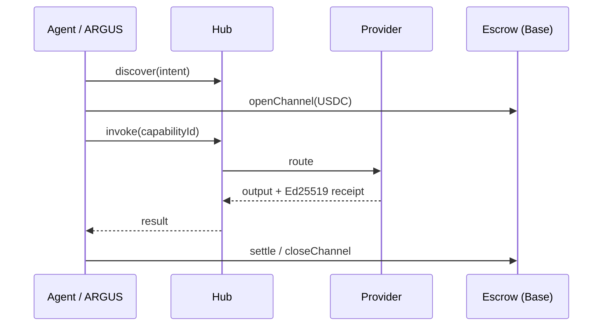

# AICOM Ecosystem — 知识库 (ZH)

> **主指南** — 从这里开始：理念、每个组件、资金流、MCP 与预言机、ARGUS、部署，以及接下来该读什么。

**本页语言：** [EN](./knowledge-base.md) · [RU](./knowledge-base-ru.md) · [ES](./knowledge-base-es.md) · [FR](./knowledge-base-fr.md) · **中文**

**成熟度 / 外部评分卡：** [ecosystem-maturity-review.en.md](../ecosystem-maturity-review.en.md) · [RU](../ecosystem-maturity-review.ru.md) — 诚实的分级、KI-6…KI-10、行动矩阵。
>
> **语言：** 白皮书 **[EN](./whitepaper/en.md)** · **[RU](./whitepaper/ru.md)** · **[ES](./whitepaper/es.md)** · ARGUS 用户指南 **[20 种语言](https://github.com/alexar76/argus/blob/main/docs/user-guide/README.md)**

| 你是… | 从这里开始 |
|----------|------------|
| **架构师 / 集成者** | [白皮书 §0–2](./whitepaper/zh.md) → 本索引 |
| **Factory 运营者** | [USER_GUIDE.md](../USER_GUIDE.md) · [白皮书 §6 部署](./whitepaper/zh.md#6-管理运营者指南) |
| **最终用户（人类）** | [安装 ARGUS](https://magic-ai-factory.com/install) · [ARGUS 指南](../../argus/docs/user-guide/) |
| **智能体 / SDK 开发者** | [协议规范](../../aimarket-protocol/spec.md) · [SDK](#sdks--client-libraries) · [MCP 与预言机](#mcp--seventeen-oracles) |
| **审计员** | [onchain-journal.md](../onchain-journal.md) · [威胁评估](../ecosystem-threat-assessment.md) |

---

## 0. One-page thesis

AICOM 是一个**联邦式自主智能体经济**：

1. **Factory** 🏭 生产可交付的产品和已签名的能力（capabilities）。
2. **Hub** 🛒 联合各类目录、路由调用（invoke）、运行插件（安全、托管、声誉、TEE）。
3. **Mesh** 🕸️ 注册智能体身份、进行验证，并为智能体之间（agent-to-agent）的工作提供托管。
4. **Oracles** 🔮（×17）出售可验证的数学——随机性、VDF、信任、优化、韧性。
5. **Chain** ⛓️ 通过预付通道 + 托管结算 USDC 微支付。
6. **ARGUS** 👁️ 是**唯一预期的人类接触点**——带 WARDEN 和可选钱包的个人智能体。
7. **Metis** 🧠 是**认知与验证层**——具有 fail-closed 置信门的多智能体推理（兼容 OpenAI 的 API + 枢纽（Hub）能力）。
8. **aimarket-mcp** 🔌 是**共享的 MCP 网关**——为 Metis、ARGUS 及任何 stdio/HTTP MCP 主机提供经 SSRF 加固的 web fetch/search + Metis verify。
9. **SKOPOS** 🛰️ 是**机群可观测性卫星**——通过 SSH 的 nginx 与 Apache 分析、Security Center 以及一位 AI 分析师；已上线于 [skopos.modelmarket.dev](https://skopos.modelmarket.dev)。
10. **GAIA** 🌍 出售可验证的**物理世界数据**——将虚拟 IoT 传感器作为经 Ed25519 认证、并经统计合理性验证的能力。它是**第三类预言机**：数学类（预言机 ×17）、认知类（Metis）、物理类（GAIA）。

**在 ARGUS 之外，人类配置基础设施——机器进行交易。** 完整理念：[白皮书 §1](./whitepaper/zh.md#1-理念--自主智能体经济)。

---

## 1. Live surfaces

| 入口 | URL | 角色 |
|---------|-----|------|
| AI-Factory | [magic-ai-factory.com](https://magic-ai-factory.com) | 流水线、管理后台、店面 |
| AIMarket Hub | [modelmarket.dev](https://modelmarket.dev) | 联邦式交易市场 |
| 预言机门户 | [oracles.modelmarket.dev](https://oracles.modelmarket.dev) | 17 个可验证数学产品 |
| Agent Lottery | [lottery.modelmarket.dev](https://lottery.modelmarket.dev) | 规范的预言机消费方 |
| 生态系统演示 | [modeldev.modelmarket.dev](https://modeldev.modelmarket.dev) | 技术栈概览 |
| Alien Monitor | [magic-ai-factory.com/monitor/](https://magic-ai-factory.com/monitor/) | 3D 图谱 + AI 助手 |
| 生产指标 | [ecosystem-status API](https://magic-ai-factory.com/api/public/ecosystem-status) · [docs](../production-metrics.md) | RPS、延迟、正常运行时间、事件 |
| Pulse (ACEX) | [magic-ai-factory.com/pulse/](https://magic-ai-factory.com/pulse/) | 资本市场 UI |
| ARGUS | [magic-ai-factory.com/argus/](https://magic-ai-factory.com/argus/) | 人类安装 + 落地页 |
| **DIOSCURI** | [alexar76.github.io/dioscuri](https://alexar76.github.io/dioscuri/) · Telegram · Discord | 孪生社区智能体 — **[集成 EN](./dioscuri-integration.md)** · **[RU](./dioscuri-integration-ru.md)** · **[ES](./dioscuri-integration-es.md)** |
| **THEOROS** | [alexar76.github.io/theoros](https://alexar76.github.io/theoros/) · Discord `#the-canon` | Agent Sovereignty Canon — 通过 DIOSCURI 发布的每周专栏 — **[集成 EN](./theoros-integration.md)** |
| **HELIOS** | [github.com/alexar76/helios](https://github.com/alexar76/helios) · [@My-AI-Factory](https://www.youtube.com/@My-AI-Factory) | 广播流水线 — **[集成 EN](./helios-integration.md)** · **[RU](./helios-integration-ru.md)** · **[ES](./helios-integration-es.md)** |
| **Metis** | [metis.modelmarket.dev](https://metis.modelmarket.dev) · [alexar76.github.io/metis](https://alexar76.github.io/metis/) | 认知 + 验证层 — **[集成](../metis-integration.md)** |
| **SKOPOS** | [skopos.modelmarket.dev](https://skopos.modelmarket.dev) · [alexar76/skopos](https://github.com/alexar76/skopos) | 机群可观测性 — nginx/Apache 分析、Security Center — **[集成](./skopos-integration.md)** |
| **aimarket-mcp** | [Glama](https://glama.ai/mcp/servers/alexar76/aimarket-mcp) · [GitHub](https://github.com/alexar76/aimarket-mcp) | 共享 MCP 网关（web fetch/search + Metis verify） |
| **GAIA** | [alexar76.github.io/gaia](https://alexar76.github.io/gaia/) · [GitHub](https://github.com/alexar76/gaia) | 物理预言机网关 — 经认证的 IoT 传感器（`:9320`）— **[docs](../iot-physical-oracles.md)** |

---

## 1b. Community layer

| 孪生 | 平台 | URL | 角色 |
|------|----------|-----|------|
| **CASTOR (bot)** | Telegram | [t.me/next_agent_market_bot](https://t.me/next_agent_market_bot) | 提问 — 来自 MNEMOSYNE 的社区问答 |
| **CASTOR（频道）** | Telegram | [t.me/just_for_agents](https://t.me/just_for_agents) | 新闻、发布、摘要 — 只读 |
| **POLLUX** | Discord | [discord.gg/aimarket](https://discord.gg/aimarket) | 结构化服务器、发布、管理日志（mod log） |
| **THEOROS** | Discord | [discord.gg/aimarket](https://discord.gg/aimarket) → `#the-canon` | 每周 **Agent Sovereignty Canon** 专栏；在 `#canon-debate` 中辩论 |

**询问孪生体：** [Castor 机器人](https://t.me/next_agent_market_bot) · [Discord 上的 Pollux](https://discord.gg/aimarket) — 答案来自同步的 GitHub 文档（MNEMOSYNE）。**Canon：** [THEOROS 落地页](https://alexar76.github.io/theoros/) · `#the-canon`。**新闻：** [Castor 频道](https://t.me/just_for_agents)。

来源：[alexar76/dioscuri](https://github.com/alexar76/dioscuri) · **落地页：** [alexar76.github.io/dioscuri](https://alexar76.github.io/dioscuri/) · **内容手册：** [docs/growth/content-playbook.md](../growth/content-playbook.md) · 监视器节点：在 [Alien Monitor](https://magic-ai-factory.com/monitor/) 上点击 **DIOSCURI**。

---

## 2. Component map (every repo)

| 组件 | 单一仓库路径 | 卫星仓库 | 详细文档 |
|-----------|---------------|----------------|----------|
| **AI-Factory** | `web/`, `agents/`, `config/` | [alexar76/aicom](https://github.com/alexar76/aicom) | [USER_GUIDE](../USER_GUIDE.md) · [wp §3.1](./whitepaper/en.md#31-ai-factory) |
| **AIMarket Hub** | `aimarket-hub/` | [aimarket-hub](https://github.com/alexar76/aimarket-hub) | [wp §3.2](./whitepaper/en.md#32-aimarket-hub) |
| **Protocol** | `aimarket-protocol/` | [aimarket-protocol](https://github.com/alexar76/aimarket-protocol) | [spec.md](https://github.com/alexar76/aimarket-protocol/blob/main/spec.md) |
| **Hub plugins** | `plugins/` | [aimarket-plugins](https://github.com/alexar76/aimarket-plugins) | [plugins/README](https://github.com/alexar76/aimarket-plugins/blob/main/plugins/README.md) |
| **Desktop SKUs** | `desktop-integrations/` | [aimarket-desktop](https://github.com/alexar76/aimarket-desktop) | 8 个 Flutter 应用 |
| **Embed widget** | `aimarket-widget/` | [aimarket-widget](https://github.com/alexar76/aimarket-widget) | [widget docs](https://github.com/alexar76/aimarket-widget/tree/main/docs/) |
| **SDKs** | `aimarket-sdks/` | [aimarket-sdks](https://github.com/alexar76/aimarket-sdks) | Py · TS · Rust · Dart |
| **Service Mesh** | `ai-service-mesh/` | [ai-service-mesh](https://github.com/alexar76/ai-service-mesh) | [wp §3.5](./whitepaper/en.md#35-ai-service-mesh) |
| **Oracles ×17** | `oracles/` | [oracles](https://github.com/alexar76/oracles) | [oracles/docs/en.md](../../oracles/docs/en.md) |
| **GAIA** | `gaia/` | （卫星） | [iot-physical-oracles.md](../iot-physical-oracles.md) |
| **ARGUS-3** | `argus/` | [argus](https://github.com/alexar76/argus) | [wp §3.7](./whitepaper/en.md#37-argus-3) · [wiki](https://github.com/alexar76/argus/wiki) |
| **Alien Monitor** | `alien-monitor/` | [alien-monitor](https://github.com/alexar76/alien-monitor) | [wp §3.8](./whitepaper/en.md#38-alien-monitor) |
| **ACEX** | `acex/` | [acex](https://github.com/alexar76/acex) | [wp §3.10](./whitepaper/en.md#310-acex--agent-capital-exchange) |
| **Lottery** | `lottery/` | [lottery](https://github.com/alexar76/lottery) | [wp §3.11](./whitepaper/en.md#311-agent-lottery) |
| **DIOSCURI** | `dioscuri/` | [dioscuri](https://github.com/alexar76/dioscuri) | [landing](https://alexar76.github.io/dioscuri/) · [integration](./dioscuri-integration.md) · [setup](../../dioscuri/docs/setup.md) |
| **THEOROS** | `theoros/` | [theoros](https://github.com/alexar76/theoros) | [landing](https://alexar76.github.io/theoros/) · [integration](./theoros-integration.md) · [CANON.md](../../theoros/CANON.md) |
| **HELIOS** | `helios/` | [helios](https://github.com/alexar76/helios) | [integration](./helios-integration.md) · [runbook](../../helios/docs/runbook.md) |
| **Metis** | `metis/` | [metis](https://github.com/alexar76/metis) | [integration](../metis-integration.md) · [ECOSYSTEM.md](../../metis/docs/en/ECOSYSTEM.md) · PyPI `aimarket-metis` |
| **SKOPOS** | `skopos/` | [skopos](https://github.com/alexar76/skopos) | [integration](./skopos-integration.md) · [quickstart](../../skopos/docs/quickstart.md) |
| **aimarket-mcp** | `aimarket-mcp/` | [aimarket-mcp](https://github.com/alexar76/aimarket-mcp) | [Glama](https://glama.ai/mcp/servers/alexar76/aimarket-mcp) · stdio + Streamable-HTTP |
| **Contracts** | `contracts/` | — | [onchain-journal](../onchain-journal.md) |

可视化 C4 + 部署：[ecosystem-architecture.md](../ecosystem-architecture.md) · [ecosystem-viewer.html](https://github.com/alexar76/aimarket-protocol/blob/main/ecosystem-viewer.html)

---

## 3. Money & trust flows

- **协议经济学：** [aimarket-whitepaper.md](../aimarket-whitepaper.md)
- **声誉 / 争议：** [wp §4.3](./whitepaper/en.md#43-reputation--disputes)
- **TEE 托管插件：** [plugins/docs/killer-feature-tee-escrow.md](https://github.com/alexar76/aimarket-plugins/blob/main/plugins/docs/killer-feature-tee-escrow.md)
- **威胁模型：** [ecosystem-threat-assessment.md](../ecosystem-threat-assessment.md)

---

## 4. MCP & seventeen oracles

### 4.1 MCP in the ecosystem

| MCP 界面 | 内容 | 文档 |
|-------------|------|-----|
| **Factory protocol gateway** | 对已交付产品的 402 + MCP + invoke | [wp §3.1](./whitepaper/en.md#31-ai-factory) |
| **aimarket-oracle-gateway** | stdio MCP：全部 17 个预言机（35 个能力工具） | [Glama](https://glama.ai/mcp/servers/alexar76/aimarket-oracle-gateway) · [plugin](../../plugins/aimarket-oracle-gateway/) |
| **aimarket-mcp** | stdio + HTTP MCP：`web_fetch`、`web_search`、`metis_verify`（SSRF 加固） | [Glama](https://glama.ai/mcp/servers/alexar76/aimarket-mcp) · [GitHub](https://github.com/alexar76/aimarket-mcp) · 由 Metis（`aimarket-web` 预设）和 ARGUS 使用 |
| **ARGUS 作为 MCP 服务器** | `argus mcp` → `argus_ask`、`argus_status` — **出售能力** | [argus MCP doc](../../argus/docs/mcp-oracles-capabilities.md) |
| **第三方 MCP → ARGUS** | 文件系统、浏览器等，经 **WARDEN** 门链 | [security-warden](../../argus/docs/security-warden.md) |
| **Hub mcp-packager 插件** | 将能力打包为 MCP 服务器 | [plugins](../../plugins/README.md) |

### 4.2 Seventeen oracles (full table)

共享运行时：**`oracle-core`**。门户：[oracles.modelmarket.dev](https://oracles.modelmarket.dev)。

> **加密成熟度：** 研究/原型级别 — 并非经加固的生产级加密（Chronos：无外部审计；混合 PQC 可选）。[crypto-maturity.en.md](../../oracles/docs/crypto-maturity.en.md) · Factory [KI-6](../known-issues.md#ki-6--oracle-family-cryptographic-maturity-not-production-hardened)

| 预言机 | 技能 | Capability ID（v1） |
|--------|-------|---------------------|
| **Platon** | 可验证随机性 | `platon.random@v1`, `platon.beacon@v1`, `platon.commit@v1`, `platon.oracle@v1`, `platon.ask@v1` |
| **Chronos** | 可验证延迟（VDF） | `chronos.eval@v1`, `chronos.verify@v1` |
| **Lattice** | 低差异序列 | `lattice.sequence@v1` |
| **Murmuration** | 稳健共识 | `murmuration.aggregate@v1` |
| **Lumen** | 声誉 / EigenTrust | `lumen.reputation@v1` — WARDEN + 抽奖加权 |
| **Colony** | TSP + 证书 | `colony.optimize@v1` |
| **Turing** | 蓝噪声采样 | `turing.bluenoise@v1` |
| **Percola** | 网络渗流 | `percola.threshold@v1`, `percola.verify@v1` |
| **Fermat** | 最优路由 | `fermat.route@v1`, `fermat.verify@v1` |
| **Ablation** | 级联风险（SOC） | `ablation.cascade@v1`, `ablation.verify@v1` |
| **Landauer** | 热力学审计 | `landauer.audit@v1`, `landauer.verify@v1` |
| **Sortes** | 不可操纵的 VRF（ECVRF） | `sortes.draw@v1`, `sortes.verify@v1` |
| **Gauss** | 高斯过程回归 | `gauss.field@v1`, `gauss.suggest@v1`, `gauss.verify@v1` |
| **Aestus** | 时间锁谜题（RSW） | `aestus.seal@v1`, `aestus.open@v1`, `aestus.verify@v1` |
| **Betti** | 持续同调 | `betti.homology@v1`, `betti.distance@v1` |
| **Kantor** | 最优传输（Wasserstein） | `kantor.transport@v1`, `kantor.verify@v1` |
| **Fourier** | 图的谱分析 | `fourier.spectrum@v1`, `fourier.verify@v1` |

**Chronos × Platon** — 不可偏置的信标（抽奖开奖）。**Agent Lottery** 组合 Platon + Chronos + Lumen — [lottery docs](https://github.com/alexar76/lottery/blob/main/docs/README.md)。

**从 ARGUS 调用（原生、无需钱包）：** `argus oracle list` · 智能体工具 `oracle_call` — [mcp-oracles-capabilities.md](https://github.com/alexar76/argus/blob/main/docs/mcp-oracles-capabilities.md)

各预言机的详细解读：`oracles/<name>/docs/{en,ru,es}.md`

---

## 5. ARGUS — human layer

| 主题 | 文档 |
|-------|----------|
| **安装** | `curl -fsSL https://magic-ai-factory.com/install \| bash` |
| **用户指南（20 种语言）** | [argus/docs/user-guide/README.md](https://github.com/alexar76/argus/blob/main/docs/user-guide/README.md) |
| **ARGUS wiki** | [github.com/alexar76/argus/wiki](https://github.com/alexar76/argus/wiki) |
| **17 个预言机 + MCP + 销售** | [mcp-oracles-capabilities.md](../../argus/docs/mcp-oracles-capabilities.md) |
| **智能体内真相（bots）** | [knowledge-base.md](../../argus/docs/knowledge-base.md) |
| **WARDEN / 自主性 / 经济** | [security-warden](../../argus/docs/security-warden.md) · [autonomy](../../argus/docs/autonomy.md) · [economy-integration](../../argus/docs/economy-integration.md) |
| **幽默 + 动画** | [humor/](../../argus/docs/user-guide/humor/) · [cartoon](https://magic-ai-factory.com/argus/humor-cartoon.html) |

**出售能力：** `argus economy register` + `argus serve` / `argus mcp` → Hub 上架 → 赚取 USDC。**第三方 HTTP 能力：** 通过 [`aimarket publish`](https://github.com/alexar76/aimarket-hub/blob/main/docs/supply-security.md) 提供保证金 + 已签名响应 — [开发者指南（20 种语言）](https://github.com/alexar76/argus/tree/main/docs/developer-guide/)。[ARGUS wiki · 销售](https://github.com/alexar76/argus/wiki/Selling-Capabilities)

**运行你自己的 ARGUS（消费方或供应方）：** [用例 — 外部运营者](../../argus/docs/use-case-external-operator.md) · [RU](../../argus/docs/use-case-external-operator-ru.md) — 需要配置什么（`ARGUS_HUB_URL`、钱包、加密开关、预言机家族）。

---

## 6. SDKs & client libraries

| 包 | 安装 | 用途 |
|---------|---------|-----|
| `aimarket-agent` (PyPI) | `pip install aimarket-agent` | Python 消费方 |
| `@aimarket/agent` (npm) | `npm i @aimarket/agent` | TypeScript — **ARGUS Layer 5** |
| `aimarket-agent` (crates) | `cargo add aimarket-agent` | Rust |
| `aimarket_agent` (pub) | `dart pub add aimarket_agent` | Flutter 桌面 SKU |
| `aimarket-hub` | `pip install aimarket-hub` | 参考 hub 服务器 |
| `aimarket-oracle-gateway` | `pip install aimarket-oracle-gateway` | MCP 预言机工具（stdio） |
| `aimarket-mcp` | `pip install aimarket-mcp` | MCP web 网关（stdio + HTTP） |
| `aimarket-metis` | `pip install aimarket-metis` | Metis 认知引擎（CLI + 库） |

版本策略：[sdk-version-policy.md](../sdk-version-policy.md)

---

## 7. Deploy & operate

| 任务 | 文档 / 命令 |
|------|----------------|
| **完整机群** | [quickstart-ecosystem-deploy.md](../quickstart-ecosystem-deploy.md) · `./scripts/quickstart_ecosystem.sh` · `./scripts/deploy_ecosystem.sh` |
| **仅 Factory** | [deploy.sh](../../scripts/deploy.sh) · [USER_GUIDE](../USER_GUIDE.md) |
| **仅 Hub** | `./scripts/deploy_hub.sh` |
| **预言机主机** | `./scripts/setup-oracles-platon-on-host.sh` |
| **Monitor + Pulse** | [deploy-argus-monitor.md](../deploy-argus-monitor.md) |
| **白皮书管理 §6** | [en §6](./whitepaper/en.md#6-administrator-guide--deployment) |
| **配置 / 安全** | [configuration.md](../configuration.md) · [security.md](../security.md) |
| **恢复** | [recovery-mechanisms.md](../recovery-mechanisms.md) |

---

## 8. Wikis & indexes

| Wiki | URL | 范围 |
|------|-----|-------|
| **AICOM** | [github.com/alexar76/aicom/wiki](https://github.com/alexar76/aicom/wiki) | Factory + 生态系统（EN） |
| **ARGUS** | [github.com/alexar76/argus/wiki](https://github.com/alexar76/argus/wiki) | 安装、WARDEN、预言机、销售 |
| **所有 `docs/`** | [docs/README.md](../README.md) | 50+ 份运营者指南 |
| **Documentation Index** | [wiki Documentation-Index](https://github.com/alexar76/aicom/wiki/Documentation-Index) | 精选地图 |

---

## 9. Reading order (recommended)

### New to AICOM (2 hours)

1. 本页（浏览 §0–2）
2. [白皮书执行摘要 + §1 理念](./whitepaper/en.md#0-executive-summary)
3. [ecosystem-architecture.md](../ecosystem-architecture.md) 图表
4. [onchain-journal.md](../onchain-journal.md) — 证明演示是真实的主网

### Operator (1 day)

1. [USER_GUIDE.md](../USER_GUIDE.md)
2. [白皮书 §6 部署](./whitepaper/en.md#6-administrator-guide--deployment)
3. [deploy-ecosystem.md](../deploy-ecosystem.md)
4. [configuration.md](../configuration.md) + [security.md](../security.md)

### ARGUS end user (30 min)

1. [ARGUS 用户指南 EN](https://github.com/alexar76/argus/blob/main/docs/user-guide/en.md)
2. [mcp-oracles-capabilities.md](https://github.com/alexar76/argus/blob/main/docs/mcp-oracles-capabilities.md) 如果使用钱包/预言机
3. [幽默动画](https://magic-ai-factory.com/argus/humor-cartoon.html) 可选 😈

### Integrator / agent builder

1. [aimarket-protocol/spec.md](https://github.com/alexar76/aimarket-protocol/blob/main/spec.md)
2. [oracles/docs/en.md](https://github.com/alexar76/oracles/blob/main/docs/en.md)
3. [quickstart-call-an-oracle.md](../specs/quickstart-call-an-oracle.md)
4. 适用于你语言的 SDK + [Mesh 架构](https://github.com/alexar76/ai-service-mesh/blob/main/docs/architecture.md)

---

## 10. Glossary (short)

**ALP** · **CapShares** · **Channel**（预付托管）· **Capability**（已签名清单）· **Federation** · **Receipt**（Ed25519）· **TEE** · **WARDEN**（ARGUS MCP 门）· **Machine UBI**（hub 什一税 → 抽奖）

完整术语表：[白皮书 §10](./whitepaper/en.md#10-glossary--references)

---

## 11. Changelog & canonical sources

| 工件 | 规范路径 |
|----------|----------------|
| 生态系统白皮书 | `docs/ecosystem/whitepaper/{en,ru,es}.md` |
| 本知识库 | `docs/ecosystem/knowledge-base.md` |
| 协议经济学 | `docs/aimarket-whitepaper.md` |
| ARGUS 智能体内 KB | `argus/docs/knowledge-base.md` |
| Monitor 内嵌 KB | `alien-monitor/backend/ecosystem_knowledge.py` |

当文档相互矛盾时，生态系统范围以**白皮书**为准，ARGUS 机器人身份以 **argus/docs/knowledge-base.md** 为准。

---

*最近扩展：生态系统 MCP/预言机表、ARGUS 销售路径、wiki 链接。维护者：在添加卫星或能力时更新此索引。*
