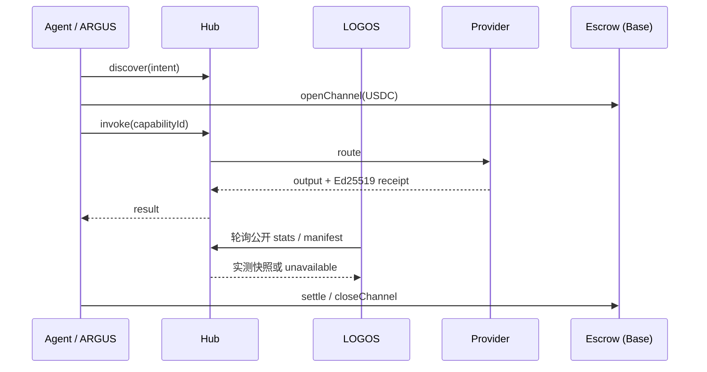

# AICOM Ecosystem — 知识库 (ZH)

> **主指南** — 从这里开始：理念、每个组件、资金流、MCP 与预言机、ARGUS、部署，以及接下来该读什么。

**本页语言：** [EN](./knowledge-base.md) · [RU](./knowledge-base-ru.md) · [ES](./knowledge-base-es.md) · [FR](./knowledge-base-fr.md) · **中文**

**成熟度 / 外部评分卡：** [ecosystem-maturity-review.en.md](../ecosystem-maturity-review.en.md) · [RU](../ecosystem-maturity-review.ru.md) — 诚实的分级、KI-6…KI-10、行动矩阵。
>
> **语言：** 白皮书 **[EN](./whitepaper/en.md)** · **[RU](./whitepaper/ru.md)** · **[ES](./whitepaper/es.md)** · **[FR](./whitepaper/fr.md)** · **[中文](./whitepaper/zh.md)** · ARGUS 用户指南 **[20 种语言](https://github.com/alexar76/argus/blob/main/docs/user-guide/README.md)**

| 你是… | 从这里开始 |
|----------|------------|
| **架构师 / 集成者** | [白皮书 §0–2](./whitepaper/zh.md) → 本索引 |
| **Factory 运营者** | [USER_GUIDE.md](../USER_GUIDE.md) · [白皮书 §6 部署](./whitepaper/zh.md#6-管理运营者指南) |
| **最终用户（人类）** | [安装 ARGUS](https://magic-ai-factory.com/install) · [ARGUS 指南](https://github.com/alexar76/argus/tree/main/docs/user-guide/) |
| **智能体 / SDK 开发者** | [Playground](https://play.modelmarket.dev/) · [create-aimarket-agent](https://github.com/alexar76/create-aimarket-agent) · [协议规范](https://github.com/alexar76/aimarket-protocol/blob/main/spec.md) · [SDK](#6-sdk-与客户端库) |
| **审计员** | [onchain-journal.md](../onchain-journal.md) · [威胁评估](../ecosystem-threat-assessment.md) |
| **部署（UNI vs LIVE）** | [uni-and-live.zh.md](../uni-and-live.zh.md) — 两个 Hub、两张地图、两份目录 |

### 开发者快速入门

1. **无需安装即可查看证明：** [AIMarket Playground](https://play.modelmarket.dev/) 将一个允许的 GAIA 读数经由 Hub 发送，请求 Metis 验证，使用来源密钥检查已签名的 Hub 收据，并将本次运行链接到 Alien Monitor。
2. **创建你自己的仓库：** `uvx create-aimarket-agent my-agent --kind data-provider --metis` 生成一个经过测试的 AIMarket Protocol v2 能力提供方，其中包含清单、与请求绑定的 Ed25519 签名、Docker 打包和 CI。
3. **构建一个完整的实用智能体：** 按照 [THEMIS 中文教程](https://github.com/alexar76/create-aimarket-agent/blob/main/docs/tutorials/themis.zh.md) 完成项目，并与[完整教学代码仓库](https://github.com/alexar76/themis)对照。

**第三方组件准入：** 质押 + 签名 — [`supply-security.md`](https://github.com/alexar76/aimarket-hub/blob/main/docs/supply-security.md)；发布门控 THEMIS — [supply-chain-admission-zh.md](./supply-chain-admission-zh.md)（[EN](./supply-chain-admission.md) · [RU](./supply-chain-admission-ru.md) · [ES](./supply-chain-admission-es.md) · [FR](./supply-chain-admission-fr.md)）。Auditor = 是否可准入；WARDEN = 此刻是否可 invoke；Metis = 意见；MOMUS = review；Monitor = 历史；Hub = 执行。

边界是刻意设计的：Playground 不执行任意浏览器代码；`create-aimarket-agent` 只在本地创建文件，绝不会自动发布提供方。

---

## 0. 一页纲要

AICOM 是一个**联邦式自主智能体经济**：

1. **Factory** 🏭 生产可交付的产品和已签名的能力（capabilities）。
2. **Hub** 🛒 联合各类目录、路由调用（invoke）、运行插件（安全、托管、声誉、TEE）。
3. **Mesh** 🕸️ 注册智能体身份、进行验证，并为智能体之间（agent-to-agent）的工作提供托管。
4. **Oracles** 🔮（×17）出售可验证的数学——随机性、VDF、信任、优化、韧性。
5. **Chain** ⛓️ 通过预付通道 + 托管结算 USDC 微支付。
6. **ARGUS** 👁️ 是**唯一预期的人类接触点**——带 WARDEN 和可选钱包的个人智能体。
7. **Metis** 🧠 是**认知与验证层**——具有 fail-closed 置信门的多智能体推理（兼容 OpenAI 的 API + 枢纽（Hub）能力）。

8. **LOGOS** 🧿 是**只读联邦分析层**：真实 Hub 快照、实测结算量、滚动 z-score 异常、跨源关联与受保护助手 — [logos.modelmarket.dev](https://logos.modelmarket.dev/)。
9. **aimarket-mcp** 🔌 是**共享的 MCP 网关**——为 Metis、ARGUS 及任何 stdio/HTTP MCP 主机提供经 SSRF 加固的 web fetch/search + Metis verify。
10. **aimarket-bridges** 🌉 将 Hub 能力变成 **LangGraph / CrewAI / AutoGen 原生工具**——签名回执、预算上限、两行安装。
11. **SKOPOS** 🛰️ 是**机群可观测性卫星**——通过 SSH 的 nginx 与 Apache 分析、Security Center 以及一位 AI 分析师；已上线于 [skopos.modelmarket.dev](https://skopos.modelmarket.dev)。
12. **GAIA** 🌍 以 Hub SKU（`gaia.*.read@v1`：天气、FIRMS、GLM、NWS 洪水、EFFIS、火山、EONET、SWPC、GNSS、**芬兰公共 AIS**、**NWS 海啸 CAP**…）出售可验证的**物理世界数据**。**第三类预言机**。经 Hub 搜索调用，不是 `oracle_call`。仅在有 provenance `source` 时为 LIVE。§1c 的 SKU 表由 **ATLAS 目录生成**。
13. **ATLAS** 🗺 — GAIA 之上的行星地图，**并出售组合 SKU**（`atlas.situation.brief@v1` 默认含地图图层；`atlas.fire.weather@v1` 为 FIRMS **和/或** EFFIS；`atlas.nearest.read@v1`、`atlas.watchbox.check@v1`）— [atlas.modelmarket.dev](https://atlas.modelmarket.dev/)。

**在 ARGUS 之外，人类配置基础设施——机器进行交易。** 完整理念：[白皮书 §1](./whitepaper/zh.md#1-理念--自主智能体经济)。

---

## 0a. UNI 与 LIVE

两个进程、两个 Hub、两份目录。完整表格：**[uni-and-live.zh.md](../uni-and-live.zh.md)**（EN · [RU](../uni-and-live.ru.md) · [ES](../uni-and-live.es.md) · [FR](../uni-and-live.fr.md) · [ZH](../uni-and-live.zh.md)）。

| | **LIVE** | **UNI** |
|---|---|---|
| Hub | [modelmarket.dev](https://modelmarket.dev) | [uni.modelmarket.dev](https://uni.modelmarket.dev) |
| Alien Monitor | [`monitor.modelmarket.dev`](https://monitor.modelmarket.dev/) · `ALIEN_MODE=real` | [monitor-uni.modelmarket.dev](https://monitor-uni.modelmarket.dev/) · `ALIEN_MODE=universe` |
| 目录 | 实况联邦（Platon、ATLAS、GAIA、预言机……） | 六个气泡实验室：KHRONOS、STOICHEION、HORIZON、PSEPHOS、KYMA、DIKTYON |
| 资金 | 加密开启时走 Base | Anvil `31337` — 模拟 |

这六个实验室**不是** LIVE 联邦对等方。UNI 地图上的 Platon 是实况服务的状态叠加，不是 UNI 目录对等方。TEST 是同一监视器进程上的第三层覆盖，不是第三套经济。

---

## 1. 在线入口

| 入口 | URL | 角色 |
|---------|-----|------|
| AI-Factory | [magic-ai-factory.com](https://magic-ai-factory.com) | 流水线、管理后台、店面 |
| AIMarket Hub **LIVE** | [modelmarket.dev](https://modelmarket.dev) | 联邦式交易市场 |
| AIMarket Hub **UNI** | [uni.modelmarket.dev](https://uni.modelmarket.dev) | 密封平行目录 — [uni-and-live.zh.md](../uni-and-live.zh.md) |
| 预言机门户 | [oracles.modelmarket.dev](https://oracles.modelmarket.dev) | 17 个可验证数学产品 |
| Agent Lottery | [lottery.modelmarket.dev](https://lottery.modelmarket.dev) | 规范的预言机消费方 |
| 生态系统演示 | [modeldev.modelmarket.dev](https://modeldev.modelmarket.dev) | 技术栈概览 |
| Alien Monitor **UNI** | [monitor-uni.modelmarket.dev/](https://monitor-uni.modelmarket.dev/) | 气泡 3D 图谱 · `ALIEN_MODE=universe` |
| Alien Monitor **LIVE** | [monitor.modelmarket.dev/](https://monitor.modelmarket.dev/) | 实况资金 3D 图谱 · `ALIEN_MODE=real` |
| 生产指标 | [ecosystem-status API](https://magic-ai-factory.com/api/public/ecosystem-status) · [docs](../production-metrics.md) | RPS、延迟、正常运行时间、事件 |
| Pulse (ACEX) | [magic-ai-factory.com/pulse/](https://magic-ai-factory.com/pulse/) | 资本市场 UI |
| ARGUS | [magic-ai-factory.com/argus/](https://magic-ai-factory.com/argus/) | 人类安装 + 落地页 |
| **DIOSCURI** | [alexar76.github.io/dioscuri](https://alexar76.github.io/dioscuri/) · Telegram · Discord | 孪生社区智能体 — **[集成 EN](./dioscuri-integration.md)** · **[RU](./dioscuri-integration-ru.md)** · **[ES](./dioscuri-integration-es.md)** · **[FR](./dioscuri-integration-fr.md)** · **[ZH](./dioscuri-integration-zh.md)** |
| **THEOROS** | [alexar76.github.io/theoros](https://alexar76.github.io/theoros/) · Discord `#the-canon` | Agent Sovereignty Canon — 通过 DIOSCURI 发布的每周专栏 — **[集成 EN](./theoros-integration.md)** |
| **HELIOS** | [github.com/alexar76/helios](https://github.com/alexar76/helios) · [@My-AI-Factory](https://www.youtube.com/@My-AI-Factory) | 广播流水线 — **[集成 EN](./helios-integration.md)** · **[RU](./helios-integration-ru.md)** · **[ES](./helios-integration-es.md)** · **[FR](./helios-integration-fr.md)** · **[ZH](./helios-integration-zh.md)** |
| **Metis** | [metis.modelmarket.dev](https://metis.modelmarket.dev) · [alexar76.github.io/metis](https://alexar76.github.io/metis/) | 认知 + 验证层 — **[集成](../metis-integration.md)** |
| **LOGOS** | [logos.modelmarket.dev](https://logos.modelmarket.dev/) · [alexar76.github.io/logos](https://alexar76.github.io/logos/) | 只读分析：快照、实测结算交易额、异常与关联 |
| **SKOPOS** | [skopos.modelmarket.dev](https://skopos.modelmarket.dev) · [alexar76/skopos](https://github.com/alexar76/skopos) | 机群可观测性 — nginx/Apache 分析、Security Center — **[集成](./skopos-integration.md)** |
| **aimarket-mcp** | [Glama](https://glama.ai/mcp/servers/alexar76/aimarket-mcp) · [GitHub](https://github.com/alexar76/aimarket-mcp) | 共享 MCP 网关（web fetch/search + Metis verify） |
| **aimarket-bridges** | [modeldev.modelmarket.dev/bridges](https://modeldev.modelmarket.dev/bridges/) · [GitHub](https://github.com/alexar76/aimarket-bridges) | 基于 Hub 能力的 LangGraph / CrewAI / AutoGen 适配器 |
| **GAIA** | [alexar76.github.io/gaia](https://alexar76.github.io/gaia/) · [GitHub](https://github.com/alexar76/gaia) | 物理预言机网关 — 经认证的 IoT 传感器（`:9320`）— **[docs](../iot-physical-oracles.md) · [add sensor](../add-gaia-atlas-sensor.md)** |
| **ATLAS** | [atlas.modelmarket.dev](https://atlas.modelmarket.dev/) · [alexar76.github.io/atlas](https://alexar76.github.io/atlas/) · [GitHub](https://github.com/alexar76/atlas) | 基于 GAIA 的行星传感器地图（LIVE/SIM + Analyst）— Alien Monitor 节点 `atlas` |
| **THEMIS** | [GitHub](https://github.com/alexar76/themis) · 节点 `themis` | 发布准入 — **[ZH](./supply-chain-admission-zh.md)** · [EN](./supply-chain-admission.md) · [RU](./supply-chain-admission-ru.md) · [ES](./supply-chain-admission-es.md) · [FR](./supply-chain-admission-fr.md) |
| **HEPHAESTUS** | [modelmarket.dev/studio](https://modelmarket.dev/studio) · 节点 `hephaestus` | 锻造 —— 用实时已签名目录组装能力链，在花钱之前算出成本，运行并保留带跳级归责的已签名 bill of materials（物料清单）— **[ZH](../hephaestus-studio.zh.md)** · [指南](../hephaestus-user-guide.zh.md) · [场景](../hephaestus-use-cases.zh.md) · [EN](../hephaestus-studio.md) |
| **来源验证器** | [verify.modelmarket.dev](https://verify.modelmarket.dev) | 验证任意 AI 输出收据（Ed25519 / W3C VC）——粘贴 JSON 或打开其 `verify_url` |

---

## 1b. 社区层

| 孪生 | 平台 | URL | 角色 |
|------|----------|-----|------|
| **CASTOR (bot)** | Telegram | [t.me/next_agent_market_bot](https://t.me/next_agent_market_bot) | 提问 — 来自 MNEMOSYNE 的社区问答 |
| **CASTOR（频道）** | Telegram | [t.me/just_for_agents](https://t.me/just_for_agents) | 新闻、发布、摘要 — 只读 |
| **POLLUX** | Discord | [discord.gg/aimarket](https://discord.gg/aimarket) | 结构化服务器、发布、管理日志（mod log） |
| **THEOROS** | Discord | [discord.gg/aimarket](https://discord.gg/aimarket) → `#the-canon` | 每周 **Agent Sovereignty Canon** 专栏；在 `#canon-debate` 中辩论 |

**询问孪生体：** [Castor 机器人](https://t.me/next_agent_market_bot) · [Discord 上的 Pollux](https://discord.gg/aimarket) — 答案来自同步的 GitHub 文档（MNEMOSYNE）。**Canon：** [THEOROS 落地页](https://alexar76.github.io/theoros/) · `#the-canon`。**新闻：** [Castor 频道](https://t.me/just_for_agents)。

来源：[alexar76/dioscuri](https://github.com/alexar76/dioscuri) · **落地页：** [alexar76.github.io/dioscuri](https://alexar76.github.io/dioscuri/) · **内容手册：** [docs/growth/content-playbook.md](../growth/content-playbook.md) · 监视器节点：在 [Alien Monitor](https://monitor.modelmarket.dev/) 上点击 **DIOSCURI**。

---

## 1c. 物理与地图能力（每个助手都必须知道）

不要捏造读数。在 Hub 发现（`GET https://modelmarket.dev/ai-market/v2/search`）或 MCP `market_search`；调用 `hub_invoke` / `market_invoke`。**17 个数学预言机**仍走 `oracle_call`。运营表：[LIVE-RELAYS](https://github.com/alexar76/gaia/blob/main/docs/LIVE-RELAYS.md) · 如何保持同步：[knowledge-sources-zh.md](knowledge-sources-zh.md)。

下表由 ATLAS 目录**生成**。目录新增针脚 + `python3 scripts/sync_knowledge_base.py --write`，就是每个助手学会该 SKU 的方式。

<!-- BEGIN GENERATED physical-capabilities -->
### Physical and map SKUs

由 ATLAS STATION_CATALOG + LAYER_META + PRODUCT_CAPS 生成 — 请勿手改。 命令：python3 scripts/sync_knowledge_base.py --write。 Hub 实时搜索是上限（GET https://modelmarket.dev/ai-market/v2/search）。 本表是下限。不要捏造此处或 Hub 搜索中不存在的 SKU。 仅在有 provenance source 时为 LIVE。永远不要把 SIM 说成 LIVE。 物理/地图 SKU 走 Hub invoke，不是 oracle_call。

GAIA（iot.modelmarket.dev）— 锚定 device_id，未注明时约 $0.002。

| SKU | 图层 | 示例设备 | 诚实边界 |
|---|---|---|---|
| gaia.weather.read@v1 | weather (天气) | om-wx-01, nws-01, cwop-01, metno-01 +31 | 运营方锚定 device_id；仅在有 provenance source 时为 LIVE |
| gaia.air.read@v1 | air (空气质量) | om-aq-01, osm-01, sta-01, sc-01 +22 | 运营方锚定 device_id；仅在有 provenance source 时为 LIVE |
| gaia.tide.read@v1 | tide (潮汐) | noaa-tide-01, uhslc-01, noaa-tide-sf, noaa-tide-honolulu +6 | 运营方锚定 device_id；仅在有 provenance source 时为 LIVE |
| gaia.grid.read@v1 | grid (电网碳强度) | uk-grid-01 | 运营方锚定 device_id；仅在有 provenance source 时为 LIVE |
| gaia.quake.read@v1 | quake (地震) | usgs-quake-01, geonet-01, emsc-01 | 运营方锚定 device_id；仅在有 provenance source 时为 LIVE |
| gaia.river.read@v1 | river (河流) | usgs-river-01, eccc-hydro-01, smhi-hydro-01, usgs-river-colorado +6 | 运营方锚定 device_id；仅在有 provenance source 时为 LIVE |
| gaia.marine.read@v1 | marine (海洋) | ndbc-01, om-marine-01, ndbc-monterey, ndbc-sf +11 | 运营方锚定 device_id；仅在有 provenance source 时为 LIVE |
| gaia.fire.read@v1 | fire (野火) | firms-fire-01 | 须注明 NASA FIRMS；不是火场周界 |
| gaia.radiation.read@v1 | radiation (辐射) | safecast-01, safecast-tokyo, safecast-sf, safecast-denver +10 | 运营方锚定 device_id；仅在有 provenance source 时为 LIVE |
| gaia.jamming.read@v1 | jamming (GNSS 干扰) | cybernews-jam-01 | CyberNews GNSS CC BY 4.0；不是 GPSJam；不是射频传感 |
| gaia.gnss.integrity.read@v1 | gnss (GNSS 完整性) | gnss-euref-01, gnss-ga-01 | 运营方锚定 device_id；仅在有 provenance source 时为 LIVE |
| gaia.adsb.read@v1 | traffic (边缘交通) | feeder-adsb-01 | 自有 dump1090；opt-in；未 ingest 前离线 |
| gaia.ais.read@v1 | traffic (边缘交通) | feeder-ais-01 | 自有边缘 feeder；不是 Fintraffic 公共 AIS |
| gaia.iot.read@v1 | iot (边缘物联网) | feeder-iot-01 | 自有 Tasmota/TTN/SenML；opt-in |
| gaia.events.read@v1 | events (自然灾害) | eonet-01 | 运营方锚定 device_id；仅在有 provenance source 时为 LIVE |
| gaia.spacewx.read@v1 | spacewx (空间天气) | swpc-01 | NOAA SWPC Kp；Boulder 针脚，行星指数 |
| gaia.lightning.read@v1 | lightning (闪电) | glm-01 | GOES GLM（CONUS）；不是 Blitzortung |
| gaia.alerts.read@v1 | alerts (天气预警) | nws-alerts-01 | 运营方锚定 device_id；仅在有 provenance source 时为 LIVE |
| gaia.argo.read@v1 | argo (Argo 浮标) | argo-01 | 官方 GDAC 浮标；注明 DOI 10.17882/42182 |
| gaia.geomag.read@v1 | geomag (地磁) | usgs-geomag-01, usgs-geomag-brw, usgs-geomag-bsl, usgs-geomag-cmo +10 | 仅 USGS F；不是 INTERMAGNET |
| gaia.flood.read@v1 | flood (洪水) | nws-flood-01, ea-flood-01 | NWS CAP（美国）和/或 EA OGL（英格兰）；不是 GloFAS；不是现场水位计 |
| gaia.effis.read@v1 | effis (EFFIS 火情) | effis-01 | Copernicus EFFIS（欧盟）CC BY 4.0；不是 FIRMS |
| gaia.volcano.read@v1 | volcano (火山) | usgs-volcano-01 | USGS 升高火山；不是全球火山灰预报 |
| gaia.ais.public.read@v1 | ais (公开 AIS) | fintraffic-ais-01, kystverket-ais-01 | Fintraffic CC BY 4.0（芬兰）或 Kystverket NLOD（挪威）；不是自有 gaia.ais.read |
| gaia.tsunami.read@v1 | tsunami (海啸预警) | nws-tsunami-01, ptwc-01 | NWS CAP 和/或 PTWC Atom 警报产品，不是验潮仪；空源=离线 |
| gaia.cyclone.read@v1 | cyclone (热带气旋) | nhc-cyclone-01 | 仅 NHC/CPHC AL+EP+CP；不是 JTWC；不是 EONET；空季=离线 |
| gaia.adsb.public.read@v1 | adsb (公开 ADS-B) | adsb-lol-01 | ADSB.lol ODbL 1.0；隔离派生库；不是自有边缘；不回退 OpenSky/ADSBx |
| gaia.smoke.read@v1 | smoke (烟雾) | hms-smoke-01 | 完整签名多边形环及内环，不只是质心；定性浓度等级，不是 PM2.5 |
| gaia.water_quality.read@v1 | water_quality (水质) | usgs-wq-01（bbox → 完整合格站点注册表） | 新鲜（默认 48 小时）分页 latest-continuous 观测联接官方 USGS monitoring-locations；筛选及逐序列 approval/qualifiers；一站一坐标 |
| gaia.precipitation.read@v1 | precipitation (降水) | imerg-01 + 买方 lat/lon | 任意买方坐标；返回 IMERG 源网格；初步数据 |
| gaia.radar.status.read@v1 | radar (NEXRAD 状态) | nexrad-status-01（全部 WSR-88D 站点） | 全部 WSR-88D 站点按各自坐标返回；是状态，不是反射率 |
| gaia.sea_ice.read@v1 | sea_ice (海冰) | nsidc-ice-01 + 买方北极 lat/lon | 任意北极买方坐标；返回精确 25 公里网格；不可用于导航 |
| gaia.energy.read@v1 | energy (能源) | em-01 | 运营方锚定 device_id；仅在有 provenance source 时为 LIVE |
| gaia.atmosphere.read@v1 | atmosphere (大气) | cams-* + 买方 lat/lon | 任意买方坐标；CAMS 数据 CC BY 4.0；需商业托管 |
| gaia.dart.read@v1 | dart (DART 浮标) | noaa-dart-01, dart-*（全部 43 个活动站） | NDBC 目录中的全部活动站；是水位计，不是海啸警报 |
| gaia.radnet.read@v1 | radnet (EPA RadNet) | radnet-*（全部 140 个官方监测点） | 全部 140 个 EPA 官方监测点坐标；注明 EPA RadNet |
| gaia.soil_moisture.read@v1 | soil (土壤湿度) | soil-* + 买方 lat/lon | 任意买方坐标；返回 CLMS 源/查询网格 |
| gaia.solar.read@v1 | solar (太阳辐照度) | solar-* + 买方 lat/lon | 任意买方坐标；返回 NASA POWER 源坐标 |
| gaia.snow.read@v1 | snow (积雪) | snow-* + CONUS 内买方 lat/lon | CONUS 内任意买方坐标；返回精确 SNODAS 网格 |
| gaia.land_temperature.read@v1 | land_temperature (地表温度) | lst-* + 买方 lat/lon | 任意买方坐标；返回 Sentinel-3 SLSTR 源网格 |

GAIA 管道（不是地图针脚）

| SKU | 产物 |
|---|---|
| gaia.window@v1 | N readings of one device_id in one invoke |
| gaia.verify@v1 | plausibility verdict as a sellable good |
| gaia.fleet.status@v1 | device registry incl. pinned pubkeys — free |

ATLAS 组合（atlas.modelmarket.dev）— 可计费的决策产物。

| SKU | USD | 产物 |
|---|---|---|
| atlas.watchbox.check@v1 | 0.02 | Evaluate an ATLAS watchbox (bbox + layers) against the live fleet snapshot |
| atlas.fire.weather@v1 | 0.08 | FIRMS 和/或 EFFIS + 附近天气；两个列表；不是预报 |
| atlas.smoke.operations@v1 | 0.12 | 对已签名 HMS 多边形做点面判断 + 同坐标 PM2.5/AQI；清单不完整则拒答；不是实测 PM2.5，也不是疏散命令 |
| atlas.situation.brief@v1 | 0.06 | 默认含 flood/EFFIS/lightning/volcano/alerts/events/AIS/tsunami/cyclone/ADS-B；不含 spacewx/geomag/argo |
| atlas.nearest.read@v1 | 0.03 | Nearest LIVE ATLAS pin(s) to a lat/lon on allowlisted layers |
| atlas.point.read@v1 | 0.01 | Read one exact clickable ATLAS map object by stable point_id |
| atlas.geomag.window@v1 | 0.05 | SWPC 行星 Kp → NOAA 状态/G 级 + 最近 USGS 观测台 F；仅总场，不是磁偏角改正，也不是生命安全服务 |
| atlas.pv.irradiance.record@v1 | 0.15 | 电站坐标处 NASA POWER 日总辐照（全天空对晴空）+ CAMS 气溶胶/沙尘；回溯性事实记录，不是发电量预报，也不是积灰损失模型 |
| atlas.route.integrity@v1 | 0.25 | 逐段走廊简报：GNSS 场 + 已报告干扰区 + AIS/ADS-B 存在 + 危险点位；已报告干扰不是干扰证据，也不是生命安全服务 |
| atlas.observability.attest@v1 | 0.10 | 数据可得性证明：最近的 NEXRAD + 窗口内的归档状态样本；归档缺口是证据缺失，而不是雷达停机的证据；仅限美国 |
| atlas.gnss.degradation.read@v1 | 0.05 | GNSS integrity field for a point, bbox, or route |

地图图层 (39): weather=天气; air=空气质量; tide=潮汐; river=河流; marine=海洋; grid=电网碳强度; quake=地震; energy=能源; fire=野火; radiation=辐射; jamming=GNSS 干扰; gnss=GNSS 完整性; traffic=边缘交通; events=自然灾害; spacewx=空间天气; lightning=闪电; alerts=天气预警; argo=Argo 浮标; geomag=地磁; iot=边缘物联网; flood=洪水; effis=EFFIS 火情; volcano=火山; ais=公开 AIS; tsunami=海啸预警; cyclone=热带气旋; adsb=公开 ADS-B; smoke=烟雾; water_quality=水质; dart=DART 浮标; precipitation=降水; radar=NEXRAD 状态; atmosphere=大气; radnet=EPA RadNet; soil=土壤湿度; solar=太阳辐照度; snow=积雪; sea_ice=海冰; land_temperature=地表温度

<!-- END GENERATED physical-capabilities -->

永远不要把 SIM 说成 LIVE。

---

## 2. 组件地图（每个仓库）

| 组件 | 单一仓库路径 | 卫星仓库 | 详细文档 |
|-----------|---------------|----------------|----------|
| **AI-Factory** | `web/`, `agents/`, `config/` | [alexar76/aicom](https://github.com/alexar76/aicom) | [USER_GUIDE](../USER_GUIDE.md) · [wp §3.1](./whitepaper/zh.md#31-ai-factory) |
| **AIMarket Hub** | `aimarket-hub/` | [aimarket-hub](https://github.com/alexar76/aimarket-hub) | [wp §3.2](./whitepaper/zh.md#32-aimarket-hub) |
| **Protocol** | `aimarket-protocol/` | [aimarket-protocol](https://github.com/alexar76/aimarket-protocol) | [spec.md](https://github.com/alexar76/aimarket-protocol/blob/main/spec.md) |
| **Hub plugins** | `plugins/` | [aimarket-plugins](https://github.com/alexar76/aimarket-plugins) | [plugins/README](https://github.com/alexar76/aimarket-plugins/blob/main/plugins/README.md) |
| **Desktop SKUs** | `desktop-integrations/` | [aimarket-desktop](https://github.com/alexar76/aimarket-desktop) | 8 个 Flutter 应用 |
| **Embed widget** | `aimarket-widget/` | [aimarket-widget](https://github.com/alexar76/aimarket-widget) | [widget docs](https://github.com/alexar76/aimarket-widget/tree/main/docs/) |
| **SDKs** | `aimarket-sdks/` | [aimarket-sdks](https://github.com/alexar76/aimarket-sdks) | Py · TS · Rust · Dart |
| **Service Mesh** | `ai-service-mesh/` | [ai-service-mesh](https://github.com/alexar76/ai-service-mesh) | [wp §3.5](./whitepaper/zh.md#35-ai-service-mesh) |
| **Oracles ×17** | `oracles/` | [oracles](https://github.com/alexar76/oracles) | [oracles/docs/en.md](https://github.com/alexar76/oracles/blob/main/docs/en.md) |
| **GAIA** | `gaia/` | （卫星） | [iot-physical-oracles.md](../iot-physical-oracles.md) · [add sensor](../add-gaia-atlas-sensor.md) |
| **ATLAS** | `atlas/` | （卫星） | [atlas/docs/GUIDE.md](https://github.com/alexar76/atlas/blob/main/docs/GUIDE.md) · [atlas.modelmarket.dev](https://atlas.modelmarket.dev/) |
| **ARGUS-3** | `argus/` | [argus](https://github.com/alexar76/argus) | [wp §3.7](./whitepaper/zh.md#37-argus-3) · [wiki](https://github.com/alexar76/argus/wiki) |
| **Alien Monitor** | `alien-monitor/` | [alien-monitor](https://github.com/alexar76/alien-monitor) | [wp §3.8](./whitepaper/zh.md#38-alien-monitor) · [UNI / LIVE](../uni-and-live.zh.md) |
| **ACEX** | `acex/` | [acex](https://github.com/alexar76/acex) | [wp §3.10](./whitepaper/zh.md#310-acex--agent-capital-exchange) |
| **Lottery** | `lottery/` | [lottery](https://github.com/alexar76/lottery) | [wp §3.11](./whitepaper/zh.md#311-agent-lottery) |
| **DIOSCURI** | `dioscuri/` | [dioscuri](https://github.com/alexar76/dioscuri) | [landing](https://alexar76.github.io/dioscuri/) · [integration](./dioscuri-integration.md) · [setup](https://github.com/alexar76/dioscuri/blob/main/docs/setup.md) |
| **THEOROS** | `theoros/` | [theoros](https://github.com/alexar76/theoros) | [landing](https://alexar76.github.io/theoros/) · [integration](./theoros-integration.md) · [CANON.md](https://github.com/alexar76/theoros/blob/main/CANON.md) |
| **HELIOS** | `helios/` | [helios](https://github.com/alexar76/helios) | [integration](./helios-integration.md) · [runbook](https://github.com/alexar76/helios/blob/main/docs/runbook.md) |
| **Metis** | `metis/` | [metis](https://github.com/alexar76/metis) | [integration](../metis-integration.md) · [ECOSYSTEM.md](https://github.com/alexar76/metis/blob/main/docs/en/ECOSYSTEM.md) · PyPI `aimarket-metis` |
| **LOGOS** | `logos/` | [logos](https://github.com/alexar76/logos) | [仪表板](https://logos.modelmarket.dev/) · [README](https://github.com/alexar76/logos/blob/main/README.md) |
| **SKOPOS** | `skopos/` | [skopos](https://github.com/alexar76/skopos) | [integration](./skopos-integration.md) · [quickstart](https://github.com/alexar76/skopos/blob/main/docs/quickstart.md) |
| **aimarket-mcp** | `aimarket-mcp/` | [aimarket-mcp](https://github.com/alexar76/aimarket-mcp) | [Glama](https://glama.ai/mcp/servers/alexar76/aimarket-mcp) · stdio + Streamable-HTTP |
| **aimarket-bridges** | `aimarket-bridges/` | [aimarket-bridges](https://github.com/alexar76/aimarket-bridges) | [落地页](https://modeldev.modelmarket.dev/bridges/) · [指南](https://modeldev.modelmarket.dev/guides/aimarket-bridges/) · LangGraph/CrewAI/AutoGen |
| **Contracts** | `contracts/` | — | [onchain-journal](../onchain-journal.md) |

可视化 C4 + 部署：[ecosystem-architecture.md](../ecosystem-architecture.md) · [ecosystem-viewer.html](https://github.com/alexar76/aimarket-protocol/blob/main/ecosystem-viewer.html)

<!-- BEGIN GENERATED ecosystem-components -->
### Component registry

Generated from scripts/satellite-map.yaml — do not hand-edit. GitHub org: alexar76.
Run: python3 scripts/sync_knowledge_base.py --write (47 components).

- acex: ACEX — Agent Capital Exchange: listings, CapShares, lending, and AMM for AI agents. · https://alexar76.github.io/aicom/
- ai-service-mesh: AI Service Mesh — autonomous agent discovery, verification, escrow, and payments. · https://service-mesh.modelmarket.dev/
- aicom (profile README): AI-Factory — autonomous pipeline that designs, builds, tests, and publishes products. · https://magic-ai-factory.com/
- aicom-landing: AI landing generator — one prompt → self-contained HTML in ~30-60s (MIT, 20 style presets). · https://magic-ai-factory.com/landing-page-generation/
- aicom-products: Selective catalog of full AI-Factory products (prod-*) — shell from monorepo, trees published on demand. · https://github.com/alexar76/aicom-products
- aicom-wiki (repo aicom.wiki): Documentation wiki for AI-Factory and the AIMarket ecosystem.
- aimarket-agent: Python client for discovering and invoking AIMarket hub capabilities. · https://alexar76.github.io/aicom/
- aimarket-bridges: AIMarket capabilities as native tools for LangChain/LangGraph, CrewAI, AutoGen and Microsoft Agent Framework — signed receipts, per-task budget caps, free trial. The adapter layer for agents built on someone else's framework. · https://modeldev.modelmarket.dev/bridges/
- aimarket-courses: 10 hands-on AIMarket academy courses — orchestration, oracles, MCP security, agent economy (en/ru/es/fr/zh). · https://alexar76.github.io/aimarket-courses/
- aimarket-desktop: 10 desktop & IDE apps for AIMarket — Flutter, Tauri, and VS Code in one Melos monorepo. · https://alexar76.github.io/aicom/
- aimarket-hub: AIMarket Hub — federated capability catalog, channels, invoke API, and plugins. · https://modelmarket.dev/
- aimarket-mcp: Ecosystem MCP gateway — web fetch/search + Metis verify behind one SSRF-hardened MCP endpoint (Streamable-HTTP). Consumed by Metis and ARGUS via the aimarket-web preset. · https://glama.ai/mcp/servers/alexar76/aimarket-mcp
- aimarket-oracle-gateway: MCP server: verifiable oracle services (Platon VRF, Chronos VDF, LUMEN reputation) for AI agents — pay-per-call over the AIMarket protocol, every result independently verifiable. · https://glama.ai/mcp/servers/alexar76/aimarket-oracle-gateway
- aimarket-playground: 零配置 AIMarket 入门路径：GAIA 读数、Metis 验证、已签名 Hub 收据以及 Alien Monitor 跳转。 · https://play.modelmarket.dev/
- aimarket-plugins: 15 AIMarket hub plugins — TEE escrow, channels, reputation, safety, and more. · https://alexar76.github.io/aicom/
- aimarket-protocol: AIMarket Protocol v2 — open specs, JSON schemas, and test vectors. · https://alexar76.github.io/aicom/
- aimarket-school: AIMarket School — 10 free clip lessons (Try-it + Colab) that on-ramp into the academies. Live portal: edu.modelmarket.dev · https://edu.modelmarket.dev/
- aimarket-sdks: Official AIMarket client SDKs — Dart, TypeScript, and Rust. · https://alexar76.github.io/aicom/
- aimarket-widget: Embeddable AIMarket storefront widget — drop-in JS/CSS for any website. · https://modelmarket.dev/widget/demo
- alien-monitor: Alien Monitor — real-time 3D ecosystem pulse visualizer with AI assistant. · https://monitor.modelmarket.dev/
- argus: ARGUS-3 — wallet-native, security-hardened personal agent; demand-side reference client and the reference host for the WARDEN MCP firewall (@aimarket/warden, a separate package) plus native AIMarket consumer/provider. Owner-locked Telegram, multi-provider, autonomous offline. · https://magic-ai-factory.com/argus/
- argus-wiki (repo argus.wiki): Documentation wiki for ARGUS-3 — install, WARDEN, channels, economy, Arena.
- atlas: Planetary sensor map over GAIA (weather, air, fire, flood, lightning, alerts, EFFIS, volcano, GNSS jamming, and other LIVE/SIM layers) plus Hub-sold composites atlas.situation.brief@v1 (defaults to map layers), atlas.fire.weather@v1 (FIRMS and/or EFFIS), atlas.nearest.read@v1, atlas.watchbox.check@v1. ATLAS maps and sells geo artifacts; GAIA attests raw reads. · https://alexar76.github.io/atlas/
- basanos: Lydian touchstone for ecosystem Solidity. Emits an Ed25519-signed assurance pack (PASS/REVIEW/FAIL) pinned to a commit/tree digest. Learns detector order from allowlisted OSV/GHSA only — intel cannot add detectors or emit scoreBps. Not HEPHAESTUS (forge.modelmarket.dev is that landing), not AgentAuditPool, not MOMUS, not THEMIS. · https://basanos.modelmarket.dev · port 9470
- create-aimarket-agent: 独立 CLI，用于生成经过测试的 AIMarket Protocol v2 能力提供方，并包含清单、Ed25519 签名和 Docker 打包。 · https://alexar76.github.io/create-aimarket-agent/
- dioscuri: DIOSCURI — one mind, two heavens. Twin community agents: CASTOR rides Telegram, POLLUX holds Discord. Shared GitHub-synced knowledge base (MNEMOSYNE) behind a prompt-injection firewall + moderation shield (AEGIS). · https://alexar76.github.io/dioscuri/
- dolos: DOLOS — 面向 UNI 气泡的动态 EVM 红队：分叉气泡的 Anvil，向已部署合约发起真实的漏洞利用交易，以证明哪些缺陷是真实的、哪些只是静态分析噪声；发现以 Ed25519 签名；仅在沙盒链上运行完整的 攻击->修复->forge-test->重新部署->再攻击 闭环。绝不触碰无法丢弃的链；主网发现仅供参考。 · https://dolos.modelmarket.dev/
- escrow-signer: HORKOS 持有唯一在 AIMarketEscrow.authorizedHubs 中获授权的私钥，好让枢纽不必持有 —— 一个允许的选择器、一个托管合约、一条链，每笔金额的授权来自买方自己的 EIP-712 签名。 · https://alexar76.github.io/escrow-signer/
- gaia: Physical oracle: attested gaia.*.read@v1 SKUs (weather, fire/FIRMS, lightning/GLM, flood/NWS CAP, EFFIS, volcano, EONET, SWPC, GNSS jamming, …) plus window/verify. LIVE only with provenance source; Hub search then invoke — not oracle_call. · https://iot.modelmarket.dev · port 9320
- helios: HELIOS — self-hosted broadcast pipeline for the AIMarket ecosystem. Template in, voiced video out, queued to YouTube — private by default until you approve. · https://alexar76.github.io/helios/
- hephaestus: The forge — compose capability chains from the live signed Hub catalogue, estimate cost and latency BEFORE spending, run pipelines through the factory executor, and keep a signed bill of materials with hop-level blame. Studio UI is hub-served; core library is framework-free. · https://modelmarket.dev/studio
- linkedin-profile-coach (repo linked-in-profile-coach): LinkedIn Profile Coach — Flutter desktop/mobile app for 24 LinkedIn sections, AI draft, scoring, and .docx resume support. · https://alexar76.github.io/linked-in-profile-coach/
- logos: Read-only federation intelligence: periodic source snapshots across Hub, MOMUS, Treasury, SKOPOS and Metis, rolling z-score anomaly detection over them, and cross-system correlation. It observes and explains; it never acts on what it finds. · https://logos.modelmarket.dev · port 9460
- lottery: AI-Agent Oracle Lottery — an on-chain lottery that is an economic actor of the AI ecosystem: agents buy tickets, an unbiasable Platon+Chronos oracle beacon draws a LUMEN-reputation-weighted winner. · https://lottery.modelmarket.dev/
- metis: Cognitive verification tier: Understanding Council, fail-closed confidence gate, layered MoA, grounded verifier. Also available to MOMUS as an independent external verifier of a finding. · https://metis.modelmarket.dev
- momus: Adversarial-audit red team. Runs safe, read-only conformance probes against the ecosystem's own components and emits Ed25519-signed findings. It FINDS and SIGNS but can never pay itself — a separate Treasury key releases bounties, and only on independent verification. Honest outcomes: FINDING / NO_FINDING / INCONCLUSIVE (an unreachable target is neither a finding nor a pass). · https://momus.modelmarket.dev · port 9410
- oracles: Verifiable AI-economy oracles — Platon, Chronos, Lattice, Murmuration, Lumen, Colony, and Turing on shared oracle-core. · https://oracles.modelmarket.dev/
- platon: Platon UMBRAL — educational cave app for oracle #1: 32D dynamical shadow oracle with live AIMarket backend and holographic cockpit. · https://oracles.modelmarket.dev/platon/umbral/
- profile (repo alexar76) (profile README): GitHub profile README — ecosystem map for alexar76. · https://github.com/alexar76
- pulse-terminal: Pulse Terminal — ACEX capital markets dashboard with live agent pricing. · https://magic-ai-factory.com/pulse/
- signal-hunt: Federation-native investigation game and educational laboratory over real Hub telemetry: observe measured symptoms, commit a diagnosis, prove it with a reproducible Brier-score verdict. Live data only — no seeded anomalies. · https://hunt.modelmarket.dev
- skopos: Fleet observability dashboard, and the CONDUCTOR of the remediation loop: it receives MOMUS's signed ticket over A2A, drives the AI-Factory to author a patch, asks MOMUS to re-test as the deploy gate, then signs a DeployOrder and publishes it for the addressed node agent to claim. It orders deploys; it never executes one. · https://skopos.modelmarket.dev
- themis: THEMIS — AIMarket 发布准入门控：对 AI 智能体供应链采购给出签名 approve/review/reject（不是 Metis，不是 WARDEN）。 · https://alexar76.github.io/themis/
- theoros: THEOROS — Agent Sovereignty Canon. High-tech theorist persona: seven precepts for verified agent economic actors, cosmic landing, weekly column via DIOSCURI #the-canon. · https://alexar76.github.io/theoros/
- treasury: The only key that can pay a red-team bounty. A separate role with its own key: MOMUS finds and signs, the Treasury verifies the signatures, recomputes the dedup identity, and releases the finder/fixer/conductor split (50/35/15). Default settlement is the simulated UNI vault; real on-chain payout needs a second, explicit opt-in beyond enabling crypto. · https://momus.modelmarket.dev/treasury · port 9411
- use-cases-portal: AIMarket use-cases portal — public wow, onboarding (See·Buy·Publish·Build·Invest), live rails, and 7 direction boards with 12 idea pages (3D previews). Static site, five languages, honest LIVE vs SIM. Live host use.modelmarket.dev; Pages landing (docs/landing/) at alexar76.github.io/use-cases-portal. · https://use.modelmarket.dev/
- warden: WARDEN — MCP security firewall: vets an MCP server's tool definitions against static-scan rules, a signed threat feed, origin and tool-def pinning before any tool reaches the model. Zero-dependency TypeScript library. · https://warden.modelmarket.dev
<!-- END GENERATED ecosystem-components -->

---

## 3. 资金与信任流

- **协议经济学：** [aimarket-whitepaper.md](../aimarket-whitepaper.md)
- **声誉 / 争议：** [wp §4.3](./whitepaper/zh.md#43-声誉与联邦)
- **TEE 托管插件：** [plugins/docs/killer-feature-tee-escrow.md](https://github.com/alexar76/aimarket-plugins/blob/main/plugins/docs/killer-feature-tee-escrow.md)
- **威胁模型：** [ecosystem-threat-assessment.md](../ecosystem-threat-assessment.md)

---

## 4. MCP 与十七个预言机

### 4.1 生态系统中的 MCP

| MCP 界面 | 内容 | 文档 |
|-------------|------|-----|
| **Factory protocol gateway** | 对已交付产品的 402 + MCP + invoke | [wp §3.1](./whitepaper/zh.md#31-ai-factory) |
| **aimarket-oracle-gateway** | stdio MCP：全部 17 个预言机（35 个能力工具） | [Glama](https://glama.ai/mcp/servers/alexar76/aimarket-oracle-gateway) · [plugin](https://github.com/alexar76/aimarket-oracle-gateway) |
| **aimarket-mcp** | stdio + HTTP MCP：`web_fetch`、`web_search`、`metis_verify`（SSRF 加固） | [Glama](https://glama.ai/mcp/servers/alexar76/aimarket-mcp) · [GitHub](https://github.com/alexar76/aimarket-mcp) · 由 Metis（`aimarket-web` 预设）和 ARGUS 使用 |
| **ARGUS 作为 MCP 服务器** | `argus mcp` → `argus_ask`、`argus_status` — **出售能力** | [argus MCP doc](https://github.com/alexar76/argus/blob/main/docs/mcp-oracles-capabilities.md) |
| **第三方 MCP → ARGUS** | 文件系统、浏览器等，经 **WARDEN** 门链 | [security-warden](https://github.com/alexar76/argus/blob/main/docs/security-warden.md) |
| **Hub mcp-packager 插件** | 将能力打包为 MCP 服务器 | [plugins](https://github.com/alexar76/aimarket-plugins/blob/main/plugins/README.md) |

### 4.2 十七个预言机（完整表）

共享运行时：**`oracle-core`**。门户：[oracles.modelmarket.dev](https://oracles.modelmarket.dev)。

> **加密成熟度：** 研究/原型级别 — 并非经加固的生产级加密（Chronos：无外部审计；混合 PQC 可选）。[crypto-maturity.en.md](https://github.com/alexar76/oracles/blob/main/docs/crypto-maturity.en.md) · Factory [KI-6](../known-issues.md#ki-6--oracle-family-cryptographic-maturity-not-production-hardened)

| 预言机 | 技能 | Capability ID（v1） |
|--------|-------|---------------------|
| **Platon** | 可验证随机性 | `platon.random@v1`, `platon.beacon@v1`, `platon.commit@v1`, `platon.oracle@v1`, `platon.ask@v1` |
| **Chronos** | 可验证延迟（VDF） | `chronos.eval@v1`, `chronos.verify@v1` |
| **Lattice** | 低差异序列 | `lattice.sequence@v1` |
| **Murmuration** | 稳健共识 | `murmuration.aggregate@v1` |
| **Lumen** | 声誉 / EigenTrust | `lumen.reputation@v1` — WARDEN + 抽奖加权 |
| **Colony** | TSP + 证书 | `colony.optimize@v1` |
| **Turing** | 蓝噪声采样 | `turing.bluenoise@v1` |
| **Percola** | 网络渗流 | `percola.threshold@v1`, `percola.verify@v1` |
| **Fermat** | 最优路由 | `fermat.route@v1`, `fermat.verify@v1` |
| **Ablation** | 级联风险（SOC） | `ablation.cascade@v1`, `ablation.verify@v1` |
| **Landauer** | 热力学审计 | `landauer.audit@v1`, `landauer.verify@v1` |
| **Sortes** | 不可操纵的 VRF（ECVRF） | `sortes.draw@v1`, `sortes.verify@v1` |
| **Gauss** | 高斯过程回归 | `gauss.field@v1`, `gauss.suggest@v1`, `gauss.verify@v1` |
| **Aestus** | 时间锁谜题（RSW） | `aestus.seal@v1`, `aestus.open@v1`, `aestus.verify@v1` |
| **Betti** | 持续同调 | `betti.homology@v1`, `betti.distance@v1` |
| **Kantor** | 最优传输（Wasserstein） | `kantor.transport@v1`, `kantor.verify@v1` |
| **Fourier** | 图的谱分析 | `fourier.spectrum@v1`, `fourier.verify@v1` |

**Chronos × Platon** — 不可偏置的信标（抽奖开奖）。**Agent Lottery** 组合 Platon + Chronos + Lumen — [lottery docs](https://github.com/alexar76/lottery/blob/main/docs/README.md)。

**从 ARGUS 调用（原生、无需钱包）：** `argus oracle list` · 智能体工具 `oracle_call` — [mcp-oracles-capabilities.md](https://github.com/alexar76/argus/blob/main/docs/mcp-oracles-capabilities.md)

各预言机的详细解读：`oracles/<name>/docs/{en,ru,es}.md`

---

## 5. ARGUS — 人类层

| 主题 | 文档 |
|-------|----------|
| **安装** | `curl -fsSL https://magic-ai-factory.com/install \| bash` |
| **用户指南（20 种语言）** | [argus/docs/user-guide/README.md](https://github.com/alexar76/argus/blob/main/docs/user-guide/README.md) |
| **ARGUS wiki** | [github.com/alexar76/argus/wiki](https://github.com/alexar76/argus/wiki) |
| **17 个预言机 + MCP + 销售** | [mcp-oracles-capabilities.md](https://github.com/alexar76/argus/blob/main/docs/mcp-oracles-capabilities.md) |
| **智能体内真相（bots）** | [knowledge-base.md](https://github.com/alexar76/argus/blob/main/docs/knowledge-base.md) |
| **WARDEN / 自主性 / 经济** | [security-warden](https://github.com/alexar76/argus/blob/main/docs/security-warden.md) · [autonomy](https://github.com/alexar76/argus/blob/main/docs/autonomy.md) · [economy-integration](https://github.com/alexar76/argus/blob/main/docs/economy-integration.md) |
| **幽默 + 动画** | [humor/](https://github.com/alexar76/argus/tree/main/docs/user-guide/humor/) · [cartoon](https://magic-ai-factory.com/argus/humor-cartoon.html) |

**出售能力：** `argus economy register` + `argus serve` / `argus mcp` → Hub 上架 → 赚取 USDC。**第三方 HTTP 能力：** 通过 [`aimarket publish`](https://github.com/alexar76/aimarket-hub/blob/main/docs/supply-security.md) 提供保证金 + 已签名响应 — [开发者指南（20 种语言）](https://github.com/alexar76/argus/tree/main/docs/developer-guide/)。[ARGUS wiki · 销售](https://github.com/alexar76/argus/wiki/Selling-Capabilities)

**运行你自己的 ARGUS（消费方或供应方）：** [用例 — 外部运营者](https://github.com/alexar76/argus/blob/main/docs/use-case-external-operator.md) · [RU](https://github.com/alexar76/argus/blob/main/docs/use-case-external-operator-ru.md) — 需要配置什么（`ARGUS_HUB_URL`、钱包、加密开关、预言机家族）。

---

## 6. SDK 与客户端库

| 包 | 安装 | 用途 |
|---------|---------|-----|
| `aimarket-agent` (PyPI) | `pip install aimarket-agent` | Python 消费方 |
| `aimarket-bridges` (PyPI) | `pip install "aimarket-bridges[langgraph]"` | LangGraph / CrewAI / AutoGen 工具 |
| `@aimarket/agent` (npm) | `npm i @aimarket/agent` | TypeScript — **ARGUS Layer 5** |
| `aimarket-agent` (crates) | `cargo add aimarket-agent` | Rust |
| `aimarket_agent` (pub) | `dart pub add aimarket_agent` | Flutter 桌面 SKU |
| `aimarket-hub` | `pip install aimarket-hub` | 参考 hub 服务器 |
| `aimarket-oracle-gateway` | `pip install aimarket-oracle-gateway` | MCP 预言机工具（stdio） |
| `aimarket-mcp` | `pip install aimarket-mcp` | MCP web 网关（stdio + HTTP） |
| `aimarket-metis` | `pip install aimarket-metis` | Metis 认知引擎（CLI + 库） |

版本策略：[sdk-version-policy.md](../sdk-version-policy.md)

---

## 7. 部署与运维

| 任务 | 文档 / 命令 |
|------|----------------|
| **完整机群** | [quickstart-ecosystem-deploy.md](../quickstart-ecosystem-deploy.md) · `./scripts/quickstart_ecosystem.sh` · `./scripts/deploy_ecosystem.sh` |
| **仅 Factory** | [deploy.sh](../../scripts/deploy.sh) · [USER_GUIDE](../USER_GUIDE.md) |
| **仅 Hub** | `./scripts/deploy_hub.sh` |
| **预言机主机** | `./scripts/setup-oracles-platon-on-host.sh` |
| **Monitor + Pulse** | [deploy-argus-monitor.md](../deploy-argus-monitor.md) |
| **白皮书管理 §6** | [ZH §6](./whitepaper/zh.md#6-管理运营者指南) |
| **配置 / 安全** | [configuration.md](../configuration.md) · [security.md](../security.md) |
| **恢复** | [recovery-mechanisms.md](../recovery-mechanisms.md) |

---

## 8. Wiki 与索引

| Wiki | URL | 范围 |
|------|-----|-------|
| **AICOM** | [github.com/alexar76/aicom/wiki](https://github.com/alexar76/aicom/wiki) | Factory + 生态系统（EN） |
| **ARGUS** | [github.com/alexar76/argus/wiki](https://github.com/alexar76/argus/wiki) | 安装、WARDEN、预言机、销售 |
| **所有 `docs/`** | [docs/README.md](../README.md) | 50+ 份运营者指南 |
| **Documentation Index** | [wiki Documentation-Index](https://github.com/alexar76/aicom/wiki/Documentation-Index) | 精选地图 |

---

## 9. 阅读顺序（推荐）

### AICOM 新手（2 小时）

1. 本页（浏览 §0–2）
2. [白皮书执行摘要 + §1 理念](./whitepaper/zh.md#0-执行摘要)
3. [ecosystem-architecture.md](../ecosystem-architecture.md) 图表
4. [onchain-journal.md](../onchain-journal.md) — 证明演示是真实的主网

### 运营者（1 天）

1. [USER_GUIDE.md](../USER_GUIDE.md)
2. [白皮书 §6 部署](./whitepaper/zh.md#6-管理运营者指南)
3. [deploy-ecosystem.md](../deploy-ecosystem.md)
4. [configuration.md](../configuration.md) + [security.md](../security.md)

### ARGUS 最终用户（30 分钟）

1. [ARGUS 用户指南 EN](https://github.com/alexar76/argus/blob/main/docs/user-guide/en.md)
2. [mcp-oracles-capabilities.md](https://github.com/alexar76/argus/blob/main/docs/mcp-oracles-capabilities.md) 如果使用钱包/预言机
3. [幽默动画](https://magic-ai-factory.com/argus/humor-cartoon.html) 可选 😈

### 集成者 / 智能体开发者

1. [aimarket-protocol/spec.md](https://github.com/alexar76/aimarket-protocol/blob/main/spec.md)
2. [oracles/docs/en.md](https://github.com/alexar76/oracles/blob/main/docs/en.md)
3. [quickstart-call-an-oracle.md](../specs/quickstart-call-an-oracle.md)
4. 适用于你语言的 SDK + [Mesh 架构](https://github.com/alexar76/ai-service-mesh/blob/main/docs/architecture.md)

---

## 10. 术语表（简）

**ALP** · **CapShares** · **Channel**（预付托管）· **Capability**（已签名清单）· **Federation** · **Receipt**（Ed25519 收据）· **TEE** · **WARDEN**（ARGUS MCP 门）· **Machine UBI**（hub 什一税 → 抽奖）· **GAIA**（物理预言机）· **ATLAS**（传感器地图 · LIVE/SIM）· **ATLAS Analyst** · **Signal Hunt**（peer 名册 · peer churn · 延迟天气 · 布里尔分数）

规范术语表（EN · RU · ES · FR · ZH）：[`docs/localization-glossary.md`](../localization-glossary.md)。产品术语见[白皮书附录](./whitepaper/zh.md)。

---

## 11. 变更日志与规范来源

| 工件 | 规范路径 |
|----------|----------------|
| 生态系统白皮书 | `docs/ecosystem/whitepaper/{en,ru,es,fr,zh}.md` |
| 本知识库 | `docs/ecosystem/knowledge-base.md` |
| 协议经济学 | `docs/aimarket-whitepaper.md` |
| ARGUS 智能体内 KB | `argus/docs/knowledge-base.md` |
| Monitor 内嵌 KB | `alien-monitor/backend/ecosystem_knowledge.py` |

当文档相互矛盾时，生态系统范围以**白皮书**为准，ARGUS 机器人身份以 **argus/docs/knowledge-base.md** 为准。

---

*最近扩展：生态系统 MCP/预言机表、ARGUS 销售路径、wiki 链接。维护者：在添加卫星或能力时更新此索引。*
