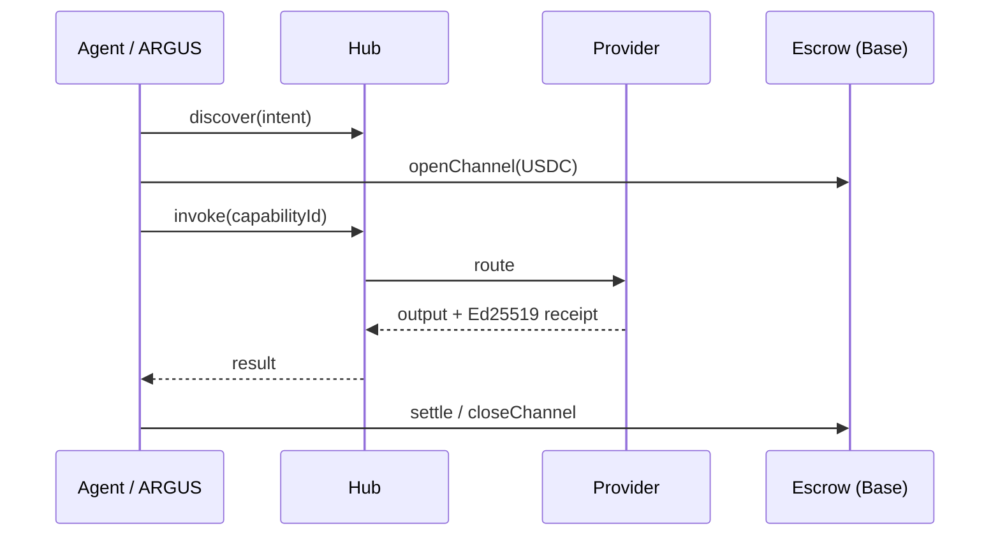

# AICOM Ecosystem — Knowledge Base

> **The master guide** — start here for ideology, every component, money flows, MCP & oracles, ARGUS, deploy, and where to read next.

**This page:** **EN** · [RU](./knowledge-base-ru.md) · [ES](./knowledge-base-es.md) · [FR](./knowledge-base-fr.md) · [中文](./knowledge-base-zh.md)

**Maturity / external scorecard:** [ecosystem-maturity-review.en.md](../ecosystem-maturity-review.en.md) · [RU](../ecosystem-maturity-review.ru.md) — honest tiers, KI-6…KI-10, action matrix.
>
> **Languages:** Whitepaper **[EN](./whitepaper/en.md)** · **[RU](./whitepaper/ru.md)** · **[ES](./whitepaper/es.md)** · ARGUS user guides **[20 langs](https://github.com/alexar76/argus/blob/main/docs/user-guide/README.md)**

| You are… | Start here |
|----------|------------|
| **Architect / integrator** | [Whitepaper §0–2](./whitepaper/en.md) → this index |
| **Factory operator** | [USER_GUIDE.md](../USER_GUIDE.md) · [Whitepaper §6 deploy](./whitepaper/en.md#6-administrator-guide--deployment) |
| **End user (human)** | [ARGUS install](https://magic-ai-factory.com/install) · [ARGUS guides](../../argus/docs/user-guide/) |
| **Agent / SDK developer** | [Protocol spec](../../aimarket-protocol/spec.md) · [SDKs](#sdks--client-libraries) · [MCP & oracles](#mcp--seventeen-oracles) |
| **Auditor** | [onchain-journal.md](../onchain-journal.md) · [threat assessment](../ecosystem-threat-assessment.md) |

---

## 0. One-page thesis

AICOM is a **federated autonomous-agent economy**:

1. **Factory** 🏭 produces shippable products and signed capabilities.
2. **Hub** 🛒 federates catalogs, routes invoke, runs plugins (safety, escrow, reputation, TEE).
3. **Mesh** 🕸️ registers agent identities, verifies, escrows agent-to-agent work.
4. **Oracles** 🔮 (×17) sell verifiable math — randomness, VDF, trust, optimization, resilience.
5. **Chain** ⛓️ settles USDC micropayments via prepaid channels + escrow.
6. **ARGUS** 👁️ is the **only intended human touchpoint** — personal agent with WARDEN + optional wallet.
7. **Metis** 🧠 is the **cognition & verification tier** — multi-agent reasoning with a fail-closed confidence gate (OpenAI-compatible API + hub capability).
8. **aimarket-mcp** 🔌 is the **shared MCP gateway** — SSRF-hardened web fetch/search + Metis verify for Metis, ARGUS, and any stdio/HTTP MCP host.
9. **SKOPOS** 🛰️ is the **fleet observability satellite** — nginx & Apache analytics over SSH, Security Center, and an AI analyst; live on [skopos.modelmarket.dev](https://skopos.modelmarket.dev).
10. **GAIA** 🌍 sells verifiable **physical-world data** — virtual IoT sensors as Ed25519-attested, statistically plausibility-verified capabilities. It is the **third oracle class**: mathematical (oracles ×17), cognitive (Metis), physical (GAIA).

**Beyond ARGUS, humans configure infra — machines trade.** Full ideology: [whitepaper §1](./whitepaper/en.md#1-ideology--autonomous-agent-economy).

---

## 1. Live surfaces

| Surface | URL | Role |
|---------|-----|------|
| AI-Factory | [magic-ai-factory.com](https://magic-ai-factory.com) | Pipeline, admin, storefront |
| AIMarket Hub | [modelmarket.dev](https://modelmarket.dev) | Federated marketplace |
| Oracles portal | [oracles.modelmarket.dev](https://oracles.modelmarket.dev) | 17 verifiable-math products |
| Agent Lottery | [lottery.modelmarket.dev](https://lottery.modelmarket.dev) | Canonical oracle consumer |
| Ecosystem demos | [modeldev.modelmarket.dev](https://modeldev.modelmarket.dev) | Stack overview |
| Alien Monitor | [magic-ai-factory.com/monitor/](https://magic-ai-factory.com/monitor/) | 3D graph + AI assistant |
| Production metrics | [ecosystem-status API](https://magic-ai-factory.com/api/public/ecosystem-status) · [docs](../production-metrics.md) | RPS, latency, uptime, incidents |
| Pulse (ACEX) | [magic-ai-factory.com/pulse/](https://magic-ai-factory.com/pulse/) | Capital markets UI |
| ARGUS | [magic-ai-factory.com/argus/](https://magic-ai-factory.com/argus/) | Human install + landing |
| **DIOSCURI** | [alexar76.github.io/dioscuri](https://alexar76.github.io/dioscuri/) · Telegram · Discord | Twin community agents — **[integration EN](./dioscuri-integration.md)** · **[RU](./dioscuri-integration-ru.md)** · **[ES](./dioscuri-integration-es.md)** |
| **THEOROS** | [alexar76.github.io/theoros](https://alexar76.github.io/theoros/) · Discord `#the-canon` | Agent Sovereignty Canon — weekly column via DIOSCURI — **[integration EN](./theoros-integration.md)** |
| **HELIOS** | [github.com/alexar76/helios](https://github.com/alexar76/helios) · [@My-AI-Factory](https://www.youtube.com/@My-AI-Factory) | Broadcast pipeline — **[integration EN](./helios-integration.md)** · **[RU](./helios-integration-ru.md)** · **[ES](./helios-integration-es.md)** |
| **Metis** | [metis.modelmarket.dev](https://metis.modelmarket.dev) · [alexar76.github.io/metis](https://alexar76.github.io/metis/) | Cognition + verification tier — **[integration](../metis-integration.md)** |
| **SKOPOS** | [skopos.modelmarket.dev](https://skopos.modelmarket.dev) · [alexar76/skopos](https://github.com/alexar76/skopos) | Fleet observability — nginx/Apache analytics, Security Center — **[integration](./skopos-integration.md)** |
| **aimarket-mcp** | [Glama](https://glama.ai/mcp/servers/alexar76/aimarket-mcp) · [GitHub](https://github.com/alexar76/aimarket-mcp) | Shared MCP gateway (web fetch/search + Metis verify) |
| **GAIA** | [alexar76.github.io/gaia](https://alexar76.github.io/gaia/) · [GitHub](https://github.com/alexar76/gaia) | Physical oracle gateway — attested IoT sensors (`:9320`) — **[docs](../iot-physical-oracles.md)** |
| **Provenance verifier** | [verify.modelmarket.dev](https://verify.modelmarket.dev) | Verify any AI-output receipt (Ed25519 / W3C VC) — paste JSON or open its `verify_url` |

---

## 1b. Community layer

| Twin | Platform | URL | Role |
|------|----------|-----|------|
| **CASTOR (bot)** | Telegram | [t.me/next_agent_market_bot](https://t.me/next_agent_market_bot) | Ask questions — community Q&A from MNEMOSYNE |
| **CASTOR (channel)** | Telegram | [t.me/just_for_agents](https://t.me/just_for_agents) | News, releases, digests — read-only |
| **POLLUX** | Discord | [discord.gg/aimarket](https://discord.gg/aimarket) | Structured server, releases, mod log |
| **THEOROS** | Discord | [discord.gg/aimarket](https://discord.gg/aimarket) → `#the-canon` | Weekly **Agent Sovereignty Canon** column; debate in `#canon-debate` |

**Ask the twins:** [Castor bot](https://t.me/next_agent_market_bot) · [Pollux on Discord](https://discord.gg/aimarket) — answers from synced GitHub docs (MNEMOSYNE). **Canon:** [THEOROS landing](https://alexar76.github.io/theoros/) · `#the-canon`. **News:** [Castor channel](https://t.me/just_for_agents).

Source: [alexar76/dioscuri](https://github.com/alexar76/dioscuri) · **Landing:** [alexar76.github.io/dioscuri](https://alexar76.github.io/dioscuri/) · **Content playbook:** [docs/growth/content-playbook.md](../growth/content-playbook.md) · Monitor node: click **DIOSCURI** on [Alien Monitor](https://magic-ai-factory.com/monitor/).

---

## 2. Component map (every repo)

| Component | Monorepo path | Satellite repo | Deep doc |
|-----------|---------------|----------------|----------|
| **AI-Factory** | `web/`, `agents/`, `config/` | [alexar76/aicom](https://github.com/alexar76/aicom) | [USER_GUIDE](../USER_GUIDE.md) · [wp §3.1](./whitepaper/en.md#31-ai-factory) |
| **AIMarket Hub** | `aimarket-hub/` | [aimarket-hub](https://github.com/alexar76/aimarket-hub) | [wp §3.2](./whitepaper/en.md#32-aimarket-hub) |
| **Protocol** | `aimarket-protocol/` | [aimarket-protocol](https://github.com/alexar76/aimarket-protocol) | [spec.md](https://github.com/alexar76/aimarket-protocol/blob/main/spec.md) |
| **Hub plugins** | `plugins/` | [aimarket-plugins](https://github.com/alexar76/aimarket-plugins) | [plugins/README](https://github.com/alexar76/aimarket-plugins/blob/main/plugins/README.md) |
| **Desktop SKUs** | `desktop-integrations/` | [aimarket-desktop](https://github.com/alexar76/aimarket-desktop) | 8 Flutter apps |
| **Embed widget** | `aimarket-widget/` | [aimarket-widget](https://github.com/alexar76/aimarket-widget) | [widget docs](https://github.com/alexar76/aimarket-widget/tree/main/docs/) |
| **SDKs** | `aimarket-sdks/` | [aimarket-sdks](https://github.com/alexar76/aimarket-sdks) | Py · TS · Rust · Dart |
| **Service Mesh** | `ai-service-mesh/` | [ai-service-mesh](https://github.com/alexar76/ai-service-mesh) | [wp §3.5](./whitepaper/en.md#35-ai-service-mesh) |
| **Oracles ×17** | `oracles/` | [oracles](https://github.com/alexar76/oracles) | [oracles/docs/en.md](../../oracles/docs/en.md) |
| **GAIA** | `gaia/` | (satellite) | [iot-physical-oracles.md](../iot-physical-oracles.md) |
| **ARGUS-3** | `argus/` | [argus](https://github.com/alexar76/argus) | [wp §3.7](./whitepaper/en.md#37-argus-3) · [wiki](https://github.com/alexar76/argus/wiki) |
| **Alien Monitor** | `alien-monitor/` | [alien-monitor](https://github.com/alexar76/alien-monitor) | [wp §3.8](./whitepaper/en.md#38-alien-monitor) |
| **ACEX** | `acex/` | [acex](https://github.com/alexar76/acex) | [wp §3.10](./whitepaper/en.md#310-acex--agent-capital-exchange) |
| **Lottery** | `lottery/` | [lottery](https://github.com/alexar76/lottery) | [wp §3.11](./whitepaper/en.md#311-agent-lottery) |
| **DIOSCURI** | `dioscuri/` | [dioscuri](https://github.com/alexar76/dioscuri) | [landing](https://alexar76.github.io/dioscuri/) · [integration](./dioscuri-integration.md) · [setup](../../dioscuri/docs/setup.md) |
| **THEOROS** | `theoros/` | [theoros](https://github.com/alexar76/theoros) | [landing](https://alexar76.github.io/theoros/) · [integration](./theoros-integration.md) · [CANON.md](../../theoros/CANON.md) |
| **HELIOS** | `helios/` | [helios](https://github.com/alexar76/helios) | [integration](./helios-integration.md) · [runbook](../../helios/docs/runbook.md) |
| **Metis** | `metis/` | [metis](https://github.com/alexar76/metis) | [integration](../metis-integration.md) · [ECOSYSTEM.md](../../metis/docs/en/ECOSYSTEM.md) · PyPI `aimarket-metis` |
| **SKOPOS** | `skopos/` | [skopos](https://github.com/alexar76/skopos) | [integration](./skopos-integration.md) · [quickstart](../../skopos/docs/quickstart.md) |
| **aimarket-mcp** | `aimarket-mcp/` | [aimarket-mcp](https://github.com/alexar76/aimarket-mcp) | [Glama](https://glama.ai/mcp/servers/alexar76/aimarket-mcp) · stdio + Streamable-HTTP |
| **Contracts** | `contracts/` | — | [onchain-journal](../onchain-journal.md) |

Visual C4 + deployment: [ecosystem-architecture.md](../ecosystem-architecture.md) · [ecosystem-viewer.html](https://github.com/alexar76/aimarket-protocol/blob/main/ecosystem-viewer.html)

---

## 3. Money & trust flows

- **Protocol economics:** [aimarket-whitepaper.md](../aimarket-whitepaper.md)
- **Reputation / disputes:** [wp §4.3](./whitepaper/en.md#43-reputation--disputes)
- **TEE escrow plugin:** [plugins/docs/killer-feature-tee-escrow.md](https://github.com/alexar76/aimarket-plugins/blob/main/plugins/docs/killer-feature-tee-escrow.md)
- **Threat model:** [ecosystem-threat-assessment.md](../ecosystem-threat-assessment.md)

---

## 4. MCP & seventeen oracles

### 4.1 MCP in the ecosystem

| MCP surface | What | Doc |
|-------------|------|-----|
| **Factory protocol gateway** | 402 + MCP + invoke on shipped products | [wp §3.1](./whitepaper/en.md#31-ai-factory) |
| **aimarket-oracle-gateway** | stdio MCP: all 17 oracles (35 capability tools) | [Glama](https://glama.ai/mcp/servers/alexar76/aimarket-oracle-gateway) · [plugin](../../plugins/aimarket-oracle-gateway/) |
| **aimarket-mcp** | stdio + HTTP MCP: `web_fetch`, `web_search`, `metis_verify` (SSRF-hardened) | [Glama](https://glama.ai/mcp/servers/alexar76/aimarket-mcp) · [GitHub](https://github.com/alexar76/aimarket-mcp) · consumed by Metis (`aimarket-web` preset) and ARGUS |
| **ARGUS as MCP server** | `argus mcp` → `argus_ask`, `argus_status` — **sell capabilities** | [argus MCP doc](../../argus/docs/mcp-oracles-capabilities.md) |
| **Third-party MCP → ARGUS** | Filesystem, browsers, … via **WARDEN** gate chain | [security-warden](../../argus/docs/security-warden.md) |
| **Hub mcp-packager plugin** | Package capabilities as MCP servers | [plugins](../../plugins/README.md) |

### 4.2 Seventeen oracles (full table)

Shared runtime: **`oracle-core`**. Portal: [oracles.modelmarket.dev](https://oracles.modelmarket.dev).

> **Crypto maturity:** research/prototype tier — not hardened production crypto (Chronos: no external audit; hybrid PQC optional). [crypto-maturity.en.md](../../oracles/docs/crypto-maturity.en.md) · Factory [KI-6](../known-issues.md#ki-6--oracle-family-cryptographic-maturity-not-production-hardened)

| Oracle | Skill | Capability IDs (v1) |
|--------|-------|---------------------|
| **Platon** | Verifiable randomness | `platon.random@v1`, `platon.beacon@v1`, `platon.commit@v1`, `platon.oracle@v1`, `platon.ask@v1` |
| **Chronos** | Verifiable delay (VDF) | `chronos.eval@v1`, `chronos.verify@v1` |
| **Lattice** | Low-discrepancy sequences | `lattice.sequence@v1` |
| **Murmuration** | Robust consensus | `murmuration.aggregate@v1` |
| **Lumen** | Reputation / EigenTrust | `lumen.reputation@v1` — WARDEN + lottery weighting |
| **Colony** | TSP + certificate | `colony.optimize@v1` |
| **Turing** | Blue-noise sampling | `turing.bluenoise@v1` |
| **Percola** | Network percolation | `percola.threshold@v1`, `percola.verify@v1` |
| **Fermat** | Optimal routing | `fermat.route@v1`, `fermat.verify@v1` |
| **Ablation** | Cascade risk (SOC) | `ablation.cascade@v1`, `ablation.verify@v1` |
| **Landauer** | Thermodynamic audit | `landauer.audit@v1`, `landauer.verify@v1` |
| **Sortes** | Ungrindable VRF (ECVRF) | `sortes.draw@v1`, `sortes.verify@v1` |
| **Gauss** | Gaussian-process regression | `gauss.field@v1`, `gauss.suggest@v1`, `gauss.verify@v1` |
| **Aestus** | Time-lock puzzles (RSW) | `aestus.seal@v1`, `aestus.open@v1`, `aestus.verify@v1` |
| **Betti** | Persistent homology | `betti.homology@v1`, `betti.distance@v1` |
| **Kantor** | Optimal transport (Wasserstein) | `kantor.transport@v1`, `kantor.verify@v1` |
| **Fourier** | Graph-spectral analysis | `fourier.spectrum@v1`, `fourier.verify@v1` |

**Chronos × Platon** — unbiasable beacon (lottery draw). **Agent Lottery** composes Platon + Chronos + Lumen — [lottery docs](https://github.com/alexar76/lottery/blob/main/docs/README.md).

**Call from ARGUS (native, wallet-free):** `argus oracle list` · `oracle_call` agent tool — [mcp-oracles-capabilities.md](https://github.com/alexar76/argus/blob/main/docs/mcp-oracles-capabilities.md)

Per-oracle deep dives: `oracles/<name>/docs/{en,ru,es}.md`

---

## 5. ARGUS — human layer

| Topic | Document |
|-------|----------|
| **Install** | `curl -fsSL https://magic-ai-factory.com/install \| bash` |
| **User guide (20 langs)** | [argus/docs/user-guide/README.md](https://github.com/alexar76/argus/blob/main/docs/user-guide/README.md) |
| **ARGUS wiki** | [github.com/alexar76/argus/wiki](https://github.com/alexar76/argus/wiki) |
| **17 oracles + MCP + selling** | [mcp-oracles-capabilities.md](../../argus/docs/mcp-oracles-capabilities.md) |
| **In-agent truth (bots)** | [knowledge-base.md](../../argus/docs/knowledge-base.md) |
| **WARDEN / autonomy / economy** | [security-warden](../../argus/docs/security-warden.md) · [autonomy](../../argus/docs/autonomy.md) · [economy-integration](../../argus/docs/economy-integration.md) |
| **Humor + cartoon** | [humor/](../../argus/docs/user-guide/humor/) · [cartoon](https://magic-ai-factory.com/argus/humor-cartoon.html) |

**Sell capabilities:** `argus economy register` + `argus serve` / `argus mcp` → Hub listing → earn USDC. **Third-party HTTP caps:** stake + signed responses via [`aimarket publish`](https://github.com/alexar76/aimarket-hub/blob/main/docs/supply-security.md) — [developer guide (20 langs)](https://github.com/alexar76/argus/tree/main/docs/developer-guide/). [ARGUS wiki · Selling](https://github.com/alexar76/argus/wiki/Selling-Capabilities)

**Run your own ARGUS (consumer or supplier):** [use case — external operator](../../argus/docs/use-case-external-operator.md) · [RU](../../argus/docs/use-case-external-operator-ru.md) — what to configure (`ARGUS_HUB_URL`, wallet, crypto switch, oracle family).

---

## 6. SDKs & client libraries

| Package | Install | Use |
|---------|---------|-----|
| `aimarket-agent` (PyPI) | `pip install aimarket-agent` | Python consumer |
| `@aimarket/agent` (npm) | `npm i @aimarket/agent` | TypeScript — **ARGUS Layer 5** |
| `aimarket-agent` (crates) | `cargo add aimarket-agent` | Rust |
| `aimarket_agent` (pub) | `dart pub add aimarket_agent` | Flutter desktop SKUs |
| `aimarket-hub` | `pip install aimarket-hub` | Reference hub server |
| `aimarket-oracle-gateway` | `pip install aimarket-oracle-gateway` | MCP oracle tools (stdio) |
| `aimarket-mcp` | `pip install aimarket-mcp` | MCP web gateway (stdio + HTTP) |
| `aimarket-metis` | `pip install aimarket-metis` | Metis cognition engine (CLI + library) |

Version policy: [sdk-version-policy.md](../sdk-version-policy.md)

---

## 7. Deploy & operate

| Task | Doc / command |
|------|----------------|
| **Full fleet** | [quickstart-ecosystem-deploy.md](../quickstart-ecosystem-deploy.md) · `./scripts/quickstart_ecosystem.sh` · `./scripts/deploy_ecosystem.sh` |
| **Factory only** | [deploy.sh](../../scripts/deploy.sh) · [USER_GUIDE](../USER_GUIDE.md) |
| **Hub only** | `./scripts/deploy_hub.sh` |
| **Oracles host** | `./scripts/setup-oracles-platon-on-host.sh` |
| **Monitor + Pulse** | [deploy-argus-monitor.md](../deploy-argus-monitor.md) |
| **Whitepaper admin §6** | [en §6](./whitepaper/en.md#6-administrator-guide--deployment) |
| **Config / security** | [configuration.md](../configuration.md) · [security.md](../security.md) |
| **Recovery** | [recovery-mechanisms.md](../recovery-mechanisms.md) |

---

## 8. Wikis & indexes

| Wiki | URL | Scope |
|------|-----|-------|
| **AICOM** | [github.com/alexar76/aicom/wiki](https://github.com/alexar76/aicom/wiki) | Factory + ecosystem (EN) |
| **ARGUS** | [github.com/alexar76/argus/wiki](https://github.com/alexar76/argus/wiki) | Install, WARDEN, oracles, sell |
| **All `docs/`** | [docs/README.md](../README.md) | 50+ operator guides |
| **Documentation Index** | [wiki Documentation-Index](https://github.com/alexar76/aicom/wiki/Documentation-Index) | Curated map |

---

## 9. Reading order (recommended)

### New to AICOM (2 hours)

1. This page (skim §0–2)
2. [Whitepaper executive summary + §1 ideology](./whitepaper/en.md#0-executive-summary)
3. [ecosystem-architecture.md](../ecosystem-architecture.md) diagrams
4. [onchain-journal.md](../onchain-journal.md) — proof the demo is real mainnet

### Operator (1 day)

1. [USER_GUIDE.md](../USER_GUIDE.md)
2. [Whitepaper §6 deploy](./whitepaper/en.md#6-administrator-guide--deployment)
3. [deploy-ecosystem.md](../deploy-ecosystem.md)
4. [configuration.md](../configuration.md) + [security.md](../security.md)

### ARGUS end user (30 min)

1. [ARGUS user guide EN](https://github.com/alexar76/argus/blob/main/docs/user-guide/en.md)
2. [mcp-oracles-capabilities.md](https://github.com/alexar76/argus/blob/main/docs/mcp-oracles-capabilities.md) if using wallet/oracles
3. [humor cartoon](https://magic-ai-factory.com/argus/humor-cartoon.html) optional 😈

### Integrator / agent builder

1. [aimarket-protocol/spec.md](https://github.com/alexar76/aimarket-protocol/blob/main/spec.md)
2. [oracles/docs/en.md](https://github.com/alexar76/oracles/blob/main/docs/en.md)
3. [quickstart-call-an-oracle.md](../specs/quickstart-call-an-oracle.md)
4. SDK for your language + [Mesh architecture](https://github.com/alexar76/ai-service-mesh/blob/main/docs/architecture.md)

---

## 10. Glossary (short)

**ALP** · **CapShares** · **Channel** (prepaid escrow) · **Capability** (signed manifest) · **Federation** · **Receipt** (Ed25519) · **TEE** · **WARDEN** (ARGUS MCP gates) · **Machine UBI** (hub tithe → lottery)

Full glossary: [whitepaper §10](./whitepaper/en.md#10-glossary--references)

---

## 11. Changelog & canonical sources

| Artifact | Canonical path |
|----------|----------------|
| Ecosystem whitepaper | `docs/ecosystem/whitepaper/{en,ru,es}.md` |
| This knowledge base | `docs/ecosystem/knowledge-base.md` |
| Protocol economics | `docs/aimarket-whitepaper.md` |
| ARGUS in-agent KB | `argus/docs/knowledge-base.md` |
| Monitor embedded KB | `alien-monitor/backend/ecosystem_knowledge.py` |

When docs disagree, prefer **whitepaper** for ecosystem scope and **argus/docs/knowledge-base.md** for ARGUS bot identity.

---

*Last expanded: ecosystem MCP/oracles table, ARGUS sell path, wiki links. Maintainers: update this index when adding satellites or capabilities.*
