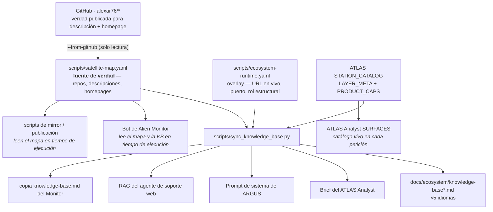

# Bases de conocimiento de los agentes — dónde viven y cómo se mantienen al día

> 🌐 [English](knowledge-sources.md) · [Русский](knowledge-sources-ru.md) · **Español** · [Français](knowledge-sources-fr.md) · [中文](knowledge-sources-zh.md)

Varios agentes de este ecosistema se entregan con conocimiento incorporado de lo que el ecosistema
*es*, para que respondan «¿qué es MOMUS?» correctamente en lugar de adivinar o decir que no lo saben.
Ese conocimiento se escribía a mano en cada uno de ellos por separado, y fue derivando: **MOMUS,
Treasury, ATLAS y los bridges estaban ausentes de absolutamente todas las bases de conocimiento** pese
a estar completamente construidos, desplegados y documentados en cinco idiomas. Esta página es la
corrección, y el mapa.

## Una fuente, un comando



```bash
python3 scripts/sync_knowledge_base.py --list
```

| Comando | Qué hace |
|---|---|
| `--list` | cada base de conocimiento, su formato, idioma y consumidor |
| `--check` | informa de la deriva, no cambia nada — esto es lo que ejecuta CI |
| `--write` | regenera el bloque en todas las bases |
| `--from-github` | compara el mapa con lo que dicen realmente los repos públicos |
| `--from-github --apply` | rellena los campos **vacíos** del mapa desde GitHub; los conflictos se informan, nunca se sobrescriben |

## Quién es responsable de mantenerlo al día

**Nadie — deliberadamente.** Un responsable humano con nombre y apellidos es justamente el mecanismo
que se degradó aquí. Tres capas mecánicas sustituyen al responsable:

1. **[`tests/test_knowledge_sync.py`](../../tests/test_knowledge_sync.py)** falla cuando un componente
   del mapa falta en alguna base de conocimiento. Una base que ha derivado no puede pasar CI.
2. **`--check` en CI** ante cualquier cambio en el mapa, en el overlay o en cualquier archivo destino.
3. **`--from-github`** vuelve a leer las descripciones y homepages publicadas de los repos, de modo que
   el mapa no puede podrirse frente a la verdad pública. Es de **solo lectura** — nunca hace push de
   nada. (Este repo hace push a Gitea; los repos de GitHub son un mirror.)

La división del trabajo que hace esto seguro: el generador es dueño del **listado** (roster) de
componentes (cuáles existen, qué es cada uno, dónde se ejecuta). Nunca toca la prosa que lo rodea,
porque esa prosa es estructural y está escrita por humanos: el «WARDEN **no** orquesta nada» de ARGUS,
el «encuentra y firma, pero nunca puede pagarse a sí mismo» de MOMUS. Esas frases evitan respuestas
erróneas concretas, y un generador no debe parafrasearlas.

## Las bases que reciben el listado generado

Cada una tiene un único bloque delimitado; todo lo que queda fuera del delimitador está escrito a mano.

| Archivo | Formato | Consumidor |
|---|---|---|
| [`docs/ecosystem/knowledge-base.md`](knowledge-base.md) | Markdown | base de conocimiento compartida del ecosistema (EN) |
| [`docs/ecosystem/knowledge-base-ru.md`](knowledge-base-ru.md) | Markdown | base de conocimiento compartida (RU) |
| [`docs/ecosystem/knowledge-base-es.md`](knowledge-base-es.md) | Markdown | base de conocimiento compartida (ES) |
| [`docs/ecosystem/knowledge-base-fr.md`](knowledge-base-fr.md) | Markdown | base de conocimiento compartida (FR) |
| [`docs/ecosystem/knowledge-base-zh.md`](knowledge-base-zh.md) | Markdown | base de conocimiento compartida (ZH) |
| [`atlas/atlas/ecosystem_context.py`](https://github.com/alexar76/atlas/blob/main/atlas/ecosystem_context.py) | prosa en una cadena de Python | ATLAS Analyst |
| [`argus/src/ecosystem/knowledge.ts`](https://github.com/alexar76/argus/blob/main/src/ecosystem/knowledge.ts) | prosa en un literal de plantilla de TS | ARGUS (cliente del lado de la demanda) |
| [`web/backend/services/support_rag_baseline.md`](../../web/backend/services/support_rag_baseline.md) | Markdown | agente de soporte web (RAG léxico) |

El delimitador usa un comentario HTML en todas ellas, incluso dentro de las cadenas de Python y de
TypeScript: inerte en cada una de ellas, invisible cuando la prosa se renderiza:

```
<!-- BEGIN GENERATED ecosystem-components -->
<!-- END GENERATED ecosystem-components -->

<!-- BEGIN GENERATED physical-capabilities -->
<!-- END GENERATED physical-capabilities -->
```

El segundo delimitador es la tabla de SKU físicos/mapa desde `STATION_CATALOG`. Un pin nuevo + `--write` es cómo cada asistente aprende el SKU. ATLAS Analyst ve las capas al instante (sin sync).

Un archivo destino **sin** el delimitador se informa como `NO-MARKERS`, nunca se omite en silencio.
La omisión silenciosa es precisamente lo que permitió que la deriva original sobreviviera.

## Las bases que no necesitan inyección — leen el mapa en tiempo de ejecución

| Archivo | Consumidor |
|---|---|
| [`alien-monitor/backend/ecosystem_registry.py`](https://github.com/alexar76/alien-monitor/blob/main/backend/ecosystem_registry.py) | bot de IA de Alien Monitor |
| [`scripts/mirror_satellites.sh`](../../scripts/mirror_satellites.sh) | herramientas de mirror / publicación |
| [`atlas/atlas/capability_awareness.py`](https://github.com/alexar76/atlas/blob/main/atlas/capability_awareness.py) | ATLAS Analyst SURFACES — catálogo vivo en cada petición |
| [`logos/logos/app.py`](https://github.com/alexar76/logos/blob/main/logos/app.py) | LOGOS — Hub vivo `GET /api/v1/federation/capabilities` |

`--write` también copia la base EN a [`alien-monitor/docs/ecosystem/knowledge-base.md`](https://github.com/alexar76/alien-monitor/blob/main/docs/ecosystem/knowledge-base.md).

Este es el patrón mejor y el que generaliza la sincronización: el bot del monitor construye el contexto
de su prompt a partir de `satellite-map.yaml` en cada petición, así que nunca ha derivado. Prefiérelo
para cualquier cosa nueva que pueda cargar un archivo en tiempo de ejecución; la inyección es para
prompts que deben entregarse como una cadena estática.

## Almacenes de conocimiento que deliberadamente NO reciben el listado

Se enumeran con sus razones, porque «¿por qué esta no está sincronizada?» es la pregunta que acaba con
un listado de 35 líneas pegado en un prompt donde hace daño.

| Archivo | Por qué no |
|---|---|
| [`skopos/skopos/agent/ecosystem_briefing.py`](https://github.com/alexar76/skopos/blob/main/skopos/agent/ecosystem_briefing.py) | Un prompt de SRE de guardia limitado a 180 palabras que lee datos **en vivo** del host. Un listado estático desplazaría la señal de salud que existe para resumir. |
| [`web/backend/services/methodology_knowledge.py`](../../web/backend/services/methodology_knowledge.py) | El almacén de lecciones/casos del Methodology Agent. *Aprende* de los resultados de las revisiones y no debe sembrarse con hechos estáticos. |
| [`metis/scripts/seed_ecosystem_knowledge.py`](https://github.com/alexar76/metis/blob/main/scripts/seed_ecosystem_knowledge.py) | Pares de preguntas y respuestas curados sobre **Metis mismo** para RAG anclado (grounded). El listado de componentes corresponde a la base de conocimiento compartida a la que apuntan sus respuestas. |
| [`helios/helios/knowledge/mnemosyne.py`](https://github.com/alexar76/helios/blob/main/helios/knowledge/mnemosyne.py) | Un lector BM25 de solo lectura sobre el `mnemosyne.json` de DIOSCURI. Ese corpus lo construye DIOSCURI a partir de fuentes en vivo (READMEs, releases, docs), así que recoge satélites nuevos sin ninguna inyección. |
| [`momus/momus/config.py`](https://github.com/alexar76/momus/blob/main/momus/config.py) | MOMUS aprende qué existe a partir de su **allowlist (lista blanca) de objetivos**, no de la prosa. Un componente que puede sondear tiene que registrarse deliberadamente: un listado en su prompt lo invitaría a sondear cosas que nadie autorizó. |

## Añadir un satélite: el procedimiento completo

1. Añade la entrada a [`scripts/satellite-map.yaml`](../../scripts/satellite-map.yaml).
2. Si tiene una superficie en vivo o un rol que la descripción del repo enuncia de forma imprecisa,
   añádelo a [`scripts/ecosystem-runtime.yaml`](../../scripts/ecosystem-runtime.yaml). **Solo nombres
   de host públicos** — el cargador rechaza una IP a secas, porque estos datos se publican en docs y
   landings.
3. Ejecuta `python3 scripts/sync_knowledge_base.py --write`.
4. Haz commit. El `--check` de CI confirma que todas las bases concuerdan.

## Añadir un SKU físico / de mapa (los asistentes lo aprenden solos)

1. Registra el dispositivo en GAIA (`live.py` / `live_p2.py`) y espéjalo en `STATION_CATALOG` ([add-gaia-atlas-sensor.md](../add-gaia-atlas-sensor.md)).
2. `python3 scripts/sync_knowledge_base.py --write` — las bases (×5), ARGUS, el brief del Analyst, el RAG de soporte y la copia KB del Monitor reciben el SKU. ATLAS Analyst ve la capa al instante, sin sync.
3. Commit. CI falla si el catálogo creció y la tabla no se regeneró.

La búsqueda viva del Hub es el **techo**; la tabla generada es el **suelo**. No inventar SKUs.

Terminología para cualquier prosa que escribas alrededor del bloque:
[`docs/localization-glossary.md`](../localization-glossary.md) es la fuente de verdad, y tiene una
sección MOMUS / Treasury.

## Estado conocido (2026-08-08)

`--from-github` informa actualmente, con veracidad:

- **`momus` y `treasury` están publicados en GitHub** como [`alexar76/momus`](https://github.com/alexar76/momus) y [`alexar76/treasury`](https://github.com/alexar76/treasury) (Pages: [momus](https://alexar76.github.io/momus/), [treasury](https://alexar76.github.io/treasury/); live: [momus.modelmarket.dev](https://momus.modelmarket.dev)).
- **1 conflicto** en la descripción del repo `profile` — ambos lados tienen un valor, así que espera una
  decisión humana en lugar de sobrescribirse en silencio.
- 12 homepages vacías se rellenaron desde GitHub en la primera ejecución.
