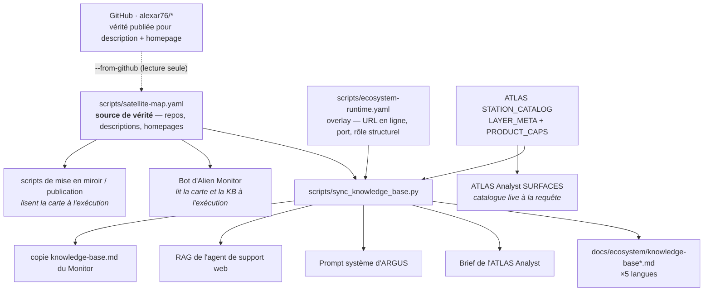

# Bases de connaissances des agents — où elles vivent et comment elles restent à jour

> 🌐 [English](knowledge-sources.md) · [Русский](knowledge-sources-ru.md) · [Español](knowledge-sources-es.md) · **Français** · [中文](knowledge-sources-zh.md)

Plusieurs agents de cet écosystème sont livrés avec une connaissance intégrée de ce que l'écosystème
*est* — de sorte qu'ils répondent correctement à « qu'est-ce que MOMUS ? » au lieu de deviner ou de
dire qu'ils ne savent pas. Cette connaissance était auparavant saisie à la main dans chacun d'eux
séparément, et elle a dérivé : **MOMUS, Treasury, ATLAS et les bridges étaient absents de toutes les
bases de connaissances, sans exception**, alors qu'ils étaient entièrement construits, déployés et
documentés en cinq langues. Cette page est la correction, et la carte.

## Une source, une commande



```bash
python3 scripts/sync_knowledge_base.py --list
```

| Commande | Ce qu'elle fait |
|---|---|
| `--list` | chaque base de connaissances, son format, sa langue et son consommateur |
| `--check` | signale la dérive, ne change rien — c'est ce que la CI exécute |
| `--write` | régénère le bloc dans chaque base |
| `--from-github` | compare la carte à ce que disent réellement les repos publics |
| `--from-github --apply` | remplit les champs **vides** de la carte depuis GitHub ; les conflits sont signalés, jamais écrasés |

## Qui est responsable de la tenue à jour

**Personne — délibérément.** Un propriétaire humain nommé est exactement le mécanisme qui s'est
dégradé ici. Trois couches mécaniques remplacent le propriétaire :

1. **[`tests/test_knowledge_sync.py`](../../tests/test_knowledge_sync.py)** échoue lorsqu'un composant
   présent dans la carte manque dans une base de connaissances. Une base qui a dérivé ne peut pas
   passer la CI.
2. **`--check` dans la CI** à chaque changement de la carte, de l'overlay ou de n'importe quel fichier
   cible.
3. **`--from-github`** relit les descriptions et les homepages publiées des repos, de sorte que la
   carte ne peut pas pourrir face à la vérité publique. Il est en **lecture seule** — il ne pousse
   jamais rien. (Ce repo pousse vers Gitea ; les repos GitHub sont un miroir.)

La division du travail qui rend cela sûr : le générateur est propriétaire de l'**inventaire** (roster)
des composants — lesquels existent, ce qu'est chacun, où il tourne. Il ne touche jamais à la prose
environnante, car cette prose est structurelle et écrite par des humains : le « WARDEN n'orchestre
**rien** » d'ARGUS, le « il trouve et il signe, mais il ne peut jamais se payer lui-même » de MOMUS.
Ces phrases empêchent des réponses fausses bien précises, et un générateur ne doit pas les
paraphraser.

## Les bases qui reçoivent l'inventaire généré

Chacune a un unique bloc délimité ; tout ce qui se trouve hors du délimiteur est écrit à la main.

| Fichier | Format | Consommateur |
|---|---|---|
| [`docs/ecosystem/knowledge-base.md`](knowledge-base.md) | Markdown | base de connaissances partagée de l'écosystème (EN) |
| [`docs/ecosystem/knowledge-base-ru.md`](knowledge-base-ru.md) | Markdown | base de connaissances partagée (RU) |
| [`docs/ecosystem/knowledge-base-es.md`](knowledge-base-es.md) | Markdown | base de connaissances partagée (ES) |
| [`docs/ecosystem/knowledge-base-fr.md`](knowledge-base-fr.md) | Markdown | base de connaissances partagée (FR) |
| [`docs/ecosystem/knowledge-base-zh.md`](knowledge-base-zh.md) | Markdown | base de connaissances partagée (ZH) |
| [`atlas/atlas/ecosystem_context.py`](https://github.com/alexar76/atlas/blob/main/atlas/ecosystem_context.py) | prose dans une chaîne Python | ATLAS Analyst |
| [`argus/src/ecosystem/knowledge.ts`](https://github.com/alexar76/argus/blob/main/src/ecosystem/knowledge.ts) | prose dans un littéral de template TS | ARGUS (client côté demande) |
| [`web/backend/services/support_rag_baseline.md`](../../web/backend/services/support_rag_baseline.md) | Markdown | agent de support web (RAG lexical) |

Le délimiteur est un commentaire HTML dans tous les cas, y compris à l'intérieur des chaînes Python et
TypeScript — inerte dans chacun d'eux, invisible au rendu de la prose :

```
<!-- BEGIN GENERATED ecosystem-components -->
<!-- END GENERATED ecosystem-components -->

<!-- BEGIN GENERATED physical-capabilities -->
<!-- END GENERATED physical-capabilities -->
```

Le second délimiteur est la table des SKU physiques/carte depuis `STATION_CATALOG`. Un pin nouveau + `--write` : c'est ainsi que chaque assistant apprend le SKU. ATLAS Analyst voit les couches immédiatement (sans sync).

Un fichier cible **sans** délimiteur est signalé comme `NO-MARKERS`, jamais ignoré en silence.
L'omission silencieuse est précisément ce qui a permis à la dérive d'origine de survivre.

## Les bases qui n'ont besoin d'aucune injection — elles lisent la carte à l'exécution

| Fichier | Consommateur |
|---|---|
| [`alien-monitor/backend/ecosystem_registry.py`](https://github.com/alexar76/alien-monitor/blob/main/backend/ecosystem_registry.py) | bot IA d'Alien Monitor |
| [`scripts/mirror_satellites.sh`](../../scripts/mirror_satellites.sh) | outillage de mise en miroir / publication |
| [`atlas/atlas/capability_awareness.py`](https://github.com/alexar76/atlas/blob/main/atlas/capability_awareness.py) | ATLAS Analyst SURFACES — catalogue live à la requête |
| [`logos/logos/app.py`](https://github.com/alexar76/logos/blob/main/logos/app.py) | LOGOS — Hub live `GET /api/v1/federation/capabilities` |

`--write` copie aussi la base EN vers [`alien-monitor/docs/ecosystem/knowledge-base.md`](https://github.com/alexar76/alien-monitor/blob/main/docs/ecosystem/knowledge-base.md).

C'est le meilleur pattern, et celui que la synchronisation généralise : le bot du monitor construit le
contexte de son prompt à partir de `satellite-map.yaml` à chaque requête, si bien qu'il n'a jamais
dérivé. Préférez-le pour tout élément nouveau capable de charger un fichier à l'exécution ;
l'injection est réservée aux prompts qui doivent être livrés sous forme de chaîne statique.

## Les dépôts de connaissances qui ne reçoivent délibérément AUCUN inventaire

Listés avec leurs raisons, car « pourquoi celui-ci n'est-il pas synchronisé ? » est la question qui
finit par un inventaire de 35 lignes collé dans un prompt où il fait des dégâts.

| Fichier | Pourquoi non |
|---|---|
| [`skopos/skopos/agent/ecosystem_briefing.py`](https://github.com/alexar76/skopos/blob/main/skopos/agent/ecosystem_briefing.py) | Un prompt de SRE d'astreinte plafonné à 180 mots qui lit les données **en direct** de l'hôte. Un inventaire statique évincerait le signal de santé qu'il existe pour résumer. |
| [`web/backend/services/methodology_knowledge.py`](../../web/backend/services/methodology_knowledge.py) | Le magasin de leçons/cas du Methodology Agent. Il *apprend* des résultats des revues et ne doit pas être amorcé avec des faits statiques. |
| [`metis/scripts/seed_ecosystem_knowledge.py`](https://github.com/alexar76/metis/blob/main/scripts/seed_ecosystem_knowledge.py) | Des paires question-réponse curées à propos de **Metis lui-même**, pour un RAG ancré (grounded). L'inventaire des composants appartient à la base de connaissances partagée vers laquelle ses réponses pointent. |
| [`helios/helios/knowledge/mnemosyne.py`](https://github.com/alexar76/helios/blob/main/helios/knowledge/mnemosyne.py) | Un lecteur BM25 en lecture seule au-dessus du `mnemosyne.json` de DIOSCURI. Ce corpus est construit par DIOSCURI à partir de sources en direct (READMEs, releases, docs) : il capte donc les nouveaux satellites sans aucune injection. |
| [`momus/momus/config.py`](https://github.com/alexar76/momus/blob/main/momus/config.py) | MOMUS apprend ce qui existe à partir de son **allowlist (liste blanche) de cibles**, pas à partir de la prose. Un composant qu'il peut sonder doit être enregistré délibérément — un inventaire dans son prompt l'inviterait à sonder des choses que personne n'a autorisées. |

## Ajouter un satellite : la procédure complète

1. Ajoutez l'entrée à [`scripts/satellite-map.yaml`](../../scripts/satellite-map.yaml).
2. S'il a une surface en ligne ou un rôle que le descriptif du repo énonce de façon imprécise,
   ajoutez-le à [`scripts/ecosystem-runtime.yaml`](../../scripts/ecosystem-runtime.yaml).
   **Uniquement des noms d'hôte publics** — le chargeur refuse une IP nue, car ces informations sont
   livrées dans les docs et les landings publiées.
3. Exécutez `python3 scripts/sync_knowledge_base.py --write`.
4. Committez. Le `--check` de la CI confirme que toutes les bases concordent.

## Ajouter un SKU physique / carte (les assistants l'apprennent tout seuls)

1. Enregistrez l'appareil sur GAIA (`live.py` / `live_p2.py`) et miroitez-le dans `STATION_CATALOG` ([add-gaia-atlas-sensor.md](../add-gaia-atlas-sensor.md)).
2. `python3 scripts/sync_knowledge_base.py --write` — les bases (×5), ARGUS, le brief Analyst, le RAG support et la copie KB du Monitor reçoivent le SKU. ATLAS Analyst voit la couche immédiatement, sans sync.
3. Commit. La CI échoue si le catalogue a grandi sans régénérer la table.

La recherche Hub en direct est le **plafond** ; la table générée est le **plancher**. Ne pas inventer de SKU.

Terminologie pour toute prose que vous écrivez autour du bloc :
[`docs/localization-glossary.md`](../localization-glossary.md) est la source de vérité, et il comporte
une section MOMUS / Treasury.

## État connu (2026-08-08)

`--from-github` signale actuellement, et c'est exact :

- **`momus` et `treasury` sont publiés sur GitHub** en [`alexar76/momus`](https://github.com/alexar76/momus) et [`alexar76/treasury`](https://github.com/alexar76/treasury) (Pages : [momus](https://alexar76.github.io/momus/), [treasury](https://alexar76.github.io/treasury/) ; live : [momus.modelmarket.dev](https://momus.modelmarket.dev)).
- **1 conflit** sur la description du repo `profile` — les deux côtés ont une valeur, donc il attend
  une décision humaine plutôt que d'être écrasé en silence.
- 12 homepages vides ont été remplies depuis GitHub à la première exécution.
