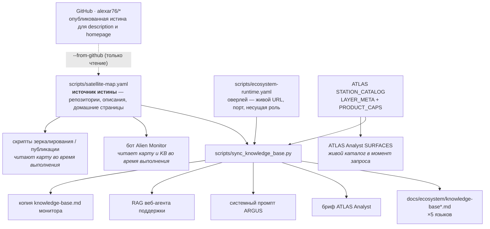

# Базы знаний агентов — где они лежат и как остаются актуальными

> 🌐 [English](knowledge-sources.md) · **Русский** · [Español](knowledge-sources-es.md) · [Français](knowledge-sources-fr.md) · [中文](knowledge-sources-zh.md)

Несколько агентов в этой экосистеме поставляются со встроенным знанием о том, что экосистема *из себя
представляет* — чтобы на вопрос «что такое MOMUS?» они отвечали правильно, а не догадывались и не
говорили, что не знают. Раньше это знание вписывалось в каждого из них руками по отдельности, и оно
разошлось: **MOMUS, Treasury, ATLAS и мосты отсутствовали в каждой без исключения базе знаний** —
при том что они были полностью построены, развёрнуты и документированы на пяти языках. Эта страница —
исправление и одновременно карта.

## Один источник, одна команда



```bash
python3 scripts/sync_knowledge_base.py --list
```

| Команда | Что делает |
|---|---|
| `--list` | каждая база знаний, её формат, язык и потребитель |
| `--check` | сообщить о расхождениях, ничего не менять — именно это запускает CI |
| `--write` | перегенерировать блок в каждой базе |
| `--from-github` | сверить карту с тем, что публичные репозитории говорят на самом деле |
| `--from-github --apply` | заполнить **пустые** поля карты из GitHub; о конфликтах сообщается, они никогда не перезаписываются |

## Кто отвечает за актуальность

**Никто — и это сделано намеренно.** Именованный владелец-человек — это ровно тот механизм, который
здесь и деградировал. Владельца заменяют три механических слоя:

1. **[`tests/test_knowledge_sync.py`](../../tests/test_knowledge_sync.py)** падает, когда компонент из
   карты отсутствует в любой базе знаний. База с расхождением не может пройти CI.
2. **`--check` в CI** при каждом изменении карты, оверлея или любого целевого файла.
3. **`--from-github`** заново читает опубликованные описания и домашние страницы репозиториев, поэтому
   карта не может сгнить относительно публичной истины. Он работает **только на чтение** — никогда
   ничего не отправляет. (Этот репозиторий пушится в Gitea; репозитории на GitHub — зеркало.)

Разделение труда, которое делает это безопасным: генератор владеет **перечнем** (какие компоненты
существуют, что каждый из них такое, где он работает). Он никогда не трогает окружающую прозу, потому
что эта проза несущая и написана человеком — «WARDEN ничего **не** оркестрирует» у ARGUS, «находит и
подписывает, но никогда не может заплатить себе сам» у MOMUS. Эти фразы предотвращают конкретные
неверные ответы, и генератор не должен их перефразировать.

## Базы, которые получают сгенерированный перечень

В каждой — один блок между маркерами; всё за пределами ограждения написано руками.

| Файл | Формат | Потребитель |
|---|---|---|
| [`docs/ecosystem/knowledge-base.md`](knowledge-base.md) | Markdown | общая база знаний экосистемы (EN) |
| [`docs/ecosystem/knowledge-base-ru.md`](knowledge-base-ru.md) | Markdown | общая база знаний (RU) |
| [`docs/ecosystem/knowledge-base-es.md`](knowledge-base-es.md) | Markdown | общая база знаний (ES) |
| [`docs/ecosystem/knowledge-base-fr.md`](knowledge-base-fr.md) | Markdown | общая база знаний (FR) |
| [`docs/ecosystem/knowledge-base-zh.md`](knowledge-base-zh.md) | Markdown | общая база знаний (ZH) |
| [`atlas/atlas/ecosystem_context.py`](https://github.com/alexar76/atlas/blob/main/atlas/ecosystem_context.py) | проза в строке Python | ATLAS Analyst |
| [`argus/src/ecosystem/knowledge.ts`](https://github.com/alexar76/argus/blob/main/src/ecosystem/knowledge.ts) | проза в шаблонной строке TS | ARGUS (клиент со стороны потребителя) |
| [`web/backend/services/support_rag_baseline.md`](../../web/backend/services/support_rag_baseline.md) | Markdown | веб-агент поддержки (лексический RAG) |

Ограждение во всех из них сделано HTML-комментарием, в том числе внутри строк Python и TypeScript —
инертен в каждом случае, невидим при рендеринге прозы:

```
<!-- BEGIN GENERATED ecosystem-components -->
<!-- END GENERATED ecosystem-components -->

<!-- BEGIN GENERATED physical-capabilities -->
<!-- END GENERATED physical-capabilities -->
```

Второе ограждение — таблица физических/картографических SKU из `STATION_CATALOG`. Новый пин в каталоге + `--write` — так каждый ассистент узнаёт SKU. ATLAS Analyst видит слои сразу (без sync).

Целевой файл **без** ограждения помечается как `NO-MARKERS` и никогда не пропускается молча. Именно
молчаливый пропуск и позволил исходному расхождению выжить.

## Базы, которым инъекция не нужна — они читают карту во время выполнения

| Файл | Потребитель |
|---|---|
| [`alien-monitor/backend/ecosystem_registry.py`](https://github.com/alexar76/alien-monitor/blob/main/backend/ecosystem_registry.py) | AI-бот Alien Monitor |
| [`scripts/mirror_satellites.sh`](../../scripts/mirror_satellites.sh) | инструменты зеркалирования / публикации |
| [`atlas/atlas/capability_awareness.py`](https://github.com/alexar76/atlas/blob/main/atlas/capability_awareness.py) | ATLAS Analyst SURFACES — живой каталог в момент запроса |
| [`logos/logos/app.py`](https://github.com/alexar76/logos/blob/main/logos/app.py) | LOGOS — живой Hub `GET /api/v1/federation/capabilities` |

`--write` также копирует EN-базу в [`alien-monitor/docs/ecosystem/knowledge-base.md`](https://github.com/alexar76/alien-monitor/blob/main/docs/ecosystem/knowledge-base.md).

Это паттерн получше, и именно его обобщает синхронизация: бот монитора собирает контекст своего
промпта из `satellite-map.yaml` при каждом запросе, поэтому он ни разу не разошёлся. Предпочитайте
его для всего нового, что может загрузить файл во время выполнения; инъекция — для промптов, которые
обязаны поставляться статической строкой.

## Хранилища знаний, которые сознательно НЕ берут перечень

Перечислены с причинами, потому что «а почему вот этот не синхронизирован?» — это тот самый вопрос,
который заканчивается 35-строчным перечнем, вставленным в промпт, где он приносит вред.

| Файл | Почему нет |
|---|---|
| [`skopos/skopos/agent/ecosystem_briefing.py`](https://github.com/alexar76/skopos/blob/main/skopos/agent/ecosystem_briefing.py) | Промпт дежурного SRE, ограниченный 180 словами, который читает **живые** данные о хостах. Статический перечень вытеснил бы сигнал о здоровье, ради сводки которого он и существует. |
| [`web/backend/services/methodology_knowledge.py`](../../web/backend/services/methodology_knowledge.py) | Хранилище уроков/кейсов Агента методологии. Он *учится* на результатах ревью, и его нельзя засевать статическими фактами. |
| [`metis/scripts/seed_ecosystem_knowledge.py`](https://github.com/alexar76/metis/blob/main/scripts/seed_ecosystem_knowledge.py) | Отобранные пары вопрос-ответ о **самом Metis** для RAG с опорой на источники (grounded). Перечень компонентов принадлежит общей базе знаний, на которую указывают его ответы. |
| [`helios/helios/knowledge/mnemosyne.py`](https://github.com/alexar76/helios/blob/main/helios/knowledge/mnemosyne.py) | Ридер BM25 только для чтения над `mnemosyne.json` от DIOSCURI. Этот корпус DIOSCURI строит из живых источников (README, релизы, документация), поэтому он подхватывает новые спутники без инъекции. |
| [`momus/momus/config.py`](https://github.com/alexar76/momus/blob/main/momus/config.py) | MOMUS узнаёт, что существует, из своего **allowlist целей** (белого списка), а не из прозы. Компонент, который ему разрешено проверять пробами, должен быть зарегистрирован осознанно — перечень в его промпте побуждал бы его отправлять пробы туда, где этого никто не разрешал. |

## Добавление спутника: вся процедура

1. Добавьте запись в [`scripts/satellite-map.yaml`](../../scripts/satellite-map.yaml).
2. Если у него есть живая поверхность или роль, которую описание репозитория формулирует неточно,
   добавьте его в [`scripts/ecosystem-runtime.yaml`](../../scripts/ecosystem-runtime.yaml). **Только
   публичные хостнеймы** — загрузчик отказывает «голому» IP, потому что эти факты попадают в
   публикуемую документацию и лендинги.
3. Запустите `python3 scripts/sync_knowledge_base.py --write`.
4. Закоммитьте. `--check` в CI подтвердит, что все базы согласованы.

## Добавление физического / картографического SKU (ассистенты узнают сами)

1. Зарегистрируйте устройство на GAIA (`live.py` / `live_p2.py`) и зеркальте в `STATION_CATALOG` ([add-gaia-atlas-sensor.md](../add-gaia-atlas-sensor.md)).
2. `python3 scripts/sync_knowledge_base.py --write` — все базы (×5), ARGUS, бриф Analyst, RAG поддержки и копия KB монитора получают SKU. ATLAS Analyst видит слой сразу, без sync.
3. Коммит. CI упадёт, если каталог вырос, а таблица не перегенерирована.

Живой поиск Hub — **потолок**; сгенерированная таблица — **пол**. Не выдумывать SKU.

Терминология для любой прозы, которую вы пишете вокруг блока:
[`docs/localization-glossary.md`](../localization-glossary.md) — источник истины, и в нём есть раздел
MOMUS / Treasury.

## Известное состояние (2026-08-08)

`--from-github` сейчас сообщает, и это правда:

- **`momus` и `treasury` опубликованы на GitHub** как [`alexar76/momus`](https://github.com/alexar76/momus) и [`alexar76/treasury`](https://github.com/alexar76/treasury) (Pages: [momus](https://alexar76.github.io/momus/), [treasury](https://alexar76.github.io/treasury/); live: [momus.modelmarket.dev](https://momus.modelmarket.dev)).
- **1 конфликт** в описании репозитория `profile` — значение есть с обеих сторон, поэтому он ждёт
  решения человека, а не перезаписывается молча.
- 12 пустых полей homepage были заполнены из GitHub при первом запуске.
