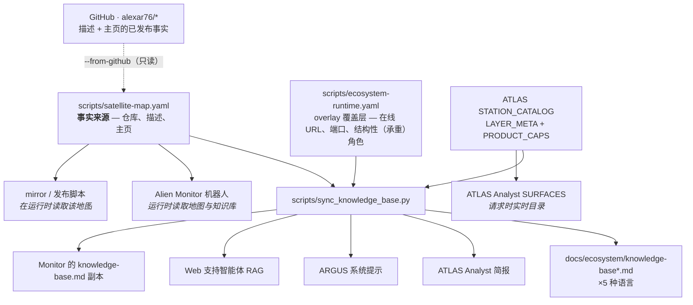

# 智能体知识库 —— 它们在哪里，以及如何保持最新

> 🌐 [English](knowledge-sources.md) · [Русский](knowledge-sources-ru.md) · [Español](knowledge-sources-es.md) · [Français](knowledge-sources-fr.md) · **中文**

本生态系统里有若干智能体在出厂时就内置了关于这个生态系统*是什么*的知识 —— 这样它们在被问到「MOMUS
是什么？」时能答对，而不是靠猜或者说自己不知道。这些知识过去是分别手工敲进每一个智能体里的，于是它
漂移了：**MOMUS、Treasury、ATLAS 和 bridges 在每一个知识库里都是缺失的**，而它们其实早已完整构建、
部署，并且有五种语言的文档。本页就是对此的修正，同时也是那张地图。

## 一个来源，一条命令



```bash
python3 scripts/sync_knowledge_base.py --list
```

| 命令 | 作用 |
|---|---|
| `--list` | 列出每一个知识库，及其格式、语言和消费方 |
| `--check` | 报告漂移，不改动任何东西 —— 这是 CI 运行的那条 |
| `--write` | 在每个知识库中重新生成那个块 |
| `--from-github` | 把地图与公开仓库实际写的内容做比对 |
| `--from-github --apply` | 用 GitHub 的内容填充地图里**空白**的字段；冲突只会被报告，绝不被覆盖 |

## 谁负责让它保持最新

**没有人 —— 这是刻意的。** 指定一个有名有姓的人类负责人，恰恰就是在这里腐坏掉的那套机制。三层机械
化的保障取代了负责人：

1. **[`tests/test_knowledge_sync.py`](../../tests/test_knowledge_sync.py)** 会在地图中的某个组件从任
   一知识库里缺失时失败。已经漂移的知识库无法通过 CI。
2. **CI 里的 `--check`** —— 对地图、overlay 覆盖层或任何目标文件的每一次改动都会跑。
3. **`--from-github`** 会重新读取已发布的仓库描述和主页，于是地图无法相对于公开的事实烂掉。它是**只
   读**的 —— 它从不推送任何东西。（本仓库推送到 Gitea；GitHub 上那些仓库是镜像。）

让这件事安全的分工是：生成器拥有**组件名录**（有哪些组件存在、每个是什么、在哪里运行）。它绝不触碰
周围的散文，因为那些散文是承重的、由人手写的 —— ARGUS 的「WARDEN **不**编排任何东西」，MOMUS 的
「它能发现并签名，但永远不能给自己付钱」。这些句子的作用是阻止特定的错误答案，而生成器绝不能去改写
它们。

## 接收生成名录的那些知识库

每个都只有一个围栏块；围栏之外的一切都是手写的。

| 文件 | 格式 | 消费方 |
|---|---|---|
| [`docs/ecosystem/knowledge-base.md`](knowledge-base.md) | Markdown | 生态系统共享知识库（EN） |
| [`docs/ecosystem/knowledge-base-ru.md`](knowledge-base-ru.md) | Markdown | 共享知识库（RU） |
| [`docs/ecosystem/knowledge-base-es.md`](knowledge-base-es.md) | Markdown | 共享知识库（ES） |
| [`docs/ecosystem/knowledge-base-fr.md`](knowledge-base-fr.md) | Markdown | 共享知识库（FR） |
| [`docs/ecosystem/knowledge-base-zh.md`](knowledge-base-zh.md) | Markdown | 共享知识库（ZH） |
| [`atlas/atlas/ecosystem_context.py`](https://github.com/alexar76/atlas/blob/main/atlas/ecosystem_context.py) | Python 字符串里的散文 | ATLAS Analyst |
| [`argus/src/ecosystem/knowledge.ts`](https://github.com/alexar76/argus/blob/main/src/ecosystem/knowledge.ts) | TS 模板字面量里的散文 | ARGUS（需求侧客户端） |
| [`web/backend/services/support_rag_baseline.md`](../../web/backend/services/support_rag_baseline.md) | Markdown | Web 支持智能体（词法 RAG） |

在所有这些文件里，围栏都用一个 HTML 注释来标记，包括在 Python 和 TypeScript 字符串内部 —— 它在每一
种里都是惰性的，而在散文渲染出来时又是不可见的：

```
<!-- BEGIN GENERATED ecosystem-components -->
<!-- END GENERATED ecosystem-components -->

<!-- BEGIN GENERATED physical-capabilities -->
<!-- END GENERATED physical-capabilities -->
```

第二道围栏是来自 `STATION_CATALOG` 的物理/地图 SKU 表。目录新增针脚 + `--write`，就是每个助手学会该 SKU 的方式。ATLAS Analyst 立即看到图层（无需 sync）。

一个**没有**围栏的目标文件会被报告为 `NO-MARKERS`，绝不被静默跳过。静默跳过正是最初那次漂移能够存
活下来的方式。

## 不需要注入的那些知识库 —— 它们在运行时读取地图

| 文件 | 消费方 |
|---|---|
| [`alien-monitor/backend/ecosystem_registry.py`](https://github.com/alexar76/alien-monitor/blob/main/backend/ecosystem_registry.py) | Alien Monitor AI 机器人 |
| [`scripts/mirror_satellites.sh`](../../scripts/mirror_satellites.sh) | mirror / 发布工具链 |
| [`atlas/atlas/capability_awareness.py`](https://github.com/alexar76/atlas/blob/main/atlas/capability_awareness.py) | ATLAS Analyst SURFACES — 请求时实时目录 |
| [`logos/logos/app.py`](https://github.com/alexar76/logos/blob/main/logos/app.py) | LOGOS — 实时 Hub `GET /api/v1/federation/capabilities` |

`--write` 还会把英文知识库复制到 [`alien-monitor/docs/ecosystem/knowledge-base.md`](https://github.com/alexar76/alien-monitor/blob/main/docs/ecosystem/knowledge-base.md)。

这是更好的模式，也是这套同步机制所要推广的模式：monitor 的机器人在每次请求时都从
`satellite-map.yaml` 构建它的提示上下文，所以它从来没有漂移过。任何能在运行时加载文件的新东西都应优
先采用这种方式；注入只留给那些必须以静态字符串形式交付的提示。

## 刻意不接收名录的知识存储

把原因一并列出来，是因为「这个怎么没同步？」正是那种最终导致一份 35 行的名录被粘进某个提示、并在那
里造成损害的问题。

| 文件 | 为什么不 |
|---|---|
| [`skopos/skopos/agent/ecosystem_briefing.py`](https://github.com/alexar76/skopos/blob/main/skopos/agent/ecosystem_briefing.py) | 一个上限 180 词的待命 SRE 提示，读取主机的**实时**数据。静态名录会挤掉它本来就是为了概括而存在的健康信号。 |
| [`web/backend/services/methodology_knowledge.py`](../../web/backend/services/methodology_knowledge.py) | Methodology Agent 的经验/案例存储。它从评审结果中*学习*，不得用静态事实预先填充。 |
| [`metis/scripts/seed_ecosystem_knowledge.py`](https://github.com/alexar76/metis/blob/main/scripts/seed_ecosystem_knowledge.py) | 关于 **Metis 自身**的精选问答对，供有据可依（grounded）的 RAG 使用。组件名录该待在它的回答所指向的那个共享知识库里。 |
| [`helios/helios/knowledge/mnemosyne.py`](https://github.com/alexar76/helios/blob/main/helios/knowledge/mnemosyne.py) | 一个针对 DIOSCURI 的 `mnemosyne.json` 的只读 BM25 读取器。那份语料由 DIOSCURI 从实时来源（README、release、文档）构建，所以它无需任何注入就能收进新卫星。 |
| [`momus/momus/config.py`](https://github.com/alexar76/momus/blob/main/momus/config.py) | MOMUS 是从它的**目标 allowlist（白名单）**、而不是从散文里知道有什么东西存在的。一个它可以探测的组件必须被刻意注册进去 —— 在它的提示里放一份名录，等于是在邀请它去探测没有任何人授权过的东西。 |

## 添加一个卫星：完整流程

1. 把条目加到 [`scripts/satellite-map.yaml`](../../scripts/satellite-map.yaml)。
2. 如果它有在线的对外表面，或者它的角色在仓库简介里说得不够准确，就把它加到
   [`scripts/ecosystem-runtime.yaml`](../../scripts/ecosystem-runtime.yaml)。**只写公开主机名** ——
   加载器会拒绝一个裸 IP，因为这些事实会随已发布的文档和落地页一起发出去。
3. 运行 `python3 scripts/sync_knowledge_base.py --write`。
4. 提交。CI 的 `--check` 会确认每个知识库都一致。

## 添加物理 / 地图 SKU（助手自动获知）

1. 在 GAIA 注册设备（`live.py` / `live_p2.py`）并镜像到 `STATION_CATALOG`（[add-gaia-atlas-sensor.md](../add-gaia-atlas-sensor.md)）。
2. `python3 scripts/sync_knowledge_base.py --write` — 五种语言知识库、ARGUS、Analyst 简报、支持 RAG 与 Monitor 的 KB 副本都会收到该 SKU。ATLAS Analyst 立即看到图层，无需 sync。
3. 提交。若目录增长而表未重新生成，CI 会失败。

Hub 实时搜索是**上限**；生成表是**下限**。不要捏造 SKU。

你在这个块周围写任何散文时所依据的术语：[`docs/localization-glossary.md`](../localization-glossary.md)
是事实来源，其中有一个 MOMUS / Treasury 小节。

## 已知状态（2026-08-08）

`--from-github` 目前如实报告：

- **`momus` 与 `treasury` 已发布到 GitHub**：[`alexar76/momus`](https://github.com/alexar76/momus)、[`alexar76/treasury`](https://github.com/alexar76/treasury)（Pages：[momus](https://alexar76.github.io/momus/)、[treasury](https://alexar76.github.io/treasury/)；线上：[momus.modelmarket.dev](https://momus.modelmarket.dev)）。
- **1 处冲突**，在 `profile` 仓库的描述上 —— 双方都有值，所以它在等一个人来决定，而不是被静默覆盖。
- 首次运行时，有 12 个空白的主页字段从 GitHub 填入。
