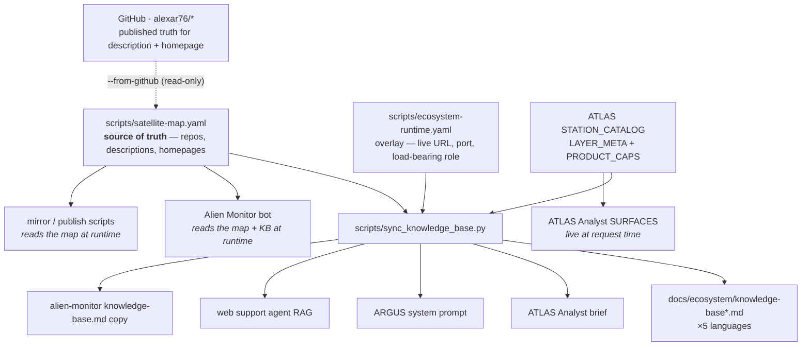

# Agent knowledge bases — where they live and how they stay current

> 🌐 **English** · [Русский](knowledge-sources-ru.md) · [Español](knowledge-sources-es.md) · [Français](knowledge-sources-fr.md) · [中文](knowledge-sources-zh.md)

Several agents in this ecosystem ship with built-in knowledge of what the ecosystem *is* — so they
answer "what is MOMUS?" correctly instead of guessing or saying they do not know. That knowledge used
to be hand-typed into each of them separately, and it drifted: **MOMUS, Treasury, ATLAS and the
bridges were absent from every single knowledge base** while being fully built, deployed and
documented in five languages. This page is the fix, and the map.

## One source, one command



```bash
python3 scripts/sync_knowledge_base.py --list
```

| Command | What it does |
|---|---|
| `--list` | every knowledge base, its format, language and consumer |
| `--check` | report drift, change nothing — this is what CI runs |
| `--write` | regenerate the block in every base |
| `--from-github` | compare the map against what the public repos actually say |
| `--from-github --apply` | fill **blank** map fields from GitHub; conflicts are reported, never overwritten |

## Who is responsible for keeping it current

**Nobody — deliberately.** A named human owner is exactly the mechanism that decayed here. Three
mechanical layers replace the owner:

1. **[`tests/test_knowledge_sync.py`](../../tests/test_knowledge_sync.py)** fails when a component in
   the map is missing from any knowledge base. A drifted base cannot pass CI.
2. **`--check` in CI** on every change to the map, the overlay, or any target file.
3. **`--from-github`** re-reads the published repo descriptions and homepages, so the map cannot rot
   against the public truth. It is **read-only** — it never pushes anything. (This repo pushes to
   Gitea; the GitHub repos are a mirror.)

The division of labour that makes this safe: the generator owns the **roster** (which components
exist, what each is, where it runs). It never touches the surrounding prose, because that prose is
load-bearing and human-authored — ARGUS's "WARDEN does **not** orchestrate anything", MOMUS's "finds
and signs but can never pay itself". Those sentences prevent specific wrong answers, and a generator
must not paraphrase them.

## The bases that receive the generated roster

Each has one fenced block; everything outside the fence is hand-written.

| File | Format | Consumer |
|---|---|---|
| [`docs/ecosystem/knowledge-base.md`](knowledge-base.md) | Markdown | shared ecosystem knowledge base (EN) |
| [`docs/ecosystem/knowledge-base-ru.md`](knowledge-base-ru.md) | Markdown | shared knowledge base (RU) |
| [`docs/ecosystem/knowledge-base-es.md`](knowledge-base-es.md) | Markdown | shared knowledge base (ES) |
| [`docs/ecosystem/knowledge-base-fr.md`](knowledge-base-fr.md) | Markdown | shared knowledge base (FR) |
| [`docs/ecosystem/knowledge-base-zh.md`](knowledge-base-zh.md) | Markdown | shared knowledge base (ZH) |
| [`atlas/atlas/ecosystem_context.py`](https://github.com/alexar76/atlas/blob/main/atlas/ecosystem_context.py) | prose in a Python string | ATLAS Analyst |
| [`argus/src/ecosystem/knowledge.ts`](https://github.com/alexar76/argus/blob/main/src/ecosystem/knowledge.ts) | prose in a TS template literal | ARGUS (demand-side client) |
| [`web/backend/services/support_rag_baseline.md`](../../web/backend/services/support_rag_baseline.md) | Markdown | web support agent (lexical RAG) |

The generator owns the **roster** (which components exist) and the **physical/map SKU table**
(from ATLAS `STATION_CATALOG`). It never touches the surrounding prose.

Each target has **two** fenced blocks:

```
<!-- BEGIN GENERATED ecosystem-components -->
<!-- END GENERATED ecosystem-components -->

<!-- BEGIN GENERATED physical-capabilities -->
<!-- END GENERATED physical-capabilities -->
```

A target file **without** the fence is reported as `NO-MARKERS`, never silently skipped. Silent
skipping is precisely how the original drift survived.

## The bases that need no injection — they read the map at runtime

| File | Consumer |
|---|---|
| [`alien-monitor/backend/ecosystem_registry.py`](https://github.com/alexar76/alien-monitor/blob/main/backend/ecosystem_registry.py) | Alien Monitor AI bot |
| [`scripts/mirror_satellites.sh`](../../scripts/mirror_satellites.sh) | mirror / publish tooling |
| [`atlas/atlas/capability_awareness.py`](https://github.com/alexar76/atlas/blob/main/atlas/capability_awareness.py) | ATLAS Analyst surfaces — live from `STATION_CATALOG` at request time |
| [`logos/logos/app.py`](https://github.com/alexar76/logos/blob/main/logos/app.py) | LOGOS assistant — live Hub `GET /api/v1/federation/capabilities` |

`--write` also copies the EN knowledge base to the Monitor fallback:

| Source | Mirror |
|---|---|
| [`docs/ecosystem/knowledge-base.md`](knowledge-base.md) | [`alien-monitor/docs/ecosystem/knowledge-base.md`](https://github.com/alexar76/alien-monitor/blob/main/docs/ecosystem/knowledge-base.md) |

This is the better pattern and the one the sync generalises: the monitor's bot builds its prompt
context from `satellite-map.yaml` on every request, so it has never drifted. Prefer this for anything
new that can load a file at runtime; injection is for prompts that must ship as a static string.

## Knowledge stores that deliberately take NO roster

Listed with reasons, because "why isn't this one synced?" is the question that ends with a 35-line
roster pasted into a prompt where it does damage.

| File | Why not |
|---|---|
| [`skopos/skopos/agent/ecosystem_briefing.py`](https://github.com/alexar76/skopos/blob/main/skopos/agent/ecosystem_briefing.py) | An on-call SRE prompt capped at 180 words that reads **live** host data. A static roster would crowd out the health signal it exists to summarise. |
| [`web/backend/services/methodology_knowledge.py`](../../web/backend/services/methodology_knowledge.py) | The Methodology Agent's lesson/case store. It *learns* from review outcomes and must not be seeded with static facts. |
| [`metis/scripts/seed_ecosystem_knowledge.py`](https://github.com/alexar76/metis/blob/main/scripts/seed_ecosystem_knowledge.py) | Curated Q&A pairs about **Metis itself** for grounded RAG. The component roster belongs in the shared knowledge base its answers point to. |
| [`helios/helios/knowledge/mnemosyne.py`](https://github.com/alexar76/helios/blob/main/helios/knowledge/mnemosyne.py) | A read-only BM25 reader over DIOSCURI's `mnemosyne.json`. That corpus is built by DIOSCURI from live sources (READMEs, releases, docs), so it picks up new satellites without an injection. |
| [`momus/momus/config.py`](https://github.com/alexar76/momus/blob/main/momus/config.py) | MOMUS learns what exists from its **target allowlist**, not from prose. A component it may probe has to be registered deliberately — a roster in its prompt would invite it to probe things nobody authorised. |

## Adding a satellite: the whole procedure

1. Add the entry to [`scripts/satellite-map.yaml`](../../scripts/satellite-map.yaml).
2. If it has a live surface or a role that the repo blurb states imprecisely, add it to
   [`scripts/ecosystem-runtime.yaml`](../../scripts/ecosystem-runtime.yaml). **Public hostnames
   only** — the loader refuses a bare IP, because these facts ship in published docs and landings.
3. Run `python3 scripts/sync_knowledge_base.py --write`.
4. Commit. CI's `--check` confirms every base agrees.

## Adding a physical / map SKU (automatic assistant awareness)

1. Register the device on GAIA (`live.py` / `live_p2.py`) and mirror it into
   [`atlas/atlas/stations.py`](https://github.com/alexar76/atlas/blob/main/atlas/stations.py) `STATION_CATALOG` (and `LAYER_META` if it is a new layer). Recipe: [`add-gaia-atlas-sensor.md`](../add-gaia-atlas-sensor.md).
2. Run `python3 scripts/sync_knowledge_base.py --write`. Every knowledge base (×5 languages), ARGUS, ATLAS Analyst brief, web support RAG, and the Alien Monitor KB copy receive the new SKU. ATLAS Analyst also sees it **immediately** via `analyst_surfaces_brief()` — no sync needed for the map prompt.
3. Commit. CI fails if the catalog grew and the generated table was not regenerated.

Live Hub search (`GET https://modelmarket.dev/ai-market/v2/search`) remains the **ceiling**; the generated table is the **floor**. Assistants must not invent SKUs absent from either.

Terminology for any prose you write around the block: [`docs/localization-glossary.md`](../localization-glossary.md)
is the source of truth, and it has a MOMUS / Treasury section.

## Known state (2026-08-08)

`--from-github` currently reports, truthfully:

- **`momus` and `treasury` are published on GitHub** as [`alexar76/momus`](https://github.com/alexar76/momus) and [`alexar76/treasury`](https://github.com/alexar76/treasury) (Pages: [momus](https://alexar76.github.io/momus/), [treasury](https://alexar76.github.io/treasury/); live: [momus.modelmarket.dev](https://momus.modelmarket.dev)).
- **1 conflict** on the `profile` repo description — both sides have a value, so it waits for a human
  decision rather than being silently overwritten.
- 12 blank homepages were filled from GitHub on first run.
