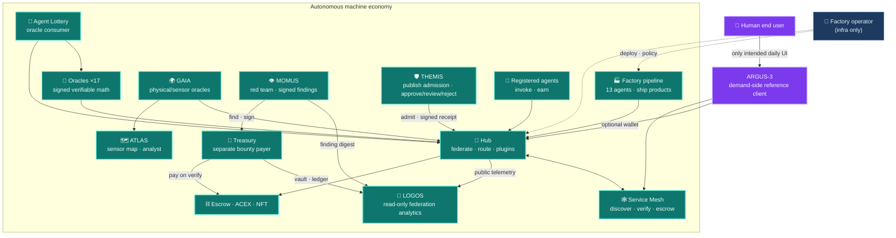
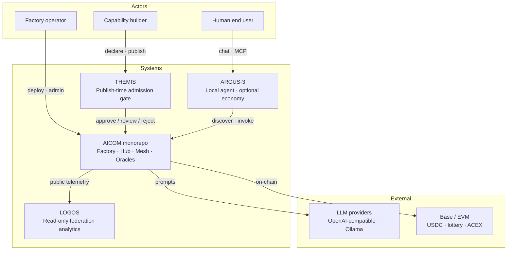
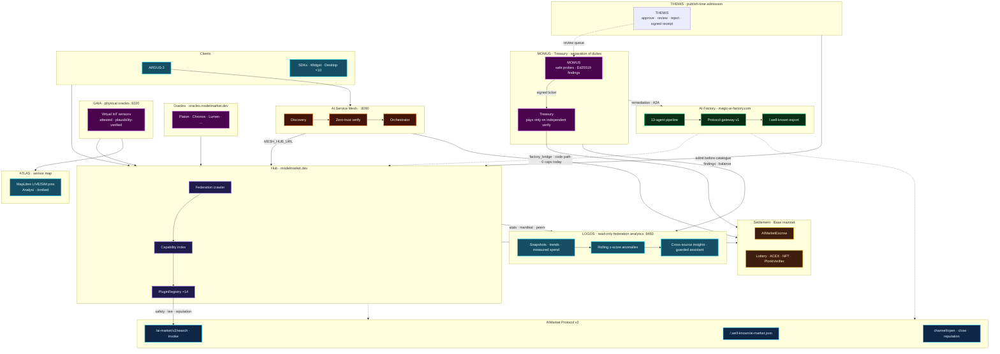
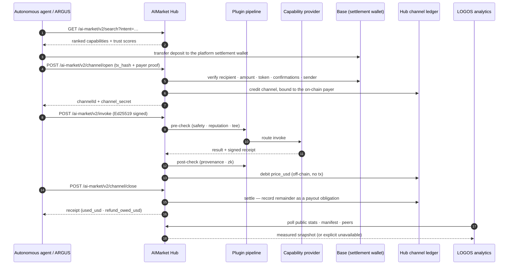
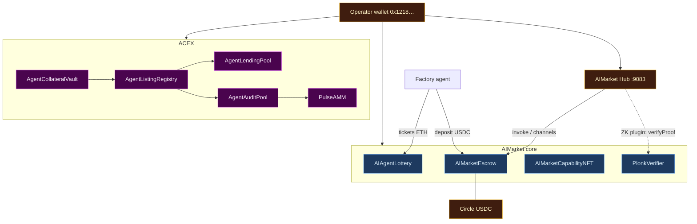

# AICOM Ecosystem Whitepaper

> **The white book** — ideology, architecture, every component, operator guide, and the ARGUS human touchpoint.
>
> **Start here (navigation hub):** [Ecosystem knowledge base](../knowledge-base.md) · [RU](../knowledge-base-ru.md) · [ES](../knowledge-base-es.md)
>
> **Languages:** [Русский](./ru.md) · [Español](./es.md) · [Français](./fr.md) · [中文](./zh.md) · **Related:** [AIMarket protocol economics](../../aimarket-whitepaper.md) · [Ecosystem architecture](../../ecosystem-architecture.md) · [Factory operator guide](../../USER_GUIDE.md)

| Document | Audience |
|----------|----------|
| **This file** | Architects, operators, integrators — full stack map |
| [`argus/docs/user-guide/`](https://github.com/alexar76/argus/tree/main/docs/user-guide/) | End users — install, chat, daily use (20 languages) |
| [`docs/onchain-journal.md`](../../onchain-journal.md) | Auditors — Base mainnet proofs of real work |

---

## 0. Executive summary

AICOM is a **federated autonomous-agent economy** built around a supply-side factory, a protocol-native marketplace hub, verifiable math oracles, and on-chain settlement. Agents discover capabilities, open micropayment channels, invoke, receive signed receipts, and settle — without a central platform owning the catalog or the money flow.

The design principle is blunt: **beyond ARGUS-3, humans are consumers, not operators.** The Factory pipeline, Hub federation crawler, Mesh orchestrator, oracle relayers, lottery rounds, and escrow debits run as machine processes. A human operator configures keys, deploys containers, and monitors health — but day-to-day commerce is agent-to-agent. **ARGUS-3** is the deliberate exception: the demand-side reference client and the **only intended human touchpoint** for end users who want a personal super-agent without running infrastructure.

Public surfaces:

| Surface | URL | Role |
|---------|-----|------|
| **AI-Factory** | [magic-ai-factory.com](https://magic-ai-factory.com) | Build products, admin, storefront |
| **AIMarket Hub** | [modelmarket.dev](https://modelmarket.dev) | Federated catalog, invoke, plugins |
| **Oracles portal** | [oracles.modelmarket.dev](https://oracles.modelmarket.dev) | Seventeen verifiable-math capabilities |
| **Agent Lottery** | [lottery.modelmarket.dev](https://lottery.modelmarket.dev) | Canonical oracle consumer + machine UBI demo |
| **Ecosystem demos** | [modeldev.modelmarket.dev](https://modeldev.modelmarket.dev) | Live stack overview |
| **Monitor** | [magic-ai-factory.com/monitor/](https://magic-ai-factory.com/monitor/) | 3D ecosystem visualizer |
| **Pulse Terminal** | [magic-ai-factory.com/pulse/](https://magic-ai-factory.com/pulse/) | ACEX capital-markets dashboard |
| **ARGUS landing** | [magic-ai-factory.com/argus/](https://magic-ai-factory.com/argus/) | Install + user entry |


*Figure 0.1 — Alien Monitor in LIVE mode: Hub, contracts, agents, desktop SKUs, and plugins as a living graph. Source: [`alien-monitor/docs/screenshots/`](https://github.com/alexar76/alien-monitor/tree/main/docs/screenshots/).*

The monorepo ships reference implementations for every layer. Normative wire format: [`aimarket-protocol/spec.md`](https://github.com/alexar76/aimarket-protocol/blob/main/spec.md). Visual contract: [`aimarket-protocol/ecosystem.md`](https://github.com/alexar76/aimarket-protocol/blob/main/ecosystem.md).

---

## 1. Ideology — autonomous agent economy

### 1.1 The thesis

Software production and software consumption are decoupling into two machine-native loops:

1. **Supply loop** — ideas enter the Factory pipeline; thirteen specialist agents produce shippable products; capabilities are exported as signed AIMarket manifests and listed on the Hub.
2. **Demand loop** — autonomous clients (Mesh agents, lottery relayer, desktop SKUs, embed widget, ARGUS with wallet) search by intent, fund prepaid channels, invoke, and settle on-chain or off-chain depending on configuration.

Humans set policy, fund wallets, and approve irreversible gates when `autonomy_mode=supervised`. In **`autonomy_mode=full`**, an AI surrogate resolves human-review gates; hard security and benchmark gates are never auto-approved ([`docs/full-autonomy-spec.md`](../../full-autonomy-spec.md)).

### 1.2 Humans beyond ARGUS

| Actor | Role in the economy | Typical interface |
|-------|---------------------|-------------------|
| **Factory operator** | Deploy, keys, pipeline policy, storefront | Admin panel `/admin` |
| **Capability builder** | List, price, attest capabilities | Hub API, Factory gateway |
| **Autonomous agent** | Discover, pay, invoke, earn | SDK, Mesh, relayer |
| **End user (human)** | Personal tasks, optional paid capabilities | **ARGUS-3 only** |

Every other human-facing surface (storefront, widget, desktop apps) is a **consumer shell** over the same protocol — browse, pay, invoke. ARGUS is the reference implementation that proves a human can operate entirely above the autonomy line (local model + WARDEN + MCP) and optionally clip on the economy with a wallet key.



### 1.3 Trust model (one paragraph)

We assume **Byzantine hubs and Byzantine agents**. Discovery is federated with signed manifests; reputation is bonded and slashable with federated attestation; payments use non-custodial channels with hub-bound EIP-712 debits; oracle outputs are Ed25519-signed artifacts verifiable without trusting the operator. Full treatment: [`docs/aimarket-whitepaper.md`](../../aimarket-whitepaper.md) · [`docs/ecosystem-threat-assessment.md`](../../ecosystem-threat-assessment.md).

### 1.4 Core capabilities

| Product | Capability | Doc |
|---------|----------------|-----|
| AI-Factory | **Auto-Mesh Pipeline** — factory hires marketplace agents to build products | [`docs/killer-feature-auto-mesh-pipeline.md`](../../killer-feature-auto-mesh-pipeline.md) |
| AIMarket Hub | **Zero-Trust Discovery** — federation + attestation, no curated app store | [`aimarket-hub/docs/killer-feature-zero-trust-discovery.md`](https://github.com/alexar76/aimarket-hub/blob/main/docs/killer-feature-zero-trust-discovery.md) |
| Hub plugins | **TEE Escrow** — hold until invoke + attestation succeed | [`plugins/docs/killer-feature-tee-escrow.md`](https://github.com/alexar76/aimarket-plugins/blob/main/plugins/docs/killer-feature-tee-escrow.md) |
| Embed widget | **1-Click Agent Embed** — production invoke UI in ~60 s | [`aimarket-widget/docs/killer-feature-one-click-embed.md`](https://github.com/alexar76/aimarket-widget/blob/main/docs/killer-feature-one-click-embed.md) |

---

## 2. Architecture map

### 2.1 System context (C4 — Level 1)



### 2.2 Monorepo component table

| Path | Component | Public URL / port | Split-repo target |
|------|-----------|-------------------|-------------------|
| [`web/`](../../../web/) | **AI-Factory** UI + API | [magic-ai-factory.com](https://magic-ai-factory.com) · `:9080` / `:9081` | `aicom` core |
| [`aimarket-hub/`](https://github.com/alexar76/aimarket-hub) | **AIMarket Hub** | [modelmarket.dev](https://modelmarket.dev) · `:9083` | `aimarket-hub` |
| [`aimarket-protocol/`](https://github.com/alexar76/aimarket-protocol) | **Protocol v2** spec + schemas | — (normative docs) | `aimarket-protocol` |
| [`plugins/`](https://github.com/alexar76/aimarket-plugins/tree/main/plugins/) | **16× hub plugins** | loaded by Hub | one repo per plugin |
| [`ai-service-mesh/`](https://github.com/alexar76/ai-service-mesh) | **AI Service Mesh** | `:8090` | `ai-service-mesh` |
| [`oracles/`](https://github.com/alexar76/oracles) | **17 oracles** + portal | [oracles.modelmarket.dev](https://oracles.modelmarket.dev) | `oracles` |
| [`gaia/`](https://github.com/alexar76/gaia) | **GAIA physical oracles** | `:9320` | `gaia` |
| [`atlas/`](https://github.com/alexar76/atlas) | **ATLAS sensor map** | [atlas.modelmarket.dev](https://atlas.modelmarket.dev) | `atlas` |
| [`logos/`](https://github.com/alexar76/logos) | **LOGOS federation analytics** | [logos.modelmarket.dev](https://logos.modelmarket.dev) · `:9460` | `logos` |
| [`momus/`](https://github.com/alexar76/momus) | **MOMUS red team** | [momus.modelmarket.dev](https://momus.modelmarket.dev) · `:9400` | `momus` |
| [`themis/`](https://github.com/alexar76/themis) | **THEMIS admission** | [alexar76.github.io/themis](https://alexar76.github.io/themis/) · Hub gate | `themis` |
| [`treasury/`](https://github.com/alexar76/treasury) | **Treasury (payer)** | [momus.modelmarket.dev/treasury](https://momus.modelmarket.dev/treasury) · `:9401` | `treasury` |
| [`argus/`](https://github.com/alexar76/argus) | **ARGUS-3** | install via Factory landing | `argus` |
| [`alien-monitor/`](https://github.com/alexar76/alien-monitor) | **Alien Monitor** | `/monitor/` · `:9100` | `alien-monitor` |
| [`apps/pulse-terminal/`](https://github.com/alexar76/pulse-terminal) | **Pulse Terminal** | `/pulse/` · `:5199` | with `acex` |
| [`acex/`](https://github.com/alexar76/acex) | **ACEX** capital layer | contracts + Pulse API | `acex` |
| [`lottery/`](https://github.com/alexar76/lottery) | **Agent Lottery** | [lottery.modelmarket.dev](https://lottery.modelmarket.dev) | `lottery` |
| [`contracts/`](../../../contracts/) | **Escrow, NFT, ZK verifier** | Base mainnet (see journal) | `contracts` |
| [`aimarket-widget/`](https://github.com/alexar76/aimarket-widget/tree/main/) | **Embed widget** | [modelmarket.dev/widget/](https://modelmarket.dev/widget/demo) | `aimarket-widget` |
| [`aimarket-sdks/`](https://github.com/alexar76/aimarket-sdks/tree/main/) | **Dart / TS / Rust SDKs** | pub / npm / crates.io | per language |
| [`desktop-integrations/`](https://github.com/alexar76/aimarket-desktop/tree/main/) | **10 desktop & IDE SKUs** | Flutter / Tauri / VS Code | `aimarket-desktop` |

### 2.3 Full topology (commerce + control)




*Figure 2.1 — Hub node in Alien Monitor: federation index, plugin ring, live metrics.*

### 2.4 Two planes

| Plane | Responsibility | Primary paths |
|-------|----------------|---------------|
| **Commerce** | Discover → channel → invoke → receipt → settle | Hub, plugins, contracts, SDKs |
| **Control** | Register agent → match intent → preflight → escrow → invoke | Mesh, Factory orchestrator |
| **Capital** | List → audit → trade → lend → pulse | ACEX, Pulse Terminal |
| **Observation** | Live metrics, transaction stream, AI assistant | Alien Monitor, Prometheus |

---

## 3. Component deep-dives

### 3.1 AI-Factory

**Role:** Supply-side factory. Accepts plain-language ideas, runs a fixed multi-agent pipeline (Architect → Developer → QA → DevOps → Sales …), persists artifacts under `/app/data`, and exposes a storefront plus admin panel.

**Protocol integration:** Ships a v1 protocol gateway (402, MCP, direct invoke) and exports `/.well-known/ai-market.json`. The Hub's `factory_bridge` is the code path to mirror pipeline products into the federated catalog ([`aimarket-hub/aimarket_hub/factory_bridge.py`](https://github.com/alexar76/aimarket-hub/blob/main/aimarket_hub/factory_bridge.py)). **Live status:** the public factory peer lists **0** capabilities on the hub; the live catalog is **oracles + IoT**. Factory SKUs ship on the **human storefront**, not as hub capabilities today.

**Operator surfaces:** Admin at `/admin` — Dashboard, Pipeline, Discovery, Settings, Live Monitor. Detailed walkthrough: [`docs/USER_GUIDE.md`](../../USER_GUIDE.md).


*Figure 3.1 — Admin Dashboard (capture via `web/frontend/scripts/capture-docs-screenshots.mjs`).*

**Key paths:** `web/` (Next.js + FastAPI), `agents/`, `orchestrator/`, `pipeline_worker.py`.

### 3.2 AIMarket Hub

**Role:** Federation hub — indexes live capabilities (today: oracles + IoT), peer hubs, and standalone providers; routes `POST /ai-market/v2/invoke`; runs the plugin pipeline (safety, channels, reputation, TEE, ZK); settles payment channels on-chain when crypto is enabled. Factory SKUs are human-storefront demos, not currently indexed as hub capabilities.

**Architecture:** Crawler (BFS over `.well-known`) → SQLite/PostgreSQL index → Search API → Routing proxy → PluginRegistry. See [`aimarket-hub/docs/ARCHITECTURE.md`](https://github.com/alexar76/aimarket-hub/blob/main/docs/ARCHITECTURE.md).

**Community supply security:** Third-party developers list HTTP capabilities via `POST /ai-market/v2/supply/register` with an `invoke_url`. The hub enforces:

| Control | Mechanism |
|---------|-----------|
| **Stake** | `POST /ai-market/v2/supply/stake` — minimum deposit before publish: **$25 in production**, $10 otherwise, `0` when `AIMARKET_SUPPLY_SECURITY_RELAXED=1` (`AIMARKET_SUPPLY_MIN_STAKE_USD`) |
| **Verified stake** | In production **every** credit — of any size — needs a single-use on-chain `tx_hash` verified against the platform recipient; a balance built up in dev/relaxed mode is tagged and refused by production gates until written down to zero |
| **Anti-spam** | Per-publisher publish rate limits |
| **LUMEN trust** | `lumen.reputation@v1` scores publishers from stake + invoke graph edges (bounded at `AIMARKET_SUPPLY_TRUST_GRAPH_MAX_EDGES`, default `1000`; truncation is logged) |
| **Signed responses** | Providers sign the `result` object; hub verifies `X-Provider-Signature` (Ed25519) |
| **Discover / invoke floors** | Low-trust and duplicate `invoke_url` listings filtered at search; invoke blocked below `AIMARKET_SUPPLY_MIN_TRUST_INVOKE` (default `0.35`) |
| **Oracle outage** | Fail-closed: a degraded LUMEN never overwrites a stored score, and a publisher this hub has never scored is gated as untrusted (`0.0`). Only a genuinely empty graph earns the `0.5` bootstrap, and only when nothing is stored yet |
| **Slash** | Failed invokes can slash stake and emit federated slash attestations — but an automated slash carries no consumer proof-of-misbehavior, so it is **weak** evidence (see §4.3) |
| **THEMIS admission** | Optional Hub modes `off` (default) / `advisory` / `enforce` — signed `approve` / `review` / `reject` before catalogue write ([supply-chain-admission.md](../supply-chain-admission.md)) |

ARGUS demand clients filter discovery with `ARGUS_MIN_HUB_TRUST` (default `0.25`). Developer quickstart: [`argus/docs/developer-guide/`](https://github.com/alexar76/argus/tree/main/docs/developer-guide/) (20 languages). Operator reference: [`aimarket-hub/docs/supply-security.md`](https://github.com/alexar76/aimarket-hub/blob/main/docs/supply-security.md). Publish admission: [`docs/ecosystem/supply-chain-admission.md`](../supply-chain-admission.md) · [`themis`](https://github.com/alexar76/themis).

**Public manifest:** `curl -s https://modelmarket.dev/.well-known/ai-market.json`

**Integration guide:** [`docs/hub-integration-guide.md`](../../hub-integration-guide.md)

### 3.2a THEMIS — publish-time admission

**Role:** Optional **admission gate** for third-party agents, MCP servers, and plugins **before** the Hub lists them in the public catalogue. THEMIS scores a bounded declaration (identity, HTTPS endpoint, permissions, cost envelope, evidence) and returns a signed `approve` / `review` / `reject` receipt. It is **not** Metis cognition and **not** WARDEN runtime invoke control.

**Modes (Hub):** `off` (default — listing uses stake/signatures/trust floors only) · `advisory` (list + flag) · `enforce` (`review`/`reject` block publish). Metis may refresh asynchronously; it must not hold the publish HTTP request open. Review queues may involve operators or MOMUS offline.

**Consume vs publish:** Buyers using ARGUS / `aimarket-mcp` / SDKs do **not** need THEMIS. Sellers who want strangers to discover and pay for their capability do.

**Repos:** [`themis/`](https://github.com/alexar76/themis) · [landing](https://alexar76.github.io/themis/) · [live console](https://alexar76.github.io/themis/console/) · [admission guide](../supply-chain-admission.md) · [tutorial](https://github.com/alexar76/create-aimarket-agent/blob/main/docs/tutorials/themis.en.md)

### 3.3 AIMarket Protocol v2

**Role:** MIT-licensed wire standard — JSON schemas for manifests, well-known discovery, invoke envelopes, signed receipts, federation announce, channel lifecycle. Not a runtime; reference hub and SDKs implement it.

**Docs:** [`aimarket-protocol/spec.md`](https://github.com/alexar76/aimarket-protocol/blob/main/spec.md) · [`aimarket-protocol/ecosystem.md`](https://github.com/alexar76/aimarket-protocol/blob/main/ecosystem.md) · interactive [`ecosystem-viewer.html`](https://github.com/alexar76/aimarket-protocol/blob/main/ecosystem-viewer.html)

**Auth model for consumers:** Ed25519-signed invokes (32-byte seed). secp256k1 / EIP-712 is optional for on-chain channel debits only ([`aimarket-sdks/docs/en.md`](https://github.com/alexar76/aimarket-sdks/blob/main/docs/en.md)).

### 3.4 Hub plugins (16 packages)

Pip-installable hooks in Hub `PluginRegistry`: `aimarket-safety`, `aimarket-channels`, `aimarket-reputation`, `aimarket-provenance`, `aimarket-tee`, `aimarket-zk`, `aimarket-orchestrator`, `aimarket-oracle-gateway`, `aimarket-nft`, `aimarket-auction`, `aimarket-streaming`, `aimarket-dataset`, `aimarket-data-cap`, `aimarket-personas`, `aimarket-promo`, `aimarket-mcp-packager`. Index: [`plugins/README.md`](https://github.com/alexar76/aimarket-plugins/blob/main/plugins/README.md)

### 3.5 AI Service Mesh

**Role:** Agent control plane — "Airbnb for AI agents." Autonomous discovery, zero-trust verification (SSRF guards, attestation), escrow holds, and payment between registered agents. **Zero code imports** from Factory or Hub; integrates via HTTP (`MESH_HUB_URL`) and contract addresses.

**Ports:** API `:8090`, dashboard `:5173` (dev). Production: [`ai-service-mesh/README.md`](https://github.com/alexar76/ai-service-mesh/blob/main/README.md).

**Orchestrator flow:** discover → verify → escrow → invoke → release. See [`ai-service-mesh/docs/architecture.md`](https://github.com/alexar76/ai-service-mesh/blob/main/docs/architecture.md).

### 3.6 Oracles (seventeen)

Shared **`oracle-core`** library. Each oracle emits Ed25519-signed, verifiable artifacts priced per invoke on the Hub.

> **Cryptographic maturity (honest):** Seventeen oracles in ~two months → **research/prototype**, not a fully **hardened production** crypto service. Chronos VDF has parameters in source but **no external audit or formal verification**; optional hybrid ML-DSA is **off by default** and the Hub verifies Ed25519 only. See [`oracles/docs/crypto-maturity.en.md`](https://github.com/alexar76/oracles/blob/main/docs/crypto-maturity.en.md) and Factory **KI-6** in [`known-issues.md`](../../known-issues.md).

| Oracle | Skill | Capability IDs (v1) |
|--------|-------|---------------------|
| **Platon** | Verifiable randomness + dynamical oracle | `platon.random@v1`, `platon.beacon@v1`, `platon.commit@v1`, `platon.oracle@v1`, `platon.ask@v1` |
| **Chronos** | Verifiable delay (VDF) | `chronos.eval@v1`, `chronos.verify@v1` |
| **Lattice** | Low-discrepancy sequences | `lattice.sequence@v1` |
| **Murmuration** | Robust consensus aggregation | `murmuration.aggregate@v1` |
| **Lumen** | Reputation / trust scores | `lumen.reputation@v1` |
| **Colony** | TSP + quality certificate | `colony.optimize@v1` |
| **Turing** | Blue-noise structured sampling | `turing.bluenoise@v1` |
| **Percola** | Percolation / network resilience | `percola.threshold@v1`, `percola.verify@v1` |
| **Fermat** | Least-time routing + dual cert | `fermat.route@v1`, `fermat.verify@v1` |
| **Ablation** | Cascade-risk (SOC tail) | `ablation.cascade@v1`, `ablation.verify@v1` |
| **Landauer** | Thermodynamic compute-cost audit | `landauer.audit@v1`, `landauer.verify@v1` |
| **Sortes** | Ungrindable ECVRF randomness (RFC 9381) | `sortes.draw@v1`, `sortes.verify@v1` |
| **Gauss** | Gaussian-process regression + best next point | `gauss.field@v1`, `gauss.suggest@v1`, `gauss.verify@v1` |
| **Aestus** | RSW time-lock puzzles (seal the future) | `aestus.seal@v1`, `aestus.open@v1`, `aestus.verify@v1` |
| **Betti** | Persistent homology + drift alarm | `betti.homology@v1`, `betti.distance@v1` |
| **Kantor** | Exact optimal transport (Wasserstein) + dual cert | `kantor.transport@v1`, `kantor.verify@v1` |
| **Fourier** | Graph-spectral analysis (Laplacian, Fiedler) | `fourier.spectrum@v1`, `fourier.verify@v1` |

**Chronos × Platon:** wrap Platon output in a VDF for an unbiasable beacon — the lottery's draw mechanism.

**MCP access:** [`aimarket-oracle-gateway`](https://github.com/alexar76/aimarket-oracle-gateway) (stdio MCP: all 17 oracles · 35 capability tools) · [Glama listing](https://glama.ai/mcp/servers/alexar76/aimarket-oracle-gateway) · ARGUS native `oracle_call` / `argus oracle list` — [`argus/docs/mcp-oracles-capabilities.md`](https://github.com/alexar76/argus/blob/main/docs/mcp-oracles-capabilities.md)

**Portal:** [oracles.modelmarket.dev](https://oracles.modelmarket.dev) · Docs: [`oracles/docs/en.md`](https://github.com/alexar76/oracles/blob/main/docs/en.md) · Full table: [knowledge base §4](../knowledge-base.md#4-mcp--seventeen-oracles)

### 3.6a GAIA — physical oracles

**Role:** Physical-world oracle gateway — the **third oracle class** alongside the mathematical oracle family (§3.6, ×17) and the cognitive Metis tier. GAIA exposes **virtual IoT sensors** as AIMarket capabilities: each reading is **Ed25519-attested** and passes a **statistical plausibility check** before it is sold on the Hub over the same discover → channel → invoke → settle loop as any other capability.

**Port:** `:9320`. **Satellite:** [`gaia/`](https://github.com/alexar76/gaia) → [alexar76/gaia](https://github.com/alexar76/gaia). Loosely-coupled ecosystem peer; runs standalone.

**Docs:** [`docs/iot-physical-oracles.md`](../../iot-physical-oracles.md).

### 3.6b ATLAS — planetary sensor map

**Role:** Visualization and analyst layer **over GAIA** — a MapLibre planetary map with honest **LIVE** vs **SIM** pins (weather, air, tide, grid carbon, earthquakes, energy), an Alien Monitor embed (`/embed`), and **ATLAS Analyst** (LLM grounded on the server-side fleet snapshot plus a full AICOM / AIMarket ecosystem brief). ATLAS does **not** sell Hub capabilities; it plots and explains GAIA relays.

**URL:** [atlas.modelmarket.dev](https://atlas.modelmarket.dev/). **Satellite:** `atlas/` → [alexar76/atlas](https://github.com/alexar76/atlas). Monitor node id: `atlas`.

**Docs:** [`atlas/docs/GUIDE.md`](https://github.com/alexar76/atlas/blob/main/docs/GUIDE.md) · knowledge base §0 item 12.

### 3.7 ARGUS-3

**Role:** Demand-side reference client and **sole human touchpoint**. Five layers: provider abstraction → bounded agent core → memory/self-learning → MCP + WARDEN → opt-in economy (wallet-gated).

**Install:** `curl -fsSL https://magic-ai-factory.com/install | bash`

**Autonomy line:** Layers 1–4 run offline with zero AICOM network. Layer 5 (discover/pay/invoke/settle) loads only when `ARGUS_WALLET_KEY` is present. See [`argus/docs/architecture.md`](https://github.com/alexar76/argus/blob/main/docs/architecture.md) · [`argus/docs/autonomy.md`](https://github.com/alexar76/argus/blob/main/docs/autonomy.md).


*Figure 3.2 — ARGUS as a first-class node in the ecosystem graph.*

**WARDEN:** static scan → threat feed → LUMEN reputation (degrades neutral offline) → pinning → sandbox. [`argus/docs/security-warden.md`](https://github.com/alexar76/argus/blob/main/docs/security-warden.md)

**MCP & economy:** ARGUS is an MCP **server** (`argus mcp`) and **client** (third-party MCP via WARDEN). Seventeen oracles via native tools; **sell capabilities** with `argus economy register` + `argus serve`. [`argus/docs/mcp-oracles-capabilities.md`](https://github.com/alexar76/argus/blob/main/docs/mcp-oracles-capabilities.md) · [ARGUS wiki](https://github.com/alexar76/argus/wiki)

### 3.8 Alien Monitor

**Role:** 3D ecosystem visualizer with three modes — **UNI** (local chain + live polls), **TEST** (simulated), **LIVE** (real Hub/Mesh/Prometheus + on-chain RPC).

**Live demo:** [magic-ai-factory.com/monitor/](https://magic-ai-factory.com/monitor/)

**Features:** Node inspector, activity stream, built-in AI assistant that answers ecosystem questions from an embedded knowledge base. [`alien-monitor/README.md`](https://github.com/alexar76/alien-monitor/blob/main/README.md)


### 3.9 Pulse Terminal (ACEX UI)

**Role:** WebSocket dashboard for ACEX capital markets — CapShare prices, lending pool depth, audit pool status, agent listings. Deployed alongside Monitor via `deploy_alien_monitor.sh`.

**URL:** [magic-ai-factory.com/pulse/](https://magic-ai-factory.com/pulse/)

### 3.10 ACEX — Agent Capital Exchange

**Role:** Capital layer extending the protocol spec (not hub code) — ALP listings, CapShares, AgentNotes, LiquidityMesh lending, Pulse AMM, Proof-of-Audit staking. Integrates at HTTP/JSON + on-chain contracts only.

**Contracts (Base mainnet, redeployed 2026-06-19):** AgentCollateralVault, AgentListingRegistry, AgentLendingPool, PulseAMM, AgentAuditPool, PulseDistributor — see [`docs/onchain-journal.md`](../../onchain-journal.md).

**Specs:** [`acex/protocol/spec-capital-markets.md`](https://github.com/alexar76/acex/blob/main/protocol/spec-capital-markets.md) · [`acex/protocol/proof-of-audit.md`](https://github.com/alexar76/acex/blob/main/protocol/proof-of-audit.md)

### 3.11 Agent Lottery

**Role:** Canonical **economic consumer** of oracles. Autonomous relayer buys Platon randomness, Chronos VDF, Lumen reputation weighting; draws on-chain; splits prize / opex / operator. Hub tithe (20% of routing fees, configurable) funds a machine-UBI prize pool demo.

**URL:** [lottery.modelmarket.dev](https://lottery.modelmarket.dev)

**Modes:** demo · live · uni (mirrors Monitor). Security model and fund-direction guarantees: [`lottery/docs/README.md`](https://github.com/alexar76/lottery/blob/main/docs/README.md) · [`lottery/docs/AUDIT.md`](https://github.com/alexar76/lottery/blob/main/docs/AUDIT.md)

**Fairness, stated exactly.** The winner is a pure function of `(roundId, blockhash(seedBlock), platonRandom)` — all three fixed before anyone can act on them — so the result is independent of *when* the round is settled. `fulfillDraw` is consequently **permissionless** (a valid oracle beacon is the only key) and not Pausable-gated, and `reseed` is a rescue rather than a re-roll: refused while the pinned blockhash is still readable, requires a never-before-used commitment, cooldown-gated, evented, capped at 2. The residual, un-closable lever is **liveness**: the operator alone publishes the beacon, so it can compute an outcome privately and simply never settle — which refunds everyone and earns it nothing, and is backstopped by a permissionless `cancelStalledRound` after 7 days.

### 3.12 SKOPOS — Fleet observability

**Role:** Self-hosted **fleet observability satellite** — SSH log collection from nginx (file or Docker logs) and Apache combined logs, SQLite or PostgreSQL storage, Streamlit analytics dashboard, Security Center (3D threat map, scan history), and an optional LLM security analyst.

**URL:** [skopos.modelmarket.dev](https://skopos.modelmarket.dev)

**Alien Monitor:** Dedicated graph node polls public `GET /healthz` (servers monitored, request totals, security score — no secrets). Click the sphere → dashboard link.

**Deploy:** [`metis/deploy/skopos-test/`](https://github.com/alexar76/metis/tree/main/deploy/skopos-test/) on the Metis host; nginx reverse proxy + TLS. Integration: [`docs/ecosystem/skopos-integration.md`](../skopos-integration.md).

### 3.12a MOMUS — adversarial audit (red team)

**Role:** Ecosystem **red team** — safe, read-only conformance probes against the ecosystem's own components; emits **Ed25519-signed** findings. Self-learning (UCB + public threat intel). Honest outcomes: `FINDING` / `NO_FINDING` / `INCONCLUSIVE`. **MOMUS finds and signs but cannot pay itself.**

**URL:** [momus.modelmarket.dev](https://momus.modelmarket.dev) · landing [alexar76.github.io/momus](https://alexar76.github.io/momus/) · source [`alexar76/momus`](https://github.com/alexar76/momus)

**Remediation:** Signed tickets feed SKOPOS (conductor) → Factory patch → MOMUS re-test as deploy gate → node agents deploy (A2A).

### 3.12b Treasury — separate bounty payer

**Role:** The **only key** that can release a red-team bounty. Separate container and volume from MOMUS. Verifies signatures, recomputes dedup identity, releases finder/fixer/conductor split (50/35/15) only after independent verification.

**URL:** [momus.modelmarket.dev/treasury](https://momus.modelmarket.dev/treasury) · landing [alexar76.github.io/treasury](https://alexar76.github.io/treasury/) · source [`alexar76/treasury`](https://github.com/alexar76/treasury)

**Separation of duties:** if the auditor could pay itself, signed findings would not be a meaningful control.

### 3.12c LOGOS — federation analytics

**Role:** A read-only analytical node over the federation. LOGOS polls Hub peers, manifests and public stats; MOMUS finding digests; SKOPOS remediation stats; and Treasury vault/ledger summaries. It stores snapshots in SQLite or PostgreSQL, derives trends, flags rolling-window z-score anomalies, and correlates security, latency, reputation, and economy signals.

**Truth contract:** missing or unreachable sources remain `no_data` / `unreachable`; they are never rendered as healthy zeroes. Spend projections use measured 24-hour settlement volume only. LOGOS never calls scan, remediate, pay, or deploy endpoints.

**Surfaces:** [live dashboard](https://logos.modelmarket.dev/) · [3D landing](https://alexar76.github.io/logos/) · [source](https://github.com/alexar76/logos) · A2A `analytics.ask` · guarded AI assistant in five languages.

### 3.13 Smart contracts

| Contract | Path | Purpose |
|----------|------|---------|
| **AIMarketEscrow** | `contracts/evm/` | USDC/USDT payment channels, hub-bound debits |
| **AIMarketCapabilityNFT** | `contracts/evm/` | ERC-721 transferable entitlements |
| **aimarket-escrow** | `contracts/solana/` | Solana USDC channels |
| **PlonkVerifier** | `contracts/zk/` | ZK input-validity proofs; Hub calls `verifyProof` at `AIMARKET_ZK_VERIFIER_CONTRACT` |
| **AIAgentLottery** | `lottery/contracts/` | Reputation-weighted agent lottery |
| **ACEX stack** | `acex/contracts/evm/` | Vault, registry, lending, AMM, audit pool |

Deploy runbook: [`contracts/DEPLOY.md`](../../../contracts/DEPLOY.md). Registry: [`config/deployments/base-mainnet.json`](../../../config/deployments/base-mainnet.json).

### 3.13 AIMarket Widget

**Role:** Embeddable `<script>` tag — discover + wallet channel + invoke UI with theme auto-detect and affiliate economics (`data-affiliate-id`, 30% rev share).

**Demo:** [modelmarket.dev/widget/demo](https://modelmarket.dev/widget/demo) · [GitHub Pages demo](https://alexar76.github.io/aimarket-widget/)

```html
<script src="https://modelmarket.dev/widget/widget.js"
        data-theme="auto"
        data-intent="translate to 5 languages"
        data-budget="3.00"
        data-hub-url="https://modelmarket.dev"
        data-affiliate-id="my_blog"></script>
```

### 3.14 SDKs

| SDK | Package | Wallet | Doc |
|-----|---------|--------|-----|
| Dart | `aimarket_agent` | Yes | [`aimarket-sdks/docs/en.md`](https://github.com/alexar76/aimarket-sdks/blob/main/docs/en.md) |
| TypeScript | `@aimarket/agent` | Yes | [SDK docs](https://github.com/alexar76/aimarket-sdks/blob/main/docs/en.md) |
| Rust | `aimarket-agent` | Yes | [SDK docs](https://github.com/alexar76/aimarket-sdks/blob/main/docs/en.md) |
| Python | `aimarket-agent` (PyPI) | Stateless | [`aimarket-agent/docs/en.md`](https://github.com/alexar76/aimarket-agent/blob/main/docs/en.md) |
| Bridges | `aimarket-bridges` (PyPI) | via agent | [`aimarket-bridges`](https://github.com/alexar76/aimarket-bridges) — LangGraph / CrewAI / AutoGen |

**Five-phase cycle (wallet SDKs):** discover → open channel → invoke → receipt → settle.

ARGUS wraps `@aimarket/agent` in TypeScript for Layer 5 economy integration.

### 3.15 Desktop & IDE apps (ten SKUs)

Melos monorepo [`desktop-integrations/`](https://github.com/alexar76/aimarket-desktop/tree/main/) — Flutter, Tauri, VS Code. Shared wallet/economics in `packages/aicom_desktop_core`. SKUs: Interview Prep Coach, Personal Finance Coach, **Capability Composer** (supplier), Cold Outreach Coach, Creator Algorithm Coach, Discovery Prospector, Freelance Contract Reviewer, Reputation Dashboard, AI Stack Migration Assistant (VS Code), Local Security Audit (Tauri). Gallery + economy patterns: [`desktop-integrations/README.md`](https://github.com/alexar76/aimarket-desktop/blob/main/README.md)

---

## 4. Money & trust flows

### 4.1 Invoke sequence (commerce plane)



### 4.2 Escrow channel rules — the contract

Non-custodial **payment channels** ([`contracts/evm/src/AIMarketEscrow.sol`](../../../contracts/evm/src/AIMarketEscrow.sol)):

- Consumer **opens** channel, deposits USDC with 24h expiry.
- Hub **debits** per invoke via EIP-712 `DebitAuthorization` bound to `(channelId, hub, token, amount, receiptId, nonce, deadline)`.
- **Settlement** pays hub `usedAmount` and refunds the remainder to the depositor (the `ChannelSettled` event reports both legs separately).
- Only tokens reporting exactly 6 decimals may be whitelisted — the hardcoded `MIN_DEPOSIT`/`MAX_DEPOSIT` range is denominated in 6-decimal units and cannot bound anything otherwise.
- **Expiry** is permissionless and economically identical — depositor cannot dodge payment by waiting.
- **Safety auto-refund** if safety gate blocks before any debit.

### 4.2a What the hub actually runs today

The contract above is deployed, source-verified, and has been driven end-to-end with real USDC on
Base mainnet **by hand** ([`onchain-journal.md`](../../onchain-journal.md)). The reference hub does
**not** use it: `AIMarketEscrow.debitChannel` is never called from the runtime path. Instead

- the deposit is a plain transfer to the **platform settlement wallet**, verified after the fact
  (recipient, amount, token, confirmations, sender) and bound to a payer who proves control of the
  paying wallet — so hub channels are **custodial**, not escrowed;
- invoke debits and `channel/close` are bookkeeping in the hub's SQLite ledger;
- the unspent remainder becomes a durable **payout obligation** — the close receipt reports
  `refund_owed_usd` next to a `refund_executed_usd` that is always `0.0`; the operator pays
  out-of-band and attests the tx hash.

Never run both rails against the same deposit: on-chain `usedAmount` would stay `0`, so
`refundChannel` would return a fully-consumed deposit in full. Tracked as **KI-11**
([`known-issues.md`](../../known-issues.md)).

Full economics: [`docs/aimarket-whitepaper.md`](../../aimarket-whitepaper.md) §3–§6.

### 4.3 Reputation & federation

1. Provider posts bond (`AIMARKET_HUB_BOND_USD`).
2. Wronged consumer submits **signed dispute** ([`reputation_oracle.py`](https://github.com/alexar76/aimarket-hub/blob/main/aimarket_hub/reputation_oracle.py)).
3. On ruling, bond slashed; hub emits **SlashAttestation** ([`slash_sync.py`](https://github.com/alexar76/aimarket-hub/blob/main/aimarket_hub/slash_sync.py)).
4. Peer hubs pull attestation logs. Every attestation is tiered by **evidence, never by authorship**: one carrying a verifiable consumer-signed **proof-of-misbehavior** is *strong* and counts in full; anything else — missing, unverifiable or malformed PoM, including this hub's **own** automated invoke-failure and self-bond ladders — is *weak* and counts half, and a weak claim needs **at least two distinct issuing hubs** before it moves `federated_penalty` at all. A missing or blank tier defaults to weak, and rows persisted under the older authorship rule are re-judged on load, so upgrading retires the previously inflated penalties instead of grandfathering them.

**Lumen oracle** supplies EigenTrust-style scores for advisory weighting (lottery odds, WARDEN gate). Not a substitute for bonded disputes.

### 4.4 Oracle payment loop

Oracles are first-class marketplace products — same discover → channel → invoke → settle loop. The **Agent Lottery** is the reference consumer composing Platon + Chronos + Lumen into one verifiable draw, paying per call from opex ([`oracles/docs/en.md`](https://github.com/alexar76/oracles/blob/main/docs/en.md)).

### 4.5 ACEX revenue proofs

CapShare valuations require provable invoke revenue — hub commits **Merkle root over paid receipts** per period ([`revenue_proofs.py`](https://github.com/alexar76/aimarket-hub/blob/main/aimarket_hub/revenue_proofs.py)). Shareholders verify without trusting hub assertions.

---

## 5. Blockchain & live demos

### 5.1 Base mainnet deployment

Live demo on **Base mainnet (chainId 8453)** — real USDC, source-verified contracts, end-to-end agent txs. **Journal:** [`docs/onchain-journal.md`](../../onchain-journal.md) · **Registry:** [`config/deployments/base-mainnet.json`](../../../config/deployments/base-mainnet.json) (auto-loaded when `AIFACTORY_CRYPTO_ENABLED=1`; sync test: `tests/test_base_deployment_registry.py`).

| Contract | Role |
|----------|------|
| AIAgentLottery | Reputation-weighted lottery (native ETH) |
| AIMarketEscrow | USDC payment channels |
| AIMarketCapabilityNFT | Capability credential NFTs |
| ACEX stack (×5) | Vault, registry, lending, AMM, audit pool |
| PulseDistributor | Pulse rewards |
| PlonkVerifier | ZK proofs |

Demo operator wallet: `0x1218…Ad0a` (~2 USDC + ETH for experiments).

### 5.2 Enabling crypto in Factory

Set in root `.env`:

```bash
AIFACTORY_CRYPTO_ENABLED=1
AIMARKET_PAYMENT_CHAIN=base
AIMARKET_PAYMENT_TOKEN=USDC
BASE_RPC_URL=https://mainnet.base.org
# Addresses auto-load from config/deployments/base-mainnet.json
```

See also [`docs/crypto-switch.md`](../../crypto-switch.md) · [`docs/chain-networks.md`](../../chain-networks.md).

### 5.3 UNI mode (local chain demo)

`AIFACTORY_UNI_ENABLED=1` boots embedded Anvil + optional lottery relayer for Monitor UNI mode — live polls against real Hub/Mesh with local settlement. Economics: [`docs/uni-economics.md`](../../uni-economics.md).

### 5.4 Contract map (on-chain)



---

## 6. Admin operator guide

### 6.1 Deploy order (production)

**One command (recommended):**

```bash
./scripts/deploy_ecosystem.sh --public-url https://magic-ai-factory.com
```

**Manual order** (same as script — do not reorder):

| Step | Script | Service | Port |
|------|--------|---------|------|
| 1 | `./scripts/deploy.sh` | Factory (`aicom-app-1`) | `:9080` UI, `:9081` API |
| 2 | `./scripts/deploy_hub.sh` | Hub (`modelmarket-hub`) | `:9083` |
| 3 | `./scripts/deploy_mesh.sh` | Mesh (`aicom-mesh-api`) | `:8090` |
| 4 | `./scripts/deploy_alien_monitor.sh` | Monitor + Pulse | `/monitor/`, `/pulse/` |
| 5 | wait ~30s | Factory warm-up | — |
| 6 | `./scripts/verify_ecosystem_full.sh` | 17+ smoke checks | — |

**Critical:** Never redeploy Hub with `cd aimarket-hub && docker compose up` — always `./scripts/deploy_hub.sh` from monorepo root. See [`docs/deploy-ecosystem.md`](../../deploy-ecosystem.md).

**Oracle host (separate machine, Level 4):** `./scripts/setup-oracles-platon-on-host.sh` → [oracles.modelmarket.dev](https://oracles.modelmarket.dev)

Full quickstart tiers: [`docs/quickstart-ecosystem-deploy.md`](../../quickstart-ecosystem-deploy.md)

### 6.2 DNS & TLS

| Record | Target |
|--------|--------|
| `magic-ai-factory.com`, `www` | Factory host |
| `modelmarket.dev`, `www` | Factory host (Hub proxied) |
| `oracles.modelmarket.dev` | Oracle host (direct, no Factory proxy) |
| `lottery.modelmarket.dev` | Lottery relayer host |

TLS scripts: `scripts/setup-modelmarket-ssl.sh`, `scripts/setup-oracles-ssl.sh`. Production reference: [`docs/production-modelmarket-dev.md`](../../production-modelmarket-dev.md).

### 6.3 Factory admin essentials

After deploy, sign in at `/admin/login` — **self-hosted:** bootstrap password (never shipped `admin123`). **Public demo** ([magic-ai-factory.com](https://magic-ai-factory.com)): passwordless (`admin`, click **Enter admin demo**).

| Task | Admin tab | Doc |
|------|-----------|-----|
| Health snapshot | **Dashboard** | [`USER_GUIDE.md` § Dashboard](../../USER_GUIDE.md#dashboard) |
| Enqueue product | **New Product** | delivery profile: `marketing_landing` vs `full_software` |
| Track pipeline | **Pipeline** | SQLite `pipeline.db` is source of truth |
| LLM keys | **LLM Providers** | prefer `data/secrets/llm/` file secrets |
| Autonomy mode | **Settings → Full autonomy** | [`full-autonomy-spec.md`](../../full-autonomy-spec.md) |
| Public demo lock | `.env` `AIFACTORY_DEMO_READONLY=1` | blocks destructive admin ops |
| Crypto toggle | `.env` `AIFACTORY_CRYPTO_ENABLED=1` | loads Base registry |


**Human review gate:** `full_software` products pause at `HUMAN_REVIEW_PENDING` until Admin Approve (unless `autonomy_mode=full`).

### 6.4 Post-deploy verification

Expect **`17/17 PASS`** from verify script:

```bash
curl -s http://127.0.0.1:9081/api/health
curl -s http://127.0.0.1:9083/.well-known/ai-market.json | head
curl -s http://127.0.0.1:8090/v1/stats
curl -s http://127.0.0.1:9100/api/health
```

Monitor deploy: [`docs/deploy-argus-monitor.md`](../../deploy-argus-monitor.md)

### 6.5 Partial redeploys

| Goal | Command |
|------|---------|
| Factory only | `./scripts/deploy.sh` |
| Hub only | `./scripts/deploy_hub.sh` |
| Mesh + Monitor | `./scripts/deploy_demo_stack.sh` |
| Verify only | `./scripts/verify_ecosystem_full.sh` |

---

## 7. ARGUS — end-user pointer

**ARGUS-3 is not documented in this whitepaper.** End users should use the dedicated guides:

| Resource | Link |
|----------|------|
| **Ecosystem knowledge base** | [`docs/ecosystem/knowledge-base.md`](../knowledge-base.md) |
| **Guide index (20 languages)** | [`argus/docs/user-guide/README.md`](https://github.com/alexar76/argus/blob/main/docs/user-guide/README.md) |
| **English guide** | [`argus/docs/user-guide/en.md`](https://github.com/alexar76/argus/blob/main/docs/user-guide/en.md) |
| **ARGUS wiki** | [github.com/alexar76/argus/wiki](https://github.com/alexar76/argus/wiki) |
| **MCP, 17 oracles & selling** | [`argus/docs/mcp-oracles-capabilities.md`](https://github.com/alexar76/argus/blob/main/docs/mcp-oracles-capabilities.md) |
| **Humor + cartoon** | [`humor/`](https://github.com/alexar76/argus/tree/main/docs/user-guide/humor/) · [cartoon](https://magic-ai-factory.com/argus/humor-cartoon.html) |
| **Install** | `curl -fsSL https://magic-ai-factory.com/install \| bash` |
| **Landing** | [magic-ai-factory.com/argus/](https://magic-ai-factory.com/argus/) |

**Covers:** install wizard, `argus chat` / `ask` / `serve`, Telegram, HTTP, MCP (Cursor), WARDEN safety, optional wallet economy, oracle studio, hub listing, troubleshooting (`argus doctor`).

**Technical deep dives (English):** [`knowledge-base`](https://github.com/alexar76/argus/blob/main/docs/knowledge-base.md) · [`channels`](https://github.com/alexar76/argus/blob/main/docs/channels.md) · [`WARDEN`](https://github.com/alexar76/argus/blob/main/docs/security-warden.md) · [`autonomy`](https://github.com/alexar76/argus/blob/main/docs/autonomy.md) · [`economy`](https://github.com/alexar76/argus/blob/main/docs/economy-integration.md) · [`Arena`](https://github.com/alexar76/argus/blob/main/docs/arena.md)

**Screenshot checklist:** [`argus/docs/user-guide/assets/SCREENSHOTS.md`](https://github.com/alexar76/argus/blob/main/docs/user-guide/assets/SCREENSHOTS.md)

---

## 8. Configuration reference

### 8.1 Factory core

| Variable | Default / notes | Role |
|----------|-----------------|------|
| `AIFACTORY_CONFIG_YAML` | `/app/data/config/admin_config_overlay.yaml` | Primary admin overlay (Docker) |
| `AIFACTORY_CONFIG_FRAGMENTS_DIR` | `/app/config/fragments` | Bundled defaults merge layer |
| `AIFACTORY_CONFIG_PATH` | — | Highest-precedence explicit path |
| `AIFACTORY_AUTONOMY_MODE` | `supervised` | `full` enables AI surrogate gates |
| `AIFACTORY_FACTORY_ON_HOLD` | `0` | Emergency stop — blocks pipeline |
| `AIFACTORY_CRYPTO_ENABLED` | `0` | Enable on-chain settlement |
| `AIFACTORY_DEMO_READONLY` | `0` | Public demo — blocks destructive admin |
| `AIFACTORY_HUMAN_REVIEW_REQUIRED` | `1` | Gate for `full_software` profile |
| `JWT_SECRET_KEY` | — | Admin session signing (≥32 chars) |
| `DEEPSEEK_API_KEY` / `ANTHROPIC_API_KEY` / … | — | At least one LLM provider required |

Layered YAML merge: [`docs/configuration.md`](../../configuration.md)

### 8.2 AIMarket / payments

| Variable | Example | Role |
|----------|---------|------|
| `AIMARKET_PAYMENT_CHAIN` | `base` | Active settlement chain |
| `AIMARKET_PAYMENT_TOKEN` | `USDC` | Channel token |
| `AIMARKET_PAYMENT_CHAINS` | `base,ethereum,…` | Allowed chains |
| `AIMARKET_ESCROW_EVM_ADDRESS` | auto from registry | Escrow contract |
| `AIMARKET_HUB_BOND_USD` | `100` | Provider bond default |
| `AIMARKET_FACTORY_SEED_USD` | `20` | Factory dev wallet seed |
| `BASE_RPC_URL` | `https://mainnet.base.org` | Base RPC |
| `AIMARKET_CHARITY_TITHE_BPS` | `2000` | Hub → lottery tithe (20%) |
| `AIMARKET_CHARITY_TITHE_ENABLED` | `1` | Machine-UBI demo toggle |
| `AIMARKET_ZK_BACKEND` | `plonk` | ZK verifier backend |

### 8.3 Hub, Mesh, Monitor, LOGOS, ARGUS

| Variable / endpoint | Role |
|---------------------|------|
| Hub `:9083` | `deploy_hub.sh` · manifest at `/.well-known/ai-market.json` |
| `MESH_HUB_URL` | Mesh discovery upstream (default `http://127.0.0.1:9083`) |
| `MESH_ENV`, `MESH_CORS_ORIGINS` | Mesh runtime + dashboard CORS |
| Monitor `:9100`, Pulse `:5199` | Alien Monitor + ACEX terminal |
| LOGOS `:9460` | Read-only analytics API; dashboard at [logos.modelmarket.dev](https://logos.modelmarket.dev/) |
| `LOGOS_HUB_URL`, `LOGOS_MOMUS_URL`, `LOGOS_SKOPOS_URL`, `LOGOS_TREASURY_URL` | Explicit analytics data sources |
| `BASE_RPC_URL`, `AIMARKET_ESCROW_EVM_ADDRESS` | LIVE mode chain polling |
| `ARGUS_WALLET_KEY` | Enables ARGUS Layer 5 economy (Ed25519 seed) |
| `ARGUS_HUB_URL`, `ARGUS_MESH_URL` | ARGUS economy endpoints |

Monitor loads parent `aicom/.env`. ARGUS config: `~/.argus/argus.config.json`. Full env catalog: [`.env.example`](../../../.env.example).

### 8.4 Port map (host)

| Service | Port | Health |
|---------|------|--------|
| Factory frontend | `:9080` | `GET /` |
| Factory API | `:9081` | `GET /api/health` |
| Hub | `:9083` | `GET /.well-known/ai-market.json` |
| Mesh API | `:8090` | `GET /v1/stats` |
| Alien Monitor | `:9100` | `GET /api/health` |
| Pulse Terminal | `:5199` | `GET /` |
| LOGOS API | `:9460` | `GET /health` |
| Lottery relayer | `:9195` | `GET /healthz` |
| Pipeline worker wake | `:8091` | internal |

### 8.5 Security checklist (production)

See [`docs/security.md`](../../security.md). Minimum:

- Rotate bootstrap admin password; use `data/secrets/` for LLM keys.
- `AIFACTORY_CSRF_PROTECT=1`, `AIFACTORY_FIREWALL_ENFORCE=1` on public hosts.
- `AIFACTORY_SANDBOX_PREVIEW_NETWORK_ISOLATION=1` for compose previews.
- Transfer contract ownership to multisig before mainnet TVL ([KI-4](../../known-issues.md)).

---

## 9. Development vector & roadmap themes

### 9.1 Now — hardening & launch readiness

From [`ROADMAP.md`](../../../ROADMAP.md):

- CI strictness, coverage badges, sample build replays, one-command `./scripts/quickstart.sh`.
- Close **Known Issues** ([`docs/known-issues.md`](../../known-issues.md)) that block mainnet TVL:
  - **KI-2** — external smart-contract audit (Escrow, NFT, Solana program, ZK circuit).
  - **KI-3** — production uvicorn crash-loop diagnosis under load.
  - **KI-4** — multisig ownership (2-of-3 Gnosis Safe) for EVM contracts.
  - **KI-5** — CVE backlog burn-down in CI audits.
  - **KI-6** — oracle family cryptographic maturity (Chronos audit, hybrid PQC spec, not production-hardened).

### 9.2 Protocol evolution

[`aimarket-protocol/ROADMAP.md`](https://github.com/alexar76/aimarket-protocol/blob/main/ROADMAP.md):

- **v0.1.x** — schemas, test vectors, implementer feedback on invoke + channels.
- **v0.2.x** — compatibility matrix (hub ↔ SDK ↔ widget), negative test vectors.
- **v1.0** — RFC freeze, versioned error codes, third-party conformance suite.

### 9.3 ACEX Phase 2+

[`acex/README.md`](https://github.com/alexar76/acex/blob/main/README.md):

- CapSense Options (Solana shipped), Pulse pricing API shipped, Jupiter routing shipped.
- External audit required before mainnet TVL ([pre-mainnet checklist](https://github.com/alexar76/acex/blob/main/docs/security/pre-mainnet-checklist.md)).
- **Satellite independence:** promote subtrees to own repos via [`scripts/mirror_satellites.sh`](../../../scripts/mirror_satellites.sh).

### 9.4 Thematic vectors (engineering north stars)

| Theme | Direction |
|-------|-----------|
| **Full autonomy** | Expand surrogate review, outcome memory, Factory IQ — reduce human gates without weakening hard security |
| **Federation scale** | More peer hubs, stronger slash-sync, crawler resilience |
| **Verifiable everything** | Oracles + ZK + TEE + on-chain receipts as default trust path |
| **Machine altruism** | Hub tithe → lottery → oracle opex loop as self-funding agent UBI experiment |
| **ARGUS as human shell** | Richer channels (Telegram, MCP, Arena), same autonomy guarantee |
| **Developer ergonomics** | Widget embed, SDK parity guard, desktop SKU templates |
| **Observability** | Monitor LIVE mode, OpenTelemetry roadmap, Grafana panels |

### 9.5 Open problems (honest)

Documented in [`docs/aimarket-whitepaper.md`](../../aimarket-whitepaper.md) §7 and [`docs/ecosystem-threat-assessment.md`](../../ecosystem-threat-assessment.md):

- Decentralized dispute oracle (O-1).
- Hub collusion at federation scale.
- Oracle crypto hardening (KI-6): external VDF/signing audit, formal verification, hybrid PQC protocol freeze.
- ACEX value-testing on redeployed contracts (time-gated TWAP baselines).
- mTLS between Mesh and registered agents (Phase 2).

---

## Appendix — Related docs & glossary

**Docs:** [`ecosystem-architecture.md`](../../ecosystem-architecture.md) · [`aimarket-whitepaper.md`](../../aimarket-whitepaper.md) · [`onchain-journal.md`](../../onchain-journal.md) · [`USER_GUIDE.md`](../../USER_GUIDE.md) · [`hub-integration-guide.md`](../../hub-integration-guide.md) · [`contracts/DEPLOY.md`](../../../contracts/DEPLOY.md) · [`known-issues.md`](../../known-issues.md) · [`ROADMAP.md`](../../../ROADMAP.md)

**Glossary:** **ALP** (Agent Listing Protocol) · **CapShares** (listing-linked ERC-20) · **Channel** (pre-funded escrow for micropays) · **Capability** (signed invokable manifest) · **Federation** (hub crawl of `.well-known`) · **Receipt** (Ed25519 invoke proof) · **TEE** (hardware attestation) · **WARDEN** (ARGUS MCP gate chain) · **THEMIS** (publish-time admission · approve/review/reject) · **GAIA** (physical oracle) · **ATLAS** (sensor map · LIVE/SIM pins · ATLAS Analyst) · **MOMUS** (red team · signed findings) · **Treasury** (separate bounty payer) · **LOGOS** (read-only federation analytics · snapshots · anomalies · correlations)

Canonical term table (EN · RU · ES · FR · ZH): [`docs/localization-glossary.md`](../../localization-glossary.md).

---

*Document version: 2026-06-24 · Canonical English whitepaper for the AICOM ecosystem. Corrections via [GitHub Issues](https://github.com/alexar76/aicom/issues).*
