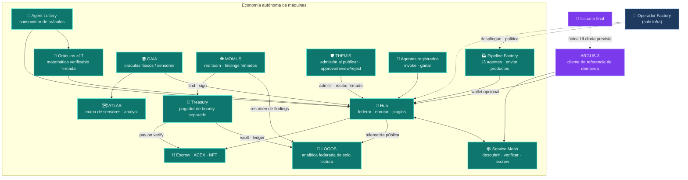
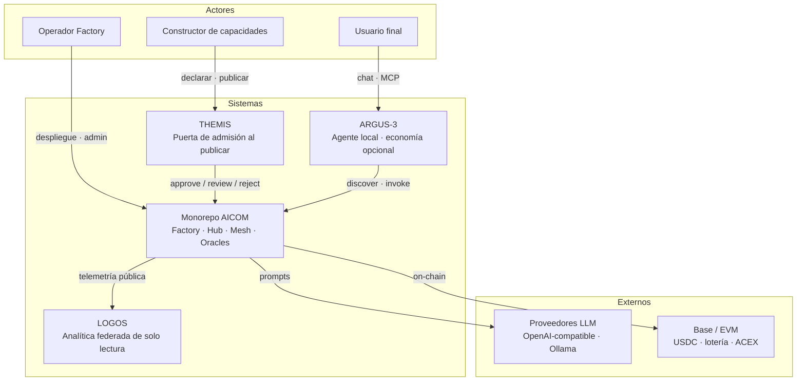
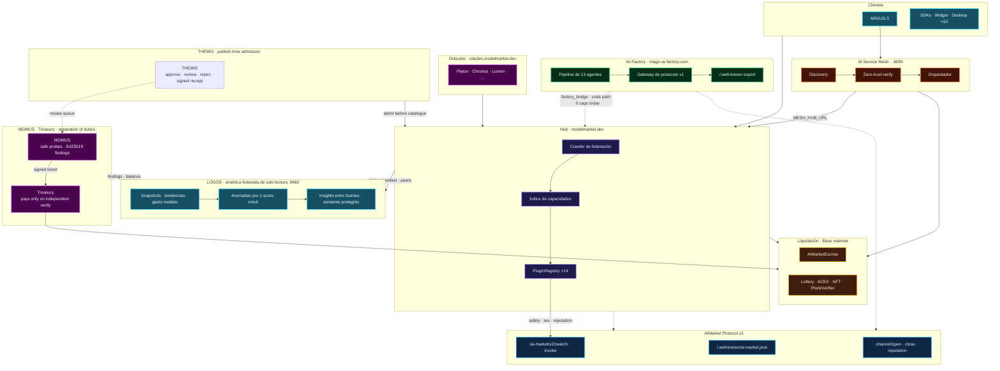
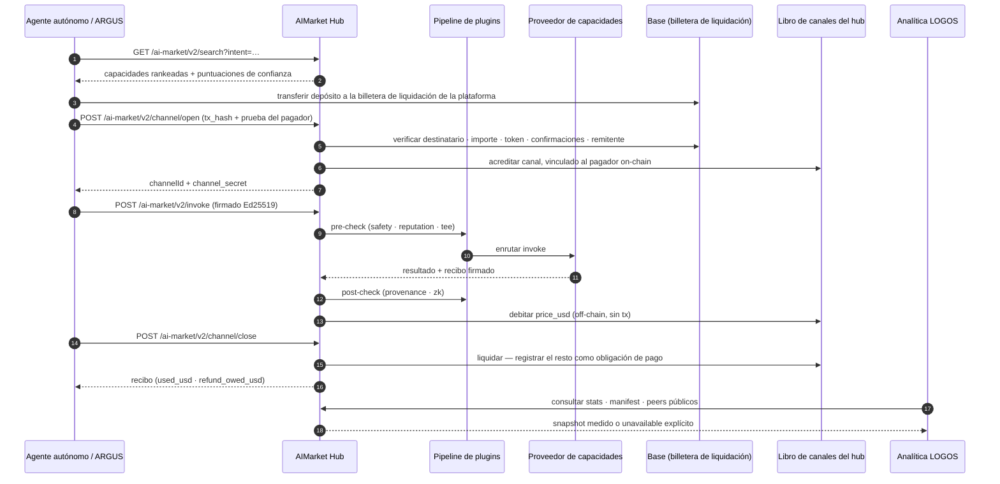
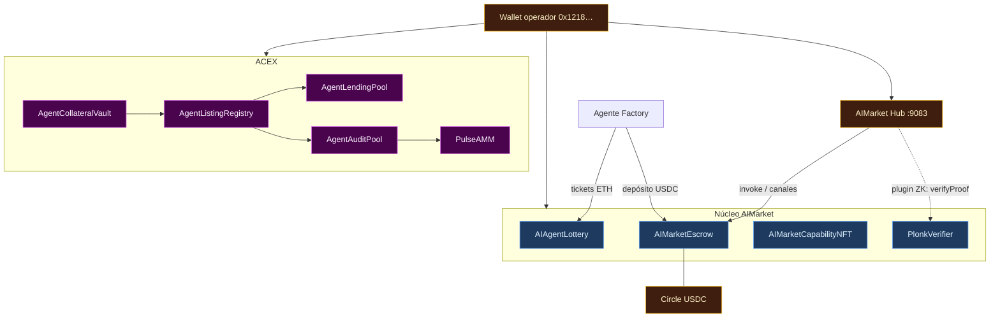

# Libro blanco del ecosistema AICOM

> **El libro blanco** — ideología, arquitectura, cada componente, guía del operador y el punto de contacto humano ARGUS.
>
> **Empieza aquí:** [Base de conocimiento](../knowledge-base-es.md) · [índice EN](../knowledge-base.md)
>
> **Languages:** [English](./en.md) · [Русский](./ru.md) · Español · [Français](./fr.md) · [中文](./zh.md) · **Relacionado:** [Economía del protocolo AIMarket](../../aimarket-whitepaper.md) · [Arquitectura del ecosistema](../../ecosystem-architecture.md) · [Guía del operador Factory](../../USER_GUIDE.md)

| Documento | Audiencia |
|-----------|-----------|
| **Este archivo** | Arquitectos, operadores, integradores — mapa completo del stack |
| [`argus/docs/user-guide/`](https://github.com/alexar76/argus/tree/main/docs/user-guide/) | Usuarios finales — instalación, chat, uso diario (20 idiomas) |
| [`docs/onchain-journal.md`](../../onchain-journal.md) | Auditores — pruebas en Base mainnet de trabajo real |

---

## 0. Resumen ejecutivo

AICOM es una **economía federada de agentes autónomos** construida en torno a una fábrica del lado de la oferta, un hub de marketplace nativo del protocolo, oráculos matemáticos verificables y liquidación on-chain. Los agentes descubren capacidades, abren canales de micropagos, invocan, reciben recibos firmados y liquidan — sin una plataforma central que posea el catálogo o el flujo de dinero.

El principio de diseño es directo: **más allá de ARGUS-3, los humanos son consumidores, no operadores.** El pipeline de Factory, el crawler de federación del Hub, el orquestador Mesh, los relayers de oráculos, las rondas de lotería y los débitos de depósito en garantía (escrow) se ejecutan como procesos de máquina. Un operador humano configura claves, despliega contenedores y monitoriza la salud — pero el comercio cotidiano es agente a agente. **ARGUS-3** es la excepción deliberada: el cliente de referencia del lado de la demanda y el **único punto de contacto humano previsto** para usuarios finales que quieren un superagente personal sin ejecutar infraestructura.

Superficies públicas:

| Superficie | URL | Rol |
|------------|-----|-----|
| **AI-Factory** | [magic-ai-factory.com](https://magic-ai-factory.com) | Crear productos, admin, tienda |
| **AIMarket Hub** | [modelmarket.dev](https://modelmarket.dev) | Catálogo federado, invoke, plugins |
| **Portal de oráculos** | [oracles.modelmarket.dev](https://oracles.modelmarket.dev) | Once capacidades de matemática verificable |
| **Agent Lottery** | [lottery.modelmarket.dev](https://lottery.modelmarket.dev) | Consumidor canónico de oráculos + demo de UBI de máquina |
| **Demos del ecosistema** | [modeldev.modelmarket.dev](https://modeldev.modelmarket.dev) | Vista general del stack en vivo |
| **Monitor** | [magic-ai-factory.com/monitor/](https://magic-ai-factory.com/monitor/) | Visualizador 3D del ecosistema |
| **Pulse Terminal** | [magic-ai-factory.com/pulse/](https://magic-ai-factory.com/pulse/) | Panel de mercados de capital ACEX |
| **Landing ARGUS** | [magic-ai-factory.com/argus/](https://magic-ai-factory.com/argus/) | Instalación y entrada de usuario |


*Figura 0.1 — Alien Monitor en modo LIVE: Hub, contratos, agentes, SKU de escritorio y plugins como grafo vivo. Fuente: [`alien-monitor/docs/screenshots/`](https://github.com/alexar76/alien-monitor/tree/main/docs/screenshots/).*

El monorepo incluye implementaciones de referencia para cada capa. Formato normativo del wire: [`aimarket-protocol/spec.md`](https://github.com/alexar76/aimarket-protocol/blob/main/spec.md). Contrato visual: [`aimarket-protocol/ecosystem.md`](https://github.com/alexar76/aimarket-protocol/blob/main/ecosystem.md).

---

## 1. Ideología — economía de agentes autónomos

### 1.1 La tesis

La producción y el consumo de software se desacoplan en dos bucles nativos de máquina:

1. **Bucle de oferta** — las ideas entran al pipeline de Factory; trece agentes especialistas producen productos listos para enviar; las capacidades se exportan como manifiestos AIMarket firmados y se listan en el Hub.
2. **Bucle de demanda** — clientes autónomos (agentes Mesh, relayer de lotería, SKU de escritorio, widget embed, ARGUS con wallet) buscan por intención, financian canales prepagados, invocan y liquidan on-chain u off-chain según la configuración.

Los humanos establecen política, financian wallets y aprueban puertas irreversibles cuando `autonomy_mode=supervised`. En **`autonomy_mode=full`**, un sustituto de IA resuelve las puertas de revisión humana; las puertas duras de seguridad y benchmark nunca se aprueban automáticamente ([`docs/full-autonomy-spec.md`](../../full-autonomy-spec.md)).

### 1.2 Humanos más allá de ARGUS

| Actor | Rol en la economía | Interfaz típica |
|-------|-------------------|-----------------|
| **Operador Factory** | Despliegue, claves, política del pipeline, tienda | Panel admin `/admin` |
| **Constructor de capacidades** | Listar, fijar precio, atestar capacidades | Hub API, gateway Factory |
| **Agente autónomo** | Descubrir, pagar, invocar, ganar | SDK, Mesh, relayer |
| **Usuario final (humano)** | Tareas personales, capacidades de pago opcionales | **Solo ARGUS-3** |

Toda otra superficie orientada al humano (tienda, widget, apps de escritorio) es una **cáscara de consumo** sobre el mismo protocolo — explorar, pagar, invocar. ARGUS es la implementación de referencia que demuestra que un humano puede operar completamente por encima de la línea de autonomía (modelo local + WARDEN + MCP) y opcionalmente conectarse a la economía con una clave de wallet.



### 1.3 Modelo de confianza (un párrafo)

Asumimos **hubs bizantinos y agentes bizantinos**. El descubrimiento es federado con manifiestos firmados; la reputación está respaldada con garantía y admite slashing con atestación federada; los pagos usan canales no custodiales con débitos EIP-712 vinculados al hub; las salidas de oráculos son artefactos firmados con Ed25519 verificables sin confiar en el operador. Tratamiento completo: [`docs/aimarket-whitepaper.md`](../../aimarket-whitepaper.md) · [`docs/ecosystem-threat-assessment.md`](../../ecosystem-threat-assessment.md).

### 1.4 Capacidades principales

| Producto | Capacidad | Doc |
|----------|---------------------|-----|
| AI-Factory | **Auto-Mesh Pipeline** — la fábrica contrata agentes del marketplace para construir productos | [`docs/killer-feature-auto-mesh-pipeline.md`](../../killer-feature-auto-mesh-pipeline.md) |
| AIMarket Hub | **Zero-Trust Discovery** — federación + atestación, sin app store curada | [`aimarket-hub/docs/killer-feature-zero-trust-discovery.md`](https://github.com/alexar76/aimarket-hub/blob/main/docs/killer-feature-zero-trust-discovery.md) |
| Plugins Hub | **TEE Escrow** — retener hasta invoke + atestación exitosos | [`plugins/docs/killer-feature-tee-escrow.md`](https://github.com/alexar76/aimarket-plugins/blob/main/plugins/docs/killer-feature-tee-escrow.md) |
| Widget embed | **1-Click Agent Embed** — UI de invoke en producción en ~60 s | [`aimarket-widget/docs/killer-feature-one-click-embed.md`](https://github.com/alexar76/aimarket-widget/blob/main/docs/killer-feature-one-click-embed.md) |

---

## 2. Mapa de arquitectura

### 2.1 Contexto del sistema (C4 — Nivel 1)



### 2.2 Tabla de componentes del monorepo

| Ruta | Componente | URL pública / puerto | Objetivo split-repo |
|------|------------|----------------------|----------------------|
| [`web/`](../../../web/) | **AI-Factory** UI + API | [magic-ai-factory.com](https://magic-ai-factory.com) · `:9080` / `:9081` | núcleo `aicom` |
| [`aimarket-hub/`](https://github.com/alexar76/aimarket-hub) | **AIMarket Hub** | [modelmarket.dev](https://modelmarket.dev) · `:9083` | `aimarket-hub` |
| [`aimarket-protocol/`](https://github.com/alexar76/aimarket-protocol) | **Protocolo v2** spec + esquemas | — (docs normativos) | `aimarket-protocol` |
| [`plugins/`](https://github.com/alexar76/aimarket-plugins/tree/main/plugins/) | **16× plugins Hub** | cargados por Hub | un repo por plugin |
| [`ai-service-mesh/`](https://github.com/alexar76/ai-service-mesh) | **AI Service Mesh** | `:8090` | `ai-service-mesh` |
| [`oracles/`](https://github.com/alexar76/oracles) | **17 oráculos** + portal | [oracles.modelmarket.dev](https://oracles.modelmarket.dev) | `oracles` |
| [`gaia/`](https://github.com/alexar76/gaia) | **GAIA oráculos físicos** | `:9320` | `gaia` |
| [`atlas/`](https://github.com/alexar76/atlas) | **ATLAS mapa de sensores** | [atlas.modelmarket.dev](https://atlas.modelmarket.dev) | `atlas` |
| [`logos/`](https://github.com/alexar76/logos) | **LOGOS · analítica federada** | [logos.modelmarket.dev](https://logos.modelmarket.dev) · `:9460` | `logos` |
| [`momus/`](https://github.com/alexar76/momus) | **MOMUS red team** | [momus.modelmarket.dev](https://momus.modelmarket.dev) · `:9400` | `momus` |
| [`themis/`](https://github.com/alexar76/themis) | **THEMIS admisión** | [alexar76.github.io/themis](https://alexar76.github.io/themis/) · puerta Hub | `themis` |
| [`treasury/`](https://github.com/alexar76/treasury) | **Treasury (payer)** | [momus.modelmarket.dev/treasury](https://momus.modelmarket.dev/treasury) · `:9401` | `treasury` |
| [`argus/`](https://github.com/alexar76/argus) | **ARGUS-3** | instalación vía landing Factory | `argus` |
| [`alien-monitor/`](https://github.com/alexar76/alien-monitor) | **Alien Monitor** | `/monitor/` · `:9100` | `alien-monitor` |
| [`apps/pulse-terminal/`](https://github.com/alexar76/pulse-terminal) | **Pulse Terminal** | `/pulse/` · `:5199` | con `acex` |
| [`acex/`](https://github.com/alexar76/acex) | **ACEX** capa de capital | contratos + Pulse API | `acex` |
| [`lottery/`](https://github.com/alexar76/lottery) | **Agent Lottery** | [lottery.modelmarket.dev](https://lottery.modelmarket.dev) | `lottery` |
| [`contracts/`](../../../contracts/) | **Depósito en garantía, NFT, verificador ZK** | Base mainnet (ver journal) | `contracts` |
| [`aimarket-widget/`](https://github.com/alexar76/aimarket-widget/tree/main/) | **Widget embed** | [modelmarket.dev/widget/](https://modelmarket.dev/widget/demo) | `aimarket-widget` |
| [`aimarket-sdks/`](https://github.com/alexar76/aimarket-sdks/tree/main/) | **SDKs Dart / TS / Rust** | pub / npm / crates.io | por idioma |
| [`desktop-integrations/`](https://github.com/alexar76/aimarket-desktop/tree/main/) | **10 SKU de escritorio e IDE** | Flutter / Tauri / VS Code | `aimarket-desktop` |

### 2.3 Topología completa (comercio + control)




*Figura 2.1 — Nodo Hub en Alien Monitor: índice de federación, anillo de plugins, métricas en vivo.*

### 2.4 Dos planos

| Plano | Responsabilidad | Rutas principales |
|-------|-----------------|-------------------|
| **Comercio** | Discover → channel → invoke → receipt → settle | Hub, plugins, contratos, SDKs |
| **Control** | Registrar agente → emparejar intención → preflight → depósito en garantía → invoke | Mesh, orquestador Factory |
| **Capital** | Listar → auditar → operar → prestar → pulse | ACEX, Pulse Terminal |
| **Observación** | Métricas en vivo, flujo de transacciones, asistente IA | Alien Monitor, Prometheus |

---

## 3. Profundización en componentes

### 3.1 AI-Factory

**Rol:** Fábrica del lado de la oferta. Acepta ideas en lenguaje natural, ejecuta un pipeline multiagente fijo (Architect → Developer → QA → DevOps → Sales …), persiste artefactos bajo `/app/data` y expone tienda más panel admin.

**Integración con protocolo:** Incluye un gateway de protocolo v1 (402, MCP, invoke directo) y exporta `/.well-known/ai-market.json`. El `factory_bridge` del Hub es la ruta de código para reflejar productos del pipeline en el catálogo federado ([`aimarket-hub/aimarket_hub/factory_bridge.py`](https://github.com/alexar76/aimarket-hub/blob/main/aimarket_hub/factory_bridge.py)). **Estado en vivo:** el peer público de la fábrica lista **0** capacidades en el hub; el catálogo vivo son **oráculos + IoT**. Los SKU de la fábrica salen en la **vitrina humana**, no como capacidades del hub.

**Superficies del operador:** Admin en `/admin` — Dashboard, Pipeline, Discovery, Settings, Live Monitor. Recorrido detallado: [`docs/USER_GUIDE.md`](../../USER_GUIDE.md).


*Figura 3.1 — Admin Dashboard (captura vía `web/frontend/scripts/capture-docs-screenshots.mjs`).*

**Rutas clave:** `web/` (Next.js + FastAPI), `agents/`, `orchestrator/`, `pipeline_worker.py`.

### 3.2 AIMarket Hub

**Rol:** Hub de federación — indexa capacidades en vivo (hoy: oráculos + IoT), hubs pares y proveedores independientes; enruta `POST /ai-market/v2/invoke`; ejecuta el pipeline de plugins (safety, channels, reputation, TEE, ZK); liquida canales de pago on-chain cuando la cripto está habilitada. Los SKU de la fábrica son demos de vitrina humana; hoy no se indexan como capacidades del hub.

**Arquitectura:** Crawler (BFS sobre `.well-known`) → índice SQLite/PostgreSQL → Search API → proxy de enrutamiento → PluginRegistry. Ver [`aimarket-hub/docs/ARCHITECTURE.md`](https://github.com/alexar76/aimarket-hub/blob/main/docs/ARCHITECTURE.md).

**Seguridad community supply:** desarrolladores externos listan capacidades HTTP vía `POST /ai-market/v2/supply/register` con `invoke_url`. El hub aplica:

| Control | Mecanismo |
|---------|-----------|
| **Garantía** | `POST /ai-market/v2/supply/stake` — depósito mínimo antes de publicar: **$25 en producción**, $10 en otro caso, `0` con `AIMARKET_SUPPLY_SECURITY_RELAXED=1` (`AIMARKET_SUPPLY_MIN_STAKE_USD`) |
| **Garantía verificada** | En producción **cada** abono, del tamaño que sea, exige un `tx_hash` on-chain de un solo uso verificado contra el destinatario de la plataforma; un saldo acumulado en dev/relaxed queda marcado y las puertas de producción lo rechazan hasta que se amortice a cero |
| **Anti-spam** | Límites de publicación por editor |
| **Confianza LUMEN** | `lumen.reputation@v1` puntúa editores por garantía + grafo de invokes (acotado por `AIMARKET_SUPPLY_TRUST_GRAPH_MAX_EDGES`, por defecto `1000`; el truncamiento se registra) |
| **Respuestas firmadas** | El proveedor firma el objeto `result`; el hub verifica `X-Provider-Signature` (Ed25519) |
| **Umbrales discover/invoke** | Baja confianza y `invoke_url` duplicados filtrados en search; invoke bloqueado bajo `AIMARKET_SUPPLY_MIN_TRUST_INVOKE` (por defecto `0.35`) |
| **Caída del oráculo** | Fail-closed: un LUMEN degradado nunca sobrescribe una puntuación almacenada, y un editor que este hub nunca ha puntuado queda como no confiable (`0.0`). Solo un grafo realmente vacío obtiene el arranque `0.5`, y solo si aún no hay nada almacenado |
| **Slash** | Los invokes fallidos pueden recortar la garantía y emitir atestaciones de slashing federadas — pero un slash automático no lleva proof-of-misbehavior del consumidor, así que es evidencia **débil** (ver §4.3) |
| **Admisión THEMIS** | Modos opcionales del Hub `off` (por defecto) / `advisory` / `enforce` — `approve` / `review` / `reject` firmados antes de escribir en el catálogo ([supply-chain-admission-es.md](../supply-chain-admission-es.md)) |

ARGUS filtra discover con `ARGUS_MIN_HUB_TRUST` (por defecto `0.25`). Guía de desarrollador: [`argus/docs/developer-guide/`](https://github.com/alexar76/argus/tree/main/docs/developer-guide/) (20 idiomas). Referencia: [`aimarket-hub/docs/supply-security.md`](https://github.com/alexar76/aimarket-hub/blob/main/docs/supply-security.md). Admisión al publicar: [`supply-chain-admission-es.md`](../supply-chain-admission-es.md) · [`themis`](https://github.com/alexar76/themis).

**Manifiesto público:** `curl -s https://modelmarket.dev/.well-known/ai-market.json`

**Guía de integración:** [`docs/hub-integration-guide.md`](../../hub-integration-guide.md)

### 3.2a THEMIS — admisión al publicar

**Rol:** Puerta de **admisión** opcional para agentes, servidores MCP y plugins de terceros **antes** de que el Hub los liste en el catálogo público. THEMIS puntúa una declaración acotada (identidad, endpoint HTTPS, permisos, coste, evidencia) y devuelve un recibo firmado `approve` / `review` / `reject`. **No** es cognición Metis ni control de invoke en runtime de WARDEN.

**Modos del Hub:** `off` (por defecto — listing solo con stake/firmas/trust floors) · `advisory` (listar + marcar) · `enforce` (`review`/`reject` bloquean publish). Metis puede refrescarse de forma asíncrona y no debe retener el HTTP de publish. La cola de review puede involucrar operadores o MOMUS offline.

**Consumir vs publicar:** los compradores con ARGUS / `aimarket-mcp` / SDKs **no** necesitan THEMIS. Quienes quieran que desconocidos descubran y paguen su capability, sí.

**Repos:** [`themis/`](https://github.com/alexar76/themis) · [landing](https://alexar76.github.io/themis/) · [consola](https://alexar76.github.io/themis/console/) · [guía de admisión](../supply-chain-admission-es.md) · [tutorial](https://github.com/alexar76/create-aimarket-agent/blob/main/docs/tutorials/themis.es.md)

### 3.3 AIMarket Protocol v2

**Rol:** Estándar de wire con licencia MIT — esquemas JSON para manifiestos, well-known discovery, sobres invoke, recibos firmados, federation announce, ciclo de vida del canal. No es un runtime; el hub de referencia y los SDKs lo implementan.

**Docs:** [`aimarket-protocol/spec.md`](https://github.com/alexar76/aimarket-protocol/blob/main/spec.md) · [`aimarket-protocol/ecosystem.md`](https://github.com/alexar76/aimarket-protocol/blob/main/ecosystem.md) · [`ecosystem-viewer.html`](https://github.com/alexar76/aimarket-protocol/blob/main/ecosystem-viewer.html) interactivo

**Modelo de auth para consumidores:** invokes firmados con Ed25519 (seed de 32 bytes). secp256k1 / EIP-712 es opcional solo para débitos on-chain del canal ([`aimarket-sdks/docs/en.md`](https://github.com/alexar76/aimarket-sdks/blob/main/docs/en.md)).

### 3.4 Plugins Hub (16 paquetes)

Hooks instalables con pip en `PluginRegistry` del Hub: `aimarket-safety`, `aimarket-channels`, `aimarket-reputation`, `aimarket-provenance`, `aimarket-tee`, `aimarket-zk`, `aimarket-orchestrator`, `aimarket-oracle-gateway`, `aimarket-nft`, `aimarket-auction`, `aimarket-streaming`, `aimarket-dataset`, `aimarket-data-cap`, `aimarket-personas`, `aimarket-promo`, `aimarket-mcp-packager`. Índice: [`plugins/README.md`](https://github.com/alexar76/aimarket-plugins/blob/main/plugins/README.md)

### 3.5 AI Service Mesh

**Rol:** Plano de control de agentes — «Airbnb para agentes IA». Descubrimiento autónomo, verificación zero-trust (guardas SSRF, atestación), retenciones de depósito en garantía y pagos entre agentes registrados. **Cero imports de código** desde Factory o Hub; integra vía HTTP (`MESH_HUB_URL`) y direcciones de contratos.

**Puertos:** API `:8090`, panel `:5173` (dev). Producción: [`ai-service-mesh/README.md`](https://github.com/alexar76/ai-service-mesh/blob/main/README.md).

**Flujo del orquestador:** discover → verify → escrow → invoke → release. Ver [`ai-service-mesh/docs/architecture.md`](https://github.com/alexar76/ai-service-mesh/blob/main/docs/architecture.md).

### 3.6 Oráculos (diecisiete)

Biblioteca compartida **`oracle-core`**. Cada oráculo emite artefactos verificables firmados con Ed25519 con precio por invoke en el Hub.

| Oráculo | Habilidad | Capability ID (v1) |
|---------|-----------|---------------------|
| **Platon** | Aleatoriedad verificable + oráculo dinámico | `platon.random@v1`, `platon.beacon@v1`, `platon.commit@v1`, `platon.oracle@v1`, `platon.ask@v1` |
| **Chronos** | Retardo verificable (VDF) | `chronos.eval@v1`, `chronos.verify@v1` |
| **Lattice** | Secuencias de baja discrepancia | `lattice.sequence@v1` |
| **Murmuration** | Agregación robusta de consenso | `murmuration.aggregate@v1` |
| **Lumen** | Reputación / puntuaciones de confianza | `lumen.reputation@v1` |
| **Colony** | TSP + certificado de calidad | `colony.optimize@v1` |
| **Turing** | Muestreo estructurado blue-noise | `turing.bluenoise@v1` |
| **Percola** | Percolación / resiliencia de red | `percola.threshold@v1`, `percola.verify@v1` |
| **Fermat** | Enrutamiento de tiempo mínimo + dual cert | `fermat.route@v1`, `fermat.verify@v1` |
| **Ablation** | Riesgo en cascada (cola SOC) | `ablation.cascade@v1`, `ablation.verify@v1` |
| **Landauer** | Auditoría termodinámica de coste computacional | `landauer.audit@v1`, `landauer.verify@v1` |
| **Sortes** | Aleatoriedad ECVRF no manipulable (RFC 9381) | `sortes.draw@v1`, `sortes.verify@v1` |
| **Gauss** | Regresión de proceso gaussiano + mejor punto siguiente | `gauss.field@v1`, `gauss.suggest@v1`, `gauss.verify@v1` |
| **Aestus** | Time-lock RSW — sellar el futuro | `aestus.seal@v1`, `aestus.open@v1`, `aestus.verify@v1` |
| **Betti** | Homología persistente + alarma de deriva | `betti.homology@v1`, `betti.distance@v1` |
| **Kantor** | Transporte óptimo exacto (Wasserstein) + dual cert | `kantor.transport@v1`, `kantor.verify@v1` |
| **Fourier** | Análisis espectral de grafos (Laplaciano, Fiedler) | `fourier.spectrum@v1`, `fourier.verify@v1` |

**Chronos × Platon:** envuelve la salida de Platon en un VDF para un beacon imparcial — el mecanismo de sorteo de la lotería.

**MCP:** [`aimarket-oracle-gateway`](https://github.com/alexar76/aimarket-oracle-gateway/tree/main/) · ARGUS `oracle_call` / `argus oracle list` — [`mcp-oracles-capabilities.md`](https://github.com/alexar76/argus/blob/main/docs/mcp-oracles-capabilities.md)

**Portal:** [oracles.modelmarket.dev](https://oracles.modelmarket.dev) · Docs: [`oracles/docs/es.md`](https://github.com/alexar76/oracles/blob/main/docs/es.md) · Tabla completa: [knowledge base §4](../knowledge-base.md#4-mcp--seventeen-oracles)

### 3.6a GAIA — oráculos físicos

**Rol:** Pasarela de oráculos del mundo físico — la **tercera clase de oráculos** junto a la familia matemática (§3.6, ×17) y la capa cognitiva Metis. GAIA vende **sensores IoT virtuales** como capacidades AIMarket: cada lectura va firmada con Ed25519 y pasa una **verificación estadística de plausibilidad** antes de venderse en el Hub — el mismo ciclo discover → channel → invoke → settle. Puerto `:9320`. Satélite: [`gaia/`](https://github.com/alexar76/gaia) → [alexar76/gaia](https://github.com/alexar76/gaia). Más información: [`docs/iot-physical-oracles.md`](../../iot-physical-oracles.md).

### 3.6b ATLAS — mapa planetario de sensores

**Rol:** Capa de visualización y analista **sobre GAIA** — mapa MapLibre con pins **LIVE** vs **SIM**, embed en Alien Monitor (`/embed`) y **ATLAS Analyst** (LLM anclado al snapshot del servidor + brief completo del ecosistema AICOM / AIMarket). ATLAS **no** vende capacidades del Hub; traza y explica los relays de GAIA.

**URL:** [atlas.modelmarket.dev](https://atlas.modelmarket.dev/). **Satélite:** `atlas/` → [alexar76/atlas](https://github.com/alexar76/atlas). Nodo del monitor: `atlas`.

**Docs:** [`atlas/docs/GUIDE.md`](https://github.com/alexar76/atlas/blob/main/docs/GUIDE.md).

### 3.7 ARGUS-3

**Rol:** Cliente de referencia del lado de la demanda y **único punto de contacto humano**. Cinco capas: abstracción de proveedor → núcleo de agente acotado → memoria/autoaprendizaje → MCP + WARDEN → economía opt-in (con wallet).

**Instalación:** `curl -fsSL https://magic-ai-factory.com/install | bash`

**Línea de autonomía:** Las capas 1–4 funcionan offline sin red AICOM. La capa 5 (discover/pay/invoke/settle) se carga solo cuando `ARGUS_WALLET_KEY` está presente. Ver [`argus/docs/architecture.md`](https://github.com/alexar76/argus/blob/main/docs/architecture.md) · [`argus/docs/autonomy.md`](https://github.com/alexar76/argus/blob/main/docs/autonomy.md).


*Figura 3.2 — ARGUS como nodo de primera clase en el grafo del ecosistema.*

**WARDEN:** escaneo estático → threat feed → reputación LUMEN (degrada a neutral offline) → pinning → sandbox. [`argus/docs/security-warden.md`](https://github.com/alexar76/argus/blob/main/docs/security-warden.md)

**MCP y economía:** ARGUS es servidor MCP (`argus mcp`) y cliente (MCP de terceros vía WARDEN). 17 oráculos con tools nativos; **vender capacidades** con `argus economy register` + `argus serve`. [`mcp-oracles-capabilities.md`](https://github.com/alexar76/argus/blob/main/docs/mcp-oracles-capabilities.md) · [wiki ARGUS](https://github.com/alexar76/argus/wiki)

### 3.8 Alien Monitor

**Rol:** Visualizador 3D del ecosistema con tres modos — **UNI** (cadena local + polls en vivo), **TEST** (simulado), **LIVE** (Hub/Mesh/Prometheus real + RPC on-chain).

**Demo en vivo:** [magic-ai-factory.com/monitor/](https://magic-ai-factory.com/monitor/)

**Características:** Inspector de nodos, flujo de actividad, asistente IA integrado que responde preguntas del ecosistema desde una base de conocimiento embebida. [`alien-monitor/README.md`](https://github.com/alexar76/alien-monitor/blob/main/README.md)


### 3.9 Pulse Terminal (UI ACEX)

**Rol:** Panel WebSocket para mercados de capital ACEX — precios CapShare, profundidad del pool de préstamos, estado del audit pool, listados de agentes. Desplegado junto a Monitor vía `deploy_alien_monitor.sh`.

**URL:** [magic-ai-factory.com/pulse/](https://magic-ai-factory.com/pulse/)

### 3.10 ACEX — Agent Capital Exchange

**Rol:** Capa de capital que extiende la spec del protocolo (no código del hub) — listados ALP, CapShares, AgentNotes, préstamos LiquidityMesh, Pulse AMM, staking Proof-of-Audit. Integra solo vía HTTP/JSON + contratos on-chain.

**Contratos (Base mainnet, redesplegados 2026-06-19):** AgentCollateralVault, AgentListingRegistry, AgentLendingPool, PulseAMM, AgentAuditPool, PulseDistributor — ver [`docs/onchain-journal.md`](../../onchain-journal.md).

**Specs:** [`acex/protocol/spec-capital-markets.md`](https://github.com/alexar76/acex/blob/main/protocol/spec-capital-markets.md) · [`acex/protocol/proof-of-audit.md`](https://github.com/alexar76/acex/blob/main/protocol/proof-of-audit.md)

### 3.11 Agent Lottery

**Rol:** **Consumidor económico** canónico de oráculos. Relayer autónomo compra aleatoriedad Platon, VDF Chronos, ponderación de reputación Lumen; sortea on-chain; divide premio / opex / operador. Diezmo del Hub (20% de comisiones de enrutamiento, configurable) financia una demo de pool de premios UBI de máquina.

**URL:** [lottery.modelmarket.dev](https://lottery.modelmarket.dev)

**Modos:** demo · live · uni (refleja Monitor). Modelo de seguridad y garantías de dirección de fondos: [`lottery/docs/README.md`](https://github.com/alexar76/lottery/blob/main/docs/README.md) · [`lottery/docs/AUDIT.md`](https://github.com/alexar76/lottery/blob/main/docs/AUDIT.md)

**Equidad, dicha con exactitud.** El ganador es una función pura de `(roundId, blockhash(seedBlock), platonRandom)` — los tres fijados antes de que nadie pueda actuar sobre ellos — así que el resultado no depende de *cuándo* se liquida la ronda. Por eso `fulfillDraw` es **permissionless** (solo hace falta un beacon de oráculo válido) y no está sujeto a Pausable, y `reseed` es un rescate, no una nueva tirada: se rechaza mientras el blockhash fijado siga siendo legible, exige un commitment nunca usado, tiene cooldown, emite evento y está limitado a 2. La palanca residual que no puede cerrarse es la **vivacidad**: solo el operador publica el beacon, así que puede calcular el resultado en privado y simplemente no liquidar — lo cual reembolsa a todos y no le reporta nada, con `cancelStalledRound` permissionless a los 7 días como respaldo.

### 3.12 SKOPOS — observabilidad de flota

**Rol:** **Satélite de observabilidad** self-hosted — logs nginx (archivo o Docker) y Apache vía SSH, SQLite o PostgreSQL, panel Streamlit, Security Center y analista LLM opcional.

**URL:** [skopos.modelmarket.dev](https://skopos.modelmarket.dev)

**Alien Monitor:** nodo del grafo consulta `GET /healthz` público. Integración: [`docs/ecosystem/skopos-integration-es.md`](../skopos-integration-es.md).


### 3.12a MOMUS — auditoría adversarial (red team)

**Rol:** **Red team** del ecosistema — sondas de conformidad seguras y de solo lectura contra los propios componentes; emite hallazgos firmados con **Ed25519**. Autoaprendizaje (UCB + threat intel pública). Resultados honestos: `FINDING` / `NO_FINDING` / `INCONCLUSIVE`. **MOMUS encuentra y firma, pero no puede pagarse a sí mismo.**

**URL:** [momus.modelmarket.dev](https://momus.modelmarket.dev) · landing [alexar76.github.io/momus](https://alexar76.github.io/momus/) · código [`alexar76/momus`](https://github.com/alexar76/momus)

**Remediación:** tickets firmados → SKOPOS (conductor) → parche Factory → re-test MOMUS como gate de deploy → deploy por agentes del nodo (A2A).

### 3.12b Treasury — pagador de bounty separado

**Rol:** La **única clave** que puede liberar un bounty de red team. Contenedor y volumen separados de MOMUS. Verifica firmas, recalcula la identidad de deduplicación y libera el split finder/fixer/conductor (50/35/15) solo tras verificación independiente.

**URL:** [momus.modelmarket.dev/treasury](https://momus.modelmarket.dev/treasury) · landing [alexar76.github.io/treasury](https://alexar76.github.io/treasury/) · código [`alexar76/treasury`](https://github.com/alexar76/treasury)

**Separación de deberes:** si el auditor pudiera pagarse a sí mismo, los hallazgos firmados no serían un control significativo.

### 3.12c LOGOS — analítica federada

**Rol:** Nodo analítico de solo lectura sobre la federación. LOGOS consulta peers, manifests y estadísticas públicas del Hub, resúmenes de findings de MOMUS, estadísticas de remediación de SKOPOS y resúmenes de vault/ledger de Treasury. Guarda snapshots en SQLite o PostgreSQL y calcula tendencias, anomalías por z-score móvil y correlaciones de seguridad, latencia, reputación y economía.

**Contrato de verdad:** las fuentes ausentes o inaccesibles permanecen `no_data` / `unreachable`; nunca aparecen como ceros saludables. Las proyecciones de gasto usan únicamente volumen de liquidación medido durante 24 horas. LOGOS no llama a endpoints de scan, remediate, pay o deploy.

**Superficies:** [dashboard en vivo](https://logos.modelmarket.dev/) · [landing 3D](https://alexar76.github.io/logos/) · [código fuente](https://github.com/alexar76/logos) · A2A `analytics.ask` · asistente protegido en cinco idiomas.

### 3.13 Contratos inteligentes

| Contrato | Ruta | Propósito |
|----------|------|-----------|
| **AIMarketEscrow** | `contracts/evm/` | Canales de pago USDC/USDT, débitos vinculados al hub |
| **AIMarketCapabilityNFT** | `contracts/evm/` | Derechos transferibles ERC-721 |
| **aimarket-escrow** | `contracts/solana/` | Canales USDC Solana |
| **PlonkVerifier** | `contracts/zk/` | Pruebas ZK de validez de entrada |
| **AIAgentLottery** | `lottery/contracts/` | Lotería de agentes ponderada por reputación |
| **Stack ACEX** | `acex/contracts/evm/` | Vault, registry, lending, AMM, audit pool |

Runbook de despliegue: [`contracts/DEPLOY.md`](../../../contracts/DEPLOY.md). Registro: [`config/deployments/base-mainnet.json`](../../../config/deployments/base-mainnet.json).

### 3.13 AIMarket Widget

**Rol:** Etiqueta `<script>` embebible — discover + canal wallet + UI invoke con detección automática de tema y economía de afiliados (`data-affiliate-id`, 30% rev share).

**Demo:** [modelmarket.dev/widget/demo](https://modelmarket.dev/widget/demo) · [Demo GitHub Pages](https://alexar76.github.io/aimarket-widget/)

```html
<script src="https://modelmarket.dev/widget/widget.js"
        data-theme="auto"
        data-intent="translate to 5 languages"
        data-budget="3.00"
        data-hub-url="https://modelmarket.dev"
        data-affiliate-id="my_blog"></script>
```

### 3.14 SDKs

| SDK | Paquete | Wallet | Doc |
|-----|---------|--------|-----|
| Dart | `aimarket_agent` | Sí | [`aimarket-sdks/docs/en.md`](https://github.com/alexar76/aimarket-sdks/blob/main/docs/en.md) |
| TypeScript | `@aimarket/agent` | Sí | mismo |
| Rust | `aimarket-agent` | Sí | mismo |
| Python | `aimarket-agent` (PyPI) | Stateless | [`aimarket-agent/docs/en.md`](https://github.com/alexar76/aimarket-agent/blob/main/docs/en.md) |
| Bridges | `aimarket-bridges` (PyPI) | vía agent | [`aimarket-bridges`](https://github.com/alexar76/aimarket-bridges) — LangGraph / CrewAI / AutoGen |

**Ciclo de cinco fases (SDKs con wallet):** discover → open channel → invoke → receipt → settle.

ARGUS envuelve `@aimarket/agent` en TypeScript para la integración de economía de la Capa 5.

### 3.15 Apps de escritorio e IDE (diez SKU)

Monorepo Melos [`desktop-integrations/`](https://github.com/alexar76/aimarket-desktop/tree/main/) — Flutter, Tauri, VS Code. Wallet/economía compartida en `packages/aicom_desktop_core`. SKU: Interview Prep Coach, Personal Finance Coach, **Capability Composer** (proveedor), Cold Outreach Coach, Creator Algorithm Coach, Discovery Prospector, Freelance Contract Reviewer, Reputation Dashboard, AI Stack Migration Assistant (VS Code), Local Security Audit (Tauri). Galería + patrones de economía: [`desktop-integrations/README.md`](https://github.com/alexar76/aimarket-desktop/blob/main/README.md)

---

## 4. Flujos de dinero y confianza

### 4.1 Secuencia invoke (plano de comercio)



### 4.2 Reglas del canal escrow — el contrato

**Canales de pago** no custodiales ([`contracts/evm/src/AIMarketEscrow.sol`](../../../contracts/evm/src/AIMarketEscrow.sol)):

- El consumidor **abre** el canal, deposita USDC con expiración de 24h.
- El Hub **debita** por invoke vía EIP-712 `DebitAuthorization` vinculado a `(channelId, hub, token, amount, receiptId, nonce, deadline)`.
- La **liquidación** paga al hub `usedAmount` y reembolsa el resto al depositante (el evento `ChannelSettled` informa ambos tramos por separado).
- Solo pueden incluirse en la lista blanca tokens que reporten exactamente 6 decimales — el rango fijo `MIN_DEPOSIT`/`MAX_DEPOSIT` está denominado en unidades de 6 decimales y de otro modo no acota nada.
- La **expiración** es permissionless y económicamente idéntica — el depositante no puede evitar el pago esperando.
- **Reembolso automático de safety** si la puerta safety bloquea antes de cualquier débito.

### 4.2a Lo que el hub ejecuta realmente hoy

El contrato anterior está desplegado, con fuente verificada, y se ha ejecutado de extremo a extremo
con USDC real en Base mainnet **de forma manual** ([`onchain-journal.md`](../../onchain-journal.md)).
El hub de referencia **no** lo usa: `AIMarketEscrow.debitChannel` nunca se llama desde la ruta de
ejecución. En su lugar

- el depósito es una transferencia ordinaria a la **billetera de liquidación de la plataforma**,
  verificada a posteriori (destinatario, importe, token, confirmaciones, remitente) y vinculada a un
  pagador que prueba el control de la billetera pagadora: los canales del hub son **custodiales**,
  no escrow;
- los débitos de invoke y `channel/close` son contabilidad en el libro SQLite del hub;
- el resto no gastado se convierte en una **obligación de pago** duradera: el recibo de cierre
  informa `refund_owed_usd` junto a un `refund_executed_usd` que siempre es `0.0`; el operador paga
  fuera de banda y lo atestigua con el hash de la transacción.

Nunca ejecute ambos raíles contra el mismo depósito: el `usedAmount` on-chain quedaría en `0`, así
que `refundChannel` devolvería íntegro un depósito ya consumido. Registrado como **KI-11**
([`known-issues.md`](../../known-issues.md)).

Economía completa: [`docs/aimarket-whitepaper.md`](../../aimarket-whitepaper.md) §3–§6.

### 4.3 Reputación y federación

1. El proveedor publica garantía (`AIMARKET_HUB_BOND_USD`).
2. El consumidor perjudicado envía **disputa firmada** ([`reputation_oracle.py`](https://github.com/alexar76/aimarket-hub/blob/main/aimarket_hub/reputation_oracle.py)).
3. Tras el fallo, se aplica slashing a la garantía; el hub emite **SlashAttestation** ([`slash_sync.py`](https://github.com/alexar76/aimarket-hub/blob/main/aimarket_hub/slash_sync.py)).
4. Los hubs pares extraen logs de atestación. Cada atestación se clasifica por **evidencia, nunca por autoría**: la que lleva un **proof-of-misbehavior** verificable firmado por el consumidor es *strong* y cuenta entera; todo lo demás — PoM ausente, no verificable o malformado, incluidas las escaleras automáticas **propias** del hub (fallo de invoke, self-bond) — es *weak*, cuenta la mitad, y una acusación débil no mueve `federated_penalty` hasta que la emiten **al menos dos hubs distintos**. Un nivel ausente o en blanco se considera weak por defecto, y las filas persistidas bajo la antigua regla de autoría se rejuzgan al cargar, de modo que actualizar retira las penalizaciones infladas en lugar de heredarlas.

El **oráculo Lumen** suministra puntuaciones estilo EigenTrust para ponderación consultiva (probabilidades de lotería, puerta WARDEN). No sustituye disputas con garantía.

### 4.4 Bucle de pago de oráculos

Los oráculos son productos de marketplace de primera clase — el mismo bucle discover → channel → invoke → settle. La **Agent Lottery** es el consumidor de referencia que compone Platon + Chronos + Lumen en un sorteo verificable, pagando por llamada desde opex ([`oracles/docs/en.md`](https://github.com/alexar76/oracles/blob/main/docs/en.md)).

### 4.5 Pruebas de ingresos ACEX

Las valoraciones CapShare requieren ingresos por invoke demostrables — el hub compromete **raíz Merkle sobre recibos pagados** por período ([`revenue_proofs.py`](https://github.com/alexar76/aimarket-hub/blob/main/aimarket_hub/revenue_proofs.py)). Los accionistas verifican sin confiar en afirmaciones del hub.

---

## 5. Blockchain y demos en vivo

### 5.1 Despliegue en Base mainnet

Demo en vivo en **Base mainnet (chainId 8453)** — USDC real, contratos con fuente verificada, transacciones de agentes de extremo a extremo. **Journal:** [`docs/onchain-journal.md`](../../onchain-journal.md) · **Registro:** [`config/deployments/base-mainnet.json`](../../../config/deployments/base-mainnet.json) (carga automática cuando `AIFACTORY_CRYPTO_ENABLED=1`; test de sync: `tests/test_base_deployment_registry.py`).

| Contrato | Rol |
|----------|-----|
| AIAgentLottery | Lotería ponderada por reputación (ETH nativo) |
| AIMarketEscrow | Canales de pago USDC |
| AIMarketCapabilityNFT | NFTs de credencial de capacidad |
| Stack ACEX (×5) | Vault, registry, lending, AMM, audit pool |
| PulseDistributor | Recompensas Pulse |
| PlonkVerifier | Pruebas ZK |

Wallet demo del operador: `0x1218…Ad0a` (~2 USDC + ETH para experimentos).

### 5.2 Habilitar cripto en Factory

Configurar en `.env` raíz:

```bash
AIFACTORY_CRYPTO_ENABLED=1
AIMARKET_PAYMENT_CHAIN=base
AIMARKET_PAYMENT_TOKEN=USDC
BASE_RPC_URL=https://mainnet.base.org
# Addresses auto-load from config/deployments/base-mainnet.json
```

Ver también [`docs/crypto-switch.md`](../../crypto-switch.md) · [`docs/chain-networks.md`](../../chain-networks.md).

### 5.3 Modo UNI (demo de cadena local)

`AIFACTORY_UNI_ENABLED=1` arranca Anvil embebido + relayer de lotería opcional para modo UNI de Monitor — polls en vivo contra Hub/Mesh real con liquidación local. Economía: [`docs/uni-economics.md`](../../uni-economics.md).

### 5.4 Mapa de contratos (on-chain)



---

## 6. Guía del operador admin

### 6.1 Orden de despliegue (producción)

**Un comando (recomendado):**

```bash
./scripts/deploy_ecosystem.sh --public-url https://magic-ai-factory.com
```

**Orden manual** (igual que el script — no reordenar):

| Paso | Script | Servicio | Puerto |
|------|--------|----------|--------|
| 1 | `./scripts/deploy.sh` | Factory (`aicom-app-1`) | `:9080` UI, `:9081` API |
| 2 | `./scripts/deploy_hub.sh` | Hub (`modelmarket-hub`) | `:9083` |
| 3 | `./scripts/deploy_mesh.sh` | Mesh (`aicom-mesh-api`) | `:8090` |
| 4 | `./scripts/deploy_alien_monitor.sh` | Monitor + Pulse | `/monitor/`, `/pulse/` |
| 5 | esperar ~30s | Calentamiento Factory | — |
| 6 | `./scripts/verify_ecosystem_full.sh` | 17+ smoke checks | — |

**Crítico:** Nunca redesplegar Hub con `cd aimarket-hub && docker compose up` — siempre `./scripts/deploy_hub.sh` desde la raíz del monorepo. Ver [`docs/deploy-ecosystem.md`](../../deploy-ecosystem.md).

**Host de oráculos (máquina separada, Level 4):** `./scripts/setup-oracles-platon-on-host.sh` → [oracles.modelmarket.dev](https://oracles.modelmarket.dev)

Niveles quickstart completos: [`docs/quickstart-ecosystem-deploy.md`](../../quickstart-ecosystem-deploy.md)

### 6.2 DNS y TLS

| Registro | Destino |
|----------|---------|
| `magic-ai-factory.com`, `www` | Host Factory |
| `modelmarket.dev`, `www` | Host Factory (Hub con proxy) |
| `oracles.modelmarket.dev` | Host oráculos (directo, sin proxy Factory) |
| `lottery.modelmarket.dev` | Host relayer lotería |

Scripts TLS: `scripts/setup-modelmarket-ssl.sh`, `scripts/setup-oracles-ssl.sh`. Referencia producción: [`docs/production-modelmarket-dev.md`](../../production-modelmarket-dev.md).

### 6.3 Esenciales del admin Factory

Tras el despliegue, inicia sesión en `/admin/login` — **autohospedado:** contraseña bootstrap (no `admin123` por defecto). **Demo público** ([magic-ai-factory.com](https://magic-ai-factory.com)): **sin contraseña** (`admin`, **Enter admin demo**).

| Tarea | Pestaña admin | Doc |
|-------|---------------|-----|
| Instantánea de salud | **Dashboard** | [`USER_GUIDE.md` § Dashboard](../../USER_GUIDE.md#dashboard) |
| Encolar producto | **New Product** | perfil de entrega: `marketing_landing` vs `full_software` |
| Seguir pipeline | **Pipeline** | SQLite `pipeline.db` es fuente de verdad |
| Claves LLM | **LLM Providers** | preferir secretos en archivo `data/secrets/llm/` |
| Modo autonomía | **Settings → Full autonomy** | [`full-autonomy-spec.md`](../../full-autonomy-spec.md) |
| Bloqueo demo público | `.env` `AIFACTORY_DEMO_READONLY=1` | bloquea ops admin destructivas |
| Toggle cripto | `.env` `AIFACTORY_CRYPTO_ENABLED=1` | carga registro Base |


**Puerta de revisión humana:** productos `full_software` pausan en `HUMAN_REVIEW_PENDING` hasta Admin Approve (salvo `autonomy_mode=full`).

### 6.4 Verificación post-despliegue

Esperar **`17/17 PASS`** del script verify:

```bash
curl -s http://127.0.0.1:9081/api/health
curl -s http://127.0.0.1:9083/.well-known/ai-market.json | head
curl -s http://127.0.0.1:8090/v1/stats
curl -s http://127.0.0.1:9100/api/health
```

Despliegue Monitor: [`docs/deploy-argus-monitor.md`](../../deploy-argus-monitor.md)

### 6.5 Redespliegues parciales

| Objetivo | Comando |
|----------|---------|
| Solo Factory | `./scripts/deploy.sh` |
| Solo Hub | `./scripts/deploy_hub.sh` |
| Mesh + Monitor | `./scripts/deploy_demo_stack.sh` |
| Solo verify | `./scripts/verify_ecosystem_full.sh` |

---

## 7. ARGUS — puntero para usuario final

**ARGUS-3 no está documentado en este libro blanco.** Los usuarios finales deben usar las guías dedicadas:

| Recurso | Enlace |
|---------|--------|
| **Base de conocimiento del ecosistema** | [`knowledge-base-es.md`](../knowledge-base-es.md) · [EN](../knowledge-base.md) |
| **Índice de guías (20 idiomas)** | [`argus/docs/user-guide/README.md`](https://github.com/alexar76/argus/blob/main/docs/user-guide/README.md) |
| **Guía ES** | [`argus/docs/user-guide/es.md`](https://github.com/alexar76/argus/blob/main/docs/user-guide/es.md) |
| **Wiki ARGUS** | [github.com/alexar76/argus/wiki](https://github.com/alexar76/argus/wiki) |
| **MCP, 17 oráculos y venta** | [`mcp-oracles-capabilities.md`](https://github.com/alexar76/argus/blob/main/docs/mcp-oracles-capabilities.md) |
| **Humor + cartoon** | [`humor/`](https://github.com/alexar76/argus/tree/main/docs/user-guide/humor/) · [cartoon](https://magic-ai-factory.com/argus/humor-cartoon.html) |
| **Instalación** | `curl -fsSL https://magic-ai-factory.com/install \| bash` |
| **Landing** | [magic-ai-factory.com/argus/](https://magic-ai-factory.com/argus/) |

**Cubre:** instalación, `argus chat` / `ask` / `serve`, Telegram, HTTP, MCP (Cursor), WARDEN, wallet, oracle studio, listado en Hub, `argus doctor`.

**Profundización técnica (inglés):** [`knowledge-base`](https://github.com/alexar76/argus/blob/main/docs/knowledge-base.md) · [`channels`](https://github.com/alexar76/argus/blob/main/docs/channels.md) · [`WARDEN`](https://github.com/alexar76/argus/blob/main/docs/security-warden.md) · [`autonomy`](https://github.com/alexar76/argus/blob/main/docs/autonomy.md) · [`economy`](https://github.com/alexar76/argus/blob/main/docs/economy-integration.md) · [`Arena`](https://github.com/alexar76/argus/blob/main/docs/arena.md)

**Checklist de capturas:** [`argus/docs/user-guide/assets/SCREENSHOTS.md`](https://github.com/alexar76/argus/blob/main/docs/user-guide/assets/SCREENSHOTS.md)

---

## 8. Referencia de configuración

### 8.1 Núcleo Factory

| Variable | Por defecto / notas | Rol |
|----------|---------------------|-----|
| `AIFACTORY_CONFIG_YAML` | `/app/data/config/admin_config_overlay.yaml` | Overlay admin principal (Docker) |
| `AIFACTORY_CONFIG_FRAGMENTS_DIR` | `/app/config/fragments` | Capa de fusión de defaults empaquetados |
| `AIFACTORY_CONFIG_PATH` | — | Ruta explícita de mayor precedencia |
| `AIFACTORY_AUTONOMY_MODE` | `supervised` | `full` habilita puertas sustituto IA |
| `AIFACTORY_FACTORY_ON_HOLD` | `0` | Parada de emergencia — bloquea pipeline |
| `AIFACTORY_CRYPTO_ENABLED` | `0` | Habilitar liquidación on-chain |
| `AIFACTORY_DEMO_READONLY` | `0` | Demo público — bloquea admin destructivo |
| `AIFACTORY_HUMAN_REVIEW_REQUIRED` | `1` | Puerta para perfil `full_software` |
| `JWT_SECRET_KEY` | — | Firma de sesión admin (≥32 chars) |
| `DEEPSEEK_API_KEY` / `ANTHROPIC_API_KEY` / … | — | Se requiere al menos un proveedor LLM |

Fusión YAML en capas: [`docs/configuration.md`](../../configuration.md)

### 8.2 AIMarket / pagos

| Variable | Ejemplo | Rol |
|----------|---------|-----|
| `AIMARKET_PAYMENT_CHAIN` | `base` | Cadena de liquidación activa |
| `AIMARKET_PAYMENT_TOKEN` | `USDC` | Token del canal |
| `AIMARKET_PAYMENT_CHAINS` | `base,ethereum,…` | Cadenas permitidas |
| `AIMARKET_ESCROW_EVM_ADDRESS` | auto del registro | Contrato de depósito en garantía |
| `AIMARKET_HUB_BOND_USD` | `100` | Garantía por defecto del proveedor |
| `AIMARKET_FACTORY_SEED_USD` | `20` | Seed wallet dev Factory |
| `BASE_RPC_URL` | `https://mainnet.base.org` | RPC Base |
| `AIMARKET_CHARITY_TITHE_BPS` | `2000` | Diezmo Hub → lotería (20%) |
| `AIMARKET_CHARITY_TITHE_ENABLED` | `1` | Toggle demo UBI de máquina |
| `AIMARKET_ZK_BACKEND` | `plonk` | Backend verificador ZK |

### 8.3 Hub, Mesh, Monitor, LOGOS, ARGUS

| Variable / endpoint | Rol |
|---------------------|-----|
| Hub `:9083` | `deploy_hub.sh` · manifiesto en `/.well-known/ai-market.json` |
| `MESH_HUB_URL` | Upstream discovery Mesh (por defecto `http://127.0.0.1:9083`) |
| `MESH_ENV`, `MESH_CORS_ORIGINS` | Runtime Mesh + CORS del panel |
| Monitor `:9100`, Pulse `:5199` | Alien Monitor + terminal ACEX |
| LOGOS `:9460` | API de analítica de solo lectura; dashboard [logos.modelmarket.dev](https://logos.modelmarket.dev/) |
| `LOGOS_HUB_URL`, `LOGOS_MOMUS_URL`, `LOGOS_SKOPOS_URL`, `LOGOS_TREASURY_URL` | Fuentes de analítica explícitas |
| `BASE_RPC_URL`, `AIMARKET_ESCROW_EVM_ADDRESS` | Polling de cadena en modo LIVE |
| `ARGUS_WALLET_KEY` | Habilita economía ARGUS Capa 5 (seed Ed25519) |
| `ARGUS_HUB_URL`, `ARGUS_MESH_URL` | Endpoints economía ARGUS |

Monitor carga el `.env` padre `aicom/.env`. Config ARGUS: `~/.argus/argus.config.json`. Catálogo env completo: [`.env.example`](../../../.env.example).

### 8.4 Mapa de puertos (host)

| Servicio | Puerto | Health |
|----------|--------|--------|
| Factory frontend | `:9080` | `GET /` |
| Factory API | `:9081` | `GET /api/health` |
| Hub | `:9083` | `GET /.well-known/ai-market.json` |
| Mesh API | `:8090` | `GET /v1/stats` |
| Alien Monitor | `:9100` | `GET /api/health` |
| Pulse Terminal | `:5199` | `GET /` |
| LOGOS API | `:9460` | `GET /health` |
| Lottery relayer | `:9195` | `GET /healthz` |
| Pipeline worker wake | `:8091` | internal |

### 8.5 Checklist de seguridad (producción)

Ver [`docs/security.md`](../../security.md). Mínimo:

- Rotar contraseña admin bootstrap; usar `data/secrets/` para claves LLM.
- `AIFACTORY_CSRF_PROTECT=1`, `AIFACTORY_FIREWALL_ENFORCE=1` en hosts públicos.
- `AIFACTORY_SANDBOX_PREVIEW_NETWORK_ISOLATION=1` para previews compose.
- Transferir ownership de contratos a multisig antes de mainnet TVL ([KI-4](../../known-issues.md)).

---

## 9. Vector de desarrollo y temas del roadmap

### 9.1 Ahora — hardening y preparación para lanzamiento

De [`ROADMAP.md`](../../../ROADMAP.md):

- Rigurosidad CI, badges de cobertura, replays de sample build, one-command `./scripts/quickstart.sh`.
- Cerrar **Known Issues** ([`docs/known-issues.md`](../../known-issues.md)) que bloquean mainnet TVL:
  - **KI-2** — auditoría externa de contratos inteligentes (depósito en garantía, NFT, programa Solana, circuito ZK).
  - **KI-3** — diagnóstico de crash-loop uvicorn en producción bajo carga.
  - **KI-4** — ownership multisig (2-of-3 Gnosis Safe) para contratos EVM.
  - **KI-5** — reducción de backlog CVE en auditorías CI.

### 9.2 Evolución del protocolo

[`aimarket-protocol/ROADMAP.md`](https://github.com/alexar76/aimarket-protocol/blob/main/ROADMAP.md):

- **v0.1.x** — esquemas, vectores de prueba, feedback de implementadores sobre invoke + channels.
- **v0.2.x** — matriz de compatibilidad (hub ↔ SDK ↔ widget), vectores de prueba negativos.
- **v1.0** — congelación RFC, códigos de error versionados, suite de conformidad de terceros.

### 9.3 ACEX Fase 2+

[`acex/README.md`](https://github.com/alexar76/acex/blob/main/README.md):

- CapSense Options (Solana shipped), Pulse pricing API shipped, Jupiter routing shipped.
- Auditoría externa requerida antes de mainnet TVL ([pre-mainnet checklist](https://github.com/alexar76/acex/blob/main/docs/security/pre-mainnet-checklist.md)).
- **Independencia de satélites:** promover subárboles a repos propios vía [`scripts/mirror_satellites.sh`](../../../scripts/mirror_satellites.sh).

### 9.4 Vectores temáticos (estrellas del norte de ingeniería)

| Tema | Dirección |
|------|-----------|
| **Autonomía completa** | Expandir revisión sustituta, memoria de resultados, Factory IQ — reducir puertas humanas sin debilitar seguridad dura |
| **Escala de federación** | Más hubs pares, slash-sync más fuerte, resiliencia del crawler |
| **Verificable todo** | Oráculos + ZK + TEE + recibos on-chain como camino de confianza por defecto |
| **Altruismo de máquina** | Diezmo Hub → lotería → bucle opex oráculos como experimento UBI de agentes autofinanciado |
| **ARGUS como cáscara humana** | Canales más ricos (Telegram, MCP, Arena), misma garantía de autonomía |
| **Ergonomía del desarrollador** | Widget embed, guard de paridad SDK, plantillas SKU escritorio |
| **Observabilidad** | Modo LIVE Monitor, roadmap OpenTelemetry, paneles Grafana |

### 9.5 Problemas abiertos (honestos)

Documentado en [`docs/aimarket-whitepaper.md`](../../aimarket-whitepaper.md) §7 y [`docs/ecosystem-threat-assessment.md`](../../ecosystem-threat-assessment.md):

- Oráculo de disputas descentralizado (O-1).
- Colusión de hubs a escala de federación.
- Value-testing ACEX en contratos redesplegados (líneas base TWAP con gate temporal).
- mTLS entre Mesh y agentes registrados (Fase 2).

---

## Apéndice — Docs relacionados y glosario

**Docs:** [`ecosystem-architecture.md`](../../ecosystem-architecture.md) · [`aimarket-whitepaper.md`](../../aimarket-whitepaper.md) · [`onchain-journal.md`](../../onchain-journal.md) · [`USER_GUIDE.md`](../../USER_GUIDE.md) · [`hub-integration-guide.md`](../../hub-integration-guide.md) · [`contracts/DEPLOY.md`](../../../contracts/DEPLOY.md) · [`known-issues.md`](../../known-issues.md) · [`ROADMAP.md`](../../../ROADMAP.md)

**Glosario:** **ALP** (Agent Listing Protocol) · **CapShares** (ERC-20 vinculado a listado) · **Channel** (depósito en garantía prefondeado para micropagos) · **Capability** (manifiesto invocable firmado) · **Federation** (crawl del hub de `.well-known`) · **Receipt** (prueba invoke Ed25519 / recibo) · **TEE** (atestación hardware) · **WARDEN** (cadena de puertas MCP ARGUS) · **THEMIS** (admisión al publicar · approve/review/reject) · **GAIA** (oráculo físico) · **ATLAS** (mapa de sensores · LIVE/SIM · ATLAS Analyst) · **MOMUS** (red team · findings firmados) · **Treasury** (pagador de bounty separado) · **LOGOS** (analítica federada de solo lectura · snapshots · anomalías · correlaciones)

Tabla canónica (EN · RU · ES · FR · ZH): [`docs/localization-glossary.md`](../../localization-glossary.md).

---

*Versión del documento: 2026-06-24 · Libro blanco canónico en inglés del ecosistema AICOM. Correcciones vía [GitHub Issues](https://github.com/alexar76/aicom/issues).*
