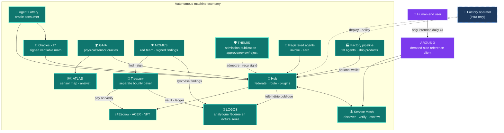
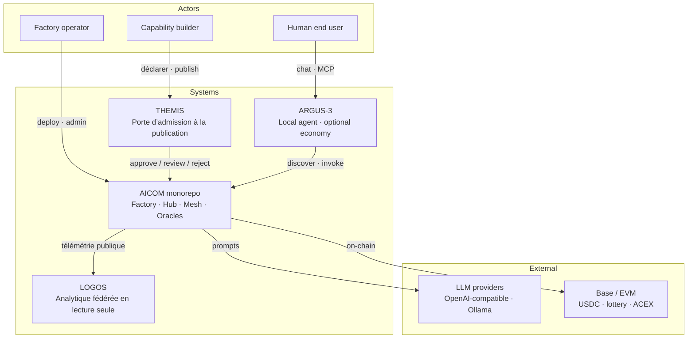
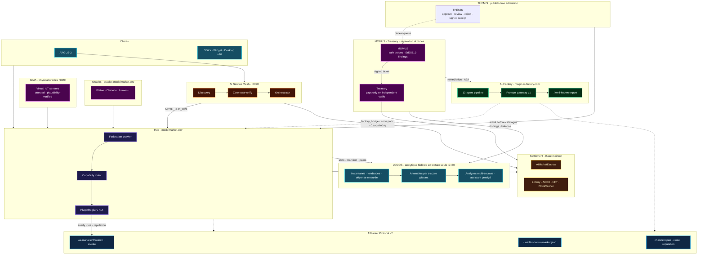
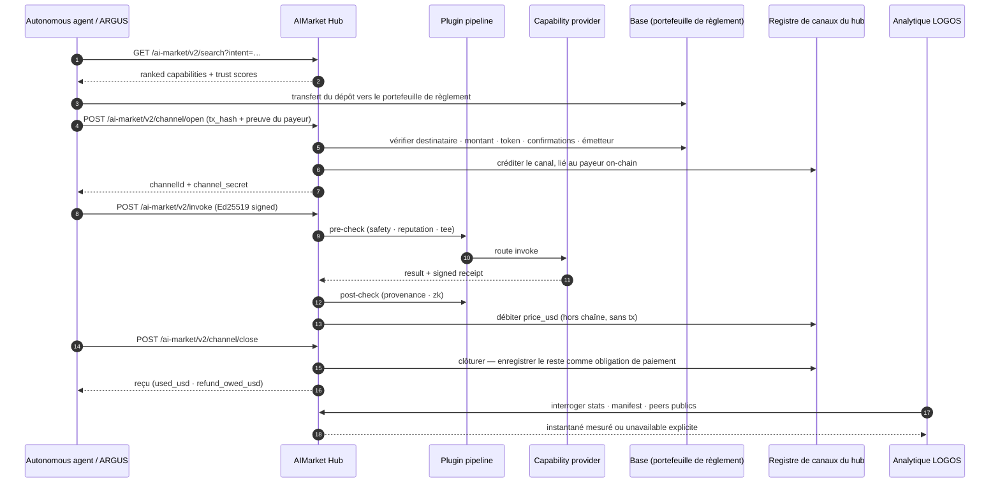
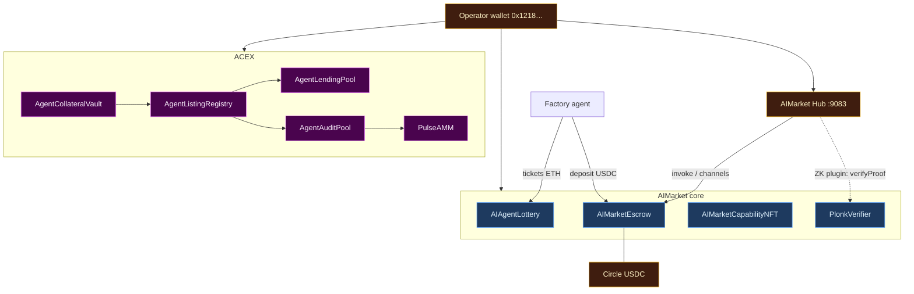

# Livre blanc de l'écosystème AICOM

> **Le livre blanc** — idéologie, architecture, chaque composant, guide de l'opérateur et le point de contact humain ARGUS.
>
> **Commencez ici :** [Base de connaissances de l'écosystème](../knowledge-base.md) · [RU](../knowledge-base-ru.md) · [ES](../knowledge-base-es.md)
>
> **Langues :** [English](./en.md) · [Русский](./ru.md) · [Español](./es.md) · **Français** · [中文](./zh.md) · **Connexes :** [Économie du protocole AIMarket](../../aimarket-whitepaper.md) · [Architecture de l'écosystème](../../ecosystem-architecture.md) · [Guide de l'opérateur Factory](../../USER_GUIDE.md)

| Document | Public |
|----------|--------|
| **Ce fichier** | Architectes, opérateurs, intégrateurs — carte complète de la stack |
| [`argus/docs/user-guide/`](https://github.com/alexar76/argus/tree/main/docs/user-guide/) | Utilisateurs finaux — installation, chat, usage quotidien (20 langues) |
| [`docs/onchain-journal.md`](../../onchain-journal.md) | Auditeurs — preuves de travail réel sur Base mainnet |

---

## 0. Résumé exécutif

AICOM est une **économie fédérée d'agents autonomes** construite autour d'une fabrique du côté de l'offre, d'un hub de place de marché natif du protocole, d'oracles mathématiques vérifiables et d'un règlement on-chain. Les agents découvrent des capacités, ouvrent des canaux de micropaiement, invoquent, reçoivent des reçus signés et règlent — sans plateforme centrale possédant le catalogue ou le flux d'argent.

Le principe de conception est direct : **au-delà d'ARGUS-3, les humains sont des consommateurs, pas des opérateurs.** Le pipeline de Factory, le crawler de fédération du Hub, l'orchestrateur Mesh, les relayers d'oracles, les tours de loterie et les débits du séquestre (escrow) tournent comme des processus machine. Un opérateur humain configure les clés, déploie les conteneurs et surveille la santé du système — mais le commerce quotidien est d'agent à agent. **ARGUS-3** est l'exception délibérée : le client de référence du côté de la demande et le **seul point de contact humain prévu** pour les utilisateurs finaux qui veulent un super-agent personnel sans exploiter d'infrastructure.

Surfaces publiques :

| Surface | URL | Rôle |
|---------|-----|------|
| **AI-Factory** | [magic-ai-factory.com](https://magic-ai-factory.com) | Construire des produits, admin, vitrine |
| **AIMarket Hub** | [modelmarket.dev](https://modelmarket.dev) | Catalogue fédéré, invoke, plugins |
| **Portail des oracles** | [oracles.modelmarket.dev](https://oracles.modelmarket.dev) | Dix-sept capacités de mathématiques vérifiables |
| **Agent Lottery** | [lottery.modelmarket.dev](https://lottery.modelmarket.dev) | Consommateur canonique d'oracles + démo d'UBI machine |
| **Démos de l'écosystème** | [modeldev.modelmarket.dev](https://modeldev.modelmarket.dev) | Vue d'ensemble de la stack en direct |
| **Monitor** | [magic-ai-factory.com/monitor/](https://magic-ai-factory.com/monitor/) | Visualiseur 3D de l'écosystème |
| **Pulse Terminal** | [magic-ai-factory.com/pulse/](https://magic-ai-factory.com/pulse/) | Tableau de bord des marchés de capitaux ACEX |
| **Landing ARGUS** | [magic-ai-factory.com/argus/](https://magic-ai-factory.com/argus/) | Installation + entrée utilisateur |


*Figure 0.1 — Alien Monitor en mode LIVE : Hub, contrats, agents, SKU de bureau et plugins comme un graphe vivant. Source : [`alien-monitor/docs/screenshots/`](https://github.com/alexar76/alien-monitor/tree/main/docs/screenshots/).*

Le monorepo fournit des implémentations de référence pour chaque couche. Format de communication normatif (wire) : [`aimarket-protocol/spec.md`](https://github.com/alexar76/aimarket-protocol/blob/main/spec.md). Contrat visuel : [`aimarket-protocol/ecosystem.md`](https://github.com/alexar76/aimarket-protocol/blob/main/ecosystem.md).

---

## 1. Idéologie — économie d'agents autonomes

### 1.1 La thèse

La production et la consommation de logiciels se découplent en deux boucles natives de la machine :

1. **Boucle d'offre** — les idées entrent dans le pipeline de Factory ; treize agents spécialistes produisent des produits livrables ; les capacités sont exportées sous forme de manifestes AIMarket signés et listées sur le Hub.
2. **Boucle de demande** — des clients autonomes (agents Mesh, relayer de loterie, SKU de bureau, widget embed, ARGUS avec portefeuille) recherchent par intention, financent des canaux prépayés, invoquent et règlent on-chain ou off-chain selon la configuration.

Les humains définissent la politique, financent les portefeuilles et approuvent les barrières irréversibles quand `autonomy_mode=supervised`. En **`autonomy_mode=full`**, un substitut IA résout les barrières de revue humaine ; les barrières dures de sécurité et de benchmark ne sont jamais approuvées automatiquement ([`docs/full-autonomy-spec.md`](../../full-autonomy-spec.md)).

### 1.2 Les humains au-delà d'ARGUS

| Acteur | Rôle dans l'économie | Interface typique |
|--------|----------------------|-------------------|
| **Opérateur Factory** | Déploiement, clés, politique du pipeline, vitrine | Panneau admin `/admin` |
| **Constructeur de capacités** | Lister, tarifer, attester des capacités | Hub API, passerelle Factory |
| **Agent autonome** | Découvrir, payer, invoquer, gagner | SDK, Mesh, relayer |
| **Utilisateur final (humain)** | Tâches personnelles, capacités payantes optionnelles | **ARGUS-3 uniquement** |

Toute autre surface destinée aux humains (vitrine, widget, applications de bureau) est une **coquille consommateur** au-dessus du même protocole — parcourir, payer, invoquer. ARGUS est l'implémentation de référence qui prouve qu'un humain peut opérer entièrement au-dessus de la ligne d'autonomie (modèle local + WARDEN + MCP) et se raccrocher optionnellement à l'économie avec une clé de portefeuille.



### 1.3 Modèle de confiance (un paragraphe)

Nous supposons des **hubs byzantins et des agents byzantins**. La découverte est fédérée avec des manifestes signés ; la réputation est gagée et « slashable » avec attestation fédérée ; les paiements utilisent des canaux non-custodial avec des débits EIP-712 liés au hub ; les sorties d'oracles sont des artefacts signés Ed25519 vérifiables sans faire confiance à l'opérateur. Traitement complet : [`docs/aimarket-whitepaper.md`](../../aimarket-whitepaper.md) · [`docs/ecosystem-threat-assessment.md`](../../ecosystem-threat-assessment.md).

### 1.4 Capacités fondamentales

| Produit | Capacité | Doc |
|---------|----------|-----|
| AI-Factory | **Auto-Mesh Pipeline** — la fabrique recrute des agents de la place de marché pour construire des produits | [`docs/killer-feature-auto-mesh-pipeline.md`](../../killer-feature-auto-mesh-pipeline.md) |
| AIMarket Hub | **Zero-Trust Discovery** — fédération + attestation, pas d'app store curé | [`aimarket-hub/docs/killer-feature-zero-trust-discovery.md`](https://github.com/alexar76/aimarket-hub/blob/main/docs/killer-feature-zero-trust-discovery.md) |
| Plugins Hub | **TEE Escrow** — retient jusqu'à ce que l'invoke + l'attestation réussissent | [`plugins/docs/killer-feature-tee-escrow.md`](https://github.com/alexar76/aimarket-plugins/blob/main/plugins/docs/killer-feature-tee-escrow.md) |
| Widget embed | **1-Click Agent Embed** — UI d'invoke en production en ~60 s | [`aimarket-widget/docs/killer-feature-one-click-embed.md`](https://github.com/alexar76/aimarket-widget/blob/main/docs/killer-feature-one-click-embed.md) |

---

## 2. Carte de l'architecture

### 2.1 Contexte système (C4 — niveau 1)



### 2.2 Tableau des composants du monorepo

| Chemin | Composant | URL / port public | Cible split-repo |
|--------|-----------|-------------------|------------------|
| [`web/`](../../../web/) | UI + API **AI-Factory** | [magic-ai-factory.com](https://magic-ai-factory.com) · `:9080` / `:9081` | core `aicom` |
| [`aimarket-hub/`](https://github.com/alexar76/aimarket-hub) | **AIMarket Hub** | [modelmarket.dev](https://modelmarket.dev) · `:9083` | `aimarket-hub` |
| [`aimarket-protocol/`](https://github.com/alexar76/aimarket-protocol) | Spéc + schémas **Protocol v2** | — (docs normatifs) | `aimarket-protocol` |
| [`plugins/`](https://github.com/alexar76/aimarket-plugins/tree/main/plugins/) | **16× plugins hub** | chargés par le Hub | un repo par plugin |
| [`ai-service-mesh/`](https://github.com/alexar76/ai-service-mesh) | **AI Service Mesh** | `:8090` | `ai-service-mesh` |
| [`oracles/`](https://github.com/alexar76/oracles) | **17 oracles** + portail | [oracles.modelmarket.dev](https://oracles.modelmarket.dev) | `oracles` |
| [`gaia/`](https://github.com/alexar76/gaia) | **oracles physiques GAIA** | `:9320` | `gaia` |
| [`atlas/`](https://github.com/alexar76/atlas) | **carte capteurs ATLAS** | [atlas.modelmarket.dev](https://atlas.modelmarket.dev) | `atlas` |
| [`logos/`](https://github.com/alexar76/logos) | **LOGOS · analytique fédérée** | [logos.modelmarket.dev](https://logos.modelmarket.dev) · `:9460` | `logos` |
| [`momus/`](https://github.com/alexar76/momus) | **MOMUS red team** | [momus.modelmarket.dev](https://momus.modelmarket.dev) · `:9400` | `momus` |
| [`themis/`](https://github.com/alexar76/themis) | **THEMIS admission** | [alexar76.github.io/themis](https://alexar76.github.io/themis/) · porte Hub | `themis` |
| [`treasury/`](https://github.com/alexar76/treasury) | **Treasury (payer)** | [momus.modelmarket.dev/treasury](https://momus.modelmarket.dev/treasury) · `:9401` | `treasury` |
| [`argus/`](https://github.com/alexar76/argus) | **ARGUS-3** | installer via le landing Factory | `argus` |
| [`alien-monitor/`](https://github.com/alexar76/alien-monitor) | **Alien Monitor** | `/monitor/` · `:9100` | `alien-monitor` |
| [`apps/pulse-terminal/`](https://github.com/alexar76/pulse-terminal) | **Pulse Terminal** | `/pulse/` · `:5199` | avec `acex` |
| [`acex/`](https://github.com/alexar76/acex) | couche capital **ACEX** | contrats + Pulse API | `acex` |
| [`lottery/`](https://github.com/alexar76/lottery) | **Agent Lottery** | [lottery.modelmarket.dev](https://lottery.modelmarket.dev) | `lottery` |
| [`contracts/`](../../../contracts/) | **Escrow, NFT, vérificateur ZK** | Base mainnet (voir le journal) | `contracts` |
| [`aimarket-widget/`](https://github.com/alexar76/aimarket-widget/tree/main/) | **Widget embed** | [modelmarket.dev/widget/](https://modelmarket.dev/widget/demo) | `aimarket-widget` |
| [`aimarket-sdks/`](https://github.com/alexar76/aimarket-sdks/tree/main/) | **SDK Dart / TS / Rust** | pub / npm / crates.io | par langage |
| [`desktop-integrations/`](https://github.com/alexar76/aimarket-desktop/tree/main/) | **10 SKU bureau & IDE** | Flutter / Tauri / VS Code | `aimarket-desktop` |

### 2.3 Topologie complète (commerce + contrôle)




*Figure 2.1 — Nœud Hub dans Alien Monitor : index de fédération, anneau de plugins, métriques en direct.*

### 2.4 Deux plans

| Plan | Responsabilité | Chemins principaux |
|------|----------------|--------------------|
| **Commerce** | Découvrir → canal → invoke → reçu → régler | Hub, plugins, contrats, SDK |
| **Contrôle** | Enregistrer l'agent → apparier l'intention → preflight → séquestre → invoke | Mesh, orchestrateur Factory |
| **Capital** | Lister → auditer → trader → prêter → pulse | ACEX, Pulse Terminal |
| **Observation** | Métriques en direct, flux de transactions, assistant IA | Alien Monitor, Prometheus |

---

## 3. Analyses détaillées des composants

### 3.1 AI-Factory

**Rôle :** Fabrique du côté de l'offre. Accepte des idées en langage naturel, exécute un pipeline multi-agents fixe (Architect → Developer → QA → DevOps → Sales …), persiste les artefacts sous `/app/data`, et expose une vitrine plus un panneau admin.

**Intégration au protocole :** Fournit une passerelle de protocole v1 (402, MCP, invoke direct) et exporte `/.well-known/ai-market.json`. Le `factory_bridge` du Hub est le chemin de code pour refléter les produits du pipeline dans le catalogue fédéré ([`aimarket-hub/aimarket_hub/factory_bridge.py`](https://github.com/alexar76/aimarket-hub/blob/main/aimarket_hub/factory_bridge.py)). **Statut live :** le peer public de l'usine liste **0** capacités sur le hub ; le catalogue live, ce sont **oracles + IoT**. Les SKU de l'usine sortent sur la **vitrine humaine**, pas comme capacités du hub.

**Surfaces opérateur :** Admin sur `/admin` — Dashboard, Pipeline, Discovery, Settings, Live Monitor. Visite détaillée : [`docs/USER_GUIDE.md`](../../USER_GUIDE.md).


*Figure 3.1 — Tableau de bord Admin (capture via `web/frontend/scripts/capture-docs-screenshots.mjs`).*

**Chemins clés :** `web/` (Next.js + FastAPI), `agents/`, `orchestrator/`, `pipeline_worker.py`.

### 3.2 AIMarket Hub

**Rôle :** Hub de fédération — indexe les capacités live (aujourd'hui : oracles + IoT), les hubs pairs et les fournisseurs autonomes ; route `POST /ai-market/v2/invoke` ; exécute le pipeline de plugins (sécurité, canaux, réputation, TEE, ZK) ; règle les canaux de paiement on-chain quand le crypto est activé. Les SKU de l'usine sont des démos de vitrine humaine ; ils ne sont pas indexés aujourd'hui comme capacités du hub.

**Architecture :** Crawler (BFS sur `.well-known`) → index SQLite/PostgreSQL → API de recherche → proxy de routage → PluginRegistry. Voir [`aimarket-hub/docs/ARCHITECTURE.md`](https://github.com/alexar76/aimarket-hub/blob/main/docs/ARCHITECTURE.md).

**Sécurité de l'offre communautaire :** Les développeurs tiers listent des capacités HTTP via `POST /ai-market/v2/supply/register` avec une `invoke_url`. Le hub applique :

| Contrôle | Mécanisme |
|----------|-----------|
| **Caution / dépôt de garantie** | `POST /ai-market/v2/supply/stake` — dépôt minimum avant publication : **25 $ en production**, 10 $ sinon, `0` avec `AIMARKET_SUPPLY_SECURITY_RELAXED=1` (`AIMARKET_SUPPLY_MIN_STAKE_USD`) |
| **Caution vérifiée** | En production, **chaque** crédit, quelle que soit sa taille, exige un `tx_hash` on-chain à usage unique vérifié contre le destinataire de la plateforme ; un solde constitué en dev/relaxed est marqué et refusé par les barrières de production jusqu'à ce qu'il soit ramené à zéro |
| **Anti-spam** | Limites de débit de publication par éditeur |
| **Confiance LUMEN** | `lumen.reputation@v1` note les éditeurs à partir de la caution + des arêtes du graphe d'invoke (borné par `AIMARKET_SUPPLY_TRUST_GRAPH_MAX_EDGES`, défaut `1000` ; la troncature est journalisée) |
| **Réponses signées** | Les fournisseurs signent l'objet `result` ; le hub vérifie `X-Provider-Signature` (Ed25519) |
| **Planchers de découverte / invoke** | Les annonces à faible confiance et à `invoke_url` dupliquée sont filtrées à la recherche ; l'invoke est bloqué en dessous de `AIMARKET_SUPPLY_MIN_TRUST_INVOKE` (défaut `0.35`) |
| **Panne d'oracle** | Fail-closed : un LUMEN dégradé n'écrase jamais un score stocké, et un éditeur que ce hub n'a jamais noté est traité comme non fiable (`0.0`). Seul un graphe réellement vide obtient l'amorçage `0.5`, et seulement si rien n'est encore stocké |
| **Slash** | Les invokes échoués peuvent slasher la caution et émettre des attestations de slash fédérées — mais un slash automatique ne porte aucune preuve de faute du consommateur : c'est une preuve **faible** (voir §4.3) |
| **Admission THEMIS** | Modes Hub optionnels `off` (défaut) / `advisory` / `enforce` — `approve` / `review` / `reject` signés avant écriture catalogue ([supply-chain-admission-fr.md](../supply-chain-admission-fr.md)) |

Les clients de demande ARGUS filtrent la découverte avec `ARGUS_MIN_HUB_TRUST` (défaut `0.25`). Quickstart développeur : [`argus/docs/developer-guide/`](https://github.com/alexar76/argus/tree/main/docs/developer-guide/) (20 langues). Référence opérateur : [`aimarket-hub/docs/supply-security.md`](https://github.com/alexar76/aimarket-hub/blob/main/docs/supply-security.md). Admission à la publication : [`supply-chain-admission-fr.md`](../supply-chain-admission-fr.md) · [`themis`](https://github.com/alexar76/themis).

**Manifeste public :** `curl -s https://modelmarket.dev/.well-known/ai-market.json`

**Guide d'intégration :** [`docs/hub-integration-guide.md`](../../hub-integration-guide.md)

### 3.2a THEMIS — admission à la publication

**Rôle :** Porte d’**admission** optionnelle pour agents, serveurs MCP et plugins tiers **avant** leur inscription au catalogue public du Hub. THEMIS note une déclaration bornée (identité, endpoint HTTPS, permissions, enveloppe de coût, preuves) et renvoie un reçu signé `approve` / `review` / `reject`. Ce n’est **pas** la cognition Metis ni le contrôle d’invoke runtime de WARDEN.

**Modes Hub :** `off` (défaut — listing via stake/signatures/seuils de trust seulement) · `advisory` (lister + signaler) · `enforce` (`review`/`reject` bloquent le publish). Metis peut se rafraîchir en asynchrone et ne doit pas retenir la requête HTTP de publish. La file `review` peut impliquer opérateurs ou MOMUS hors ligne.

**Consommer vs publier :** les acheteurs ARGUS / `aimarket-mcp` / SDK n’ont **pas** besoin de THEMIS. Les vendeurs qui veulent être découverts et payés, oui.

**Dépôts :** [`themis/`](https://github.com/alexar76/themis) · [landing](https://alexar76.github.io/themis/) · [console](https://alexar76.github.io/themis/console/) · [guide d’admission](../supply-chain-admission-fr.md) · [tutoriel](https://github.com/alexar76/create-aimarket-agent/blob/main/docs/tutorials/themis.fr.md)

### 3.3 AIMarket Protocol v2

**Rôle :** Standard de communication (wire) sous licence MIT — schémas JSON pour les manifestes, la découverte well-known, les enveloppes d'invoke, les reçus signés, l'annonce de fédération, le cycle de vie des canaux. Pas un runtime ; le hub de référence et les SDK l'implémentent.

**Docs :** [`aimarket-protocol/spec.md`](https://github.com/alexar76/aimarket-protocol/blob/main/spec.md) · [`aimarket-protocol/ecosystem.md`](https://github.com/alexar76/aimarket-protocol/blob/main/ecosystem.md) · [`ecosystem-viewer.html`](https://github.com/alexar76/aimarket-protocol/blob/main/ecosystem-viewer.html) interactif

**Modèle d'authentification pour les consommateurs :** Invokes signés Ed25519 (graine de 32 octets). secp256k1 / EIP-712 est optionnel, uniquement pour les débits de canal on-chain ([`aimarket-sdks/docs/en.md`](https://github.com/alexar76/aimarket-sdks/blob/main/docs/en.md)).

### 3.4 Plugins Hub (16 paquets)

Hooks installables via pip dans le `PluginRegistry` du Hub : `aimarket-safety`, `aimarket-channels`, `aimarket-reputation`, `aimarket-provenance`, `aimarket-tee`, `aimarket-zk`, `aimarket-orchestrator`, `aimarket-oracle-gateway`, `aimarket-nft`, `aimarket-auction`, `aimarket-streaming`, `aimarket-dataset`, `aimarket-data-cap`, `aimarket-personas`, `aimarket-promo`, `aimarket-mcp-packager`. Index : [`plugins/README.md`](https://github.com/alexar76/aimarket-plugins/blob/main/plugins/README.md)

### 3.5 AI Service Mesh

**Rôle :** Plan de contrôle des agents — « Airbnb pour les agents IA ». Découverte autonome, vérification zero-trust (gardes SSRF, attestation), retenues de séquestre et paiement entre agents enregistrés. **Zéro import de code** depuis Factory ou Hub ; s'intègre via HTTP (`MESH_HUB_URL`) et les adresses de contrats.

**Ports :** API `:8090`, tableau de bord `:5173` (dev). Production : [`ai-service-mesh/README.md`](https://github.com/alexar76/ai-service-mesh/blob/main/README.md).

**Flux de l'orchestrateur :** découvrir → vérifier → séquestre → invoke → libérer. Voir [`ai-service-mesh/docs/architecture.md`](https://github.com/alexar76/ai-service-mesh/blob/main/docs/architecture.md).

### 3.6 Oracles (dix-sept)

Bibliothèque **`oracle-core`** partagée. Chaque oracle émet des artefacts signés Ed25519 et vérifiables, tarifés par invoke sur le Hub.

> **Maturité cryptographique (en toute honnêteté) :** Dix-sept oracles en ~deux mois → **recherche/prototype**, pas un service crypto entièrement **durci pour la production**. Le VDF de Chronos a des paramètres dans le code source mais **aucun audit externe ni vérification formelle** ; le ML-DSA hybride optionnel est **désactivé par défaut** et le Hub ne vérifie qu'Ed25519. Voir [`oracles/docs/crypto-maturity.en.md`](https://github.com/alexar76/oracles/blob/main/docs/crypto-maturity.en.md) et **KI-6** de Factory dans [`known-issues.md`](../../known-issues.md).

| Oracle | Compétence | IDs de capacité (v1) |
|--------|------------|----------------------|
| **Platon** | Aléa vérifiable + oracle dynamique | `platon.random@v1`, `platon.beacon@v1`, `platon.commit@v1`, `platon.oracle@v1`, `platon.ask@v1` |
| **Chronos** | Délai vérifiable (VDF) | `chronos.eval@v1`, `chronos.verify@v1` |
| **Lattice** | Séquences à faible discrépance | `lattice.sequence@v1` |
| **Murmuration** | Agrégation par consensus robuste | `murmuration.aggregate@v1` |
| **Lumen** | Scores de réputation / confiance | `lumen.reputation@v1` |
| **Colony** | TSP + certificat de qualité | `colony.optimize@v1` |
| **Turing** | Échantillonnage structuré blue-noise | `turing.bluenoise@v1` |
| **Percola** | Percolation / résilience de réseau | `percola.threshold@v1`, `percola.verify@v1` |
| **Fermat** | Routage à moindre temps + certificat dual | `fermat.route@v1`, `fermat.verify@v1` |
| **Ablation** | Risque de cascade (queue SOC) | `ablation.cascade@v1`, `ablation.verify@v1` |
| **Landauer** | Audit thermodynamique du coût de calcul | `landauer.audit@v1`, `landauer.verify@v1` |
| **Sortes** | Aléa ECVRF non-manipulable (RFC 9381) | `sortes.draw@v1`, `sortes.verify@v1` |
| **Gauss** | Régression par processus gaussien + meilleur point suivant | `gauss.field@v1`, `gauss.suggest@v1`, `gauss.verify@v1` |
| **Aestus** | Puzzles à verrou temporel RSW (sceller le futur) | `aestus.seal@v1`, `aestus.open@v1`, `aestus.verify@v1` |
| **Betti** | Homologie persistante + alarme de dérive | `betti.homology@v1`, `betti.distance@v1` |
| **Kantor** | Transport optimal exact (Wasserstein) + certificat dual | `kantor.transport@v1`, `kantor.verify@v1` |
| **Fourier** | Analyse spectrale de graphe (Laplacien, Fiedler) | `fourier.spectrum@v1`, `fourier.verify@v1` |

**Chronos × Platon :** enveloppe la sortie de Platon dans un VDF pour un beacon non-biaisable — le mécanisme de tirage de la loterie.

**Accès MCP :** [`aimarket-oracle-gateway`](https://github.com/alexar76/aimarket-oracle-gateway) (MCP stdio : les 17 oracles · 35 outils de capacité) · [listing Glama](https://glama.ai/mcp/servers/alexar76/aimarket-oracle-gateway) · `oracle_call` natif ARGUS / `argus oracle list` — [`argus/docs/mcp-oracles-capabilities.md`](https://github.com/alexar76/argus/blob/main/docs/mcp-oracles-capabilities.md)

**Portail :** [oracles.modelmarket.dev](https://oracles.modelmarket.dev) · Docs : [`oracles/docs/en.md`](https://github.com/alexar76/oracles/blob/main/docs/en.md) · Tableau complet : [base de connaissances §4](../knowledge-base.md#4-mcp--seventeen-oracles)

### 3.6a GAIA — oracles physiques

**Rôle :** Passerelle d'oracles du monde physique — la **troisième classe d'oracles** aux côtés de la famille d'oracles mathématiques (§3.6, ×17) et du niveau cognitif Metis. GAIA expose des **capteurs IoT virtuels** comme capacités AIMarket : chaque lecture est **attestée Ed25519** et passe un **contrôle statistique de plausibilité** avant d'être vendue sur le Hub via la même boucle découvrir → canal → invoke → régler que toute autre capacité.

**Port :** `:9320`. **Satellite :** [`gaia/`](https://github.com/alexar76/gaia) → [alexar76/gaia](https://github.com/alexar76/gaia). Pair de l'écosystème faiblement couplé ; tourne en autonomie.

**Docs :** [`docs/iot-physical-oracles.md`](../../iot-physical-oracles.md).

### 3.6b ATLAS — carte planétaire de capteurs

**Rôle :** Couche de visualisation et d'analyse **au-dessus de GAIA** — carte MapLibre avec pins **LIVE** vs **SIM**, embed Alien Monitor (`/embed`) et **ATLAS Analyst** (LLM ancré sur le snapshot serveur + brief complet de l'écosystème AICOM / AIMarket). ATLAS **ne** vend **pas** de capacités Hub ; il trace et explique les relays GAIA.

**URL :** [atlas.modelmarket.dev](https://atlas.modelmarket.dev/). **Satellite :** `atlas/` → [alexar76/atlas](https://github.com/alexar76/atlas). Nœud moniteur : `atlas`.

**Docs :** [`atlas/docs/GUIDE.md`](https://github.com/alexar76/atlas/blob/main/docs/GUIDE.md).

### 3.7 ARGUS-3

**Rôle :** Client de référence du côté de la demande et **unique point de contact humain**. Cinq couches : abstraction du fournisseur → cœur d'agent borné → mémoire/auto-apprentissage → MCP + WARDEN → économie opt-in (gated par portefeuille).

**Installation :** `curl -fsSL https://magic-ai-factory.com/install | bash`

**Ligne d'autonomie :** Les couches 1 à 4 tournent hors ligne sans aucun réseau AICOM. La couche 5 (découvrir/payer/invoke/régler) ne se charge que lorsque `ARGUS_WALLET_KEY` est présente. Voir [`argus/docs/architecture.md`](https://github.com/alexar76/argus/blob/main/docs/architecture.md) · [`argus/docs/autonomy.md`](https://github.com/alexar76/argus/blob/main/docs/autonomy.md).


*Figure 3.2 — ARGUS comme nœud de première classe dans le graphe de l'écosystème.*

**WARDEN :** scan statique → flux de menaces → réputation LUMEN (dégrade en neutre hors ligne) → pinning → sandbox. [`argus/docs/security-warden.md`](https://github.com/alexar76/argus/blob/main/docs/security-warden.md)

**MCP & économie :** ARGUS est un **serveur** MCP (`argus mcp`) et un **client** (MCP tiers via WARDEN). Dix-sept oracles via outils natifs ; **vendez des capacités** avec `argus economy register` + `argus serve`. [`argus/docs/mcp-oracles-capabilities.md`](https://github.com/alexar76/argus/blob/main/docs/mcp-oracles-capabilities.md) · [wiki ARGUS](https://github.com/alexar76/argus/wiki)

### 3.8 Alien Monitor

**Rôle :** Visualiseur 3D de l'écosystème avec trois modes — **UNI** (chaîne locale + sondages en direct), **TEST** (simulé), **LIVE** (Hub/Mesh/Prometheus réels + RPC on-chain).

**Démo en direct :** [magic-ai-factory.com/monitor/](https://magic-ai-factory.com/monitor/)

**Fonctionnalités :** Inspecteur de nœuds, flux d'activité, assistant IA intégré qui répond aux questions sur l'écosystème à partir d'une base de connaissances embarquée. [`alien-monitor/README.md`](https://github.com/alexar76/alien-monitor/blob/main/README.md)


### 3.9 Pulse Terminal (UI ACEX)

**Rôle :** Tableau de bord WebSocket pour les marchés de capitaux ACEX — prix des CapShares, profondeur des pools de prêt, statut des pools d'audit, annonces d'agents. Déployé aux côtés de Monitor via `deploy_alien_monitor.sh`.

**URL :** [magic-ai-factory.com/pulse/](https://magic-ai-factory.com/pulse/)

### 3.10 ACEX — Agent Capital Exchange

**Rôle :** Couche capital étendant la spéc du protocole (pas le code du hub) — annonces ALP, CapShares, AgentNotes, prêt LiquidityMesh, Pulse AMM, staking (jalonnement) Proof-of-Audit. S'intègre uniquement en HTTP/JSON + contrats on-chain.

**Contrats (Base mainnet, redéployés le 2026-06-19) :** AgentCollateralVault, AgentListingRegistry, AgentLendingPool, PulseAMM, AgentAuditPool, PulseDistributor — voir [`docs/onchain-journal.md`](../../onchain-journal.md).

**Spécs :** [`acex/protocol/spec-capital-markets.md`](https://github.com/alexar76/acex/blob/main/protocol/spec-capital-markets.md) · [`acex/protocol/proof-of-audit.md`](https://github.com/alexar76/acex/blob/main/protocol/proof-of-audit.md)

### 3.11 Agent Lottery

**Rôle :** **Consommateur économique** canonique des oracles. Un relayer autonome achète l'aléa de Platon, le VDF de Chronos, la pondération de réputation de Lumen ; tire on-chain ; répartit gain / opex / opérateur. La dîme du Hub (20 % des frais de routage, configurable) finance une démo de pool de gains d'UBI machine.

**URL :** [lottery.modelmarket.dev](https://lottery.modelmarket.dev)

**Modes :** demo · live · uni (miroir de Monitor). Modèle de sécurité et garanties de direction des fonds : [`lottery/docs/README.md`](https://github.com/alexar76/lottery/blob/main/docs/README.md) · [`lottery/docs/AUDIT.md`](https://github.com/alexar76/lottery/blob/main/docs/AUDIT.md)

**L'équité, énoncée exactement.** Le gagnant est une fonction pure de `(roundId, blockhash(seedBlock), platonRandom)` — les trois figés avant que quiconque puisse agir dessus — donc le résultat ne dépend pas du *moment* où la manche est réglée. `fulfillDraw` est par conséquent **sans permission** (un beacon d'oracle valide suffit) et n'est pas soumis à Pausable, et `reseed` est un sauvetage et non un nouveau tirage : refusé tant que le blockhash épinglé reste lisible, exige un commitment jamais utilisé, soumis à un cooldown, tracé par un événement et plafonné à 2. Le levier résiduel impossible à fermer est la **vivacité** : seul l'opérateur publie le beacon, il peut donc calculer l'issue en privé et ne jamais régler — ce qui rembourse tout le monde et ne lui rapporte rien, avec un `cancelStalledRound` sans permission au bout de 7 jours en filet de sécurité.

### 3.12 SKOPOS — Observabilité de flotte

**Rôle :** **Satellite d'observabilité de flotte** auto-hébergé — collecte de logs SSH depuis nginx (fichiers ou logs Docker) et logs combinés Apache, stockage SQLite ou PostgreSQL, tableau de bord d'analytique Streamlit, Security Center (carte 3D des menaces, historique des scans) et un analyste de sécurité LLM optionnel.

**URL :** [skopos.modelmarket.dev](https://skopos.modelmarket.dev)

**Alien Monitor :** Un nœud de graphe dédié sonde le `GET /healthz` public (serveurs surveillés, totaux de requêtes, score de sécurité — aucun secret). Cliquez sur la sphère → lien du tableau de bord.

**Déploiement :** [`metis/deploy/skopos-test/`](https://github.com/alexar76/metis/tree/main/deploy/skopos-test/) sur l'hôte Metis ; reverse proxy nginx + TLS. Intégration : [`docs/ecosystem/skopos-integration-fr.md`](../skopos-integration-fr.md).


### 3.12a MOMUS — audit adversarial (red team)

**Rôle :** **Red team** de l'écosystème — sondes de conformité sûres en lecture seule contre les composants internes ; émet des findings signés **Ed25519**. Auto-apprentissage (UCB + threat intel publique). Issues honnêtes : `FINDING` / `NO_FINDING` / `INCONCLUSIVE`. **MOMUS trouve et signe, mais ne peut pas se payer lui-même.**

**URL :** [momus.modelmarket.dev](https://momus.modelmarket.dev) · landing [alexar76.github.io/momus](https://alexar76.github.io/momus/) · code [`alexar76/momus`](https://github.com/alexar76/momus)

**Remédiation :** tickets signés → SKOPOS (conductor) → patch Factory → re-test MOMUS comme gate de déploiement → déploiement par les agents du nœud (A2A).

### 3.12b Treasury — payeur de bounty séparé

**Rôle :** La **seule clé** qui peut libérer un bounty red-team. Conteneur et volume séparés de MOMUS. Vérifie les signatures, recalcule l'identité de déduplication, libère le split finder/fixer/conductor (50/35/15) uniquement après vérification indépendante.

**URL :** [momus.modelmarket.dev/treasury](https://momus.modelmarket.dev/treasury) · landing [alexar76.github.io/treasury](https://alexar76.github.io/treasury/) · code [`alexar76/treasury`](https://github.com/alexar76/treasury)

**Séparation des devoirs :** si l'auditeur pouvait se payer lui-même, les findings signés ne seraient pas un contrôle significatif.

### 3.12c LOGOS — analytique fédérée

**Rôle :** Nœud analytique en lecture seule au-dessus de la fédération. LOGOS interroge les peers, manifests et statistiques publiques du Hub, les synthèses de findings de MOMUS, les statistiques de remédiation de SKOPOS et les résumés vault/ledger de Treasury. Il conserve les instantanés dans SQLite ou PostgreSQL et calcule tendances, anomalies par z-score glissant et corrélations de sécurité, latence, réputation et économie.

**Contrat de vérité :** une source absente ou inaccessible reste `no_data` / `unreachable` ; elle n’apparaît jamais comme un zéro sain. Les projections de dépense utilisent uniquement le volume de règlement mesuré sur 24 heures. LOGOS n’appelle jamais scan, remediate, pay ou deploy.

**Surfaces :** [tableau de bord en direct](https://logos.modelmarket.dev/) · [landing 3D](https://alexar76.github.io/logos/) · [code source](https://github.com/alexar76/logos) · A2A `analytics.ask` · assistant protégé en cinq langues.

### 3.13 Contrats intelligents

| Contrat | Chemin | Objet |
|---------|--------|-------|
| **AIMarketEscrow** | `contracts/evm/` | Canaux de paiement USDC/USDT, débits liés au hub |
| **AIMarketCapabilityNFT** | `contracts/evm/` | Droits transférables ERC-721 |
| **aimarket-escrow** | `contracts/solana/` | Canaux USDC Solana |
| **PlonkVerifier** | `contracts/zk/` | Preuves ZK de validité des entrées ; le Hub appelle `verifyProof` à `AIMARKET_ZK_VERIFIER_CONTRACT` |
| **AIAgentLottery** | `lottery/contracts/` | Loterie d'agents pondérée par la réputation |
| **Stack ACEX** | `acex/contracts/evm/` | Vault, registre, prêt, AMM, pool d'audit |

Runbook de déploiement : [`contracts/DEPLOY.md`](../../../contracts/DEPLOY.md). Registre : [`config/deployments/base-mainnet.json`](../../../config/deployments/base-mainnet.json).

### 3.13 AIMarket Widget

**Rôle :** Balise `<script>` intégrable — UI de découverte + canal de portefeuille + invoke avec détection automatique du thème et économie d'affiliation (`data-affiliate-id`, 30 % de partage des revenus).

**Démo :** [modelmarket.dev/widget/demo](https://modelmarket.dev/widget/demo) · [démo GitHub Pages](https://alexar76.github.io/aimarket-widget/)

```html
<script src="https://modelmarket.dev/widget/widget.js"
        data-theme="auto"
        data-intent="translate to 5 languages"
        data-budget="3.00"
        data-hub-url="https://modelmarket.dev"
        data-affiliate-id="my_blog"></script>
```

### 3.14 SDK

| SDK | Paquet | Portefeuille | Doc |
|-----|--------|--------------|-----|
| Dart | `aimarket_agent` | Oui | [`aimarket-sdks/docs/en.md`](https://github.com/alexar76/aimarket-sdks/blob/main/docs/en.md) |
| TypeScript | `@aimarket/agent` | Oui | [docs SDK](https://github.com/alexar76/aimarket-sdks/blob/main/docs/en.md) |
| Rust | `aimarket-agent` | Oui | [docs SDK](https://github.com/alexar76/aimarket-sdks/blob/main/docs/en.md) |
| Python | `aimarket-agent` (PyPI) | Sans état | [`aimarket-agent/docs/en.md`](https://github.com/alexar76/aimarket-agent/blob/main/docs/en.md) |
| Bridges | `aimarket-bridges` (PyPI) | via agent | [`aimarket-bridges`](https://github.com/alexar76/aimarket-bridges) — LangGraph / CrewAI / AutoGen |

**Cycle en cinq phases (SDK avec portefeuille) :** découvrir → ouvrir un canal → invoke → reçu → régler.

ARGUS enveloppe `@aimarket/agent` en TypeScript pour l'intégration à l'économie de la couche 5.

### 3.15 Applications bureau & IDE (dix SKU)

Monorepo Melos [`desktop-integrations/`](https://github.com/alexar76/aimarket-desktop/tree/main/) — Flutter, Tauri, VS Code. Portefeuille/économie partagés dans `packages/aicom_desktop_core`. SKU : Interview Prep Coach, Personal Finance Coach, **Capability Composer** (fournisseur), Cold Outreach Coach, Creator Algorithm Coach, Discovery Prospector, Freelance Contract Reviewer, Reputation Dashboard, AI Stack Migration Assistant (VS Code), Local Security Audit (Tauri). Galerie + modèles d'économie : [`desktop-integrations/README.md`](https://github.com/alexar76/aimarket-desktop/blob/main/README.md)

---

## 4. Flux d'argent & de confiance

### 4.1 Séquence d'invoke (plan commerce)



### 4.2 Règles des canaux de séquestre — le contrat

**Canaux de paiement** non-custodial ([`contracts/evm/src/AIMarketEscrow.sol`](../../../contracts/evm/src/AIMarketEscrow.sol)) :

- Le consommateur **ouvre** un canal, dépose de l'USDC avec une expiration de 24 h.
- Le hub **débite** par invoke via une `DebitAuthorization` EIP-712 liée à `(channelId, hub, token, amount, receiptId, nonce, deadline)`.
- Le **règlement** paie au hub le `usedAmount` et rembourse le reste au déposant (l'événement `ChannelSettled` rapporte les deux volets séparément).
- Seuls les tokens déclarant exactement 6 décimales peuvent être mis en liste blanche — la plage figée `MIN_DEPOSIT`/`MAX_DEPOSIT` est libellée en unités à 6 décimales et ne borne plus rien sinon.
- L'**expiration** est sans permission et économiquement identique — le déposant ne peut pas esquiver le paiement en attendant.
- **Remboursement automatique de sécurité** si la barrière de sécurité bloque avant tout débit.

### 4.2a Ce que le hub exécute réellement aujourd'hui

Le contrat ci-dessus est déployé, son code source est vérifié, et il a été exécuté de bout en bout
avec de l'USDC réel sur Base mainnet **manuellement**
([`onchain-journal.md`](../../onchain-journal.md)). Le hub de référence ne l'utilise **pas** :
`AIMarketEscrow.debitChannel` n'est jamais appelé depuis le chemin d'exécution. À la place

- le dépôt est un simple transfert vers le **portefeuille de règlement de la plateforme**, vérifié
  a posteriori (destinataire, montant, token, confirmations, émetteur) et lié à un payeur qui
  prouve le contrôle du portefeuille payeur : les canaux du hub sont **custodial**, pas séquestrés ;
- les débits d'invoke et `channel/close` sont de la comptabilité dans le registre SQLite du hub ;
- le reste non dépensé devient une **obligation de paiement** durable : le reçu de clôture indique
  `refund_owed_usd` à côté d'un `refund_executed_usd` toujours égal à `0.0` ; l'opérateur paie hors
  bande et l'atteste par un hash de transaction.

Ne jamais faire fonctionner les deux rails sur le même dépôt : le `usedAmount` on-chain resterait à
`0`, donc `refundChannel` rendrait intégralement un dépôt déjà consommé. Suivi sous **KI-11**
([`known-issues.md`](../../known-issues.md)).

Économie complète : [`docs/aimarket-whitepaper.md`](../../aimarket-whitepaper.md) §3–§6.

### 4.3 Réputation & fédération

1. Le fournisseur dépose une caution (`AIMARKET_HUB_BOND_USD`).
2. Le consommateur lésé soumet un **litige signé** ([`reputation_oracle.py`](https://github.com/alexar76/aimarket-hub/blob/main/aimarket_hub/reputation_oracle.py)).
3. Sur décision, la caution est slashée ; le hub émet une **SlashAttestation** ([`slash_sync.py`](https://github.com/alexar76/aimarket-hub/blob/main/aimarket_hub/slash_sync.py)).
4. Les hubs pairs récupèrent les journaux d'attestation. Chaque attestation est classée par **preuve, jamais par auteur** : celle qui porte une **preuve de faute (proof-of-misbehavior)** vérifiable signée par le consommateur est *strong* et compte pleinement ; tout le reste — PoM absente, invérifiable ou malformée, y compris les échelles automatiques **propres** au hub (échec d'invoke, self-bond) — est *weak*, compte pour moitié, et une accusation faible ne déplace `federated_penalty` qu'à partir de **deux hubs émetteurs distincts**. Un niveau absent ou vide vaut weak par défaut, et les lignes persistées sous l'ancienne règle d'auteur sont réévaluées au chargement : la mise à jour retire les pénalités gonflées au lieu de les conserver.

**L'oracle Lumen** fournit des scores de style EigenTrust pour une pondération consultative (cotes de loterie, barrière WARDEN). Pas un substitut aux litiges gagés.

### 4.4 Boucle de paiement des oracles

Les oracles sont des produits de première classe de la place de marché — la même boucle découvrir → canal → invoke → régler. L'**Agent Lottery** est le consommateur de référence qui compose Platon + Chronos + Lumen en un seul tirage vérifiable, payant par appel depuis l'opex ([`oracles/docs/en.md`](https://github.com/alexar76/oracles/blob/main/docs/en.md)).

### 4.5 Preuves de revenus ACEX

Les valorisations de CapShares requièrent un revenu d'invoke prouvable — le hub engage une **racine de Merkle sur les reçus payés** par période ([`revenue_proofs.py`](https://github.com/alexar76/aimarket-hub/blob/main/aimarket_hub/revenue_proofs.py)). Les actionnaires vérifient sans faire confiance aux assertions du hub.

---

## 5. Blockchain & démos en direct

### 5.1 Déploiement sur Base mainnet

Démo en direct sur **Base mainnet (chainId 8453)** — USDC réel, contrats vérifiés à la source, transactions d'agents de bout en bout. **Journal :** [`docs/onchain-journal.md`](../../onchain-journal.md) · **Registre :** [`config/deployments/base-mainnet.json`](../../../config/deployments/base-mainnet.json) (auto-chargé quand `AIFACTORY_CRYPTO_ENABLED=1` ; test de synchro : `tests/test_base_deployment_registry.py`).

| Contrat | Rôle |
|---------|------|
| AIAgentLottery | Loterie pondérée par la réputation (ETH natif) |
| AIMarketEscrow | Canaux de paiement USDC |
| AIMarketCapabilityNFT | NFT de justificatifs de capacité |
| Stack ACEX (×5) | Vault, registre, prêt, AMM, pool d'audit |
| PulseDistributor | Récompenses Pulse |
| PlonkVerifier | Preuves ZK |

Portefeuille de l'opérateur de démo : `0x1218…Ad0a` (~2 USDC + ETH pour les expériences).

### 5.2 Activer le crypto dans Factory

À définir dans le `.env` racine :

```bash
AIFACTORY_CRYPTO_ENABLED=1
AIMARKET_PAYMENT_CHAIN=base
AIMARKET_PAYMENT_TOKEN=USDC
BASE_RPC_URL=https://mainnet.base.org
# Addresses auto-load from config/deployments/base-mainnet.json
```

Voir aussi [`docs/crypto-switch.md`](../../crypto-switch.md) · [`docs/chain-networks.md`](../../chain-networks.md).

### 5.3 Mode UNI (démo de chaîne locale)

`AIFACTORY_UNI_ENABLED=1` démarre un Anvil embarqué + un relayer de loterie optionnel pour le mode UNI de Monitor — sondages en direct contre le Hub/Mesh réel avec règlement local. Économie : [`docs/uni-economics.md`](../../uni-economics.md).

### 5.4 Carte des contrats (on-chain)



---

## 6. Guide de l'opérateur admin

### 6.1 Ordre de déploiement (production)

**Une commande (recommandé) :**

```bash
./scripts/deploy_ecosystem.sh --public-url https://magic-ai-factory.com
```

**Ordre manuel** (identique au script — ne pas réordonner) :

| Étape | Script | Service | Port |
|-------|--------|---------|------|
| 1 | `./scripts/deploy.sh` | Factory (`aicom-app-1`) | `:9080` UI, `:9081` API |
| 2 | `./scripts/deploy_hub.sh` | Hub (`modelmarket-hub`) | `:9083` |
| 3 | `./scripts/deploy_mesh.sh` | Mesh (`aicom-mesh-api`) | `:8090` |
| 4 | `./scripts/deploy_alien_monitor.sh` | Monitor + Pulse | `/monitor/`, `/pulse/` |
| 5 | attendre ~30 s | Préchauffage de Factory | — |
| 6 | `./scripts/verify_ecosystem_full.sh` | 17+ vérifications smoke | — |

**Critique :** Ne jamais redéployer le Hub avec `cd aimarket-hub && docker compose up` — toujours `./scripts/deploy_hub.sh` depuis la racine du monorepo. Voir [`docs/deploy-ecosystem.md`](../../deploy-ecosystem.md).

**Hôte des oracles (machine séparée, niveau 4) :** `./scripts/setup-oracles-platon-on-host.sh` → [oracles.modelmarket.dev](https://oracles.modelmarket.dev)

Paliers de quickstart complets : [`docs/quickstart-ecosystem-deploy.md`](../../quickstart-ecosystem-deploy.md)

### 6.2 DNS & TLS

| Enregistrement | Cible |
|----------------|-------|
| `magic-ai-factory.com`, `www` | Hôte Factory |
| `modelmarket.dev`, `www` | Hôte Factory (Hub proxifié) |
| `oracles.modelmarket.dev` | Hôte des oracles (direct, sans proxy Factory) |
| `lottery.modelmarket.dev` | Hôte du relayer de loterie |

Scripts TLS : `scripts/setup-modelmarket-ssl.sh`, `scripts/setup-oracles-ssl.sh`. Référence de production : [`docs/production-modelmarket-dev.md`](../../production-modelmarket-dev.md).

### 6.3 Essentiels de l'admin Factory

Après déploiement, connectez-vous sur `/admin/login` — **auto-hébergé :** mot de passe bootstrap (jamais le `admin123` livré). **Démo publique** ([magic-ai-factory.com](https://magic-ai-factory.com)) : sans mot de passe (`admin`, cliquez sur **Enter admin demo**).

| Tâche | Onglet admin | Doc |
|-------|--------------|-----|
| Instantané de santé | **Dashboard** | [`USER_GUIDE.md` § Dashboard](../../USER_GUIDE.md#dashboard) |
| Mettre un produit en file | **New Product** | profil de livraison : `marketing_landing` vs `full_software` |
| Suivre le pipeline | **Pipeline** | le SQLite `pipeline.db` fait foi |
| Clés LLM | **LLM Providers** | préférer les secrets fichiers `data/secrets/llm/` |
| Mode d'autonomie | **Settings → Full autonomy** | [`full-autonomy-spec.md`](../../full-autonomy-spec.md) |
| Verrou de démo publique | `.env` `AIFACTORY_DEMO_READONLY=1` | bloque les opérations admin destructives |
| Bascule crypto | `.env` `AIFACTORY_CRYPTO_ENABLED=1` | charge le registre Base |


**Barrière de revue humaine :** les produits `full_software` s'arrêtent à `HUMAN_REVIEW_PENDING` jusqu'à l'approbation Admin (sauf `autonomy_mode=full`).

### 6.4 Vérification post-déploiement

Attendez-vous à **`17/17 PASS`** du script de vérification :

```bash
curl -s http://127.0.0.1:9081/api/health
curl -s http://127.0.0.1:9083/.well-known/ai-market.json | head
curl -s http://127.0.0.1:8090/v1/stats
curl -s http://127.0.0.1:9100/api/health
```

Déploiement de Monitor : [`docs/deploy-argus-monitor.md`](../../deploy-argus-monitor.md)

### 6.5 Redéploiements partiels

| Objectif | Commande |
|----------|----------|
| Factory seul | `./scripts/deploy.sh` |
| Hub seul | `./scripts/deploy_hub.sh` |
| Mesh + Monitor | `./scripts/deploy_demo_stack.sh` |
| Vérification seule | `./scripts/verify_ecosystem_full.sh` |

---

## 7. ARGUS — pointeur pour l'utilisateur final

**ARGUS-3 n'est pas documenté dans ce livre blanc.** Les utilisateurs finaux doivent utiliser les guides dédiés :

| Ressource | Lien |
|-----------|------|
| **Base de connaissances de l'écosystème** | [`docs/ecosystem/knowledge-base.md`](../knowledge-base.md) |
| **Index des guides (20 langues)** | [`argus/docs/user-guide/README.md`](https://github.com/alexar76/argus/blob/main/docs/user-guide/README.md) |
| **Guide en anglais** | [`argus/docs/user-guide/en.md`](https://github.com/alexar76/argus/blob/main/docs/user-guide/en.md) |
| **Wiki ARGUS** | [github.com/alexar76/argus/wiki](https://github.com/alexar76/argus/wiki) |
| **MCP, 17 oracles & vente** | [`argus/docs/mcp-oracles-capabilities.md`](https://github.com/alexar76/argus/blob/main/docs/mcp-oracles-capabilities.md) |
| **Humour + dessin animé** | [`humor/`](https://github.com/alexar76/argus/tree/main/docs/user-guide/humor/) · [dessin animé](https://magic-ai-factory.com/argus/humor-cartoon.html) |
| **Installation** | `curl -fsSL https://magic-ai-factory.com/install \| bash` |
| **Landing** | [magic-ai-factory.com/argus/](https://magic-ai-factory.com/argus/) |

**Couvre :** assistant d'installation, `argus chat` / `ask` / `serve`, Telegram, HTTP, MCP (Cursor), sécurité WARDEN, économie de portefeuille optionnelle, studio d'oracles, listing sur le hub, dépannage (`argus doctor`).

**Analyses techniques approfondies (en anglais) :** [`knowledge-base`](https://github.com/alexar76/argus/blob/main/docs/knowledge-base.md) · [`channels`](https://github.com/alexar76/argus/blob/main/docs/channels.md) · [`WARDEN`](https://github.com/alexar76/argus/blob/main/docs/security-warden.md) · [`autonomy`](https://github.com/alexar76/argus/blob/main/docs/autonomy.md) · [`economy`](https://github.com/alexar76/argus/blob/main/docs/economy-integration.md) · [`Arena`](https://github.com/alexar76/argus/blob/main/docs/arena.md)

**Checklist de captures d'écran :** [`argus/docs/user-guide/assets/SCREENSHOTS.md`](https://github.com/alexar76/argus/blob/main/docs/user-guide/assets/SCREENSHOTS.md)

---

## 8. Référence de configuration

### 8.1 Cœur de Factory

| Variable | Défaut / notes | Rôle |
|----------|----------------|------|
| `AIFACTORY_CONFIG_YAML` | `/app/data/config/admin_config_overlay.yaml` | Overlay admin principal (Docker) |
| `AIFACTORY_CONFIG_FRAGMENTS_DIR` | `/app/config/fragments` | Couche de fusion des défauts fournis |
| `AIFACTORY_CONFIG_PATH` | — | Chemin explicite de plus haute priorité |
| `AIFACTORY_AUTONOMY_MODE` | `supervised` | `full` active les barrières par substitut IA |
| `AIFACTORY_FACTORY_ON_HOLD` | `0` | Arrêt d'urgence — bloque le pipeline |
| `AIFACTORY_CRYPTO_ENABLED` | `0` | Active le règlement on-chain |
| `AIFACTORY_DEMO_READONLY` | `0` | Démo publique — bloque l'admin destructif |
| `AIFACTORY_HUMAN_REVIEW_REQUIRED` | `1` | Barrière pour le profil `full_software` |
| `JWT_SECRET_KEY` | — | Signature de session admin (≥32 caractères) |
| `DEEPSEEK_API_KEY` / `ANTHROPIC_API_KEY` / … | — | Au moins un fournisseur LLM requis |

Fusion YAML en couches : [`docs/configuration.md`](../../configuration.md)

### 8.2 AIMarket / paiements

| Variable | Exemple | Rôle |
|----------|---------|------|
| `AIMARKET_PAYMENT_CHAIN` | `base` | Chaîne de règlement active |
| `AIMARKET_PAYMENT_TOKEN` | `USDC` | Jeton (token) de canal |
| `AIMARKET_PAYMENT_CHAINS` | `base,ethereum,…` | Chaînes autorisées |
| `AIMARKET_ESCROW_EVM_ADDRESS` | auto depuis le registre | Contrat de séquestre |
| `AIMARKET_HUB_BOND_USD` | `100` | Caution fournisseur par défaut |
| `AIMARKET_FACTORY_SEED_USD` | `20` | Graine du portefeuille dev Factory |
| `BASE_RPC_URL` | `https://mainnet.base.org` | RPC Base |
| `AIMARKET_CHARITY_TITHE_BPS` | `2000` | Dîme Hub → loterie (20 %) |
| `AIMARKET_CHARITY_TITHE_ENABLED` | `1` | Bascule de la démo UBI machine |
| `AIMARKET_ZK_BACKEND` | `plonk` | Backend du vérificateur ZK |

### 8.3 Hub, Mesh, Monitor, LOGOS, ARGUS

| Variable / endpoint | Rôle |
|---------------------|------|
| Hub `:9083` | `deploy_hub.sh` · manifeste à `/.well-known/ai-market.json` |
| `MESH_HUB_URL` | Upstream de découverte Mesh (défaut `http://127.0.0.1:9083`) |
| `MESH_ENV`, `MESH_CORS_ORIGINS` | Runtime Mesh + CORS du tableau de bord |
| Monitor `:9100`, Pulse `:5199` | Alien Monitor + terminal ACEX |
| LOGOS `:9460` | API analytique en lecture seule ; tableau [logos.modelmarket.dev](https://logos.modelmarket.dev/) |
| `LOGOS_HUB_URL`, `LOGOS_MOMUS_URL`, `LOGOS_SKOPOS_URL`, `LOGOS_TREASURY_URL` | Sources analytiques explicites |
| `BASE_RPC_URL`, `AIMARKET_ESCROW_EVM_ADDRESS` | Sondage de chaîne en mode LIVE |
| `ARGUS_WALLET_KEY` | Active la couche 5 économie d'ARGUS (graine Ed25519) |
| `ARGUS_HUB_URL`, `ARGUS_MESH_URL` | Endpoints d'économie ARGUS |

Monitor charge le `aicom/.env` parent. Config ARGUS : `~/.argus/argus.config.json`. Catalogue env complet : [`.env.example`](../../../.env.example).

### 8.4 Carte des ports (hôte)

| Service | Port | Santé |
|---------|------|-------|
| Frontend Factory | `:9080` | `GET /` |
| API Factory | `:9081` | `GET /api/health` |
| Hub | `:9083` | `GET /.well-known/ai-market.json` |
| API Mesh | `:8090` | `GET /v1/stats` |
| Alien Monitor | `:9100` | `GET /api/health` |
| Pulse Terminal | `:5199` | `GET /` |
| API LOGOS | `:9460` | `GET /health` |
| Relayer de loterie | `:9195` | `GET /healthz` |
| Réveil du pipeline worker | `:8091` | interne |

### 8.5 Checklist de sécurité (production)

Voir [`docs/security.md`](../../security.md). Minimum :

- Faire tourner le mot de passe admin bootstrap ; utiliser `data/secrets/` pour les clés LLM.
- `AIFACTORY_CSRF_PROTECT=1`, `AIFACTORY_FIREWALL_ENFORCE=1` sur les hôtes publics.
- `AIFACTORY_SANDBOX_PREVIEW_NETWORK_ISOLATION=1` pour les prévisualisations compose.
- Transférer la propriété des contrats à un multisig avant la TVL sur mainnet ([KI-4](../../known-issues.md)).

---

## 9. Vecteur de développement & thèmes de la feuille de route

### 9.1 Maintenant — durcissement & préparation au lancement

Depuis [`ROADMAP.md`](../../../ROADMAP.md) :

- Rigueur CI, badges de couverture, replays de build d'exemple, `./scripts/quickstart.sh` en une commande.
- Fermer les **Known Issues** ([`docs/known-issues.md`](../../known-issues.md)) qui bloquent la TVL sur mainnet :
  - **KI-2** — audit externe des contrats intelligents (Escrow, NFT, programme Solana, circuit ZK).
  - **KI-3** — diagnostic du crash-loop uvicorn en production sous charge.
  - **KI-4** — propriété multisig (Gnosis Safe 2-sur-3) pour les contrats EVM.
  - **KI-5** — résorption de l'arriéré de CVE dans les audits CI.
  - **KI-6** — maturité cryptographique de la famille d'oracles (audit Chronos, spéc PQC hybride, non durci pour la production).

### 9.2 Évolution du protocole

[`aimarket-protocol/ROADMAP.md`](https://github.com/alexar76/aimarket-protocol/blob/main/ROADMAP.md) :

- **v0.1.x** — schémas, vecteurs de test, retours des implémenteurs sur invoke + canaux.
- **v0.2.x** — matrice de compatibilité (hub ↔ SDK ↔ widget), vecteurs de test négatifs.
- **v1.0** — gel RFC, codes d'erreur versionnés, suite de conformité tierce.

### 9.3 ACEX Phase 2+

[`acex/README.md`](https://github.com/alexar76/acex/blob/main/README.md) :

- CapSense Options (livré sur Solana), API de tarification Pulse livrée, routage Jupiter livré.
- Audit externe requis avant la TVL sur mainnet ([checklist pré-mainnet](https://github.com/alexar76/acex/blob/main/docs/security/pre-mainnet-checklist.md)).
- **Indépendance des satellites :** promouvoir les sous-arbres vers leurs propres repos via [`scripts/mirror_satellites.sh`](../../../scripts/mirror_satellites.sh).

### 9.4 Vecteurs thématiques (étoiles polaires d'ingénierie)

| Thème | Direction |
|-------|-----------|
| **Autonomie complète** | Étendre la revue par substitut, la mémoire des résultats, Factory IQ — réduire les barrières humaines sans affaiblir la sécurité dure |
| **Échelle de fédération** | Plus de hubs pairs, slash-sync renforcé, résilience du crawler |
| **Tout vérifiable** | Oracles + ZK + TEE + reçus on-chain comme chemin de confiance par défaut |
| **Altruisme machine** | Boucle dîme Hub → loterie → opex d'oracles comme expérience d'UBI d'agents auto-financée |
| **ARGUS comme coquille humaine** | Canaux plus riches (Telegram, MCP, Arena), même garantie d'autonomie |
| **Ergonomie développeur** | Embed de widget, garde de parité des SDK, modèles de SKU bureau |
| **Observabilité** | Mode LIVE de Monitor, feuille de route OpenTelemetry, panneaux Grafana |

### 9.5 Problèmes ouverts (en toute honnêteté)

Documentés dans [`docs/aimarket-whitepaper.md`](../../aimarket-whitepaper.md) §7 et [`docs/ecosystem-threat-assessment.md`](../../ecosystem-threat-assessment.md) :

- Oracle de litige décentralisé (O-1).
- Collusion de hubs à l'échelle de la fédération.
- Durcissement crypto des oracles (KI-6) : audit externe VDF/signature, vérification formelle, gel du protocole PQC hybride.
- Test de valeur ACEX sur les contrats redéployés (bases TWAP à fenêtre temporelle).
- mTLS entre le Mesh et les agents enregistrés (Phase 2).

---

## Annexe — Docs connexes & glossaire

**Docs :** [`ecosystem-architecture.md`](../../ecosystem-architecture.md) · [`aimarket-whitepaper.md`](../../aimarket-whitepaper.md) · [`onchain-journal.md`](../../onchain-journal.md) · [`USER_GUIDE.md`](../../USER_GUIDE.md) · [`hub-integration-guide.md`](../../hub-integration-guide.md) · [`contracts/DEPLOY.md`](../../../contracts/DEPLOY.md) · [`known-issues.md`](../../known-issues.md) · [`ROADMAP.md`](../../../ROADMAP.md)

**Glossaire :** **ALP** (Agent Listing Protocol) · **CapShares** (ERC-20 liés à une annonce) · **Channel** (séquestre préfinancé pour micropaiements) · **Capability** (manifeste invocable signé) · **Federation** (crawl de `.well-known` par le hub) · **Receipt** (preuve d'invoke Ed25519 / reçu) · **TEE** (attestation matérielle) · **WARDEN** (chaîne de barrières MCP d'ARGUS) · **THEMIS** (admission à la publication · approve/review/reject) · **GAIA** (oracle physique) · **ATLAS** (carte de capteurs · LIVE/SIM · ATLAS Analyst) · **MOMUS** (red team · findings signés) · **Treasury** (payeur de bounty séparé) · **LOGOS** (analytique fédérée en lecture seule · instantanés · anomalies · corrélations)

Table canonique (EN · RU · ES · FR · ZH) : [`docs/localization-glossary.md`](../../localization-glossary.md).

---

*Version du document : 2026-06-24 · Livre blanc canonique en anglais pour l'écosystème AICOM. Corrections via [GitHub Issues](https://github.com/alexar76/aicom/issues).*
