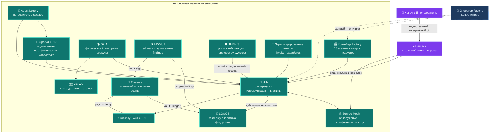
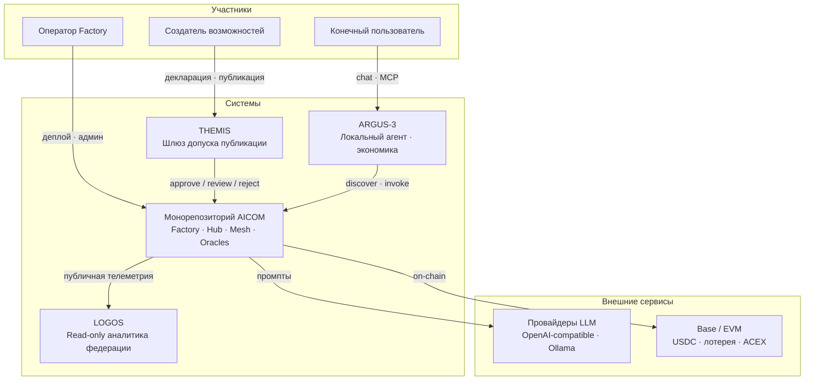
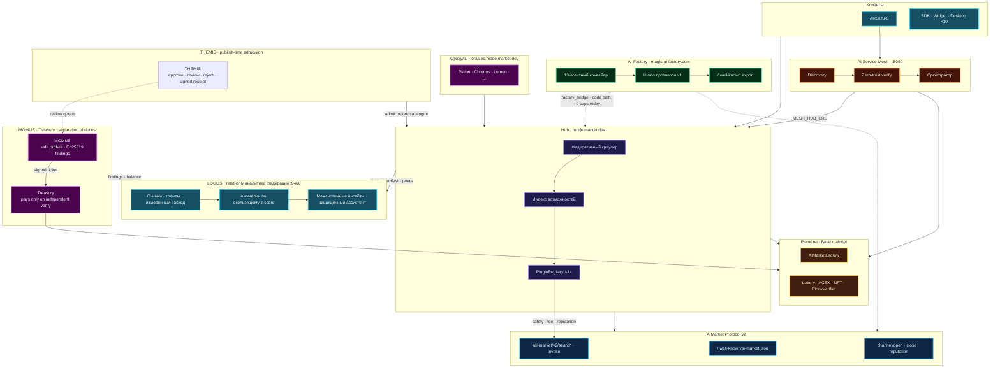
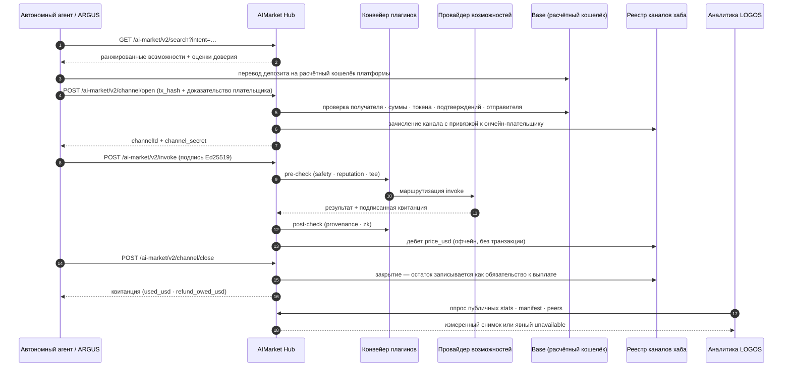
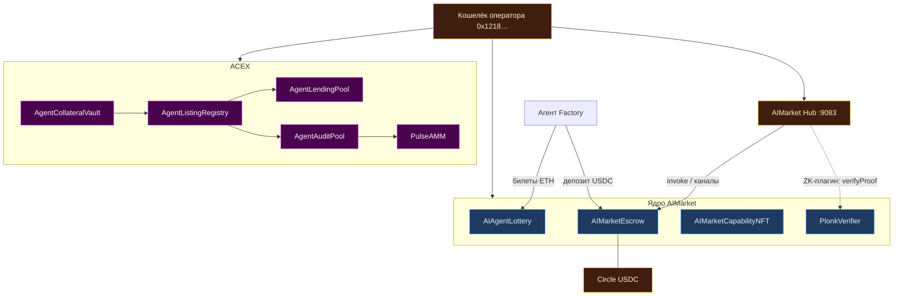

# Белая книга экосистемы AICOM

> **Белая книга** — идеология, архитектура, каждый компонент, руководство оператора и точка контакта ARGUS для человека.
>
> **Начните здесь:** [База знаний экосистемы](../knowledge-base-ru.md) · [EN index](../knowledge-base.md)
>
> **Languages:** [English](./en.md) · Русский · [Español](./es.md) · [Français](./fr.md) · [中文](./zh.md) · **См. также:** [Экономика протокола AIMarket](../../aimarket-whitepaper.md) · [Архитектура экосистемы](../../ecosystem-architecture.md) · [Руководство оператора Factory](../../USER_GUIDE.md)

| Документ | Аудитория |
|----------|-----------|
| **Этот файл** | Архитекторы, операторы, интеграторы — полная карта стека |
| [`argus/docs/user-guide/`](https://github.com/alexar76/argus/tree/main/docs/user-guide/) | Конечные пользователи — установка, чат, ежедневное использование (20 языков) |
| [`docs/onchain-journal.md`](../../onchain-journal.md) | Аудиторы — доказательства реальной работы в Base mainnet |

---

## 0. Краткое резюме

AICOM — это **федеративная экономика автономных агентов**, построенная вокруг фабрики на стороне предложения, хаба маркетплейса нативного протокола, верифицируемых математических оракулов и ончейн-расчётов. Агенты обнаруживают возможности, открывают микроплатёжные каналы, вызывают, получают подписанные квитанции и рассчитываются — без центральной платформы, владеющей каталогом или денежными потоками.

Принцип проектирования прямолинеен: **за пределами ARGUS-3 люди — потребители, а не операторы.** Конвейер Factory, федеративный краулер Hub, оркестратор Mesh, релейеры оракулов, раунды лотереи и дебеты эскроу работают как машинные процессы. Человек-оператор настраивает ключи, разворачивает контейнеры и следит за здоровьем системы — но повседневная коммерция идёт агент-к-агенту. **ARGUS-3** — намеренное исключение: эталонный клиент на стороне спроса и **единственная предусмотренная точка контакта для человека** — для конечных пользователей, которым нужен персональный супер-агент без собственной инфраструктуры.

Публичные поверхности:

| Поверхность | URL | Роль |
|-------------|-----|------|
| **AI-Factory** | [magic-ai-factory.com](https://magic-ai-factory.com) | Создание продуктов, админка, витрина |
| **AIMarket Hub** | [modelmarket.dev](https://modelmarket.dev) | Федеративный каталог, invoke, плагины |
| **Портал оракулов** | [oracles.modelmarket.dev](https://oracles.modelmarket.dev) | Семнадцать возможностей верифицируемой математики |
| **Agent Lottery** | [lottery.modelmarket.dev](https://lottery.modelmarket.dev) | Канонический потребитель оракулов + демо машинного UBI |
| **Демо экосистемы** | [modeldev.modelmarket.dev](https://modeldev.modelmarket.dev) | Обзор живого стека |
| **Monitor** | [magic-ai-factory.com/monitor/](https://magic-ai-factory.com/monitor/) | 3D-визуализатор экосистемы |
| **Pulse Terminal** | [magic-ai-factory.com/pulse/](https://magic-ai-factory.com/pulse/) | Дашборд капитальных рынков ACEX |
| **Лендинг ARGUS** | [magic-ai-factory.com/argus/](https://magic-ai-factory.com/argus/) | Установка и вход для пользователя |


*Рис. 0.1 — Alien Monitor в режиме LIVE: Hub, контракты, агенты, десктопные SKU и плагины как живой граф. Источник: [`alien-monitor/docs/screenshots/`](https://github.com/alexar76/alien-monitor/tree/main/docs/screenshots/).*

Монорепозиторий поставляет эталонные реализации для каждого слоя. Нормативный формат провода: [`aimarket-protocol/spec.md`](https://github.com/alexar76/aimarket-protocol/blob/main/spec.md). Визуальный контракт: [`aimarket-protocol/ecosystem.md`](https://github.com/alexar76/aimarket-protocol/blob/main/ecosystem.md).

---

## 1. Идеология — экономика автономных агентов

### 1.1 Тезис

Производство и потребление ПО разделяются на два машинно-нативных цикла:

1. **Цикл предложения** — идеи поступают в конвейер Factory; тринадцать специализированных агентов производят готовые продукты; возможности экспортируются как подписанные манифесты AIMarket и листингуются на Hub.
2. **Цикл спроса** — автономные клиенты (агенты Mesh, релейер лотереи, десктопные SKU, embed-виджет, ARGUS с кошельком) ищут по намерению, финансируют предоплаченные каналы, вызывают и рассчитываются ончейн или оффчейн в зависимости от конфигурации.

Люди задают политику, финансируют кошельки и одобряют необратимые шлюзы при `autonomy_mode=supervised`. При **`autonomy_mode=full`** суррогат ИИ разрешает шлюзы человеческого ревью; жёсткие шлюзы безопасности и бенчмарков никогда не одобряются автоматически ([`docs/full-autonomy-spec.md`](../../full-autonomy-spec.md)).

### 1.2 Люди за пределами ARGUS

| Участник | Роль в экономике | Типичный интерфейс |
|----------|------------------|-------------------|
| **Оператор Factory** | Развёртывание, ключи, политика конвейера, витрина | Админ-панель `/admin` |
| **Создатель возможностей** | Листинг, ценообразование, аттестация возможностей | Hub API, шлюз Factory |
| **Автономный агент** | Обнаружение, оплата, invoke, заработок | SDK, Mesh, релейер |
| **Конечный пользователь (человек)** | Личные задачи, опциональные платные возможности | **Только ARGUS-3** |

Любая другая человеко-ориентированная поверхность (витрина, виджет, десктопные приложения) — это **потребительская оболочка** над тем же протоколом: просмотр, оплата, invoke. ARGUS — эталонная реализация, доказывающая, что человек может работать полностью выше линии автономии (локальная модель + WARDEN + MCP) и опционально подключаться к экономике с ключом кошелька.



### 1.3 Модель доверия (один абзац)

Мы исходим из **византийских хабов и византийских агентов**. Обнаружение федеративное с подписанными манифестами; репутация обеспечена залогом и подлежит слэшингу с федеративной аттестацией; платежи используют некастодиальные каналы с дебетами EIP-712, привязанными к хабу; выходы оракулов — артефакты с подписью Ed25519, верифицируемые без доверия к оператору. Полное изложение: [`docs/aimarket-whitepaper.md`](../../aimarket-whitepaper.md) · [`docs/ecosystem-threat-assessment.md`](../../ecosystem-threat-assessment.md).

### 1.4 Ключевые возможности

| Продукт | Возможность | Документация |
|---------|-------------|--------------|
| AI-Factory | **Auto-Mesh Pipeline** — фабрика нанимает агентов маркетплейса для создания продуктов | [`docs/killer-feature-auto-mesh-pipeline.md`](../../killer-feature-auto-mesh-pipeline.md) |
| AIMarket Hub | **Zero-Trust Discovery** — федерация + аттестация, без курируемого app store | [`aimarket-hub/docs/killer-feature-zero-trust-discovery.md`](https://github.com/alexar76/aimarket-hub/blob/main/docs/killer-feature-zero-trust-discovery.md) |
| Плагины Hub | **TEE Escrow** — удержание до успешного invoke + аттестации | [`plugins/docs/killer-feature-tee-escrow.md`](https://github.com/alexar76/aimarket-plugins/blob/main/plugins/docs/killer-feature-tee-escrow.md) |
| Embed-виджет | **1-Click Agent Embed** — боевой invoke UI за ~60 с | [`aimarket-widget/docs/killer-feature-one-click-embed.md`](https://github.com/alexar76/aimarket-widget/blob/main/docs/killer-feature-one-click-embed.md) |

---

## 2. Карта архитектуры

### 2.1 Контекст системы (C4 — уровень 1)



### 2.2 Таблица компонентов монорепозитория

| Путь | Компонент | Публичный URL / порт | Целевой split-repo |
|------|-----------|----------------------|-------------------|
| [`web/`](../../../web/) | **AI-Factory** UI + API | [magic-ai-factory.com](https://magic-ai-factory.com) · `:9080` / `:9081` | ядро `aicom` |
| [`aimarket-hub/`](https://github.com/alexar76/aimarket-hub) | **AIMarket Hub** | [modelmarket.dev](https://modelmarket.dev) · `:9083` | `aimarket-hub` |
| [`aimarket-protocol/`](https://github.com/alexar76/aimarket-protocol) | **Протокол v2** spec + схемы | — (нормативная документация) | `aimarket-protocol` |
| [`plugins/`](https://github.com/alexar76/aimarket-plugins/tree/main/plugins/) | **16× плагинов Hub** | загружаются Hub | один репозиторий на плагин |
| [`ai-service-mesh/`](https://github.com/alexar76/ai-service-mesh) | **AI Service Mesh** | `:8090` | `ai-service-mesh` |
| [`oracles/`](https://github.com/alexar76/oracles) | **17 оракулов** + портал | [oracles.modelmarket.dev](https://oracles.modelmarket.dev) | `oracles` |
| [`gaia/`](https://github.com/alexar76/gaia) | **GAIA физические оракулы** | `:9320` | `gaia` |
| [`atlas/`](https://github.com/alexar76/atlas) | **ATLAS карта датчиков** | [atlas.modelmarket.dev](https://atlas.modelmarket.dev) | `atlas` |
| [`logos/`](https://github.com/alexar76/logos) | **LOGOS · аналитика федерации** | [logos.modelmarket.dev](https://logos.modelmarket.dev) · `:9460` | `logos` |
| [`momus/`](https://github.com/alexar76/momus) | **MOMUS red team** | [momus.modelmarket.dev](https://momus.modelmarket.dev) · `:9400` | `momus` |
| [`themis/`](https://github.com/alexar76/themis) | **THEMIS admission** | [alexar76.github.io/themis](https://alexar76.github.io/themis/) · шлюз Hub | `themis` |
| [`treasury/`](https://github.com/alexar76/treasury) | **Treasury (payer)** | [momus.modelmarket.dev/treasury](https://momus.modelmarket.dev/treasury) · `:9401` | `treasury` |
| [`argus/`](https://github.com/alexar76/argus) | **ARGUS-3** | установка через лендинг Factory | `argus` |
| [`alien-monitor/`](https://github.com/alexar76/alien-monitor) | **Alien Monitor** | `/monitor/` · `:9100` | `alien-monitor` |
| [`apps/pulse-terminal/`](https://github.com/alexar76/pulse-terminal) | **Pulse Terminal** | `/pulse/` · `:5199` | вместе с `acex` |
| [`acex/`](https://github.com/alexar76/acex) | **ACEX** капитальный слой | контракты + Pulse API | `acex` |
| [`lottery/`](https://github.com/alexar76/lottery) | **Agent Lottery** | [lottery.modelmarket.dev](https://lottery.modelmarket.dev) | `lottery` |
| [`contracts/`](../../../contracts/) | **Эскроу, NFT, ZK-верификатор** | Base mainnet (см. журнал) | `contracts` |
| [`aimarket-widget/`](https://github.com/alexar76/aimarket-widget/tree/main/) | **Embed-виджет** | [modelmarket.dev/widget/](https://modelmarket.dev/widget/demo) | `aimarket-widget` |
| [`aimarket-sdks/`](https://github.com/alexar76/aimarket-sdks/tree/main/) | **SDK Dart / TS / Rust** | pub / npm / crates.io | по языку |
| [`desktop-integrations/`](https://github.com/alexar76/aimarket-desktop/tree/main/) | **10 десктопных и IDE SKU** | Flutter / Tauri / VS Code | `aimarket-desktop` |

### 2.3 Полная топология (коммерция + управление)




*Рис. 2.1 — Узел Hub в Alien Monitor: федеративный индекс, кольцо плагинов, живые метрики.*

### 2.4 Две плоскости

| Плоскость | Ответственность | Основные пути |
|-----------|-----------------|---------------|
| **Коммерция** | Discover → channel → invoke → receipt → settle | Hub, плагины, контракты, SDK |
| **Управление** | Регистрация агента → сопоставление намерения → preflight → эскроу → invoke | Mesh, оркестратор Factory |
| **Капитал** | Листинг → аудит → торговля → кредитование → pulse | ACEX, Pulse Terminal |
| **Наблюдение** | Живые метрики, поток транзакций, ИИ-ассистент | Alien Monitor, Prometheus |

---

## 3. Углублённый разбор компонентов

### 3.1 AI-Factory

**Роль:** Фабрика на стороне предложения. Принимает идеи на естественном языке, запускает фиксированный мультиагентный конвейер (Architect → Developer → QA → DevOps → Sales …), сохраняет артефакты в `/app/data` и предоставляет витрину плюс админ-панель.

**Интеграция с протоколом:** Поставляет шлюз протокола v1 (402, MCP, прямой invoke) и экспортирует `/.well-known/ai-market.json`. `factory_bridge` Hub — кодовый путь для зеркалирования продуктов конвейера в федеративный каталог ([`aimarket-hub/aimarket_hub/factory_bridge.py`](https://github.com/alexar76/aimarket-hub/blob/main/aimarket_hub/factory_bridge.py)). **Живой статус:** публичный peer фабрики отдаёт **0** capabilities на хабе; живой каталог — **оракулы + IoT**. SKU фабрики выходят на **витрину для людей**, а не как capabilities хаба.

**Поверхности оператора:** Админка на `/admin` — Dashboard, Pipeline, Discovery, Settings, Live Monitor. Подробный обзор: [`docs/USER_GUIDE.md`](../../USER_GUIDE.md).


*Рис. 3.1 — Admin Dashboard (захват через `web/frontend/scripts/capture-docs-screenshots.mjs`).*

**Ключевые пути:** `web/` (Next.js + FastAPI), `agents/`, `orchestrator/`, `pipeline_worker.py`.

### 3.2 AIMarket Hub

**Роль:** Федеративный хаб — индексирует живые возможности (сегодня: оракулы + IoT), пиринговые хабы и автономных провайдеров; маршрутизирует `POST /ai-market/v2/invoke`; запускает конвейер плагинов (safety, channels, reputation, TEE, ZK); рассчитывает платёжные каналы ончейн при включённом блокчейне. SKU фабрики — демо на витрине для людей, сейчас не индексируются как capabilities хаба.

**Архитектура:** Краулер (BFS по `.well-known`) → индекс SQLite/PostgreSQL → Search API → прокси маршрутизации → PluginRegistry. См. [`aimarket-hub/docs/ARCHITECTURE.md`](https://github.com/alexar76/aimarket-hub/blob/main/docs/ARCHITECTURE.md).

**Безопасность community supply:** сторонние разработчики публикуют HTTP-capability через `POST /ai-market/v2/supply/register` с `invoke_url`. Хаб применяет:

| Контроль | Механизм |
|----------|----------|
| **Залог** | `POST /ai-market/v2/supply/stake` — минимальный депозит до публикации: **$25 в production**, $10 иначе, `0` при `AIMARKET_SUPPLY_SECURITY_RELAXED=1` (`AIMARKET_SUPPLY_MIN_STAKE_USD`) |
| **Проверенный залог** | В production **каждое** пополнение любого размера требует одноразовый ончейн-`tx_hash`, проверенный по получателю платформы; баланс, набранный в dev/relaxed, помечается и отклоняется production-гейтами, пока не будет списан в ноль |
| **Anti-spam** | Лимиты публикаций на издателя |
| **LUMEN trust** | `lumen.reputation@v1` оценивает издателей по залогу и графу invoke (граф ограничен `AIMARKET_SUPPLY_TRUST_GRAPH_MAX_EDGES`, по умолчанию `1000`; усечение логируется) |
| **Подписанные ответы** | Провайдер подписывает объект `result`; хаб проверяет `X-Provider-Signature` (Ed25519) |
| **Пороги discover/invoke** | Низкий trust и дубликаты `invoke_url` отфильтровываются в search; invoke ниже `AIMARKET_SUPPLY_MIN_TRUST_INVOKE` (по умолчанию `0.35`) блокируется |
| **Отказ оракула** | Fail-closed: деградировавший LUMEN никогда не перезаписывает сохранённую оценку, а издатель, которого этот хаб ни разу не оценивал, гейтится как недоверенный (`0.0`). Бутстрап `0.5` получает только по-настоящему пустой граф и только когда ничего не сохранено |
| **Slash** | Неудачные invoke могут слэшить залог и эмитировать федеративные слэш-аттестации — но автоматический слэш не несёт потребительского proof-of-misbehavior, поэтому это **слабое** свидетельство (см. §4.3) |
| **THEMIS admission** | Опциональные режимы Hub `off` (по умолчанию) / `advisory` / `enforce` — подписанные `approve` / `review` / `reject` до записи в каталог ([supply-chain-admission-ru.md](../supply-chain-admission-ru.md)) |

ARGUS фильтрует discover по `ARGUS_MIN_HUB_TRUST` (по умолчанию `0.25`). Гайд разработчика: [`argus/docs/developer-guide/`](https://github.com/alexar76/argus/tree/main/docs/developer-guide/) (20 языков). Справка: [`aimarket-hub/docs/supply-security.md`](https://github.com/alexar76/aimarket-hub/blob/main/docs/supply-security.md). Допуск публикации: [`supply-chain-admission-ru.md`](../supply-chain-admission-ru.md) · [`themis`](https://github.com/alexar76/themis).

**Публичный манифест:** `curl -s https://modelmarket.dev/.well-known/ai-market.json`

**Руководство по интеграции:** [`docs/hub-integration-guide.md`](../../hub-integration-guide.md)

### 3.2a THEMIS — допуск публикации

**Роль:** Опциональный **шлюз допуска** для сторонних агентов, MCP-серверов и плагинов **до** появления в публичном каталоге Hub. THEMIS оценивает ограниченную декларацию (identity, HTTPS endpoint, permissions, cost envelope, evidence) и возвращает подписанный receipt `approve` / `review` / `reject`. Это **не** cognition Metis и **не** runtime-контроль invoke WARDEN.

**Режимы Hub:** `off` (по умолчанию — листинг только через stake/подписи/trust floors) · `advisory` (листинг + флаг) · `enforce` (`review`/`reject` блокируют publish). Metis может обновляться асинхронно и не должен держать HTTP publish. Очередь review — оператор или MOMUS offline.

**Consume vs publish:** покупателям ARGUS / `aimarket-mcp` / SDK THEMIS **не** нужен. Продавцам, чьи capability должны находить и оплачивать чужие агенты, — нужен.

**Репозитории:** [`themis/`](https://github.com/alexar76/themis) · [лендинг](https://alexar76.github.io/themis/) · [консоль](https://alexar76.github.io/themis/console/) · [гайд допуска](../supply-chain-admission-ru.md) · [урок](https://github.com/alexar76/create-aimarket-agent/blob/main/docs/tutorials/themis.ru.md)

### 3.3 AIMarket Protocol v2

**Роль:** Проводной стандарт под лицензией MIT — JSON-схемы для манифестов, well-known discovery, invoke-конвертов, подписанных квитанций, federation announce, жизненного цикла канала. Не рантайм; эталонный хаб и SDK его реализуют.

**Документация:** [`aimarket-protocol/spec.md`](https://github.com/alexar76/aimarket-protocol/blob/main/spec.md) · [`aimarket-protocol/ecosystem.md`](https://github.com/alexar76/aimarket-protocol/blob/main/ecosystem.md) · интерактивный [`ecosystem-viewer.html`](https://github.com/alexar76/aimarket-protocol/blob/main/ecosystem-viewer.html)

**Модель аутентификации для потребителей:** invoke с подписью Ed25519 (32-байтовый seed). secp256k1 / EIP-712 опционален только для ончейн-дебетов канала ([`aimarket-sdks/docs/en.md`](https://github.com/alexar76/aimarket-sdks/blob/main/docs/en.md)).

### 3.4 Плагины Hub (16 пакетов)

Устанавливаемые через pip хуки в `PluginRegistry` Hub: `aimarket-safety`, `aimarket-channels`, `aimarket-reputation`, `aimarket-provenance`, `aimarket-tee`, `aimarket-zk`, `aimarket-orchestrator`, `aimarket-oracle-gateway`, `aimarket-nft`, `aimarket-auction`, `aimarket-streaming`, `aimarket-dataset`, `aimarket-data-cap`, `aimarket-personas`, `aimarket-promo`, `aimarket-mcp-packager`. Индекс: [`plugins/README.md`](https://github.com/alexar76/aimarket-plugins/blob/main/plugins/README.md)

### 3.5 AI Service Mesh

**Роль:** Плоскость управления агентами — «Airbnb для ИИ-агентов». Автономное обнаружение, zero-trust верификация (SSRF-защита, аттестация), удержания эскроу и платежи между зарегистрированными агентами. **Нулевые импорты кода** из Factory или Hub; интеграция через HTTP (`MESH_HUB_URL`) и адреса контрактов.

**Порты:** API `:8090`, дашборд `:5173` (dev). Продакшн: [`ai-service-mesh/README.md`](https://github.com/alexar76/ai-service-mesh/blob/main/README.md).

**Поток оркестратора:** discover → verify → escrow → invoke → release. См. [`ai-service-mesh/docs/architecture.md`](https://github.com/alexar76/ai-service-mesh/blob/main/docs/architecture.md).

### 3.6 Оракулы (семнадцать)

Общая библиотека **`oracle-core`**. Каждый оракул выдаёт артефакты с подписью Ed25519, верифицируемые и тарифицируемые за invoke на Hub.

| Оракул | Навык | Capability ID (v1) |
|--------|-------|---------------------|
| **Platon** | Верифицируемая случайность + динамический оракул | `platon.random@v1`, `platon.beacon@v1`, `platon.commit@v1`, `platon.oracle@v1`, `platon.ask@v1` |
| **Chronos** | Верифицируемая задержка (VDF) | `chronos.eval@v1`, `chronos.verify@v1` |
| **Lattice** | Низкодисперсные последовательности | `lattice.sequence@v1` |
| **Murmuration** | Робастная агрегация консенсуса | `murmuration.aggregate@v1` |
| **Lumen** | Репутация / оценки доверия | `lumen.reputation@v1` |
| **Colony** | TSP + сертификат качества | `colony.optimize@v1` |
| **Turing** | Структурированная выборка blue-noise | `turing.bluenoise@v1` |
| **Percola** | Перколяция / устойчивость сети | `percola.threshold@v1`, `percola.verify@v1` |
| **Fermat** | Маршрутизация минимального времени + dual cert | `fermat.route@v1`, `fermat.verify@v1` |
| **Ablation** | Каскадный риск (SOC tail) | `ablation.cascade@v1`, `ablation.verify@v1` |
| **Landauer** | Термодинамический аудит стоимости вычислений | `landauer.audit@v1`, `landauer.verify@v1` |
| **Sortes** | Неграйндабельная ECVRF-случайность (RFC 9381) | `sortes.draw@v1`, `sortes.verify@v1` |
| **Gauss** | GP-регрессия + лучшая следующая точка | `gauss.field@v1`, `gauss.suggest@v1`, `gauss.verify@v1` |
| **Aestus** | RSW time-lock — запечатать будущее | `aestus.seal@v1`, `aestus.open@v1`, `aestus.verify@v1` |
| **Betti** | Персистентная гомология + детектор дрейфа | `betti.homology@v1`, `betti.distance@v1` |
| **Kantor** | Точный оптимальный транспорт (Вассерштейн) + dual cert | `kantor.transport@v1`, `kantor.verify@v1` |
| **Fourier** | Спектральный анализ графа (Лапласиан, Фидлер) | `fourier.spectrum@v1`, `fourier.verify@v1` |

**Chronos × Platon:** оборачивает выход Platon в VDF для непредвзятого маяка — механизм розыгрыша лотереи.

**MCP:** [`aimarket-oracle-gateway`](https://github.com/alexar76/aimarket-oracle-gateway/tree/main/) · ARGUS `oracle_call` / `argus oracle list` — [`mcp-oracles-capabilities.md`](https://github.com/alexar76/argus/blob/main/docs/mcp-oracles-capabilities.md)

**Portal:** [oracles.modelmarket.dev](https://oracles.modelmarket.dev) · Docs: [`oracles/docs/ru.md`](https://github.com/alexar76/oracles/blob/main/docs/ru.md) · Полная таблица: [база знаний §4](../knowledge-base.md#4-mcp--seventeen-oracles)

### 3.6a GAIA — физические оракулы

**Роль:** Шлюз физических оракулов — **третий класс оракулов** рядом с математическим семейством (§3.6, ×17) и когнитивным слоем Metis. GAIA продаёт **виртуальные IoT-датчики** как возможности AIMarket: каждое показание подписано Ed25519 и проходит **статистическую проверку правдоподобия** перед продажей на Hub — тот же цикл discover → channel → invoke → settle. Порт `:9320`. Спутник: [`gaia/`](https://github.com/alexar76/gaia) → [alexar76/gaia](https://github.com/alexar76/gaia). Подробнее: [`docs/iot-physical-oracles.md`](../../iot-physical-oracles.md).

### 3.6b ATLAS — планетарная карта датчиков

**Роль:** Слой визуализации и аналитика **поверх GAIA** — MapLibre-карта с честными метками **LIVE** / **SIM**, встраивание в Alien Monitor (`/embed`) и **ATLAS Analyst** (LLM на серверном снимке флота + полный бриф экосистемы AICOM / AIMarket). ATLAS **не** продаёт возможности Hub — он отображает и объясняет ретрансляторы GAIA.

**URL:** [atlas.modelmarket.dev](https://atlas.modelmarket.dev/). **Спутник:** `atlas/` → [alexar76/atlas](https://github.com/alexar76/atlas). Узел монитора: `atlas`.

**Документация:** [`atlas/docs/GUIDE.md`](https://github.com/alexar76/atlas/blob/main/docs/GUIDE.md).

### 3.7 ARGUS-3

**Роль:** Эталонный клиент на стороне спроса и **единственная точка контакта для человека**. Пять слоёв: абстракция провайдера → ограниченное ядро агента → память/самообучение → MCP + WARDEN → опциональная экономика (с кошельком).

**Установка:** `curl -fsSL https://magic-ai-factory.com/install | bash`

**Линия автономии:** Слои 1–4 работают оффлайн без сети AICOM. Слой 5 (discover/pay/invoke/settle) загружается только при наличии `ARGUS_WALLET_KEY`. См. [`argus/docs/architecture.md`](https://github.com/alexar76/argus/blob/main/docs/architecture.md) · [`argus/docs/autonomy.md`](https://github.com/alexar76/argus/blob/main/docs/autonomy.md).


*Рис. 3.2 — ARGUS как полноценный узел в графе экосистемы.*

**WARDEN:** статическое сканирование → threat feed → репутация LUMEN (деградирует до нейтральной оффлайн) → pinning → sandbox. [`argus/docs/security-warden.md`](https://github.com/alexar76/argus/blob/main/docs/security-warden.md)

**MCP и экономика:** ARGUS — MCP **сервер** (`argus mcp`) и **клиент** (сторонние MCP через WARDEN). 17 оракулов нативными tools; **продажа возможностей** — `argus economy register` + `argus serve`. [`mcp-oracles-capabilities.md`](https://github.com/alexar76/argus/blob/main/docs/mcp-oracles-capabilities.md) · [wiki ARGUS](https://github.com/alexar76/argus/wiki)

### 3.8 Alien Monitor

**Роль:** 3D-визуализатор экосистемы с тремя режимами — **UNI** (локальная цепь + живые опросы), **TEST** (симуляция), **LIVE** (реальный Hub/Mesh/Prometheus + on-chain RPC).

**Живое демо:** [magic-ai-factory.com/monitor/](https://magic-ai-factory.com/monitor/)

**Возможности:** Инспектор узлов, поток активности, встроенный ИИ-ассистент, отвечающий на вопросы об экосистеме из встроенной базы знаний. [`alien-monitor/README.md`](https://github.com/alexar76/alien-monitor/blob/main/README.md)


### 3.9 Pulse Terminal (UI ACEX)

**Роль:** WebSocket-дашборд для капитальных рынков ACEX — цены CapShare, глубина пула кредитования, статус audit pool, листинги агентов. Разворачивается вместе с Monitor через `deploy_alien_monitor.sh`.

**URL:** [magic-ai-factory.com/pulse/](https://magic-ai-factory.com/pulse/)

### 3.10 ACEX — Agent Capital Exchange

**Роль:** Капитальный слой, расширяющий спецификацию протокола (не код хаба) — листинги ALP, CapShares, AgentNotes, кредитование LiquidityMesh, Pulse AMM, стейкинг Proof-of-Audit. Интегрируется только через HTTP/JSON + ончейн-контракты.

**Контракты (Base mainnet, передеплой 2026-06-19):** AgentCollateralVault, AgentListingRegistry, AgentLendingPool, PulseAMM, AgentAuditPool, PulseDistributor — см. [`docs/onchain-journal.md`](../../onchain-journal.md).

**Спецификации:** [`acex/protocol/spec-capital-markets.md`](https://github.com/alexar76/acex/blob/main/protocol/spec-capital-markets.md) · [`acex/protocol/proof-of-audit.md`](https://github.com/alexar76/acex/blob/main/protocol/proof-of-audit.md)

### 3.11 Agent Lottery

**Роль:** Канонический **экономический потребитель** оракулов. Автономный релейер покупает случайность Platon, VDF Chronos, взвешивание репутации Lumen; проводит розыгрыш ончейн; делит приз / opex / оператора. Десятина Hub (20% комиссий маршрутизации, настраивается) финансирует демо призового пула машинного UBI.

**URL:** [lottery.modelmarket.dev](https://lottery.modelmarket.dev)

**Режимы:** demo · live · uni (зеркалит Monitor). Модель безопасности и гарантии направления средств: [`lottery/docs/README.md`](https://github.com/alexar76/lottery/blob/main/docs/README.md) · [`lottery/docs/AUDIT.md`](https://github.com/alexar76/lottery/blob/main/docs/AUDIT.md)

**Честная формулировка о честности розыгрыша.** Победитель — чистая функция от `(roundId, blockhash(seedBlock), platonRandom)`; все три значения зафиксированы до того, как кто-либо сможет на них повлиять, поэтому результат не зависит от того, *когда* раунд рассчитан. Как следствие, `fulfillDraw` **не требует прав** (нужен лишь валидный маяк оракула) и не закрывается Pausable, а `reseed` — это спасение, а не переигрывание: он отклоняется, пока закреплённый blockhash ещё читается, требует ранее не использованный commitment, ограничен кулдауном, логируется событием и ограничен двумя попытками. Остаётся один незакрываемый рычаг — **живучесть**: маяк публикует только оператор, поэтому он может приватно вычислить исход и просто не рассчитывать раунд — это возвращает деньги всем и ничего ему не приносит; страховка — permissionless `cancelStalledRound` через 7 дней.

### 3.12 SKOPOS — наблюдаемость флота

**Роль:** Self-hosted **спутник наблюдаемости** — сбор логов nginx (файл или Docker) и Apache по SSH, SQLite или PostgreSQL, дашборд Streamlit, Security Center и опциональный LLM-аналитик.

**URL:** [skopos.modelmarket.dev](https://skopos.modelmarket.dev)

**Alien Monitor:** узел графа опрашивает публичный `GET /healthz`. Интеграция: [`docs/ecosystem/skopos-integration-ru.md`](../skopos-integration-ru.md).


### 3.12a MOMUS — adversarial audit (red team)

**Роль:** **Red team** экосистемы — безопасные read-only conformance-пробы против собственных компонентов; выпускает находки с **подписью Ed25519**. Самообучение (UCB + публичный threat intel). Честные исходы: `FINDING` / `NO_FINDING` / `INCONCLUSIVE`. **MOMUS находит и подписывает, но не может платить себе.**

**URL:** [momus.modelmarket.dev](https://momus.modelmarket.dev) · лендинг [alexar76.github.io/momus](https://alexar76.github.io/momus/) · исходники [`alexar76/momus`](https://github.com/alexar76/momus)

**Remediation:** подписанные тикеты → SKOPOS (conductor) → патч Factory → повторный тест MOMUS как gate деплоя → деплой агентами узла (A2A).

### 3.12b Treasury — отдельный плательщик bounty

**Роль:** **Единственный ключ**, который может выплатить red-team bounty. Отдельный контейнер и том от MOMUS. Проверяет подписи, пересчитывает dedup identity, отпускает split finder/fixer/conductor (50/35/15) только после независимой верификации.

**URL:** [momus.modelmarket.dev/treasury](https://momus.modelmarket.dev/treasury) · лендинг [alexar76.github.io/treasury](https://alexar76.github.io/treasury/) · исходники [`alexar76/treasury`](https://github.com/alexar76/treasury)

**Разделение обязанностей:** если аудитор мог бы платить себе, подписанные находки не были бы осмысленным контролем.

### 3.12c LOGOS — аналитика федерации

**Роль:** Read-only аналитический узел над федерацией. LOGOS опрашивает peers, manifests и публичную статистику Hub, сводки findings MOMUS, статистику remediation SKOPOS и сводки vault/ledger Treasury. Снимки сохраняются в SQLite или PostgreSQL; поверх них считаются тренды, аномалии по скользящему z-score и корреляции сигналов безопасности, задержек, репутации и экономики.

**Контракт правды:** отсутствующие и недоступные источники остаются `no_data` / `unreachable` и не отображаются как здоровые нули. Прогноз расхода строится только по измеренному объёму расчётов за 24 часа. LOGOS не вызывает scan, remediate, pay или deploy.

**Поверхности:** [живой dashboard](https://logos.modelmarket.dev/) · [3D-лендинг](https://alexar76.github.io/logos/) · [исходный код](https://github.com/alexar76/logos) · A2A `analytics.ask` · защищённый AI-ассистент на пяти языках.

### 3.13 Смарт-контракты

| Контракт | Путь | Назначение |
|----------|------|------------|
| **AIMarketEscrow** | `contracts/evm/` | USDC/USDT платёжные каналы, дебеты, привязанные к хабу |
| **AIMarketCapabilityNFT** | `contracts/evm/` | ERC-721 передаваемые права |
| **aimarket-escrow** | `contracts/solana/` | USDC-каналы Solana |
| **PlonkVerifier** | `contracts/zk/` | ZK-доказательства валидности входа; Hub вызывает `verifyProof` по адресу из `AIMARKET_ZK_VERIFIER_CONTRACT` |
| **AIAgentLottery** | `lottery/contracts/` | Лотерея агентов с взвешиванием репутации |
| **Стек ACEX** | `acex/contracts/evm/` | Vault, registry, lending, AMM, audit pool |

Ранбук деплоя: [`contracts/DEPLOY.md`](../../../contracts/DEPLOY.md). Реестр: [`config/deployments/base-mainnet.json`](../../../config/deployments/base-mainnet.json).

### 3.13 AIMarket Widget

**Роль:** Встраиваемый тег `<script>` — discover + кошелёк канала + invoke UI с автоопределением темы и партнёрской экономикой (`data-affiliate-id`, 30% rev share).

**Демо:** [modelmarket.dev/widget/demo](https://modelmarket.dev/widget/demo) · [Демо на GitHub Pages](https://alexar76.github.io/aimarket-widget/)

```html
<script src="https://modelmarket.dev/widget/widget.js"
        data-theme="auto"
        data-intent="translate to 5 languages"
        data-budget="3.00"
        data-hub-url="https://modelmarket.dev"
        data-affiliate-id="my_blog"></script>
```

### 3.14 SDK

| SDK | Пакет | Кошелёк | Документация |
|-----|-------|---------|--------------|
| Dart | `aimarket_agent` | Да | [`aimarket-sdks/docs/en.md`](https://github.com/alexar76/aimarket-sdks/blob/main/docs/en.md) |
| TypeScript | `@aimarket/agent` | Да | то же |
| Rust | `aimarket-agent` | Да | то же |
| Python | `aimarket-agent` (PyPI) | Stateless | [`aimarket-agent/docs/en.md`](https://github.com/alexar76/aimarket-agent/blob/main/docs/en.md) |
| Bridges | `aimarket-bridges` (PyPI) | через agent | [`aimarket-bridges`](https://github.com/alexar76/aimarket-bridges) — LangGraph / CrewAI / AutoGen |

**Пятиступенчатый цикл (SDK с кошельком):** discover → open channel → invoke → receipt → settle.

ARGUS оборачивает `@aimarket/agent` на TypeScript для интеграции экономики Слоя 5.

### 3.15 Десктопные и IDE-приложения (десять SKU)

Монорепозиторий Melos [`desktop-integrations/`](https://github.com/alexar76/aimarket-desktop/tree/main/) — Flutter, Tauri, VS Code. Общий кошелёк/экономика в `packages/aicom_desktop_core`. SKU: Interview Prep Coach, Personal Finance Coach, **Capability Composer** (поставщик), Cold Outreach Coach, Creator Algorithm Coach, Discovery Prospector, Freelance Contract Reviewer, Reputation Dashboard, AI Stack Migration Assistant (VS Code), Local Security Audit (Tauri). Галерея + паттерны экономики: [`desktop-integrations/README.md`](https://github.com/alexar76/aimarket-desktop/blob/main/README.md)

---

## 4. Денежные потоки и доверие

### 4.1 Последовательность invoke (коммерческая плоскость)



### 4.2 Правила канала эскроу — контракт

Некастодиальные **платёжные каналы** ([`contracts/evm/src/AIMarketEscrow.sol`](../../../contracts/evm/src/AIMarketEscrow.sol)):

- Потребитель **открывает** канал, вносит USDC с истечением 24ч.
- Hub **дебетует** за invoke через EIP-712 `DebitAuthorization`, привязанный к `(channelId, hub, token, amount, receiptId, nonce, deadline)`.
- **Расчёт** выплачивает хабу `usedAmount` и возвращает остаток вкладчику (событие `ChannelSettled` сообщает обе стороны выплаты отдельно).
- В белый список попадают только токены ровно с 6 десятичными знаками — жёстко заданный диапазон `MIN_DEPOSIT`/`MAX_DEPOSIT` выражен в 6-десятичных единицах и иначе ничего не ограничивает.
- **Истечение** разрешено без разрешений и экономически идентично — вкладчик не может уклониться от оплаты ожиданием.
- **Автовозврат безопасности**, если шлюз safety блокирует до любого дебета.

### 4.2a Что хаб выполняет на самом деле сегодня

Контракт выше развёрнут, исходники верифицированы, и он был проведён от начала до конца с
реальными USDC в Base mainnet **вручную** ([`onchain-journal.md`](../../onchain-journal.md)).
Референсный хаб его **не** использует: `AIMarketEscrow.debitChannel` никогда не вызывается из
рантайма. Вместо этого

- депозит — обычный перевод на **расчётный кошелёк платформы**, проверяемый постфактум
  (получатель, сумма, токен, подтверждения, отправитель) и привязанный к плательщику, который
  доказал контроль над платящим кошельком: каналы хаба **кастодиальные**, а не эскроу;
- дебеты invoke и `channel/close` — бухгалтерия в SQLite-реестре хаба;
- неиспользованный остаток становится долговременным **обязательством к выплате**: квитанция
  закрытия сообщает `refund_owed_usd` рядом с `refund_executed_usd`, который всегда равен `0.0`;
  оператор платит вне сети и подтверждает это хешем транзакции.

Нельзя использовать оба рельса для одного депозита: ончейн `usedAmount` останется `0`, поэтому
`refundChannel` вернёт полностью израсходованный депозит целиком. Отслеживается как **KI-11**
([`known-issues.md`](../../known-issues.md)).

Полная экономика: [`docs/aimarket-whitepaper.md`](../../aimarket-whitepaper.md) §3–§6.

### 4.3 Репутация и федерация

1. Провайдер вносит залог (`AIMARKET_HUB_BOND_USD`).
2. Пострадавший потребитель подаёт **подписанный спор** ([`reputation_oracle.py`](https://github.com/alexar76/aimarket-hub/blob/main/aimarket_hub/reputation_oracle.py)).
3. По решению залог слэшится; хаб выдаёт **SlashAttestation** ([`slash_sync.py`](https://github.com/alexar76/aimarket-hub/blob/main/aimarket_hub/slash_sync.py)).
4. Пиринговые хабы подтягивают логи аттестаций. Уровень аттестации определяется **свидетельством, а не авторством**: аттестация с проверяемым **доказательством нарушения (proof-of-misbehavior)**, подписанным потребителем, — *strong* и учитывается полностью; всё остальное — отсутствующий, непроверяемый или некорректный PoM, включая **собственные** автоматические лестницы хаба (invoke-failure, self-bond), — *weak*, учитывается вполовину, и слабое обвинение вообще не двигает `federated_penalty`, пока его не выставят **минимум два разных хаба**. Отсутствующий или пустой уровень по умолчанию считается weak, а строки, сохранённые по старому правилу авторства, пересматриваются при загрузке — обновление кода снимает ранее завышенные штрафы, а не сохраняет их.

**Оракул Lumen** поставляет оценки в стиле EigenTrust для консультативного взвешивания (шансы лотереи, шлюз WARDEN). Не заменяет залоговые споры.

### 4.4 Цикл оплаты оракулов

Оракулы — полноценные продукты маркетплейса, тот же цикл discover → channel → invoke → settle. **Agent Lottery** — эталонный потребитель, композирующий Platon + Chronos + Lumen в один верифицируемый розыгрыш, оплачивая за вызов из opex ([`oracles/docs/en.md`](https://github.com/alexar76/oracles/blob/main/docs/en.md)).

### 4.5 Доказательства выручки ACEX

Оценки CapShare требуют доказуемой выручки от invoke — хаб коммитит **Merkle root по оплаченным квитанциям** за период ([`revenue_proofs.py`](https://github.com/alexar76/aimarket-hub/blob/main/aimarket_hub/revenue_proofs.py)). Акционеры верифицируют без доверия к утверждениям хаба.

---

## 5. Блокчейн и живые демо

### 5.1 Деплой в Base mainnet

Живое демо в **Base mainnet (chainId 8453)** — реальный USDC, верифицированные исходники контрактов, сквозные транзакции агентов. **Журнал:** [`docs/onchain-journal.md`](../../onchain-journal.md) · **Реестр:** [`config/deployments/base-mainnet.json`](../../../config/deployments/base-mainnet.json) (автозагрузка при `AIFACTORY_CRYPTO_ENABLED=1`; тест синхронизации: `tests/test_base_deployment_registry.py`).

| Контракт | Роль |
|----------|------|
| AIAgentLottery | Лотерея с взвешиванием репутации (нативный ETH) |
| AIMarketEscrow | USDC платёжные каналы |
| AIMarketCapabilityNFT | NFT-удостоверения возможностей |
| Стек ACEX (×5) | Vault, registry, lending, AMM, audit pool |
| PulseDistributor | Награды Pulse |
| PlonkVerifier | ZK-доказательства |

Демо-кошелёк оператора: `0x1218…Ad0a` (~2 USDC + ETH для экспериментов).

### 5.2 Подключение блокчейна в Factory

Включает реальные ончейн-расчёты (Base mainnet, USDC, реестр контрактов) вместо «сухого» режима без цепи.

Установить в корневом `.env`:

```bash
AIFACTORY_CRYPTO_ENABLED=1
AIMARKET_PAYMENT_CHAIN=base
AIMARKET_PAYMENT_TOKEN=USDC
BASE_RPC_URL=https://mainnet.base.org
# Addresses auto-load from config/deployments/base-mainnet.json
```

См. также [`docs/crypto-switch.md`](../../crypto-switch.md) · [`docs/chain-networks.md`](../../chain-networks.md).

### 5.3 Режим UNI (демо локальной цепи)

`AIFACTORY_UNI_ENABLED=1` поднимает встроенный Anvil + опциональный релейер лотереи для режима UNI Monitor — живые опросы против реального Hub/Mesh с локальным расчётом. Экономика: [`docs/uni-economics.md`](../../uni-economics.md).

### 5.4 Карта контрактов (ончейн)



---

## 6. Руководство оператора-администратора

### 6.1 Порядок деплоя (продакшн)

**Одна команда (рекомендуется):**

```bash
./scripts/deploy_ecosystem.sh --public-url https://magic-ai-factory.com
```

**Ручной порядок** (как в скрипте — не менять порядок):

| Шаг | Скрипт | Сервис | Порт |
|-----|--------|--------|------|
| 1 | `./scripts/deploy.sh` | Factory (`aicom-app-1`) | `:9080` UI, `:9081` API |
| 2 | `./scripts/deploy_hub.sh` | Hub (`modelmarket-hub`) | `:9083` |
| 3 | `./scripts/deploy_mesh.sh` | Mesh (`aicom-mesh-api`) | `:8090` |
| 4 | `./scripts/deploy_alien_monitor.sh` | Monitor + Pulse | `/monitor/`, `/pulse/` |
| 5 | подождать ~30с | Прогрев Factory | — |
| 6 | `./scripts/verify_ecosystem_full.sh` | 17+ smoke-проверок | — |

**Критично:** Никогда не передеплойте Hub через `cd aimarket-hub && docker compose up` — всегда `./scripts/deploy_hub.sh` из корня монорепозитория. См. [`docs/deploy-ecosystem.md`](../../deploy-ecosystem.md).

**Хост оракулов (отдельная машина, Level 4):** `./scripts/setup-oracles-platon-on-host.sh` → [oracles.modelmarket.dev](https://oracles.modelmarket.dev)

Полные уровни quickstart: [`docs/quickstart-ecosystem-deploy.md`](../../quickstart-ecosystem-deploy.md)

### 6.2 DNS и TLS

| Запись | Цель |
|--------|------|
| `magic-ai-factory.com`, `www` | Хост Factory |
| `modelmarket.dev`, `www` | Хост Factory (Hub через прокси) |
| `oracles.modelmarket.dev` | Хост оракулов (напрямую, без прокси Factory) |
| `lottery.modelmarket.dev` | Хост релейера лотереи |

Скрипты TLS: `scripts/setup-modelmarket-ssl.sh`, `scripts/setup-oracles-ssl.sh`. Продакшн-референс: [`docs/production-modelmarket-dev.md`](../../production-modelmarket-dev.md).

### 6.3 Основы админки Factory

После деплоя войдите на `/admin/login` — **свой инстанс:** пароль из bootstrap (не дефолтный `admin123`). **Публичное демо** ([magic-ai-factory.com](https://magic-ai-factory.com)): **без пароля** (`admin`, кнопка **Enter admin demo**).

| Задача | Вкладка админки | Документация |
|--------|-----------------|--------------|
| Снимок здоровья | **Dashboard** | [`USER_GUIDE.md` § Dashboard](../../USER_GUIDE.md#dashboard) |
| Поставить продукт в очередь | **New Product** | профиль доставки: `marketing_landing` vs `full_software` |
| Отслеживать конвейер | **Pipeline** | SQLite `pipeline.db` — источник истины |
| Ключи LLM | **LLM Providers** | предпочитайте файловые секреты `data/secrets/llm/` |
| Режим автономии | **Settings → Full autonomy** | [`full-autonomy-spec.md`](../../full-autonomy-spec.md) |
| Блокировка публичного демо | `.env` `AIFACTORY_DEMO_READONLY=1` | блокирует деструктивные админ-операции |
| Блокчейн-режим | `.env` `AIFACTORY_CRYPTO_ENABLED=1` | загружает реестр Base |


**Шлюз человеческого ревью:** продукты `full_software` останавливаются на `HUMAN_REVIEW_PENDING` до Admin Approve (если не `autonomy_mode=full`).

### 6.4 Верификация после деплоя

Ожидайте **`17/17 PASS`** от скрипта verify:

```bash
curl -s http://127.0.0.1:9081/api/health
curl -s http://127.0.0.1:9083/.well-known/ai-market.json | head
curl -s http://127.0.0.1:8090/v1/stats
curl -s http://127.0.0.1:9100/api/health
```

Деплой Monitor: [`docs/deploy-argus-monitor.md`](../../deploy-argus-monitor.md)

### 6.5 Частичные передеплои

| Цель | Команда |
|------|---------|
| Только Factory | `./scripts/deploy.sh` |
| Только Hub | `./scripts/deploy_hub.sh` |
| Mesh + Monitor | `./scripts/deploy_demo_stack.sh` |
| Только verify | `./scripts/verify_ecosystem_full.sh` |

---

## 7. ARGUS — указатель для конечного пользователя

**ARGUS-3 не документируется в этой белой книге.** Конечным пользователям следует использовать специализированные руководства:

| Ресурс | Ссылка |
|--------|--------|
| **База знаний экосистемы** | [`knowledge-base-ru.md`](../knowledge-base-ru.md) · [EN](../knowledge-base.md) |
| **Индекс руководств (20 языков)** | [`argus/docs/user-guide/README.md`](https://github.com/alexar76/argus/blob/main/docs/user-guide/README.md) |
| **Руководство RU** | [`argus/docs/user-guide/ru.md`](https://github.com/alexar76/argus/blob/main/docs/user-guide/ru.md) |
| **Wiki ARGUS** | [github.com/alexar76/argus/wiki](https://github.com/alexar76/argus/wiki) |
| **MCP, 17 оракулов и продажа** | [`mcp-oracles-capabilities.md`](https://github.com/alexar76/argus/blob/main/docs/mcp-oracles-capabilities.md) |
| **Юмор + мульт** | [`humor/`](https://github.com/alexar76/argus/tree/main/docs/user-guide/humor/) · [cartoon](https://magic-ai-factory.com/argus/humor-cartoon.html) |
| **Установка** | `curl -fsSL https://magic-ai-factory.com/install \| bash` |
| **Лендинг** | [magic-ai-factory.com/argus/](https://magic-ai-factory.com/argus/) |

**Охватывает:** мастер установки, `argus chat` / `ask` / `serve`, Telegram, HTTP, MCP (Cursor), WARDEN, кошелёк, oracle studio, листинг на Hub, `argus doctor`.

**Технические deep dive (английский):** [`knowledge-base`](https://github.com/alexar76/argus/blob/main/docs/knowledge-base.md) · [`channels`](https://github.com/alexar76/argus/blob/main/docs/channels.md) · [`WARDEN`](https://github.com/alexar76/argus/blob/main/docs/security-warden.md) · [`autonomy`](https://github.com/alexar76/argus/blob/main/docs/autonomy.md) · [`economy`](https://github.com/alexar76/argus/blob/main/docs/economy-integration.md) · [`Arena`](https://github.com/alexar76/argus/blob/main/docs/arena.md)

**Чеклист скриншотов:** [`argus/docs/user-guide/assets/SCREENSHOTS.md`](https://github.com/alexar76/argus/blob/main/docs/user-guide/assets/SCREENSHOTS.md)

---

## 8. Справочник конфигурации

### 8.1 Ядро Factory

| Переменная | По умолчанию / примечания | Роль |
|------------|---------------------------|------|
| `AIFACTORY_CONFIG_YAML` | `/app/data/config/admin_config_overlay.yaml` | Основной админ-оверлей (Docker) |
| `AIFACTORY_CONFIG_FRAGMENTS_DIR` | `/app/config/fragments` | Слой слияния встроенных дефолтов |
| `AIFACTORY_CONFIG_PATH` | — | Явный путь с наивысшим приоритетом |
| `AIFACTORY_AUTONOMY_MODE` | `supervised` | `full` включает суррогатные шлюзы ИИ |
| `AIFACTORY_FACTORY_ON_HOLD` | `0` | Аварийная остановка — блокирует конвейер |
| `AIFACTORY_CRYPTO_ENABLED` | `0` | Включить ончейн-расчёты |
| `AIFACTORY_DEMO_READONLY` | `0` | Публичное демо — блокирует деструктивную админку |
| `AIFACTORY_HUMAN_REVIEW_REQUIRED` | `1` | Шлюз для профиля `full_software` |
| `JWT_SECRET_KEY` | — | Подпись сессии админки (≥32 символов) |
| `DEEPSEEK_API_KEY` / `ANTHROPIC_API_KEY` / … | — | Требуется хотя бы один провайдер LLM |

Слоистое слияние YAML: [`docs/configuration.md`](../../configuration.md)

### 8.2 AIMarket / платежи

| Переменная | Пример | Роль |
|------------|--------|------|
| `AIMARKET_PAYMENT_CHAIN` | `base` | Активная цепь расчётов |
| `AIMARKET_PAYMENT_TOKEN` | `USDC` | Токен канала |
| `AIMARKET_PAYMENT_CHAINS` | `base,ethereum,…` | Разрешённые цепи |
| `AIMARKET_ESCROW_EVM_ADDRESS` | авто из реестра | Контракт эскроу |
| `AIMARKET_HUB_BOND_USD` | `100` | Дефолт залога провайдера |
| `AIMARKET_FACTORY_SEED_USD` | `20` | Сид dev-кошелька Factory |
| `BASE_RPC_URL` | `https://mainnet.base.org` | RPC Base |
| `AIMARKET_CHARITY_TITHE_BPS` | `2000` | Десятина Hub → лотерея (20%) |
| `AIMARKET_CHARITY_TITHE_ENABLED` | `1` | Переключатель демо машинного UBI |
| `AIMARKET_ZK_BACKEND` | `plonk` | Бэкенд ZK-верификатора |

### 8.3 Hub, Mesh, Monitor, LOGOS, ARGUS

| Переменная / endpoint | Роль |
|-----------------------|------|
| Hub `:9083` | `deploy_hub.sh` · манифест на `/.well-known/ai-market.json` |
| `MESH_HUB_URL` | Upstream discovery Mesh (по умолчанию `http://127.0.0.1:9083`) |
| `MESH_ENV`, `MESH_CORS_ORIGINS` | Рантайм Mesh + CORS дашборда |
| Monitor `:9100`, Pulse `:5199` | Alien Monitor + терминал ACEX |
| LOGOS `:9460` | Read-only API аналитики; dashboard [logos.modelmarket.dev](https://logos.modelmarket.dev/) |
| `LOGOS_HUB_URL`, `LOGOS_MOMUS_URL`, `LOGOS_SKOPOS_URL`, `LOGOS_TREASURY_URL` | Явно заданные источники аналитики |
| `BASE_RPC_URL`, `AIMARKET_ESCROW_EVM_ADDRESS` | Опрос цепи в режиме LIVE |
| `ARGUS_WALLET_KEY` | Включает экономику ARGUS Слоя 5 (seed Ed25519) |
| `ARGUS_HUB_URL`, `ARGUS_MESH_URL` | Endpoints экономики ARGUS |

Monitor загружает родительский `aicom/.env`. Конфиг ARGUS: `~/.argus/argus.config.json`. Полный каталог env: [`.env.example`](../../../.env.example).

### 8.4 Карта портов (хост)

| Сервис | Порт | Health |
|--------|------|--------|
| Factory frontend | `:9080` | `GET /` |
| Factory API | `:9081` | `GET /api/health` |
| Hub | `:9083` | `GET /.well-known/ai-market.json` |
| Mesh API | `:8090` | `GET /v1/stats` |
| Alien Monitor | `:9100` | `GET /api/health` |
| Pulse Terminal | `:5199` | `GET /` |
| LOGOS API | `:9460` | `GET /health` |
| Lottery relayer | `:9195` | `GET /healthz` |
| Pipeline worker wake | `:8091` | internal |

### 8.5 Чеклист безопасности (продакшн)

См. [`docs/security.md`](../../security.md). Минимум:

- Смените bootstrap-пароль админки; используйте `data/secrets/` для ключей LLM.
- `AIFACTORY_CSRF_PROTECT=1`, `AIFACTORY_FIREWALL_ENFORCE=1` на публичных хостах.
- `AIFACTORY_SANDBOX_PREVIEW_NETWORK_ISOLATION=1` для compose-превью.
- Передайте ownership контрактов мультисигу до mainnet TVL ([KI-4](../../known-issues.md)).

---

## 9. Вектор развития и темы дорожной карты

### 9.1 Сейчас — харденинг и готовность к запуску

Из [`ROADMAP.md`](../../../ROADMAP.md):

- Строгость CI, бейджи покрытия, replay sample build, one-command `./scripts/quickstart.sh`.
- Закрыть **Known Issues** ([`docs/known-issues.md`](../../known-issues.md)), блокирующие mainnet TVL:
  - **KI-2** — внешний аудит смарт-контрактов (Эскроу, NFT, программа Solana, ZK-схема).
  - **KI-3** — диагностика crash-loop uvicorn под нагрузкой в продакшне.
  - **KI-4** — мультисиг ownership (2-of-3 Gnosis Safe) для EVM-контрактов.
  - **KI-5** — сокращение backlog CVE в CI-аудитах.

### 9.2 Эволюция протокола

[`aimarket-protocol/ROADMAP.md`](https://github.com/alexar76/aimarket-protocol/blob/main/ROADMAP.md):

- **v0.1.x** — схемы, тестовые векторы, обратная связь имплементаторов по invoke + channels.
- **v0.2.x** — матрица совместимости (hub ↔ SDK ↔ widget), негативные тестовые векторы.
- **v1.0** — заморозка RFC, версионированные коды ошибок, сторонний conformance suite.

### 9.3 ACEX Фаза 2+

[`acex/README.md`](https://github.com/alexar76/acex/blob/main/README.md):

- CapSense Options (Solana shipped), Pulse pricing API shipped, Jupiter routing shipped.
- Внешний аудит обязателен до mainnet TVL ([pre-mainnet checklist](https://github.com/alexar76/acex/blob/main/docs/security/pre-mainnet-checklist.md)).
- **Независимость сателлитов:** вынос поддеревьев в собственные репозитории через [`scripts/mirror_satellites.sh`](../../../scripts/mirror_satellites.sh).

### 9.4 Тематические векторы (инженерные полярные звёзды)

| Тема | Направление |
|------|-------------|
| **Полная автономия** | Расширить суррогатное ревью, память исходов, Factory IQ — сократить человеческие шлюзы без ослабления жёсткой безопасности |
| **Масштаб федерации** | Больше пиринговых хабов, сильнее slash-sync, устойчивость краулера |
| **Верифицируемость всего** | Оракулы + ZK + TEE + ончейн-квитанции как путь доверия по умолчанию |
| **Машинный альтруизм** | Десятина Hub → лотерея → opex оракулов как самофинансируемый эксперимент UBI агентов |
| **ARGUS как человеческая оболочка** | Богаче каналы (Telegram, MCP, Arena), та же гарантия автономии |
| **Эргономика разработчика** | Embed-виджет, guard паритета SDK, шаблоны десктопных SKU |
| **Наблюдаемость** | Режим LIVE Monitor, дорожная карта OpenTelemetry, панели Grafana |

### 9.5 Открытые проблемы (честно)

Документировано в [`docs/aimarket-whitepaper.md`](../../aimarket-whitepaper.md) §7 и [`docs/ecosystem-threat-assessment.md`](../../ecosystem-threat-assessment.md):

- Децентрализованный оракул споров (O-1).
- Сговор хабов при масштабе федерации.
- Value-testing ACEX на передеплоенных контрактах (TWAP-базовые линии с временным гейтом).
- mTLS между Mesh и зарегистрированными агентами (Фаза 2).

---

## Приложение — Связанная документация и глоссарий

**Документация:** [`ecosystem-architecture.md`](../../ecosystem-architecture.md) · [`aimarket-whitepaper.md`](../../aimarket-whitepaper.md) · [`onchain-journal.md`](../../onchain-journal.md) · [`USER_GUIDE.md`](../../USER_GUIDE.md) · [`hub-integration-guide.md`](../../hub-integration-guide.md) · [`contracts/DEPLOY.md`](../../../contracts/DEPLOY.md) · [`known-issues.md`](../../known-issues.md) · [`ROADMAP.md`](../../../ROADMAP.md)

**Глоссарий:** **ALP** (Agent Listing Protocol) · **CapShares** (ERC-20, привязанный к листингу) · **Channel** (предоплаченный эскроу для микроплатежей) · **Capability** (подписанный вызываемый манифест) · **Federation** (краулинг хаба `.well-known`) · **Receipt** (доказательство invoke с Ed25519, квитанция) · **TEE** (аппаратная аттестация) · **WARDEN** (цепочка шлюзов MCP ARGUS) · **THEMIS** (допуск публикации · approve/review/reject) · **GAIA** (физический оракул) · **ATLAS** (карта датчиков · LIVE/SIM · ATLAS Analyst) · **MOMUS** (red team · подписанные findings) · **Treasury** (отдельный плательщик bounty) · **LOGOS** (read-only аналитика федерации · снимки · аномалии · корреляции)

Каноническая таблица терминов (EN · RU · ES · FR · ZH): [`docs/localization-glossary.md`](../../localization-glossary.md).

---

*Версия документа: 2026-06-24 · Каноническая английская белая книга экосистемы AICOM. Исправления через [GitHub Issues](https://github.com/alexar76/aicom/issues).*
