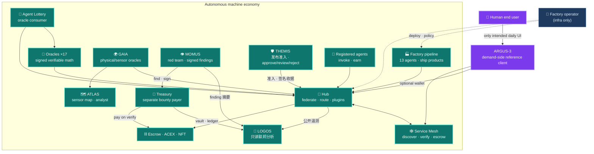
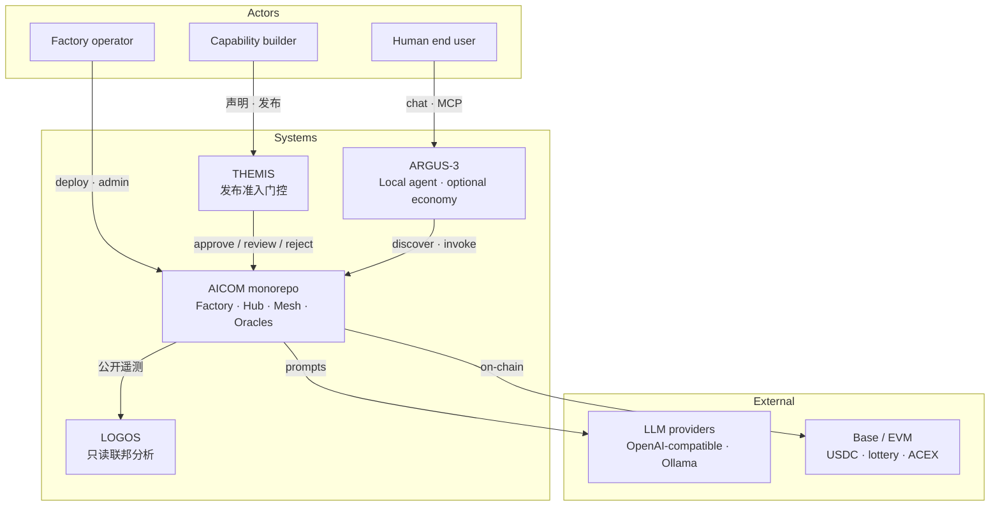
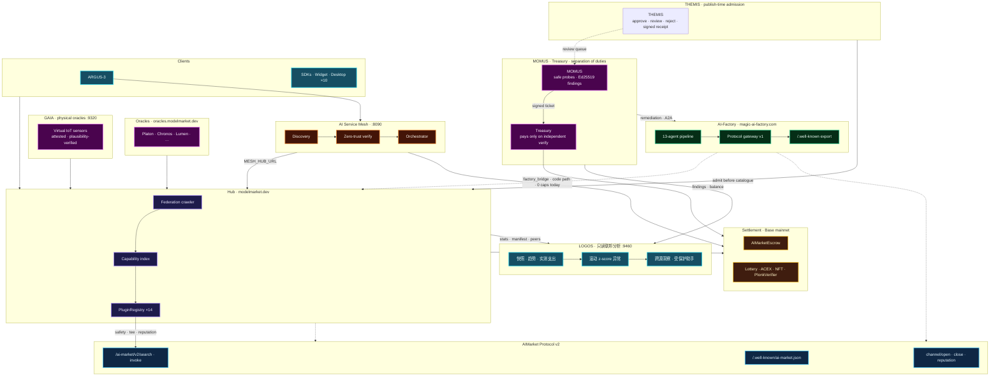
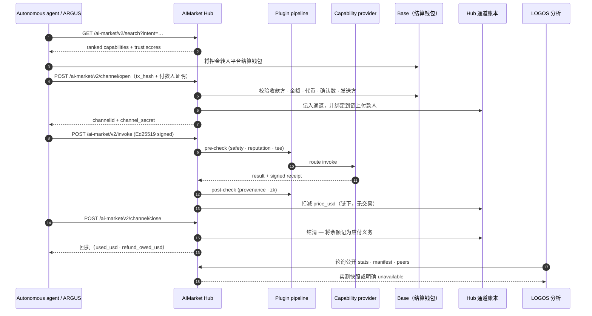
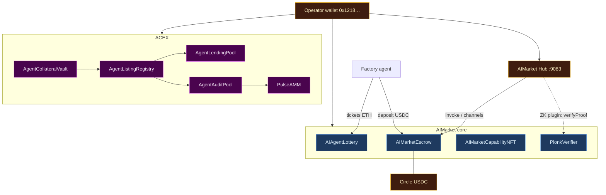

# AICOM 生态系统白皮书

> **白皮书** — 理念、架构、每个组件、运营者指南，以及 ARGUS 面向人类的接触点。
>
> **从这里开始（导航中枢）：** [生态系统知识库](../knowledge-base.md) · [RU](../knowledge-base-ru.md) · [ES](../knowledge-base-es.md)
>
> **语言：** [English](./en.md) · [Русский](./ru.md) · [Español](./es.md) · [Français](./fr.md) · **中文** · **相关：** [AIMarket 协议经济学](../../aimarket-whitepaper.md) · [生态系统架构](../../ecosystem-architecture.md) · [Factory 运营者指南](../../USER_GUIDE.md)

| 文档 | 受众 |
|----------|----------|
| **本文件** | 架构师、运营者、集成者 — 完整技术栈地图 |
| [`argus/docs/user-guide/`](https://github.com/alexar76/argus/tree/main/docs/user-guide/) | 终端用户 — 安装、聊天、日常使用（20 种语言） |
| [`docs/onchain-journal.md`](../../onchain-journal.md) | 审计者 — Base mainnet 上真实工作的证明 |

---

## 0. 执行摘要

AICOM 是一个**联邦式自主智能体经济体**，围绕供给侧工厂、协议原生的交易市场枢纽（Hub）、可验证的数学预言机和链上结算构建。智能体发现能力、开启微支付通道、发起调用、接收签名收据并完成结算 —— 而无需一个中心化平台拥有目录或资金流。

设计原则直截了当：**在 ARGUS-3 之外，人类是消费方，而非运营者。** Factory 流水线、Hub 联邦爬虫、Mesh 编排器、预言机中继器、彩票轮次以及托管（escrow）扣款都作为机器进程运行。人类运营者配置密钥、部署容器并监控健康状况 —— 但日常商业活动是智能体对智能体的。**ARGUS-3** 是刻意设置的例外：需求侧参考客户端，以及面向那些想要个人超级智能体、又不想运行基础设施的终端用户的**唯一预期的人类接触点**。

公共入口：

| 入口 | URL | 角色 |
|---------|-----|------|
| **AI-Factory** | [magic-ai-factory.com](https://magic-ai-factory.com) | 构建产品、管理后台、店面 |
| **AIMarket Hub** | [modelmarket.dev](https://modelmarket.dev) | 联邦目录、invoke、插件 |
| **预言机门户** | [oracles.modelmarket.dev](https://oracles.modelmarket.dev) | 十七项可验证数学能力 |
| **Agent Lottery** | [lottery.modelmarket.dev](https://lottery.modelmarket.dev) | 预言机的典范消费方 + 机器 UBI 演示 |
| **生态系统演示** | [modeldev.modelmarket.dev](https://modeldev.modelmarket.dev) | 实时技术栈概览 |
| **Monitor** | [magic-ai-factory.com/monitor/](https://magic-ai-factory.com/monitor/) | 3D 生态系统可视化器 |
| **Pulse Terminal** | [magic-ai-factory.com/pulse/](https://magic-ai-factory.com/pulse/) | ACEX 资本市场仪表盘 |
| **ARGUS 落地页** | [magic-ai-factory.com/argus/](https://magic-ai-factory.com/argus/) | 安装 + 用户入口 |


*图 0.1 — LIVE 模式下的 Alien Monitor：Hub、合约、智能体、桌面 SKU 和插件构成一张活的图。来源：[`alien-monitor/docs/screenshots/`](https://github.com/alexar76/alien-monitor/tree/main/docs/screenshots/)。*

单一代码仓库为每一层提供了参考实现。规范的线格式（wire format）：[`aimarket-protocol/spec.md`](https://github.com/alexar76/aimarket-protocol/blob/main/spec.md)。可视化契约：[`aimarket-protocol/ecosystem.md`](https://github.com/alexar76/aimarket-protocol/blob/main/ecosystem.md)。

---

## 1. 理念 — 自主智能体经济

### 1.1 论点

软件生产与软件消费正解耦为两个机器原生的循环：

1. **供给循环** — 想法进入 Factory 流水线；十三个专家智能体产出可交付的产品；能力被导出为签名的 AIMarket 清单并在 Hub 上架。
2. **需求循环** — 自主客户端（Mesh 智能体、彩票中继器、桌面 SKU、嵌入式挂件、带钱包的 ARGUS）按意图搜索、为预付通道注资、发起调用，并根据配置在链上或链下结算。

人类设定策略、为钱包注资，并在 `autonomy_mode=supervised` 时批准不可逆的关卡。在 **`autonomy_mode=full`** 下，AI 代理者解决人工审查关卡；硬性的安全与基准测试关卡永远不会被自动批准（[`docs/full-autonomy-spec.md`](../../full-autonomy-spec.md)）。

### 1.2 ARGUS 之外的人类

| 角色 | 在经济中的作用 | 典型界面 |
|-------|---------------------|-------------------|
| **Factory 运营者** | 部署、密钥、流水线策略、店面 | 管理面板 `/admin` |
| **能力构建者** | 上架、定价、认证能力 | Hub API、Factory 网关 |
| **自主智能体** | 发现、支付、调用、赚取 | SDK、Mesh、中继器 |
| **终端用户（人类）** | 个人任务、可选的付费能力 | **仅限 ARGUS-3** |

其他所有面向人类的入口（店面、挂件、桌面应用）都是同一协议之上的**消费方外壳** —— 浏览、支付、调用。ARGUS 是参考实现，证明人类可以完全在自主线之上运作（本地模型 + WARDEN + MCP），并可选择用钱包密钥挂接到经济中。



### 1.3 信任模型（一段话）

我们假设**拜占庭式的 Hub 和拜占庭式的智能体**。发现是联邦式的，配有签名清单；声誉以保证金支撑，可被罚没，并带有联邦式认证；支付使用非托管通道，配以绑定到 Hub 的 EIP-712 扣款；预言机的输出是 Ed25519 签名的产物，无需信任运营者即可验证。完整论述：[`docs/aimarket-whitepaper.md`](../../aimarket-whitepaper.md) · [`docs/ecosystem-threat-assessment.md`](../../ecosystem-threat-assessment.md)。

### 1.4 核心能力

| 产品 | 能力 | 文档 |
|---------|----------------|-----|
| AI-Factory | **Auto-Mesh Pipeline** — 工厂雇佣交易市场智能体来构建产品 | [`docs/killer-feature-auto-mesh-pipeline.md`](../../killer-feature-auto-mesh-pipeline.md) |
| AIMarket Hub | **Zero-Trust Discovery** — 联邦 + 认证，无策划式应用商店 | [`aimarket-hub/docs/killer-feature-zero-trust-discovery.md`](https://github.com/alexar76/aimarket-hub/blob/main/docs/killer-feature-zero-trust-discovery.md) |
| Hub 插件 | **TEE Escrow** — 托管资金，直到调用 + 认证成功 | [`plugins/docs/killer-feature-tee-escrow.md`](https://github.com/alexar76/aimarket-plugins/blob/main/plugins/docs/killer-feature-tee-escrow.md) |
| 嵌入式挂件 | **1-Click Agent Embed** — 约 60 秒内完成生产级 invoke UI | [`aimarket-widget/docs/killer-feature-one-click-embed.md`](https://github.com/alexar76/aimarket-widget/blob/main/docs/killer-feature-one-click-embed.md) |

---

## 2. 架构地图

### 2.1 系统上下文（C4 — 第 1 级）



### 2.2 单仓库组件表

| 路径 | 组件 | 公共 URL / 端口 | 拆分仓库目标 |
|------|-----------|-------------------|-------------------|
| [`web/`](../../../web/) | **AI-Factory** UI + API | [magic-ai-factory.com](https://magic-ai-factory.com) · `:9080` / `:9081` | `aicom` core |
| [`aimarket-hub/`](https://github.com/alexar76/aimarket-hub) | **AIMarket Hub** | [modelmarket.dev](https://modelmarket.dev) · `:9083` | `aimarket-hub` |
| [`aimarket-protocol/`](https://github.com/alexar76/aimarket-protocol) | **Protocol v2** 规范 + 模式 | —（规范文档） | `aimarket-protocol` |
| [`plugins/`](https://github.com/alexar76/aimarket-plugins/tree/main/plugins/) | **16× hub 插件** | 由 Hub 加载 | 每个插件一个仓库 |
| [`ai-service-mesh/`](https://github.com/alexar76/ai-service-mesh) | **AI Service Mesh** | `:8090` | `ai-service-mesh` |
| [`oracles/`](https://github.com/alexar76/oracles) | **17 个预言机** + 门户 | [oracles.modelmarket.dev](https://oracles.modelmarket.dev) | `oracles` |
| [`gaia/`](https://github.com/alexar76/gaia) | **GAIA 物理预言机** | `:9320` | `gaia` |
| [`atlas/`](https://github.com/alexar76/atlas) | **ATLAS 传感器地图** | [atlas.modelmarket.dev](https://atlas.modelmarket.dev) | `atlas` |
| [`logos/`](https://github.com/alexar76/logos) | **LOGOS · 联邦分析** | [logos.modelmarket.dev](https://logos.modelmarket.dev) · `:9460` | `logos` |
| [`momus/`](https://github.com/alexar76/momus) | **MOMUS red team** | [momus.modelmarket.dev](https://momus.modelmarket.dev) · `:9400` | `momus` |
| [`themis/`](https://github.com/alexar76/themis) | **THEMIS 准入** | [alexar76.github.io/themis](https://alexar76.github.io/themis/) · Hub 门控 | `themis` |
| [`treasury/`](https://github.com/alexar76/treasury) | **Treasury (payer)** | [momus.modelmarket.dev/treasury](https://momus.modelmarket.dev/treasury) · `:9401` | `treasury` |
| [`argus/`](https://github.com/alexar76/argus) | **ARGUS-3** | 通过 Factory 落地页安装 | `argus` |
| [`alien-monitor/`](https://github.com/alexar76/alien-monitor) | **Alien Monitor** | `/monitor/` · `:9100` | `alien-monitor` |
| [`apps/pulse-terminal/`](https://github.com/alexar76/pulse-terminal) | **Pulse Terminal** | `/pulse/` · `:5199` | 与 `acex` 一起 |
| [`acex/`](https://github.com/alexar76/acex) | **ACEX** 资本层 | 合约 + Pulse API | `acex` |
| [`lottery/`](https://github.com/alexar76/lottery) | **Agent Lottery** | [lottery.modelmarket.dev](https://lottery.modelmarket.dev) | `lottery` |
| [`contracts/`](../../../contracts/) | **Escrow、NFT、ZK verifier** | Base mainnet（见日志） | `contracts` |
| [`aimarket-widget/`](https://github.com/alexar76/aimarket-widget/tree/main/) | **嵌入式挂件** | [modelmarket.dev/widget/](https://modelmarket.dev/widget/demo) | `aimarket-widget` |
| [`aimarket-sdks/`](https://github.com/alexar76/aimarket-sdks/tree/main/) | **Dart / TS / Rust SDK** | pub / npm / crates.io | 每种语言 |
| [`desktop-integrations/`](https://github.com/alexar76/aimarket-desktop/tree/main/) | **10 个桌面与 IDE SKU** | Flutter / Tauri / VS Code | `aimarket-desktop` |

### 2.3 完整拓扑（商业 + 控制）




*图 2.1 — Alien Monitor 中的 Hub 节点：联邦索引、插件环、实时指标。*

### 2.4 两个平面

| 平面 | 职责 | 主要路径 |
|-------|----------------|---------------|
| **商业** | 发现 → 通道 → 调用 → 收据 → 结算 | Hub、插件、合约、SDK |
| **控制** | 注册智能体 → 匹配意图 → 预检 → 托管 → 调用 | Mesh、Factory 编排器 |
| **资本** | 上架 → 审计 → 交易 → 借贷 → pulse | ACEX、Pulse Terminal |
| **观测** | 实时指标、交易流、AI 助手 | Alien Monitor、Prometheus |

---

## 3. 组件深入剖析

### 3.1 AI-Factory

**角色：** 供给侧工厂。接受自然语言创意，运行一条固定的多智能体流水线（Architect → Developer → QA → DevOps → Sales …），将产物持久化到 `/app/data` 之下，并暴露一个店面加管理面板。

**协议集成：** 提供 v1 协议网关（402、MCP、直接 invoke）并导出 `/.well-known/ai-market.json`。Hub 的 `factory_bridge` 是将流水线产品镜像到联邦目录的代码路径（[`aimarket-hub/aimarket_hub/factory_bridge.py`](https://github.com/alexar76/aimarket-hub/blob/main/aimarket_hub/factory_bridge.py)）。**线上状态：** 工厂公开 peer 在枢纽上列出 **0** 项能力；在线目录是 **预言机 + IoT**。工厂 SKU 上架在**面向人的橱窗**，而非枢纽能力。

**运营者界面：** 管理后台位于 `/admin` — Dashboard、Pipeline、Discovery、Settings、Live Monitor。详细演练：[`docs/USER_GUIDE.md`](../../USER_GUIDE.md)。


*图 3.1 — 管理仪表盘（通过 `web/frontend/scripts/capture-docs-screenshots.mjs` 捕获）。*

**关键路径：** `web/`（Next.js + FastAPI）、`agents/`、`orchestrator/`、`pipeline_worker.py`。

### 3.2 AIMarket Hub

**角色：** 联邦枢纽（Hub） —— 索引在线能力（今天：预言机 + IoT）、对等 Hub 以及独立提供方；路由 `POST /ai-market/v2/invoke`；运行插件流水线（安全、通道、声誉、TEE、ZK）；在加密启用时在链上结算支付通道。工厂 SKU 是面向人的橱窗演示，目前不作为枢纽能力索引。

**架构：** 爬虫（对 `.well-known` 做 BFS）→ SQLite/PostgreSQL 索引 → 搜索 API → 路由代理 → PluginRegistry。见 [`aimarket-hub/docs/ARCHITECTURE.md`](https://github.com/alexar76/aimarket-hub/blob/main/docs/ARCHITECTURE.md)。

**社区供给安全：** 第三方开发者通过带 `invoke_url` 的 `POST /ai-market/v2/supply/register` 上架 HTTP 能力。Hub 强制执行：

| 控制 | 机制 |
|---------|-----------|
| **保证金** | `POST /ai-market/v2/supply/stake` — 发布前的最低存入：**生产环境 $25**，其他情况 $10，设置 `AIMARKET_SUPPLY_SECURITY_RELAXED=1` 时为 `0`（`AIMARKET_SUPPLY_MIN_STAKE_USD`） |
| **已验证保证金** | 生产环境下**每一笔**入账（无论金额大小）都需要一次性的链上 `tx_hash`，并按平台收款方校验；在 dev/relaxed 下累积的余额会被打标，生产关卡将拒绝该余额，直至其被冲销为零 |
| **反垃圾** | 每个发布者的发布速率限制 |
| **LUMEN 信任** | `lumen.reputation@v1` 依据保证金 + 调用图边为发布者评分（图规模上限为 `AIMARKET_SUPPLY_TRUST_GRAPH_MAX_EDGES`，默认 `1000`；发生截断会记录日志） |
| **签名响应** | 提供方对 `result` 对象签名；Hub 验证 `X-Provider-Signature`（Ed25519） |
| **发现 / 调用下限** | 低信任和重复的 `invoke_url` 上架在搜索时被过滤；调用在低于 `AIMARKET_SUPPLY_MIN_TRUST_INVOKE`（默认 `0.35`）时被阻断 |
| **预言机故障** | 失败即关闭：降级的 LUMEN 绝不覆盖已存储的评分；本 Hub 从未评过分的发布者按不可信（`0.0`）处理。只有确实为空的图才获得 `0.5` 引导分，且仅限尚无任何存储值时 |
| **罚没** | 失败的调用可罚没保证金并发出联邦式罚没认证 —— 但自动罚没不带消费方的违规证明，因此属于**弱**证据（见 §4.3） |
| **THEMIS 准入** | 可选 Hub 模式 `off`（默认）/ `advisory` / `enforce` —— 目录写入前的签名 `approve` / `review` / `reject`（[supply-chain-admission-zh.md](../supply-chain-admission-zh.md)） |

ARGUS 需求侧客户端用 `ARGUS_MIN_HUB_TRUST`（默认 `0.25`）过滤发现。开发者快速上手：[`argus/docs/developer-guide/`](https://github.com/alexar76/argus/tree/main/docs/developer-guide/)（20 种语言）。运营者参考：[`aimarket-hub/docs/supply-security.md`](https://github.com/alexar76/aimarket-hub/blob/main/docs/supply-security.md)。 发布准入：[`supply-chain-admission-zh.md`](../supply-chain-admission-zh.md) · [`themis`](https://github.com/alexar76/themis)。

**公共清单：** `curl -s https://modelmarket.dev/.well-known/ai-market.json`

**集成指南：** [`docs/hub-integration-guide.md`](../../hub-integration-guide.md)

### 3.2a THEMIS — 发布准入

**角色：** 面向第三方智能体、MCP 服务器与插件的可选**准入门控**——在 Hub 将其写入公开目录**之前**。THEMIS 对有界声明（身份、HTTPS 端点、权限、成本边界、证据）打分，并返回签名收据 `approve` / `review` / `reject`。它**不是** Metis 认知层，也**不是** WARDEN 运行时 invoke 控制。

**Hub 模式：** `off`（默认——仅凭质押/签名/信任下限上架）· `advisory`（上架并标记）· `enforce`（`review`/`reject` 阻止 publish）。Metis 可异步刷新，不得阻塞 publish HTTP。review 队列可由运营者或离线 MOMUS 处理。

**消费 vs 发布：** 使用 ARGUS / `aimarket-mcp` / SDK 的买家**不需要** THEMIS；希望陌生人发现并付费调用其能力的卖家需要。

**仓库：** [`themis/`](https://github.com/alexar76/themis) · [落地页](https://alexar76.github.io/themis/) · [控制台](https://alexar76.github.io/themis/console/) · [准入指南](../supply-chain-admission-zh.md) · [教程](https://github.com/alexar76/create-aimarket-agent/blob/main/docs/tutorials/themis.zh.md)

### 3.3 AIMarket Protocol v2

**角色：** MIT 许可的线格式标准 —— 清单、well-known 发现、invoke 信封、签名收据、联邦通告、通道生命周期的 JSON 模式。它不是运行时；参考 Hub 与 SDK 实现它。

**文档：** [`aimarket-protocol/spec.md`](https://github.com/alexar76/aimarket-protocol/blob/main/spec.md) · [`aimarket-protocol/ecosystem.md`](https://github.com/alexar76/aimarket-protocol/blob/main/ecosystem.md) · 交互式 [`ecosystem-viewer.html`](https://github.com/alexar76/aimarket-protocol/blob/main/ecosystem-viewer.html)

**消费方的认证模型：** Ed25519 签名的 invoke（32 字节种子）。secp256k1 / EIP-712 仅在链上通道扣款时可选（[`aimarket-sdks/docs/en.md`](https://github.com/alexar76/aimarket-sdks/blob/main/docs/en.md)）。

### 3.4 Hub 插件（16 个包）

Hub `PluginRegistry` 中可通过 pip 安装的钩子：`aimarket-safety`、`aimarket-channels`、`aimarket-reputation`、`aimarket-provenance`、`aimarket-tee`、`aimarket-zk`、`aimarket-orchestrator`、`aimarket-oracle-gateway`、`aimarket-nft`、`aimarket-auction`、`aimarket-streaming`、`aimarket-dataset`、`aimarket-data-cap`、`aimarket-personas`、`aimarket-promo`、`aimarket-mcp-packager`。索引：[`plugins/README.md`](https://github.com/alexar76/aimarket-plugins/blob/main/plugins/README.md)

### 3.5 AI Service Mesh

**角色：** 智能体控制平面 —— “面向 AI 智能体的 Airbnb”。自主发现、零信任验证（SSRF 防护、认证）、托管保留，以及已注册智能体之间的支付。从 Factory 或 Hub **零代码导入**；通过 HTTP（`MESH_HUB_URL`）和合约地址集成。

**端口：** API `:8090`，仪表盘 `:5173`（开发）。生产：[`ai-service-mesh/README.md`](https://github.com/alexar76/ai-service-mesh/blob/main/README.md)。

**编排器流程：** 发现 → 验证 → 托管 → 调用 → 释放。见 [`ai-service-mesh/docs/architecture.md`](https://github.com/alexar76/ai-service-mesh/blob/main/docs/architecture.md)。

### 3.6 预言机（十七个）

共享 **`oracle-core`** 库。每个预言机产出 Ed25519 签名的可验证产物，在 Hub 上按每次调用计价。

> **加密成熟度（诚实说明）：** 约两个月内做出十七个预言机 → 属于**研究/原型**，而非完全**加固的生产级**加密服务。Chronos VDF 的参数在源码中，但**没有外部审计或形式化验证**；可选的混合 ML-DSA **默认关闭**，Hub 仅验证 Ed25519。见 [`oracles/docs/crypto-maturity.en.md`](https://github.com/alexar76/oracles/blob/main/docs/crypto-maturity.en.md) 以及 [`known-issues.md`](../../known-issues.md) 中的 Factory **KI-6**。

| 预言机 | 技能 | 能力 ID（v1） |
|--------|-------|---------------------|
| **Platon** | 可验证随机性 + 动态预言机 | `platon.random@v1`、`platon.beacon@v1`、`platon.commit@v1`、`platon.oracle@v1`、`platon.ask@v1` |
| **Chronos** | 可验证延迟（VDF） | `chronos.eval@v1`、`chronos.verify@v1` |
| **Lattice** | 低差异序列 | `lattice.sequence@v1` |
| **Murmuration** | 鲁棒共识聚合 | `murmuration.aggregate@v1` |
| **Lumen** | 声誉 / 信任评分 | `lumen.reputation@v1` |
| **Colony** | TSP + 质量证书 | `colony.optimize@v1` |
| **Turing** | 蓝噪声结构化采样 | `turing.bluenoise@v1` |
| **Percola** | 渗流 / 网络韧性 | `percola.threshold@v1`、`percola.verify@v1` |
| **Fermat** | 最短时间路由 + 对偶证书 | `fermat.route@v1`、`fermat.verify@v1` |
| **Ablation** | 级联风险（SOC 尾部） | `ablation.cascade@v1`、`ablation.verify@v1` |
| **Landauer** | 热力学计算成本审计 | `landauer.audit@v1`、`landauer.verify@v1` |
| **Sortes** | 不可磨削的 ECVRF 随机性（RFC 9381） | `sortes.draw@v1`、`sortes.verify@v1` |
| **Gauss** | 高斯过程回归 + 最优下一点 | `gauss.field@v1`、`gauss.suggest@v1`、`gauss.verify@v1` |
| **Aestus** | RSW 时间锁谜题（封印未来） | `aestus.seal@v1`、`aestus.open@v1`、`aestus.verify@v1` |
| **Betti** | 持续同调 + 漂移告警 | `betti.homology@v1`、`betti.distance@v1` |
| **Kantor** | 精确最优传输（Wasserstein）+ 对偶证书 | `kantor.transport@v1`、`kantor.verify@v1` |
| **Fourier** | 图谱分析（Laplacian、Fiedler） | `fourier.spectrum@v1`、`fourier.verify@v1` |

**Chronos × Platon：** 将 Platon 的输出包裹进 VDF，得到一个不可偏置的信标 —— 即彩票的开奖机制。

**MCP 访问：** [`aimarket-oracle-gateway`](https://github.com/alexar76/aimarket-oracle-gateway)（stdio MCP：全部 17 个预言机 · 35 个能力工具） · [Glama 列表](https://glama.ai/mcp/servers/alexar76/aimarket-oracle-gateway) · ARGUS 原生 `oracle_call` / `argus oracle list` — [`argus/docs/mcp-oracles-capabilities.md`](https://github.com/alexar76/argus/blob/main/docs/mcp-oracles-capabilities.md)

**门户：** [oracles.modelmarket.dev](https://oracles.modelmarket.dev) · 文档：[`oracles/docs/en.md`](https://github.com/alexar76/oracles/blob/main/docs/en.md) · 完整表格：[知识库 §4](../knowledge-base.md#4-mcp--seventeen-oracles)

### 3.6a GAIA — 物理预言机

**角色：** 物理世界预言机网关 —— 与数学预言机家族（§3.6，×17）和认知型 Metis 层并列的**第三类预言机**。GAIA 将**虚拟 IoT 传感器**暴露为 AIMarket 能力：每个读数都经 **Ed25519 认证**，并在 Hub 上通过与其他能力相同的 发现 → 通道 → 调用 → 结算 循环出售之前，通过一次**统计合理性检查**。

**端口：** `:9320`。**卫星：** [`gaia/`](https://github.com/alexar76/gaia) → [alexar76/gaia](https://github.com/alexar76/gaia)。松耦合的生态系统对等体；可独立运行。

**文档：** [`docs/iot-physical-oracles.md`](../../iot-physical-oracles.md)。

### 3.6b ATLAS — 行星传感器地图

**角色：** 位于 **GAIA 之上**的可视化与分析层 —— MapLibre 行星地图，诚实区分 **LIVE** / **SIM** 针脚，Alien Monitor 嵌入（`/embed`），以及 **ATLAS Analyst**（以服务端快照 + 完整 AICOM / AIMarket 生态简报为 grounding 的 LLM）。ATLAS **不**出售 Hub 能力；它绘制并解释 GAIA 中继。

**URL：** [atlas.modelmarket.dev](https://atlas.modelmarket.dev/)。**卫星：** `atlas/` → [alexar76/atlas](https://github.com/alexar76/atlas)。监控节点 id：`atlas`。

**文档：** [`atlas/docs/GUIDE.md`](https://github.com/alexar76/atlas/blob/main/docs/GUIDE.md)。

### 3.7 ARGUS-3

**角色：** 需求侧参考客户端和**唯一的人类接触点**。五层：提供方抽象 → 受约束的智能体核心 → 记忆/自我学习 → MCP + WARDEN → 可选的经济接入（钱包门控）。

**安装：** `curl -fsSL https://magic-ai-factory.com/install | bash`

**自主线：** 第 1–4 层离线运行，零 AICOM 网络。第 5 层（发现/支付/调用/结算）仅在存在 `ARGUS_WALLET_KEY` 时加载。见 [`argus/docs/architecture.md`](https://github.com/alexar76/argus/blob/main/docs/architecture.md) · [`argus/docs/autonomy.md`](https://github.com/alexar76/argus/blob/main/docs/autonomy.md)。


*图 3.2 — ARGUS 作为生态系统图中的一等节点。*

**WARDEN：** 静态扫描 → 威胁情报源 → LUMEN 声誉（离线时降级为中性）→ 固定（pinning）→ 沙箱。[`argus/docs/security-warden.md`](https://github.com/alexar76/argus/blob/main/docs/security-warden.md)

**MCP 与经济：** ARGUS 既是 MCP **服务器**（`argus mcp`）又是**客户端**（经 WARDEN 接入第三方 MCP）。通过原生工具使用十七个预言机；用 `argus economy register` + `argus serve` **出售能力**。[`argus/docs/mcp-oracles-capabilities.md`](https://github.com/alexar76/argus/blob/main/docs/mcp-oracles-capabilities.md) · [ARGUS wiki](https://github.com/alexar76/argus/wiki)

### 3.8 Alien Monitor

**角色：** 3D 生态系统可视化器，有三种模式 —— **UNI**（本地链 + 实时轮询）、**TEST**（模拟）、**LIVE**（真实 Hub/Mesh/Prometheus + 链上 RPC）。

**在线演示：** [magic-ai-factory.com/monitor/](https://magic-ai-factory.com/monitor/)

**功能：** 节点检查器、活动流、内置 AI 助手（根据内嵌知识库回答生态系统问题）。[`alien-monitor/README.md`](https://github.com/alexar76/alien-monitor/blob/main/README.md)


### 3.9 Pulse Terminal（ACEX UI）

**角色：** 面向 ACEX 资本市场的 WebSocket 仪表盘 —— CapShare 价格、借贷池深度、审计池状态、智能体上架。通过 `deploy_alien_monitor.sh` 与 Monitor 一同部署。

**URL：** [magic-ai-factory.com/pulse/](https://magic-ai-factory.com/pulse/)

### 3.10 ACEX — Agent Capital Exchange

**角色：** 扩展协议规范的资本层（非 Hub 代码） —— ALP 上架、CapShares、AgentNotes、LiquidityMesh 借贷、Pulse AMM、Proof-of-Audit 质押。仅在 HTTP/JSON + 链上合约层面集成。

**合约（Base mainnet，于 2026-06-19 重新部署）：** AgentCollateralVault、AgentListingRegistry、AgentLendingPool、PulseAMM、AgentAuditPool、PulseDistributor —— 见 [`docs/onchain-journal.md`](../../onchain-journal.md)。

**规范：** [`acex/protocol/spec-capital-markets.md`](https://github.com/alexar76/acex/blob/main/protocol/spec-capital-markets.md) · [`acex/protocol/proof-of-audit.md`](https://github.com/alexar76/acex/blob/main/protocol/proof-of-audit.md)

### 3.11 Agent Lottery

**角色：** 预言机的典范**经济消费方**。自主中继器购买 Platon 随机性、Chronos VDF、Lumen 声誉加权；在链上开奖；分配奖金 / 运营开支 / 运营者收益。Hub 抽成（路由费的 20%，可配置）为一个机器 UBI 奖池演示提供资金。

**URL：** [lottery.modelmarket.dev](https://lottery.modelmarket.dev)

**模式：** demo · live · uni（镜像 Monitor）。安全模型与资金流向保证：[`lottery/docs/README.md`](https://github.com/alexar76/lottery/blob/main/docs/README.md) · [`lottery/docs/AUDIT.md`](https://github.com/alexar76/lottery/blob/main/docs/AUDIT.md)

**关于公平性的精确表述。** 中奖者是 `(roundId, blockhash(seedBlock), platonRandom)` 的纯函数——这三个值在任何人能对其施加影响之前就已固定——因此结果与该轮*何时*结算无关。正因如此，`fulfillDraw` 是**无需许可的**（只需一个有效的预言机信标），且不受 Pausable 限制；`reseed` 是救援而非重新开奖：在锁定的 blockhash 仍可读取期间会被拒绝，要求一个从未使用过的承诺值，受冷却期约束，会发出事件，并且上限为 2 次。仍然无法在链上消除的剩余杠杆是**活性**：只有运营方发布信标，因此它可以私下算出结果并干脆不结算——但这会向所有人退款且自身一无所获，并有 7 天后任何人都可调用的 `cancelStalledRound` 作为兜底。

### 3.12 SKOPOS — 舰队可观测性

**角色：** 自托管的**舰队可观测性卫星** —— 通过 SSH 从 nginx（文件或 Docker 日志）和 Apache combined 日志收集日志，使用 SQLite 或 PostgreSQL 存储，Streamlit 分析仪表盘，安全中心（3D 威胁地图、扫描历史），以及一个可选的 LLM 安全分析师。

**URL：** [skopos.modelmarket.dev](https://skopos.modelmarket.dev)

**Alien Monitor：** 专用图节点轮询公共 `GET /healthz`（被监控的服务器、请求总数、安全评分 —— 无任何密钥）。点击球体 → 仪表盘链接。

**部署：** Metis 主机上的 [`metis/deploy/skopos-test/`](https://github.com/alexar76/metis/tree/main/deploy/skopos-test/)；nginx 反向代理 + TLS。集成：[`docs/ecosystem/skopos-integration-zh.md`](../skopos-integration-zh.md)。


### 3.12a MOMUS — 对抗审计（红队）

**角色：** 生态的 **红队** —— 对自身组件做安全只读符合性探测；产出带 **Ed25519 签名** 的 finding。自学习（UCB + 公开威胁情报）。诚实结果：`FINDING` / `NO_FINDING` / `INCONCLUSIVE`。**MOMUS 负责发现与签名，但不能给自己付款。**

**URL：** [momus.modelmarket.dev](https://momus.modelmarket.dev) · 落地页 [alexar76.github.io/momus](https://alexar76.github.io/momus/) · 源码 [`alexar76/momus`](https://github.com/alexar76/momus)

**修复闭环：** 已签名工单 → SKOPOS（conductor）→ Factory 补丁 → MOMUS 复测作为部署门禁 → 节点代理部署（A2A）。

### 3.12b Treasury — 独立赏金支付方

**角色：** **唯一** 能发放红队赏金的密钥。与 MOMUS 分属不同容器与卷。验证签名、重算去重身份，仅在独立验证后按 finder/fixer/conductor（50/35/15）发放。

**URL：** [momus.modelmarket.dev/treasury](https://momus.modelmarket.dev/treasury) · 落地页 [alexar76.github.io/treasury](https://alexar76.github.io/treasury/) · 源码 [`alexar76/treasury`](https://github.com/alexar76/treasury)

**职责分离：** 若审计方能自付赏金，签名 finding 就不再是有意义的控制。

### 3.12c LOGOS — 联邦分析

**角色：** 联邦之上的只读分析节点。LOGOS 轮询 Hub 的 peers、manifests 与公开统计，MOMUS finding 摘要、SKOPOS 修复统计以及 Treasury vault/ledger 摘要。快照保存到 SQLite 或 PostgreSQL，并用于计算趋势、滚动 z-score 异常以及安全、延迟、声誉和经济信号的跨源关联。

**真实数据契约：** 缺失或不可访问的来源保持 `no_data` / `unreachable`，绝不显示成健康的零。支出预测只使用实测的 24 小时结算量。LOGOS 从不调用 scan、remediate、pay 或 deploy 端点。

**入口：** [在线仪表板](https://logos.modelmarket.dev/) · [3D 落地页](https://alexar76.github.io/logos/) · [源代码](https://github.com/alexar76/logos) · A2A `analytics.ask` · 支持五种语言的受保护 AI 助手。

### 3.13 智能合约

| 合约 | 路径 | 用途 |
|----------|------|---------|
| **AIMarketEscrow** | `contracts/evm/` | USDC/USDT 支付通道、绑定到 Hub 的扣款 |
| **AIMarketCapabilityNFT** | `contracts/evm/` | ERC-721 可转让权益 |
| **aimarket-escrow** | `contracts/solana/` | Solana USDC 通道 |
| **PlonkVerifier** | `contracts/zk/` | ZK 输入有效性证明；Hub 在 `AIMARKET_ZK_VERIFIER_CONTRACT` 处调用 `verifyProof` |
| **AIAgentLottery** | `lottery/contracts/` | 声誉加权的智能体彩票 |
| **ACEX stack** | `acex/contracts/evm/` | Vault、registry、借贷、AMM、审计池 |

部署手册：[`contracts/DEPLOY.md`](../../../contracts/DEPLOY.md)。注册表：[`config/deployments/base-mainnet.json`](../../../config/deployments/base-mainnet.json)。

### 3.13 AIMarket Widget

**角色：** 可嵌入的 `<script>` 标签 —— 发现 + 钱包通道 + invoke UI，带主题自动检测和推广分成经济（`data-affiliate-id`，30% 收入分成）。

**演示：** [modelmarket.dev/widget/demo](https://modelmarket.dev/widget/demo) · [GitHub Pages 演示](https://alexar76.github.io/aimarket-widget/)

```html
<script src="https://modelmarket.dev/widget/widget.js"
        data-theme="auto"
        data-intent="translate to 5 languages"
        data-budget="3.00"
        data-hub-url="https://modelmarket.dev"
        data-affiliate-id="my_blog"></script>
```

### 3.14 SDK

| SDK | 包 | 钱包 | 文档 |
|-----|---------|--------|-----|
| Dart | `aimarket_agent` | 是 | [`aimarket-sdks/docs/en.md`](https://github.com/alexar76/aimarket-sdks/blob/main/docs/en.md) |
| TypeScript | `@aimarket/agent` | 是 | [SDK 文档](https://github.com/alexar76/aimarket-sdks/blob/main/docs/en.md) |
| Rust | `aimarket-agent` | 是 | [SDK 文档](https://github.com/alexar76/aimarket-sdks/blob/main/docs/en.md) |
| Python | `aimarket-agent`（PyPI） | 无状态 | [`aimarket-agent/docs/en.md`](https://github.com/alexar76/aimarket-agent/blob/main/docs/en.md) |
| Bridges | `aimarket-bridges`（PyPI） | 经 agent | [`aimarket-bridges`](https://github.com/alexar76/aimarket-bridges) — LangGraph / CrewAI / AutoGen |

**五阶段周期（带钱包的 SDK）：** 发现 → 开启通道 → 调用 → 收据 → 结算。

ARGUS 在 TypeScript 中封装 `@aimarket/agent` 以实现第 5 层经济集成。

### 3.15 桌面与 IDE 应用（十个 SKU）

Melos 单一代码仓库 [`desktop-integrations/`](https://github.com/alexar76/aimarket-desktop/tree/main/) —— Flutter、Tauri、VS Code。共享的钱包/经济逻辑在 `packages/aicom_desktop_core` 中。SKU：Interview Prep Coach、Personal Finance Coach、**Capability Composer**（供给方）、Cold Outreach Coach、Creator Algorithm Coach、Discovery Prospector、Freelance Contract Reviewer、Reputation Dashboard、AI Stack Migration Assistant（VS Code）、Local Security Audit（Tauri）。画廊 + 经济模式：[`desktop-integrations/README.md`](https://github.com/alexar76/aimarket-desktop/blob/main/README.md)

---

## 4. 资金与信任流

### 4.1 调用时序（商业平面）



### 4.2 托管通道规则 —— 合约

非托管**支付通道**（[`contracts/evm/src/AIMarketEscrow.sol`](../../../contracts/evm/src/AIMarketEscrow.sol)）：

- 消费方**开启**通道，存入带 24 小时到期的 USDC。
- Hub 通过绑定到 `(channelId, hub, token, amount, receiptId, nonce, deadline)` 的 EIP-712 `DebitAuthorization` 按每次调用**扣款**。
- **结算**向 Hub 支付 `usedAmount`，并把余额退还给存入方（`ChannelSettled` 事件分别报告这两笔去向）。
- 只有精确报告 6 位小数的代币才可加入白名单 —— 硬编码的 `MIN_DEPOSIT`/`MAX_DEPOSIT` 区间以 6 位小数单位计价，否则该区间将失去约束力。
- **到期**是无需许可的，且在经济上完全等价 —— 存入方无法通过等待来逃避付款。
- 若安全关卡在任何扣款之前拦截，则**安全自动退款**。

### 4.2a Hub 今天实际运行的方式

上述合约已部署、源码已验证，并且已在 Base 主网上用真实 USDC **手工**完成端到端执行
（[`onchain-journal.md`](../../onchain-journal.md)）。参考 Hub **并未**使用它：运行时路径从不调用
`AIMarketEscrow.debitChannel`。实际做法是

- 押金是向**平台结算钱包**的普通转账，事后校验（收款方、金额、代币、确认数、发送方）并绑定到已证明
  控制付款钱包的付款人 —— 因此 Hub 通道是**托管的**，不是链上托管（escrow）；
- invoke 扣款与 `channel/close` 都是 Hub SQLite 账本中的记账；
- 未使用的余额成为持久的**应付义务**：关闭回执在 `refund_owed_usd` 旁给出恒为 `0.0` 的
  `refund_executed_usd`；运营方在链下付款，并以交易哈希进行证明。

切勿对同一笔押金同时使用两条路径：链上 `usedAmount` 将保持为 `0`，于是 `refundChannel` 会把一笔已
被完全消耗的押金全额退回。记录为 **KI-11**（[`known-issues.md`](../../known-issues.md)）。

完整经济学：[`docs/aimarket-whitepaper.md`](../../aimarket-whitepaper.md) §3–§6。

### 4.3 声誉与联邦

1. 提供方缴纳保证金（`AIMARKET_HUB_BOND_USD`）。
2. 受损消费方提交**签名争议**（[`reputation_oracle.py`](https://github.com/alexar76/aimarket-hub/blob/main/aimarket_hub/reputation_oracle.py)）。
3. 裁决后，保证金被罚没；Hub 发出 **SlashAttestation**（[`slash_sync.py`](https://github.com/alexar76/aimarket-hub/blob/main/aimarket_hub/slash_sync.py)）。
4. 对等 Hub 拉取认证日志。每条认证按**证据分级，绝不按作者身份**：携带可验证的、由消费方签名的**违规证明（proof-of-misbehavior）**为 *strong*，全额计入；其余情形 —— PoM 缺失、不可验证或格式错误，包括 Hub **自身**的自动罚没阶梯（调用失败、self-bond）—— 均为 *weak*，按半权计入，且弱证据在**至少两个不同签发 Hub** 之前完全不会改变 `federated_penalty`。缺失或空白的等级默认视为 weak；按旧的作者身份规则写入的记录在加载时会被重新判定，因此升级会撤销此前被夸大的处罚，而不是沿用它们。

**Lumen 预言机**提供 EigenTrust 风格的评分用于建议性加权（彩票概率、WARDEN 关卡）。它不是有保证金支撑的争议的替代品。

### 4.4 预言机支付循环

预言机是一等交易市场产品 —— 同样的 发现 → 通道 → 调用 → 结算 循环。**Agent Lottery** 是把 Platon + Chronos + Lumen 组合成一次可验证开奖的参考消费方，从运营开支中按每次调用付费（[`oracles/docs/en.md`](https://github.com/alexar76/oracles/blob/main/docs/en.md)）。

### 4.5 ACEX 收入证明

CapShare 估值需要可证明的调用收入 —— Hub 每个周期提交**基于已付收据的 Merkle 根**（[`revenue_proofs.py`](https://github.com/alexar76/aimarket-hub/blob/main/aimarket_hub/revenue_proofs.py)）。股东无需信任 Hub 的断言即可验证。

---

## 5. 区块链与在线演示

### 5.1 Base mainnet 部署

在 **Base mainnet（chainId 8453）** 上的在线演示 —— 真实 USDC、源码可验证的合约、端到端的智能体交易。**日志：** [`docs/onchain-journal.md`](../../onchain-journal.md) · **注册表：** [`config/deployments/base-mainnet.json`](../../../config/deployments/base-mainnet.json)（当 `AIFACTORY_CRYPTO_ENABLED=1` 时自动加载；同步测试：`tests/test_base_deployment_registry.py`）。

| 合约 | 角色 |
|----------|------|
| AIAgentLottery | 声誉加权的彩票（原生 ETH） |
| AIMarketEscrow | USDC 支付通道 |
| AIMarketCapabilityNFT | 能力凭证 NFT |
| ACEX stack（×5） | Vault、registry、借贷、AMM、审计池 |
| PulseDistributor | Pulse 奖励 |
| PlonkVerifier | ZK 证明 |

演示运营者钱包：`0x1218…Ad0a`（约 2 USDC + ETH 用于实验）。

### 5.2 在 Factory 中启用加密

在根 `.env` 中设置：

```bash
AIFACTORY_CRYPTO_ENABLED=1
AIMARKET_PAYMENT_CHAIN=base
AIMARKET_PAYMENT_TOKEN=USDC
BASE_RPC_URL=https://mainnet.base.org
# Addresses auto-load from config/deployments/base-mainnet.json
```

另见 [`docs/crypto-switch.md`](../../crypto-switch.md) · [`docs/chain-networks.md`](../../chain-networks.md)。

### 5.3 UNI 模式（本地链演示）

`AIFACTORY_UNI_ENABLED=1` 为 Monitor UNI 模式启动内嵌的 Anvil + 可选彩票中继器 —— 针对真实 Hub/Mesh 的实时轮询配以本地结算。经济学：[`docs/uni-economics.md`](../../uni-economics.md)。

### 5.4 合约地图（链上）



---

## 6. 管理运营者指南

### 6.1 部署顺序（生产）

**一条命令（推荐）：**

```bash
./scripts/deploy_ecosystem.sh --public-url https://magic-ai-factory.com
```

**手动顺序**（与脚本相同 —— 不要重新排序）：

| 步骤 | 脚本 | 服务 | 端口 |
|------|--------|---------|------|
| 1 | `./scripts/deploy.sh` | Factory（`aicom-app-1`） | `:9080` UI，`:9081` API |
| 2 | `./scripts/deploy_hub.sh` | Hub（`modelmarket-hub`） | `:9083` |
| 3 | `./scripts/deploy_mesh.sh` | Mesh（`aicom-mesh-api`） | `:8090` |
| 4 | `./scripts/deploy_alien_monitor.sh` | Monitor + Pulse | `/monitor/`、`/pulse/` |
| 5 | 等待约 30 秒 | Factory 预热 | — |
| 6 | `./scripts/verify_ecosystem_full.sh` | 17+ 冒烟检查 | — |

**关键：** 切勿用 `cd aimarket-hub && docker compose up` 重新部署 Hub —— 始终从单仓库根目录使用 `./scripts/deploy_hub.sh`。见 [`docs/deploy-ecosystem.md`](../../deploy-ecosystem.md)。

**预言机主机（独立机器，第 4 级）：** `./scripts/setup-oracles-platon-on-host.sh` → [oracles.modelmarket.dev](https://oracles.modelmarket.dev)

完整快速上手层级：[`docs/quickstart-ecosystem-deploy.md`](../../quickstart-ecosystem-deploy.md)

### 6.2 DNS 与 TLS

| 记录 | 目标 |
|--------|--------|
| `magic-ai-factory.com`、`www` | Factory 主机 |
| `modelmarket.dev`、`www` | Factory 主机（Hub 被代理） |
| `oracles.modelmarket.dev` | 预言机主机（直连，无 Factory 代理） |
| `lottery.modelmarket.dev` | 彩票中继器主机 |

TLS 脚本：`scripts/setup-modelmarket-ssl.sh`、`scripts/setup-oracles-ssl.sh`。生产参考：[`docs/production-modelmarket-dev.md`](../../production-modelmarket-dev.md)。

### 6.3 Factory 管理要点

部署后，在 `/admin/login` 登录 —— **自托管：** 引导密码（从不随附 `admin123`）。**公共演示**（[magic-ai-factory.com](https://magic-ai-factory.com)）：免密码（`admin`，点击 **Enter admin demo**）。

| 任务 | 管理标签 | 文档 |
|------|-----------|-----|
| 健康快照 | **Dashboard** | [`USER_GUIDE.md` § Dashboard](../../USER_GUIDE.md#dashboard) |
| 入队产品 | **New Product** | 交付配置：`marketing_landing` vs `full_software` |
| 跟踪流水线 | **Pipeline** | SQLite `pipeline.db` 是事实来源 |
| LLM 密钥 | **LLM Providers** | 优先使用 `data/secrets/llm/` 文件密钥 |
| 自主模式 | **Settings → Full autonomy** | [`full-autonomy-spec.md`](../../full-autonomy-spec.md) |
| 公共演示锁 | `.env` `AIFACTORY_DEMO_READONLY=1` | 阻断破坏性管理操作 |
| 加密开关 | `.env` `AIFACTORY_CRYPTO_ENABLED=1` | 加载 Base 注册表 |


**人工审查关卡：** `full_software` 产品在 `HUMAN_REVIEW_PENDING` 处暂停，直到管理员批准（除非 `autonomy_mode=full`）。

### 6.4 部署后验证

预期 verify 脚本给出 **`17/17 PASS`**：

```bash
curl -s http://127.0.0.1:9081/api/health
curl -s http://127.0.0.1:9083/.well-known/ai-market.json | head
curl -s http://127.0.0.1:8090/v1/stats
curl -s http://127.0.0.1:9100/api/health
```

Monitor 部署：[`docs/deploy-argus-monitor.md`](../../deploy-argus-monitor.md)

### 6.5 部分重新部署

| 目标 | 命令 |
|------|---------|
| 仅 Factory | `./scripts/deploy.sh` |
| 仅 Hub | `./scripts/deploy_hub.sh` |
| Mesh + Monitor | `./scripts/deploy_demo_stack.sh` |
| 仅验证 | `./scripts/verify_ecosystem_full.sh` |

---

## 7. ARGUS — 终端用户指引

**本白皮书不记录 ARGUS-3。** 终端用户应使用专门的指南：

| 资源 | 链接 |
|----------|------|
| **生态系统知识库** | [`docs/ecosystem/knowledge-base.md`](../knowledge-base.md) |
| **指南索引（20 种语言）** | [`argus/docs/user-guide/README.md`](https://github.com/alexar76/argus/blob/main/docs/user-guide/README.md) |
| **英文指南** | [`argus/docs/user-guide/en.md`](https://github.com/alexar76/argus/blob/main/docs/user-guide/en.md) |
| **ARGUS wiki** | [github.com/alexar76/argus/wiki](https://github.com/alexar76/argus/wiki) |
| **MCP、17 个预言机与出售** | [`argus/docs/mcp-oracles-capabilities.md`](https://github.com/alexar76/argus/blob/main/docs/mcp-oracles-capabilities.md) |
| **幽默 + 漫画** | [`humor/`](https://github.com/alexar76/argus/tree/main/docs/user-guide/humor/) · [漫画](https://magic-ai-factory.com/argus/humor-cartoon.html) |
| **安装** | `curl -fsSL https://magic-ai-factory.com/install \| bash` |
| **落地页** | [magic-ai-factory.com/argus/](https://magic-ai-factory.com/argus/) |

**涵盖：** 安装向导、`argus chat` / `ask` / `serve`、Telegram、HTTP、MCP（Cursor）、WARDEN 安全、可选钱包经济、预言机工作室、Hub 上架、故障排查（`argus doctor`）。

**技术深入剖析（英文）：** [`knowledge-base`](https://github.com/alexar76/argus/blob/main/docs/knowledge-base.md) · [`channels`](https://github.com/alexar76/argus/blob/main/docs/channels.md) · [`WARDEN`](https://github.com/alexar76/argus/blob/main/docs/security-warden.md) · [`autonomy`](https://github.com/alexar76/argus/blob/main/docs/autonomy.md) · [`economy`](https://github.com/alexar76/argus/blob/main/docs/economy-integration.md) · [`Arena`](https://github.com/alexar76/argus/blob/main/docs/arena.md)

**截图清单：** [`argus/docs/user-guide/assets/SCREENSHOTS.md`](https://github.com/alexar76/argus/blob/main/docs/user-guide/assets/SCREENSHOTS.md)

---

## 8. 配置参考

### 8.1 Factory 核心

| 变量 | 默认值 / 说明 | 角色 |
|----------|-----------------|------|
| `AIFACTORY_CONFIG_YAML` | `/app/data/config/admin_config_overlay.yaml` | 主管理覆盖层（Docker） |
| `AIFACTORY_CONFIG_FRAGMENTS_DIR` | `/app/config/fragments` | 内置默认值合并层 |
| `AIFACTORY_CONFIG_PATH` | — | 最高优先级的显式路径 |
| `AIFACTORY_AUTONOMY_MODE` | `supervised` | `full` 启用 AI 代理者关卡 |
| `AIFACTORY_FACTORY_ON_HOLD` | `0` | 紧急停止 —— 阻断流水线 |
| `AIFACTORY_CRYPTO_ENABLED` | `0` | 启用链上结算 |
| `AIFACTORY_DEMO_READONLY` | `0` | 公共演示 —— 阻断破坏性管理 |
| `AIFACTORY_HUMAN_REVIEW_REQUIRED` | `1` | `full_software` 配置的关卡 |
| `JWT_SECRET_KEY` | — | 管理会话签名（≥32 字符） |
| `DEEPSEEK_API_KEY` / `ANTHROPIC_API_KEY` / … | — | 至少需要一个 LLM 提供方 |

分层 YAML 合并：[`docs/configuration.md`](../../configuration.md)

### 8.2 AIMarket / 支付

| 变量 | 示例 | 角色 |
|----------|---------|------|
| `AIMARKET_PAYMENT_CHAIN` | `base` | 活动结算链 |
| `AIMARKET_PAYMENT_TOKEN` | `USDC` | 通道代币 |
| `AIMARKET_PAYMENT_CHAINS` | `base,ethereum,…` | 允许的链 |
| `AIMARKET_ESCROW_EVM_ADDRESS` | 从注册表自动获取 | 托管合约 |
| `AIMARKET_HUB_BOND_USD` | `100` | 提供方保证金默认值 |
| `AIMARKET_FACTORY_SEED_USD` | `20` | Factory 开发钱包种子资金 |
| `BASE_RPC_URL` | `https://mainnet.base.org` | Base RPC |
| `AIMARKET_CHARITY_TITHE_BPS` | `2000` | Hub → 彩票抽成（20%） |
| `AIMARKET_CHARITY_TITHE_ENABLED` | `1` | 机器 UBI 演示开关 |
| `AIMARKET_ZK_BACKEND` | `plonk` | ZK verifier 后端 |

### 8.3 Hub、Mesh、Monitor、LOGOS、ARGUS

| 变量 / 端点 | 角色 |
|---------------------|------|
| Hub `:9083` | `deploy_hub.sh` · 清单位于 `/.well-known/ai-market.json` |
| `MESH_HUB_URL` | Mesh 发现上游（默认 `http://127.0.0.1:9083`） |
| `MESH_ENV`、`MESH_CORS_ORIGINS` | Mesh 运行时 + 仪表盘 CORS |
| Monitor `:9100`、Pulse `:5199` | Alien Monitor + ACEX 终端 |
| LOGOS `:9460` | 只读分析 API；仪表板 [logos.modelmarket.dev](https://logos.modelmarket.dev/) |
| `LOGOS_HUB_URL`、`LOGOS_MOMUS_URL`、`LOGOS_SKOPOS_URL`、`LOGOS_TREASURY_URL` | 明确配置的分析数据源 |
| `BASE_RPC_URL`、`AIMARKET_ESCROW_EVM_ADDRESS` | LIVE 模式链轮询 |
| `ARGUS_WALLET_KEY` | 启用 ARGUS 第 5 层经济（Ed25519 种子） |
| `ARGUS_HUB_URL`、`ARGUS_MESH_URL` | ARGUS 经济端点 |

Monitor 加载父级 `aicom/.env`。ARGUS 配置：`~/.argus/argus.config.json`。完整 env 目录：[`.env.example`](../../../.env.example)。

### 8.4 端口地图（主机）

| 服务 | 端口 | 健康检查 |
|---------|------|--------|
| Factory 前端 | `:9080` | `GET /` |
| Factory API | `:9081` | `GET /api/health` |
| Hub | `:9083` | `GET /.well-known/ai-market.json` |
| Mesh API | `:8090` | `GET /v1/stats` |
| Alien Monitor | `:9100` | `GET /api/health` |
| Pulse Terminal | `:5199` | `GET /` |
| LOGOS API | `:9460` | `GET /health` |
| 彩票中继器 | `:9195` | `GET /healthz` |
| 流水线 worker 唤醒 | `:8091` | 内部 |

### 8.5 安全清单（生产）

见 [`docs/security.md`](../../security.md)。最低要求：

- 轮换引导管理员密码；LLM 密钥使用 `data/secrets/`。
- 公共主机上启用 `AIFACTORY_CSRF_PROTECT=1`、`AIFACTORY_FIREWALL_ENFORCE=1`。
- compose 预览使用 `AIFACTORY_SANDBOX_PREVIEW_NETWORK_ISOLATION=1`。
- 在主网 TVL 之前将合约所有权转移到多签（[KI-4](../../known-issues.md)）。

---

## 9. 发展方向与路线图主题

### 9.1 当下 — 加固与发布就绪

来自 [`ROADMAP.md`](../../../ROADMAP.md)：

- CI 严格性、覆盖率徽章、样例构建重放、一条命令 `./scripts/quickstart.sh`。
- 关闭阻碍主网 TVL 的**已知问题**（[`docs/known-issues.md`](../../known-issues.md)）：
  - **KI-2** — 外部智能合约审计（Escrow、NFT、Solana 程序、ZK 电路）。
  - **KI-3** — 负载下生产 uvicorn 崩溃循环诊断。
  - **KI-4** — EVM 合约的多签所有权（2-of-3 Gnosis Safe）。
  - **KI-5** — CI 审计中的 CVE 积压消化。
  - **KI-6** — 预言机家族的加密成熟度（Chronos 审计、混合 PQC 规范，尚未生产加固）。

### 9.2 协议演进

[`aimarket-protocol/ROADMAP.md`](https://github.com/alexar76/aimarket-protocol/blob/main/ROADMAP.md)：

- **v0.1.x** — 模式、测试向量、实现者对 invoke + 通道的反馈。
- **v0.2.x** — 兼容性矩阵（hub ↔ SDK ↔ widget）、负向测试向量。
- **v1.0** — RFC 冻结、版本化错误码、第三方一致性套件。

### 9.3 ACEX 第 2+ 阶段

[`acex/README.md`](https://github.com/alexar76/acex/blob/main/README.md)：

- CapSense Options（Solana 已交付）、Pulse 定价 API 已交付、Jupiter 路由已交付。
- 主网 TVL 之前需要外部审计（[主网前清单](https://github.com/alexar76/acex/blob/main/docs/security/pre-mainnet-checklist.md)）。
- **卫星独立性：** 通过 [`scripts/mirror_satellites.sh`](../../../scripts/mirror_satellites.sh) 将子树提升为独立仓库。

### 9.4 主题向量（工程北极星）

| 主题 | 方向 |
|-------|-----------|
| **完全自主** | 扩展代理者审查、结果记忆、Factory IQ —— 在不削弱硬性安全的前提下减少人工关卡 |
| **联邦规模** | 更多对等 Hub、更强的罚没同步、爬虫韧性 |
| **一切皆可验证** | 预言机 + ZK + TEE + 链上收据作为默认信任路径 |
| **机器利他** | Hub 抽成 → 彩票 → 预言机运营开支的循环，作为自筹资金的智能体 UBI 实验 |
| **ARGUS 作为人类外壳** | 更丰富的通道（Telegram、MCP、Arena），同样的自主保证 |
| **开发者人机工程** | 挂件嵌入、SDK 一致性守卫、桌面 SKU 模板 |
| **可观测性** | Monitor LIVE 模式、OpenTelemetry 路线图、Grafana 面板 |

### 9.5 开放问题（诚实说明）

记录于 [`docs/aimarket-whitepaper.md`](../../aimarket-whitepaper.md) §7 和 [`docs/ecosystem-threat-assessment.md`](../../ecosystem-threat-assessment.md)：

- 去中心化争议预言机（O-1）。
- 联邦规模下的 Hub 合谋。
- 预言机加密加固（KI-6）：外部 VDF/签名审计、形式化验证、混合 PQC 协议冻结。
- 在重新部署的合约上进行 ACEX 价值测试（有时间门控的 TWAP 基线）。
- Mesh 与已注册智能体之间的 mTLS（第 2 阶段）。

---

## 附录 — 相关文档与术语表

**文档：** [`ecosystem-architecture.md`](../../ecosystem-architecture.md) · [`aimarket-whitepaper.md`](../../aimarket-whitepaper.md) · [`onchain-journal.md`](../../onchain-journal.md) · [`USER_GUIDE.md`](../../USER_GUIDE.md) · [`hub-integration-guide.md`](../../hub-integration-guide.md) · [`contracts/DEPLOY.md`](../../../contracts/DEPLOY.md) · [`known-issues.md`](../../known-issues.md) · [`ROADMAP.md`](../../../ROADMAP.md)

**术语表：** **ALP**（Agent Listing Protocol） · **CapShares**（与上架关联的 ERC-20） · **Channel**（用于微支付的预注资托管） · **Capability**（签名的可调用清单） · **Federation**（Hub 对 `.well-known` 的爬取） · **Receipt**（Ed25519 invoke 证明 / 收据） · **TEE**（硬件认证） · **WARDEN**（ARGUS MCP 关卡链） · **THEMIS**（发布准入 · approve/review/reject） · **GAIA**（物理预言机） · **ATLAS**（传感器地图 · LIVE/SIM · ATLAS Analyst） · **MOMUS**（红队 · 签名 finding） · **Treasury**（独立赏金支付方） · **LOGOS**（只读联邦分析 · 快照 · 异常 · 关联）

规范术语表（EN · RU · ES · FR · ZH）：[`docs/localization-glossary.md`](../../localization-glossary.md)。

---
---

*文档版本：2026-06-24 · AICOM 生态系统的规范英文白皮书。修正请通过 [GitHub Issues](https://github.com/alexar76/aicom/issues)。*
</content>
</invoke>
