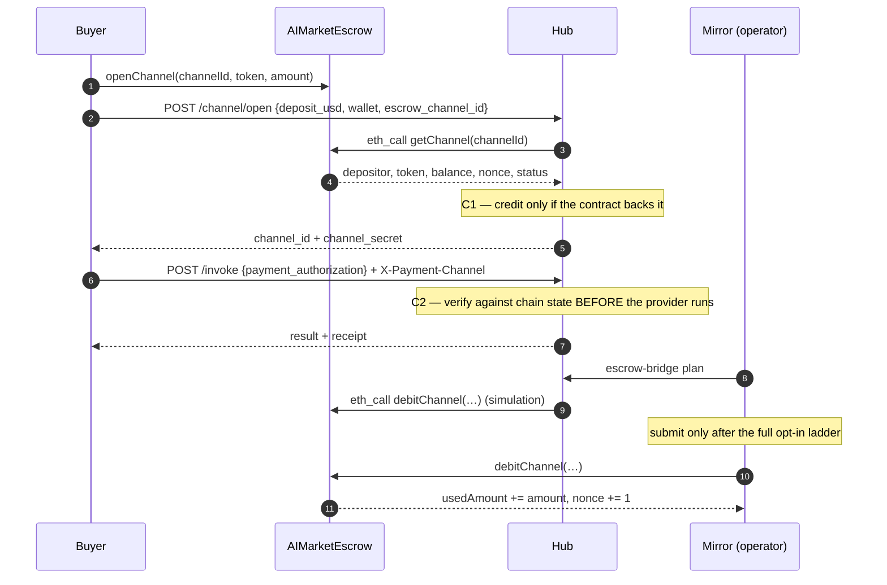

# Escrow settlement bridge (opt-in)

Mirrors the hub's off-chain channel debits onto `AIMarketEscrow`, so money the hub billed
can actually be collected on chain. **Off by default**; a hub that never enables it behaves
exactly as it did before, and acquires none of its state.

---

## The gap this closes

The escrow contract is sound: `debitChannel` requires an EIP-712 `DebitAuthorization`
signed by the channel's depositor, binds the calling hub into the signed payload, enforces a
per-channel monotonic nonce and a deadline, and keeps a `usedReceipts` replay set.

Nothing collected that signature, and nothing submitted it. Consequences, before this
bridge:

* `channels[channelId].usedAmount` stayed **0 forever**, so a depositor could consume a
  channel off chain and then call `refundChannel` — which only requires `usedAmount == 0` —
  and reclaim the full deposit. The hub was never paid.
* Funding was not even an escrow deposit. `channels.open` verified a **transfer to the
  platform's own settlement wallet**, so the funds were already the operator's, the
  contract held nothing, and the "refund remainder" at close was bookkeeping. That is why
  a closed channel now records a [payout obligation](#residual-gaps) instead.

## Three components, three risk profiles

| | what it does | needs |
|---|---|---|
| **C1** funding verification | credits a channel only after **reading** the contract | read-only RPC |
| **C2** authorization capture | verifies and stores the buyer's signature | nothing external |
| **C3** submission mirror | plans and (optionally) submits `debitChannel` | a signer, to broadcast |

**C1** replaces "somebody paid the platform wallet and the caller says it was them" with
"the contract says this depositor locked these funds". The depositor is bound *by
construction* — there is no public transfer hash for a bystander to quote, so escrow-mode
channels need no EIP-191 payer proof at all — and the remainder stays the depositor's, so
they refund themselves instead of the operator owing them.

**C2** checks, before the provider runs, every question the contract will ask later: signer
== on-chain depositor, hub, token, amount == what the ledger is about to debit, receiptId,
nonce == the channel's *current* on-chain nonce, deadline in the future and not absurdly
far. Expected amount and receipt come from the hub, never the client — otherwise a buyer
authorises a cent and is served a dollar's work.

**C3** is the only part that can move value. Its default strategy is `plan`.

## The opt-in ladder

Broadcasting requires **four independent things**. No single mistake starts moving money:

1. `AIMARKET_ESCROW_BRIDGE_ENABLED=1` — the bridge exists at all
2. `AIMARKET_ESCROW_SUBMIT_STRATEGY=external|env` — a strategy that *can* sign
3. `AIMARKET_ESCROW_SUBMIT_CONFIRM=i-understand-this-moves-funds` — a deliberate second act
4. `--yes` on the CLI — the operator is present for *this* run

Miss any one and you get plan mode. An unrecognised strategy value also falls back to
`plan`: a typo in a deployment variable must not escalate what the mirror may do.

### What plan mode proves

Plan mode is not a stub. It builds the exact calldata and runs it through `eth_call`
against real contract state, so it answers *"would this be accepted right now?"* and names
the reason when the answer is no — a nonce gap, an expired deadline, an insufficient
balance, an unauthorized hub. It is safe to run on a timer, and it is what you should read
before ever setting step 3.

## End-to-end



## Threat model

| actor | cannot | because |
|---|---|---|
| a bystander watching the chain | claim someone's escrow channel | `depositor` is read from the contract, not submitted |
| a buyer | be billed more than they signed | amount, receiptId and nonce are all covered by the digest |
| a buyer | authorise once and be charged twice | `usedReceipts` on chain, and the store's `receipt_id` primary key off it |
| a buyer | leave a standing licence | the deadline is capped by `AIMARKET_ESCROW_AUTH_MAX_TTL_S` |
| the hub operator | collect more than was billed | the mirror re-checks the ledger's own `debited_receipts` before submitting |
| the hub operator | collect twice via two doors | one shared single-use registry, consulted by both settlement doors |
| an unavailable RPC | cause a credit | every read failure is a refusal, never a fallback |
| a compromised external signer | fake a settlement | confirmation reads the transaction receipt; a returned hash proves nothing |
| a leaked repo | expose the signing key | the `env` strategy refuses a key it finds in the working tree |

**Not** protected against: an operator who legitimately holds the signing key and chooses to
submit an authorization the buyer validly signed; a malicious RPC that lies consistently
about state (mitigated only by `chain_net`'s multi-endpoint failover); anything the escrow
contract itself gets wrong.

## Configuration

| variable | default | meaning |
|---|---|---|
| `AIMARKET_ESCROW_BRIDGE_ENABLED` | `0` | master switch |
| `AIMARKET_ESCROW_NETWORK` | *(chain_net active)* | which chain the escrow lives on |
| `AIMARKET_ESCROW_CONTRACT` | *(chain_net registry)* | escrow address override |
| `AIMARKET_ESCROW_HUB_ADDRESS` | — | **required**; the `hub` field in every signed payload. Never defaulted: the contract binds signatures to one hub, so a guess produces authorizations nothing will accept |
| `AIMARKET_ESCROW_SUBMIT_STRATEGY` | `plan` | `plan` \| `external` \| `env` |
| `AIMARKET_ESCROW_SUBMIT_CONFIRM` | — | must equal `i-understand-this-moves-funds` |
| `AIMARKET_ESCROW_SIGNER_URL` | — | `external` strategy endpoint |
| `AIMARKET_ESCROW_SIGNER_TOKEN` | — | bearer token for that endpoint |
| `AIMARKET_ESCROW_PRIVATE_KEY` | — | `env` strategy key; read nowhere else, never logged |
| `AIMARKET_ESCROW_BRIDGE_DB_PATH` | *beside the channel ledger* | authorization store |
| `AIMARKET_ESCROW_AUTH_MAX_TTL_S` | `86400` | furthest a deadline may sit in the future |
| `AIMARKET_ESCROW_RPC_TIMEOUT_S` | `10` | per-call RPC timeout |
| `AIMARKET_DEPOSIT_CLAIMS_DIR` | *shared data root* | the cross-door single-use registry; **mount one path into both stacks** |

## Runbook

Read-only, works on a hub that never enabled the bridge:

```bash
python -m aimarket_hub.escrow_bridge.cli status --json
```

Check one escrow channel before trusting it:

```bash
python -m aimarket_hub.escrow_bridge.cli verify 0x<channelId> --wallet 0x<depositor> --usd 5
```

Simulate everything pending; sends nothing:

```bash
python -m aimarket_hub.escrow_bridge.cli plan
```

Broadcast, once `plan` looks right and the ladder is set:

```bash
python -m aimarket_hub.escrow_bridge.cli submit --yes
```

Resolve broadcast rows by reading receipts:

```bash
python -m aimarket_hub.escrow_bridge.cli confirm
```

Over HTTP (admin token, read-only — there is deliberately **no** route that broadcasts):
`GET /ai-market/v2/escrow/status` and `GET /ai-market/v2/escrow/plan`.

### Reading the output

* `blocked … waiting behind nonce N` — normal. The contract only accepts the channel's
  current nonce, so submissions are strictly ordered; a gap waits rather than skipping,
  because skipping would strand a row forever.
* `blocked … the channel ledger has no debit for this receipt` — the hub cannot show it
  charged for this. Investigate before doing anything else.
* `blocked … refusing to over-collect` — the signed amount exceeds what the ledger
  actually debited.
* `rejected … deadline passed before submission` — uncollectable; the row is abandoned and
  the money will not be recovered on chain.
* `refused …` — the signer declined. Nothing left the process; safe to retry.

### Rollback

Set `AIMARKET_ESCROW_BRIDGE_ENABLED=0`. Escrow-backed opens stop being accepted; already
recorded authorizations stay in the store, submitted nothing, and nothing else in the hub
changes. Drop `AIMARKET_ESCROW_SUBMIT_STRATEGY` back to `plan` to stop only broadcasting.

## Residual gaps

* **Transfer-funded channels are unchanged.** They still credit against a payment to the
  platform wallet, and their remainder is still recorded as an operator payout obligation
  (`GET /ai-market/v2/channel/obligations`) rather than refunded by a contract. The bridge
  fixes settlement for channels that opt into escrow funding; it does not retroactively
  change the older model.
* **The deployed Base instances predate the current contract sources.** The audit
  remediation changed storage layout and the `ChannelSettled` signature, so escrow mode is
  only meaningful after a fresh deploy plus a migration — never an in-place upgrade.
* **The shared claim registry is only shared if the operator makes it so.** The two
  settlement doors run as separate services with separate volumes; point
  `AIMARKET_DEPOSIT_CLAIMS_DIR` at one mounted path in both, or each falls back to a
  stack-local directory (logged, loudly) and cross-door exclusivity is not enforced.
* **`settleChannel` mirroring is not automated.** The bridge submits debits; closing the
  on-chain channel is still an explicit action.

## Verification status

Contract compatibility is **proven**, not assumed:
`aimarket-hub/tests/test_escrow_bridge_chain.py` deploys `AIMarketEscrow` and `FakeUSDT` to
a local anvil, asserts the bridge's digest equals the contract's own `computeDebitDigest`,
submits a bridge-built signature that the contract **accepts** (`usedAmount` 0 → 1 000 000,
`nonce` 0 → 1), and provokes every revert the mirror interprets — `InvalidSignature`,
`ReceiptAlreadyUsed`, a stale nonce, `ChannelExpired`, `Unauthorized`,
`InsufficientBalance`. Those tests skip loudly when foundry is absent; a green suite without
them proves only that the Python agrees with itself.
