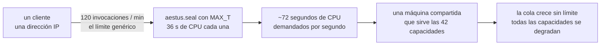
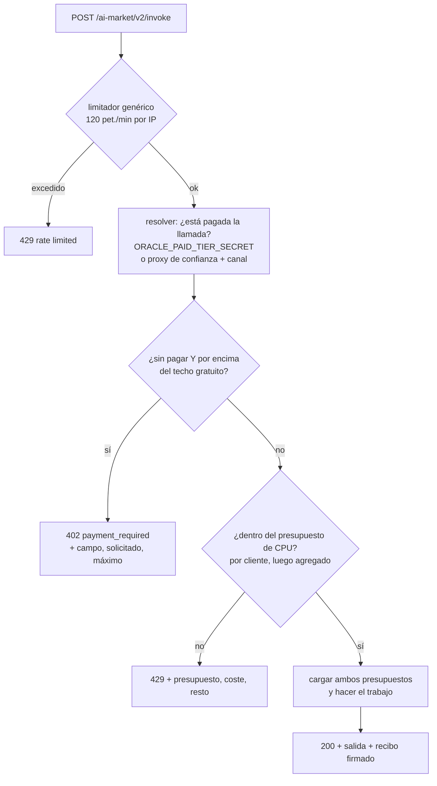
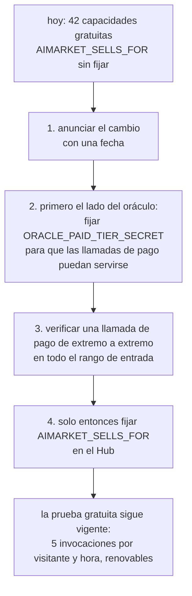
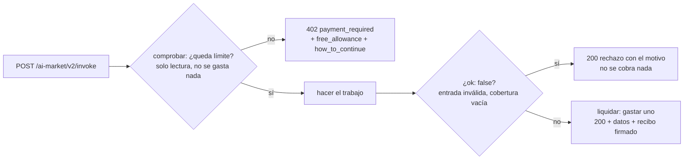

# Niveles gratuito y de pago — qué regala el ecosistema y por qué

*También disponible en [English](free-and-paid-tiers.md) · [Русский](free-and-paid-tiers.ru.md) · [Français](free-and-paid-tiers.fr.md) · [中文](free-and-paid-tiers.zh.md)*

Casi todas las capacidades de `modelmarket.dev` son gratuitas ahora mismo —sin
clave, sin canal, sin cuenta— y eso es una decisión, no un descuido. Esta página
dice qué es gratuito, qué no, qué acota el nivel gratuito y cuáles son los dos
interruptores que activan la venta.

---

## 1. Por defecto: gratuito, y a propósito

De las 47 capacidades que lista el Hub, 42 se federan desde la familia de oráculos
y se sirven a cualquiera que las pida. Los servidores funcionan
independientemente de que alguien las llame, así que el coste marginal de que un
desconocido pruebe una es ruido, y un desconocido que *puede* probar una es la
promoción más barata que tiene el proyecto.

Dos propiedades hacen que este nivel gratuito valga más de lo que suele valer una
demo:

- **Los recibos se firman igual en las llamadas gratuitas y en las de pago.** Quien
  llama gratis obtiene un recibo Ed25519 real sobre la cadena canónica real,
  verificable con la clave del proveedor en `/.well-known`. Nada está simulado.
  Quien evalúa el protocolo evalúa el protocolo de verdad.
- **Nada se degrada en silencio.** Cuando una llamada gratuita no puede servirse
  completa, se *rechaza* con el motivo y el número, nunca se sirve más pequeña sin
  avisar. Véase §4.

## 2. La excepción: dos capacidades venden cómputo

La mayoría de las capacidades están acotadas por construcción —una métrica de grafo
sobre una entrada limitada, un hash, un sorteo—. Su peor entrada legal cuesta
fracciones de milisegundo.

Dos son distintas en naturaleza. Una VDF de Wesolowski y un puzle de cerradura
temporal RSW se *tarifan en elevaciones al cuadrado secuenciales forzadas*: el
trabajo es el producto, es secuencial por construcción, y ninguna cantidad de
hardware lo paraleliza. Cada llamada ocupa un núcleo entero durante todo su
tiempo.

Medido en la máquina de referencia:

| capacidad | peor entrada legal | CPU |
|---|---|---|
| `aestus.seal@v1` | `T = 5 000 000` (`MAX_T`) | **~36 s** — 7,3 s con 1M, 14,5 s con 2M, exactamente lineal |
| `chronos.eval@v1` | `difficulty = 1 000 000` (`MAX_DIFFICULTY`) | **6,8 s** — 8,2 ms con 1 000, 69 ms con 10 000, 680 ms con 100 000 |
| `aestus.open@v1` | `puzzle.T = 5 000 000` | ~36 s — las mismas elevaciones, rehechas honestamente |
| `betti.homology@v1` | 300 puntos | 1,3 s — se autolimita vía `MAX_SIMPLICES` |
| las otras 38 | máximo | fracciones de milisegundo |

`aestus.seal@v1` tiene un **segundo mando de coste, independiente**: generar primos
frescos lleva ~0,6 s con 2048 bits y ~2,7 s con el máximo de 3072. Quien envíe
`T=1` con `modulus_bits=3072` no hace elevaciones que merezcan contarse y aun así
cuesta casi tres segundos.

### Por qué esto es una cuestión de capacidad, no de ingresos

El limitador genérico por cliente admite 120 invocaciones/min. Con la peor entrada
legal eso son unos setenta segundos de CPU de demanda por segundo de reloj, desde
una sola dirección, contra una máquina que sirve a toda la familia:



No hace falta mala intención. Quien lee el manifiesto, ve `maximum: 5000000` y
hace un bucle está haciendo exactamente lo que el esquema invita a hacer. Y los
límites por dirección no acotan a un llamante distribuido: el propio análisis de
tráfico del operador ya encontró una flota de 72 proxies residenciales.

Así que la solución no es empezar a cobrar. Es **acotar el trabajo** que puede
exigir quien no paga, y acotar la porción de la máquina que puede tomar una sola
capacidad.

## 3. Techos del nivel gratuito

Cada techo se fija al valor que el propio esquema de la capacidad ya declara como
su **valor por defecto**. Eso importa: quien no envía ningún argumento nunca es
rechazado, y el nivel gratuito demuestra el primitivo por completo —la prueba se
verifica, el retardo es real, el recibo está firmado—.

| capacidad | campo | techo gratuito | máximo de pago |
|---|---|---|---|
| `chronos.eval@v1` | `difficulty` | 100 000 (~0,68 s) | 1 000 000 |
| `aestus.seal@v1` | `T` | 1 000 000 (~7,3 s) | 5 000 000 |
| `aestus.seal@v1` | `modulus_bits` | 2048 (~0,6 s) | 3072 |
| `aestus.open@v1` | `puzzle.T` | 1 000 000 | 5 000 000 |

`puzzle.T` es una ruta anidada a propósito. `aestus.open@v1` recibe un puzle
completo y hace `T` elevaciones donde `T` es un campo *dentro* de él, así que una
comprobación solo del nivel superior acotaría `seal` y dejaría los mismos 36
segundos completamente abiertos en el endpoint de al lado —alcanzables con un
puzle escrito a mano que nunca pasó por `seal`—.

Una consecuencia que conviene decir claramente: **un puzle sellado con una `T` de
pago no puede abrirse gratis.** Es el mismo trabajo en ambos sentidos, así que es
coherente y no incómodo. Y `aestus.verify@v1` sigue siendo gratuito e ilimitado
—es un solo hash—, de modo que quien sí abra un puzle grande puede publicar `b` y
dejar que todos los demás confirmen el desbloqueo por nada.

### Rechazar, nunca recortar

Una llamada por encima del techo recibe `402 Payment Required` con el techo en el
cuerpo. No se sirve en silencio al nivel del techo.

Hacer menos trabajo del pedido sin decirlo emitiría un recibo firmado que atesta
una dificultad que quien llamó no pidió, y esa persona, midiendo el tiempo de
respuesta, concluiría razonablemente que el oráculo hace trampa. Para un primitivo
cuyo valor entero es «transcurrió demostrablemente este tiempo secuencial», eso no
es poca cosa.

```json
{
  "ok": false,
  "error": "payment_required",
  "detail": "aestus.seal@v1: 'T'=5000000 exceeds the free-tier ceiling of 1000000. …",
  "capability_id": "aestus.seal@v1",
  "free_tier": { "field": "T", "requested": 5000000, "max": 1000000 }
}
```

(Chronos y Aestus siguen recortando internamente contra sus propios máximos
duros. Esa es una defensa distinta y más antigua —contra entradas por encima del
*esquema declarado*— y se mantiene.)

## 4. Presupuestos de CPU: racionar trabajo, no llamadas

Un límite sobre el *número* de llamadas es la forma equivocada para estas
capacidades, porque su coste abarca cuatro órdenes de magnitud. Cualquier número
que se elija está mal en una dirección:

- Dimensionarlo para la entrada cara y la exploración normal se rechaza tras dos
  peticiones. Esto no es hipotético: primero se probó un límite plano de 2
  llamadas por minuto y rompió la propia suite de tests de Aestus en la cuarta
  petición.
- Dimensionarlo para la entrada barata y un bucle de las caras funde la máquina.

Así que cada capacidad cara declara un presupuesto en **milisegundos de CPU por
minuto**, y a cada petición se le cobra lo que realmente va a costar, estimado con
una fórmula ajustada a las mediciones de §2.

| capacidad | por cliente | entre todos los clientes | fórmula de coste |
|---|---|---|---|
| `chronos.eval@v1` | 20 000 ms/min | 60 000 ms/min | `difficulty / 147` |
| `aestus.seal@v1` | 20 000 ms/min | 60 000 ms/min | `T / 137 + 600` (o `+ 2700` por encima de 2560 bits) |
| `aestus.open@v1` | 20 000 ms/min | 60 000 ms/min | `puzzle.T / 137` |

20 000 ms/min es un tercio de núcleo por cliente. 60 000 ms/min es un núcleo
entero para esa capacidad entre todos —el número que de verdad protege una máquina
compartida, ya que los presupuestos por dirección no acotan una flota de proxies—.

Qué compra el presupuesto, concretamente, para `chronos.eval@v1`:

| entrada | coste | llamadas por minuto y cliente |
|---|---|---|
| `difficulty = 1 000` | 7 ms | ~2 900 (después actúa primero el límite genérico de 120/min) |
| `difficulty = 100 000` (techo gratuito) | 680 ms | 29 |
| `difficulty = 1 000 000` (máximo de pago) | 6 800 ms | 2 |

Quien desarrolla explorando con `difficulty=1000` está efectivamente sin límite;
quien pide el millón completo obtiene dos por minuto. Esa es la propiedad que un
límite plano de llamadas no puede expresar.

Ambos presupuestos se **comprueban antes de cargar cualquiera de los dos**, de modo
que una petición rechazada por capacidad del servidor no descuenta en silencio la
asignación propia de quien llamó por un trabajo que nunca se hizo.

## 5. El orden de las comprobaciones



La comprobación del techo va **antes** que la del presupuesto, y ese orden es
estructural. Una petición por encima del techo lo está de forma permanente, así
que un `429 reintente en breve` metería a quien llama en un bucle que nunca puede
tener éxito. El `402` le dice el techo real y que pagar lo levanta. El agotamiento
del presupuesto, en cambio, sí se resuelve solo —así que ese es el rechazo que
merece `429`, y va segundo—.

Un `429` de presupuesto nombra tres números, porque quien está claramente por
debajo de 120/min y aun así es rechazado necesita los tres para saber si esperar o
pedir menos trabajo:

```
rate limited: chronos.eval@v1 budgets 20000 ms of CPU per minute per client
because its cost scales with the input; this call is ~680 ms and 272 ms remain.
Retry later, or ask for less work.
```

## 6. Lo que un comprador puede leer sin gastar nada

Los techos y presupuestos se publican en el manifiesto firmado, así que un agente
que descubre los aprende sin gastar una llamada para averiguarlos:

```json
{
  "capability_id": "aestus.seal@v1",
  "price_per_call_usd": 0.006,
  "free_tier_max": { "T": 1000000, "modulus_bits": 2048 },
  "cpu_budget_ms_per_min": 20000,
  "global_cpu_budget_ms_per_min": 60000
}
```

Las capacidades sin controles de coste —39 de las 42— no publican ninguna de estas
claves, así que sus entradas del manifiesto no cambian.

Lo mismo vale para el endpoint agregado `oracle-family`, que es con quien el Hub
federa realmente: recoge los objetos de capacidad reales de sus 17 hermanos, así
que los techos, los presupuestos y los campos publicados llegan allí sin cableado
adicional. Ojo: los presupuestos son **por proceso**; un oráculo que corre a la vez
en solitario y dentro de la familia tiene un cubo separado en cada uno.

## 7. Activar la venta

Hay dos interruptores, en dos lados distintos, y **ambos están apagados por
defecto**.

### 7.1 Lado del oráculo — a quién se permite pasar del techo

Un oráculo no puede verificar por sí mismo un canal de pago: los canales viven en
el libro del Hub, y los identificadores de canal viajan dentro de los recibos, así
que la mera presencia de un identificador no prueba nada. En vez de acoplar cada
invocación a una ida y vuelta al Hub, el levantamiento solo se concede a quien el
operador ha nombrado explícitamente.

| variable | significado |
|---|---|
| `ORACLE_PAID_TIER_SECRET` | Un secreto compartido enviado como `X-AIMarket-Paid-Tier`. Se compara en tiempo constante. Independiente de la topología de red: **preferible**. |
| `ORACLE_TRUSTED_PAYMENT_PROXIES` | IP/CIDR separados por comas. Una petición desde uno de ellos con `X-Payment-Channel` no vacío cuenta como pagada, sobre la base de que el Hub retuvo el importe antes de reenviarla. Confía en que el proxy inverso fije `X-Real-IP` —la misma confianza que ya deposita el limitador—. |

Con **ninguna** de las dos fijada —el valor de fábrica— *ninguna llamada se levanta
nunca*, incluidas las del Hub. El techo gratuito se aplica a todos. Ese es el
comportamiento por defecto que se busca para una familia que hoy no vende nada:
falla hacia el lado cerrado, y activar la venta es una variable por lado, no un
cambio de código.

Una entrada mal formada en `ORACLE_TRUSTED_PAYMENT_PROXIES` se ignora en lugar de
tratarse como comodín, y no impide que funcionen las entradas válidas de al lado.

### 7.2 Lado del Hub — `AIMARKET_SELLS_FOR`

> [!WARNING]
> **`AIMARKET_SELLS_FOR` no está fijada por defecto, y fijarla convierte en pago,
> de golpe, 42 capacidades hoy gratuitas.**
>
> Sin fijar, el Hub no cobra nada por una invocación federada: `fed_price` es
> `0.0`, no se exige canal, no se retiene importe y no se cobra comisión de
> enrutado. Toda capacidad federada es gratuita para cualquiera.
>
> Con un prefijo de URL de un par listado en ella, toda capacidad federada de ese
> par pasa a tener precio. Una invocación sin `X-Payment-Channel` recibe
> `402 payment_required`. Los llamantes gratuitos existentes —incluido cualquier
> agente, puente o cliente MCP que ya las use— empiezan a fallar ese mismo minuto.
>
> No hay despliegue parcial ni periodo de gracia. Fíjala cuando tengas intención
> de vender, no para ver qué pasa.

El valor es una lista de prefijos de URL de pares, separados por comas, en cuyo
nombre vende el Hub, cotejada por prefijo de ruta:

```bash
AIMARKET_SELLS_FOR=https://oracles.modelmarket.dev
```

**Por qué hay que declararlo en vez de inferirlo.** El atajo evidente es «si el par
respondió 200 sin cobrar, el par no cobra, así que podemos». Eso es falso, y cinco
tests de comisión de enrutado lo detectaron: un par que factura por fuera también
responde 200. Inferir el consentimiento de un código de estado haría que este Hub
cobrara por encima de la propia factura del par, con el comprador pagando dos
veces y sin manera de notarlo. Así que vender en nombre de otro es algo que el
operador declara explícitamente, par por par.

`AIMARKET_SELLS_FOR` es además independiente de `AIFACTORY_CRYPTO_ENABLED` (véase
[crypto-switch](crypto-switch.es.md)) y del nivel de prueba en sandbox. Los precios
se aplican solo cuando la cripto está activada, la llamada no es una prueba de
sandbox **y** el par está listado.

### 7.3 La secuencia que no rompe a nadie



El paso 2 antes del paso 4 es la parte en la que conviene insistir. Fijar
`AIMARKET_SELLS_FOR` primero haría que el Hub exigiera pago por capacidades que el
oráculo seguiría rechazando por encima del techo gratuito: compradores pagando por
un trabajo que no pueden recibir.

## 8. Para autores de oráculos

Cuatro campos opcionales en `Capability`, todos vacíos por defecto, así que las 39
capacidades que no necesitan nada se comportan exactamente como antes:

```python
Capability(
    capability_id="mine.expensive@v1",
    handler=_run,
    # Los llamantes sin pagar son rechazados por encima de esto; usa los valores por
    # defecto del propio esquema para que una llamada sin argumentos nunca se rechace.
    free_tier_max={"iterations": 10_000},
    # Lo que cuesta una entrada, en ms de CPU. Ajústalo a una medición y dilo en un
    # comentario: solo importa la exactitud relativa, ya que una máquina más lenta
    # escala todos los costes igual.
    cost_ms=lambda d: d.get("iterations", 10_000) / 25.0,
    cpu_budget_ms_per_min=20_000,        # un tercio de núcleo por cliente
    global_cpu_budget_ms_per_min=60_000, # un núcleo entre todos
)
```

Una fórmula de coste que lanza una excepción se toma como si costara el 1 ms por
defecto en lugar de convertirse en un 500: el estimador de coste es una comodidad y
no debe poder tumbar el oráculo. Las estimaciones tienen un suelo de 1 ms, así que
una fórmula que devuelva cero no puede hacer que un presupuesto admita llamadas
ilimitadas.

Declarar `free_tier_max` en una capacidad cuyo coste ya está acotado no aporta nada
y añade una vía de rechazo: déjalo vacío salvo que la peor entrada legal sea
mediblemente cara.

## 9. Ventanas de cuota: el mando entre alcance e ingresos

La prueba gratuita empezó como un límite *de por vida*: tres invocaciones (invoke)
por visitante, para siempre. Esa es la forma correcta cuando lo escaso es la
capacidad. Es la forma equivocada mientras lo escaso son las personas que han oído
hablar de la malla: un visitante que gastó sus tres llamadas en marzo no tiene
vuelta en agosto, y la fila del libro contable que lo rechaza es indistinguible de
la que rechaza un abuso.

Así que el límite ahora tiene una **ventana**, y la ventana es un mando:

| ventana | significado | cuándo encaja |
|---|---|---|
| `lifetime` | N invocaciones por visitante, para siempre | la capacidad es la restricción vinculante; no hay objetivo de crecimiento |
| `hourly` | N por visitante por hora UTC | **ajuste actual de producción** — la ventana más indulgente que aún acota un bucle |
| `daily` | N por visitante por día UTC | evaluación sostenida sin dejar el grifo abierto |
| `weekly` | N por semana ISO | pruebas lentas y deliberadas |

Lo que producción publica hoy, en el manifiesto firmado, para que un agente que la
descubra lea las condiciones sin gastar nada:

```json
"free_trial": {
  "enabled": true,
  "max_invokes_per_visitor": 5,
  "quota_window": "hourly",
  "renews": true,
  "visitor_header": "X-AIMarket-Sandbox-Visitor"
}
```

`renews` se gana su sitio junto al número. Quien recibe un rechazo tiene exactamente
dos respuestas sensatas — esperar, o abrir un canal de pago — y solo ese campo dice
cuál funcionará. Un nivel de por vida que publicaba únicamente `max` y `used` dejaba
ambas igual de plausibles, y un agente que apostara por «esperar» sondearía un límite
que nunca se mueve.

**Por qué horaria y no diaria.** Frente a un bucle son idénticas: cinco llamadas y
después un rechazo. Se diferencian para quien de verdad nos interesa: alguien que lee
el manifiesto, prueba una capacidad, malinterpreta el esquema y vuelve a intentarlo.
Con una ventana diaria esa persona queda fuera hasta mañana, lo que en la práctica
significa perdida; con una horaria vuelve antes de cerrar la pestaña. La ventana más
laxa no cuesta nada del lado del abuso y elimina el fallo que de verdad pierde gente.
Está puesta en el valor más suave que sigue siendo útil, a propósito, y se endurecerá
cuando la carga lo exija — no antes.

Cómo fijarla: `AIMARKET_SANDBOX_QUOTA_WINDOW` y
`AIMARKET_SANDBOX_MAX_PER_VISITOR` en el entorno, o `quota_window` y
`max_per_visitor` en `data/sandbox_trial_policy.json`; el entorno gana, de modo que un operador puede
sobreescribir un archivo horneado en una imagen. Un valor de ventana no reconocido cae
a `lifetime` y no a «sin límite»: una errata en un archivo de política no debe regalar
la malla.

**Qué código recibe un límite agotado, y por qué los dos servicios difieren.** El hub
responde `429 trial_quota_exhausted`; ATLAS responde `402 payment_required`. No es una
inconsistencia que haya que peinar: es la diferencia entre un límite que se resuelve solo y un
precio que se puede pagar. El límite renovable del hub se resuelve esperando —el sentido
exacto de 429—; un SKU de ATLAS tiene un precio publicado y un canal que abrir, que es el
sentido de 402. El hub publica `exhausted_status` y `exhausted_error` junto al límite para que
un agente se ramifique sobre un hecho declarado y no sobre una suposición. Merece decirse
porque el propio texto del hub prometía 402 —escrito cuando el nivel era de por vida y nunca
corregido al pasar a una ventana renovable—, y un agente que lo creyera leería un rechazo
temporal como «hay que pagar», abandonaría un nivel gratuito que todavía tenía y no volvería.

Las ventanas se indexan en UTC (`%Y-%m-%dT%H`, `%Y-%m-%d`, ISO `%G-W%V`), así que
rotan en el mismo instante para todos y ningún reloj local participa. El límite es por
clave de ventana: el libro contable conserva las filas anteriores y el historial de un
visitante sigue siendo legible después del cambio de ventana.

Detrás del primer mando hay un segundo: `AIMARKET_SANDBOX_MAX_PER_IP_HOUR` (30 por
defecto, o `max_per_ip_hour` en el archivo de política) limita las pruebas por dirección
de red y por hora. El límite por visitante puede permitirse ser generoso precisamente
porque el visitor-id lo elige el propio cliente y por tanto es gratis de acuñar; a quien
acuñe mil lo acota de verdad el límite por dirección, y es la primera cifra a la que
recurrir si la carga vuelve incómoda la ventana suave.

## 10. Cómo ATLAS empezó a cobrar

ATLAS publicaba una lista de precios y lo servía todo gratis. Su manifiesto decía
`price_per_call_usd: 0.06`; `POST /ai-market/v2/invoke` sin pago devolvía `200 OK` con
los datos. Eso no es un nivel gratuito: es un precio que a nadie se le pedía respetar,
y desde fuera la malla de pago parecía tarifada mientras de hecho no estaba medida.

Ahora se aplica (enforced), en las mismas condiciones que ofrece el hub, para que un
agente que descubra cualquiera de los dos servicios vea unas condiciones y no dos:

```bash
ATLAS_PAYMENT_ENFORCED=1          # apagado por defecto; aplicarlo es decisión del operador
ATLAS_TRIAL_WINDOW=hourly         # el mismo vocabulario que el hub
ATLAS_TRIAL_MAX_PER_CALLER=5
```

Comportamiento en vivo, verificado de extremo a extremo: cinco llamadas entregadas y
después

```json
{
  "error": "payment_required",
  "capability_id": "atlas.situation.brief@v1",
  "price_per_call_usd": 0.06,
  "free_allowance": { "max": 5, "used": 5, "quota_window": "hourly", "renews": true },
  "how_to_continue": [
    "Wait for the hourly allowance to renew.",
    "Send X-AIMarket-Sandbox-Visitor with a stable id (8-64 chars) to hold your own allowance rather than sharing your network's.",
    "Open a payment channel at the hub and invoke through it: https://modelmarket.dev/.well-known/ai-market.json"
  ]
}
```

### Los rechazos no se cobran

El límite se **comprueba** antes del trabajo y se **gasta** solo cuando el producto ha
devuelto datos. La primera versión cobraba a la entrada, y estaba mal de una forma que
merece quedar escrita: quien enviaba un bounding box mal formado quemaba todo su nivel
gratuito en `refuse_reason` sin ver una sola lectura. Como presentación de una malla de
pago, no hay nada peor.

No es una rama exótica. ATLAS rechaza en lugar de adivinar siempre que la cobertura
está vacía — es su política de honestidad, no un error —, así que los rechazos son
rutina: justo después de un redespliegue la flota de sensores está fría y *todas* las
llamadas rechazan hasta que se calienta. Cobrarlas sería facturar al llamante el
reinicio del operador.



Tres propiedades más, cada una elegida y no heredada:

- **Apagado salvo que se active.** Aplicar el cobro cambia lo que reciben los llamantes
  existentes, así que es una decisión explícita del operador, nunca un efecto colateral
  de un despliegue.
- **Las capacidades gratuitas nunca consumen límite.** Un SKU con precio 0 que gastara
  una prueba informaría de un límite equivocado y escondería el real detrás de un
  rechazo ajeno.
- **Falla abierto.** Si el libro contable no se puede leer ni escribir, la invocación
  continúa. Un contador roto no debe tumbar la malla: cobrar de menos es recuperable,
  rechazar a todos no. Capturar solo `sqlite3.Error` no bastaba: una ruta sin permiso de
  escritura lanza `OSError` desde `mkdir` antes de cualquier SQL.

Los llamantes se identifican con `X-AIMarket-Sandbox-Visitor` (8–64 caracteres) y
mantienen su propio límite. Sin él se usa la dirección de red, así que un agente detrás
de una dirección compartida sigue recibiendo un nivel real en lugar de un rechazo — y
el cuerpo del 402 le explica cómo dejar de compartirlo.

## 11. Productos publicados: sin cartera por defecto

Un producto que la fábrica publica debe funcionar para un visitante que no tiene
cartera (wallet), no ha oído hablar de USDC y no va a crear una cuenta. Por eso un
despliegue no lleva cartera salvo que el operador diga lo contrario: vive del límite
gratuito descrito arriba, invocando capacidades de la malla como un llamante ordinario
con un visitor-id estable, y su salida lleva los mismos recibos firmados que una llamada
pagada.

```bash
# En la fábrica, antes de publicar. Ausente = WALLET_ENABLED=0 en el despliegue.
AIFACTORY_PRODUCT_WALLET_ADDRESS=0x…      # activación
AIFACTORY_PRODUCT_WALLET_CHAIN=base       # opcional, por defecto base
```

**Nunca una clave privada.** Una dirección es configuración; una clave es custodia. El
entorno de una función serverless es legible por cualquiera que pueda redesplegar el
proyecto, así que «sin cartera por defecto» es además el valor seguro por defecto: a un
producto que necesita liquidar más allá del nivel gratuito se le vincula una dirección
cuyas claves se quedan con el operador.

De ahí se sigue una consecuencia de diseño que conviene decir sin rodeos: **un producto
publicado, al agotar su límite, debe degradarse a una respuesta en caché y no a un
error.** Mostrar la última lectura junto con la hora en que se tomó es honesto y sigue
siendo útil; un panel que dibuja `402` no es ni una cosa ni la otra. Los productos de
este ecosistema se especifican así: cachear los datos más recientes con su hora de
lectura es un requisito del pliego, no un adorno.

## 12. Relacionado

- [crypto-switch](crypto-switch.es.md) — el interruptor maestro de la economía on-chain
- [payment-enable-runbook](payment-enable-runbook.md) — activar pagos reales en el Hub
- `oracles/core/oracle_core/tiers.py` — la implementación, con los números en comentarios
- `oracles/core/tests/test_tiers.py` — 52 tests sobre este comportamiento
- `aimarket-hub/aimarket_hub/sandbox_trials.py` — el libro contable de pruebas y sus ventanas
- `atlas/atlas/payment_gate.py` — el contador de ATLAS, con la separación check/settle
- `web/backend/services/vercel_fullstack_adapter.py` — `wallet_env()`, el valor por defecto sin cartera
