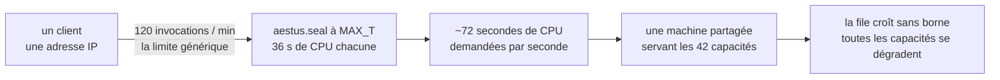
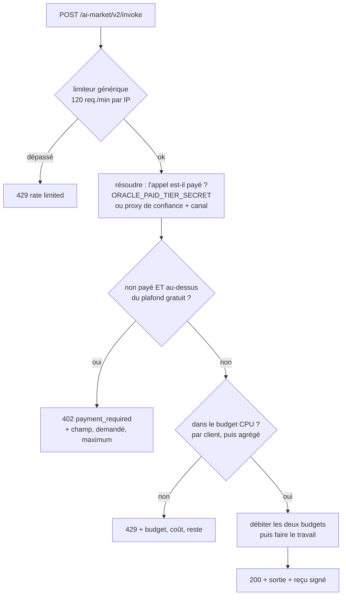
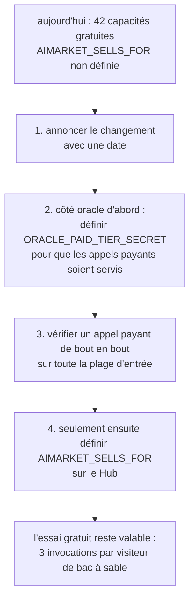

# Paliers gratuit et payant — ce que l'écosystème donne, et pourquoi

*Également disponible en [English](free-and-paid-tiers.md) · [Русский](free-and-paid-tiers.ru.md) · [Español](free-and-paid-tiers.es.md) · [中文](free-and-paid-tiers.zh.md)*

Presque toutes les capacités de `modelmarket.dev` sont gratuites aujourd'hui — sans
clé, sans canal, sans compte — et c'est une décision, non un oubli. Cette page dit
ce qui est gratuit, ce qui ne l'est pas, ce qui borne le palier gratuit, et quels
sont les deux interrupteurs qui activent la vente.

---

## 1. Par défaut : gratuit, et délibérément

Sur les 47 capacités que le Hub référence, 42 sont fédérées depuis la famille
d'oracles et servies à quiconque les demande. Les serveurs tournent de toute façon,
donc le coût marginal d'un inconnu qui en essaie une est du bruit, et un inconnu
qui *peut* en essayer une est la promotion la moins chère dont dispose le projet.

Deux propriétés rendent ce palier gratuit plus précieux qu'une démo habituelle :

- **Les reçus sont signés de façon identique pour les appels gratuits et payants.**
  Un appelant gratuit obtient un vrai reçu Ed25519 sur la vraie chaîne canonique,
  vérifiable avec la clé du fournisseur dans `/.well-known`. Rien n'est bouchonné.
  Qui évalue le protocole évalue bien le protocole.
- **Rien n'est dégradé en silence.** Là où un appel gratuit ne peut être servi
  entièrement, il est *refusé* avec le motif et le nombre, jamais servi plus petit
  sans le dire. Voir §4.

## 2. L'exception : deux capacités vendent du calcul

La plupart des capacités sont bornées par construction — une métrique de graphe sur
une entrée plafonnée, un hachage, un tirage. Leur pire entrée légale coûte des
fractions de milliseconde.

Deux sont différentes par nature. Une VDF de Wesolowski et un puzzle à verrou
temporel RSW se *tarifent en élévations au carré séquentielles imposées* : le
travail est le produit, il est séquentiel par construction, et aucune quantité de
matériel ne le parallélise. Chaque appel occupe un cœur entier pendant toute sa
durée.

Mesuré sur la machine de référence :

| capacité | pire entrée légale | CPU |
|---|---|---|
| `aestus.seal@v1` | `T = 5 000 000` (`MAX_T`) | **~36 s** — 7,3 s à 1M, 14,5 s à 2M, exactement linéaire |
| `chronos.eval@v1` | `difficulty = 1 000 000` (`MAX_DIFFICULTY`) | **6,8 s** — 8,2 ms à 1 000, 69 ms à 10 000, 680 ms à 100 000 |
| `aestus.open@v1` | `puzzle.T = 5 000 000` | ~36 s — les mêmes élévations, refaites honnêtement |
| `betti.homology@v1` | 300 points | 1,3 s — s'autolimite via `MAX_SIMPLICES` |
| les 38 autres | maximum | fractions de milliseconde |

`aestus.seal@v1` possède un **second levier de coût, indépendant** : générer des
premiers frais prend ~0,6 s à 2048 bits et ~2,7 s au maximum de 3072. Qui envoie
`T=1` avec `modulus_bits=3072` ne fait aucune élévation digne d'être comptée et
coûte tout de même près de trois secondes.

### Pourquoi c'est une question de capacité, non de recettes

Le limiteur générique par client admet 120 invocations/min. À la pire entrée légale
cela représente environ soixante-dix secondes de CPU demandées par seconde
d'horloge, depuis une seule adresse, contre une machine qui sert toute la famille :



Aucune malveillance n'est requise. Qui lit le manifeste, voit `maximum: 5000000` et
boucle fait exactement ce à quoi le schéma invite. Et les limites par adresse ne
bornent pas un appelant distribué — la propre analyse de trafic de l'opérateur a
déjà trouvé une flotte de 72 proxys résidentiels en circulation.

La solution n'est donc pas de commencer à facturer. C'est de **borner le travail**
qu'un appelant non payant peut exiger, et de borner la part de la machine qu'une
seule capacité peut prendre.

## 3. Plafonds du palier gratuit

Chaque plafond est fixé à la valeur que le schéma de la capacité déclare déjà comme
sa **valeur par défaut**. C'est important : un appelant qui n'envoie aucun argument
n'est jamais refusé, et le palier gratuit démontre entièrement la primitive — la
preuve se vérifie, le délai est réel, le reçu est signé.

| capacité | champ | plafond gratuit | maximum payant |
|---|---|---|---|
| `chronos.eval@v1` | `difficulty` | 100 000 (~0,68 s) | 1 000 000 |
| `aestus.seal@v1` | `T` | 1 000 000 (~7,3 s) | 5 000 000 |
| `aestus.seal@v1` | `modulus_bits` | 2048 (~0,6 s) | 3072 |
| `aestus.open@v1` | `puzzle.T` | 1 000 000 | 5 000 000 |

`puzzle.T` est un chemin imbriqué à dessein. `aestus.open@v1` reçoit un puzzle
entier et effectue `T` élévations où `T` est un champ *à l'intérieur* de celui-ci ;
une vérification du seul niveau supérieur bornerait donc `seal` en laissant les
mêmes 36 secondes grandes ouvertes sur l'endpoint voisin — atteignables avec un
puzzle écrit à la main n'étant jamais passé par `seal`.

Une conséquence à énoncer clairement : **un puzzle scellé avec un `T` payant ne peut
pas être ouvert gratuitement.** C'est le même travail dans les deux sens, donc c'est
cohérent plutôt que gênant. Et `aestus.verify@v1` reste gratuit et non borné — c'est
un seul hachage — de sorte que celui qui ouvre effectivement un grand puzzle peut
publier `b` et laisser tous les autres confirmer le déverrouillage pour rien.

### Refuser, jamais rogner

Un appel au-dessus du plafond reçoit `402 Payment Required` avec le plafond dans le
corps. Il n'est pas servi silencieusement au niveau du plafond.

Faire discrètement moins de travail que demandé émettrait un reçu signé attestant
une difficulté que l'appelant n'a pas demandée, et celui-ci, en chronométrant la
réponse, conclurait raisonnablement que l'oracle triche. Pour une primitive dont
toute la valeur est « ce temps séquentiel s'est écoulé de façon prouvable », ce
n'est pas un détail.

```json
{
  "ok": false,
  "error": "payment_required",
  "detail": "aestus.seal@v1: 'T'=5000000 exceeds the free-tier ceiling of 1000000. …",
  "capability_id": "aestus.seal@v1",
  "free_tier": { "field": "T", "requested": 5000000, "max": 1000000 }
}
```

(Chronos et Aestus rognent toujours en interne contre leurs propres maximums durs.
C'est une garde distincte et plus ancienne — contre une entrée au-dessus du *schéma
déclaré* — et elle demeure.)

## 4. Budgets CPU : rationner le travail, pas les appels

Une limite sur le *nombre* d'appels est la mauvaise forme pour ces capacités, car
leur coût s'étale sur quatre ordres de grandeur. Quel que soit le nombre choisi, il
est faux dans un sens :

- Le calibrer pour l'entrée coûteuse, et l'exploration ordinaire est refusée après
  deux requêtes. Ce n'est pas hypothétique : une limite plate de 2 appels par minute
  a été essayée d'abord et a cassé la propre suite de tests d'Aestus à la quatrième
  requête.
- Le calibrer pour l'entrée bon marché, et une boucle des coûteuses fait fondre la
  machine.

Chaque capacité coûteuse déclare donc un budget en **millisecondes de CPU par
minute**, et chaque requête est facturée ce qu'elle va réellement coûter, estimé par
une formule ajustée aux mesures du §2.

| capacité | par client | tous clients confondus | formule de coût |
|---|---|---|---|
| `chronos.eval@v1` | 20 000 ms/min | 60 000 ms/min | `difficulty / 147` |
| `aestus.seal@v1` | 20 000 ms/min | 60 000 ms/min | `T / 137 + 600` (ou `+ 2700` au-delà de 2560 bits) |
| `aestus.open@v1` | 20 000 ms/min | 60 000 ms/min | `puzzle.T / 137` |

20 000 ms/min, c'est un tiers de cœur par client. 60 000 ms/min, c'est un cœur
entier pour cette capacité tous clients confondus — le nombre qui protège
réellement une machine partagée, puisque les budgets par adresse ne bornent pas une
flotte de proxys.

Ce que le budget achète concrètement, pour `chronos.eval@v1` :

| entrée | coût | appels par minute et par client |
|---|---|---|
| `difficulty = 1 000` | 7 ms | ~2 900 (au-delà, la limite générique de 120/min agit d'abord) |
| `difficulty = 100 000` (plafond gratuit) | 680 ms | 29 |
| `difficulty = 1 000 000` (maximum payant) | 6 800 ms | 2 |

Un développeur qui explore à `difficulty=1000` est de fait sans limite ; celui qui
demande le million complet en obtient deux par minute. C'est la propriété qu'une
limite plate d'appels ne peut pas exprimer.

Les deux budgets sont **testés avant que l'un ou l'autre ne soit débité**, de sorte
qu'une requête refusée pour capacité serveur ne débite pas silencieusement
l'allocation propre de l'appelant pour un travail jamais effectué.

## 5. L'ordre des vérifications



La vérification du plafond passe **avant** celle du budget, et cet ordre est
porteur. Une requête au-dessus du plafond l'est définitivement ; un `429 réessayez
sous peu` enverrait donc l'appelant dans une boucle qui ne peut jamais réussir. Le
`402` lui donne le vrai plafond et lui dit que payer le lève. L'épuisement du
budget, en revanche, se résorbe bel et bien de lui-même — c'est donc ce refus qui
mérite `429`, et il vient en second.

Un `429` de budget nomme trois nombres, car un appelant nettement en dessous de
120/min et refusé malgré tout a besoin des trois pour savoir s'il doit attendre ou
demander moins de travail :

```
rate limited: chronos.eval@v1 budgets 20000 ms of CPU per minute per client
because its cost scales with the input; this call is ~680 ms and 272 ms remain.
Retry later, or ask for less work.
```

## 6. Ce qu'un acheteur peut lire sans rien dépenser

Les plafonds et les budgets sont publiés dans le manifeste signé, de sorte qu'un
agent en phase de découverte les apprend sans dépenser un appel pour les découvrir :

```json
{
  "capability_id": "aestus.seal@v1",
  "price_per_call_usd": 0.006,
  "free_tier_max": { "T": 1000000, "modulus_bits": 2048 },
  "cpu_budget_ms_per_min": 20000,
  "global_cpu_budget_ms_per_min": 60000
}
```

Les capacités sans contrôles de coût — 39 sur 42 — ne publient aucune de ces clés ;
leurs entrées de manifeste sont donc inchangées.

Il en va de même pour l'endpoint agrégé `oracle-family`, celui avec lequel le Hub
fédère réellement : il collecte les véritables objets de capacité de ses 17
frères, de sorte que plafonds, budgets et champs publiés y arrivent sans câblage
supplémentaire. À noter : les budgets sont **par processus** — un oracle tournant à
la fois seul et au sein de la famille a un seau distinct dans chacun.

## 7. Activer la vente

Il y a deux interrupteurs, de deux côtés différents, et **les deux sont éteints par
défaut**.

### 7.1 Côté oracle — qui est autorisé au-delà du plafond

Un oracle ne peut pas vérifier seul un canal de paiement : les canaux vivent dans
le registre du Hub, et les identifiants de canal voyagent à l'intérieur des reçus,
si bien que la simple présence d'un identifiant ne prouve rien. Plutôt que de
coupler chaque invocation à un aller-retour vers le Hub, la levée n'est accordée
qu'à un appelant que l'opérateur a explicitement désigné.

| variable | signification |
|---|---|
| `ORACLE_PAID_TIER_SECRET` | Un secret partagé envoyé dans `X-AIMarket-Paid-Tier`. Comparé en temps constant. Indépendant de la topologie réseau — **à préférer**. |
| `ORACLE_TRUSTED_PAYMENT_PROXIES` | IP/CIDR séparés par des virgules. Une requête venant de l'un d'eux et portant un `X-Payment-Channel` non vide compte comme payée, au motif que le Hub a pris une réservation avant de la transmettre. Fait confiance au proxy inverse pour fixer `X-Real-IP` — la même confiance que le limiteur accorde déjà. |

Avec **aucune des deux** définie — l'état livré — *aucun appel n'est jamais levé*, y
compris les appels venant du Hub. Le plafond gratuit s'applique à tous. C'est le
comportement par défaut recherché pour une famille qui ne vend rien aujourd'hui :
il échoue du côté fermé, et activer la vente est une variable par côté, non une
modification de code.

Une entrée mal formée dans `ORACLE_TRUSTED_PAYMENT_PROXIES` est ignorée plutôt que
traitée comme un joker, et n'empêche pas les entrées valides voisines de
fonctionner.

### 7.2 Côté Hub — `AIMARKET_SELLS_FOR`

> [!WARNING]
> **`AIMARKET_SELLS_FOR` n'est pas définie par défaut, et la définir rend payantes
> d'un coup 42 capacités aujourd'hui gratuites.**
>
> Non définie, le Hub ne facture rien pour une invocation fédérée : `fed_price`
> vaut `0.0`, aucun canal n'est exigé, aucune réservation n'est prise, aucune
> commission de routage n'est perçue. Toute capacité fédérée est gratuite pour
> quiconque.
>
> Avec un préfixe d'URL de pair listé dedans, chaque capacité fédérée de ce pair
> devient tarifée. Une invocation sans `X-Payment-Channel` reçoit
> `402 payment_required`. Les appelants gratuits existants — y compris tout agent,
> pont ou client MCP qui les utilise déjà — commencent à échouer dans la minute.
>
> Il n'y a ni déploiement partiel ni période de grâce. Définissez-la quand vous
> avez l'intention de vendre, pas pour voir ce qui se passe.

La valeur est une liste, séparée par des virgules, de préfixes d'URL de pairs pour
le compte desquels le Hub vend, comparée par préfixe de chemin :

```bash
AIMARKET_SELLS_FOR=https://oracles.modelmarket.dev
```

**Pourquoi cela doit être déclaré plutôt que déduit.** Le raccourci évident est « si
le pair a répondu 200 sans facturer, le pair ne facture pas, donc nous pouvons ».
C'est faux, et cinq tests de commission de routage l'ont attrapé : un pair qui
facture hors bande répond aussi 200. Déduire le consentement d'un code de statut
ferait facturer ce Hub par-dessus la facture propre du pair, l'acheteur payant deux
fois sans aucun moyen de s'en apercevoir. Vendre pour le compte d'autrui est donc
quelque chose que l'opérateur déclare explicitement, pair par pair.

`AIMARKET_SELLS_FOR` est par ailleurs indépendante de `AIFACTORY_CRYPTO_ENABLED`
(voir [crypto-switch](crypto-switch.fr.md)) et du palier d'essai en bac à sable.
Les prix s'appliquent seulement quand la crypto est active, que l'appel n'est pas un
essai de bac à sable **et** que le pair est listé.

### 7.3 La séquence qui ne casse personne



L'étape 2 avant l'étape 4 est le point sur lequel il faut insister. Définir
`AIMARKET_SELLS_FOR` en premier ferait exiger par le Hub un paiement pour des
capacités que l'oracle refuserait encore au-dessus de son plafond gratuit : des
acheteurs payant pour un travail qu'ils ne peuvent pas recevoir.

## 8. Pour les auteurs d'oracles

Quatre champs facultatifs sur `Capability`, tous vides par défaut, de sorte que les
39 capacités qui n'ont besoin de rien se comportent exactement comme avant :

```python
Capability(
    capability_id="mine.expensive@v1",
    handler=_run,
    # Les appelants non payants sont refusés au-delà de ces valeurs ; mettez-y les
    # valeurs par défaut du schéma lui-même, pour qu'un appel sans argument ne soit
    # jamais refusé.
    free_tier_max={"iterations": 10_000},
    # Ce que coûte une entrée, en ms de CPU. Ajustez-le à une mesure et dites-le en
    # commentaire : seule la justesse relative compte, une machine plus lente mettant
    # tous les coûts à la même échelle.
    cost_ms=lambda d: d.get("iterations", 10_000) / 25.0,
    cpu_budget_ms_per_min=20_000,        # un tiers de cœur par client
    global_cpu_budget_ms_per_min=60_000, # un cœur pour tous
)
```

Une formule de coût qui lève une exception est traitée comme coûtant la valeur par
défaut de 1 ms plutôt que prise pour un 500 : l'estimateur de coût est un confort et
ne doit pas pouvoir mettre l'oracle à terre. Les estimations ont un plancher à 1 ms,
si bien qu'une formule renvoyant zéro ne peut pas amener un budget à admettre un
nombre illimité d'appels.

Déclarer `free_tier_max` sur une capacité dont le coût est déjà borné n'apporte rien
et ajoute un chemin de refus : laissez-le vide sauf si la pire entrée légale est
mesurablement coûteuse.

## 9. Voir aussi

- [crypto-switch](crypto-switch.fr.md) — l'interrupteur maître de l'économie on-chain
- [payment-enable-runbook](payment-enable-runbook.md) — activer les paiements réels sur le Hub
- `oracles/core/oracle_core/tiers.py` — l'implémentation, avec les chiffres en commentaires
- `oracles/core/tests/test_tiers.py` — 52 tests sur ce comportement
