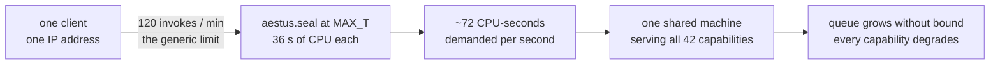
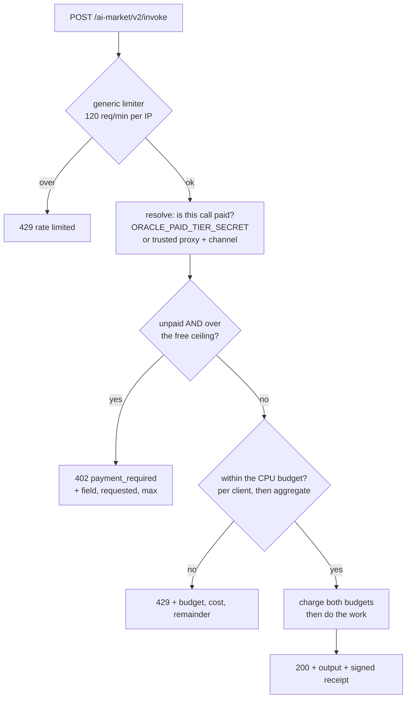
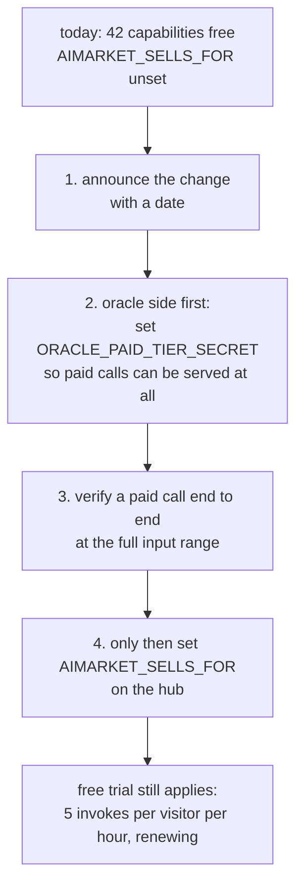
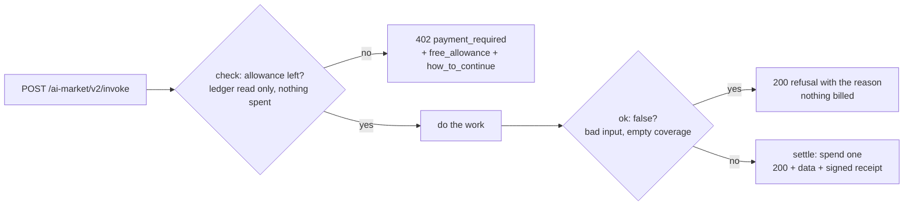

# Free and paid tiers — what the ecosystem gives away, and why

*Also available in [Русский](free-and-paid-tiers.ru.md) · [Español](free-and-paid-tiers.es.md) · [Français](free-and-paid-tiers.fr.md) · [中文](free-and-paid-tiers.zh.md)*

Almost every capability on `modelmarket.dev` is free right now — no key, no
channel, no account — and that is a decision rather than an oversight. This page
says what is free, what is not, what bounds the free tier, and the two switches
that turn selling on.

---

## 1. The default: free, and deliberately so

Of the 47 capabilities the hub lists, 42 are federated from the oracle family and
are served to anyone who asks. The servers run regardless of whether anyone calls
them, so the marginal cost of a stranger trying one is noise, and a stranger who
*can* try one is the cheapest promotion the project has.

Two properties make the free tier worth more than a demo usually is:

- **Receipts are signed identically for free and paid calls.** A free caller gets
  a real Ed25519 receipt over the real canonical string, verifiable against the
  provider's `/.well-known` key. Nothing is stubbed. Someone evaluating the
  protocol can evaluate the actual protocol.
- **Nothing is downgraded silently.** Where a free call cannot be served in full,
  it is *refused* with the reason and the number, never quietly served smaller.
  See §4.

## 2. The exception: two capabilities sell computation

Most capabilities are bounded by construction — a graph metric over a capped
input, a hash, a draw. Their worst legal input costs a fraction of a millisecond.

Two are different in kind. A Wesolowski VDF and an RSW time-lock puzzle are
*priced in enforced sequential squarings*: the work is the product, it is
sequential by construction, and no amount of hardware parallelises it away. Each
call pins one core for its whole duration.

Measured on the reference box:

| capability | worst legal input | CPU |
|---|---|---|
| `aestus.seal@v1` | `T = 5 000 000` (`MAX_T`) | **~36 s** — 7.3 s at 1M, 14.5 s at 2M, exactly linear |
| `chronos.eval@v1` | `difficulty = 1 000 000` (`MAX_DIFFICULTY`) | **6.8 s** — 8.2 ms at 1 000, 69 ms at 10 000, 680 ms at 100 000 |
| `aestus.open@v1` | `puzzle.T = 5 000 000` | ~36 s — the same squarings, redone honestly |
| `betti.homology@v1` | 300 points | 1.3 s — self-capping via `MAX_SIMPLICES` |
| the other 38 | maximum | fractions of a millisecond |

`aestus.seal@v1` has a **second, independent** cost knob: fresh prime generation
takes ~0.6 s at 2048 bits and ~2.7 s at the 3072-bit maximum. A caller who sends
`T=1` with `modulus_bits=3072` does no squaring worth counting and still costs
nearly three seconds.

### Why this is a capacity question, not a revenue question

The generic per-client limiter admits 120 invokes/min. At the worst legal input
that is roughly seventy CPU-seconds of demand per second of wall clock, from a
single address, against one machine that serves the whole family:



No malice is required. A caller who reads the manifest, sees `maximum: 5000000`
and loops is doing exactly what the schema invites. And per-address limits do not
bind a distributed caller — the operator's own traffic analysis has already found
a 72-address residential-proxy fleet in the wild.

So the fix is not to start charging. It is to **bound the work** an unpaid caller
can command, and to bound the share of the machine any one capability can take.

## 3. Free-tier ceilings

Every ceiling is set to the value the capability's own schema already declares as
its **default**. That matters: a caller who sends no arguments at all is never
refused, and the free tier demonstrates the primitive completely — the proof
verifies, the delay is real, the receipt is signed.

| capability | field | free ceiling | paid maximum |
|---|---|---|---|
| `chronos.eval@v1` | `difficulty` | 100 000 (~0.68 s) | 1 000 000 |
| `aestus.seal@v1` | `T` | 1 000 000 (~7.3 s) | 5 000 000 |
| `aestus.seal@v1` | `modulus_bits` | 2048 (~0.6 s) | 3072 |
| `aestus.open@v1` | `puzzle.T` | 1 000 000 | 5 000 000 |

`puzzle.T` is a nested path on purpose. `aestus.open@v1` takes a whole puzzle and
does `T` squarings where `T` is a field *inside* it, so a top-level-only check
would bound `seal` and leave the identical 36 seconds wide open one endpoint over
— reachable with a hand-written puzzle that never went through `seal` at all.

One consequence worth stating plainly: **a puzzle sealed at a paid `T` cannot be
opened for free.** That is the same work either way, so it is consistent rather
than awkward. And `aestus.verify@v1` stays free and unbounded — it is one hash —
so whoever does open a large puzzle can publish `b` and let everyone else confirm
the unlock for nothing.

### Refuse, never clamp

A call over the ceiling gets `402 Payment Required` with the ceiling in the body.
It is not silently served at the ceiling instead.

Quietly doing less work than asked would mint a signed receipt attesting a
difficulty the caller did not request, and a caller timing the response would
reasonably conclude the oracle cheats. For a primitive whose entire value is
"this much sequential time provably elapsed", that is not a small thing.

```json
{
  "ok": false,
  "error": "payment_required",
  "detail": "aestus.seal@v1: 'T'=5000000 exceeds the free-tier ceiling of 1000000. …",
  "capability_id": "aestus.seal@v1",
  "free_tier": { "field": "T", "requested": 5000000, "max": 1000000 }
}
```

(Chronos and Aestus still clamp internally against their own hard maxima. That is
a separate, older guard — against input above the *declared schema* — and it
stays.)

## 4. CPU budgets: ration work, not calls

A limit on the *number* of calls is the wrong shape for these capabilities,
because their cost spans four orders of magnitude. Whichever number you pick, it
is wrong in one direction:

- Size it for the expensive input, and ordinary exploration is refused after two
  requests. This is not hypothetical — a flat 2-calls-per-minute limit was tried
  first and it broke Aestus's own test suite on the fourth request.
- Size it for the cheap input, and a loop of expensive ones melts the box.

So each expensive capability declares a budget in **CPU-milliseconds per minute**,
and each request is charged what it will actually cost, estimated from a formula
fitted to the measurements in §2.

| capability | per client | across all clients | cost formula |
|---|---|---|---|
| `chronos.eval@v1` | 20 000 ms/min | 60 000 ms/min | `difficulty / 147` |
| `aestus.seal@v1` | 20 000 ms/min | 60 000 ms/min | `T / 137 + 600` (or `+ 2700` above 2560 bits) |
| `aestus.open@v1` | 20 000 ms/min | 60 000 ms/min | `puzzle.T / 137` |

20 000 ms/min is a third of a core per client. 60 000 ms/min is one whole core
for that capability across everyone — the number that actually protects a shared
box, since per-address budgets do not bind a proxy fleet.

What the budget buys, concretely, for `chronos.eval@v1`:

| input | cost | calls per minute per client |
|---|---|---|
| `difficulty = 1 000` | 7 ms | ~2 900 (then the generic 120/min binds first) |
| `difficulty = 100 000` (free ceiling) | 680 ms | 29 |
| `difficulty = 1 000 000` (paid maximum) | 6 800 ms | 2 |

A developer exploring at `difficulty=1000` is effectively unlimited; a caller
asking for the full million gets two a minute. That is the property a flat call
limit cannot express.

Both budgets are **tested before either is charged**, so a request refused for
server capacity does not silently debit the caller's own allowance for work that
was never performed.

## 5. The order of the checks



The free-ceiling check comes **before** the budget check, and that order is load
bearing. A request over the ceiling is over it permanently, so a `429 retry
shortly` would send the caller into a loop that can never succeed. `402` tells
them the real ceiling and that payment lifts it. Budget exhaustion, by contrast,
genuinely does clear on its own — so it is the refusal that deserves `429`, and
it belongs second.

A `429` from a budget names three numbers, because a caller well under 120/min
who is refused anyway needs all three to know whether to wait or to ask for less:

```
rate limited: chronos.eval@v1 budgets 20000 ms of CPU per minute per client
because its cost scales with the input; this call is ~680 ms and 272 ms remain.
Retry later, or ask for less work.
```

## 6. What a buyer can read before spending anything

The ceilings and budgets are published in the signed manifest, so a discovering
agent learns them without spending a call to find out:

```json
{
  "capability_id": "aestus.seal@v1",
  "price_per_call_usd": 0.006,
  "free_tier_max": { "T": 1000000, "modulus_bits": 2048 },
  "cpu_budget_ms_per_min": 20000,
  "global_cpu_budget_ms_per_min": 60000
}
```

Capabilities with no cost controls — 39 of the 42 — publish none of these keys,
so their manifest entries are unchanged.

The same is true of the aggregated `oracle-family` endpoint, which is what the
hub actually federates with: it collects the real capability objects from its 17
siblings, so the ceilings, budgets and published fields arrive there with no extra
wiring. Note that budgets are **per process** — an oracle running both standalone
and inside the family has a separate bucket in each.

## 7. Turning selling on

There are two switches, on two different sides, and **both are off by default**.

### 7.1 Oracle side — who is allowed past the ceiling

An oracle cannot verify a payment channel by itself: channels live in the hub's
ledger, and channel ids travel inside receipts, so the mere presence of an id
proves nothing. Rather than couple every invoke to a hub round trip, the lift is
granted only to a caller the operator has explicitly nominated.

| variable | meaning |
|---|---|
| `ORACLE_PAID_TIER_SECRET` | A shared secret sent as `X-AIMarket-Paid-Tier`. Compared in constant time. Independent of network topology — **prefer this one**. |
| `ORACLE_TRUSTED_PAYMENT_PROXIES` | Comma-separated IPs/CIDRs. A request from one of them carrying a non-empty `X-Payment-Channel` counts as paid, on the grounds that the hub took a hold before forwarding it. Trusts the reverse proxy to set `X-Real-IP` — the same trust the rate limiter already places. |

With **neither** set — the shipped default — *no call is ever lifted*, including
calls from the hub. The free ceiling applies to everybody. That is the intended
default for a family that currently sells nothing: it fails closed, and turning
selling on is one variable per side rather than a code change.

A malformed entry in `ORACLE_TRUSTED_PAYMENT_PROXIES` is ignored rather than
treated as a wildcard, and does not stop the valid entries beside it from working.

### 7.2 Hub side — `AIMARKET_SELLS_FOR`

> [!WARNING]
> **`AIMARKET_SELLS_FOR` is unset by default, and setting it makes 42 currently
> free capabilities paid at once.**
>
> With it unset, the hub charges nothing for a federated invoke: `fed_price` is
> `0.0`, no channel is required, no hold is taken, and no routing fee is
> collected. Every federated capability is free to anyone.
>
> With a peer URL prefix listed in it, every federated capability from that peer
> becomes priced. An invoke without `X-Payment-Channel` is answered
> `402 payment_required`. Existing free callers — including any agent, bridge or
> MCP client already using them — start failing that same minute.
>
> There is no partial rollout and no grace period. Set it when you intend to
> sell, not to see what happens.

The value is a comma-separated list of peer URL prefixes the hub sells on behalf
of, matched by path prefix:

```bash
AIMARKET_SELLS_FOR=https://oracles.modelmarket.dev
```

**Why it has to be declared rather than inferred.** The obvious shortcut is "if
the peer answered 200 without charging, the peer isn't charging, so we may." That
is wrong, and five routing-fee tests caught it: a peer that invoices out of band
also answers 200. Inferring consent from a status code would have this hub
charging on top of a peer's own bill, with the buyer paying twice and no way to
tell. So selling on someone else's behalf is something the operator states
explicitly, per peer.

`AIMARKET_SELLS_FOR` is also independent of `AIFACTORY_CRYPTO_ENABLED` (see
[crypto-switch](crypto-switch.md)) and of the sandbox trial tier. Prices apply
only when crypto is on, the call is not a sandbox trial, **and** the peer is
listed.

### 7.3 The sequence that does not break anyone



Step 2 before step 4 is the part worth insisting on. Setting
`AIMARKET_SELLS_FOR` first would make the hub demand payment for capabilities the
oracle would still refuse above the free ceiling — buyers paying for work they
cannot receive.

## 8. For oracle authors

Four optional fields on `Capability`, all empty by default, so the 39
capabilities that need nothing keep behaving exactly as they did:

```python
Capability(
    capability_id="mine.expensive@v1",
    handler=_run,
    # Unpaid callers are refused above these; the values should be the schema's
    # own defaults, so an argument-free call is never refused.
    free_tier_max={"iterations": 10_000},
    # What one input costs, in CPU-ms. Fit it to a benchmark and say so in a
    # comment — only relative accuracy matters, since a slower machine scales
    # every cost alike.
    cost_ms=lambda d: d.get("iterations", 10_000) / 25.0,
    cpu_budget_ms_per_min=20_000,        # a third of a core per client
    global_cpu_budget_ms_per_min=60_000, # one core across everyone
)
```

A cost formula that raises is treated as costing the 1 ms default rather than
taken as a 500: a cost estimator is a convenience and must not be able to take
the oracle down. Estimates are floored at 1 ms, so a formula returning zero
cannot make a budget admit unlimited calls.

Declaring `free_tier_max` on a capability whose cost is already bounded buys
nothing and costs a refusal path — leave it empty unless the worst legal input is
measurably expensive.

## 9. Quota windows: the dial between reach and revenue

The free trial began as a *lifetime* allowance — three invokes per visitor, ever.
That is the right shape when the scarce thing is capacity. It is the wrong shape
while the scarce thing is people who have heard of the mesh: a visitor who spent
their three calls in March has no way back in August, and the ledger row that
refuses them is indistinguishable from the one that refuses abuse.

So the allowance now has a **window**, and the window is a dial:

| window | meaning | when it fits |
|---|---|---|
| `lifetime` | N invokes per visitor, ever | capacity is the binding constraint; no growth goal |
| `hourly` | N per visitor per UTC hour | **current production setting** — the most forgiving window that still bounds a loop |
| `daily` | N per visitor per UTC day | steady evaluation without leaving a tap open |
| `weekly` | N per ISO week | deliberate, slow trials |

What production publishes today, in the signed manifest, so a discovering agent
reads the deal before spending anything:

```json
"free_trial": {
  "enabled": true,
  "max_invokes_per_visitor": 5,
  "quota_window": "hourly",
  "renews": true,
  "visitor_header": "X-AIMarket-Sandbox-Visitor"
}
```

`renews` earns its place next to the number. A refused caller has exactly two
sensible responses — wait, or open a payment channel — and only that field says
which one will work. A lifetime tier that published just `max` and `used` left
both answers equally plausible, and an agent that guessed "wait" would poll a
limit that never moves.

**Why hourly and not daily.** Against a loop the two are identical: five calls,
then a refusal. They differ for the caller we actually want — someone who reads
the manifest, tries a capability, misreads the schema, and tries again. Under a
daily window that person is locked out until tomorrow, which in practice means
lost for good; under an hourly one they are back before they have closed the tab.
The looser window costs nothing on the abuse side and removes the failure that
loses people. It is set to the softest useful value on purpose, and it tightens
when load makes it necessary — not before.

Setting it: `AIMARKET_SANDBOX_QUOTA_WINDOW` and
`AIMARKET_SANDBOX_MAX_PER_VISITOR` in the environment, or `quota_window` and
`max_per_visitor` in `data/sandbox_trial_policy.json`; environment wins, so an operator can override a
file baked into an image. An unrecognised window value falls back to `lifetime`
rather than to unlimited — a typo in a policy file must not give the mesh away.

**Which code a spent allowance gets, and why the two services differ.** The hub answers
`429 trial_quota_exhausted`; ATLAS answers `402 payment_required`. That is not an
inconsistency to tidy up — it is the difference between a limit that clears on its own and a
price you can pay. A renewing hub allowance genuinely resolves by waiting, which is what 429
means; an ATLAS SKU has a published price and a channel to open, which is what 402 means. The
hub publishes both `exhausted_status` and `exhausted_error` next to the allowance so an agent
branches on a stated fact rather than a guess. Worth stating because the hub's own text used
to promise 402 — written when the tier was lifetime, never corrected when it became a
renewing window — and an agent that trusted it would read a temporary refusal as "must pay",
abandon a free tier it still had, and not come back.

Windows are keyed in UTC (`%Y-%m-%dT%H`, `%Y-%m-%d`, ISO `%G-W%V`), so they roll
over at the same instant for every caller and no local clock is involved. An
allowance is per window key, which means the ledger keeps the old rows and the
history of a visitor stays readable after the window turns.

A second dial sits behind the first: `AIMARKET_SANDBOX_MAX_PER_IP_HOUR` (default 30, or
`max_per_ip_hour` in the policy file) caps trials per network address per hour. The
per-visitor allowance can afford to be generous because a visitor id is self-chosen and
therefore free to mint; the per-address cap is what actually bounds someone minting a
thousand of them, and it is the first number to reach for if load ever makes the soft
window uncomfortable.

## 10. Metering a satellite: how ATLAS started charging

ATLAS published a price list and served everything for free. Its manifest said
`price_per_call_usd: 0.06`; `POST /ai-market/v2/invoke` with no payment returned
`200 OK` with the data. That is not a free tier — it is a price nobody was asked
to honour, and from the outside the paid mesh looked priced while being unmetered
in fact.

It is now enforced, on the same terms the hub offers, so an agent that discovers
either service sees one deal rather than two:

```bash
ATLAS_PAYMENT_ENFORCED=1          # off by default; enforcement is an operator decision
ATLAS_TRIAL_WINDOW=hourly         # same vocabulary as the hub
ATLAS_TRIAL_MAX_PER_CALLER=5
```

Live behaviour, verified end to end: five delivered calls, then

```json
{
  "error": "payment_required",
  "capability_id": "atlas.situation.brief@v1",
  "price_per_call_usd": 0.06,
  "free_allowance": { "max": 5, "used": 5, "quota_window": "hourly", "renews": true },
  "how_to_continue": [
    "Wait for the hourly allowance to renew.",
    "Send X-AIMarket-Sandbox-Visitor with a stable id (8-64 chars) to hold your own allowance rather than sharing your network's.",
    "Open a payment channel at the hub and invoke through it: https://modelmarket.dev/.well-known/ai-market.json"
  ]
}
```

### Refusals are not billed

The allowance is **checked** before the work and **spent** only once the product
returns data. The first version charged on entry, which was wrong in a way worth
recording: a caller sending a malformed bounding box burned its entire free tier
on `refuse_reason` and never saw a single reading. As an introduction to a paid
mesh, there is nothing worse.

This is not an exotic path. ATLAS refuses rather than guesses whenever coverage is
empty — that is its honesty policy, not an error — so refusals are routine: right
after a redeploy the sensor fleet is cold and *every* call refuses until it warms.
Charging for those would bill a caller for the operator's restart.



Three further properties, each chosen rather than inherited:

- **Off unless set.** Enforcement changes what existing callers get back, so it is
  an explicit operator decision, never a side effect of a deploy.
- **Free capabilities never consume allowance.** A SKU priced at 0 that spent a
  trial would report the wrong limit and hide the real one behind an unrelated
  refusal.
- **Fails open.** If the ledger cannot be read or written, the invoke proceeds. A
  broken meter must not take the mesh down: under-charging is recoverable,
  refusing every caller is not. Catching `sqlite3.Error` alone was not enough —
  an unwritable ledger path raises `OSError` from `mkdir` before any SQL runs.

Callers identify themselves with `X-AIMarket-Sandbox-Visitor` (8–64 characters)
and hold their own allowance. Without it the network address is used, so an agent
behind a shared address still gets a real tier rather than a refusal — and the
402 body tells it how to stop sharing.

## 11. Published products: walletless by default

A product the factory publishes must work for a visitor who has no wallet, has
never heard of USDC, and will not create an account. So a deployment carries no
wallet unless the operator says otherwise: it runs on the free allowance above,
invoking mesh capabilities as an ordinary caller with a stable visitor id, and its
output carries the same signed receipts a paid call would.

```bash
# On the factory, before publishing. Absent = WALLET_ENABLED=0 in the deployment.
AIFACTORY_PRODUCT_WALLET_ADDRESS=0x…      # opt in
AIFACTORY_PRODUCT_WALLET_CHAIN=base       # optional, defaults to base
```

**Never a private key.** An address is configuration; a key is custody. A
serverless function's environment is readable by anyone who can redeploy the
project, so walletless-by-default is also the safe default — and a product that
needs to settle beyond the free tier binds an address whose keys stay with the
operator.

One design consequence follows and is worth stating plainly: **a published product
must degrade to a cached answer, not to an error, when its allowance runs out.**
Showing the last reading together with the time it was taken is honest and still
useful; a panel that renders `402` is neither. Products in this ecosystem are
specified that way — caching the most recent data with its read time is a
requirement of the brief, not a nicety.

## 12. Related

- [crypto-switch](crypto-switch.md) — the master on/off for the on-chain economy
- [payment-enable-runbook](payment-enable-runbook.md) — enabling real payments on the hub
- `oracles/core/oracle_core/tiers.py` — the implementation, with the numbers in comments
- `oracles/core/tests/test_tiers.py` — 52 tests over this behaviour
- `aimarket-hub/aimarket_hub/sandbox_trials.py` — the trial ledger and its windows
- `atlas/atlas/payment_gate.py` — the ATLAS meter, with the check/settle split
- `web/backend/services/vercel_fullstack_adapter.py` — `wallet_env()`, the walletless default
