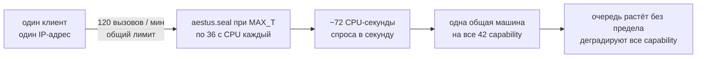
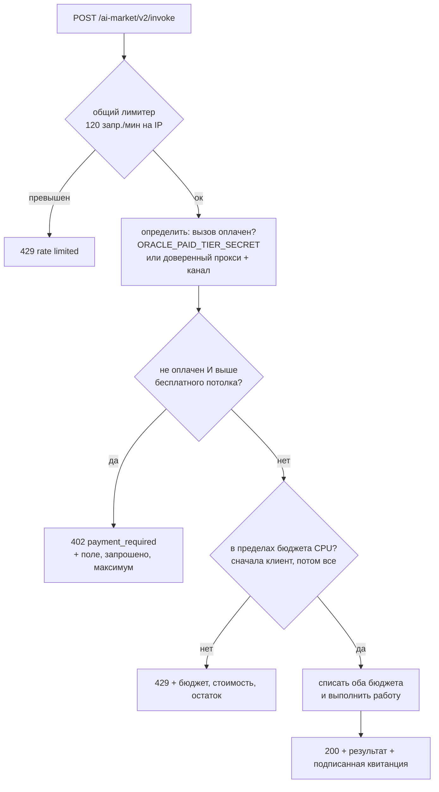
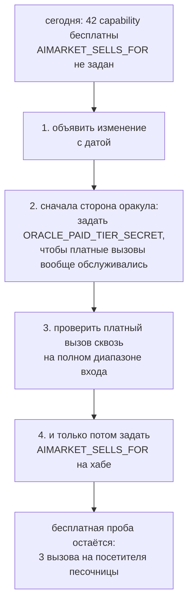

# Бесплатный и платный тарифы — что экосистема отдаёт даром и почему

*Также доступно: [English](free-and-paid-tiers.md) · [Español](free-and-paid-tiers.es.md) · [Français](free-and-paid-tiers.fr.md) · [中文](free-and-paid-tiers.zh.md)*

Почти каждая capability на `modelmarket.dev` сейчас бесплатна — без ключа, без
канала, без учётной записи, — и это решение, а не недосмотр. Здесь сказано, что
бесплатно, что нет, чем ограничен бесплатный тариф и какие два переключателя
включают продажу.

---

## 1. По умолчанию — бесплатно, и намеренно

Из 47 capability, которые перечисляет хаб, 42 федерируются из семьи оракулов и
отдаются любому, кто спросит. Серверы работают независимо от того, зовёт ли их
кто-нибудь, поэтому предельная стоимость чужой пробы — шум, а незнакомец, который
*может* попробовать, — самое дешёвое продвижение, какое у проекта есть.

Два свойства делают этот бесплатный тариф ценнее обычной демонстрации:

- **Квитанции подписываются одинаково для бесплатного и платного вызова.**
  Бесплатный вызывающий получает настоящую Ed25519-квитанцию над настоящей
  канонической строкой, проверяемую ключом провайдера из `/.well-known`. Ничего
  не заглушено. Кто оценивает протокол — оценивает действительно протокол.
- **Ничего не урезается молча.** Там, где бесплатный вызов нельзя обслужить
  полностью, он *отклоняется* с причиной и числом, а не тихо выполняется в
  меньшем объёме. См. §4.

## 2. Исключение: две capability продают вычисление

Большинство capability ограничены по построению — метрика на графе с
ограниченным входом, хеш, розыгрыш. Их худший допустимый вход стоит доли
миллисекунды.

Две отличаются качественно. VDF Весоловского и головоломка RSW с временным
замком *измеряются в принудительных последовательных возведениях в квадрат*:
работа и есть продукт, она последовательна по построению, и никакое количество
железа её не распараллелит. Каждый вызов держит одно ядро целиком.

Замерено на эталонной машине:

| capability | худший допустимый вход | CPU |
|---|---|---|
| `aestus.seal@v1` | `T = 5 000 000` (`MAX_T`) | **~36 с** — 7,3 с при 1M, 14,5 с при 2M, строго линейно |
| `chronos.eval@v1` | `difficulty = 1 000 000` (`MAX_DIFFICULTY`) | **6,8 с** — 8,2 мс при 1 000, 69 мс при 10 000, 680 мс при 100 000 |
| `aestus.open@v1` | `puzzle.T = 5 000 000` | ~36 с — те же возведения, переделанные честно |
| `betti.homology@v1` | 300 точек | 1,3 с — сам себя ограничивает через `MAX_SIMPLICES` |
| остальные 38 | максимум | доли миллисекунды |

У `aestus.seal@v1` есть **второй, независимый** рычаг стоимости: генерация свежих
простых занимает ~0,6 с при 2048 битах и ~2,7 с при максимуме 3072. Вызывающий,
который отправит `T=1` с `modulus_bits=3072`, не сделает возведений, о которых
стоит говорить, и всё равно обойдётся почти в три секунды.

### Почему это вопрос ёмкости, а не выручки

Общий лимитер на клиента пропускает 120 вызовов/мин. На худшем допустимом входе
это примерно семьдесят CPU-секунд спроса в секунду настенного времени, с одного
адреса, к одной машине, которая обслуживает всю семью:



Злого умысла не требуется. Вызывающий, который прочитал манифест, увидел
`maximum: 5000000` и зациклился, делает ровно то, к чему приглашает схема. А
лимиты по адресу не сдерживают распределённого вызывающего — собственный анализ
трафика оператора уже нашёл в природе ферму из 72 residential-прокси.

Поэтому решение — не начать брать деньги. Решение — **ограничить работу**, которую
может потребовать неоплаченный вызывающий, и долю машины, которую может занять
одна capability.

## 3. Потолки бесплатного тарифа

Каждый потолок равен значению, которое схема самой capability уже объявляет своим
**значением по умолчанию**. Это важно: вызывающий, не передавший ни одного
аргумента, никогда не получит отказ, а бесплатный тариф демонстрирует примитив
полностью — доказательство проверяется, задержка настоящая, квитанция подписана.

| capability | поле | бесплатный потолок | платный максимум |
|---|---|---|---|
| `chronos.eval@v1` | `difficulty` | 100 000 (~0,68 с) | 1 000 000 |
| `aestus.seal@v1` | `T` | 1 000 000 (~7,3 с) | 5 000 000 |
| `aestus.seal@v1` | `modulus_bits` | 2048 (~0,6 с) | 3072 |
| `aestus.open@v1` | `puzzle.T` | 1 000 000 | 5 000 000 |

`puzzle.T` — вложенный путь намеренно. `aestus.open@v1` принимает головоломку
целиком и делает `T` возведений, где `T` — поле *внутри* неё, так что проверка
только верхнего уровня ограничила бы `seal` и оставила те же 36 секунд полностью
открытыми на соседнем эндпоинте — достижимыми головоломкой, написанной руками,
которая никогда не проходила через `seal`.

Одно следствие стоит сказать прямо: **головоломку, запечатанную с платным `T`,
нельзя открыть бесплатно.** Это одна и та же работа в обе стороны, так что это
последовательно, а не неловко. А `aestus.verify@v1` остаётся бесплатным и
неограниченным — это один хеш, — поэтому тот, кто всё-таки открыл большую
головоломку, может опубликовать `b`, и все остальные подтвердят разблокировку
бесплатно.

### Отказывать, а не подрезать

Вызов выше потолка получает `402 Payment Required` с потолком в теле. Он не
обслуживается молча на уровне потолка.

Тихо сделать меньше работы, чем попросили, значило бы выпустить подписанную
квитанцию, утверждающую сложность, которую вызывающий не запрашивал, и он,
измерив время ответа, обоснованно заключил бы, что оракул мошенничает. Для
примитива, вся ценность которого — «столько-то последовательного времени
доказуемо прошло», это не мелочь.

```json
{
  "ok": false,
  "error": "payment_required",
  "detail": "aestus.seal@v1: 'T'=5000000 exceeds the free-tier ceiling of 1000000. …",
  "capability_id": "aestus.seal@v1",
  "free_tier": { "field": "T", "requested": 5000000, "max": 1000000 }
}
```

(Chronos и Aestus по-прежнему подрезают внутренне по своим жёстким максимумам.
Это отдельная, более старая защита — от входа выше *объявленной схемы*, — и она
остаётся.)

## 4. Бюджеты CPU: нормируем работу, а не вызовы

Лимит на *число* вызовов — неверная форма для этих capability, потому что их
стоимость охватывает четыре порядка. Какое бы число вы ни выбрали, оно неверно в
одну из сторон:

- Подобрать под дорогой вход — и обычное исследование получит отказ после двух
  запросов. Это не гипотеза: плоский лимит «2 вызова в минуту» был опробован
  первым и сломал собственный набор тестов Aestus на четвёртом запросе.
- Подобрать под дешёвый вход — и цикл дорогих расплавит машину.

Поэтому каждая дорогая capability объявляет бюджет в **CPU-миллисекундах в
минуту**, и каждый запрос списывается по своей настоящей стоимости, оценённой по
формуле, подогнанной к замерам из §2.

| capability | на клиента | на всех клиентов | формула стоимости |
|---|---|---|---|
| `chronos.eval@v1` | 20 000 мс/мин | 60 000 мс/мин | `difficulty / 147` |
| `aestus.seal@v1` | 20 000 мс/мин | 60 000 мс/мин | `T / 137 + 600` (или `+ 2700` выше 2560 бит) |
| `aestus.open@v1` | 20 000 мс/мин | 60 000 мс/мин | `puzzle.T / 137` |

20 000 мс/мин — треть ядра на клиента. 60 000 мс/мин — целое ядро на эту
capability для всех вместе; именно это число и защищает общую машину, поскольку
бюджеты по адресу не сдерживают ферму прокси.

Что бюджет даёт на практике, для `chronos.eval@v1`:

| вход | стоимость | вызовов в минуту на клиента |
|---|---|---|
| `difficulty = 1 000` | 7 мс | ~2 900 (дальше первым сработает общий лимит 120/мин) |
| `difficulty = 100 000` (бесплатный потолок) | 680 мс | 29 |
| `difficulty = 1 000 000` (платный максимум) | 6 800 мс | 2 |

Разработчик, исследующий на `difficulty=1000`, практически не ограничен; тот, кто
просит полный миллион, получает два в минуту. Именно это свойство плоский лимит
вызовов выразить не может.

Оба бюджета **проверяются до того, как списан любой из них**, поэтому запрос,
отклонённый по ёмкости сервера, не списывает молча собственную квоту вызывающего
за работу, которая никогда не выполнялась.

## 5. Порядок проверок



Проверка потолка идёт **раньше** проверки бюджета, и этот порядок несущий.
Запрос выше потолка выше него навсегда, поэтому `429 повторите позже` отправил бы
вызывающего в цикл, который никогда не завершится успехом. `402` сообщает ему
настоящий потолок и то, что оплата его поднимает. Исчерпание бюджета, напротив,
действительно проходит само — поэтому именно этот отказ заслуживает `429`, и он
идёт вторым.

`429` от бюджета называет три числа, потому что вызывающему, который явно не
дошёл до 120/мин и всё равно получил отказ, нужны все три, чтобы понять, ждать
или просить меньше работы:

```
rate limited: chronos.eval@v1 budgets 20000 ms of CPU per minute per client
because its cost scales with the input; this call is ~680 ms and 272 ms remain.
Retry later, or ask for less work.
```

## 6. Что покупатель может прочитать, ничего не потратив

Потолки и бюджеты публикуются в подписанном манифесте, поэтому обнаруживающий
агент узнаёт их, не тратя вызов на выяснение:

```json
{
  "capability_id": "aestus.seal@v1",
  "price_per_call_usd": 0.006,
  "free_tier_max": { "T": 1000000, "modulus_bits": 2048 },
  "cpu_budget_ms_per_min": 20000,
  "global_cpu_budget_ms_per_min": 60000
}
```

Capability без контролей стоимости — 39 из 42 — не публикуют ни одного из этих
ключей, так что их записи в манифесте не изменились.

То же верно для агрегирующего эндпоинта `oracle-family`, с которым хаб и
федерируется: он собирает настоящие объекты capability у своих 17 сиблингов,
поэтому потолки, бюджеты и публикуемые поля попадают туда без дополнительной
обвязки. Учтите, что бюджеты — **на процесс**: у оракула, работающего и отдельно,
и внутри семьи, в каждом случае своя корзина.

## 7. Как включить продажу

Переключателей два, на двух разных сторонах, и **оба выключены по умолчанию**.

### 7.1 Сторона оракула — кому разрешено выше потолка

Оракул не может сам проверить платёжный канал: каналы живут в реестре хаба, а
идентификаторы каналов путешествуют внутри квитанций, так что само наличие
идентификатора ничего не доказывает. Вместо того чтобы связывать каждый вызов с
обращением к хабу, поднятие даётся только тому, кого оператор назвал явно.

| переменная | смысл |
|---|---|
| `ORACLE_PAID_TIER_SECRET` | Общий секрет, передаваемый в `X-AIMarket-Paid-Tier`. Сравнивается за постоянное время. Не зависит от топологии сети — **предпочтительный вариант**. |
| `ORACLE_TRUSTED_PAYMENT_PROXIES` | IP/CIDR через запятую. Запрос с одного из них с непустым `X-Payment-Channel` считается оплаченным на том основании, что хаб взял холд перед пересылкой. Доверяет обратному прокси в установке `X-Real-IP` — то же доверие, которое уже оказывает лимитер. |

Если **не задано ни одно** — состояние по умолчанию, — *ни один вызов никогда не
поднимается*, включая вызовы от хаба. Бесплатный потолок действует для всех. Это
и есть нужное поведение по умолчанию для семьи, которая сейчас ничего не продаёт:
оно отказывает в закрытую сторону, а включение продажи — это одна переменная на
сторону, а не изменение кода.

Некорректная запись в `ORACLE_TRUSTED_PAYMENT_PROXIES` игнорируется, а не
трактуется как «любой», и не мешает работать корректным записям рядом.

### 7.2 Сторона хаба — `AIMARKET_SELLS_FOR`

> [!WARNING]
> **`AIMARKET_SELLS_FOR` по умолчанию не задан, и его установка делает 42
> сейчас бесплатные capability платными одновременно.**
>
> Пока он не задан, хаб не берёт ничего за федеративный вызов: `fed_price`
> равен `0.0`, канал не требуется, холд не берётся, маршрутный сбор не
> собирается. Каждая федеративная capability бесплатна для любого.
>
> Как только префикс URL пира в нём перечислен, каждая федеративная capability
> этого пира становится платной. Вызов без `X-Payment-Channel` получает
> `402 payment_required`. Существующие бесплатные вызывающие — включая любого
> агента, мост или MCP-клиент, который ими уже пользуется, — начнут падать в ту
> же минуту.
>
> Частичного раската и переходного периода нет. Ставьте его, когда собираетесь
> продавать, а не чтобы посмотреть, что будет.

Значение — список префиксов URL пиров через запятую, от чьего имени хаб продаёт,
сопоставляемый по префиксу пути:

```bash
AIMARKET_SELLS_FOR=https://oracles.modelmarket.dev
```

**Почему это надо объявлять, а не выводить.** Очевидное сокращение — «если пир
ответил 200 и не взял денег, значит пир не берёт, значит можно нам». Это неверно,
и пять тестов маршрутного сбора это поймали: пир, который выставляет счёт вне
канала, тоже отвечает 200. Вывод согласия из кода состояния заставил бы этот хаб
брать деньги поверх собственного счёта пира — покупатель платит дважды и никак не
может это заметить. Поэтому продажа от чужого имени — то, что оператор заявляет
явно, для каждого пира.

`AIMARKET_SELLS_FOR` независим и от `AIFACTORY_CRYPTO_ENABLED` (см.
[crypto-switch](crypto-switch.ru.md)), и от песочного пробного тарифа. Цены
применяются только когда крипта включена, вызов не является пробным **и** пир
перечислен.

### 7.3 Последовательность, которая никого не ломает



Шаг 2 раньше шага 4 — то, на чём стоит настоять. Установка `AIMARKET_SELLS_FOR`
первой заставила бы хаб требовать оплату за capability, которые оракул всё равно
отклонил бы выше бесплатного потолка: покупатели платят за работу, которую не
могут получить.

## 8. Авторам оракулов

Четыре необязательных поля на `Capability`, все пустые по умолчанию, поэтому 39
capability, которым ничего не нужно, ведут себя точно как раньше:

```python
Capability(
    capability_id="mine.expensive@v1",
    handler=_run,
    # Неоплаченные вызывающие получают отказ выше этих значений; ставьте значения
    # по умолчанию из самой схемы, чтобы вызов без аргументов никогда не отклонялся.
    free_tier_max={"iterations": 10_000},
    # Во что обходится один вход, в CPU-мс. Подгоните под замер и скажите об этом
    # в комментарии — важна только относительная точность, поскольку более медленная
    # машина масштабирует все стоимости одинаково.
    cost_ms=lambda d: d.get("iterations", 10_000) / 25.0,
    cpu_budget_ms_per_min=20_000,        # треть ядра на клиента
    global_cpu_budget_ms_per_min=60_000, # одно ядро на всех
)
```

Формула стоимости, бросившая исключение, считается стоящей 1 мс по умолчанию, а
не превращается в 500: оценщик стоимости — удобство, и он не должен уметь положить
оракул. Оценки ограничены снизу 1 мс, поэтому формула, вернувшая ноль, не может
заставить бюджет пропускать неограниченное число вызовов.

Объявлять `free_tier_max` на capability, стоимость которой уже ограничена, —
ничего не даёт и добавляет путь отказа; оставляйте пустым, если худший допустимый
вход не является измеримо дорогим.

## 9. Смежное

- [crypto-switch](crypto-switch.ru.md) — главный переключатель ончейн-экономики
- [payment-enable-runbook](payment-enable-runbook.md) — включение реальных платежей на хабе
- `oracles/core/oracle_core/tiers.py` — реализация, с числами в комментариях
- `oracles/core/tests/test_tiers.py` — 52 теста на это поведение
