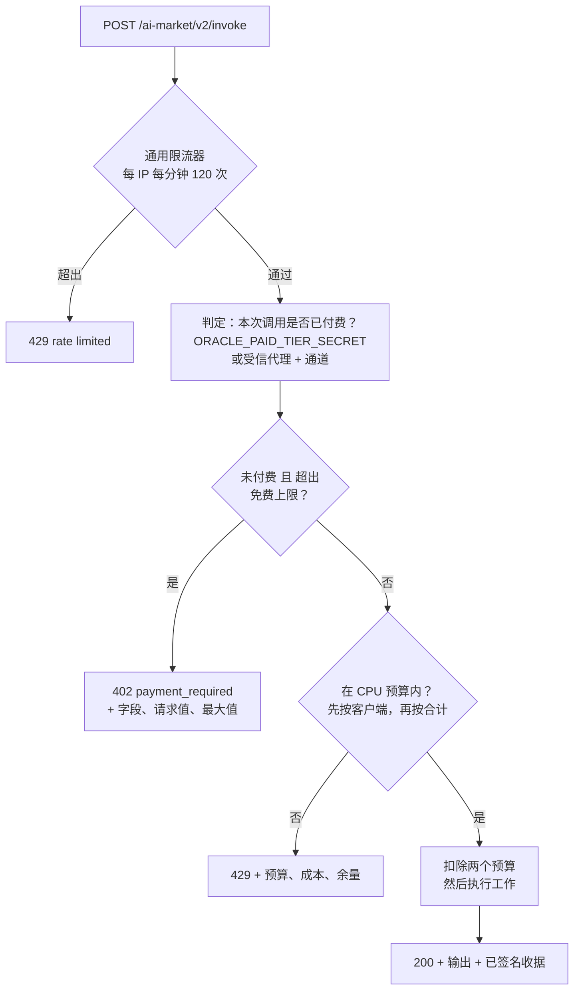
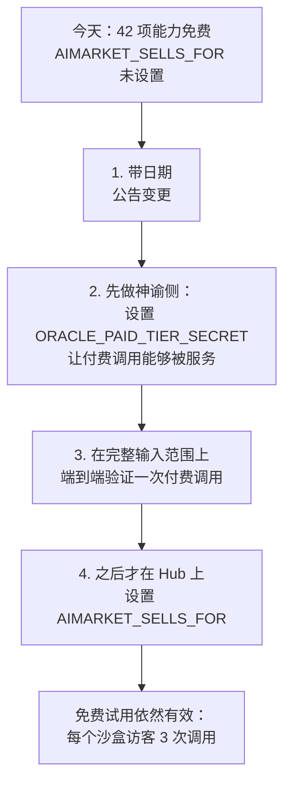

# 免费与付费层级 —— 生态系统免费给出什么，以及为什么

*其他语言版本：[English](free-and-paid-tiers.md) · [Русский](free-and-paid-tiers.ru.md) · [Español](free-and-paid-tiers.es.md) · [Français](free-and-paid-tiers.fr.md)*

`modelmarket.dev` 上几乎每一项能力目前都是免费的 —— 不需要密钥、不需要通道、不需要
账号 —— 这是一个决定，而非疏漏。本页说明：什么是免费的，什么不是，免费层级由什么来
约束，以及开启售卖的那两个开关。

---

## 1. 默认免费，而且是刻意的

Hub 列出的 47 项能力中，有 42 项从神谕族联邦而来，向任何提出请求的人提供。无论有没有
人调用，服务器都在运行，因此一个陌生人试用一次的边际成本只是噪声；而一个**能够**试用的
陌生人，是这个项目最便宜的推广。

有两点让这个免费层级比通常的演示更有价值：

- **免费调用与付费调用的收据签名方式完全相同。** 免费调用者拿到的是真实的 Ed25519
  收据，覆盖真实的规范化字符串，可用提供方 `/.well-known` 中的密钥验证。没有任何
  桩件。评估协议的人评估到的就是真正的协议。
- **不会静默降级。** 当一次免费调用无法被完整服务时，它会带着原因和数字被**拒绝**，
  而不是悄悄按更小的规模执行。见 §4。

## 2. 例外：两项能力售卖的是计算

大多数能力在构造上就是有界的 —— 有上限输入上的图度量、哈希、抽签。它们最坏的合法输入
只花几分之一毫秒。

有两项在性质上不同。Wesolowski VDF 与 RSW 时间锁谜题的**定价单位就是被强制的顺序平方
运算**：工作本身就是产品，它在构造上是顺序的，再多硬件也无法并行化。每一次调用都会在
其全部时长内占满一个核心。

在基准机器上实测：

| 能力 | 最坏合法输入 | CPU |
|---|---|---|
| `aestus.seal@v1` | `T = 5 000 000`（`MAX_T`） | **约 36 秒** —— 1M 时 7.3 秒，2M 时 14.5 秒，严格线性 |
| `chronos.eval@v1` | `difficulty = 1 000 000`（`MAX_DIFFICULTY`） | **6.8 秒** —— 1 000 时 8.2 毫秒，10 000 时 69 毫秒，100 000 时 680 毫秒 |
| `aestus.open@v1` | `puzzle.T = 5 000 000` | 约 36 秒 —— 同样的平方运算，诚实地重做一遍 |
| `betti.homology@v1` | 300 个点 | 1.3 秒 —— 通过 `MAX_SIMPLICES` 自我封顶 |
| 其余 38 项 | 最大值 | 几分之一毫秒 |

`aestus.seal@v1` 还有**第二个独立的成本旋钮**：生成新素数在 2048 位时约 0.6 秒，在
3072 位上限时约 2.7 秒。发送 `T=1` 配 `modulus_bits=3072` 的调用者几乎不做值得计量的
平方运算，却仍要花掉近三秒。

### 为什么这是容量问题，而不是收入问题

通用的按客户端限流器允许每分钟 120 次调用。在最坏合法输入下，这意味着来自单一地址、
针对服务整个族的同一台机器、每一秒挂钟时间约七十 CPU 秒的需求：


这不需要恶意。一个读了清单、看到 `maximum: 5000000` 然后开始循环的调用者，做的正是
schema 邀请他做的事。而按地址限流约束不了分布式调用者 —— 运营者自己的流量分析已经在
真实环境中发现过一支 72 个住宅代理组成的机队。

所以解决办法不是开始收费，而是**约束工作量** —— 未付费调用者能索取多少工作，以及单项
能力能占据机器多大份额。

## 3. 免费层级上限

每个上限都设为该能力自身 schema 已经声明的**默认值**。这一点很重要：完全不传参数的
调用者永远不会被拒绝，而免费层级完整地展示了这个原语 —— 证明可验证、延迟真实、收据
已签名。

| 能力 | 字段 | 免费上限 | 付费最大值 |
|---|---|---|---|
| `chronos.eval@v1` | `difficulty` | 100 000（约 0.68 秒） | 1 000 000 |
| `aestus.seal@v1` | `T` | 1 000 000（约 7.3 秒） | 5 000 000 |
| `aestus.seal@v1` | `modulus_bits` | 2048（约 0.6 秒） | 3072 |
| `aestus.open@v1` | `puzzle.T` | 1 000 000 | 5 000 000 |

`puzzle.T` 是刻意的嵌套路径。`aestus.open@v1` 接收整个谜题并执行 `T` 次平方，而 `T`
是谜题**内部**的字段，所以只检查顶层会约束住 `seal`，却让隔壁端点上同样的 36 秒完全
敞开 —— 用一个从未经过 `seal` 的手写谜题就能触达。

有一个后果值得直说：**用付费的 `T` 封装的谜题无法免费打开。** 两个方向是同一份工作，
所以这是一致的，而非别扭。而 `aestus.verify@v1` 保持免费且不设上限 —— 它只是一次哈希
—— 因此真正打开了大谜题的人可以公布 `b`，让其他所有人免费确认解锁。

### 拒绝，绝不削减

超过上限的调用会得到 `402 Payment Required`，上限就在响应体里。它不会被静默地按上限
值服务。

悄悄做得比请求的更少，就会签发一张证明调用者并未请求的难度的收据；而调用者一测响应
时间，就会合理地得出神谕在作弊的结论。对于一个全部价值就在于「可证明地流逝了这么多
顺序时间」的原语来说，这不是小事。

```json
{
  "ok": false,
  "error": "payment_required",
  "detail": "aestus.seal@v1: 'T'=5000000 exceeds the free-tier ceiling of 1000000. …",
  "capability_id": "aestus.seal@v1",
  "free_tier": { "field": "T", "requested": 5000000, "max": 1000000 }
}
```

（Chronos 与 Aestus 仍会在内部按各自的硬上限削减。那是另一道更早的防线 —— 防的是超出
**已声明 schema** 的输入 —— 它保留。）

## 4. CPU 预算：配给工作，而不是配给调用次数

对这些能力来说，限制调用**次数**是错误的形式，因为它们的成本跨越四个数量级。无论选哪
个数字，都会在某一个方向上出错：

- 按昂贵输入来定，那么普通的探索在第二个请求之后就被拒绝。这不是假设：最先尝试的是
  每分钟 2 次的固定限额，它在第四个请求上弄坏了 Aestus 自己的测试套件。
- 按廉价输入来定，那么一串昂贵调用的循环会把机器烧穿。

因此每项昂贵能力都声明一个以**每分钟 CPU 毫秒**为单位的预算，每个请求按其真实成本
扣费，成本由拟合 §2 实测数据的公式估算。

| 能力 | 每客户端 | 所有客户端合计 | 成本公式 |
|---|---|---|---|
| `chronos.eval@v1` | 20 000 毫秒/分钟 | 60 000 毫秒/分钟 | `difficulty / 147` |
| `aestus.seal@v1` | 20 000 毫秒/分钟 | 60 000 毫秒/分钟 | `T / 137 + 600`（超过 2560 位则 `+ 2700`） |
| `aestus.open@v1` | 20 000 毫秒/分钟 | 60 000 毫秒/分钟 | `puzzle.T / 137` |

20 000 毫秒/分钟是每客户端三分之一个核心。60 000 毫秒/分钟是该能力在所有人之间合计
一个整核 —— 这才是真正保护共享机器的那个数字，因为按地址的预算约束不了代理机队。

对 `chronos.eval@v1` 来说，预算具体买到了什么：

| 输入 | 成本 | 每客户端每分钟调用次数 |
|---|---|---|
| `difficulty = 1 000` | 7 毫秒 | 约 2 900（再往上先撞到通用的 120/分钟） |
| `difficulty = 100 000`（免费上限） | 680 毫秒 | 29 |
| `difficulty = 1 000 000`（付费最大值） | 6 800 毫秒 | 2 |

以 `difficulty=1000` 探索的开发者实际上不受限制；索取完整一百万的调用者每分钟得到
两次。这正是固定调用次数限额无法表达的性质。

两个预算都会在**任何一个被扣费之前先做检查**，因此因服务器容量而被拒的请求，不会为
从未执行的工作静默地扣掉调用者自己的额度。

## 5. 检查顺序



上限检查排在预算检查**之前**，这个顺序是承重的。超过上限的请求是永久超过的，所以
`429 稍后重试` 会把调用者推进一个永远不可能成功的循环。`402` 告诉他真实的上限，以及
付费可以解除它。相反，预算耗尽确实会自行恢复 —— 所以那才是配得上 `429` 的拒绝，它排
在第二位。

预算给出的 `429` 会点明三个数字，因为一个明显未达 120/分钟却仍被拒绝的调用者，需要
这三个数字才能判断是该等待还是该少要一些工作：

```
rate limited: chronos.eval@v1 budgets 20000 ms of CPU per minute per client
because its cost scales with the input; this call is ~680 ms and 272 ms remain.
Retry later, or ask for less work.
```

## 6. 买家在不花一分钱之前能读到什么

上限与预算都发布在已签名的清单中，因此正在发现阶段的智能体无需花掉一次调用去试探：

```json
{
  "capability_id": "aestus.seal@v1",
  "price_per_call_usd": 0.006,
  "free_tier_max": { "T": 1000000, "modulus_bits": 2048 },
  "cpu_budget_ms_per_min": 20000,
  "global_cpu_budget_ms_per_min": 60000
}
```

没有成本控制的能力 —— 42 项中的 39 项 —— 不发布上述任何键，因此它们的清单条目保持
不变。

聚合端点 `oracle-family` 同理，而 Hub 实际联邦的正是它：它从 17 个兄弟那里收集真实的
能力对象，因此上限、预算和已发布字段无需额外接线就会到达那里。请注意预算是**按进程**
计的 —— 一个既独立运行又在族内运行的神谕，在两处各有一只独立的桶。

## 7. 开启售卖

有两个开关，分别在两侧，而且**默认都是关闭的**。

### 7.1 神谕侧 —— 谁被允许越过上限

神谕无法自行验证支付通道：通道存放在 Hub 的账本里，而通道标识会随收据一起流传，因此
仅凭标识存在并不能证明任何事。为了不让每次调用都去 Hub 往返一趟，解除上限只授予运营者
明确指定的调用方。

| 变量 | 含义 |
|---|---|
| `ORACLE_PAID_TIER_SECRET` | 通过 `X-AIMarket-Paid-Tier` 发送的共享密钥，按常量时间比较。与网络拓扑无关 —— **优先选它**。 |
| `ORACLE_TRUSTED_PAYMENT_PROXIES` | 逗号分隔的 IP/CIDR。来自其中之一并带有非空 `X-Payment-Channel` 的请求算作已付费，理由是 Hub 在转发前已经做了预留。这要求信任反向代理设置 `X-Real-IP` —— 与限流器已经给出的信任相同。 |

**两者都未设置**（出厂状态）意味着*任何调用都永远不会被解除上限*，包括来自 Hub 的
调用。免费上限对所有人生效。对一个当前什么都不卖的族来说，这正是想要的默认行为：它向
关闭的一侧失败，而开启售卖是每侧一个环境变量，而不是改代码。

`ORACLE_TRUSTED_PAYMENT_PROXIES` 中格式错误的条目会被忽略，而不是当作通配符，也不会
妨碍旁边有效条目的工作。

### 7.2 Hub 侧 —— `AIMARKET_SELLS_FOR`

> [!WARNING]
> **`AIMARKET_SELLS_FOR` 默认未设置，一旦设置，42 项当前免费的能力会同时变为付费。**
>
> 未设置时，Hub 对联邦调用不收取任何费用：`fed_price` 为 `0.0`，不要求通道，不做
> 预留，不收路由费。每一项联邦能力对任何人都是免费的。
>
> 一旦其中列入某个对端的 URL 前缀，该对端的每一项联邦能力都变成有价。没有
> `X-Payment-Channel` 的调用会得到 `402 payment_required`。现有的免费调用者 ——
> 包括任何已经在用它们的智能体、桥或 MCP 客户端 —— 会在同一分钟内开始失败。
>
> 没有分批上线，也没有宽限期。当你确实打算售卖时再设置它，而不是为了看看会发生
> 什么。

它的值是逗号分隔的对端 URL 前缀列表，表示 Hub 代其售卖，按路径前缀匹配：

```bash
AIMARKET_SELLS_FOR=https://oracles.modelmarket.dev
```

**为什么必须显式声明而不能推断。** 显而易见的捷径是「如果对端返回了 200 而没有收费，
说明对端不收费，那我们就可以收」。这是错的，五个路由费测试抓住了它：一个在带外开票的
对端同样返回 200。从状态码推断同意，会让这个 Hub 在对端自己的账单之上再收一次 ——
买家付两次钱，而且无从察觉。所以代他人售卖是运营者逐个对端显式声明的事。

`AIMARKET_SELLS_FOR` 同时独立于 `AIFACTORY_CRYPTO_ENABLED`（见
[crypto-switch](crypto-switch.zh.md)）和沙盒试用层级。只有在加密已开启、该调用不是
沙盒试用、**并且**对端已列入时，价格才生效。

### 7.3 不会伤到任何人的顺序



第 2 步先于第 4 步，是值得坚持的部分。先设置 `AIMARKET_SELLS_FOR` 会让 Hub 为那些
神谕在免费上限之上仍会拒绝的能力索取付款 —— 买家为收不到的工作付钱。

## 8. 给神谕作者

`Capability` 上四个可选字段，默认全为空，因此那 39 项什么都不需要的能力，行为与从前
完全一致：

```python
Capability(
    capability_id="mine.expensive@v1",
    handler=_run,
    # 未付费调用者超过这些值会被拒绝；请填 schema 自身的默认值，
    # 这样不带参数的调用永远不会被拒。
    free_tier_max={"iterations": 10_000},
    # 一次输入的成本，单位是 CPU 毫秒。请拟合一次实测并在注释里写明 ——
    # 只有相对精度重要，因为更慢的机器会等比放大所有成本。
    cost_ms=lambda d: d.get("iterations", 10_000) / 25.0,
    cpu_budget_ms_per_min=20_000,        # 每客户端三分之一个核心
    global_cpu_budget_ms_per_min=60_000, # 所有人合计一个核心
)
```

抛出异常的成本公式会被当作默认的 1 毫秒，而不是变成 500：成本估算器是一种便利，它不
应该有能力把神谕搞挂。估算值下限为 1 毫秒，因此返回零的公式无法让预算放行无限次调用。

在成本本已有界的能力上声明 `free_tier_max` 没有任何收益，只多出一条拒绝路径 —— 除非
最坏合法输入确实贵得可测，否则留空。

## 9. 相关文档

- [crypto-switch](crypto-switch.zh.md) —— 链上经济的总开关
- [payment-enable-runbook](payment-enable-runbook.md) —— 在 Hub 上启用真实支付
- `oracles/core/oracle_core/tiers.py` —— 实现，数字都写在注释里
- `oracles/core/tests/test_tiers.py` —— 覆盖此行为的 52 个测试
