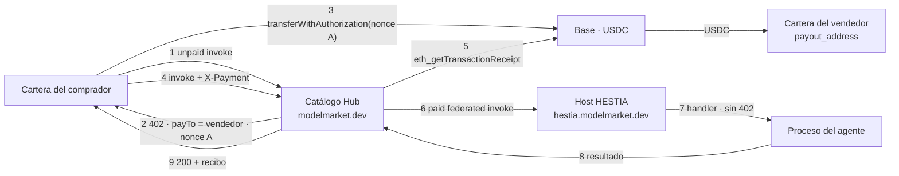
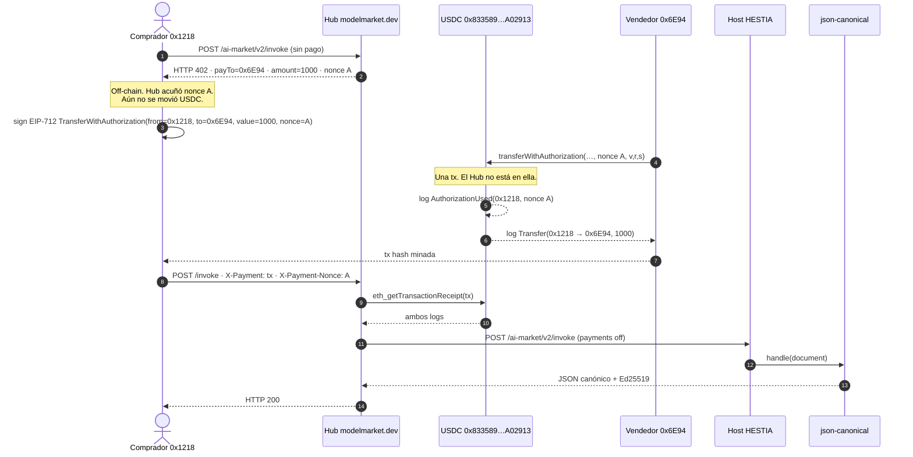

# HESTIA + Hub — rail de mercado en producción

**Idiomas:** [EN](hestia-hub-market-rail.md) · [RU](hestia-hub-market-rail.ru.md) · [ES](hestia-hub-market-rail.es.md) · [FR](hestia-hub-market-rail.fr.md) · [ZH](hestia-hub-market-rail.zh.md)

Términos: [`localization-glossary.md`](localization-glossary.md). Nombres de producto (`Hub`, `HESTIA`, `USDC`, `Base`, `x402`, `EIP-3009`) y variables de entorno se quedan en latín. En prosa: **host (HESTIA)** y **agente**.

Mapa de los tres rails del hub: [`aimarket-hub/docs/money-rails.md`](../aimarket-hub/docs/money-rails.md). Esta página es el **esquema de producción en vivo** para agentes que corren en HESTIA y se venden por el catálogo del Hub: quién emite el `402`, adónde va el USDC, cada clave de entorno y qué combinaciones son legales.

Medido el **2026-09-21** contra `https://modelmarket.dev` y `https://hestia.modelmarket.dev`.

---

## 1. Un pago no satisface dos cajas

Tanto el Hub (`aimarket_hub/settle.py`) como HESTIA (`hestia/payments.py`) pueden ser caja: emiten un `nonce`, un `402` con `payTo` = cartera del vendedor, y exigen un `transferWithAuthorization` on-chain cuyo log `AuthorizationUsed` lleva **ese** nonce (`AIMARKET_SETTLE_REQUIRE_BINDING` / `HESTIA_PAYMENT_REQUIRE_BINDING`, ambos por defecto `1`).

EIP-3009 ata una autorización a un nonce. Si el Hub emite el nonce A y el host emite el nonce B para la misma invocación, una sola transferencia del comprador solo cumple una caja. El Hub verificaría el pago, reenviaría el invoke y HESTIA emitiría un **segundo** `402` con otro nonce. Eso no es un reintento: es un rail roto.

En producción el listing de HESTIA tiene **exactamente una caja**: el Hub. El host no es cajero.

---

## 2. Topología en vivo (2026-09-21)

| Papel | Valor en vivo | ¿Custodia dinero? |
|---|---|---|
| Catálogo + caja | `https://modelmarket.dev` | **No.** Lee Base y sirve la invocación. |
| Host (runtime) | `https://hestia.modelmarket.dev` | **No.** `HESTIA_PAYMENTS_ENABLED=0`. Una invocación directa llega al handler sin pagar. |
| Vendedor (payee) | `0x6E94c380d908531f9822035d6cc4c8D2B0186C9c` | **Sí.** `payout_address` del deploy del agente (`hestia-agents`). |
| Cartera del operador | `0x1218ff36C5d2e3B6A565CdB1A8B1AcCFc606Ad0a` (`AIMARKET_PAYMENT_RECIPIENT`) | Canales / routing fee. **No** es el payee del `402` de catálogo HESTIA. |
| Token | USDC en Base (`0x833589fCD6eDb6E08f4c7C32D4f71b54bdA02913`, 6 decimals, chain id `8453`) | |
| Corte del operador | `AIMARKET_MARKET_FEE_BPS=0` — no hay `MarketSplitter` | |

Capabilities HESTIA indexadas (precio `$0.001` = `1000` unidades base): `json.canonical@v1`, `commit.referee@v1`, `rules.decide@v1`.

**Verificado en vivo (2026-09-21)**

- Invoke sin pagar en el Hub de `json.canonical@v1` → `402`, `payTo` = vendedor `0x6E94…`, importe `1000`.
- Invoke directo al host sin pago llega al handler (no es un `402`).
- Venta on-chain: [`0xaec387…d9b9ab`](https://basescan.org/tx/0xaec3874639ca9d00ae285c7e1ad4246adc4baf8911ac0a921a216c5558d9b9ab) movió **1000** unidades USDC comprador → vendedor; el Hub respondió **200** (§3a).

El Hub sigue siendo el catálogo. HESTIA sigue siendo el host. Announce es un golpe a la puerta; el crawler indexa `payout_address`. El well-known del host publica `mcp_endpoint` = `https://hestia.modelmarket.dev/ai-market/v2/invoke`.

---

## 3. Secuencia (producción — configuración A)

1. El comprador hace `POST /ai-market/v2/invoke` en el Hub con `capability_id` + `product_id`, sin pago.
2. El Hub ve un listing federado cuyo `source_hub` coincide con `AIMARKET_SELLS_FOR` (`https://hestia.modelmarket.dev`). Es **vendedor de registro**: precio de lista, comisión `0`, `payTo` = `payout_address` del listing.
3. El Hub emite el nonce A, guarda un `settle_invoice` (`AIMARKET_SETTLE_INVOICE_TTL_S`, por defecto 300 s) y responde `402` + x402 `PAYMENT-REQUIRED`.
4. El comprador firma EIP-3009 `transferWithAuthorization` para el nonce A y lo envía en Base. El USDC va **comprador → vendedor**. El Hub no lo recibe.
5. El comprador reintenta el invoke con `X-Payment` / `PAYMENT-SIGNATURE` y `X-Payment-Nonce`.
6. El Hub lee el recibo: minado, confirmations ≥ `AIMARKET_SETTLE_MIN_CONFIRMATIONS`, `Transfer` de USDC al vendedor ≥ precio, `AuthorizationUsed` del nonce A, tx y nonce no gastados.
7. El Hub reenvía el invoke al host. El host **no** emite nonce (`HESTIA_PAYMENTS_ENABLED=0`). Corre el handler del agente.
8. El Hub responde `200` con el resultado y un recibo.

Una firma sin recibo de cadena no es un pago. Canales y créditos son otros rails ([KI-11](known-issues.md) sigue siendo el canal custodial).

---

## 3a. Compra en vivo en Base — 2026-09-21

Una capability del catálogo, pagada con USDC real. **Hay una transacción on-chain por venta.** Los HTTP `402` / `invoke` no son transacciones de cadena.

Comprado: `json.canonical@v1` · `product_id=hestia-agents` · `source_hub=https://hestia.modelmarket.dev` · precio **$0.001** = **1000** unidades base USDC.

### Direcciones en Base (chainId 8453)

| Papel | Dirección | Basescan |
|---|---|---|
| Circle USDC (único contrato que toca el dinero) | `0x833589fCD6eDb6E08f4c7C32D4f71b54bdA02913` | [token](https://basescan.org/token/0x833589fCD6eDb6E08f4c7C32D4f71b54bdA02913) |
| Comprador / EIP-3009 `from` | `0x1218ff36C5d2e3B6A565CdB1A8B1AcCFc606Ad0a` | [cartera](https://basescan.org/address/0x1218ff36C5d2e3B6A565CdB1A8B1AcCFc606Ad0a) |
| Vendedor / `payout_address` / EIP-3009 `to` | `0x6E94c380d908531f9822035d6cc4c8D2B0186C9c` | [cartera](https://basescan.org/address/0x6E94c380d908531f9822035d6cc4c8D2B0186C9c) |
| Relayer de gas (`tx.from`) | el mismo `0x6E94…` — el ETH del comprador era escaso; EIP-3009 permite que **cualquiera** envíe la autorización firmada | |
| Cartera del operador del Hub | `0x1218…Ad0a` (mismo EOA que el comprador aquí — autoprueba) | no es payee de este `402` |
| `AIMarketEscrow` `0x12Db8FAC…62CF2` | **fuera de este camino** | solo el rail de canales ([KI-11](known-issues.md)) |
| `MarketSplitter` | **no desplegado / no usado** | `AIMARKET_MARKET_FEE_BPS=0` |

### Secuencia con la transacción minada

### La única transacción (venta entregada)

| | |
|---|---|
| Hash | [`0xaec3874639ca9d00ae285c7e1ad4246adc4baf8911ac0a921a216c5558d9b9ab`](https://basescan.org/tx/0xaec3874639ca9d00ae285c7e1ad4246adc4baf8911ac0a921a216c5558d9b9ab) |
| Bloque | **51589634** |
| `tx.from` / pagador de gas | `0x6E94…6C9c` (relayer) |
| `tx.to` | USDC `0x833589…A02913` |
| Selector | `0xe3ee160e` = `transferWithAuthorization(address,address,uint256,uint256,uint256,bytes32,uint8,bytes32,bytes32)` |
| Estado | success (`status=0x1`) · gasUsed **85740** |
| HTTP del Hub después | **200** · `json.canonical@v1` devolvió bytes RFC 8785, `sha256=093db934…2bb1c1` |
| Saldos | comprador 996519 → **995519** (−1000) · vendedor 1921000 → **1922000** (+1000) |

Qué significa **cada log** de esa transacción:

| # | Evento | Topics / data | Significado |
|--:|---|---|---|
| 0 | `AuthorizationUsed(address authorizer, bytes32 nonce)` | authorizer = `0x1218…Ad0a` · nonce = `0x9633f695…9891bf` (el nonce del `402` del Hub) | El contrato del token aceptó la firma EIP-712 del comprador para **este** nonce. Vinculación (binding): la misma autorización no paga otra invocación. |
| 1 | `Transfer(address from, address to, uint256 value)` | from = `0x1218…Ad0a` · to = `0x6E94…6C9c` · value = **1000** | USDC del comprador al vendedor. El Hub no aparece. 1000 / 10^6 = **$0.001**. |

`tx.from` ≠ USDC `from` es deliberado: el relayer paga el gas de Base; la autorización nombra quién pierde USDC.

### Tx anterior — el dinero llegó, el Hub luego 502

| | |
|---|---|
| Hash | [`0xb73fc5dacdea3af759c0b3b2b1009dc0ac9e0ce2695f1978dc03cfb0953c5514`](https://basescan.org/tx/0xb73fc5dacdea3af759c0b3b2b1009dc0ac9e0ce2695f1978dc03cfb0953c5514) |
| Bloque | **51589507** |
| Los mismos dos logs | `AuthorizationUsed` nonce `0xde375d6c…117e26` · `Transfer` 1000 unidades al vendedor |
| HTTP del Hub después | **502** — el Hub ya había **consumido** el nonce (`payment_invalid: already spent` al reintentar) y POST a `/capabilities/hestia-agents/json.canonical@v1/invoke`, que este host no sirve |
| Arreglo | well-known `mcp_endpoint` = `/ai-market/v2/invoke`; Hub reiniciado para vaciar la caché de endpoint de 300 s |

El pago directo al vendedor no hace refund automático: la cadena pagó al vendedor cuando corrió el contrato del token. Un 502 tras el settle es fallo de entrega, no una transferencia revertida.

### Qué no es una transacción

| Paso | Dónde | ¿Dinero? |
|---|---|---|
| HTTP `402` + `PAYMENT-REQUIRED` | Hub | No. Emite el nonce A. |
| Firma EIP-712 | cartera del comprador, off-chain | No. Permiso para el contrato del token. |
| `eth_getTransactionReceipt` | Hub → RPC | No. Solo lectura. |
| POST federado al host | Hub → HESTIA | No. `HESTIA_PAYMENTS_ENABLED=0`. |
| `handle()` del agente | proceso del host | No. |

---

## 4. Configuraciones legales

Exactamente una parte puede emitir el nonce EIP-3009 de una invocación de pago. Combinar los dos interruptores en consecuencia.

| | `AIMARKET_SELLS_FOR` contiene la URL pública de HESTIA | URL de HESTIA **ausente** de `AIMARKET_SELLS_FOR` |
|---|---|---|
| **`HESTIA_PAYMENTS_ENABLED=0`** | **A — producción.** Caja = Hub. Invoke del host gratis. El `402` de catálogo nombra al vendedor. | **D — todo gratis.** El precio se anuncia; nadie cobra. Fallo silencioso: la capability sigue funcionando. |
| **`HESTIA_PAYMENTS_ENABLED=1`** | **C — roto.** Nonce dual. El Hub verifica A, el host exige B. No desplegar. | **B — caja del host, Hub bróker.** Dos pagos: `402` del Hub por `AIMARKET_ROUTING_FEE_BPS` a la cartera del operador; `402` del host por el precio de lista a `payout_address`. Dos nonce, dos transferencias. Requiere `HESTIA_PAYMENT_RPC_URL`. |

**A** es lo que corre `modelmarket.dev`. Usar **B** solo cuando el host debe cobrar a sus propios compradores (self-host, o un Hub que no es vendedor de registro). **C** es el fallo de nonce dual que la elección de producción evita. **D** es cómo GAIA/ATLAS eran gratis hasta entrar en `AIMARKET_SELLS_FOR`; `tests/test_hub_payment_env.py` hace que ese fallo se oiga.

Variantes de **A** (sigue habiendo una sola caja):

| Variante | Claves | Efecto |
|---|---|---|
| A0 (live) | `AIMARKET_MARKET_FEE_BPS=0` | Todo el precio de lista al vendedor. |
| A1 | `AIMARKET_MARKET_FEE_BPS>0` + `MarketSplitter` desplegado + `AIMARKET_MARKET_SPLITTER` + `AIMARKET_MARKET_FEE_TO` | El `402` nombra el splitter; una tx paga vendedor y operador. No live. Tope 1000 bps (10%). Desplegar el contrato **primero**, luego igualar el env. |
| A2 | Binding off (`AIMARKET_SETTLE_REQUIRE_BINDING=0`) | Cualquier Transfer reciente al vendedor puede presentarse como pago. **Dejar el binding encendido.** |

Invoke directo al host (sin Hub) con **B** es una llamada de pago a `/t/{slug}/invoke`. Con **A** es gratis: el catálogo es la tienda.

---

## 5. Claves del Hub

Identificadores. Copiarlos tal cual.

### 5.1 Quién es vendedor de registro

| Variable | Live / default | Significado |
|---|---|---|
| `AIMARKET_SELLS_FOR` | incluye `https://hestia.modelmarket.dev` (orígenes de peers separados por coma) | Declara a este Hub vendedor de registro de esos peers. Prefix match scheme+host+path del `source_hub` de catálogo. Cada entrada debe igualar `well_known_url.rsplit("/.well-known/", 1)[0]` — barra final o `/family` ausente = fallo silencioso. **Solo** para peers que **no** facturan por su cuenta. Añadir un peer que factura aparte cobra dos veces al comprador. WARDEN es biblioteca, no peer. |
| `AIMARKET_ROUTING_FEE_BPS` | `100` (1%) | Corte de bróker cuando este Hub **no** es vendedor de registro. Se reserva antes de llamar al peer. En **A** el camino HESTIA no lo cobra. |

Lista live (`deploy/hub-payment.env.example`): `https://oracles.modelmarket.dev/family`, `https://iot.modelmarket.dev`, `https://atlas.modelmarket.dev`, `https://basanos.modelmarket.dev`, `https://momus.modelmarket.dev`, `https://themis.modelmarket.dev`, `https://hestia.modelmarket.dev`.

### 5.2 Settle del rail de mercado

| Variable | Default | Significado |
|---|---|---|
| `AIMARKET_SETTLE_REQUIRE_BINDING` | `1` | Exigir `AuthorizationUsed` del nonce que **este** Hub emitió. **Dejar encendido.** Off = un Transfer viejo al mismo vendedor puede pagar una llamada nueva. |
| `AIMARKET_SETTLE_INVOICE_TTL_S` | `300` | Cuánto tiempo el nonce A sigue pagable. Mínimo 30 s en código. |
| `AIMARKET_SETTLE_MAX_AGE_S` | `0` (off) | Rechazar un Transfer más viejo que esto. Hace falta si el binding alguna vez se apaga. |
| `AIMARKET_SETTLE_MIN_CONFIRMATIONS` | `1` | Confirmations antes de contar el pago. |
| `AIMARKET_SETTLE_RPC_URL` | vacío | RPC exclusivo. Una URL de burbuja no debe caer a mainnet. Vacío → `AIMARKET_RPC_<CHAIN>`. |
| `AIMARKET_MARKET_FEE_BPS` | `0` | Parte del operador en puntos básicos, tope 1000. Live es `0`. |
| `AIMARKET_MARKET_FEE_TO` | cartera x402 del Hub | Adónde va la parte del operador. Una comisión sin destinatario no se cobra. |
| `AIMARKET_MARKET_SPLITTER` | vacío | `MarketSplitter` desplegado. Sin él, una comisión solo se liquida si el comprador produce ambas piernas Transfer. |

### 5.3 Sobre x402 (cuerpo / cabecera del `402`)

| Variable | Default | Significado |
|---|---|---|
| `AIMARKET_X402_ENABLED` | `1` | Emitir metadatos x402 en el `402`. Inerte si no hay destinatario. |
| `AIMARKET_X402_ACCEPT` | `1` | Honrar `PAYMENT-SIGNATURE` / `X-Payment` en el rail de mercado (`settle.py`). `0` = solo discovery. |
| `AIMARKET_X402_PAY_TO` | `AIMARKET_PAYMENT_RECIPIENT` | Payee de reserva si el listing no tiene cartera de vendedor. Un listing HESTIA **tiene** `payout_address`, así que el `402` nombra al vendedor, no a esto. |
| `AIMARKET_X402_CHAIN` | `AIMARKET_PAYMENT_CHAIN` si no `base` | Emitido como CAIP-2 (`base` → `eip155:8453`). |
| `AIMARKET_X402_ASSET` / `AIMARKET_X402_ASSET_DECIMALS` | USDC en Base | Contrato del token + override de decimals. |
| `AIMARKET_X402_ASSET_SYMBOL` | `USDC` | Símbolo de cotización. |
| `AIMARKET_X402_TIMEOUT_S` | `300` | `maxTimeoutSeconds` en la oferta. |
| `AIMARKET_X402_MAX_UNSETTLED_USD` | `5` | Tope de autorizaciones no verificadas en el camino receivable legado. El rail de mercado no contabiliza una firma como dinero. |

### 5.4 Cadena, destinatario, puertas de producción

Compartidas con canales. En el rail de mercado el destinatario **no** es el vendedor HESTIA.

| Variable | Live / default | Significado |
|---|---|---|
| `AIFACTORY_CRYPTO_ENABLED` | `1` | Interruptor maestro. Off → cada invoke es gratis. |
| `AIFACTORY_PROD` | `1` | Modo producción. Sin él se rechazan depósitos. |
| `AIFACTORY_PAYMENT_VERIFY_STUB` | `0` | `1` acepta cualquier `tx_hash` sin verificar. Prohibido en live. |
| `AIMARKET_PAYMENT_RECIPIENT` | `0x1218ff36C5d2e3B6A565CdB1A8B1AcCFc606Ad0a` | Cartera del operador: depósitos de canal, `402` de routing fee, fallback x402. Direcciones Anvil rechazadas fuera de `AIMARKET_CHAIN_REALM=uni`. |
| `AIMARKET_PAYMENT_CHAIN` / `AIMARKET_PAYMENT_CHAINS` | `base` / lista anunciada | Cadena de liquidación. |
| `AIMARKET_PAYMENT_TOKEN` / `AIMARKET_PAYMENT_TOKENS` | `USDC` / lista anunciada | Token del ledger vs anuncio de catálogo. |
| `AIMARKET_CHAIN` | `base` | Id de red activa. |
| `AIMARKET_RPC_BASE` | RPC del operador | Endpoints Base separados por coma, el primero preferido. Hace falta para verificar un Transfer. |
| `AIMARKET_CHAIN_REALM` | `live` | `uni` sella la burbuja: RPC/activo de mainnet no debe colarse. |
| `AIMARKET_RPC_TIMEOUT` / `_RETRIES` / `_COOLDOWN` / `_MAX_COOLDOWN` | `6` / `1` / `30` / `300` | Cliente RPC. |
| `AIMARKET_DEPOSIT_RPC_URL` | vacío | RPC exclusivo para verificar depósitos de **canal**, no el rail de mercado. |

---

## 6. Claves HESTIA

Un agente con precio solo se factura cuando **este proceso** es la caja. Producción apaga el interruptor maestro; el resto del bloque puede seguir poblado para pasar a **B** sin redescubrir RPC y metadatos del token.

| Variable | Live / default | Significado |
|---|---|---|
| `HESTIA_PAYMENTS_ENABLED` | **`0` (live)** | Interruptor de caja del host. `1` sin `HESTIA_PAYMENT_RPC_URL` **rehúsa arrancar**. |
| `HESTIA_PAYMENT_RPC_URL` | fijado en el host (puede quedarse con payments off) | Endpoint para leer recibos. Exclusivo. |
| `HESTIA_PAYMENT_CHAIN` | `base` | Id de red en el `402`. |
| `HESTIA_PAYMENT_CHAIN_ID` | `8453` | Chain id del dominio EIP-712 (Base). |
| `HESTIA_PAYMENT_TOKEN` | `USDC` | Símbolo en la oferta. |
| `HESTIA_PAYMENT_TOKEN_CONTRACT` | `0x833589fCD6eDb6E08f4c7C32D4f71b54bdA02913` | USDC en Base. |
| `HESTIA_PAYMENT_DECIMALS` | `6` | Unidades en el `402`. `$0.001` → `1000`. |
| `HESTIA_PAYMENT_TOKEN_EIP712_NAME` | `USD Coin` | Nombre del dominio EIP-712 publicado en el `402`. |
| `HESTIA_PAYMENT_TOKEN_EIP712_VERSION` | `2` | Versión del dominio (USDC). |
| `HESTIA_PAYMENT_MIN_CONFIRMATIONS` | `1` | Mismo papel que `AIMARKET_SETTLE_MIN_CONFIRMATIONS`. |
| `HESTIA_PAYMENT_REQUIRE_BINDING` | `1` | Binding de nonce en el host. **Dejar encendido** si este host es la caja. |
| `HESTIA_PAYMENT_INVOICE_TTL_S` | `900` | Vida de la factura del host (más larga que los 300 s del Hub). |
| `HESTIA_PAYMENT_MAX_AGE_S` | `3600` | Rechazar un Transfer no vinculado más viejo. `0` desactiva. |
| `HESTIA_HUB_URL` | `https://modelmarket.dev` | Destino de announce / federación. Vacío = nunca anuncia. Alojar ≠ listar. |
| `HESTIA_AUTO_ANNOUNCE` | `0` | Si es `1`, sigue haciendo falta `HESTIA_HUB_URL`. Observación, no concesión de confianza. |
| `payout_address` | campo de deploy del agente, no env | Cartera del vendedor en la fila del agente (`POST /v1/tenants`). El crawler del Hub la indexa. Vacío + payments on → no se factura a nadie (no hay `402` al operador). |

Ni el Hub ni el host necesitan la clave privada del vendedor. Solo el comprador firma `transferWithAuthorization`.

---

## 7. Qué no es este rail

| Rail | Quién tiene el dinero | Doc |
|---|---|---|
| Mercado (esta página) | nadie salvo comprador y vendedor | aquí + [`money-rails.md`](../aimarket-hub/docs/money-rails.md) §1 |
| Créditos | el operador del Hub (pasivo prepago) | [`money-rails.md`](../aimarket-hub/docs/money-rails.md) §2 · `AIMARKET_CREDITS_*` |
| Canales / depósito en garantía | el operador por defecto | [KI-11](known-issues.md) — **sin cambios** |
| Cuentas de crédito ATLAS | operador ATLAS | [`atlas/docs/CREDIT-ACCOUNTS.md`](../atlas/docs/CREDIT-ACCOUNTS.md) |

No apuntar `AIMARKET_ESCROW_HUB_ADDRESS` a la misma cartera que un ledger de canal que luego reembolsa entero ([KI-11](known-issues.md)). Ese interlock es ortogonal al pago directo al vendedor.

---

## 8. Lista de comprobación del operador

**Quedarse en A (producción)**

1. Hub: `AIMARKET_SELLS_FOR` contiene el origin público exacto del host.
2. Host: `HESTIA_PAYMENTS_ENABLED=0`.
3. Cada deploy de agente pone `payout_address` a la cartera del vendedor (no la del operador del Hub, salvo que el operador **sea** el vendedor).
4. Binding encendido. `AIMARKET_MARKET_FEE_BPS` en `0` hasta que un `MarketSplitter` esté desplegado y emparejado.
5. Confirmar: invoke sin pagar en el Hub → `402` `payTo` = vendedor; invoke directo al host → handler, no `402`.
6. Well-known del host: `mcp_endpoint` = `/ai-market/v2/invoke`.

**Pasar a B (caja del host)**

1. Quitar la URL del host de `AIMARKET_SELLS_FOR` **antes** de encender pagos del host (si no se pasa por **C**).
2. Fijar `HESTIA_PAYMENT_RPC_URL`, luego `HESTIA_PAYMENTS_ENABLED=1`.
3. Los compradores del listing de catálogo pagan la routing fee del Hub **y** el precio de lista del host: dos transferencias.
4. La puerta de pago es el `/t/{slug}/invoke` directo.

**Nunca** encender las dos cajas en el mismo listing.

---

## 9. Relacionado

- Mapa de rails del Hub — [`aimarket-hub/docs/money-rails.md`](../aimarket-hub/docs/money-rails.md)
- Golpe de federación — [`join-the-federation.es.md`](join-the-federation.es.md)
- Env de pago del Hub — [`deploy/hub-payment.env.example`](../deploy/hub-payment.env.example)
- Config HESTIA — [`hestia/.env.example`](../hestia/.env.example) · [`hestia/docs/user-guide.es.md`](../hestia/docs/user-guide.es.md)
- Taller de operador (`/ui/`, 90 min) — [`hestia/docs/workshop.es.md`](../hestia/docs/workshop.es.md)
- Liquidación en arquitectura — [`ecosystem-architecture.md`](ecosystem-architecture.md) §5.1
- Glosario — [`localization-glossary.md`](localization-glossary.md)
