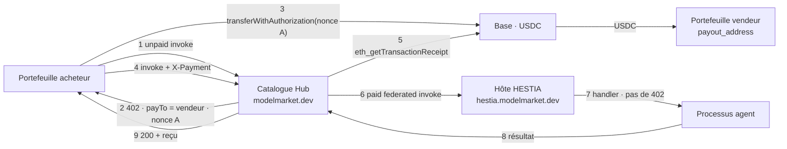
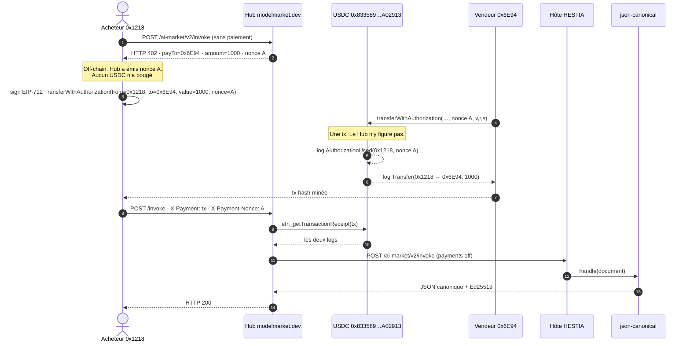

# HESTIA + Hub — rail de marché en production

**Langues :** [EN](hestia-hub-market-rail.md) · [RU](hestia-hub-market-rail.ru.md) · [ES](hestia-hub-market-rail.es.md) · [FR](hestia-hub-market-rail.fr.md) · [ZH](hestia-hub-market-rail.zh.md)

Termes : [`localization-glossary.md`](localization-glossary.md). Noms de produit (`Hub`, `HESTIA`, `USDC`, `Base`, `x402`, `EIP-3009`) et variables d’environnement restent en latin. En prose : **hôte (HESTIA)** et **agent**.

Carte des trois rails du hub : [`aimarket-hub/docs/money-rails.md`](https://github.com/alexar76/aimarket-hub/blob/main/docs/money-rails.md). Cette page est le **schéma de production live** pour les agents qui tournent sur HESTIA et se vendent via le catalogue du Hub : qui émet le `402`, où va l’USDC, chaque clé d’environnement et quelles combinaisons sont licites.

Mesuré le **2026-09-21** sur `https://modelmarket.dev` et `https://hestia.modelmarket.dev`.

---

## 1. Un paiement ne satisfait pas deux caisses

Le Hub (`aimarket_hub/settle.py`) et HESTIA (`hestia/payments.py`) peuvent chacun être caisse : ils émettent un `nonce`, un `402` avec `payTo` = portefeuille du vendeur, puis exigent un `transferWithAuthorization` on-chain dont le log `AuthorizationUsed` porte **ce** nonce (`AIMARKET_SETTLE_REQUIRE_BINDING` / `HESTIA_PAYMENT_REQUIRE_BINDING`, défaut `1` des deux côtés).

EIP-3009 lie une autorisation à un nonce. Si le Hub émet le nonce A et l’hôte le nonce B pour la même invocation, un seul virement de l’acheteur ne satisfait qu’une caisse. Le Hub vérifierait le paiement, transmettrait l’invoke, et HESTIA émettrait un **second** `402` sur un autre nonce. Ce n’est pas une nouvelle tentative : c’est un rail cassé.

En production, le listing HESTIA a **exactement une caisse** : le Hub. L’hôte n’est pas caissier.

---

## 2. Topologie live (2026-09-21)

| Rôle | Valeur live | Custodie ? |
|---|---|---|
| Catalogue + caisse | `https://modelmarket.dev` | **Non.** Lit Base, sert l’invocation. |
| Hôte (runtime) | `https://hestia.modelmarket.dev` | **Non.** `HESTIA_PAYMENTS_ENABLED=0`. Un invoke direct atteint le handler sans paiement. |
| Vendeur (payee) | `0x6E94c380d908531f9822035d6cc4c8D2B0186C9c` | **Oui.** `payout_address` du déploiement de l’agent (`hestia-agents`). |
| Portefeuille opérateur | `0x1218ff36C5d2e3B6A565CdB1A8B1AcCFc606Ad0a` (`AIMARKET_PAYMENT_RECIPIENT`) | Canaux / routing fee. **Pas** le payee du `402` catalogue HESTIA. |
| Jeton (token) | USDC sur Base (`0x833589fCD6eDb6E08f4c7C32D4f71b54bdA02913`, 6 decimals, chain id `8453`) | |
| Part opérateur | `AIMARKET_MARKET_FEE_BPS=0` — pas de `MarketSplitter` | |

Capabilities HESTIA indexées (prix `$0.001` = `1000` unités de base) : `json.canonical@v1`, `commit.referee@v1`, `rules.decide@v1`.

**Vérifié en live (2026-09-21)**

- Invoke Hub non payé de `json.canonical@v1` → `402`, `payTo` = vendeur `0x6E94…`, montant `1000`.
- Invoke direct à l’hôte sans paiement atteint le handler (pas un `402`).
- Vente on-chain : [`0xaec387…d9b9ab`](https://basescan.org/tx/0xaec3874639ca9d00ae285c7e1ad4246adc4baf8911ac0a921a216c5558d9b9ab) a déplacé **1000** unités USDC acheteur → vendeur ; le Hub a ensuite répondu **200** (§3a).

Le Hub reste le catalogue. HESTIA reste l’hôte. Announce est un coup à la porte ; le crawler indexe `payout_address`. Le well-known de l’hôte publie `mcp_endpoint` = `https://hestia.modelmarket.dev/ai-market/v2/invoke`.

---

## 3. Séquence (production — configuration A)

1. L’acheteur `POST /ai-market/v2/invoke` sur le Hub avec `capability_id` + `product_id`, sans paiement.
2. Le Hub voit un listing fédéré dont `source_hub` correspond à `AIMARKET_SELLS_FOR` (`https://hestia.modelmarket.dev`). Il est **vendeur enregistré** : prix de liste, frais `0`, `payTo` = `payout_address` du listing.
3. Le Hub émet le nonce A, stocke un `settle_invoice` (`AIMARKET_SETTLE_INVOICE_TTL_S`, défaut 300 s), répond `402` + x402 `PAYMENT-REQUIRED`.
4. L’acheteur signe EIP-3009 `transferWithAuthorization` pour le nonce A et le soumet sur Base. L’USDC va **acheteur → vendeur**. Le Hub ne le reçoit pas.
5. L’acheteur réessaie l’invoke avec `X-Payment` / `PAYMENT-SIGNATURE` et `X-Payment-Nonce`.
6. Le Hub lit le reçu : miné, confirmations ≥ `AIMARKET_SETTLE_MIN_CONFIRMATIONS`, `Transfer` USDC vers le vendeur ≥ prix, `AuthorizationUsed` du nonce A, tx et nonce non encore dépensés.
7. Le Hub transmet l’invoke à l’hôte. L’hôte **n’émet pas** de nonce (`HESTIA_PAYMENTS_ENABLED=0`). Le handler de l’agent s’exécute.
8. Le Hub répond `200` avec le résultat et un reçu.

Une signature sans reçu de chaîne n’est pas un paiement. Canaux et crédits sont d’autres rails ([KI-11](known-issues.md) reste le canal custodial).

---

## 3a. Achat live sur Base — 2026-09-21

Une capability du catalogue, payée en USDC réel. **Une transaction on-chain par vente.** Les HTTP `402` / `invoke` ne sont pas des transactions de chaîne.

Acheté : `json.canonical@v1` · `product_id=hestia-agents` · `source_hub=https://hestia.modelmarket.dev` · prix **$0.001** = **1000** unités de base USDC.

### Adresses sur Base (chainId 8453)

| Rôle | Adresse | Basescan |
|---|---|---|
| Circle USDC (seul contrat que l’argent touche) | `0x833589fCD6eDb6E08f4c7C32D4f71b54bdA02913` | [jeton](https://basescan.org/token/0x833589fCD6eDb6E08f4c7C32D4f71b54bdA02913) |
| Acheteur / EIP-3009 `from` | `0x1218ff36C5d2e3B6A565CdB1A8B1AcCFc606Ad0a` | [portefeuille](https://basescan.org/address/0x1218ff36C5d2e3B6A565CdB1A8B1AcCFc606Ad0a) |
| Vendeur / `payout_address` / EIP-3009 `to` | `0x6E94c380d908531f9822035d6cc4c8D2B0186C9c` | [portefeuille](https://basescan.org/address/0x6E94c380d908531f9822035d6cc4c8D2B0186C9c) |
| Relayer de gaz (`tx.from`) | le même `0x6E94…` — ETH acheteur trop juste ; EIP-3009 autorise **n’importe qui** à soumettre l’autorisation signée | |
| Portefeuille opérateur Hub | `0x1218…Ad0a` (même EOA que l’acheteur ici — autotest) | pas payee de ce `402` |
| `AIMarketEscrow` `0x12Db8FAC…62CF2` | **hors de ce chemin** | rail canaux seulement ([KI-11](known-issues.md)) |
| `MarketSplitter` | **non déployé / non utilisé** | `AIMARKET_MARKET_FEE_BPS=0` |

### Séquence avec la transaction minée

### L’unique transaction (vente livrée)

| | |
|---|---|
| Hash | [`0xaec3874639ca9d00ae285c7e1ad4246adc4baf8911ac0a921a216c5558d9b9ab`](https://basescan.org/tx/0xaec3874639ca9d00ae285c7e1ad4246adc4baf8911ac0a921a216c5558d9b9ab) |
| Bloc | **51589634** |
| `tx.from` / payeur de gaz | `0x6E94…6C9c` (relayer) |
| `tx.to` | USDC `0x833589…A02913` |
| Sélecteur | `0xe3ee160e` = `transferWithAuthorization(address,address,uint256,uint256,uint256,bytes32,uint8,bytes32,bytes32)` |
| Statut | success (`status=0x1`) · gasUsed **85740** |
| HTTP Hub ensuite | **200** · `json.canonical@v1` a renvoyé des octets RFC 8785, `sha256=093db934…2bb1c1` |
| Soldes | acheteur 996519 → **995519** (−1000) · vendeur 1921000 → **1922000** (+1000) |

Sens de **chaque log** de cette transaction :

| # | Événement | Topics / data | Sens |
|--:|---|---|---|
| 0 | `AuthorizationUsed(address authorizer, bytes32 nonce)` | authorizer = `0x1218…Ad0a` · nonce = `0x9633f695…9891bf` (nonce du `402` Hub) | Le contrat du jeton a accepté la signature EIP-712 de l’acheteur pour **ce** nonce. Liaison (binding) : la même autorisation ne paie pas un autre appel. |
| 1 | `Transfer(address from, address to, uint256 value)` | from = `0x1218…Ad0a` · to = `0x6E94…6C9c` · value = **1000** | USDC acheteur → vendeur. Le Hub n’apparaît pas. 1000 / 10^6 = **$0.001**. |

`tx.from` ≠ USDC `from` est voulu : le relayer paie le gaz Base ; l’autorisation nomme qui perd l’USDC.

### Tx précédente — l’argent est arrivé, le Hub a ensuite 502

| | |
|---|---|
| Hash | [`0xb73fc5dacdea3af759c0b3b2b1009dc0ac9e0ce2695f1978dc03cfb0953c5514`](https://basescan.org/tx/0xb73fc5dacdea3af759c0b3b2b1009dc0ac9e0ce2695f1978dc03cfb0953c5514) |
| Bloc | **51589507** |
| Les mêmes deux logs | `AuthorizationUsed` nonce `0xde375d6c…117e26` · `Transfer` 1000 unités vers le vendeur |
| HTTP Hub ensuite | **502** — le Hub avait déjà **consommé** le nonce (`payment_invalid: already spent` au retry) puis POST `/capabilities/hestia-agents/json.canonical@v1/invoke`, chemin que cet hôte ne sert pas |
| Correctif | well-known `mcp_endpoint` = `/ai-market/v2/invoke` ; Hub redémarré pour vider le cache d’endpoint de 300 s |

Le paiement direct au vendeur ne fait pas de refund automatique : la chaîne a payé le vendeur à l’exécution du contrat du jeton. Un 502 après settle est un échec de livraison, pas un virement inversé.

### Ce qui n’est pas une transaction

| Étape | Où | Argent ? |
|---|---|---|
| HTTP `402` + `PAYMENT-REQUIRED` | Hub | Non. Émet le nonce A. |
| Signature EIP-712 | portefeuille acheteur, off-chain | Non. Permission pour le contrat du jeton. |
| `eth_getTransactionReceipt` | Hub → RPC | Non. Lecture seule. |
| POST fédéré vers l’hôte | Hub → HESTIA | Non. `HESTIA_PAYMENTS_ENABLED=0`. |
| `handle()` de l’agent | processus de l’hôte | Non. |

---

## 4. Configurations licites

Exactement une partie peut émettre le nonce EIP-3009 d’un appel payant. Combiner les deux interrupteurs en conséquence.

| | `AIMARKET_SELLS_FOR` contient l’URL publique HESTIA | URL HESTIA **absente** de `AIMARKET_SELLS_FOR` |
|---|---|---|
| **`HESTIA_PAYMENTS_ENABLED=0`** | **A — production.** Caisse = Hub. Invoke hôte gratuit. Le `402` catalogue nomme le vendeur. | **D — tout gratuit.** Le prix est affiché ; personne n’encaisse. Rateau silencieux : la capability continue de marcher. |
| **`HESTIA_PAYMENTS_ENABLED=1`** | **C — cassé.** Nonce double. Le Hub vérifie A, l’hôte exige B. Ne pas déployer. | **B — caisse hôte, Hub courtier.** Deux paiements : `402` Hub pour `AIMARKET_ROUTING_FEE_BPS` vers le portefeuille opérateur ; `402` hôte pour le prix de liste vers `payout_address`. Deux nonce, deux virements. Exige `HESTIA_PAYMENT_RPC_URL`. |

**A** est ce que tourne `modelmarket.dev`. **B** seulement si l’hôte doit encaisser ses propres acheteurs (self-host, ou Hub qui n’est pas vendeur enregistré). **C** est l’échec à nonce double que le choix de production évite. **D** est comment GAIA/ATLAS étaient gratuits jusqu’à `AIMARKET_SELLS_FOR` ; `tests/test_hub_payment_env.py` rend ce rateau bruyant.

Variantes de **A** (toujours une seule caisse) :

| Variante | Clés | Effet |
|---|---|---|
| A0 (live) | `AIMARKET_MARKET_FEE_BPS=0` | Tout le prix de liste au vendeur. |
| A1 | `AIMARKET_MARKET_FEE_BPS>0` + `MarketSplitter` déployé + `AIMARKET_MARKET_SPLITTER` + `AIMARKET_MARKET_FEE_TO` | Le `402` nomme le splitter ; une tx paie vendeur et opérateur. Pas live. Plafond 1000 bps (10 %). Déployer le contrat **d’abord**, puis aligner l’env. |
| A2 | Binding off (`AIMARKET_SETTLE_REQUIRE_BINDING=0`) | Tout Transfer récent vers le vendeur peut se présenter comme paiement. **Laisser le binding allumé.** |

Invoke direct à l’hôte (sans Hub) en **B** est un appel payant vers `/t/{slug}/invoke`. En **A** il est gratuit : le catalogue est la boutique.

---

## 5. Clés Hub

Identifiants. Les copier tels quels.

### 5.1 Qui est vendeur enregistré

| Variable | Live / default | Sens |
|---|---|---|
| `AIMARKET_SELLS_FOR` | inclut `https://hestia.modelmarket.dev` (origines peers séparées par virgule) | Déclare ce Hub vendeur enregistré de ces peers. Prefix match scheme+host+path du `source_hub` catalogue. Chaque entrée = `well_known_url.rsplit("/.well-known/", 1)[0]` — slash final ou `/family` manquant = rateau silencieux. **Uniquement** pour les peers qui **ne** facturent **pas** eux-mêmes. Ajouter un peer qui facture hors bande = double facture. WARDEN est une bibliothèque, pas un peer. |
| `AIMARKET_ROUTING_FEE_BPS` | `100` (1 %) | Coupe courtier quand ce Hub **n’est pas** vendeur enregistré. Réservée avant l’appel au peer. Sur **A** le chemin HESTIA ne la prend pas. |

Liste live (`deploy/hub-payment.env.example`) : `https://oracles.modelmarket.dev/family`, `https://iot.modelmarket.dev`, `https://atlas.modelmarket.dev`, `https://basanos.modelmarket.dev`, `https://momus.modelmarket.dev`, `https://themis.modelmarket.dev`, `https://hestia.modelmarket.dev`.

### 5.2 Settle du rail de marché

| Variable | Default | Sens |
|---|---|---|
| `AIMARKET_SETTLE_REQUIRE_BINDING` | `1` | Exiger `AuthorizationUsed` du nonce que **ce** Hub a émis. **Laisser allumé.** Off = un vieux Transfer vers le même vendeur peut payer un nouvel appel. |
| `AIMARKET_SETTLE_INVOICE_TTL_S` | `300` | Durée pendant laquelle le nonce A reste payable. Minimum 30 s dans le code. |
| `AIMARKET_SETTLE_MAX_AGE_S` | `0` (off) | Rejeter un Transfer plus vieux. Nécessaire si le binding est un jour éteint. |
| `AIMARKET_SETTLE_MIN_CONFIRMATIONS` | `1` | Confirmations avant que le paiement compte. |
| `AIMARKET_SETTLE_RPC_URL` | vide | RPC exclusif. Une URL bulle ne doit pas retomber sur le mainnet. Vide → `AIMARKET_RPC_<CHAIN>`. |
| `AIMARKET_MARKET_FEE_BPS` | `0` | Part opérateur en points de base, plafond 1000. Live = `0`. |
| `AIMARKET_MARKET_FEE_TO` | portefeuille x402 du Hub | Où va la part opérateur. Des frais sans destinataire ne sont pas prélevés. |
| `AIMARKET_MARKET_SPLITTER` | vide | `MarketSplitter` déployé. Sans lui, des frais ne se règlent que si l’acheteur produit les deux jambes Transfer. |

### 5.3 Enveloppe x402 (corps / en-tête du `402`)

| Variable | Default | Sens |
|---|---|---|
| `AIMARKET_X402_ENABLED` | `1` | Émettre les métadonnées x402 sur le `402`. Inerte sans destinataire. |
| `AIMARKET_X402_ACCEPT` | `1` | Honorer `PAYMENT-SIGNATURE` / `X-Payment` sur le rail de marché (`settle.py`). `0` = discovery seulement. |
| `AIMARKET_X402_PAY_TO` | `AIMARKET_PAYMENT_RECIPIENT` | Payee de repli si le listing n’a pas de portefeuille vendeur. Un listing HESTIA **a** `payout_address`, donc le `402` nomme le vendeur, pas ceci. |
| `AIMARKET_X402_CHAIN` | `AIMARKET_PAYMENT_CHAIN` sinon `base` | Émis en CAIP-2 (`base` → `eip155:8453`). |
| `AIMARKET_X402_ASSET` / `AIMARKET_X402_ASSET_DECIMALS` | USDC sur Base | Contrat du jeton + surcharge de decimals. |
| `AIMARKET_X402_ASSET_SYMBOL` | `USDC` | Symbole de cotation. |
| `AIMARKET_X402_TIMEOUT_S` | `300` | `maxTimeoutSeconds` dans l’offre. |
| `AIMARKET_X402_MAX_UNSETTLED_USD` | `5` | Plafond d’autorisations non vérifiées sur le chemin receivable héritage. Le rail de marché ne comptabilise pas une signature comme de l’argent. |

### 5.4 Chaîne, destinataire, portes de production

Partagés avec les canaux. Sur le rail de marché le destinataire **n’est pas** le vendeur HESTIA.

| Variable | Live / default | Sens |
|---|---|---|
| `AIFACTORY_CRYPTO_ENABLED` | `1` | Interrupteur maître. Off → chaque invoke est gratuit. |
| `AIFACTORY_PROD` | `1` | Mode production. Sans lui, les dépôts sont refusés. |
| `AIFACTORY_PAYMENT_VERIFY_STUB` | `0` | `1` accepte n’importe quel `tx_hash` non vérifié. Interdit en live. |
| `AIMARKET_PAYMENT_RECIPIENT` | `0x1218ff36C5d2e3B6A565CdB1A8B1AcCFc606Ad0a` | Portefeuille opérateur : dépôts canaux, `402` routing fee, repli x402. Adresses Anvil refusées hors `AIMARKET_CHAIN_REALM=uni`. |
| `AIMARKET_PAYMENT_CHAIN` / `AIMARKET_PAYMENT_CHAINS` | `base` / liste annoncée | Chaîne de règlement. |
| `AIMARKET_PAYMENT_TOKEN` / `AIMARKET_PAYMENT_TOKENS` | `USDC` / liste annoncée | Jeton du ledger vs publicité catalogue. |
| `AIMARKET_CHAIN` | `base` | Id réseau actif. |
| `AIMARKET_RPC_BASE` | RPC opérateur | Endpoints Base séparés par virgule, le premier préféré. Requis pour vérifier un Transfer. |
| `AIMARKET_CHAIN_REALM` | `live` | `uni` scelle la bulle — RPC/actif mainnet ne doit pas fuir. |
| `AIMARKET_RPC_TIMEOUT` / `_RETRIES` / `_COOLDOWN` / `_MAX_COOLDOWN` | `6` / `1` / `30` / `300` | Client RPC. |
| `AIMARKET_DEPOSIT_RPC_URL` | vide | RPC exclusif pour vérifier un dépôt **canal**, pas le rail de marché. |

---

## 6. Clés HESTIA

Un agent tarifé n’est facturé que lorsque **ce processus** est la caisse. En production l’interrupteur maître est off ; le reste du bloc peut rester peuplé pour basculer vers **B** sans redécouvrir RPC et métadonnées du jeton.

| Variable | Live / default | Sens |
|---|---|---|
| `HESTIA_PAYMENTS_ENABLED` | **`0` (live)** | Interrupteur caisse de l’hôte. `1` sans `HESTIA_PAYMENT_RPC_URL` **refuse de démarrer**. |
| `HESTIA_PAYMENT_RPC_URL` | fixé sur l’hôte (peut rester avec payments off) | Endpoint pour lire les reçus. Exclusif. |
| `HESTIA_PAYMENT_CHAIN` | `base` | Id réseau dans le `402`. |
| `HESTIA_PAYMENT_CHAIN_ID` | `8453` | Chain id du domaine EIP-712 (Base). |
| `HESTIA_PAYMENT_TOKEN` | `USDC` | Symbole dans l’offre. |
| `HESTIA_PAYMENT_TOKEN_CONTRACT` | `0x833589fCD6eDb6E08f4c7C32D4f71b54bdA02913` | USDC sur Base. |
| `HESTIA_PAYMENT_DECIMALS` | `6` | Unités dans le `402`. `$0.001` → `1000`. |
| `HESTIA_PAYMENT_TOKEN_EIP712_NAME` | `USD Coin` | Nom du domaine EIP-712 publié dans le `402`. |
| `HESTIA_PAYMENT_TOKEN_EIP712_VERSION` | `2` | Version du domaine (USDC). |
| `HESTIA_PAYMENT_MIN_CONFIRMATIONS` | `1` | Même rôle que `AIMARKET_SETTLE_MIN_CONFIRMATIONS`. |
| `HESTIA_PAYMENT_REQUIRE_BINDING` | `1` | Binding de nonce côté hôte. **Laisser allumé** si cet hôte est la caisse. |
| `HESTIA_PAYMENT_INVOICE_TTL_S` | `900` | Durée de facture hôte (plus longue que les 300 s du Hub). |
| `HESTIA_PAYMENT_MAX_AGE_S` | `3600` | Rejeter un Transfer non lié plus vieux. `0` désactive. |
| `HESTIA_HUB_URL` | `https://modelmarket.dev` | Cible d’announce / fédération. Vide = n’annonce jamais. Héberger ≠ lister. |
| `HESTIA_AUTO_ANNOUNCE` | `0` | Même à `1`, il faut `HESTIA_HUB_URL`. Observation, pas octroi de confiance. |
| `payout_address` | champ de déploiement de l’agent, pas env | Portefeuille vendeur sur la ligne agent (`POST /v1/tenants`). Le crawler Hub l’indexe. Vide + payments on → on ne facture personne (pas de `402` vers l’opérateur). |

Ni le Hub ni l’hôte n’ont besoin de la clé privée du vendeur. Seul l’acheteur signe `transferWithAuthorization`.

---

## 7. Ce que ce rail n’est pas

| Rail | Qui détient l’argent | Doc |
|---|---|---|
| Marché (cette page) | personne d’autre que l’acheteur et le vendeur | ici + [`money-rails.md`](https://github.com/alexar76/aimarket-hub/blob/main/docs/money-rails.md) §1 |
| Crédits | l’opérateur Hub (passif prépayé) | [`money-rails.md`](https://github.com/alexar76/aimarket-hub/blob/main/docs/money-rails.md) §2 · `AIMARKET_CREDITS_*` |
| Canaux / séquestre | l’opérateur par défaut | [KI-11](known-issues.md) — **inchangé** |
| Comptes crédit ATLAS | opérateur ATLAS | [`atlas/docs/CREDIT-ACCOUNTS.md`](https://github.com/alexar76/atlas/blob/main/docs/CREDIT-ACCOUNTS.md) |

Ne pas pointer `AIMARKET_ESCROW_HUB_ADDRESS` vers le même portefeuille qu’un ledger canal qui rembourse ensuite en totalité ([KI-11](known-issues.md)). Cet interlock est orthogonal au paiement direct au vendeur.

---

## 8. Liste de contrôle opérateur

**Rester sur A (production)**

1. Hub : `AIMARKET_SELLS_FOR` contient l’origine publique exacte de l’hôte.
2. Hôte : `HESTIA_PAYMENTS_ENABLED=0`.
3. Chaque déploiement d’agent met `payout_address` sur le portefeuille du vendeur (pas celui de l’opérateur Hub, sauf si l’opérateur **est** le vendeur).
4. Binding allumé. `AIMARKET_MARKET_FEE_BPS` à `0` jusqu’à un `MarketSplitter` déployé et aligné.
5. Confirmer : invoke Hub non payé → `402` `payTo` = vendeur ; invoke direct hôte → handler, pas `402`.
6. Well-known de l’hôte : `mcp_endpoint` = `/ai-market/v2/invoke`.

**Passer à B (caisse hôte)**

1. Retirer l’URL de l’hôte de `AIMARKET_SELLS_FOR` **avant** d’allumer les paiements hôte (sinon on traverse **C**).
2. Fixer `HESTIA_PAYMENT_RPC_URL`, puis `HESTIA_PAYMENTS_ENABLED=1`.
3. Les acheteurs du listing catalogue paient la routing fee Hub **et** le prix de liste hôte — deux virements.
4. La porte payante est le `/t/{slug}/invoke` direct.

**Jamais** allumer les deux caisses sur le même listing.

---

## 9. Lié

- Carte des rails Hub — [`aimarket-hub/docs/money-rails.md`](https://github.com/alexar76/aimarket-hub/blob/main/docs/money-rails.md)
- Coup de fédération — [`join-the-federation.fr.md`](join-the-federation.fr.md)
- Env de paiement Hub — [`deploy/hub-payment.env.example`](../deploy/hub-payment.env.example)
- Config HESTIA — [`hestia/.env.example`](https://github.com/alexar76/hestia/blob/main/.env.example) · [`hestia/docs/user-guide.fr.md`](https://github.com/alexar76/hestia/blob/main/docs/user-guide.fr.md)
- Atelier opérateur (`/ui/`, 90 min) — [`hestia/docs/workshop.fr.md`](https://github.com/alexar76/hestia/blob/main/docs/workshop.fr.md)
- Règlement dans l’architecture — [`ecosystem-architecture.md`](ecosystem-architecture.md) §5.1
- Glossaire — [`localization-glossary.md`](localization-glossary.md)
