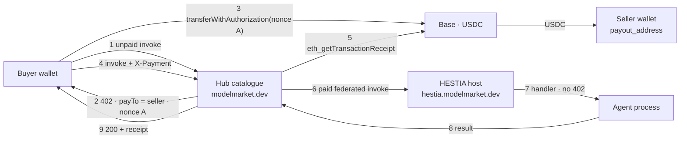
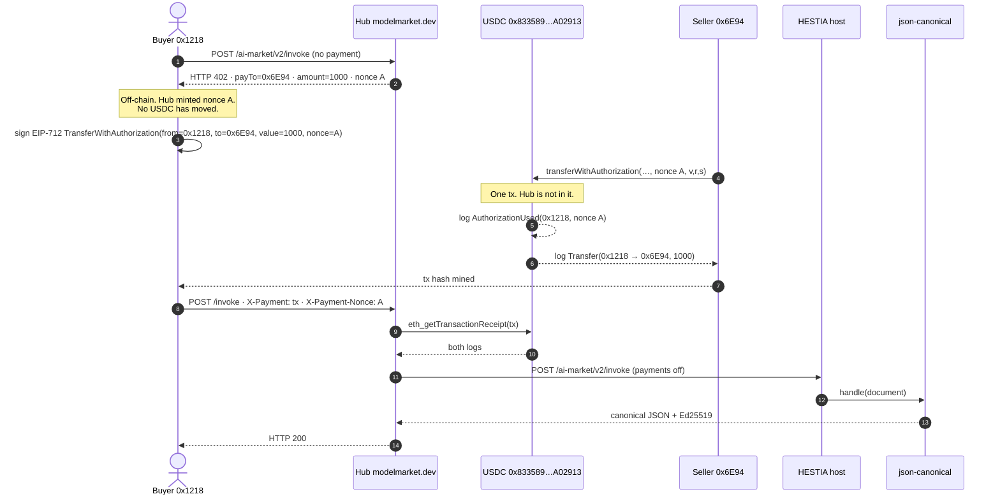

# HESTIA + Hub — production market rail

**Languages:** [EN](hestia-hub-market-rail.md) · [RU](hestia-hub-market-rail.ru.md) · [ES](hestia-hub-market-rail.es.md) · [FR](hestia-hub-market-rail.fr.md) · [ZH](hestia-hub-market-rail.zh.md)

Terms follow [`localization-glossary.md`](localization-glossary.md). Product names (`Hub`, `HESTIA`, `USDC`, `Base`, `x402`, `EIP-3009`) and env vars stay Latin. The host metaphor is retired: this page says **host (HESTIA)** and **agent**, never hearth / tenant in prose.

The protocol map of the three Hub rails is [`aimarket-hub/docs/money-rails.md`](https://github.com/alexar76/aimarket-hub/blob/main/docs/money-rails.md). This page is the **live production scheme** for agents that run on HESTIA and are sold through the Hub catalogue — who mints the `402`, where USDC goes, every env key, and which combinations are legal.

Measured on **2026-09-21** against `https://modelmarket.dev` and `https://hestia.modelmarket.dev`.

---

## 1. One payment cannot satisfy two tills

Both Hub (`aimarket_hub/settle.py`) and HESTIA (`hestia/payments.py`) can be a till: mint a `nonce`, emit `402` with `payTo` = the seller wallet, then require an on-chain `transferWithAuthorization` whose `AuthorizationUsed` log carries **that** nonce (`AIMARKET_SETTLE_REQUIRE_BINDING` / `HESTIA_PAYMENT_REQUIRE_BINDING`, both default `1`).

EIP-3009 binds one authorization to one nonce. If Hub mints nonce A and the host mints nonce B for the same call, the buyer's single transfer can satisfy only one of them. Hub would verify the transfer, forward the invoke, and HESTIA would emit a **second** `402` on a different nonce. That is not a retry — it is a broken rail.

Production therefore has **exactly one till** for a HESTIA listing: the Hub. The host is not a cashier.

---

## 2. Live topology (2026-09-21)

| Role | Live value | Holds money? |
|---|---|---|
| Catalogue + till | `https://modelmarket.dev` | **No.** Reads Base, serves the call. |
| Host (runtime) | `https://hestia.modelmarket.dev` | **No.** `HESTIA_PAYMENTS_ENABLED=0`. A direct invoke reaches the handler unpaid. |
| Seller (payee) | `0x6E94c380d908531f9822035d6cc4c8D2B0186C9c` | **Yes.** Listing `payout_address` from the agent deploy (`hestia-agents`). |
| Operator wallet | `0x1218ff36C5d2e3B6A565CdB1A8B1AcCFc606Ad0a` (`AIMARKET_PAYMENT_RECIPIENT`) | Channels / routing-fee payee. **Not** the payee on a HESTIA catalogue `402`. |
| Token | USDC on Base (`0x833589fCD6eDb6E08f4c7C32D4f71b54bdA02913`, 6 decimals, chain id `8453`) | |
| Operator cut | `AIMARKET_MARKET_FEE_BPS=0` — no `MarketSplitter` | |

Indexed HESTIA capabilities (price `$0.001` = `1000` base units): `json.canonical@v1`, `commit.referee@v1`, `rules.decide@v1`.

**Verified live (2026-09-21)**

- Unpaid Hub invoke of `json.canonical@v1` → `402`, `payTo` = seller `0x6E94…`, amount `1000`.
- Direct host invoke without payment reaches the handler (not a `402`).
- On-chain sale: [`0xaec387…d9b9ab`](https://basescan.org/tx/0xaec3874639ca9d00ae285c7e1ad4246adc4baf8911ac0a921a216c5558d9b9ab) moved **1000** USDC units buyer → seller; Hub then returned **200** (§3a).

Hub stays the catalogue. HESTIA stays the host. Announce is a knock; crawl indexes `payout_address` from the agent's well-known / tools.

---

## 3. Sequence (production — configuration A)

1. Buyer `POST /ai-market/v2/invoke` on the Hub with `capability_id` + `product_id`, no payment.
2. Hub sees a federated listing whose `source_hub` matches `AIMARKET_SELLS_FOR` (`https://hestia.modelmarket.dev`). It is **seller of record**: list price, fee `0`, `payTo` = listing `payout_address`.
3. Hub mints nonce A, stores a `settle_invoice` (`AIMARKET_SETTLE_INVOICE_TTL_S`, default 300 s), returns `402` + x402 `PAYMENT-REQUIRED`.
4. Buyer signs EIP-3009 `transferWithAuthorization` for nonce A and submits it on Base. USDC moves **buyer → seller** in that transaction. Hub never receives it.
5. Buyer retries the invoke with `X-Payment` / `PAYMENT-SIGNATURE` and `X-Payment-Nonce`.
6. Hub reads the receipt: mined, confirmations ≥ `AIMARKET_SETTLE_MIN_CONFIRMATIONS`, `Transfer` of USDC to the seller ≥ price, `AuthorizationUsed` for nonce A, tx and nonce not already spent.
7. Hub forwards the invoke to the host. The host does **not** mint a nonce (`HESTIA_PAYMENTS_ENABLED=0`). The agent handler runs.
8. Hub returns `200` with the result and a receipt.

A signature with no chain receipt is not a payment. Channels and credits are other rails ([KI-11](known-issues.md) stays the custodial channel).

---

## 3a. Live purchase on Base — 2026-09-21

One capability, bought through the Hub catalogue, paid in real USDC. **There is one on-chain transaction per sale.** HTTP `402` / `invoke` are not chain transactions.

Bought: `json.canonical@v1` · `product_id=hestia-agents` · `source_hub=https://hestia.modelmarket.dev` · list price **$0.001** = **1000** USDC base units.

### Addresses on Base (chainId 8453)

| Role | Address | Basescan |
|---|---|---|
| Circle USDC (the only contract the money touches) | `0x833589fCD6eDb6E08f4c7C32D4f71b54bdA02913` | [token](https://basescan.org/token/0x833589fCD6eDb6E08f4c7C32D4f71b54bdA02913) |
| Buyer / EIP-3009 `from` | `0x1218ff36C5d2e3B6A565CdB1A8B1AcCFc606Ad0a` | [wallet](https://basescan.org/address/0x1218ff36C5d2e3B6A565CdB1A8B1AcCFc606Ad0a) |
| Seller / listing `payout_address` / EIP-3009 `to` | `0x6E94c380d908531f9822035d6cc4c8D2B0186C9c` | [wallet](https://basescan.org/address/0x6E94c380d908531f9822035d6cc4c8D2B0186C9c) |
| Gas relayer (`tx.from`) | same as seller on this run — buyer ETH was tight; EIP-3009 lets **anyone** submit the signed authorization | |
| Hub operator wallet | `0x1218…Ad0a` (same EOA as the buyer here — a self-test) | not a payee on this `402` |
| `AIMarketEscrow` `0x12Db8FAC…62CF2` | **not in this path** | channel rail only ([KI-11](known-issues.md)) |
| `MarketSplitter` | **not deployed / not used** | `AIMARKET_MARKET_FEE_BPS=0` |

### Sequence with the mined transaction

### The one transaction (delivered sale)

| | |
|---|---|
| Hash | [`0xaec3874639ca9d00ae285c7e1ad4246adc4baf8911ac0a921a216c5558d9b9ab`](https://basescan.org/tx/0xaec3874639ca9d00ae285c7e1ad4246adc4baf8911ac0a921a216c5558d9b9ab) |
| Block | **51589634** |
| `tx.from` / gas payer | `0x6E94…6C9c` (relayer) |
| `tx.to` | USDC `0x833589…A02913` |
| Selector | `0xe3ee160e` = `transferWithAuthorization(address,address,uint256,uint256,uint256,bytes32,uint8,bytes32,bytes32)` |
| Status | success (`status=0x1`) · gasUsed **85740** |
| Hub HTTP after it | **200** · `json.canonical@v1` returned RFC 8785 bytes, `sha256=093db934…2bb1c1` |
| Balances | buyer 996519 → **995519** (−1000) · seller 1921000 → **1922000** (+1000) |

What each **log** in that transaction means:

| # | Event | Topics / data | Meaning |
|--:|---|---|---|
| 0 | `AuthorizationUsed(address authorizer, bytes32 nonce)` | authorizer = `0x1218…Ad0a` · nonce = `0x9633f695…9891bf` (the Hub `402` nonce) | The token contract accepted the buyer's EIP-712 signature for **this** nonce. That is binding: the same authorization cannot pay another call. |
| 1 | `Transfer(address from, address to, uint256 value)` | from = `0x1218…Ad0a` · to = `0x6E94…6C9c` · value = **1000** | USDC moved buyer → seller. Hub never appears. 1000 units / 10^6 = **$0.001**. |

`tx.from` ≠ USDC `from` is deliberate: the relayer pays Base gas; the authorization names who loses USDC.

### Earlier tx — money arrived, Hub then 502

| | |
|---|---|
| Hash | [`0xb73fc5dacdea3af759c0b3b2b1009dc0ac9e0ce2695f1978dc03cfb0953c5514`](https://basescan.org/tx/0xb73fc5dacdea3af759c0b3b2b1009dc0ac9e0ce2695f1978dc03cfb0953c5514) |
| Block | **51589507** |
| Same two logs | `AuthorizationUsed` nonce `0xde375d6c…117e26` · `Transfer` 1000 units to the seller |
| Hub HTTP after it | **502** — Hub had already **consumed** the nonce (`payment_invalid: already spent` on retry) then POSTed `/capabilities/hestia-agents/json.canonical@v1/invoke`, which this host does not serve |
| Fix | well-known `mcp_endpoint` = `/ai-market/v2/invoke`; Hub restarted so the 300 s endpoint cache dropped |

Seller-direct has no automatic refund: the chain paid the seller when the token contract ran. A 502 after settle is a delivery failure, not a reversed transfer.

### What is not a transaction

| Step | Where | Money? |
|---|---|---|
| HTTP `402` + `PAYMENT-REQUIRED` | Hub | No. Mints nonce A. |
| EIP-712 signature | buyer's wallet, off-chain | No. Permission for the token contract. |
| `eth_getTransactionReceipt` | Hub → RPC | No. Read-only. |
| Federated POST to the host | Hub → HESTIA | No. `HESTIA_PAYMENTS_ENABLED=0`. |
| Agent `handle()` | host process | No. |

---

## 4. Legal configurations

Exactly one party may mint the EIP-3009 nonce for a given paid call. Combine the two switches accordingly.

| | `AIMARKET_SELLS_FOR` contains the HESTIA public URL | HESTIA URL **absent** from `AIMARKET_SELLS_FOR` |
|---|---|---|
| **`HESTIA_PAYMENTS_ENABLED=0`** | **A — production.** Hub is the till. Host invoke is free. Catalogue `402` names the seller. | **D — free everywhere.** Price is advertised; nobody collects. Silent miss — the capability keeps working. |
| **`HESTIA_PAYMENTS_ENABLED=1`** | **C — broken.** Dual nonce. Hub verifies nonce A, host demands nonce B. Do not ship. | **B — host till, Hub broker.** Two separate payments: Hub `402` for `AIMARKET_ROUTING_FEE_BPS` to the operator wallet; host `402` for the list price to `payout_address`. Two nonces, two transfers. Requires `HESTIA_PAYMENT_RPC_URL`. |

**A** is what `modelmarket.dev` runs. Use **B** only when the host must cash its own buyers (self-host, or a Hub that is not seller of record). **C** is the dual-nonce failure the production choice exists to avoid. **D** is how GAIA/ATLAS were free until they were added to `AIMARKET_SELLS_FOR` — `tests/test_hub_payment_env.py` exists so that miss is loud.

Further variants on **A** (still one till):

| Variant | Keys | Effect |
|---|---|---|
| A0 (live) | `AIMARKET_MARKET_FEE_BPS=0` | Whole list price to the seller. |
| A1 | `AIMARKET_MARKET_FEE_BPS>0` + deployed `MarketSplitter` + `AIMARKET_MARKET_SPLITTER` + `AIMARKET_MARKET_FEE_TO` | `402` names the splitter; one tx pays seller and operator. Not live. Cap 1000 bps (10%). Deploy the contract **first**, then set env to match. |
| A2 | Binding off (`AIMARKET_SETTLE_REQUIRE_BINDING=0`) | Any recent Transfer to the seller can be presented as payment. **Leave binding on.** |

Direct host invoke (no Hub) with **B** is a paid call to `/t/{slug}/invoke`. Direct host invoke with **A** is free — that is intentional: the catalogue is the shop.

---

## 5. Hub keys

Identifiers. Copy them as written.

### 5.1 Who is seller of record

| Variable | Live / default | Meaning |
|---|---|---|
| `AIMARKET_SELLS_FOR` | includes `https://hestia.modelmarket.dev` (comma-separated peer origins) | Declares this Hub the seller of record for those peers. Prefix match on scheme+host+path of catalogue `source_hub`. Each entry must equal `well_known_url.rsplit("/.well-known/", 1)[0]` — a trailing slash or a missing `/family` is a silent miss. **Only** for peers that do **not** bill on their own. Adding a peer that invoices out of band charges the buyer twice. WARDEN is a library, not a peer — do not add it. |
| `AIMARKET_ROUTING_FEE_BPS` | `100` (1%) | Broker cut when this Hub is **not** seller of record. Reserved before the peer is called. On **A** the HESTIA path does not charge it. |

Live list (see `deploy/hub-payment.env.example`): `https://oracles.modelmarket.dev/family`, `https://iot.modelmarket.dev`, `https://atlas.modelmarket.dev`, `https://basanos.modelmarket.dev`, `https://momus.modelmarket.dev`, `https://themis.modelmarket.dev`, `https://hestia.modelmarket.dev`.

### 5.2 Market-rail settle

| Variable | Default | Meaning |
|---|---|---|
| `AIMARKET_SETTLE_REQUIRE_BINDING` | `1` | Require `AuthorizationUsed` for the nonce **this Hub** minted. **Leave on.** Off = an old Transfer to the same seller can pay a new call. |
| `AIMARKET_SETTLE_INVOICE_TTL_S` | `300` | How long nonce A stays payable. Minimum 30 s in code. |
| `AIMARKET_SETTLE_MAX_AGE_S` | `0` (off) | Reject a Transfer older than this. Needed if binding is ever off. |
| `AIMARKET_SETTLE_MIN_CONFIRMATIONS` | `1` | Confirmations before the payment counts. |
| `AIMARKET_SETTLE_RPC_URL` | empty | Exclusive RPC override. A bubble URL must not fall through to mainnet. Empty → `AIMARKET_RPC_<CHAIN>`. |
| `AIMARKET_MARKET_FEE_BPS` | `0` | Operator share in basis points, capped at 1000. Live is `0`. |
| `AIMARKET_MARKET_FEE_TO` | Hub x402 wallet | Where the operator share goes. A fee with no recipient is not charged. |
| `AIMARKET_MARKET_SPLITTER` | empty | Deployed `MarketSplitter`. Without it a fee still settles only if the buyer produces both Transfer legs. |

### 5.3 x402 envelope (the `402` body / header)

| Variable | Default | Meaning |
|---|---|---|
| `AIMARKET_X402_ENABLED` | `1` | Emit x402 metadata on `402`. Inert unless a recipient exists. |
| `AIMARKET_X402_ACCEPT` | `1` | Honour `PAYMENT-SIGNATURE` / `X-Payment` on the market rail (`settle.py`). `0` = discovery-only (advertise, do not take). |
| `AIMARKET_X402_PAY_TO` | `AIMARKET_PAYMENT_RECIPIENT` | Fallback payee when the listing has no seller wallet. A HESTIA listing **has** `payout_address`, so the `402` names the seller, not this. |
| `AIMARKET_X402_CHAIN` | `AIMARKET_PAYMENT_CHAIN` else `base` | Emitted as CAIP-2 (`base` → `eip155:8453`). |
| `AIMARKET_X402_ASSET` / `AIMARKET_X402_ASSET_DECIMALS` | USDC on Base | Token contract + decimals override. |
| `AIMARKET_X402_ASSET_SYMBOL` | `USDC` | Quote symbol. |
| `AIMARKET_X402_TIMEOUT_S` | `300` | `maxTimeoutSeconds` in the offer. |
| `AIMARKET_X402_MAX_UNSETTLED_USD` | `5` | Cap on unverified authorizations in the legacy receivable path. The market rail does not book a signature as money. |

### 5.4 Chain, recipient, production gates

These are shared with channels. On the market rail the recipient is **not** the HESTIA seller.

| Variable | Live / default | Meaning |
|---|---|---|
| `AIFACTORY_CRYPTO_ENABLED` | `1` | Master switch. Off → every invoke is free. |
| `AIFACTORY_PROD` | `1` | Production mode. Without it deposits are refused. |
| `AIFACTORY_PAYMENT_VERIFY_STUB` | `0` | `1` accepts any `tx_hash` unverified. Forbidden on live. |
| `AIMARKET_PAYMENT_RECIPIENT` | `0x1218ff36C5d2e3B6A565CdB1A8B1AcCFc606Ad0a` | Operator wallet: channel deposits, routing-fee `402`, x402 fallback. Anvil addresses refused outside `AIMARKET_CHAIN_REALM=uni`. |
| `AIMARKET_PAYMENT_CHAIN` / `AIMARKET_PAYMENT_CHAINS` | `base` / advertised list | Settlement chain. |
| `AIMARKET_PAYMENT_TOKEN` / `AIMARKET_PAYMENT_TOKENS` | `USDC` / advertised list | Ledger token vs catalogue advertisement. |
| `AIMARKET_CHAIN` | `base` | Active network id. |
| `AIMARKET_RPC_BASE` | operator RPC | Comma-separated Base endpoints, preferred first. Required to verify a Transfer. |
| `AIMARKET_CHAIN_REALM` | `live` | `uni` seals the bubble — real mainnet RPC/asset must not leak in. |
| `AIMARKET_RPC_TIMEOUT` / `_RETRIES` / `_COOLDOWN` / `_MAX_COOLDOWN` | `6` / `1` / `30` / `300` | RPC client. |
| `AIMARKET_DEPOSIT_RPC_URL` | empty | Exclusive RPC for **channel** deposit verify, not the market rail. |

---

## 6. HESTIA keys

A priced agent is only billed when **this process** is the till. Production sets the master switch off; the rest of the block can stay populated so flipping to configuration **B** does not require rediscovering RPC and token metadata.

| Variable | Live / default | Meaning |
|---|---|---|
| `HESTIA_PAYMENTS_ENABLED` | **`0` (live)** | Master till switch. `1` without `HESTIA_PAYMENT_RPC_URL` **refuses to start** — otherwise priced work would be served free while claiming it was paid. |
| `HESTIA_PAYMENT_RPC_URL` | set on the host (may stay set while payments are off) | Chain endpoint used to read receipts. Exclusive. |
| `HESTIA_PAYMENT_CHAIN` | `base` | Network id in the `402`. |
| `HESTIA_PAYMENT_CHAIN_ID` | `8453` | EIP-712 domain chain id (Base). |
| `HESTIA_PAYMENT_TOKEN` | `USDC` | Symbol in the offer. |
| `HESTIA_PAYMENT_TOKEN_CONTRACT` | `0x833589fCD6eDb6E08f4c7C32D4f71b54bdA02913` | USDC on Base. |
| `HESTIA_PAYMENT_DECIMALS` | `6` | Amount units in the `402`. `$0.001` → `1000`. |
| `HESTIA_PAYMENT_TOKEN_EIP712_NAME` | `USD Coin` | EIP-712 domain name published in the `402` so the buyer does not guess. |
| `HESTIA_PAYMENT_TOKEN_EIP712_VERSION` | `2` | EIP-712 domain version (USDC). |
| `HESTIA_PAYMENT_MIN_CONFIRMATIONS` | `1` | Same role as `AIMARKET_SETTLE_MIN_CONFIRMATIONS`. |
| `HESTIA_PAYMENT_REQUIRE_BINDING` | `1` | Host-side nonce binding. **Leave on** if this host is the till. |
| `HESTIA_PAYMENT_INVOICE_TTL_S` | `900` | Host invoice lifetime (longer than Hub's 300 s). |
| `HESTIA_PAYMENT_MAX_AGE_S` | `3600` | Reject an unbound Transfer older than this. `0` disables. |
| `HESTIA_HUB_URL` | `https://modelmarket.dev` | Announce / federation target. Empty = never announces. Hosting ≠ listing. |
| `HESTIA_AUTO_ANNOUNCE` | `0` | If `1`, still needs `HESTIA_HUB_URL`. Observation, not a trust grant. |
| `payout_address` | per-agent deploy field, not env | Seller wallet written on the agent row (`POST /v1/tenants`). Indexed by the Hub crawler into the listing. Empty + payments on → not billed to nobody (no `402` naming the operator). |

The Hub does not need the seller's private key. The host does not need it either. Only the buyer signs `transferWithAuthorization`.

---

## 7. What this rail is not

| Rail | Who holds the money | Doc |
|---|---|---|
| Market (this page) | nobody but buyer and seller | here + [`money-rails.md`](https://github.com/alexar76/aimarket-hub/blob/main/docs/money-rails.md) §1 |
| Credits | the Hub operator (prepaid liability) | [`money-rails.md`](https://github.com/alexar76/aimarket-hub/blob/main/docs/money-rails.md) §2 · Hub `AIMARKET_CREDITS_*` |
| Channels / escrow | the operator by default | [KI-11](known-issues.md) — **unchanged** |
| ATLAS credit accounts | ATLAS operator | [`atlas/docs/CREDIT-ACCOUNTS.md`](https://github.com/alexar76/atlas/blob/main/docs/CREDIT-ACCOUNTS.md) |

Do not point `AIMARKET_ESCROW_HUB_ADDRESS` at the same wallet as a channel ledger that then refunds in full ([KI-11](known-issues.md)). That interlock is orthogonal to seller-direct.

---

## 8. Operator checklist

**Stay on A (production)**

1. Hub: `AIMARKET_SELLS_FOR` contains the exact public origin of the host.
2. Host: `HESTIA_PAYMENTS_ENABLED=0`.
3. Each agent deploy sets `payout_address` to the seller wallet (not the Hub operator wallet unless the operator **is** the seller).
4. Binding stays on. `AIMARKET_MARKET_FEE_BPS` stays `0` until a `MarketSplitter` is deployed and matched.
5. Confirm: Hub unpaid invoke → `402` `payTo` = seller; direct host invoke → handler, not `402`.
6. Host well-known: `mcp_endpoint` = `/ai-market/v2/invoke` (legacy `/capabilities/{product}/{cap}/invoke` is not this host).

**Move to B (host till)**

1. Remove the host URL from `AIMARKET_SELLS_FOR` **before** turning host payments on (otherwise you pass through **C**).
2. Set `HESTIA_PAYMENT_RPC_URL`, then `HESTIA_PAYMENTS_ENABLED=1`.
3. Buyers of the catalogue listing pay the Hub routing fee **and** the host list price — two transfers.
4. Direct `/t/{slug}/invoke` is now the paid door.

**Never** enable both tills on the same listing.

---

## 9. Related

- Hub rails map — [`aimarket-hub/docs/money-rails.md`](https://github.com/alexar76/aimarket-hub/blob/main/docs/money-rails.md)
- Federation knock — [`join-the-federation.md`](join-the-federation.md)
- Hub payment env (live list) — [`deploy/hub-payment.env.example`](../deploy/hub-payment.env.example)
- HESTIA config — [`hestia/.env.example`](https://github.com/alexar76/hestia/blob/main/.env.example) · [`hestia/docs/user-guide.md`](https://github.com/alexar76/hestia/blob/main/docs/user-guide.md)
- Operator workshop (`/ui/`, 90 min) — [`hestia/docs/workshop.md`](https://github.com/alexar76/hestia/blob/main/docs/workshop.md)
- Architecture settlement — [`ecosystem-architecture.md`](ecosystem-architecture.md) §5.1
- Glossary — [`localization-glossary.md`](localization-glossary.md)
