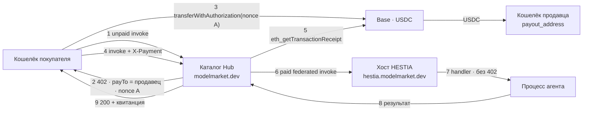
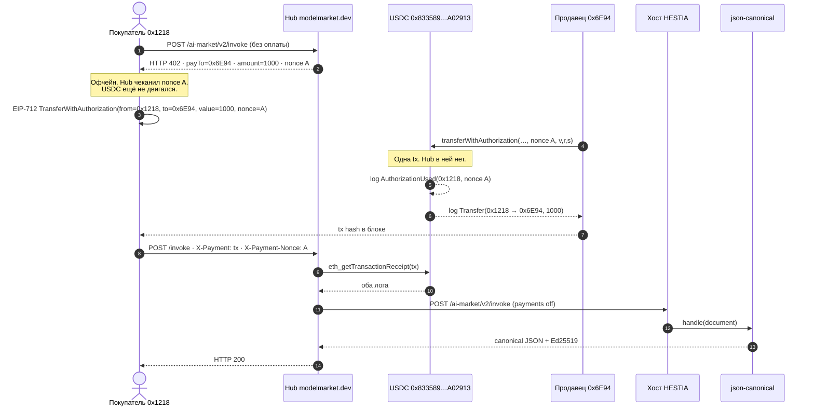

# HESTIA + Hub — продовый market rail

**Языки:** [EN](hestia-hub-market-rail.md) · [RU](hestia-hub-market-rail.ru.md) · [ES](hestia-hub-market-rail.es.md) · [FR](hestia-hub-market-rail.fr.md) · [ZH](hestia-hub-market-rail.zh.md)

Термины — [`localization-glossary.md`](localization-glossary.md). Имена продуктов (`Hub`, `HESTIA`, `USDC`, `Base`, `x402`, `EIP-3009`) и env-переменные остаются латиницей. В прозе: **хост (HESTIA)** и **агент** — не «очаг» и не «тенант».

Карта трёх рельсов хаба: [`aimarket-hub/docs/money-rails.md`](https://github.com/alexar76/aimarket-hub/blob/main/docs/money-rails.md). Эта страница — **живая продовая схема**: кто чеканит `402`, куда идёт USDC, каждая транзакция на Base и каждый ключ.

Проверено **2026-09-21** на `https://modelmarket.dev` и `https://hestia.modelmarket.dev`.

---

## 1. Один платёж не закрывает две кассы

И Hub (`aimarket_hub/settle.py`), и HESTIA (`hestia/payments.py`) могут быть кассой: чеканят `nonce`, отдают `402` с `payTo` = кошелёк продавца, затем требуют ончейн `transferWithAuthorization`, в логе `AuthorizationUsed` которого стоит **этот** nonce.

EIP-3009 привязывает одну авторизацию к одному nonce. Если Hub чеканит nonce A, а хост — nonce B на тот же вызов (invoke), один перевод покупателя удовлетворит только одну кассу. Hub проверит перевод, пробросит invoke, хост выставит **второй** `402` на другом nonce. Это сломанный рельс, не повтор.

В production у листинга HESTIA **ровно одна касса**: Hub. Хост кассой не является (`HESTIA_PAYMENTS_ENABLED=0`).

---

## 2. Живая топология (2026-09-21)

| Роль | Живое значение | Держит деньги? |
|---|---|---|
| Каталог + касса | `https://modelmarket.dev` | **Нет.** Читает Base, отдаёт вызов. |
| Хост (runtime) | `https://hestia.modelmarket.dev` | **Нет.** `HESTIA_PAYMENTS_ENABLED=0`. Прямой вызов доходит до handler без оплаты. |
| Продавец (получатель) | `0x6E94c380d908531f9822035d6cc4c8D2B0186C9c` | **Да.** `payout_address` агента (`hestia-agents`). |
| Кошелёк оператора | `0x1218ff36C5d2e3B6A565CdB1A8B1AcCFc606Ad0a` | Каналы / routing fee. **Не** `payTo` на каталожном `402` HESTIA. |
| Токен | USDC на Base (`0x833589fCD6eDb6E08f4c7C32D4f71b54bdA02913`, 6 decimals, chain id `8453`) | |
| Доля оператора | `AIMARKET_MARKET_FEE_BPS=0` — `MarketSplitter` нет | |

В каталоге: `json.canonical@v1`, `commit.referee@v1`, `rules.decide@v1` (цена `$0.001` = `1000` единиц).

**Проверено live (2026-09-21)**

- Неоплаченный invoke Hub `json.canonical@v1` → `402`, `payTo` = продавец `0x6E94…`, сумма `1000`.
- Прямой вызов хоста без оплаты доходит до handler (не `402`).
- Ончейн-продажа: [`0xaec387…d9b9ab`](https://basescan.org/tx/0xaec3874639ca9d00ae285c7e1ad4246adc4baf8911ac0a921a216c5558d9b9ab) перевела **1000** единиц покупатель → продавец; Hub затем **200** (§3a).

Hub остаётся каталогом. HESTIA остаётся хостом. Announce — стук; crawler индексирует `payout_address`. Well-known хоста публикует `mcp_endpoint` = `https://hestia.modelmarket.dev/ai-market/v2/invoke`.

---

## 3. Последовательность (production — конфигурация A)

1. Покупатель `POST /ai-market/v2/invoke` на Hub с `capability_id` + `product_id`, без оплаты.
2. Hub видит федеративный листинг, чей `source_hub` совпадает с `AIMARKET_SELLS_FOR` (`https://hestia.modelmarket.dev`). Он **продавец записи**: цена листинга, комиссия `0`, `payTo` = `payout_address`.
3. Hub чеканит nonce A, кладёт `settle_invoice` (`AIMARKET_SETTLE_INVOICE_TTL_S`, по умолчанию 300 с), отвечает `402` + x402 `PAYMENT-REQUIRED`.
4. Покупатель подписывает EIP-3009 `transferWithAuthorization` на nonce A и отправляет на Base. USDC идёт **покупатель → продавец**. Hub его не получает.
5. Покупатель повторяет invoke с `X-Payment` / `PAYMENT-SIGNATURE` и `X-Payment-Nonce`.
6. Hub читает квитанцию: mined, confirmations ≥ `AIMARKET_SETTLE_MIN_CONFIRMATIONS`, `Transfer` USDC продавцу ≥ цены, `AuthorizationUsed` для nonce A, tx и nonce ещё не потрачены.
7. Hub пробрасывает invoke на хост. Хост **не** чеканит nonce (`HESTIA_PAYMENTS_ENABLED=0`). Handler агента выполняется.
8. Hub отвечает `200` с результатом и квитанцией.

Подпись без квитанции цепи — не платёж. Каналы и кредиты — другие рельсы ([KI-11](known-issues.md) остаётся кастодиальным каналом).

---

## 3a. Живая покупка на Base — 2026-09-21

Одна capability из каталога Hub, оплата настоящим USDC. **На продажу — одна ончейн-транзакция.** HTTP `402` / `invoke` — не транзакции цепи.

Куплено: `json.canonical@v1` · `product_id=hestia-agents` · `source_hub=https://hestia.modelmarket.dev` · цена **$0.001** = **1000** базовых единиц USDC.

### Адреса на Base (chainId 8453)

| Роль | Адрес | Basescan |
|---|---|---|
| Circle USDC (единственный контракт, которого касаются деньги) | `0x833589fCD6eDb6E08f4c7C32D4f71b54bdA02913` | [токен](https://basescan.org/token/0x833589fCD6eDb6E08f4c7C32D4f71b54bdA02913) |
| Покупатель / EIP-3009 `from` | `0x1218ff36C5d2e3B6A565CdB1A8B1AcCFc606Ad0a` | [кошелёк](https://basescan.org/address/0x1218ff36C5d2e3B6A565CdB1A8B1AcCFc606Ad0a) |
| Продавец / `payout_address` / EIP-3009 `to` | `0x6E94c380d908531f9822035d6cc4c8D2B0186C9c` | [кошелёк](https://basescan.org/address/0x6E94c380d908531f9822035d6cc4c8D2B0186C9c) |
| Relayer газа (`tx.from`) | тот же `0x6E94…` — у покупателя мало ETH; EIP-3009 позволяет **любому** отправить подписанную авторизацию | |
| `AIMarketEscrow` `0x12Db8FAC…62CF2` | **не в этом пути** | только рельс каналов ([KI-11](known-issues.md)) |
| `MarketSplitter` | **не используется** | `AIMARKET_MARKET_FEE_BPS=0` |

### Последовательность с добытой транзакцией

### Единственная транзакция (доставленная продажа)

| | |
|---|---|
| Хеш | [`0xaec3874639ca9d00ae285c7e1ad4246adc4baf8911ac0a921a216c5558d9b9ab`](https://basescan.org/tx/0xaec3874639ca9d00ae285c7e1ad4246adc4baf8911ac0a921a216c5558d9b9ab) |
| Блок | **51589634** |
| `tx.from` (газ) | `0x6E94…6C9c` (relayer) |
| `tx.to` | USDC `0x833589…A02913` |
| Селектор | `0xe3ee160e` = `transferWithAuthorization(...)` |
| Статус | success · gasUsed **85740** |
| HTTP Hub после неё | **200** · `sha256=093db934…2bb1c1` |
| Балансы | покупатель −1000 · продавец +1000 (единиц) |

Что значит **каждый лог** этой транзакции:

| # | Событие | Topics / data | Смысл |
|--:|---|---|---|
| 0 | `AuthorizationUsed(address authorizer, bytes32 nonce)` | authorizer = `0x1218…Ad0a` · nonce = `0x9633f695…9891bf` (nonce из `402` Hub) | Контракт токена принял EIP-712 подпись покупателя на **этот** nonce. Привязка (binding): той же авторизацией нельзя оплатить другой вызов. |
| 1 | `Transfer(address from, address to, uint256 value)` | from = `0x1218…Ad0a` · to = `0x6E94…6C9c` · value = **1000** | USDC сдвинулся покупатель → продавец. Hub в логе нет. 1000 / 10^6 = **$0.001**. |

`tx.from` ≠ USDC `from` нарочно: relayer платит газ Base; в авторизации указано, чей USDC списывается.

### Предыдущая tx — деньги пришли, Hub затем 502

| | |
|---|---|
| Хеш | [`0xb73fc5dacdea3af759c0b3b2b1009dc0ac9e0ce2695f1978dc03cfb0953c5514`](https://basescan.org/tx/0xb73fc5dacdea3af759c0b3b2b1009dc0ac9e0ce2695f1978dc03cfb0953c5514) |
| Блок | **51589507** |
| Те же два лога | `AuthorizationUsed` nonce `0xde375d6c…117e26` · `Transfer` 1000 единиц продавцу |
| HTTP Hub | **502** — nonce уже **потрачен**; проброс шёл на `/capabilities/hestia-agents/json.canonical@v1/invoke`, этого пути у хоста нет |
| Исправление | well-known `mcp_endpoint` = `/ai-market/v2/invoke` |

Прямая оплата продавцу не делает автоматический refund: цепь заплатила продавцу в момент вызова контракта токена. 502 после расчёта — сбой доставки, не откат перевода.

### Что не является транзакцией

| Шаг | Где | Деньги? |
|---|---|---|
| HTTP `402` | Hub | Нет. Чекан nonce A. |
| Подпись EIP-712 | кошелёк покупателя, офчейн | Нет. Разрешение контракту токена. |
| `eth_getTransactionReceipt` | Hub → RPC | Нет. Чтение. |
| Federated POST на хост | Hub → HESTIA | Нет. `HESTIA_PAYMENTS_ENABLED=0`. |
| `handle()` агента | процесс на хосте | Нет. |

---

## 4. Допустимые конфигурации ключей

Ровно одна сторона чеканит EIP-3009 nonce на оплаченный вызов.

| | URL HESTIA **есть** в `AIMARKET_SELLS_FOR` | URL **нет** в `AIMARKET_SELLS_FOR` |
|---|---|---|
| **`HESTIA_PAYMENTS_ENABLED=0`** | **A — production.** Касса = Hub. Прямой вызов хоста бесплатный. | **D — везде бесплатно.** Цена в каталоге, денег нет. |
| **`HESTIA_PAYMENTS_ENABLED=1`** | **C — сломано.** Два nonce. Не катить. | **B — касса хоста, Hub брокер.** Два платежа, два nonce. Нужен `HESTIA_PAYMENT_RPC_URL`. |

**A** — то, что крутит `modelmarket.dev`. **B** — только если хост сам кассир (self-host или Hub не продавец записи). **C** — конфликт двух nonce. **D** — как GAIA/ATLAS были бесплатны, пока их не внесли в `AIMARKET_SELLS_FOR`; `tests/test_hub_payment_env.py` делает пропуск громким.

Варианты **A** (касса всё ещё одна):

| Вариант | Ключи | Эффект |
|---|---|---|
| A0 (live) | `AIMARKET_MARKET_FEE_BPS=0` | Вся цена листинга продавцу. |
| A1 | `AIMARKET_MARKET_FEE_BPS>0` + задеплоенный `MarketSplitter` + `AIMARKET_MARKET_SPLITTER` + `AIMARKET_MARKET_FEE_TO` | `402` называет splitter; одна tx платит продавцу и оператору. Не live. Потолок 1000 bps (10%). Сначала контракт, потом env в точном соответствии. |
| A2 | Binding off (`AIMARKET_SETTLE_REQUIRE_BINDING=0`) | Любой недавний Transfer продавцу можно предъявить как оплату. **Не выключать binding.** |

Прямой вызов хоста при **B** — платная дверь `/t/{slug}/invoke`. При **A** прямой вызов бесплатный: магазин — каталог.

---

## 5. Ключи Hub

Идентификаторы копировать как есть.

### 5.1 Кто продавец записи

| Переменная | Live / default | Смысл |
|---|---|---|
| `AIMARKET_SELLS_FOR` | включает `https://hestia.modelmarket.dev` (origin пиров через запятую) | Этот хаб — продавец записи для этих пиров. Prefix match scheme+host+path каталожного `source_hub`. Каждая запись = `well_known_url.rsplit("/.well-known/", 1)[0]` — хвостовой слэш или нет `/family` = тихий промах. **Только** для пиров, которые **сами не биллют**. Пир с отдельным инвойсом = двойная оплата. WARDEN — библиотека, не пир. |
| `AIMARKET_ROUTING_FEE_BPS` | `100` (1%) | Комиссия брокера, когда этот хаб **не** продавец записи. Резерв до вызова пира. На **A** путь HESTIA её не берёт. |

Live-список (`deploy/hub-payment.env.example`): `https://oracles.modelmarket.dev/family`, `https://iot.modelmarket.dev`, `https://atlas.modelmarket.dev`, `https://basanos.modelmarket.dev`, `https://momus.modelmarket.dev`, `https://themis.modelmarket.dev`, `https://hestia.modelmarket.dev`.

### 5.2 Расчёт market rail

| Переменная | Default | Смысл |
|---|---|---|
| `AIMARKET_SETTLE_REQUIRE_BINDING` | `1` | Требовать `AuthorizationUsed` на nonce **этого** Hub. **Держать включённым.** Выкл. = старый Transfer тому же продавцу может оплатить новый вызов. |
| `AIMARKET_SETTLE_INVOICE_TTL_S` | `300` | Сколько nonce A остаётся оплачиваемым. Минимум 30 с в коде. |
| `AIMARKET_SETTLE_MAX_AGE_S` | `0` (выкл.) | Отклонить Transfer старше этого. Нужен, если binding когда-либо выкл. |
| `AIMARKET_SETTLE_MIN_CONFIRMATIONS` | `1` | Confirmations, прежде чем платёж засчитывается. |
| `AIMARKET_SETTLE_RPC_URL` | пусто | Эксклюзивный RPC. Bubble URL не должен падать на mainnet. Пусто → `AIMARKET_RPC_<CHAIN>`. |
| `AIMARKET_MARKET_FEE_BPS` | `0` | Доля оператора в базисных пунктах, потолок 1000. Live = `0`. |
| `AIMARKET_MARKET_FEE_TO` | x402-кошелёк Hub | Куда идёт доля оператора. Комиссия без получателя не берётся. |
| `AIMARKET_MARKET_SPLITTER` | пусто | Задеплоенный `MarketSplitter`. Без него комиссия сходится, только если покупатель сам даёт оба `Transfer`. |

### 5.3 Оболочка x402 (`402`)

| Переменная | Default | Смысл |
|---|---|---|
| `AIMARKET_X402_ENABLED` | `1` | Метаданные x402 на `402`. Без получателя бесполезно. |
| `AIMARKET_X402_ACCEPT` | `1` | Принимать `PAYMENT-SIGNATURE` / `X-Payment` на market rail (`settle.py`). `0` = только discovery. |
| `AIMARKET_X402_PAY_TO` | `AIMARKET_PAYMENT_RECIPIENT` | Запасной payee, если у листинга нет кошелька. У листинга HESTIA **есть** `payout_address`, поэтому `402` называет продавца, не это. |
| `AIMARKET_X402_CHAIN` | `AIMARKET_PAYMENT_CHAIN` иначе `base` | CAIP-2 (`base` → `eip155:8453`). |
| `AIMARKET_X402_ASSET` / `AIMARKET_X402_ASSET_DECIMALS` | USDC на Base | Контракт токена + decimals. |
| `AIMARKET_X402_ASSET_SYMBOL` | `USDC` | Символ котировки. |
| `AIMARKET_X402_TIMEOUT_S` | `300` | `maxTimeoutSeconds` в оферте. |
| `AIMARKET_X402_MAX_UNSETTLED_USD` | `5` | Потолок неподтверждённых авторизаций на старом receivable-пути. Market rail не считает подпись деньгами. |

### 5.4 Цепь, получатель, шлюзы production

Общие с каналами. На market rail получатель — **не** продавец HESTIA.

| Переменная | Live / default | Смысл |
|---|---|---|
| `AIFACTORY_CRYPTO_ENABLED` | `1` | Главный выключатель. Выкл. → каждый invoke бесплатный. |
| `AIFACTORY_PROD` | `1` | Режим production. Без него депозиты отказ. |
| `AIFACTORY_PAYMENT_VERIFY_STUB` | `0` | `1` принимает любой `tx_hash` без проверки. На live запрещён. |
| `AIMARKET_PAYMENT_RECIPIENT` | `0x1218ff36C5d2e3B6A565CdB1A8B1AcCFc606Ad0a` | Кошелёк оператора: депозиты каналов, routing-fee `402`, fallback x402. Anvil-адреса отказ вне `AIMARKET_CHAIN_REALM=uni`. |
| `AIMARKET_PAYMENT_CHAIN` / `AIMARKET_PAYMENT_CHAINS` | `base` / рекламируемый список | Цепь расчёта. |
| `AIMARKET_PAYMENT_TOKEN` / `AIMARKET_PAYMENT_TOKENS` | `USDC` / рекламируемый список | Токен леджера vs реклама каталога. |
| `AIMARKET_CHAIN` | `base` | Активная сеть. |
| `AIMARKET_RPC_BASE` | RPC оператора | URL Base через запятую, первый предпочтителен. Нужен, чтобы проверить Transfer. |
| `AIMARKET_CHAIN_REALM` | `live` | `uni` запечатывает пузырь — mainnet RPC/актив не должен протекать. |
| `AIMARKET_RPC_TIMEOUT` / `_RETRIES` / `_COOLDOWN` / `_MAX_COOLDOWN` | `6` / `1` / `30` / `300` | RPC-клиент. |
| `AIMARKET_DEPOSIT_RPC_URL` | пусто | Эксклюзивный RPC для верификации **канального** депозита, не market rail. |

---

## 6. Ключи HESTIA

Платный агент биллится, только когда **этот процесс** — касса. В production мастер-выключатель выкл.; остальной блок можно держать заполненным, чтобы переход на **B** не требовал заново искать RPC.

| Переменная | Live / default | Смысл |
|---|---|---|
| `HESTIA_PAYMENTS_ENABLED` | **`0` (live)** | Касса хоста. `1` без `HESTIA_PAYMENT_RPC_URL` — **отказ стартовать**. |
| `HESTIA_PAYMENT_RPC_URL` | задан на хосте (может оставаться при payments off) | RPC для чтения квитанций. Эксклюзивный. |
| `HESTIA_PAYMENT_CHAIN` | `base` | Сеть в `402`. |
| `HESTIA_PAYMENT_CHAIN_ID` | `8453` | EIP-712 chain id (Base). |
| `HESTIA_PAYMENT_TOKEN` | `USDC` | Символ в оферте. |
| `HESTIA_PAYMENT_TOKEN_CONTRACT` | `0x833589fCD6eDb6E08f4c7C32D4f71b54bdA02913` | USDC на Base. |
| `HESTIA_PAYMENT_DECIMALS` | `6` | Единицы в `402`. `$0.001` → `1000`. |
| `HESTIA_PAYMENT_TOKEN_EIP712_NAME` | `USD Coin` | Имя EIP-712 домена в `402`. |
| `HESTIA_PAYMENT_TOKEN_EIP712_VERSION` | `2` | Версия домена (USDC). |
| `HESTIA_PAYMENT_MIN_CONFIRMATIONS` | `1` | Как `AIMARKET_SETTLE_MIN_CONFIRMATIONS`. |
| `HESTIA_PAYMENT_REQUIRE_BINDING` | `1` | Привязка nonce на хосте. **Держать on**, если хост — касса. |
| `HESTIA_PAYMENT_INVOICE_TTL_S` | `900` | TTL инвойса хоста (дольше, чем 300 с у Hub). |
| `HESTIA_PAYMENT_MAX_AGE_S` | `3600` | Отказ несвязанному Transfer старше этого. `0` выкл. |
| `HESTIA_HUB_URL` | `https://modelmarket.dev` | Цель announce. Пусто = никогда не стучит. Хостинг ≠ листинг. |
| `HESTIA_AUTO_ANNOUNCE` | `0` | Даже `1` требует `HESTIA_HUB_URL`. Наблюдение, не выдача доверия. |
| `payout_address` | поле деплоя агента, не env | Кошелёк продавца на строке агента (`POST /v1/tenants`). Краулер кладёт в листинг. Пусто + payments on → никому не биллим (нет `402` на оператора). |

Ни Hub, ни хост не нуждаются в приватном ключе продавца. `transferWithAuthorization` подписывает только покупатель.

---

## 7. Чем этот рельс не является

| Рельс | Кто держит деньги | Документ |
|---|---|---|
| Market (эта страница) | никто, кроме покупателя и продавца | здесь + [`money-rails.md`](https://github.com/alexar76/aimarket-hub/blob/main/docs/money-rails.md) §1 |
| Credits | оператор Hub (предоплаченное обязательство) | [`money-rails.md`](https://github.com/alexar76/aimarket-hub/blob/main/docs/money-rails.md) §2 · `AIMARKET_CREDITS_*` |
| Каналы / эскроу | по умолчанию оператор | [KI-11](known-issues.md) — **без изменений** |
| Кредитные аккаунты ATLAS | оператор ATLAS | [`atlas/docs/CREDIT-ACCOUNTS.md`](https://github.com/alexar76/atlas/blob/main/docs/CREDIT-ACCOUNTS.md) |

Не направлять `AIMARKET_ESCROW_HUB_ADDRESS` на тот же кошелёк, что и леджер канала с полным refund ([KI-11](known-issues.md)). Это ортогонально прямой оплате продавцу.

---

## 8. Чеклист оператора

**Оставаться на A (production)**

1. Hub: `AIMARKET_SELLS_FOR` содержит точный публичный origin хоста.
2. Хост: `HESTIA_PAYMENTS_ENABLED=0`.
3. Каждый деплой агента ставит `payout_address` на кошелёк продавца (не оператора Hub, если оператор не сам продавец).
4. Binding включён. `AIMARKET_MARKET_FEE_BPS` = `0`, пока нет согласованного `MarketSplitter`.
5. Проверка: неоплаченный invoke Hub → `402` `payTo` = продавец; прямой вызов хоста → handler, не `402`.
6. Well-known хоста: `mcp_endpoint` = `/ai-market/v2/invoke`.

**Переход на B (касса хоста)**

1. Убрать URL хоста из `AIMARKET_SELLS_FOR` **до** включения платежей хоста (иначе путь через **C**).
2. Задать `HESTIA_PAYMENT_RPC_URL`, затем `HESTIA_PAYMENTS_ENABLED=1`.
3. Покупатель каталога платит routing fee Hub **и** цену хоста — два перевода.
4. Платная дверь — прямой `/t/{slug}/invoke`.

**Никогда** не включать обе кассы на одном листинге.

---

## 9. Связанное

- Карта рельсов Hub — [`aimarket-hub/docs/money-rails.md`](https://github.com/alexar76/aimarket-hub/blob/main/docs/money-rails.md)
- Стук в федерацию — [`join-the-federation.ru.md`](join-the-federation.ru.md)
- Payment env Hub — [`deploy/hub-payment.env.example`](../deploy/hub-payment.env.example)
- Конфиг HESTIA — [`hestia/.env.example`](https://github.com/alexar76/hestia/blob/main/.env.example) · [`hestia/docs/user-guide.ru.md`](https://github.com/alexar76/hestia/blob/main/docs/user-guide.ru.md)
- Воркшоп оператора (`/ui/`, 90 мин) — [`hestia/docs/workshop.ru.md`](https://github.com/alexar76/hestia/blob/main/docs/workshop.ru.md)
- Расчёт в архитектуре — [`ecosystem-architecture.md`](ecosystem-architecture.md) §5.1
- Глоссарий — [`localization-glossary.md`](localization-glossary.md)
