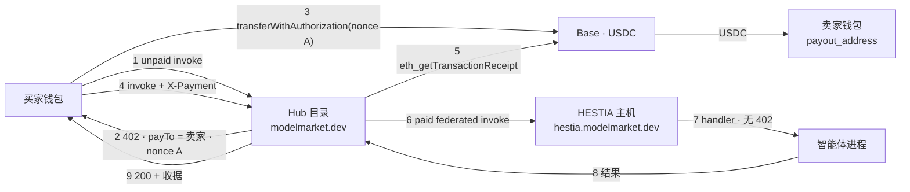
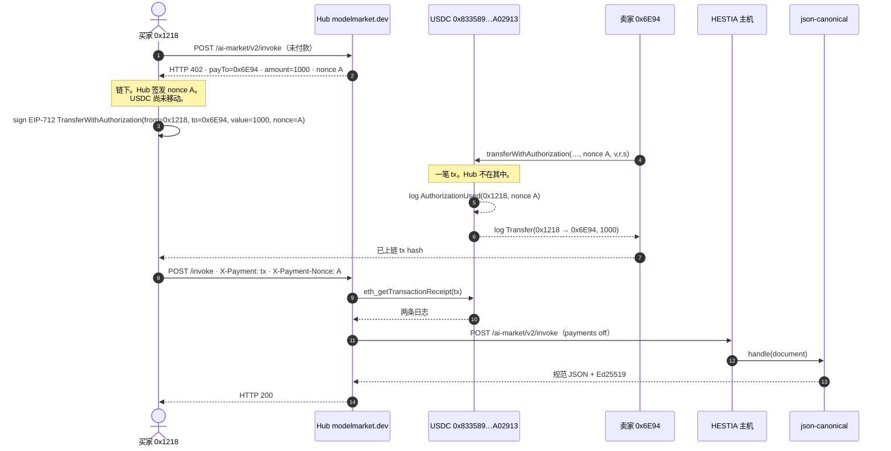

# HESTIA + Hub — 生产市场轨道

**语言：** [EN](hestia-hub-market-rail.md) · [RU](hestia-hub-market-rail.ru.md) · [ES](hestia-hub-market-rail.es.md) · [FR](hestia-hub-market-rail.fr.md) · [ZH](hestia-hub-market-rail.zh.md)

术语见 [`localization-glossary.md`](localization-glossary.md)。产品名（`Hub`、`HESTIA`、`USDC`、`Base`、`x402`、`EIP-3009`）和环境变量保持拉丁文。正文写 **主机 (HESTIA)** 和 **智能体**。

Hub 三条轨道总图：[`aimarket-hub/docs/money-rails.md`](https://github.com/alexar76/aimarket-hub/blob/main/docs/money-rails.md)。本页是跑在 HESTIA、经 Hub 目录出售的智能体的 **线上生产方案**：谁签发 `402`、USDC 去向、每一把环境键、哪些组合合法。

**2026-09-21** 在 `https://modelmarket.dev` 与 `https://hestia.modelmarket.dev` 实测。

---

## 1. 一笔付款填不满两座收银台

Hub（`aimarket_hub/settle.py`）与 HESTIA（`hestia/payments.py`）都可以当收银台：签发 `nonce`、返回 `payTo` = 卖家钱包的 `402`，再要求链上 `transferWithAuthorization`，其 `AuthorizationUsed` 日志必须带 **该** nonce（`AIMARKET_SETTLE_REQUIRE_BINDING` / `HESTIA_PAYMENT_REQUIRE_BINDING`，默认均为 `1`）。

EIP-3009 把一次授权绑到一个 nonce。若 Hub 签发 nonce A、主机对同一次调用签发 nonce B，买家的一笔转账只能满足其中一方。Hub 核验后转发 invoke，HESTIA 会再出 **第二个** `402`、另一个 nonce。这不是重试，是断轨。

生产里 HESTIA 上架条目只有 **一座收银台：Hub**。主机不当收银。

---

## 2. 线上拓扑（2026-09-21）

| 角色 | 线上值 | 是否托管资金 |
|---|---|---|
| 目录 + 收银台 | `https://modelmarket.dev` | **否。** 读 Base，再提供调用。 |
| 主机（runtime） | `https://hestia.modelmarket.dev` | **否。** `HESTIA_PAYMENTS_ENABLED=0`。直连 invoke 不付款也能到 handler。 |
| 卖家（收款方） | `0x6E94c380d908531f9822035d6cc4c8D2B0186C9c` | **是。** 智能体部署时的 `payout_address`（`hestia-agents`）。 |
| 运营钱包 | `0x1218ff36C5d2e3B6A565CdB1A8B1AcCFc606Ad0a`（`AIMARKET_PAYMENT_RECIPIENT`） | 通道 / 路由费。**不是** HESTIA 目录 `402` 的收款方。 |
| 代币 | Base 上 USDC（`0x833589fCD6eDb6E08f4c7C32D4f71b54bdA02913`，6 decimals，chain id `8453`） | |
| 运营分成 | `AIMARKET_MARKET_FEE_BPS=0` — 无 `MarketSplitter` | |

已索引的 HESTIA capability（标价 `$0.001` = `1000` 最小单位）：`json.canonical@v1`、`commit.referee@v1`、`rules.decide@v1`。

**线上核实（2026-09-21）**

- Hub 上未付款 invoke `json.canonical@v1` → `402`，`payTo` = 卖家 `0x6E94…`，金额 `1000`。
- 直连主机、不付款，到达 handler（不是 `402`）。
- 链上成交：[`0xaec387…d9b9ab`](https://basescan.org/tx/0xaec3874639ca9d00ae285c7e1ad4246adc4baf8911ac0a921a216c5558d9b9ab) 把 **1000** 个 USDC 最小单位从买家转到卖家；Hub 随后返回 **200**（§3a）。

Hub 仍是目录。HESTIA 仍是主机。Announce 是敲门；crawler 索引 `payout_address`。主机 well-known 发布 `mcp_endpoint` = `https://hestia.modelmarket.dev/ai-market/v2/invoke`。

---

## 3. 时序（生产 — 配置 A）

1. 买家向 Hub `POST /ai-market/v2/invoke`，带 `capability_id` + `product_id`，不付款。
2. Hub 看到联邦上架，其 `source_hub` 匹配 `AIMARKET_SELLS_FOR`（`https://hestia.modelmarket.dev`）。本 Hub 是 **登记卖家**：标价、手续费 `0`、`payTo` = 上架的 `payout_address`。
3. Hub 签发 nonce A，写入 `settle_invoice`（`AIMARKET_SETTLE_INVOICE_TTL_S`，默认 300 秒），返回 `402` + x402 `PAYMENT-REQUIRED`。
4. 买家签署 EIP-3009 `transferWithAuthorization`（nonce A）并提交到 Base。USDC **买家 → 卖家**。Hub 收不到这笔钱。
5. 买家用 `X-Payment` / `PAYMENT-SIGNATURE` 和 `X-Payment-Nonce` 再 invoke。
6. Hub 读收据：已上链、confirmations ≥ `AIMARKET_SETTLE_MIN_CONFIRMATIONS`、给卖家的 USDC `Transfer` ≥ 标价、nonce A 的 `AuthorizationUsed`、tx 与 nonce 尚未花费。
7. Hub 把 invoke 转发给主机。主机 **不** 签发 nonce（`HESTIA_PAYMENTS_ENABLED=0`）。智能体 handler 执行。
8. Hub 返回 `200`，附结果和收据。

没有链上收据的签名不是付款。通道和积分是别的轨道（[KI-11](known-issues.md) 仍是托管通道）。

---

## 3a. Base 上的实购 — 2026-09-21

从 Hub 目录买一项 capability，用真实 USDC 付款。**每笔成交只有一笔链上交易。** HTTP `402` / `invoke` 不是链上交易。

所购：`json.canonical@v1` · `product_id=hestia-agents` · `source_hub=https://hestia.modelmarket.dev` · 标价 **$0.001** = **1000** 个 USDC 最小单位。

### Base 地址（chainId 8453）

| 角色 | 地址 | Basescan |
|---|---|---|
| Circle USDC（资金唯一接触的合约） | `0x833589fCD6eDb6E08f4c7C32D4f71b54bdA02913` | [代币](https://basescan.org/token/0x833589fCD6eDb6E08f4c7C32D4f71b54bdA02913) |
| 买家 / EIP-3009 `from` | `0x1218ff36C5d2e3B6A565CdB1A8B1AcCFc606Ad0a` | [钱包](https://basescan.org/address/0x1218ff36C5d2e3B6A565CdB1A8B1AcCFc606Ad0a) |
| 卖家 / `payout_address` / EIP-3009 `to` | `0x6E94c380d908531f9822035d6cc4c8D2B0186C9c` | [钱包](https://basescan.org/address/0x6E94c380d908531f9822035d6cc4c8D2B0186C9c) |
| Gas relayer（`tx.from`） | 同为 `0x6E94…` — 买家 ETH 偏紧；EIP-3009 允许 **任何人** 提交已签名授权 | |
| Hub 运营钱包 | `0x1218…Ad0a`（此处与买家同一 EOA — 自测） | 不是此 `402` 的收款方 |
| `AIMarketEscrow` `0x12Db8FAC…62CF2` | **不在此路径** | 仅通道轨道（[KI-11](known-issues.md)） |
| `MarketSplitter` | **未部署 / 未使用** | `AIMARKET_MARKET_FEE_BPS=0` |

### 带已上链交易的时序

### 唯一一笔交易（已交付的成交）

| | |
|---|---|
| 哈希 | [`0xaec3874639ca9d00ae285c7e1ad4246adc4baf8911ac0a921a216c5558d9b9ab`](https://basescan.org/tx/0xaec3874639ca9d00ae285c7e1ad4246adc4baf8911ac0a921a216c5558d9b9ab) |
| 区块 | **51589634** |
| `tx.from` / 付 gas 者 | `0x6E94…6C9c`（relayer） |
| `tx.to` | USDC `0x833589…A02913` |
| 选择器 | `0xe3ee160e` = `transferWithAuthorization(address,address,uint256,uint256,uint256,bytes32,uint8,bytes32,bytes32)` |
| 状态 | success（`status=0x1`）· gasUsed **85740** |
| 之后的 Hub HTTP | **200** · `json.canonical@v1` 返回 RFC 8785 字节，`sha256=093db934…2bb1c1` |
| 余额 | 买家 996519 → **995519**（−1000）· 卖家 1921000 → **1922000**（+1000） |

**每条日志**的含义：

| # | 事件 | Topics / data | 含义 |
|--:|---|---|---|
| 0 | `AuthorizationUsed(address authorizer, bytes32 nonce)` | authorizer = `0x1218…Ad0a` · nonce = `0x9633f695…9891bf`（Hub `402` 的 nonce） | 代币合约接受了买家针对 **该** nonce 的 EIP-712 签名。绑定（binding）：同一授权不能再付另一次调用。 |
| 1 | `Transfer(address from, address to, uint256 value)` | from = `0x1218…Ad0a` · to = `0x6E94…6C9c` · value = **1000** | USDC 从买家到卖家。日志里没有 Hub。1000 / 10^6 = **$0.001**。 |

`tx.from` ≠ USDC `from` 是有意的：relayer 付 Base gas；授权里写明谁失去 USDC。

### 前一笔 tx — 钱已到账，Hub 随后 502

| | |
|---|---|
| 哈希 | [`0xb73fc5dacdea3af759c0b3b2b1009dc0ac9e0ce2695f1978dc03cfb0953c5514`](https://basescan.org/tx/0xb73fc5dacdea3af759c0b3b2b1009dc0ac9e0ce2695f1978dc03cfb0953c5514) |
| 区块 | **51589507** |
| 同样两条日志 | `AuthorizationUsed` nonce `0xde375d6c…117e26` · `Transfer` 1000 最小单位给卖家 |
| 之后的 Hub HTTP | **502** — Hub 已 **消耗** nonce（重试时 `payment_invalid: already spent`），再 POST `/capabilities/hestia-agents/json.canonical@v1/invoke`，本主机不提供该路径 |
| 修复 | well-known `mcp_endpoint` = `/ai-market/v2/invoke`；重启 Hub 以丢掉 300 秒的 endpoint 缓存 |

直付卖家没有自动退款：代币合约执行时链已付给卖家。settle 之后的 502 是交付失败，不是转账回滚。

### 什么不是交易

| 步骤 | 何处 | 资金？ |
|---|---|---|
| HTTP `402` + `PAYMENT-REQUIRED` | Hub | 否。签发 nonce A。 |
| EIP-712 签名 | 买家钱包，链下 | 否。给代币合约的许可。 |
| `eth_getTransactionReceipt` | Hub → RPC | 否。只读。 |
| 向主机的联邦 POST | Hub → HESTIA | 否。`HESTIA_PAYMENTS_ENABLED=0`。 |
| 智能体 `handle()` | 主机进程 | 否。 |

---

## 4. 合法配置

一次付费调用只允许一方签发 EIP-3009 nonce。两个开关必须成对使用。

| | `AIMARKET_SELLS_FOR` **含** HESTIA 公开 URL | `AIMARKET_SELLS_FOR` **不含** HESTIA URL |
|---|---|---|
| **`HESTIA_PAYMENTS_ENABLED=0`** | **A — 生产。** 收银台 = Hub。主机 invoke 免费。目录 `402` 写卖家。 | **D — 处处免费。** 标了价，没人收款。静默漏配：capability 仍能跑。 |
| **`HESTIA_PAYMENTS_ENABLED=1`** | **C — 损坏。** 双 nonce。Hub 核验 A，主机要 B。禁止上线。 | **B — 主机收银，Hub 经纪。** 两笔付款：Hub `402` 按 `AIMARKET_ROUTING_FEE_BPS` 付给运营钱包；主机 `402` 按标价付给 `payout_address`。两个 nonce，两笔转账。需要 `HESTIA_PAYMENT_RPC_URL`。 |

**A** 就是 `modelmarket.dev` 在跑的。仅当主机必须向自己的买家收银时用 **B**（自托管，或 Hub 不是登记卖家）。**C** 是生产选择要避开的双 nonce 失败。**D** 是 GAIA/ATLAS 在写入 `AIMARKET_SELLS_FOR` 之前的免费状态；`tests/test_hub_payment_env.py` 让这种漏配变响。

**A** 的变体（仍然只有一座收银台）：

| 变体 | 键 | 效果 |
|---|---|---|
| A0（线上） | `AIMARKET_MARKET_FEE_BPS=0` | 标价全部给卖家。 |
| A1 | `AIMARKET_MARKET_FEE_BPS>0` + 已部署 `MarketSplitter` + `AIMARKET_MARKET_SPLITTER` + `AIMARKET_MARKET_FEE_TO` | `402` 写 splitter；一笔 tx 同时付给卖家和运营。未上线。上限 1000 bps（10%）。**先** 部署合约，再让 env 对齐。 |
| A2 | 关闭 binding（`AIMARKET_SETTLE_REQUIRE_BINDING=0`） | 任何近期打给卖家的 Transfer 都可冒充付款。**保持 binding 开启。** |

无 Hub 的直连主机 invoke：在 **B** 下是通往 `/t/{slug}/invoke` 的付费门；在 **A** 下免费——这是有意的：商店是目录。

---

## 5. Hub 键

标识符原样复制。

### 5.1 谁是登记卖家

| 变量 | 线上 / 默认 | 含义 |
|---|---|---|
| `AIMARKET_SELLS_FOR` | 含 `https://hestia.modelmarket.dev`（逗号分隔的 peer origin） | 声明本 Hub 为这些 peer 的登记卖家。对目录 `source_hub` 做 scheme+host+path 前缀匹配。每条必须等于 `well_known_url.rsplit("/.well-known/", 1)[0]` — 尾斜杠或缺少 `/family` = 静默漏配。**仅** 用于 **自己不账单** 的 peer。把会另开发票的 peer 加进去会让买家付两次。WARDEN 是库，不是 peer。 |
| `AIMARKET_ROUTING_FEE_BPS` | `100`（1%） | 本 Hub **不是** 登记卖家时的经纪分成。在调用 peer 之前预留。在 **A** 下 HESTIA 路径不收这笔。 |

线上列表（见 `deploy/hub-payment.env.example`）：`https://oracles.modelmarket.dev/family`、`https://iot.modelmarket.dev`、`https://atlas.modelmarket.dev`、`https://basanos.modelmarket.dev`、`https://momus.modelmarket.dev`、`https://themis.modelmarket.dev`、`https://hestia.modelmarket.dev`。

### 5.2 市场轨道结算

| 变量 | 默认 | 含义 |
|---|---|---|
| `AIMARKET_SETTLE_REQUIRE_BINDING` | `1` | 要求 **本** Hub 所签发 nonce 的 `AuthorizationUsed`。**保持开启。** 关闭 = 打给同一卖家的旧 Transfer 可付新调用。 |
| `AIMARKET_SETTLE_INVOICE_TTL_S` | `300` | nonce A 可付款的时长。代码里最少 30 秒。 |
| `AIMARKET_SETTLE_MAX_AGE_S` | `0`（关） | 拒绝更旧的 Transfer。一旦关闭 binding 就需要。 |
| `AIMARKET_SETTLE_MIN_CONFIRMATIONS` | `1` | 付款计入前的确认数。 |
| `AIMARKET_SETTLE_RPC_URL` | 空 | 独占 RPC。气泡 URL 不得落到主网。空 → `AIMARKET_RPC_<CHAIN>`。 |
| `AIMARKET_MARKET_FEE_BPS` | `0` | 运营分成（基点），上限 1000。线上为 `0`。 |
| `AIMARKET_MARKET_FEE_TO` | Hub 的 x402 钱包 | 运营分成去向。没有收款方则不收费。 |
| `AIMARKET_MARKET_SPLITTER` | 空 | 已部署的 `MarketSplitter`。没有它，手续费只有在买家自己给出两段 Transfer 时才能结清。 |

### 5.3 x402 信封（`402` 的正文 / 头）

| 变量 | 默认 | 含义 |
|---|---|---|
| `AIMARKET_X402_ENABLED` | `1` | 在 `402` 上发出 x402 元数据。没有收款方则无效。 |
| `AIMARKET_X402_ACCEPT` | `1` | 在市场轨道（`settle.py`）上接受 `PAYMENT-SIGNATURE` / `X-Payment`。`0` = 仅发现。 |
| `AIMARKET_X402_PAY_TO` | `AIMARKET_PAYMENT_RECIPIENT` | 上架没有卖家钱包时的后备收款方。HESTIA 上架 **有** `payout_address`，所以 `402` 写卖家，不写这个。 |
| `AIMARKET_X402_CHAIN` | `AIMARKET_PAYMENT_CHAIN`，否则 `base` | 以 CAIP-2 发出（`base` → `eip155:8453`）。 |
| `AIMARKET_X402_ASSET` / `AIMARKET_X402_ASSET_DECIMALS` | Base 上的 USDC | 代币合约 + decimals 覆盖。 |
| `AIMARKET_X402_ASSET_SYMBOL` | `USDC` | 报价符号。 |
| `AIMARKET_X402_TIMEOUT_S` | `300` | 报价里的 `maxTimeoutSeconds`。 |
| `AIMARKET_X402_MAX_UNSETTLED_USD` | `5` | 旧 receivable 路径上未核验授权的上限。市场轨道不把签名当钱入账。 |

### 5.4 链、收款方、生产闸门

与通道共用。在市场轨道上，收款方 **不是** HESTIA 卖家。

| 变量 | 线上 / 默认 | 含义 |
|---|---|---|
| `AIFACTORY_CRYPTO_ENABLED` | `1` | 总开关。关 → 每次 invoke 免费。 |
| `AIFACTORY_PROD` | `1` | 生产模式。没有它会拒绝充值。 |
| `AIFACTORY_PAYMENT_VERIFY_STUB` | `0` | `1` 接受任何未核验的 `tx_hash`。线上禁止。 |
| `AIMARKET_PAYMENT_RECIPIENT` | `0x1218ff36C5d2e3B6A565CdB1A8B1AcCFc606Ad0a` | 运营钱包：通道充值、路由费 `402`、x402 后备。`AIMARKET_CHAIN_REALM=uni` 之外拒绝 Anvil 地址。 |
| `AIMARKET_PAYMENT_CHAIN` / `AIMARKET_PAYMENT_CHAINS` | `base` / 广告列表 | 结算链。 |
| `AIMARKET_PAYMENT_TOKEN` / `AIMARKET_PAYMENT_TOKENS` | `USDC` / 广告列表 | 账本代币 vs 目录广告。 |
| `AIMARKET_CHAIN` | `base` | 活动网络 id。 |
| `AIMARKET_RPC_BASE` | 运营 RPC | 逗号分隔的 Base 端点，优先用第一个。核验 Transfer 需要它。 |
| `AIMARKET_CHAIN_REALM` | `live` | `uni` 封住气泡 — 主网 RPC/资产不得漏入。 |
| `AIMARKET_RPC_TIMEOUT` / `_RETRIES` / `_COOLDOWN` / `_MAX_COOLDOWN` | `6` / `1` / `30` / `300` | RPC 客户端。 |
| `AIMARKET_DEPOSIT_RPC_URL` | 空 | **通道** 充值核验的独占 RPC，不是市场轨道。 |

---

## 6. HESTIA 键

标价智能体只有在 **本进程** 当收银台时才计费。生产把总开关关掉；其余块可以继续填好，切到 **B** 时不必再找 RPC 和代币元数据。

| 变量 | 线上 / 默认 | 含义 |
|---|---|---|
| `HESTIA_PAYMENTS_ENABLED` | **`0`（线上）** | 主机收银台总开关。`1` 且无 `HESTIA_PAYMENT_RPC_URL` 则 **拒绝启动**。 |
| `HESTIA_PAYMENT_RPC_URL` | 主机上已设（payments 关闭时也可保留） | 读收据的链端点。独占。 |
| `HESTIA_PAYMENT_CHAIN` | `base` | `402` 里的网络 id。 |
| `HESTIA_PAYMENT_CHAIN_ID` | `8453` | EIP-712 域 chain id（Base）。 |
| `HESTIA_PAYMENT_TOKEN` | `USDC` | 报价里的符号。 |
| `HESTIA_PAYMENT_TOKEN_CONTRACT` | `0x833589fCD6eDb6E08f4c7C32D4f71b54bdA02913` | Base 上的 USDC。 |
| `HESTIA_PAYMENT_DECIMALS` | `6` | `402` 里的金额单位。`$0.001` → `1000`。 |
| `HESTIA_PAYMENT_TOKEN_EIP712_NAME` | `USD Coin` | `402` 里公布的 EIP-712 域名。 |
| `HESTIA_PAYMENT_TOKEN_EIP712_VERSION` | `2` | EIP-712 域版本（USDC）。 |
| `HESTIA_PAYMENT_MIN_CONFIRMATIONS` | `1` | 与 `AIMARKET_SETTLE_MIN_CONFIRMATIONS` 同角色。 |
| `HESTIA_PAYMENT_REQUIRE_BINDING` | `1` | 主机侧 nonce 绑定。若本主机是收银台 **保持开启**。 |
| `HESTIA_PAYMENT_INVOICE_TTL_S` | `900` | 主机发票寿命（长于 Hub 的 300 秒）。 |
| `HESTIA_PAYMENT_MAX_AGE_S` | `3600` | 拒绝更旧的未绑定 Transfer。`0` 关闭。 |
| `HESTIA_HUB_URL` | `https://modelmarket.dev` | Announce / 联邦目标。空 = 永不敲门。托管 ≠ 上架。 |
| `HESTIA_AUTO_ANNOUNCE` | `0` | 即使为 `1` 仍需 `HESTIA_HUB_URL`。观察，不是授信。 |
| `payout_address` | 智能体部署字段，不是 env | 智能体行上的卖家钱包（`POST /v1/tenants`）。Hub crawler 写入上架。空 + payments on → 不向任何人收费（没有指向运营方的 `402`）。 |

Hub 不需要卖家私钥。主机也不需要。只有买家签 `transferWithAuthorization`。

---

## 7. 本轨道不是什么

| 轨道 | 谁拿着钱 | 文档 |
|---|---|---|
| 市场（本页） | 除买家与卖家外无人 | 此处 + [`money-rails.md`](https://github.com/alexar76/aimarket-hub/blob/main/docs/money-rails.md) §1 |
| 积分 | Hub 运营方（预付负债） | [`money-rails.md`](https://github.com/alexar76/aimarket-hub/blob/main/docs/money-rails.md) §2 · `AIMARKET_CREDITS_*` |
| 通道 / 托管 | 默认是运营方 | [KI-11](known-issues.md) — **未改** |
| ATLAS 信用账户 | ATLAS 运营方 | [`atlas/docs/CREDIT-ACCOUNTS.md`](https://github.com/alexar76/atlas/blob/main/docs/CREDIT-ACCOUNTS.md) |

不要把 `AIMARKET_ESCROW_HUB_ADDRESS` 指到随后会全额退款的通道账本同一钱包（[KI-11](known-issues.md)）。该互锁与直付卖家正交。

---

## 8. 运营核对清单

**保持 A（生产）**

1. Hub：`AIMARKET_SELLS_FOR` 含主机的精确公开 origin。
2. 主机：`HESTIA_PAYMENTS_ENABLED=0`。
3. 每次智能体部署把 `payout_address` 设为卖家钱包（除非运营方 **就是** 卖家，否则不要用 Hub 运营钱包）。
4. Binding 开启。在部署并对齐 `MarketSplitter` 之前 `AIMARKET_MARKET_FEE_BPS` 保持 `0`。
5. 确认：Hub 未付款 invoke → `402` `payTo` = 卖家；直连主机 invoke → handler，不是 `402`。
6. 主机 well-known：`mcp_endpoint` = `/ai-market/v2/invoke`。

**切到 B（主机收银）**

1. **先** 从 `AIMARKET_SELLS_FOR` 去掉主机 URL，**再** 打开主机付款（否则会经过 **C**）。
2. 设置 `HESTIA_PAYMENT_RPC_URL`，然后 `HESTIA_PAYMENTS_ENABLED=1`。
3. 目录买家付 Hub 路由费 **以及** 主机标价 — 两笔转账。
4. 付费门是直连 `/t/{slug}/invoke`。

同一上架条目上 **切勿** 开两座收银台。

---

## 9. 相关

- Hub 轨道总图 — [`aimarket-hub/docs/money-rails.md`](https://github.com/alexar76/aimarket-hub/blob/main/docs/money-rails.md)
- 联邦敲门 — [`join-the-federation.zh.md`](join-the-federation.zh.md)
- Hub 付款 env — [`deploy/hub-payment.env.example`](../deploy/hub-payment.env.example)
- HESTIA 配置 — [`hestia/.env.example`](https://github.com/alexar76/hestia/blob/main/.env.example) · [`hestia/docs/user-guide.zh.md`](https://github.com/alexar76/hestia/blob/main/docs/user-guide.zh.md)
- 运营者工坊（`/ui/`，90 分钟）— [`hestia/docs/workshop.zh.md`](https://github.com/alexar76/hestia/blob/main/docs/workshop.zh.md)
- 架构中的结算 — [`ecosystem-architecture.md`](ecosystem-architecture.md) §5.1
- 术语表 — [`localization-glossary.md`](localization-glossary.md)
