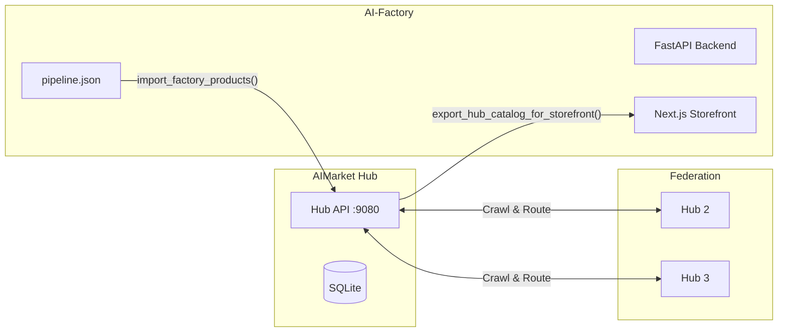

# AI-Factory ↔ AIMarket Hub Integration Guide

## Overview

This guide covers integrating the AIMarket Hub (federation layer) with the existing AI-Factory. The hub adds federation capabilities to the factory without modifying the factory's core.

## Architecture Integration

The hub runs **alongside** the factory, not inside it. It connects via:

1. **Factory → Hub**: Products are exported from `pipeline.json` into the hub's local capability index
2. **Hub → Factory**: The hub's federated catalog is available to the factory's storefront
3. **Hub ↔ Federation**: The hub independently crawls other hubs and routes invocations



## Step 1: Install Hub Package

```bash
cd aimarket-hub
pip install -e .
```

## Step 2: Configure

Add to factory's `.env`:

```bash
# Hub configuration
AIMARKET_HUB_NAME=AI-Factory Federation Hub
AIMARKET_HUB_URL=https://magic-ai-factory.com
AIMARKET_DB_PATH=data/hub.db
AIMARKET_SIGNING_KEY_PATH=data/hub_signing_key

# Federation seeds
AIMARKET_SEED_LIST=https://hub.modelmarket.dev/.well-known/ai-market.json

# Routing fee (1% = 100 bps)
AIMARKET_ROUTING_FEE_BPS=100

# Minimum trust to list a federated capability
AIMARKET_MIN_TRUST_SCORE=0.3
```

## Step 3: Mount Hub Routes in Factory

In `web/backend/main.py`, add:

```python
from aimarket_hub.api import create_app as create_hub_app
from aimarket_hub.config import HubConfig
from aimarket_hub.database import HubDatabase
from aimarket_hub.factory_bridge import import_factory_products

# Create hub sub-application
hub_config = HubConfig()
hub_db = HubDatabase(hub_config.db_path)
hub_app = create_hub_app(config=hub_config, db=hub_db)

# Import factory products into hub
import_factory_products(hub_db)

# Mount hub routes under /ai-market/v2/
app.mount("/ai-market/v2", hub_app)

# Keep existing v1 routes
app.include_router(ai_market_v1.router, prefix="/ai-market")
```

## Step 4: Update .well-known to v2

In `web/backend/services/ai_market_protocol/wellknown.py`, update `build_well_known()`:

```python
def build_well_known() -> dict[str, Any]:
    cfg = pilot_tuple()
    base = base_public_url()

    # Import hub data
    from aimarket_hub.database import HubDatabase
    hub_db = HubDatabase()
    peers_data = []
    for p in hub_db.list_peers():
        peers_data.append({
            "url": p.url,
            "name": p.name,
            "capabilities_count": p.capabilities_count,
            "last_crawl": p.last_crawl,
            "trust_score": p.trust_score,
        })

    return {
        "name": "Magic AI-Factory AI Market",
        "protocol_versions": ["v1", "v2", "mcp"],
        "hub_version": "2.0.0",
        "mcp_endpoint": f"{base}/ai-market/mcp",
        "manifest_url": f"{base}/ai-market/manifest",
        "products_count": len(list_shipped_products()),
        "capabilities_count": len(list_capabilities()),
        "federated_capabilities_count": hub_db.count_capabilities(),
        "supported_chains": [cfg["chain"]],
        "supported_tokens": [cfg["token"]],
        "signer_public_key": public_key_b64(),
        "federation": {
            "crawl_interval_s": 3600,
            "routing_fee_bps": 100,
            "min_trust_score": 0.3,
            "seed_list": ["https://hub.modelmarket.dev/.well-known/ai-market.json"],
        },
        "peers": peers_data,
    }
```

## Step 5: Add Storefront Federated View

In the Next.js storefront, add a `/explore/federated` page:

```tsx
// web/frontend/app/explore/federated/page.tsx
export default async function FederatedExplorePage() {
  const hubUrl = process.env.AIFACTORY_PUBLIC_URL || 'http://localhost:9080';
  const res = await fetch(`${hubUrl}/ai-market/v2/manifest`);
  const manifest = await res.json();

  return (
    <div>
      <h1>Federated AI Market</h1>
      <p>{manifest.total_capabilities} capabilities across {manifest.hubs_indexed + 1} hubs</p>
      {/* Render capability cards */}
    </div>
  );
}
```

## Step 6: Embed Widget

Add to any storefront page:

```html
<script src="/widget.js"
        data-theme="midnight"
        data-hub-url="https://magic-ai-factory.com"
        data-affiliate-id="aifactory_storefront"></script>
```

## Step 7: Start & Verify

```bash
# Start factory with hub
docker-compose up -d

# Test federation
curl https://magic-ai-factory.com/.well-known/ai-market.json | jq .federation
curl https://magic-ai-factory.com/ai-market/v2/search?intent=translate

# Trigger first crawl
curl -X POST https://magic-ai-factory.com/ai-market/v2/federation/crawl

# Check peers
curl https://magic-ai-factory.com/ai-market/v2/federation/peers | jq .
```

## Admin Panel Integration

The existing admin panel at `/admin` can show hub management:

```python
# Add to admin routes:
@router.get("/admin/hub")
async def hub_dashboard():
    db = HubDatabase()
    return {
        "peers": [p.__dict__ for p in db.list_peers()],
        "stats": db.stats_summary(),
        "catalog_size": db.count_capabilities(),
        "federated_size": db.count_federated(),
    }
```

## Safety Gate Configuration per Product

Products can declare constitutional contracts in `pipeline.json`:

```json
{
  "products": {
    "prod-legal": {
      "state": "COMPLETED",
      "name": "Legal Reviewer",
      "constitutional_contract": {
        "block_pii": true,
        "block_medical": false,
        "block_children": true,
        "block_illegal": false,
        "max_input_length": 50000,
        "allowed_patterns": ["legal", "contract", "compliance"],
        "blocked_patterns": ["gambling", "pornography"]
      }
    }
  }
}
```

## Weekly Dataset Export (Cron)

```bash
# Add to crontab
0 0 * * 0 cd /app && python -c "
from aimarket_hub.database import HubDatabase
from aimarket_hub.dataset_exporter import schedule_weekly_export
schedule_weekly_export(HubDatabase())
"
```

## Monitoring

| Metric | Source | Alert |
|--------|--------|-------|
| Crawl failures | Hub logs | > 50% of seeds unreachable |
| Safety block rate | `/v2/stats/live` | > 10% of invocations |
| Trust score drops | `/v2/reputation/{hub}` | Any peer < 0.2 |
| Routing latency | Hub metrics | p95 > 30s |
| DB size | `hub.db` file | > 1GB |
