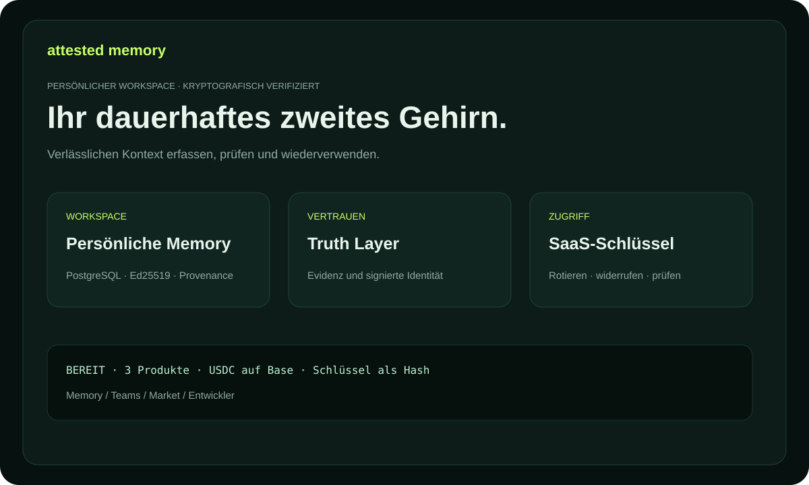

# Attested Memory — Dokumentation

Nachhaltiges, überprüfbares Wissen für Menschen, Teams und Agenten. Jede Memory
Unit kann eine signierte Actor-Identität, Quellen, Wahrheitsstatus und Provenance
enthalten.

## Produkte

- **Personal Attested Memory** — persönliche Entscheidungen und Recherche.
- **Team Memory OS** — Unternehmenswissen in einem geschützten Namespace.
- **Expert Memory Market** — kostenpflichtiges Expertenwissen mit Quellen.

## Die ersten fünf Minuten

1. `/billing` öffnen und einen Plan wählen.
2. Mit einer öffentlichen EVM-Adresse eine exakte Rechnung erstellen.
3. Canonical USDC auf Base senden und den Transaktions-Hash bestätigen.
4. Den `ask_...`-Schlüssel speichern; Checkout-Wiederherstellung gilt 48 Stunden.
5. Eine Actor-Identität verbinden und die erste Memory Unit schreiben.

Vollständige Anleitung: [USER_GUIDE.md](USER_GUIDE.md). Beispiele: [USE_CASES.md](USE_CASES.md). Begriffe: [GLOSSARY.md](GLOSSARY.md). Trial: [TRIAL.md](TRIAL.md). KOVA-Föderation: [KOVA_CAPABILITIES.md](KOVA_CAPABILITIES.md).

Für Expert Memory Market: [Käufer-, Publisher- und Integrationsleitfaden](MARKET_GUIDE.md) sowie [Market-Anwendungsfälle](MARKET_USE_CASES.md).

Für API-Integration und Capability-Publishing: [Entwicklerleitfaden](DEVELOPER_GUIDE.md).
