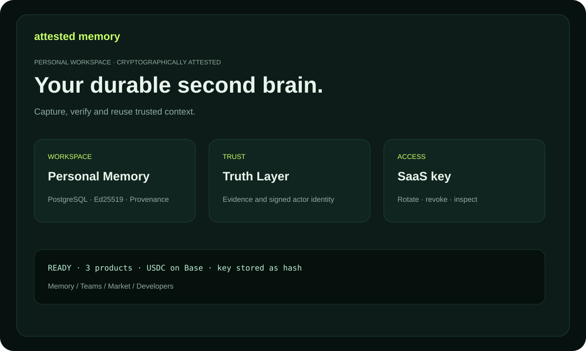

# Attested Memory

Durable knowledge for people, teams and agents. Each Memory Unit can carry an
actor signature, evidence, truth status and provenance receipt.

## Pick a product

- **Personal Attested Memory** — capture private decisions and research.
- **Team Memory OS** — share company context inside an explicit team namespace.
- **Expert Memory Market** — discover and unlock paid, source-linked memory.

## First five minutes

1. Open `/billing` and choose a plan.
2. Create an exact invoice with a public EVM wallet address.
3. Pay canonical USDC on Base and confirm the transaction hash.
4. Save the one-time `ask_...` API key.
5. Connect an actor identity and write your first Memory Unit.

The browser never receives a private key. The gateway stores only hashes of
checkout and SaaS keys. For API details, read [USER_GUIDE.md](USER_GUIDE.md).
For practical workflows, read [USE_CASES.md](USE_CASES.md). For terminology,
read [GLOSSARY.md](GLOSSARY.md). Trial details: [TRIAL.md](TRIAL.md).
