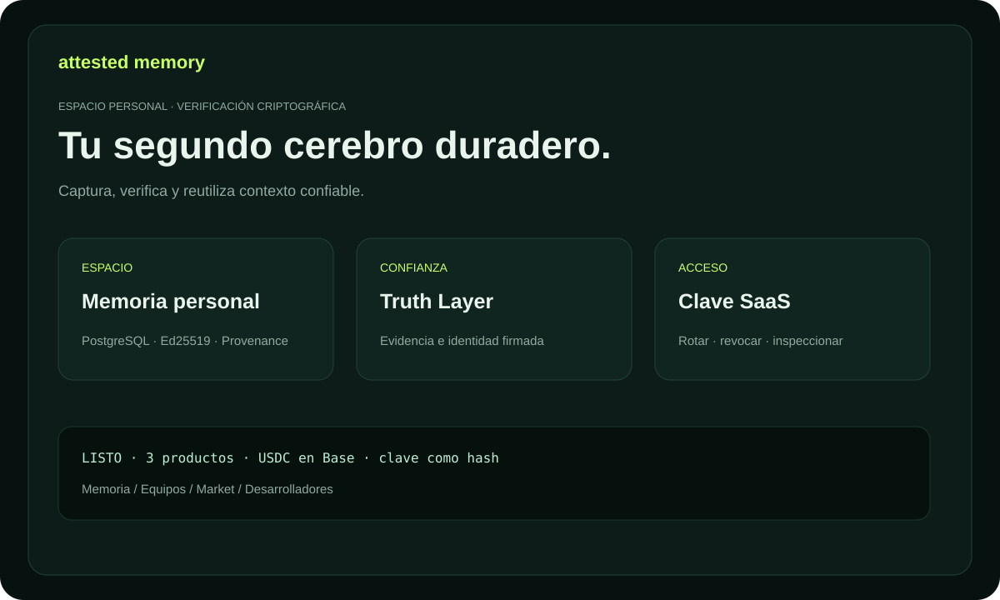

# Attested Memory — documentación

Memoria duradera y verificable para personas, equipos y agentes. Cada Memory
Unit puede incluir identidad firmada, fuentes, estado de veracidad y provenance.

## Productos

- **Personal Attested Memory** — decisiones e investigación personal.
- **Team Memory OS** — conocimiento de empresa dentro de un namespace protegido.
- **Expert Memory Market** — conocimiento experto de pago con fuentes.

## Primeros cinco minutos

1. Abre `/billing` y elige un plan.
2. Crea una factura exacta con una dirección EVM pública.
3. Envía USDC canónico en Base y confirma el hash de transacción.
4. Guarda la clave `ask_...`; el checkout permite recuperarla durante 48 horas.
5. Conecta una identidad de actor y crea tu primera Memory Unit.

Guía completa: [USER_GUIDE.md](USER_GUIDE.md). Casos prácticos: [USE_CASES.md](USE_CASES.md). Términos: [GLOSSARY.md](GLOSSARY.md). Trial: [TRIAL.md](TRIAL.md). KOVA federado: [KOVA_CAPABILITIES.md](KOVA_CAPABILITIES.md).

Para Expert Memory Market: [guía de compra, publicación e integración](MARKET_GUIDE.md) y [casos de uso del mercado](MARKET_USE_CASES.md).

Para integrar API y publicar capabilities: [guía de desarrollo](DEVELOPER_GUIDE.md).
