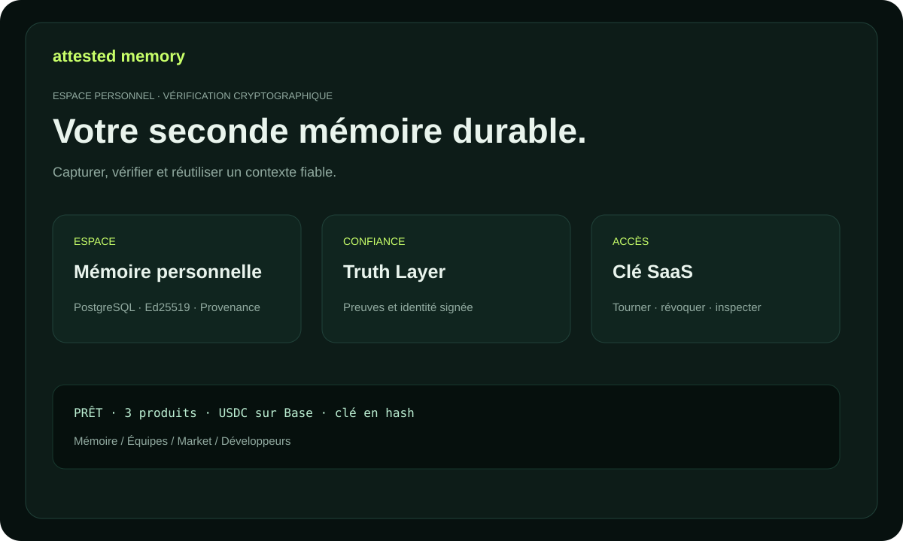

# Attested Memory — documentation

Une mémoire durable et vérifiable pour les personnes, les équipes et les agents.
Chaque Memory Unit peut contenir une identité signée, des sources, un état de
véracité et une provenance.

## Produits

- **Personal Attested Memory** — décisions et recherches personnelles.
- **Team Memory OS** — connaissance d’entreprise dans un namespace protégé.
- **Expert Memory Market** — connaissances d’experts payantes et sourcées.

## Les cinq premières minutes

1. Ouvrir `/billing` et choisir une offre.
2. Créer une facture exacte avec une adresse EVM publique.
3. Envoyer l’USDC canonical sur Base et confirmer le hash de transaction.
4. Conserver la clé unique `ask_...`.
5. Connecter une identité d’actor et créer la première Memory Unit.

Guide complet : [USER_GUIDE.md](USER_GUIDE.md). Cas pratiques : [USE_CASES.md](USE_CASES.md). Termes : [GLOSSARY.md](GLOSSARY.md). Trial : [TRIAL.md](TRIAL.md).
