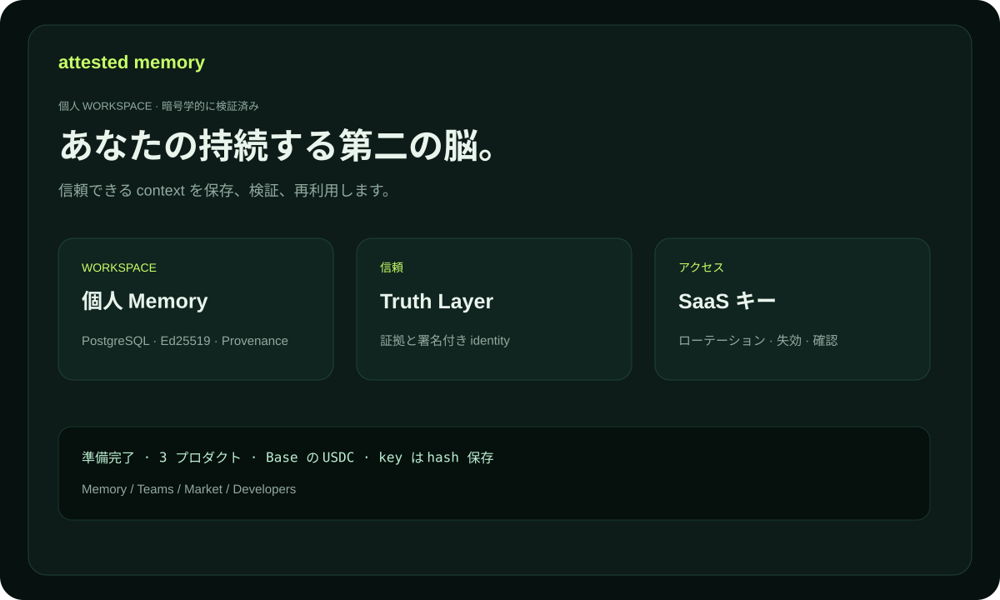

# Attested Memory — ドキュメント

人、チーム、エージェントのための、長期保存でき検証可能な知識基盤です。
各 Memory Unit には署名付き actor identity、出典、truth status、provenance を付けられます。

## プロダクト

- **Personal Attested Memory** — 個人の決定とリサーチ。
- **Team Memory OS** — 保護された namespace 内のチーム知識。
- **Expert Memory Market** — 出典付き有料エキスパート知識。

## 最初の5分

1. `/billing` を開き、プランを選択します。
2. 公開 EVM アドレスで正確な invoice を作成します。
3. Base の canonical USDC を送信し、transaction hash を確認します。
4. `ask_...` キーを保存します。checkout から48時間再取得できます。
5. actor identity を接続して最初の Memory Unit を作成します。

詳しい手順は [USER_GUIDE.md](USER_GUIDE.md)、実例は [USE_CASES.md](USE_CASES.md)、用語は [GLOSSARY.md](GLOSSARY.md)、trial は [TRIAL.md](TRIAL.md)、KOVA federation は [KOVA_CAPABILITIES.md](KOVA_CAPABILITIES.md) を参照してください。

Expert Memory Market については、[購入・公開・統合ガイド](MARKET_GUIDE.md) と [Market のユースケース](MARKET_USE_CASES.md) を参照してください。

API 統合と capability 公開は [開発者ガイド](DEVELOPER_GUIDE.md) を参照してください。
