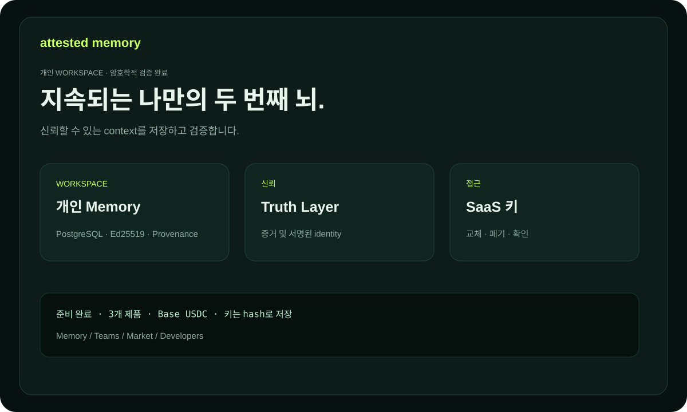

# Attested Memory — 문서

사람, 팀, 에이전트를 위한 내구성 있고 검증 가능한 지식 기반입니다. 각
Memory Unit에는 서명된 actor identity, 출처, truth status, provenance를 담을 수 있습니다.

## 제품

- **Personal Attested Memory** — 개인 의사결정과 리서치.
- **Team Memory OS** — 보호된 namespace 안의 팀 지식.
- **Expert Memory Market** — 출처가 있는 유료 전문가 지식.

## 처음 5분

1. `/billing`에서 플랜을 선택합니다.
2. 공개 EVM 주소로 정확한 invoice를 만듭니다.
3. Base에서 canonical USDC를 보내고 transaction hash를 확인합니다.
4. `ask_...` 키를 저장합니다. checkout에서 48시간 동안 복구할 수 있습니다.
5. actor identity를 연결하고 첫 Memory Unit을 작성합니다.

자세한 안내는 [USER_GUIDE.md](USER_GUIDE.md), 사례는 [USE_CASES.md](USE_CASES.md), 용어는 [GLOSSARY.md](GLOSSARY.md), trial은 [TRIAL.md](TRIAL.md), KOVA federation은 [KOVA_CAPABILITIES.md](KOVA_CAPABILITIES.md)를 참고하세요.

Expert Memory Market은 [구매자·publisher·통합 가이드](MARKET_GUIDE.md)와 [Market 사용 사례](MARKET_USE_CASES.md)를 참고하세요.

API 연동과 capability 게시는 [개발자 가이드](DEVELOPER_GUIDE.md)를 참고하세요.
