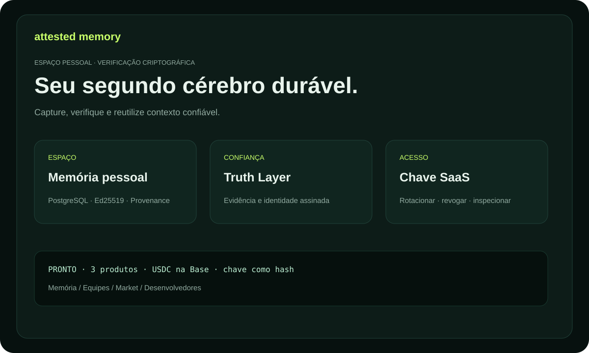

# Attested Memory — documentação

Memória durável e verificável para pessoas, equipes e agentes. Cada Memory Unit
pode carregar identidade assinada, fontes, status de veracidade e provenance.

## Produtos

- **Personal Attested Memory** — decisões e pesquisas pessoais.
- **Team Memory OS** — conhecimento da empresa em um namespace protegido.
- **Expert Memory Market** — conhecimento especializado pago e com fontes.

## Primeiros cinco minutos

1. Abra `/billing` e escolha um plano.
2. Crie uma invoice exata usando um endereço EVM público.
3. Envie USDC canônico na Base e confirme o hash da transação.
4. Guarde a chave `ask_...`; o checkout permite recuperá-la por 48 horas.
5. Conecte uma identidade de actor e crie sua primeira Memory Unit.

Guia completo: [USER_GUIDE.md](USER_GUIDE.md). Casos práticos: [USE_CASES.md](USE_CASES.md). Termos: [GLOSSARY.md](GLOSSARY.md). Trial: [TRIAL.md](TRIAL.md). KOVA federado: [KOVA_CAPABILITIES.md](KOVA_CAPABILITIES.md).

Para o Expert Memory Market: [guia de compra, publicação e integração](MARKET_GUIDE.md) e [casos de uso do mercado](MARKET_USE_CASES.md).

Para integração de API e publicação de capabilities: [guia do desenvolvedor](DEVELOPER_GUIDE.md).
