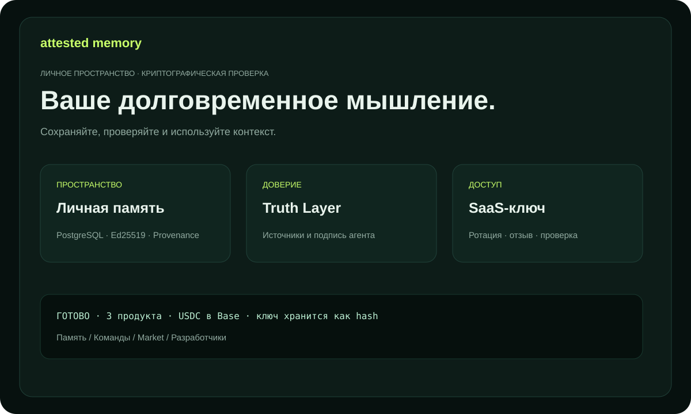

# Attested Memory — документация

Проверяемая память для людей, команд и агентов. Каждая Memory Unit может
содержать подпись агента, источники, статус истинности и запись происхождения.

## Продукты

- **Personal Attested Memory** — личные решения и исследования.
- **Team Memory OS** — общие знания компании с явными правами команды.
- **Expert Memory Market** — поиск и покупка экспертных знаний с источниками.

## Первые пять минут

1. Откройте `/billing` и выберите тариф.
2. Создайте точный инвойс, указав публичный EVM-адрес.
3. Отправьте canonical USDC в сети Base и подтвердите hash транзакции.
4. Сохраните ключ `ask_...`; восстановление через checkout доступно 48 часов.
5. Подключите actor identity и создайте первую Memory Unit.

Сервис никогда не получает приватный ключ кошелька. Подробности: [USER_GUIDE.md](USER_GUIDE.md), практические сценарии: [USE_CASES.md](USE_CASES.md), термины: [GLOSSARY.md](GLOSSARY.md), trial: [TRIAL.md](TRIAL.md), KOVA через федерацию: [KOVA_CAPABILITIES.md](KOVA_CAPABILITIES.md).

Для Expert Memory Market: [гайд покупателя, издателя и интегратора](MARKET_GUIDE.md) и [сценарии использования маркета](MARKET_USE_CASES.md).

Для API-интеграции и публикации capabilities: [руководство разработчика](DEVELOPER_GUIDE.md).
